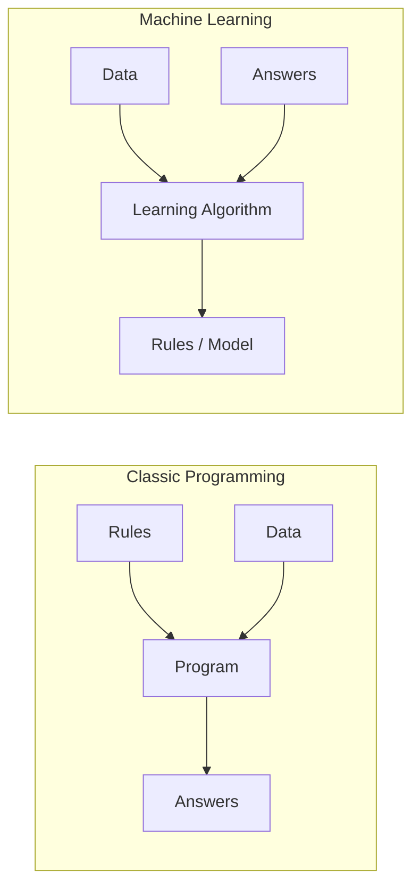
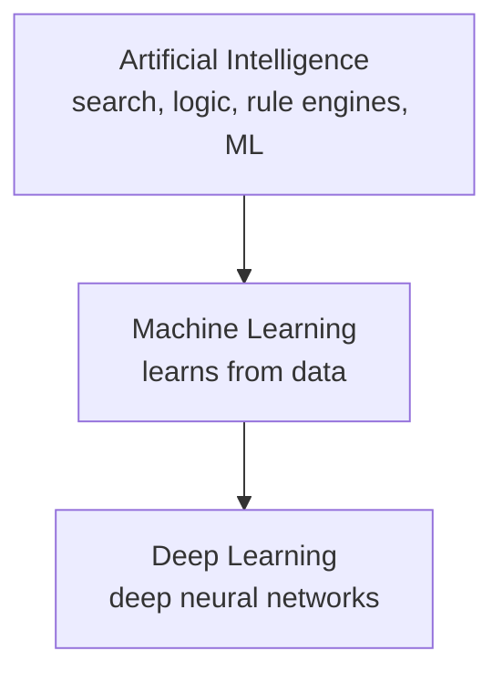
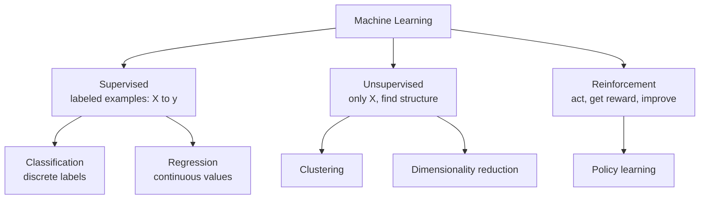
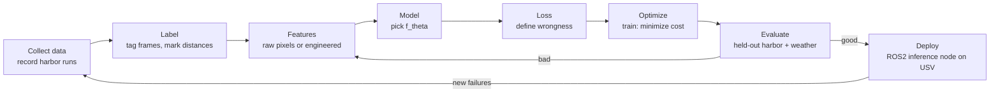

# 00 — What Is Machine Learning?

> Part 0 · Lesson 00 · Code stack: numpy-from-scratch

**Prerequisites:** none — start here.

**By the end you can:**
- Separate **AI**, **ML**, and **DL** and say where each one lives.
- Name the three learning paradigms (**supervised**, **unsupervised**, **reinforcement**) and pick the right one for a problem.
- Trace the **end-to-end ML workflow** from raw data to a deployed model.
- Decide when ML is the right tool — and when a plain `if` statement beats it.
- Frame a real robotics task (USV dock detection / obstacle avoidance) as an ML problem: inputs, outputs, paradigm.

---

## 1. Intuition

Classic programming and machine learning solve the same kind of problem from opposite ends.

In **classic programming**, *you* write the rules. "If the sonar return is closer than 3 m, turn starboard." You know the logic, you type it out, the computer runs it. The output is a *consequence* of rules you authored.

In **machine learning**, you don't write the rules. You hand the machine a pile of **examples** — pairs of (situation, correct answer) — and an algorithm searches for the rules that best reproduce those answers. The rules (called the **model**) are *discovered*, not authored.



The analogy I like: **classic programming is writing a recipe; ML is tasting 10,000 dishes and inferring the recipe.** You'd write a recipe when you already know how to cook the thing. You'd taste-and-infer when the dish is too subtle to describe in words — like "what does a dock *look* like in a camera frame, across fog, glare, and chop?" Nobody can write that `if` statement by hand. That's the gap ML fills.

**AI vs ML vs DL.** These get used interchangeably in marketing; they are not the same.

- **Artificial Intelligence (AI)** — the broad goal of making machines do things that look intelligent. Includes ML, but also hand-coded logic, search algorithms (A\* for path planning is AI and has *zero* learning in it), and rule engines.
- **Machine Learning (ML)** — the subset of AI where behavior is *learned from data* rather than hand-coded.
- **Deep Learning (DL)** — a subset of ML using **neural networks** with many layers. It's still "learn rules from data," but the model is a deep stacked function powerful enough to learn its own features. (We build these from lesson [09](09-neural-networks-mlp.md) onward.)



A useful sanity check: your A\* path planner and your PID controller are AI/control, **not** ML — there's nothing being learned. A model that predicts current drift from past IMU + GPS data *is* ML.

### The three learning paradigms

How the machine learns depends on what kind of feedback it gets.



- **Supervised learning** — you have inputs **and** the correct answers (**labels**). The model learns the mapping input → label. Splits into **classification** (label is a category: "dock" / "buoy" / "open water") and **regression** (label is a number: "distance to obstacle in meters"). This is most of lessons 02–13.
- **Unsupervised learning** — you have inputs but *no* answers. The model finds structure on its own: grouping similar lidar scans (**clustering**), or compressing a 64-channel sonar array into 3 meaningful axes (**dimensionality reduction**). Lesson [08](08-kmeans-pca.md).
- **Reinforcement learning (RL)** — an **agent** takes actions in an environment, receives a scalar **reward**, and learns a **policy** that maximizes long-term reward. This is how you'd train a USV to hold station in current, or a drone to land. No fixed "correct answer" per step — only delayed reward. (Beyond this course's core, but you'll recognize it.)

A quick decision rule: *Do I have labeled answers? → supervised. Just raw data, want structure? → unsupervised. An agent acting over time for reward? → reinforcement.*

---

## 2. The Math

The math here is light on purpose — lesson [01](01-math-foundations.md) builds the real toolbox. But the core *frame* of supervised learning is worth one set of symbols, because every later lesson is a variation on it.

We want to learn a function

$$
f_\theta : \mathcal{X} \rightarrow \mathcal{Y}
$$

where $\mathcal{X}$ is the **input space** (e.g. all possible sonar readings), $\mathcal{Y}$ is the **output space** (e.g. distance in meters, or the set of classes), and $\theta$ (theta) is the vector of **parameters** — the numbers the learning process tunes. A single input is $x \in \mathcal{X}$; its true answer is $y \in \mathcal{Y}$; the model's guess is $\hat{y} = f_\theta(x)$ ("y-hat").

We're given a **training set** of $n$ labeled examples:

$$
\mathcal{D} = \{(x^{(1)}, y^{(1)}), \dots, (x^{(n)}, y^{(n)})\}
$$

The superscript $(i)$ indexes examples (it is *not* an exponent). Each $x^{(i)}$ is usually a vector of **features** — measured quantities like $[\text{range}, \text{intensity}, \text{bearing}]$.

To say how *wrong* a guess is, we define a **loss function** $\ell(\hat{y}, y)$ that's small when the guess is good and large when it's bad. Averaging the loss over the whole training set gives the **cost** (or **empirical risk**):

$$
J(\theta) = \frac{1}{n} \sum_{i=1}^{n} \ell\big(f_\theta(x^{(i)}),\, y^{(i)}\big)
$$

Where does this come from? It's just "average mistake over the data I've seen." For regression a classic choice is **squared error** $\ell(\hat{y}, y) = (\hat{y} - y)^2$ (penalize big misses hard); for classification we'll use a different loss in lesson [04](04-logistic-regression.md).

**Training** = solving the optimization problem

$$
\theta^{*} = \arg\min_{\theta} \; J(\theta)
$$

i.e. find the parameters that make average loss smallest. We'll do this with **gradient descent** in lesson [03](03-gradient-descent.md). **Inference** = using the trained $f_{\theta^{*}}$ on a *new* $x$ to get $\hat{y}$.

The whole game in one sentence: **pick a model family $f_\theta$, define a loss, and search over $\theta$ to minimize average loss — while making sure it still works on data you haven't seen.** That last clause is **generalization**, and it's the hard part.

> **Generalization** is the difference between memorizing the training set and actually learning the pattern. A model that scores perfectly on training data but fails on new data has **overfit** — it memorized noise. Lesson [05](05-overfitting-evaluation.md) is entirely about measuring and fixing this.

---

## 3. Code

No real training yet — that starts in lesson 02. The goal here is to make the *loop* concrete with a tiny `numpy` example so the vocabulary stops being abstract. We'll fit the simplest possible model — a single number, the mean — to data, by literally trying values and watching the loss.

```python
import numpy as np

# ---- 1. DATA --------------------------------------------------------------
# Pretend a USV measured "distance to nearest obstacle" (meters) at 8 moments.
# In supervised learning these would be LABELS (y). Here, to keep it minimal,
# our "model" has no inputs x — it just predicts one constant value for all.
y = np.array([12.1, 11.8, 13.0, 12.5, 11.2, 12.9, 12.3, 12.7])

# ---- 2. MODEL -------------------------------------------------------------
# Our model family is trivial: f_theta(x) = theta, a single parameter.
# "Predict the same number every time." theta is what we're trying to learn.
def model(theta):
    return theta  # ignores input on purpose; simplest possible f_theta

# ---- 3. LOSS / COST -------------------------------------------------------
# Mean Squared Error: average of (prediction - truth)^2 over all examples.
def cost(theta, y):
    preds = model(theta)            # one number, broadcast against all y
    return np.mean((preds - y) ** 2)

# ---- 4. "OPTIMIZE" (brute-force search, just to SEE the minimum) ----------
# Real ML uses gradient descent (lesson 03). Here we scan candidate thetas.
candidates = np.linspace(10.0, 14.0, 401)     # 401 guesses from 10 to 14
costs = np.array([cost(t, y) for t in candidates])

best_idx   = np.argmin(costs)                  # index of smallest cost
theta_star = candidates[best_idx]              # the learned parameter
print(f"learned theta*: {theta_star:.3f}")     # -> learned theta*: 12.310
print(f"min cost:       {costs[best_idx]:.3f}")# -> min cost:       0.319

# Sanity check: for MSE, the optimal constant is exactly the mean of y.
print(f"mean of y:      {y.mean():.3f}")       # -> mean of y:      12.312
```

`theta_star` lands right on `y.mean()` — that's not a coincidence. For squared-error loss with a constant model, the cost $J(\theta) = \frac{1}{n}\sum (\theta - y^{(i)})^2$ is a parabola in $\theta$; setting its derivative to zero gives $\theta^{*} = \bar{y}$, the mean. You just did your first piece of ML math by brute force, and the analytic answer agrees. That parabola-with-a-bottom shape is the thing gradient descent will *roll down* in lesson 03.

Now visualize the **loss landscape** — the single most important picture in ML:

```python
import matplotlib.pyplot as plt

plt.figure(figsize=(6, 4))
plt.plot(candidates, costs, label="cost J(theta)")
plt.axvline(theta_star, color="red", linestyle="--",
            label=f"theta* = {theta_star:.2f}")
plt.xlabel("theta (predicted distance, m)")
plt.ylabel("mean squared error")
plt.title("Loss landscape: training = find the bottom of this curve")
plt.legend()
plt.tight_layout()
plt.show()
```

**What you should see:** a smooth U-shaped (parabolic) curve with its single lowest point at the red dashed line, around `theta = 12.31`. Training, in every later lesson, is the search for the bottom of a curve like this — except $\theta$ will have thousands or millions of dimensions instead of one, and we can't brute-force scan it.

---

## 4. Real Case

**Task: a USV must detect docks and avoid obstacles from its forward camera + sonar.** Let's frame it as ML instead of hand-coded rules.

Why not just write rules? You could try: "dock = large bright rectangle near the waterline." But docks vary (wood, concrete, floating, with/without boats), and lighting swings from dawn glare to fog. Each new `if` you add to patch a failure breaks two others. This is the classic sign you should *learn* the rule from examples instead of authoring it.

**Framing it, piece by piece:**

| ML concept | This task |
|---|---|
| **Input** $x$ | A camera frame (pixels) + a fused sonar/lidar range vector at that instant |
| **Features** | Could be raw pixels (DL learns its own features, lesson 13) or engineered: edge density, dominant range, intensity histogram |
| **Output** $y$ | Two heads: *(a)* class — `{dock, buoy, vessel, open_water}`; *(b)* number — distance to nearest obstacle (m) |
| **Paradigm** | (a) supervised **classification**; (b) supervised **regression** — both supervised because we'll label recorded runs |
| **Labels** | Humans annotate logged footage: draw boxes / tag frames. This is the expensive part. |
| **Loss** | Cross-entropy for the class head; squared error for the distance head (lessons 04, 02) |
| **Train / infer** | Train offline on the labeled log on a workstation/GPU; run **inference** live on the USV's onboard compute, in the ROS2 perception node |
| **Generalization** | The real test: does it work in a harbor it was *never trained on*, in weather it never saw? Measured on a held-out test set (lesson 05). |

The whole **end-to-end workflow** for this project:



Notice this is a **loop**, not a line. The USV hits a failure case in deployment — say it confuses a moored kayak for open water — and that failure becomes new labeled training data. That feedback loop is most of the real work; the model-fitting math is the easy 10%.

A grounding classic: the same supervised frame describes the **Iris** dataset (features = petal/sepal measurements, label = flower species, paradigm = classification) and **California housing** (features = block stats, label = median price, paradigm = regression). Same skeleton, different $x$ and $y$. Once you see the skeleton you see it everywhere.

---

## 5. Pitfalls & Tips

- **Don't reach for ML when rules work.** If you can write the `if` statement reliably (e.g. "halt if depth < 0.5 m"), do that — it's testable, debuggable, and has no training data cost. ML earns its keep only when the rule is too complex or fuzzy to author by hand.
- **No labels ≠ "just do unsupervised."** Unsupervised learning finds *structure*, not *your specific answer*. If you need "dock vs not-dock," clustering won't hand you that label for free — you need supervision somewhere. Many real projects die because nobody budgeted for labeling.
- **Train accuracy is a vanity metric.** A model can score 100% on data it has seen and be useless. Always judge on a **held-out** set the model never trained on. We formalize this in lesson 05 — internalize the instinct now.
- **Garbage in, garbage out — and it's mostly garbage in.** Mislabeled frames, a sonar that drifts after an hour, a camera with a smudged lens: the model faithfully learns your data's flaws. Expect to spend far more time on data than on models.
- **Distribution shift will bite you.** A model trained in a calm freshwater test pond can fail in salt water, chop, and glare. The deployment world rarely matches the training world; plan to measure and re-train.
- **AI ≠ ML ≠ DL — keep them straight.** Reaching for a deep neural net when linear regression (lesson 02) would do is a real and common mistake. Start simple; add complexity only when a simpler model provably falls short.

---

## 6. Check Your Understanding

**Q1.** Your teammate says "we used AI for the path planner — it's A\* search." Is that machine learning? Why or why not?

<details><summary>Answer</summary>

No. A\* is a **search algorithm** — it follows hand-coded logic to find a shortest path. Nothing is *learned from data*; the same inputs always produce the same output by fixed rules. It's AI (intelligent behavior) but not ML. It would only become ML if, say, you learned the edge-cost function from logged traversal data.

</details>

**Q2.** You have 50,000 logged sonar scans but **no** labels telling you what each scan contains. You want to discover whether the scans fall into a few natural "types." Which paradigm, and which sub-task?

<details><summary>Answer</summary>

**Unsupervised learning**, specifically **clustering** — grouping similar scans without any labels. (Lesson 08.) If you later wanted to *name* those clusters as "dock / open water / vessel," that naming step would require supervision — labels from a human.

</details>

**Q3.** In the symbols $f_\theta(x^{(i)}) = \hat{y}^{(i)}$ and label $y^{(i)}$, which one does the learning algorithm change during training, and which is fixed?

<details><summary>Answer</summary>

Training changes **$\theta$** (the parameters) to make $\hat{y}^{(i)} = f_\theta(x^{(i)})$ close to the true $y^{(i)}$. The data $x^{(i)}$ and the labels $y^{(i)}$ are **fixed** — they're the examples we're learning from. We tune the knobs ($\theta$), not the world.

</details>

**Q4.** A model gets 99% accuracy on the data it trained on but 61% on a new harbor it never saw. What's the name for this, and is the training number reassuring?

<details><summary>Answer</summary>

This is **overfitting** — the model memorized the training set (including its noise/quirks) instead of learning a pattern that **generalizes**. The 99% is *not* reassuring; it's almost a warning sign. The 61% on unseen data is the number that matters. (Lesson 05 is devoted to detecting and fixing this.)

</details>

**Q5.** Why is the end-to-end ML workflow drawn as a loop instead of a straight line from data to deployment?

<details><summary>Answer</summary>

Because deployment surfaces new failure cases (new harbors, new weather, mislabeled edge cases) that feed back into data collection and labeling. Real ML systems are continuously evaluated and re-trained; "ship once and forget" almost never holds. The model-fitting step is a small slice of an ongoing cycle dominated by data work.

</details>

---

## Recap & Next

- **AI ⊃ ML ⊃ DL**: AI is the broad goal, ML learns rules from data, DL uses deep neural networks. A\* and PID are AI/control but *not* ML.
- Three paradigms: **supervised** (labeled X→y; classification + regression), **unsupervised** (structure from unlabeled X), **reinforcement** (act → reward → policy).
- Supervised learning in one frame: pick a model $f_\theta$, define a **loss**, and **minimize average loss** over training data — then check it **generalizes** to unseen data.
- The end-to-end workflow — data → features → model → loss → optimize → evaluate → deploy — is a **loop**, and the data work dwarfs the math.
- Use ML only when rules are too complex to author by hand; otherwise an `if` statement wins.

Next we build the actual toolbox — vectors, matrices, derivatives, and probability — that makes all of this computable: **[01 — The Math Toolbox](01-math-foundations.md)**.
