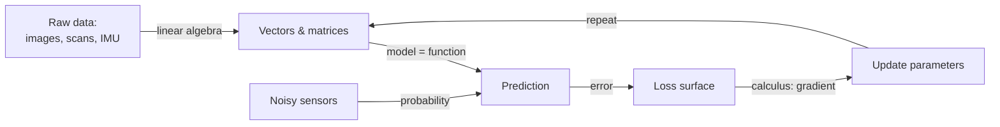

# 01 — The Math Toolbox

> Part 0 · Lesson 01 · Code stack: numpy-from-scratch

**Prerequisites:** [00 — What Is Machine Learning?](00-what-is-ml.md)

**By the end you can:**
- Read and manipulate **scalars, vectors, matrices, and tensors** in NumPy, and explain what each represents.
- Compute and *interpret* the **dot product**, matrix products, transpose, inverse, and **L1/L2 norms** geometrically.
- Explain a **derivative as slope**, a **gradient as the direction of steepest ascent**, and use the **chain rule** (the seed of backprop).
- Reason about **random variables, distributions, mean, variance, the Gaussian, conditional probability, and Bayes' rule**.
- Tie it all back to robotics: represent IMU/heading readings as vectors and use the dot product to measure how aligned two headings are.

This lesson is the toolbox. Every later lesson reaches into it. You don't need to memorize proofs — you need *fluent intuition* plus the few formulas that show up everywhere. We'll build each idea with a short NumPy snippet and a picture.

---

## 1. Intuition

Machine learning is mostly three kinds of math wearing a trench coat:

1. **Linear algebra** — how we *store and transform* data. A camera frame, a lidar scan, a batch of IMU samples: all just arrays of numbers. Linear algebra is the grammar for combining them.
2. **Calculus** — how we *improve*. Training a model = nudging numbers downhill on an error surface. The gradient tells us which way is downhill.
3. **Probability** — how we *handle uncertainty*. Sensors are noisy, the world is partly unknown. Probability lets us say "the obstacle is *probably* 3 m ahead" instead of pretending we know exactly.

A useful analogy: think of training a model like **piloting a USV toward a buoy in fog**.
- The **state** (position, heading, speed) is a *vector* — linear algebra.
- "Which way do I turn to reduce my distance to the buoy fastest?" is a *gradient* — calculus.
- "Where is the buoy, given a noisy radar ping?" is *inference under uncertainty* — probability.



Keep that loop in mind: **represent → predict → measure error → follow the gradient downhill → repeat.** Everything below is the machinery for one of those arrows.

---

## 2. The Math

### 2.1 Scalars, vectors, matrices, tensors

These are just containers indexed by 0, 1, 2, or more axes.

- A **scalar** is a single number, e.g. $x = 3.0$. Zero axes.
- A **vector** is an ordered list, $\mathbf{v} \in \mathbb{R}^n$. One axis. We write it as a column:

$$\mathbf{v} = \begin{bmatrix} v_1 \\ v_2 \\ \vdots \\ v_n \end{bmatrix}, \qquad v_i \in \mathbb{R}.$$

Here $\mathbb{R}^n$ means "the space of $n$ real numbers"; $v_i$ is the $i$-th **component**.
- A **matrix** $A \in \mathbb{R}^{m \times n}$ is a grid with $m$ rows and $n$ columns. Two axes. Entry $A_{ij}$ sits in row $i$, column $j$.
- A **tensor** is the general term for any number of axes. A color image is a 3-axis tensor $\mathbb{R}^{H \times W \times 3}$ (height, width, color channel); a batch of images adds a 4th axis. In deep learning, "tensor" is just "n-dimensional array."

Think of the axis count as the number of indices you need to point at one number.

### 2.2 Dot product — the most important operation in ML

For two vectors $\mathbf{a}, \mathbf{b} \in \mathbb{R}^n$, the **dot product** is

$$\mathbf{a} \cdot \mathbf{b} = \sum_{i=1}^{n} a_i b_i.$$

That's the algebra. The *geometry* is what matters:

$$\mathbf{a} \cdot \mathbf{b} = \|\mathbf{a}\|\,\|\mathbf{b}\|\cos\theta,$$

where $\|\mathbf{a}\|$ is the length of $\mathbf{a}$ (defined in 2.5) and $\theta$ is the angle between the two vectors. **Where this comes from:** it's the law of cosines rearranged — expand $\|\mathbf{a}-\mathbf{b}\|^2$ and the cross term *is* the dot product. The takeaway:

- Dot product **measures alignment**. Same direction → large positive. Perpendicular ($\theta = 90°$) → zero. Opposite → negative.
- A neuron computing $\mathbf{w}\cdot\mathbf{x}$ is literally asking "how aligned is the input with this learned pattern?" This single idea reappears in linear regression, logistic regression, attention, and convolutions.

### 2.3 Matrix–vector and matrix–matrix multiplication

A matrix is a **function that transforms vectors**. Multiplying $A \in \mathbb{R}^{m\times n}$ by $\mathbf{x} \in \mathbb{R}^n$ gives $\mathbf{y} \in \mathbb{R}^m$:

$$y_i = \sum_{j=1}^{n} A_{ij}\,x_j \quad\Longleftrightarrow\quad \mathbf{y} = A\mathbf{x}.$$

Read each output component $y_i$ as **the dot product of row $i$ of $A$ with $\mathbf{x}$**. So matrix-vector multiply is just "a stack of dot products." Geometrically, $A$ rotates / scales / shears / projects the input.

For two matrices $A \in \mathbb{R}^{m\times k}$ and $B \in \mathbb{R}^{k\times n}$:

$$(AB)_{ij} = \sum_{p=1}^{k} A_{ip}\,B_{pj}, \qquad AB \in \mathbb{R}^{m\times n}.$$

The **inner dimensions must match** ($k = k$); the result takes the outer dimensions. $(AB)_{ij}$ is the dot product of row $i$ of $A$ with column $j$ of $B$. Composing matrices = composing transformations. A neural network layer is exactly this: $\mathbf{y} = W\mathbf{x} + \mathbf{b}$.

### 2.4 Transpose, identity, inverse

The **transpose** $A^\top$ flips rows and columns: $(A^\top)_{ij} = A_{ji}$. It turns a column vector into a row vector, which is why you'll see the dot product written $\mathbf{a}^\top\mathbf{b}$.

The **identity** $I$ is the "do nothing" matrix — 1s on the diagonal, 0s elsewhere — so $I\mathbf{x} = \mathbf{x}$.

The **inverse** $A^{-1}$ undoes $A$: $A^{-1}A = I$. Intuition: if $A$ rotates and stretches space, $A^{-1}$ rotates and stretches it back. It only exists if $A$ is square and doesn't collapse any dimension to zero (non-zero determinant). In ML we *rarely* compute inverses directly (they're expensive and numerically fragile) — we solve systems or run gradient descent instead — but the *concept* "is this transformation reversible?" matters, e.g. for the normal equations in linear regression.

### 2.5 Norms — measuring size

A **norm** measures the length of a vector. The two you'll use constantly:

$$\|\mathbf{v}\|_2 = \sqrt{\sum_i v_i^2} \quad(\text{L2, Euclidean}), \qquad \|\mathbf{v}\|_1 = \sum_i |v_i| \quad(\text{L1, Manhattan}).$$

- **L2** is straight-line distance (Pythagoras in $n$ dimensions) — the cost of error in least-squares, and the foundation of "how far apart are these two feature vectors?"
- **L1** is total absolute travel (city blocks). It shows up in **L1 regularization**, which drives weights to *exactly zero* and produces sparse models (you'll see why in [05 — Overfitting & Regularization](05-overfitting-evaluation.md)).

### 2.6 Calculus: derivative, partials, gradient

The **derivative** of a single-variable function $f$ is the slope of its tangent line — the instantaneous rate of change:

$$f'(x) = \frac{df}{dx} = \lim_{h\to 0}\frac{f(x+h) - f(x)}{h}.$$

It answers "if I nudge $x$ a tiny bit, how much does $f$ move, and in which direction?"

When $f$ depends on many variables, $f(x_1, \dots, x_n)$, a **partial derivative** $\frac{\partial f}{\partial x_i}$ is the slope *along one axis*, holding the others fixed. Collect all partials into one vector and you get the **gradient**:

$$\nabla f = \left[\frac{\partial f}{\partial x_1},\ \frac{\partial f}{\partial x_2},\ \dots,\ \frac{\partial f}{\partial x_n}\right]^\top.$$

**Key fact:** the gradient points in the direction of **steepest ascent** — the fastest way *uphill* on the surface $f$. So $-\nabla f$ points downhill. That's the entire idea behind training: to *minimize* a loss, step against its gradient. **Why it points uphill:** the change in $f$ for a small step $\mathbf{u}$ is $\approx \nabla f \cdot \mathbf{u}$ (a dot product!), which — by 2.2 — is maximized when $\mathbf{u}$ aligns with $\nabla f$.

### 2.7 The chain rule — the seed of backpropagation

If you compose functions, $z = f(g(x))$, the derivative multiplies the local slopes:

$$\frac{dz}{dx} = \frac{dz}{dg}\cdot\frac{dg}{dx}.$$

Intuition: gears. If gear A turns gear B at ratio $\frac{dg}{dx}$ and B turns C at ratio $\frac{dz}{dg}$, the overall ratio is their product. A deep network is a long chain of functions $f_L(\dots f_2(f_1(x)))$; **backpropagation** ([10 — Backpropagation](10-backpropagation.md)) is just the chain rule applied layer by layer, multiplying local slopes from the output back to the input. Lock this in now and backprop will feel inevitable later.

### 2.8 Probability: random variables, distributions, mean, variance

A **random variable** $X$ is a quantity whose value is uncertain — e.g. a single noisy depth reading from a sonar. A **probability distribution** describes how likely each value is. For continuous $X$ we use a **probability density** $p(x)$ with $\int p(x)\,dx = 1$.

The **mean / expectation** is the long-run average — the "center of mass":

$$\mu = \mathbb{E}[X] = \int x\,p(x)\,dx \quad\Big(\text{or } \textstyle\sum_x x\,p(x)\text{ for discrete }X\Big).$$

The **variance** measures spread (how noisy):

$$\sigma^2 = \operatorname{Var}[X] = \mathbb{E}\big[(X-\mu)^2\big],$$

and $\sigma$ (the **standard deviation**) is in the same units as $X$.

The **Gaussian (normal)** distribution is the default model for sensor noise (thanks to the Central Limit Theorem — sums of many small independent errors look Gaussian):

$$p(x) = \frac{1}{\sqrt{2\pi\sigma^2}}\exp\!\left(-\frac{(x-\mu)^2}{2\sigma^2}\right).$$

It's fully described by just $\mu$ (center) and $\sigma$ (width). About 68% of mass lies within $\pm\sigma$, 95% within $\pm 2\sigma$.

### 2.9 Conditional probability and Bayes' rule

$P(A \mid B)$ is the probability of $A$ **given that** $B$ happened. By definition $P(A\mid B) = \frac{P(A,B)}{P(B)}$. Rearranging the joint two ways gives **Bayes' rule**:

$$P(A \mid B) = \frac{P(B \mid A)\,P(A)}{P(B)}.$$

In words: **posterior** $\propto$ **likelihood** $\times$ **prior**. This is how a robot fuses a noisy measurement ($B$) with what it already believed ($P(A)$) to get an updated belief ($P(A\mid B)$) — the mathematical heart of Kalman filters, particle filters, and Bayesian inference. It also underpins classifiers like Naive Bayes.

---

## 3. Code

Pure NumPy — no ML libraries yet. We build the toolbox by hand so the operations stop being magic.

```python
import numpy as np

# ----- 3.1 Scalars, vectors, matrices, tensors -----
scalar = np.array(3.0)              # 0 axes
vector = np.array([1.0, 2.0, 3.0])  # 1 axis, shape (3,)
matrix = np.array([[1.0, 2.0],
                   [3.0, 4.0],
                   [5.0, 6.0]])     # 2 axes, shape (3, 2)
tensor = np.zeros((2, 3, 4))        # 3 axes, e.g. 2 RGB-ish frames

# .ndim = number of axes, .shape = size along each axis
print(scalar.ndim, vector.shape, matrix.shape, tensor.shape)
# -> 0 (3,) (3, 2) (2, 3, 4)
```

```python
# ----- 3.2 Dot product and its geometry -----
a = np.array([1.0, 0.0])   # pointing east
b = np.array([1.0, 1.0])   # pointing northeast

dot = np.dot(a, b)                          # = 1*1 + 0*1 = 1
cos_theta = dot / (np.linalg.norm(a) * np.linalg.norm(b))
angle_deg = np.degrees(np.arccos(cos_theta))
print(dot, round(cos_theta, 3), round(angle_deg, 1))
# -> 1.0 0.707 45.0   (the vectors are 45 degrees apart)

# Perpendicular vectors have zero dot product:
print(np.dot(np.array([1.0, 0.0]), np.array([0.0, 1.0])))
# -> 0.0
```

```python
# ----- 3.3 Matrix-vector and matrix-matrix multiplication -----
A = np.array([[1.0, 2.0],
              [3.0, 4.0]])
x = np.array([1.0, 1.0])

print(A @ x)            # each output = dot(row_i, x): [1+2, 3+4]
# -> [3. 7.]

B = np.array([[1.0, 0.0],
              [0.0, 2.0]])   # scale y by 2
print(A @ B)            # compose transforms; inner dims (2==2) match
# -> [[1. 4.]
#     [3. 8.]]
```

```python
# ----- 3.4 Transpose, identity, inverse -----
print(A.T)                      # rows <-> columns
# -> [[1. 3.]
#     [2. 4.]]

I = np.eye(2)                   # identity
print(np.allclose(A @ I, A))    # I does nothing
# -> True

A_inv = np.linalg.inv(A)        # exists: det(A) = -2 != 0
print(np.allclose(A_inv @ A, I))
# -> True
```

```python
# ----- 3.5 Norms -----
v = np.array([3.0, -4.0])
print(np.linalg.norm(v, 2))     # L2: sqrt(9 + 16) = 5
print(np.linalg.norm(v, 1))     # L1: |3| + |-4| = 7
# -> 5.0
# -> 7.0
```

### Visualizing the gradient as a vector field

We'll take the bowl-shaped surface $f(x,y) = x^2 + y^2$. Its gradient is $\nabla f = [2x,\ 2y]$, which always points *outward and uphill*. Negating it points to the minimum at the origin — exactly the direction gradient descent travels.

```python
import numpy as np
import matplotlib.pyplot as plt

# Grid of (x, y) points
xs = np.linspace(-3, 3, 20)
ys = np.linspace(-3, 3, 20)
X, Y = np.meshgrid(xs, ys)

# f(x,y) = x^2 + y^2   ->   grad f = [2x, 2y]
U, V = 2 * X, 2 * Y                       # gradient components (uphill)

fig, ax = plt.subplots(figsize=(6, 6))
# Filled contours show the "height" of the bowl
ax.contourf(X, Y, X**2 + Y**2, levels=20, alpha=0.6, cmap="viridis")
# Arrows show the NEGATIVE gradient: the downhill direction
ax.quiver(X, Y, -U, -V, color="white")
ax.set_title(r"$-\nabla f$ for $f=x^2+y^2$ (arrows point downhill)")
ax.set_xlabel("x"); ax.set_ylabel("y"); ax.set_aspect("equal")
plt.tight_layout(); plt.show()
```

**What you should see:** concentric contour rings (the bowl seen from above) with white arrows everywhere pointing *toward the center*. Every arrow is the direction gradient descent would step from that point — straight at the minimum.

### Plotting a Gaussian

```python
import numpy as np
import matplotlib.pyplot as plt

def gaussian(x, mu, sigma):
    # The normal density from section 2.8
    coeff = 1.0 / np.sqrt(2 * np.pi * sigma**2)
    return coeff * np.exp(-((x - mu) ** 2) / (2 * sigma**2))

x = np.linspace(-6, 6, 400)
plt.figure(figsize=(7, 4))
for sigma in (0.5, 1.0, 2.0):
    plt.plot(x, gaussian(x, mu=0.0, sigma=sigma), label=f"$\\sigma={sigma}$")
plt.title("Gaussian: same center, different spreads")
plt.xlabel("x"); plt.ylabel("p(x)"); plt.legend()
plt.tight_layout(); plt.show()
```

**What you should see:** three bell curves centered at 0. Smaller $\sigma$ = taller and narrower (confident, low-noise); larger $\sigma$ = shorter and wider (uncertain, high-noise). All enclose area 1.

```python
# ----- Empirical mean & variance from samples (Monte Carlo) -----
rng = np.random.default_rng(0)
samples = rng.normal(loc=2.0, scale=1.5, size=100_000)   # mu=2, sigma=1.5
print(round(samples.mean(), 3), round(samples.var(), 3))
# -> 1.999 2.251    (var approx sigma^2 = 1.5^2 = 2.25)
```

---

## 4. Real Case: IMU/heading vectors and the dot product

You're running an autonomous **USV** with an **IMU** that reports the boat's heading, and a planner that emits a desired heading toward the next waypoint. Both headings are just **unit vectors** in the water-plane:

$$\mathbf{h}_{\text{imu}} = \begin{bmatrix}\cos\psi \\ \sin\psi\end{bmatrix}, \qquad \mathbf{h}_{\text{goal}} = \begin{bmatrix}\cos\phi \\ \sin\phi\end{bmatrix},$$

where $\psi$ is the measured yaw and $\phi$ the target bearing. The **dot product measures alignment** — exactly the heading error a controller cares about:

$$\mathbf{h}_{\text{imu}} \cdot \mathbf{h}_{\text{goal}} = \cos(\psi - \phi).$$

- Dot product near $+1$ → headings aligned, hold course.
- Near $0$ → 90° off, turn hard.
- Negative → pointing the wrong way, you've overshot or the waypoint is behind you.

This is why the dot product is the right "alignment sensor." It also gives you the *sign* of the turn via the 2D cross product ($h_{x}g_{y} - h_{y}g_{x}$): positive = turn left, negative = turn right.

```python
import numpy as np

def heading_vec(psi_rad):
    """Unit heading vector from a yaw angle."""
    return np.array([np.cos(psi_rad), np.sin(psi_rad)])

# IMU says we're pointing 30 deg; planner wants 80 deg.
h_imu  = heading_vec(np.radians(30))
h_goal = heading_vec(np.radians(80))

alignment = np.dot(h_imu, h_goal)              # cos of the heading error
error_deg = np.degrees(np.arccos(np.clip(alignment, -1, 1)))

cross = h_imu[0]*h_goal[1] - h_imu[1]*h_goal[0]  # sign => turn direction
turn = "left" if cross > 0 else "right"

print(round(alignment, 3), round(error_deg, 1), turn)
# -> 0.643 50.0 left   (50 deg off, steer left toward the waypoint)
```

The same dot-product-as-alignment idea scales up: stack a batch of $N$ heading vectors into a matrix $H \in \mathbb{R}^{N\times 2}$ and compute alignments against a goal in one matrix-vector multiply $H\,\mathbf{h}_{\text{goal}}$ — vectorized, no Python loop. That is the exact pattern a neural network uses to score many inputs against learned weights at once.

For a grounded *classic* dataset to practice these primitives on, load **Iris** (`sklearn.datasets.load_iris`): each flower is a 4-D feature vector, and L2 distance between vectors is all you need to start clustering or doing nearest-neighbor classification ([06 — k-NN](06-knn-trees-ensembles.md)).

---

## 5. Pitfalls & Tips

- **Shape mismatches are the #1 NumPy bug.** Print `.shape` constantly. For $AB$, the inner dimensions must match: $(m\times k)(k\times n)$. A `ValueError: matmul: ... mismatch` almost always means a transpose is missing.
- **Broadcasting is a feature *and* a trap.** `np.array([1,2,3]) + np.array([[1],[2]])` silently produces a $2\times3$ result. Convenient, but it hides bugs — assert the output shape you expect.
- **Don't invert matrices.** `np.linalg.inv(A) @ b` is slower and less stable than `np.linalg.solve(A, b)`. Inverses are a *concept* for understanding, not usually a computation you run.
- **Row vector vs column vector.** A 1-D NumPy array of shape `(n,)` is neither; `A @ x` and `x @ A` both "work" by auto-orienting it, which can mask a logic error. When it matters, be explicit with `x.reshape(-1, 1)`.
- **Gradient points *uphill*.** To *minimize* a loss you step along $-\nabla f$. Flipping this sign is a classic training bug — your loss will *grow*.
- **Variance is in squared units.** A depth sensor with $\sigma = 0.1\,\text{m}$ has variance $0.01\,\text{m}^2$. Report $\sigma$ (meters) to humans, but algorithms often carry $\sigma^2$.

---

## 6. Check Your Understanding

**Q1.** Two heading vectors give a dot product of exactly $0$. What's the angle between them, and what should a USV controller do?

<details><summary>Answer</summary>
$\cos\theta = 0 \Rightarrow \theta = 90°$. The boat is pointed perpendicular to the desired heading — a large error. The controller should command a hard turn; the 2D cross-product sign tells it left vs. right.
</details>

**Q2.** You have $A \in \mathbb{R}^{4\times 3}$ and $\mathbf{x} \in \mathbb{R}^{3}$. What is the shape of $A\mathbf{x}$, and what is each output component?

<details><summary>Answer</summary>
$A\mathbf{x} \in \mathbb{R}^{4}$. Output component $i$ is the dot product of row $i$ of $A$ (length 3) with $\mathbf{x}$ (length 3): $y_i = \sum_{j=1}^{3} A_{ij}x_j$.
</details>

**Q3.** For $f(x, y) = x^2 + y^2$, compute $\nabla f$ at the point $(1, 2)$. Which direction reduces $f$ fastest?

<details><summary>Answer</summary>
$\nabla f = [2x, 2y] = [2, 4]$ at $(1,2)$. That's the steepest-*ascent* direction. To reduce $f$ fastest, step along $-\nabla f = [-2, -4]$ — back toward the origin (the minimum).
</details>

**Q4.** Why is the chain rule called "the seed of backpropagation"?

<details><summary>Answer</summary>
A neural network is a composition of many functions (layers). The chain rule says the derivative of a composition is the product of the local derivatives. Backprop computes the loss gradient w.r.t. every parameter by multiplying these local derivatives from the output layer back to the input — the chain rule applied repeatedly and efficiently.
</details>

**Q5.** A sonar's depth reading is modeled as Gaussian with $\mu = 5.0\,\text{m}$, $\sigma = 0.2\,\text{m}$. Roughly what range contains 95% of readings? Using Bayes' rule, what would you combine this measurement with to estimate true depth?

<details><summary>Answer</summary>
About $\mu \pm 2\sigma = 5.0 \pm 0.4$, i.e. $[4.6, 5.4]\,\text{m}$. Bayes: combine the **likelihood** $P(\text{reading}\mid\text{depth})$ (this Gaussian) with a **prior** belief $P(\text{depth})$ (e.g. from a chart or the previous estimate) to get the **posterior** $P(\text{depth}\mid\text{reading})$ — exactly what a Kalman filter does.
</details>

---

## Recap & Next

- **Linear algebra = representation.** Data is vectors/matrices/tensors; the **dot product measures alignment** and is the atom of nearly every ML operation; matrices are transformations you compose.
- **Norms measure size/distance** — L2 (Euclidean) for least-squares and similarity, L1 (Manhattan) for sparsity.
- **Calculus = improvement.** Derivative = slope, **gradient = steepest-ascent direction**, so $-\nabla f$ is downhill. The **chain rule** chains local slopes — that's backprop in embryo.
- **Probability = uncertainty.** Random variables have distributions summarized by **mean and variance**; the **Gaussian** models sensor noise; **Bayes' rule** updates belief = likelihood × prior.
- You connected it to robotics by treating IMU/heading readings as vectors and using the dot product as an alignment sensor.

Next we put the whole loop — represent, predict, measure error, follow the gradient — to work on a real model.

➡️ **[02 — Linear Regression](02-linear-regression.md)**
