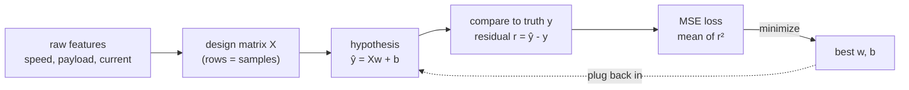
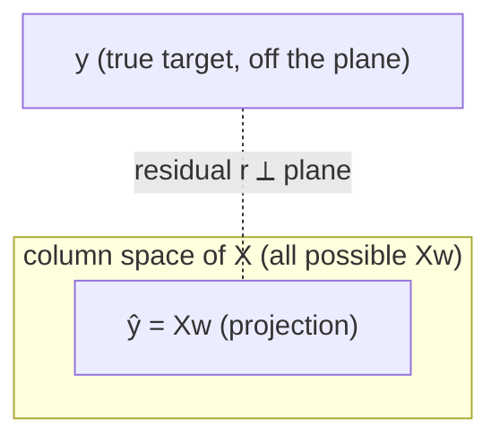

# 02 — Linear Regression

> Part 1 · Lesson 02 · Code stack: numpy-from-scratch

**Prerequisites:** [01 — The Math Toolbox](01-math-foundations.md)

**By the end you can:**
- Write the linear hypothesis $\hat{y} = Xw + b$ and assemble a **design matrix** from raw features.
- Explain *why* we square the error and what the **mean squared error (MSE)** loss is actually measuring.
- Derive and use the **normal equation** $w = (X^\top X)^{-1} X^\top y$ and read it as a geometric **projection**.
- Implement the whole thing in NumPy: generate data, fit, plot the line, plot residuals.
- Recognize when **feature scaling** matters (and when, for the normal equation, it doesn't).

---

## 1. Intuition

Linear regression is the simplest useful predictor: assume the thing you want to predict is a **weighted sum of your inputs**, plus a constant offset. That's it. Everything else in this course — logistic regression, neural nets, transformers — is this idea with twists bolted on, so it pays to understand it cold.

Concrete analogy for your world: your USV draws power as it moves. You suspect power is roughly proportional to speed (plus a baseline draw from electronics that's always on). So you guess:

$$\text{power} \approx w \cdot \text{speed} + b$$

$w$ is "watts per (m/s)" — the slope, how steeply power climbs with speed. $b$ is the baseline draw at zero speed — the intercept. Linear regression's job is to look at logged `(speed, power)` pairs and pick the $w$ and $b$ that make the line pass through the cloud of points *as closely as possible*. "As closely as possible" is the part we have to make precise, and that precision is the whole lesson.



The key mental picture: we have a cloud of data points, and we slide/tilt a line (or in higher dimensions, a flat plane/hyperplane) until the total squared vertical gap to the points is as small as it can be. Because the loss is a smooth bowl, there's exactly one best line, and we can solve for it directly — no trial and error needed. That direct solution is the normal equation.

---

## 2. The Math

### Hypothesis and the design matrix

We have $n$ samples, each with $d$ features. Stack them as a matrix $X \in \mathbb{R}^{n \times d}$ where row $i$ is one sample's features. The **weight vector** $w \in \mathbb{R}^d$ holds one coefficient per feature, and the **bias** (intercept) $b \in \mathbb{R}$ is a single scalar offset. The prediction for all samples at once is:

$$\hat{y} = Xw + b \quad\in \mathbb{R}^n$$

Here $\hat{y}_i$ is the predicted target for sample $i$, and $y_i$ is the true target. Carrying $b$ around separately is annoying, so the standard trick is to **absorb the bias into the weights**: prepend a column of ones to $X$. Define the **augmented design matrix** $\tilde{X} = [\mathbf{1} \mid X] \in \mathbb{R}^{n \times (d+1)}$ and the extended weights $\tilde{w} = [b, w_1, \dots, w_d]^\top$. Then

$$\hat{y} = \tilde{X}\tilde{w}.$$

The column of ones works because that feature is always $1$, so its coefficient $b$ gets added to every prediction unconditionally — exactly what an intercept does. From here I'll drop the tildes and just write $X$ and $w$, with the ones-column assumed.

### The MSE loss — and why squared

We measure miss with the **residual** $r_i = \hat{y}_i - y_i$. The **mean squared error** is the average of the squared residuals:

$$L(w) = \frac{1}{n}\sum_{i=1}^{n}(\hat{y}_i - y_i)^2 = \frac{1}{n}\lVert Xw - y \rVert_2^2$$

where $\lVert \cdot \rVert_2$ is the Euclidean (L2) norm. Why *square* the error instead of, say, taking absolute values?

- **Sign-blind and smooth.** Squaring kills the sign (over- and under-shooting both cost you) and, unlike $|r|$, is differentiable everywhere — including at zero. That smoothness is what lets us set a derivative to zero and solve in closed form.
- **It's a paraboloid.** As a function of $w$, $L$ is a convex quadratic bowl with a single global minimum. No local minima to get stuck in.
- **Statistical meaning.** If the noise on $y$ is Gaussian, minimizing squared error is exactly **maximum likelihood** estimation (we'll revisit this in [05 — Overfitting & Evaluation](05-overfitting-evaluation.md)). The bell curve and the parabola are the same story: $\log(e^{-r^2}) = -r^2$.

The flip side, worth flagging now: squaring also means **outliers dominate**. A residual of 10 contributes 100; ten residuals of 1 contribute 10 total. One bad sonar reading can drag your whole fit.

### The normal equation

To minimize the bowl, take the gradient of $L$ with respect to $w$ and set it to zero. Using $\lVert Xw - y\rVert^2 = (Xw-y)^\top(Xw-y)$ and the matrix-calculus rule $\nabla_w (Xw-y)^\top(Xw-y) = 2X^\top(Xw - y)$:

$$\nabla_w L = \frac{2}{n} X^\top (Xw - y) = 0 \;\Longrightarrow\; X^\top X w = X^\top y.$$

Those last equations are the **normal equations**. Solve for $w$:

$$\boxed{\,w = (X^\top X)^{-1} X^\top y\,}$$

provided $X^\top X$ is invertible (it is, as long as your feature columns aren't redundant — more in Pitfalls). $X^\top X \in \mathbb{R}^{(d+1)\times(d+1)}$ is small (one row/column per feature), so inverting it is cheap even with millions of samples.

### Geometric meaning: projection onto the column space

This is the part worth really internalizing. Think of $y$ as a single point in $\mathbb{R}^n$ (one coordinate per sample). The set of *all possible predictions* $Xw$ — as $w$ ranges over everything — is the **column space** of $X$: the subspace spanned by your feature columns. Usually $y$ does **not** lie in that subspace (your features can't perfectly explain the target), so the best we can do is find the point in the subspace *closest* to $y$. The closest point is the **orthogonal projection** of $y$ onto the column space.

"Closest in Euclidean distance" is literally "smallest $\lVert Xw - y\rVert$" — the same thing MSE minimizes. And orthogonal projection means the residual vector $r = Xw - y$ is **perpendicular to every feature column**, i.e. $X^\top r = 0$, which rearranges to $X^\top X w = X^\top y$. So the normal equation *is* the statement "make the residual orthogonal to the column space."



The fitted $\hat{y} = X(X^\top X)^{-1}X^\top y = Hy$, where $H = X(X^\top X)^{-1}X^\top$ is the **hat matrix** (it "puts the hat on $y$"). $H$ is a projection: $H^2 = H$. You don't need to memorize that, but it's a clean way to see that fitting is *projecting*.

---

## 3. Code

Pure NumPy, no scikit-learn. We generate synthetic USV power data, fit with the normal equation, and plot. (Iterative fitting via gradient descent is the *next* lesson — here we solve directly.)

```python
import numpy as np
import matplotlib.pyplot as plt

rng = np.random.default_rng(42)  # reproducible randomness

# --- 1. Generate synthetic data -------------------------------------------
# Pretend we logged a USV cruising at various speeds and recorded power draw.
# Ground truth we are pretending NOT to know: power = 18 * speed + 40 + noise
n = 80
speed = rng.uniform(0.0, 6.0, size=n)          # m/s, n samples
true_w, true_b = 18.0, 40.0                     # watts per (m/s), baseline watts
noise = rng.normal(0.0, 12.0, size=n)           # sensor/measurement noise
power = true_w * speed + true_b + noise          # observed target y

# --- 2. Build the augmented design matrix ---------------------------------
# Prepend a column of ones so the bias is just another weight.
# X has shape (n, 2): column 0 = ones (bias), column 1 = speed.
X = np.column_stack([np.ones(n), speed])         # shape (80, 2)
y = power                                         # shape (80,)

# --- 3. Solve the normal equation: w = (XᵀX)⁻¹ Xᵀ y ------------------------
# We use np.linalg.solve(A, b) instead of inv(A) @ b: it solves A w = b
# directly, which is faster and numerically more stable than forming inv(A).
XtX = X.T @ X                                     # (2, 2)
Xty = X.T @ y                                     # (2,)
w = np.linalg.solve(XtX, Xty)                     # [bias, slope]
print(f"fitted bias b = {w[0]:.2f}, slope = {w[1]:.2f}")
# -> fitted bias b = 35.69, slope = 18.93   (close to true 40 and 18)

# --- 4. Predict and measure -----------------------------------------------
y_hat = X @ w                                     # predictions, shape (80,)
residuals = y_hat - y
mse = np.mean(residuals**2)
# R^2: fraction of variance explained (1.0 = perfect, 0 = no better than mean)
ss_res = np.sum(residuals**2)
ss_tot = np.sum((y - y.mean())**2)
r2 = 1 - ss_res / ss_tot
print(f"MSE = {mse:.2f}, R^2 = {r2:.3f}")
# -> MSE = 123.00, R^2 = 0.884
```

A few things to notice in the code:
- `np.linalg.solve(XtX, Xty)` is the production-grade way to "apply $(X^\top X)^{-1}$". **Never** call `np.linalg.inv` if you can avoid it — explicitly inverting throws away accuracy.
- The fitted slope (18.93) and bias (35.69) land near the true 18 and 40. They aren't exact because we added noise; with more samples they'd tighten up.
- $R^2 \approx 0.88$ means our line explains 88% of the variance in power. Solid — the remaining 12% is the measurement noise we injected.

Now visualize the fit and the residuals — the two plots you should *always* look at after a regression.

```python
fig, (ax1, ax2) = plt.subplots(1, 2, figsize=(12, 4.5))

# Left: data cloud + fitted line
order = np.argsort(speed)                         # sort for a clean line
ax1.scatter(speed, power, alpha=0.6, label="logged data")
ax1.plot(speed[order], y_hat[order], "r-", lw=2, label="fit: ŷ = Xw")
ax1.set_xlabel("speed (m/s)"); ax1.set_ylabel("power (W)")
ax1.set_title("Fit"); ax1.legend()

# Right: residuals vs prediction (should look like a structureless band)
ax2.scatter(y_hat, residuals, alpha=0.6)
ax2.axhline(0, color="k", lw=1)
ax2.set_xlabel("predicted power (W)"); ax2.set_ylabel("residual (ŷ - y)")
ax2.set_title("Residuals")
plt.tight_layout(); plt.show()
```

What you should **see**: left plot — the red line slices cleanly through the middle of the point cloud, tilting up as speed rises. Right plot — the residuals scatter randomly in a horizontal band centered on zero, with **no funnel shape and no curve**. That structureless band is the visual signature of a well-specified linear model. If you instead saw a U-shape, the true relationship is nonlinear and a line is the wrong hypothesis (a hint toward polynomial features, later).

---

## 4. Real Case

**Power budgeting for a USV survey mission.** Battery capacity is fixed; mission planners need to predict energy use so they don't strand the boat offshore. A first-order energy model says hydrodynamic drag power grows steeply with speed, but for a *cruise band* (say 1–5 m/s) a straight line is a perfectly good local approximation, and it's trivial to fit from telemetry.

You'd log `(speed, power)` from the motor controller over a few transits, drop them into the code above, and read off:
- **slope $w$** → marginal watts per extra m/s. Tells you the energy cost of going faster.
- **bias $b$** → baseline hotel load (compute, sensors, comms) that you pay even at a standstill.

Then estimated energy for a leg of distance $D$ at speed $v$ is $E \approx (w v + b)\cdot (D/v) = D\,(w + b/v)$. Notice what this *linear* model implies: $E$ falls monotonically as $v$ rises ($dE/dv = -Db/v^2 < 0$), so for a fixed battery the range $D_{\max} = E_{\max}\,v/(wv+b)$ only ever *increases* with speed — the linear model says "go as fast as you can." There is no interior range-optimal cruise speed here. A genuine sweet spot only appears once power grows **super-linearly** (the $v^2$ drag term the lesson defers to later): then baseline draw $b$ punishes going too slow while drag punishes going too fast, and the trade-off has an interior minimum. So treat the two fitted numbers as interpretable plan inputs over the cruise band — not as a tool for finding an optimal speed the linear form can't produce. (Push to high speed where drag goes roughly as $v^2$ or worse and the line breaks down anyway — see Pitfalls and the residual plot.)

**Classic dataset to ground it:** the **California Housing** dataset (`sklearn.datasets.fetch_california_housing`) — predict median house value from 8 features like median income and average rooms. Here $d=8$, so $X$ is $(20640, 9)$ after the ones column, and the same `np.linalg.solve(X.T@X, X.T@y)` fits all nine coefficients at once. The geometry is identical; you just can't draw the 8-dimensional hyperplane. The most useful diagnostic stays the residual plot.

---

## 5. Pitfalls & Tips

- **Singular $X^\top X$ (collinearity).** If two feature columns are linearly dependent — e.g. you include speed in both m/s *and* knots, or a feature that's a constant — then $X^\top X$ is not invertible and `np.linalg.solve` blows up. Fixes: drop the redundant column, or use `np.linalg.lstsq(X, y, rcond=None)` which handles rank-deficiency gracefully via the pseudoinverse.
- **Feature scaling: matters less than you'd think *for the normal equation*.** The closed-form solution is scale-invariant in the answer — it'll find the right $w$ regardless of units. BUT wildly different feature magnitudes (e.g. one feature in $10^{-3}$, another in $10^6$) make $X^\top X$ **ill-conditioned**, so the inverse loses precision. Standardize features to mean 0, std 1 (`(X - X.mean(0)) / X.std(0)`) to keep the matrix well-behaved. For the *gradient descent* of the next lesson, scaling is not optional — unscaled features make convergence crawl.
- **Outliers wreck squared loss.** One mislabeled sample or a glitched sensor reading with a huge residual pulls the whole line toward it (remember: residual 10 → cost 100). Inspect the residual plot; consider robust losses (Huber) or cleaning the data if a few points dominate.
- **Don't extrapolate past your data.** A line fit on 1–5 m/s tells you nothing reliable at 9 m/s. Linear models are confident liars outside their training range.
- **A high $R^2$ is not "correct."** $R^2$ measures fit on the data you trained on. It says nothing about generalization or whether the linear *form* is right. The residual plot catches form errors that $R^2$ hides.
- **Always add the bias column.** Forgetting the ones-column forces the line through the origin ($b=0$), which is almost never what you want — your USV draws power at zero speed.

---

## 6. Check Your Understanding

**Q1.** Why do we prepend a column of ones to $X$ instead of treating the bias $b$ as a separate variable in the math?

<details><summary>Answer</summary>
A column of ones is a feature that's always 1, so its coefficient gets added to every prediction unconditionally — that's exactly what an intercept does. Folding it in lets us write the whole model as one matrix product $\hat{y}=Xw$ and derive a single clean normal equation, instead of carrying $b$ through every formula separately.
</details>

**Q2.** The normal equation says the residual $r = \hat{y}-y$ is orthogonal to the column space of $X$, i.e. $X^\top r = 0$. In one sentence, why must the *best* fit have this property?

<details><summary>Answer</summary>
If the residual had any component lying *within* the column space, we could subtract that component by adjusting $w$ and get strictly closer to $y$ — so the closest (minimum-distance, minimum-MSE) point is the one whose residual is purely perpendicular to the subspace. Perpendicular = nothing left to improve in-plane.
</details>

**Q3.** You fit a line to USV power vs speed and the residual plot shows a clear U-shape (negative residuals in the middle, positive at both ends). What does this tell you?

<details><summary>Answer</summary>
The true relationship is curved, not linear (consistent with drag power growing faster than linearly with speed). A straight line is the wrong hypothesis over this range. You'd add a nonlinear feature like $\text{speed}^2$ to the design matrix, which keeps the model *linear in the weights* (so the same normal equation still works) while bending the fit.
</details>

**Q4.** Your colleague computes $w$ with `np.linalg.inv(X.T @ X) @ X.T @ y`. It works but gives slightly worse numbers than `np.linalg.solve(X.T @ X, X.T @ y)`. Why prefer `solve`?

<details><summary>Answer</summary>
`solve` solves the linear system $X^\top X\,w = X^\top y$ directly via a factorization, which is faster and numerically more stable. Explicitly forming the inverse with `inv` does extra arithmetic and amplifies floating-point error, especially when $X^\top X$ is ill-conditioned. Rule of thumb: you almost never need an explicit matrix inverse.
</details>

**Q5.** Two features in your design matrix are speed-in-m/s and speed-in-knots. What happens when you call `np.linalg.solve(X.T @ X, X.T @ y)`, and how do you fix it?

<details><summary>Answer</summary>
The two columns are scalar multiples of each other, so $X$ is rank-deficient and $X^\top X$ is singular (non-invertible) — `solve` raises a `LinAlgError` (or returns garbage if barely non-singular due to floating point). Fix: drop one of the redundant columns, or use `np.linalg.lstsq`, which uses the pseudoinverse and returns a valid minimum-norm solution.
</details>

---

## Recap & Next

- The linear hypothesis $\hat{y}=Xw+b$ becomes a single matrix product $\hat{y}=Xw$ once you absorb the bias as a ones-column in the **design matrix**.
- We fit by minimizing **MSE**, $\frac{1}{n}\lVert Xw-y\rVert^2$ — squared error because it's smooth, convex, and the maximum-likelihood choice under Gaussian noise (but outlier-sensitive).
- The **normal equation** $w=(X^\top X)^{-1}X^\top y$ solves it in closed form, and *means* projecting $y$ orthogonally onto the column space of $X$ — the residual ends up perpendicular to every feature.
- In NumPy: build $X$ with a ones-column, fit with `np.linalg.solve(X.T@X, X.T@y)`, and **always** read the fit line plus the residual plot.
- Feature scaling barely affects the closed-form *answer* but keeps $X^\top X$ well-conditioned; it becomes essential for the iterative method coming next.

The normal equation is exact but inverts a $(d+1)\times(d+1)$ matrix — fine for a handful of features, painful when $d$ is huge or the data streams in. Next we learn to walk *downhill* on the MSE bowl instead of solving it in one shot, which scales and generalizes to every model in the rest of this course.

Next: [03 — Gradient Descent](03-gradient-descent.md)
