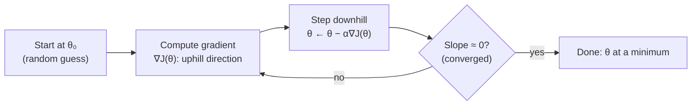

# 03 — Gradient Descent

> Part 1 · Lesson 03 · Code stack: numpy-from-scratch

**Prerequisites:** [02 — Linear Regression](02-linear-regression.md) — you should know the MSE loss and the normal-equation solution $\theta = (X^\top X)^{-1}X^\top y$.

**By the end you can:**
- Explain gradient descent as "rolling downhill" on a loss surface, and write the update rule $\theta := \theta - \alpha \nabla J(\theta)$ from memory.
- Derive the MSE gradient $\nabla J = \frac{1}{m}X^\top(X\theta - y)$ in two lines and implement it in NumPy.
- Diagnose a bad learning rate from a loss curve (diverging vs. crawling) and fix it.
- Choose between batch, stochastic, and mini-batch GD, and explain why we scale features.
- Say precisely *why* iterative GD beats the normal equation when feature dimension is large.

---

## 1. Intuition

Linear regression handed you a closed-form answer: invert a matrix, done. Almost nothing else in ML gives you that luxury. The workhorse that trains nearly *everything* — logistic regression, SVMs, every neural network you'll ever touch — is **gradient descent**. Learn it deeply here and the rest of the course becomes "same engine, different loss."

The picture: your loss $J(\theta)$ is a **landscape**. The horizontal axes are the parameters $\theta$ (the knobs you can turn); the height is how wrong you are. Training = finding the lowest valley. You're a hiker dropped somewhere on this terrain in thick fog — you can't see the whole map, but you *can* feel the slope under your feet. So you take a step **downhill**, feel the slope again, step again. Repeat until the ground is flat.

The **gradient** $\nabla J(\theta)$ is exactly "which way is uphill, and how steep." So you step in the *opposite* direction. The **learning rate** $\alpha$ is your stride length. Too timid and you crawl; too bold and you leap clear over the valley and end up higher than you started.



For the **MSE loss of linear regression**, the landscape is a perfect bowl (a convex paraboloid) — one valley, no traps. That's the gift we exploit in this lesson: we can watch GD work without worrying about getting stuck. Lesson 09+ is where the terrain gets nasty.

---

## 2. The Math

### The loss and what we're minimizing

We reuse the MSE from Lesson 02. With $m$ training examples, design matrix $X \in \mathbb{R}^{m \times n}$ (each row is one example's features, with a leading column of 1s for the bias), targets $y \in \mathbb{R}^m$, and parameters $\theta \in \mathbb{R}^n$:

$$
J(\theta) = \frac{1}{2m}\sum_{i=1}^{m}\big(\hat{y}_i - y_i\big)^2
= \frac{1}{2m}\,\lVert X\theta - y\rVert^2
$$

- $\hat{y}_i = x_i^\top \theta$ is the prediction for example $i$.
- $\lVert \cdot \rVert$ is the Euclidean norm, so $\lVert v \rVert^2 = \sum_j v_j^2$.
- The $\frac{1}{2}$ is cosmetic: it cancels the 2 that drops out when we differentiate the square, leaving a clean gradient. The $\frac{1}{m}$ makes the loss an *average*, so $\alpha$ doesn't have to be re-tuned when you change dataset size.

### The gradient — where it comes from

The **gradient** $\nabla J$ is the vector of partial derivatives $\big[\frac{\partial J}{\partial \theta_1}, \dots, \frac{\partial J}{\partial \theta_n}\big]^\top$. It points in the direction of *steepest increase* of $J$. Two-line derivation using the chain rule, with residual vector $r = X\theta - y$:

$$
J = \frac{1}{2m}\, r^\top r, \qquad \frac{\partial r}{\partial \theta} = X
\;\;\Longrightarrow\;\;
\nabla J(\theta) = \frac{1}{m}\,X^\top r = \frac{1}{m}\,X^\top\big(X\theta - y\big)
$$

That's it. Read it physically: $r = X\theta - y$ is **how wrong each prediction is** (signed). $X^\top r$ then asks, for each feature, "are the errors correlated with this feature?" If feature $j$ tends to be large exactly when we over-predict, $\partial J / \partial \theta_j > 0$, so we *decrease* $\theta_j$. The gradient is a vote, weighted by error, from every example.

### The update rule

This is the single most important equation in the course:

$$
\boxed{\;\theta := \theta - \alpha\, \nabla J(\theta)\;}
$$

- $:=$ means "assign" — we overwrite $\theta$ with the new value each iteration.
- $\alpha > 0$ is the **learning rate** (step size / stride length).
- The minus sign turns "steepest *up*hill" into "go *down*hill."

Why a step in $-\nabla J$ actually lowers $J$: a first-order Taylor expansion gives $J(\theta - \alpha\nabla J) \approx J(\theta) - \alpha\lVert\nabla J\rVert^2$. The correction term $-\alpha\lVert\nabla J\rVert^2$ is negative whenever $\nabla J \neq 0$ and $\alpha$ is small enough — so the loss drops. The catch is *"small enough."*

### How big can $\alpha$ be? (conditioning)

For a quadratic bowl, GD provably converges iff

$$
0 < \alpha < \frac{2}{\lambda_{\max}}, \qquad \text{(fastest near } \alpha \approx \tfrac{2}{\lambda_{\max}+\lambda_{\min}})
$$

where $\lambda_{\max}, \lambda_{\min}$ are the largest/smallest eigenvalues of the **Hessian** $H = \frac{1}{m}X^\top X$ (the curvature of the bowl). The ratio $\kappa = \lambda_{\max}/\lambda_{\min}$ is the **condition number**. A round bowl ($\kappa \approx 1$) converges in a few steps; a long, skinny ravine ($\kappa \gg 1$) makes GD zig-zag and crawl. **Feature scaling** (Section 5) is how we round out the bowl — it directly shrinks $\kappa$.

### Three flavors of GD

Computing $\nabla J$ over *all* $m$ examples each step is **batch GD**. We can instead estimate the gradient from a subset:

| Flavor | Gradient uses | Per-step cost | Path |
|---|---|---|---|
| **Batch** | all $m$ examples | high | smooth, straight to min |
| **Stochastic (SGD)** | 1 random example | tiny | noisy, jittery |
| **Mini-batch** | $b$ examples (e.g. 32) | moderate | mostly smooth, some noise |

All three minimize the *same* $J$; they trade gradient accuracy for speed. The noise in SGD isn't purely bad — it can knock you out of bad spots in non-convex landscapes later. Mini-batch is what everyone actually uses in deep learning.

---

## 3. Code

NumPy from scratch. We build batch GD for linear regression, then watch learning rates fight, then draw the descent path on a contour map.

```python
import numpy as np
import matplotlib.pyplot as plt

rng = np.random.default_rng(0)

# ---- 1. Synthetic data: y = 4 + 3*x + noise -------------------------------
m = 200
x = rng.uniform(-2, 2, size=m)
y = 4.0 + 3.0 * x + rng.normal(0, 1.0, size=m)   # true bias=4, slope=3

# Design matrix with a leading column of 1s for the bias term.
# X[:,0]=1 -> theta[0] is the intercept; X[:,1]=x -> theta[1] is the slope.
X = np.column_stack([np.ones(m), x])             # shape (m, 2)

def mse_loss(theta):
    r = X @ theta - y                            # residuals, shape (m,)
    return (r @ r) / (2 * m)                      # scalar J(theta)

def grad(theta):
    r = X @ theta - y                            # (m,)
    return (X.T @ r) / m                          # gradient, shape (2,)  == (1/m) X^T r

# ---- 2. Batch gradient descent --------------------------------------------
def gradient_descent(theta0, alpha, n_iters):
    theta = theta0.astype(float).copy()
    history = {"theta": [theta.copy()], "loss": [mse_loss(theta)]}
    for _ in range(n_iters):
        theta = theta - alpha * grad(theta)       # THE update rule
        history["theta"].append(theta.copy())
        history["loss"].append(mse_loss(theta))
    return theta, history

theta_final, hist = gradient_descent(np.zeros(2), alpha=0.1, n_iters=60)
print("GD solution:   ", np.round(theta_final, 3))   # -> [3.914 2.939]  (≈ true 4, 3)

# ---- 3. Sanity check against the closed form (normal equation) ------------
theta_closed = np.linalg.solve(X.T @ X, X.T @ y)
print("Closed form:   ", np.round(theta_closed, 3))  # -> [3.921 2.937]  ~same answer
print("Final loss:    ", round(hist["loss"][-1], 4)) # -> ~0.52 (irreducible noise floor)
```

GD lands on essentially the same parameters the normal equation gives (run more iterations and the last digits converge too) — it just got there by walking instead of by inversion.

### Learning rate showdown

```python
# Compare several learning rates on the same problem and plot loss vs. iteration.
rates = [0.005, 0.2, 0.5, 1.4]     # crawl, good, fast-but-fine, too-big
plt.figure(figsize=(7, 4.5))
for a in rates:
    _, h = gradient_descent(np.zeros(2), alpha=a, n_iters=60)
    plt.plot(h["loss"], label=f"α = {a}")
plt.yscale("log")                  # log scale so we see both convergence and blow-up
plt.xlabel("iteration"); plt.ylabel("loss J(θ)  (log)")
plt.title("Learning rate controls everything")
plt.legend(); plt.tight_layout(); plt.show()
```

What you should **see**: $\alpha=0.005$ is a slowly sloping line still far above the floor at iteration 60 (crawling — final loss $\approx 7.5$). $\alpha=0.2$ and $\alpha=0.5$ both dive smoothly to the noise floor ($\approx 0.52$); $0.5$ is faster but still stable. $\alpha=1.4$ **curves sharply upward** — the loss *grows* each step (it reaches $\sim 5\times 10^{7}$ by iteration 60), GD is diverging. Push to $\alpha = 2$ and you'll get `inf`/`nan` within a few iterations.

> The stability limit here is $\alpha < 2/\lambda_{\max}$. For this $X$, $\lambda_{\max}$ of $\frac{1}{m}X^\top X$ is about $1.53$, so the cutoff is $\alpha \approx 1.31$ — below it GD converges, above it diverges. That's why $0.5$ is fine but $1.4$ blows up.

### The descent path on a contour map

```python
# Build a grid over (bias, slope) space and evaluate J on it.
b_range = np.linspace(-1, 8, 120)      # candidate bias values  (theta[0])
w_range = np.linspace(-1, 7, 120)      # candidate slope values (theta[1])
B, W = np.meshgrid(b_range, w_range)
# Vectorized loss over the whole grid:
#   residual for grid point (b,w) and example i is (b + w*x_i - y_i)
Jgrid = np.zeros_like(B)
for i in range(B.shape[0]):
    for j in range(B.shape[1]):
        Jgrid[i, j] = mse_loss(np.array([B[i, j], W[i, j]]))

# Run a GD that we'll trace; small alpha + start far away makes a pretty path.
_, h = gradient_descent(np.array([0.0, -1.0]), alpha=0.08, n_iters=40)
path = np.array(h["theta"])            # shape (n_iters+1, 2)

plt.figure(figsize=(6, 5.5))
cs = plt.contour(B, W, Jgrid, levels=np.logspace(-0.3, 2.2, 18), cmap="viridis")
plt.clabel(cs, inline=True, fontsize=7)
plt.plot(path[:, 0], path[:, 1], "o-", color="red", ms=3, lw=1, label="GD path")
plt.scatter(*theta_closed, color="black", marker="*", s=180, zorder=5, label="optimum")
plt.xlabel("bias  θ₀"); plt.ylabel("slope  θ₁")
plt.title("Rolling downhill on the loss surface")
plt.legend(); plt.tight_layout(); plt.show()
```

What you should **see**: concentric ellipses (the convex bowl viewed from above) with the black star at the center. The red path starts at the outer edge and walks inward, taking steps **perpendicular to the contour lines** (always straight downhill), with steps that *shrink* as the gradient flattens near the bottom — the visual signature of convergence. If the ellipses are very elongated, the path zig-zags; that elongation is high $\kappa$, the thing feature scaling fixes.

### Mini-batch / SGD in ten lines

```python
def minibatch_gd(theta0, alpha, n_epochs, batch_size):
    theta = theta0.astype(float).copy()
    losses = []
    idx = np.arange(m)
    for _ in range(n_epochs):
        rng.shuffle(idx)                           # reshuffle each epoch
        for start in range(0, m, batch_size):
            b = idx[start:start + batch_size]      # indices of this mini-batch
            r = X[b] @ theta - y[b]
            g = (X[b].T @ r) / len(b)              # gradient on the batch only
            theta = theta - alpha * g
        losses.append(mse_loss(theta))             # full-data loss to track progress
    return theta, losses

# batch_size=1 -> pure SGD; =32 -> mini-batch; =m -> batch GD
theta_mb, mb_losses = minibatch_gd(np.zeros(2), alpha=0.05, n_epochs=30, batch_size=16)
print("Mini-batch GD: ", np.round(theta_mb, 3))   # -> ~[3.92  2.96], same optimum, fewer full passes
```

Mini-batch reaches the same answer while touching far fewer examples per update — the whole point once data gets big.

---

## 4. Real Case: when you *can't* invert $X^\top X$

You're fusing sensors on a USV: from each timestamp you build a feature vector by stacking a downsampled sonar return, lidar range bins, IMU-derived motion features, and engineered cross-terms — say $n \approx 50{,}000$ features. You log millions of timestamps ($m$ huge too). You want a linear model predicting, e.g., distance-to-obstacle ahead.

The normal equation from Lesson 02 says $\theta = (X^\top X)^{-1}X^\top y$. Why not just use it?

- $X^\top X$ is $n \times n = 50{,}000 \times 50{,}000$. Storing it as float64 is $50{,}000^2 \times 8 \approx 20$ **GB** — before you even try to invert it.
- Matrix inversion is $\mathcal{O}(n^3)$. At $n=50{,}000$ that's $\sim 10^{14}$ operations *per solve*. You'll wait hours, and if features are collinear (sonar bins often are), $X^\top X$ is near-singular and the inverse is numerically garbage.

Gradient descent sidesteps all of it. Each batch GD step is one matrix-vector product $X^\top(X\theta - y)$, which is $\mathcal{O}(mn)$ — *linear* in the dimension, never forming the $n\times n$ matrix at all. With **mini-batch** GD you go further: stream batches of timestamps off disk (or straight off a ROS2 topic), update $\theta$ per batch, and never hold the full dataset in memory. This is exactly why every large model is trained with (mini-batch) GD, not a closed form.

Worked sketch (same code, bigger shapes):

```python
# n features, m examples, but we NEVER build (n x n). Each step is one matmul.
n, m_big = 50_000, 200_000
# X_big would be (m_big, n) streamed in batches; theta is just length-n.
# step: g = X_batch.T @ (X_batch @ theta - y_batch) / len(batch)   # O(batch * n)
#       theta -= alpha * g
# Memory held at once: one batch + theta. The 20 GB Gram matrix never exists.
```

The trade you accept: GD gives an *approximate* solution after $k$ steps instead of the exact one. For learning problems that's not a downside — you stop early anyway (Lesson 05, early stopping), and the noise-floor optimum is all you can hope for.

**Classic-dataset anchor:** the same code trains a California-housing regressor (8 features, ~20k rows). There the normal equation is instant and GD is overkill — which is the lesson: GD is the tool you reach for precisely when $n$ (and $m$) grow past what direct inversion can stomach.

---

## 5. Pitfalls & Tips

- **Always scale your features.** If sonar amplitudes live in $[0, 4000]$ and IMU yaw-rate in $[-0.1, 0.1]$, the loss bowl is a razor-thin ravine ($\kappa$ enormous) and GD zig-zags forever. Standardize each feature to zero mean, unit variance (`(x - x.mean()) / x.std()`). This shrinks $\kappa$ and lets one $\alpha$ work for all parameters. Compute the scaling stats on *train* only, then apply the same numbers to val/test.
- **Tune $\alpha$ on a log scale.** Try $\{0.001, 0.003, 0.01, 0.03, 0.1, 0.3\}$ and look at the loss curve. Diverging/`nan` ⟹ too big; a nearly-flat slow decline ⟹ too small. There's a wide "good" band in between.
- **Don't forget the bias column.** The all-ones column in $X$ is what lets the line not pass through the origin. Forgetting it is the most common silent bug — the model can't shift up or down.
- **Watch the curve, not the final number.** A smooth monotonic decrease (batch) or noisy-but-trending-down (SGD) is healthy. A curve that goes down then *up*, or oscillates with growing amplitude, means $\alpha$ is too large.
- **A schedule beats a fixed $\alpha$ for SGD.** Constant $\alpha$ with SGD leaves you bouncing around the minimum, never settling. Decay it (e.g. $\alpha_t = \alpha_0/(1 + \text{decay}\cdot t)$) so steps shrink as you close in.
- **Convex now, not later.** MSE-linear is a single global bowl, so any descent works. Don't over-generalize this comfort — from Lesson 09 the surface has many minima and saddles, and *initialization* and *noise* start to matter.

---

## 6. Check Your Understanding

**Q1.** Write the gradient-descent update rule and state in one sentence what each of the three pieces ($\theta$, $\alpha$, $\nabla J$) does.

<details><summary>Answer</summary>

$\theta := \theta - \alpha\nabla J(\theta)$. $\theta$ is the parameter vector we're optimizing; $\nabla J(\theta)$ points uphill (steepest increase of the loss), so $-\nabla J$ is the downhill direction; $\alpha$ is the step size scaling how far we move that direction each iteration.
</details>

**Q2.** Derive $\nabla J$ for $J(\theta) = \frac{1}{2m}\lVert X\theta - y\rVert^2$.

<details><summary>Answer</summary>

Let $r = X\theta - y$, so $J = \frac{1}{2m}r^\top r$. Since $\partial r/\partial\theta = X$, the chain rule gives $\nabla J = \frac{1}{2m}\cdot 2\,X^\top r = \frac{1}{m}X^\top r = \frac{1}{m}X^\top(X\theta - y)$. The $\frac{1}{2}$ in the loss is exactly what cancels the factor of 2 from differentiating the square.
</details>

**Q3.** Your loss curve goes *down* for 3 iterations, then climbs and hits `nan`. What's wrong, and what's the fix?

<details><summary>Answer</summary>

The learning rate $\alpha$ is too large: each step overshoots the minimum and lands somewhere higher, and the overshoot compounds until the numbers blow up (exceed $\alpha < 2/\lambda_{\max}$). Fix: reduce $\alpha$ (try dividing by 3–10) and/or scale the features to lower the condition number, which raises the stability ceiling.
</details>

**Q4.** Why use iterative GD instead of the closed-form $\theta = (X^\top X)^{-1}X^\top y$ on a 50,000-feature sensor model?

<details><summary>Answer</summary>

Forming $X^\top X$ is $n^2$ memory ($\sim$20 GB at $n{=}50\text{k}$) and inverting it is $\mathcal{O}(n^3)$ time, and collinear features make it near-singular/numerically unstable. A GD step is just $X^\top(X\theta - y)$, which is $\mathcal{O}(mn)$ and never builds the $n\times n$ matrix; mini-batch GD also streams the data so it need not fit in memory.
</details>

**Q5.** Batch, stochastic, and mini-batch GD all minimize the same $J$. What exactly differs, and why is mini-batch the deep-learning default?

<details><summary>Answer</summary>

They differ only in how many examples each *gradient estimate* uses: all $m$ (batch, exact but expensive), 1 (SGD, cheap but noisy), or $b$ (mini-batch, in between). Mini-batch gives a good-enough gradient at a fraction of the cost, vectorizes well on GPUs, and its mild noise can help escape poor regions in non-convex landscapes — the best speed/quality trade for large models.
</details>

---

## Recap & Next

- Gradient descent walks downhill on the loss surface via the update $\theta := \theta - \alpha\nabla J(\theta)$ — the one engine behind almost every model in this course.
- For MSE-linear, $\nabla J = \frac{1}{m}X^\top(X\theta - y)$, the surface is a convex bowl, and GD provably reaches the global minimum for $0 < \alpha < 2/\lambda_{\max}$.
- The learning rate $\alpha$ is everything: too small crawls, too big diverges; read it off the loss curve and tune on a log scale.
- Batch vs. SGD vs. mini-batch trade gradient accuracy for speed; feature scaling lowers the condition number so GD goes straight instead of zig-zagging.
- We reach for iterative GD precisely when $X^\top X$ is too big or ill-conditioned to invert — high-dimensional sensor fusion, and every neural net.

Next we keep the same descent engine but change the loss and add a nonlinearity, turning regression into classification: **[04 — Logistic Regression & Classification](04-logistic-regression.md)**.
