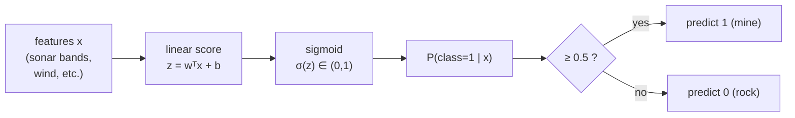

# 04 — Logistic Regression & Classification

> Part 1 · Lesson 04 · Code stack: numpy-from-scratch

**Prerequisites:** [03 — Gradient Descent](03-gradient-descent.md) (you should be comfortable with the gradient of a loss, the update rule $\theta \leftarrow \theta - \eta \nabla J$, and vectorized numpy). Linear regression from [02 — Linear Regression](02-linear-regression.md) is the model we're about to bend into a classifier.

**By the end you can:**
- Explain why a linear model's raw output is the wrong tool for predicting a *class*, and how the **sigmoid** fixes it.
- Derive **binary cross-entropy** (log-loss) and show its gradient collapses to the same clean form as linear regression: $\frac{1}{m}X^\top(\hat{y}-y)$.
- Implement logistic regression from scratch in numpy with gradient descent.
- Plot and interpret the **decision boundary** and the sigmoid curve.
- Sketch how **softmax** generalizes this to more than two classes.

---

## 1. Intuition

In linear regression you predicted a *number*: house price, water depth from a pressure reading, distance-to-waypoint. Now you want a **class**: is this sonar return a **mine** or a **rock**? Should the drone **launch** or **abort**?

The obvious hack is to fit a line and threshold it: predict class 1 if the line is above some cutoff. That mostly works — but the line itself outputs values in $(-\infty, +\infty)$, and we want something that behaves like a **probability**: bounded in $(0, 1)$, confidently near 0 or 1 in clear cases, hovering near 0.5 when the model is unsure.

The trick: keep the linear part $z = w^\top x + b$ (the same dot product you already know), then **squash** it through the **sigmoid** function $\sigma(z) = 1/(1+e^{-z})$. The linear part decides *which side of a boundary* you're on and *how far*; the sigmoid turns "how far" into "how confident."

Analogy from your world: think of $z$ as a **signed margin** — like a control error or a signed distance to a path. A USV's lateral error tells you both the side (port/starboard) and the magnitude. The sigmoid is a soft gate that says "the further off the centerline, the more certain I am which side you're on," saturating to a firm yes/no once you're clearly committed.



The set of points where $z = 0$ (equivalently $\sigma(z) = 0.5$) is the **decision boundary**. Because $z$ is linear in $x$, that boundary is a straight line (in 2D), a plane (in 3D), or a hyperplane in general. Logistic regression is a **linear classifier** — the *nonlinearity is only in how it reports confidence*, not in the shape of the boundary.

---

## 2. The Math

**Symbols.** $x \in \mathbb{R}^n$ is a feature vector for one example ($n$ features). $w \in \mathbb{R}^n$ are the weights, $b \in \mathbb{R}$ the bias. $y \in \{0, 1\}$ is the true label. We stack $m$ examples into a design matrix $X \in \mathbb{R}^{m \times n}$ (one row per example) and labels $y \in \{0,1\}^m$.

### The model

$$z = w^\top x + b, \qquad \hat{y} = \sigma(z) = \frac{1}{1 + e^{-z}}$$

$\hat{y}$ is interpreted as $P(y=1 \mid x)$, and $P(y=0 \mid x) = 1 - \hat{y}$. The sigmoid comes from inverting the **log-odds** (logit): if you assume the log-odds of class 1 are linear in $x$,

$$\log\frac{P(y=1)}{P(y=0)} = z \;\;\Longrightarrow\;\; P(y=1) = \frac{1}{1+e^{-z}} = \sigma(z).$$

That's *where the sigmoid comes from* — it is the unique function that maps a linear log-odds score back to a probability.

A fact we'll use twice: the sigmoid's derivative is delightfully clean,

$$\sigma'(z) = \sigma(z)\,(1 - \sigma(z)).$$

(Quick origin: $\sigma = (1+e^{-z})^{-1}$, so $\sigma' = e^{-z}(1+e^{-z})^{-2} = \sigma \cdot \frac{e^{-z}}{1+e^{-z}} = \sigma(1-\sigma)$.)

### Why not just use MSE?

You might be tempted to reuse mean squared error $\frac{1}{m}\sum(\hat{y}-y)^2$ from linear regression. Two problems:

1. **It's non-convex in $w$.** Plug $\hat{y}=\sigma(w^\top x + b)$ into MSE and the loss surface gets wavy with local minima. Gradient descent can get stuck. Cross-entropy (below) is **convex** for logistic regression — one global minimum.
2. **Vanishing gradients on confident-but-wrong predictions.** The MSE gradient carries a factor $\sigma'(z)=\sigma(1-\sigma)$, which is ~0 when $\hat{y}$ is near 0 or 1. So a confidently *wrong* prediction (say $\hat{y}=0.99$ when $y=0$) produces an almost-zero gradient and the model barely learns. That's exactly backwards — you want a big push when you're confidently wrong.

### Binary cross-entropy (log-loss)

The right loss comes from **maximum likelihood**. For one example, the probability the model assigns to the *true* label is $\hat{y}^{\,y}(1-\hat{y})^{1-y}$ (this equals $\hat{y}$ when $y=1$ and $1-\hat{y}$ when $y=0$). Maximizing the log-likelihood over all examples = minimizing its negative average, the **binary cross-entropy**:

$$J(w,b) = -\frac{1}{m}\sum_{i=1}^{m}\Big[\, y_i \log \hat{y}_i + (1-y_i)\log(1-\hat{y}_i)\,\Big].$$

Intuition: if $y=1$, the term is $-\log\hat{y}$ — zero when $\hat{y}=1$, blowing up toward $+\infty$ as $\hat{y}\to 0$. The loss **punishes confident wrong answers harshly**, which is precisely what fixes problem (2) above.

### The gradient (the punchline)

Differentiate $J$ w.r.t. $z_i$. The $\sigma'$ from the chain rule **cancels** against the $\frac{1}{\hat{y}(1-\hat{y})}$ from the log terms:

$$\frac{\partial J}{\partial z_i} = \hat{y}_i - y_i.$$

So the gradients w.r.t. the parameters are

$$\boxed{\;\frac{\partial J}{\partial w} = \frac{1}{m}X^\top(\hat{y}-y), \qquad \frac{\partial J}{\partial b} = \frac{1}{m}\sum_i(\hat{y}_i - y_i).\;}$$

Look familiar? It's the **exact same form** as the linear-regression gradient from Lesson 02 — the only difference is that $\hat{y}=\sigma(Xw+b)$ instead of $\hat{y}=Xw+b$. That's not a coincidence: both linear and logistic regression are **generalized linear models**, and for the matching loss (MSE for Gaussian, cross-entropy for Bernoulli) the gradient is always "design matrix transpose times residual." Memorize $X^\top(\hat{y}-y)$ once and you've got both.

### From two classes to many: softmax (preview)

For $K > 2$ classes, replace the single score with one score per class, $z_k = w_k^\top x + b_k$, and replace sigmoid with **softmax**:

$$\hat{y}_k = \frac{e^{z_k}}{\sum_{j=1}^{K} e^{z_j}}, \qquad \sum_k \hat{y}_k = 1.$$

The loss becomes **categorical cross-entropy** $-\sum_k y_k \log \hat{y}_k$ (with $y$ one-hot), and — wonderfully — the gradient is *still* $\hat{y}-y$. Sigmoid is just the $K=2$ special case of softmax. We'll lean on this again when we build neural nets in [09 — Neural Networks](09-neural-networks-mlp.md); a logistic regression is literally a one-layer net with a sigmoid output.

---

## 3. Code

We'll build it from scratch with numpy: sigmoid, loss, gradient, a fit loop, and two plots. Everything is vectorized.

```python
import numpy as np
import matplotlib.pyplot as plt

rng = np.random.default_rng(0)

# ---------- core pieces ----------
def sigmoid(z):
    # Numerically stable sigmoid: avoid overflow in exp for large negative z.
    # For z >= 0 use 1/(1+e^-z); for z < 0 use e^z/(1+e^z). Same value, no overflow.
    out = np.empty_like(z, dtype=float)
    pos = z >= 0
    out[pos] = 1.0 / (1.0 + np.exp(-z[pos]))
    ez = np.exp(z[~pos])
    out[~pos] = ez / (1.0 + ez)
    return out

def bce_loss(y, y_hat, eps=1e-12):
    # Binary cross-entropy. Clip to avoid log(0) -> -inf.
    y_hat = np.clip(y_hat, eps, 1 - eps)
    return -np.mean(y * np.log(y_hat) + (1 - y) * np.log(1 - y_hat))

class LogisticRegression:
    """Logistic regression trained with full-batch gradient descent."""
    def __init__(self, lr=0.1, n_iters=2000):
        self.lr = lr
        self.n_iters = n_iters
        self.w = None
        self.b = 0.0
        self.history = []          # loss per iteration, for plotting

    def fit(self, X, y):
        m, n = X.shape
        self.w = np.zeros(n)        # start at the origin; loss is convex so this is fine
        self.b = 0.0
        for _ in range(self.n_iters):
            z = X @ self.w + self.b           # linear score, shape (m,)
            y_hat = sigmoid(z)                # probabilities, shape (m,)
            error = y_hat - y                 # the residual that drives everything
            # Gradients: the X^T (y_hat - y) form we derived.
            grad_w = (X.T @ error) / m        # shape (n,)
            grad_b = error.mean()             # scalar
            self.w -= self.lr * grad_w
            self.b -= self.lr * grad_b
            self.history.append(bce_loss(y, y_hat))
        return self

    def predict_proba(self, X):
        return sigmoid(X @ self.w + self.b)

    def predict(self, X, threshold=0.5):
        return (self.predict_proba(X) >= threshold).astype(int)

# ---------- a toy 2D dataset: two clouds we can see ----------
m = 200
# Class 0 centered low-left, class 1 centered high-right, with overlap.
X0 = rng.normal(loc=[-1.5, -1.0], scale=1.0, size=(m // 2, 2))
X1 = rng.normal(loc=[ 1.5,  1.2], scale=1.0, size=(m // 2, 2))
X = np.vstack([X0, X1])
y = np.hstack([np.zeros(m // 2), np.ones(m // 2)])

# Standardize features (mean 0, std 1) -- GD converges far faster on scaled inputs.
X_mean, X_std = X.mean(axis=0), X.std(axis=0)
Xs = (X - X_mean) / X_std

model = LogisticRegression(lr=0.5, n_iters=2000).fit(Xs, y)
acc = (model.predict(Xs) == y).mean()
print(f"final loss: {model.history[-1]:.3f}   train accuracy: {acc:.3f}")
# -> final loss: 0.098   train accuracy: 0.965
```

**Plot 1 — the sigmoid itself.** This is the squashing function in isolation, so you can see what the linear score gets pushed through.

```python
z = np.linspace(-8, 8, 200)
plt.figure(figsize=(5, 3))
plt.plot(z, sigmoid(z))
plt.axhline(0.5, ls="--", c="gray"); plt.axvline(0, ls="--", c="gray")
plt.xlabel("z = wᵀx + b"); plt.ylabel("σ(z) = P(y=1)")
plt.title("Sigmoid: linear score → probability"); plt.tight_layout(); plt.show()
```
*What you should see:* a smooth S-curve passing through $(0, 0.5)$, flattening toward 0 on the left and 1 on the right. The flat tails are exactly where MSE's gradient would vanish — and where cross-entropy keeps the pressure on.

**Plot 2 — the decision boundary.** We draw the data and the line where $\hat{y}=0.5$. In standardized space the boundary is $w_1 x_1 + w_2 x_2 + b = 0$, i.e. $x_2 = -(w_1 x_1 + b)/w_2$.

```python
plt.figure(figsize=(5, 4))
plt.scatter(Xs[y == 0, 0], Xs[y == 0, 1], s=18, label="class 0 (rock)")
plt.scatter(Xs[y == 1, 0], Xs[y == 1, 1], s=18, label="class 1 (mine)")

# Boundary line from the learned weights.
x1 = np.linspace(Xs[:, 0].min(), Xs[:, 0].max(), 100)
x2 = -(model.w[0] * x1 + model.b) / model.w[1]
plt.plot(x1, x2, "k-", lw=2, label="decision boundary (p=0.5)")

# Optional: shade the probability field so you see the soft gradient, not just the line.
xx, yy = np.meshgrid(np.linspace(Xs[:,0].min(), Xs[:,0].max(), 200),
                     np.linspace(Xs[:,1].min(), Xs[:,1].max(), 200))
grid = np.c_[xx.ravel(), yy.ravel()]
probs = model.predict_proba(grid).reshape(xx.shape)
plt.contourf(xx, yy, probs, levels=20, cmap="coolwarm", alpha=0.25)

plt.xlabel("feature 1 (std)"); plt.ylabel("feature 2 (std)")
plt.legend(); plt.title("Logistic regression decision boundary"); plt.tight_layout(); plt.show()
```
*What you should see:* the two clouds separated by a **straight** black line, with a smooth blue→red color wash crossing it. The line is where the model is maximally uncertain (p=0.5); confidence ramps up as you move away — the 2D shadow of that S-curve.

**Plot 3 — loss going down.** A sanity check that GD is actually learning.

```python
plt.figure(figsize=(5, 3))
plt.plot(model.history)
plt.xlabel("iteration"); plt.ylabel("BCE loss")
plt.title("Training loss"); plt.tight_layout(); plt.show()
```
*What you should see:* a smooth monotonic decay flattening out — convex loss, no bumps. If you see oscillation, your learning rate is too high.

---

## 4. Real Case

### Mine vs. rock from sonar — the classic Sonar dataset

The **Connectionist Bench (Sonar, Mines vs. Rocks)** dataset (Gorman & Sejnowski, 1988; UCI repository) is the canonical example for exactly this problem. A sonar chirp is bounced off an object on the seabed; the **returned energy is binned into 60 frequency bands**, each normalized to $[0,1]$. The label is `M` (metal cylinder = mine) or `R` (rock). 208 examples, 60 features.

This is a real ROV/USV mine-countermeasures task in miniature: given a spectral signature of a return, decide whether to flag it. The feature vector $x \in \mathbb{R}^{60}$ is the energy spectrum; logistic regression learns one weight per band — effectively *which frequencies discriminate metal from stone* — plus a bias.

```python
import numpy as np
from urllib.request import urlopen

# UCI Sonar dataset: 60 numeric bands + a final label column 'M' or 'R'.
URL = ("https://archive.ics.uci.edu/ml/machine-learning-databases/"
       "undocumented/connectionist-bench/sonar/sonar.all-data")
raw = urlopen(URL).read().decode().strip().splitlines()
rows = [r.split(",") for r in raw]
X = np.array([[float(v) for v in r[:60]] for r in rows])      # (208, 60)
y = np.array([1 if r[60] == "M" else 0 for r in rows])         # 1 = mine

# Standardize (each band to mean 0, std 1) -- essential before GD.
X = (X - X.mean(0)) / X.std(0)

# Simple train/test split (we cover proper CV in lesson 05).
rng = np.random.default_rng(1)
idx = rng.permutation(len(y))
cut = int(0.75 * len(y))
tr, te = idx[:cut], idx[cut:]

model = LogisticRegression(lr=0.3, n_iters=3000).fit(X[tr], y[tr])
train_acc = (model.predict(X[tr]) == y[tr]).mean()
test_acc  = (model.predict(X[te]) == y[te]).mean()
print(f"train acc: {train_acc:.2f}   test acc: {test_acc:.2f}")
# -> train acc: 0.97   test acc: 0.83   (deterministic here: seed and split are pinned)
```

Notice the **gap between train and test accuracy** — ~14 points (0.97 vs. 0.83) here. 60 features on 156 training examples is fertile ground for **overfitting**, which is the entire subject of the next lesson. The decision in deployment isn't really "0.5 or bust" either: for mine detection a **false negative** (missed mine) is far costlier than a **false positive** (re-scan a rock), so you'd lower the threshold to, say, 0.3 to catch more mines at the cost of more false alarms. Logistic regression hands you a *calibrated probability*, so you can tune that threshold to your operational risk — a luxury a bare yes/no classifier doesn't give you.

### UAV go/no-go — the same model, fewer features

The identical machinery decides a drone launch from weather telemetry: $x = [\text{wind speed}, \text{gust}, \text{visibility}, \text{precip prob}, \text{battery temp}]$, label = launched-and-completed-safely (1) vs. aborted/incident (0). With ~5 interpretable features the learned weights become a readable safety rule — negative weight on wind speed, positive on visibility — and the probability output drives a graded response: green > 0.8, caution 0.5–0.8, scrub < 0.5.

---

## 5. Pitfalls & Tips

- **Always standardize your features before GD.** Sonar band 3 might span $[0, 0.03]$ and band 50 span $[0, 0.9]$; on raw scales the loss surface is a stretched ravine and gradient descent crawls. Mean-0/std-1 makes it round and fast. (Tree models in lesson 06 won't care, but every gradient-based model does.)
- **Clip inside the log.** $\log(0) = -\infty$. When the model gets very confident, $\hat{y}$ can hit exactly 0 or 1 in floating point and your loss becomes `nan`. Clip $\hat{y}$ to $[\varepsilon, 1-\varepsilon]$ as in `bce_loss`.
- **Use a numerically stable sigmoid.** `1/(1+np.exp(-z))` overflows for very negative `z` (huge `exp`). The branched version above (or `scipy.special.expit`) avoids the warning and the wrong answer.
- **Don't report accuracy alone on imbalanced data.** If 95% of sonar returns are rocks, a model that always says "rock" scores 95% accuracy and catches zero mines. Use precision/recall, the confusion matrix, and ROC-AUC — all covered in [05 — Overfitting & Evaluation](05-overfitting-evaluation.md).
- **The 0.5 threshold is a choice, not a law.** It's only optimal when false positives and false negatives cost the same and classes are balanced. Move it to match your risk profile.
- **Logistic regression can only draw a straight boundary.** If your classes interleave (XOR-like), no line separates them and accuracy stalls. The fix is either engineered nonlinear features (e.g. add $x_1^2$, $x_1 x_2$) or a model with a learned nonlinear boundary — which is the road to neural nets in lesson 09.

---

## 6. Check Your Understanding

**Q1.** Why does swapping MSE for cross-entropy matter, beyond convexity? Think about a confidently-wrong prediction.

<details><summary>Answer</summary>
MSE's gradient carries a factor $\sigma'(z) = \sigma(1-\sigma)$, which is ~0 when $\hat{y}$ is near 0 or 1. A confidently wrong prediction ($\hat{y}=0.99$, $y=0$) therefore produces a near-zero gradient — the model barely corrects. Cross-entropy's gradient is just $\hat{y}-y$, which is large (≈1) for exactly that case, so the model gets a strong corrective push. Cross-entropy punishes confident mistakes; MSE shrugs at them.
</details>

**Q2.** The gradient of cross-entropy w.r.t. the weights is $\frac{1}{m}X^\top(\hat{y}-y)$, identical in form to linear regression. Where did the sigmoid's derivative go?

<details><summary>Answer</summary>
It cancelled. By the chain rule the $w$-gradient picks up $\sigma'(z)=\hat{y}(1-\hat{y})$, but differentiating the log terms in the loss produces a $\frac{1}{\hat{y}(1-\hat{y})}$ factor. They multiply to 1, leaving $\partial J/\partial z = \hat{y}-y$. This cancellation is exactly *why* cross-entropy is the "natural" loss for the sigmoid (and softmax) — it's the matched loss for the Bernoulli likelihood in a generalized linear model.
</details>

**Q3.** In a 2D problem, why is the decision boundary a straight line even though the sigmoid is curved?

<details><summary>Answer</summary>
The boundary is the set where $\hat{y}=0.5$, i.e. $\sigma(z)=0.5$, i.e. $z=0$. Since $z=w_1x_1+w_2x_2+b$ is linear in $x$, the set $z=0$ is a straight line (a hyperplane in higher dimensions). The sigmoid only bends *how confidence changes as you move away from the line* — it doesn't bend the line itself. Logistic regression is a linear classifier.
</details>

**Q4.** You train a mine detector and get 97% train / 83% test accuracy. In deployment, would you keep the 0.5 threshold? Why or why not?

<details><summary>Answer</summary>
Two issues. First, the ~14-point train/test gap signals overfitting (60 features, few samples) — you'd want regularization and cross-validation (lesson 05). Second, the 0.5 threshold assumes equal cost for both error types. For mines, a missed detection (false negative) is catastrophic while a false alarm just means re-scanning a rock. You'd *lower* the threshold (e.g. 0.3) to raise recall on mines, accepting more false positives. Logistic regression's calibrated probability output is what makes this tuning possible.
</details>

**Q5.** How does softmax relate to the sigmoid, and what changes in the gradient?

<details><summary>Answer</summary>
Sigmoid is the two-class special case of softmax. Softmax computes one score $z_k$ per class and normalizes $\hat{y}_k = e^{z_k}/\sum_j e^{z_j}$ so the outputs sum to 1. Paired with categorical cross-entropy on one-hot labels, the gradient w.r.t. the scores is *still* $\hat{y}-y$ — the same clean residual form, just vector-valued per class. Nothing about the optimization story changes; you just have $K$ weight vectors instead of one.
</details>

---

## Recap & Next

- **Logistic regression = linear score $z=w^\top x+b$ squashed by the sigmoid** into a probability in $(0,1)$; threshold at 0.5 (or your chosen risk level) to get a class.
- The decision boundary is **linear** ($z=0$); only the *confidence* is nonlinear.
- **MSE is wrong for classification** (non-convex, vanishing gradient on confident errors); **binary cross-entropy** is the maximum-likelihood loss and behaves correctly.
- Its gradient is the same beautiful $\frac{1}{m}X^\top(\hat{y}-y)$ as linear regression — both are generalized linear models. **Softmax** extends it to $K$ classes with the same gradient form.
- We measured accuracy crudely and saw a train/test gap — a cliffhanger for evaluation done right.

Next, we make that gap the main event: **why models overfit, how regularization reins them in, and how to honestly measure a classifier.**

→ [05 — Overfitting, Regularization & Evaluation](05-overfitting-evaluation.md)
