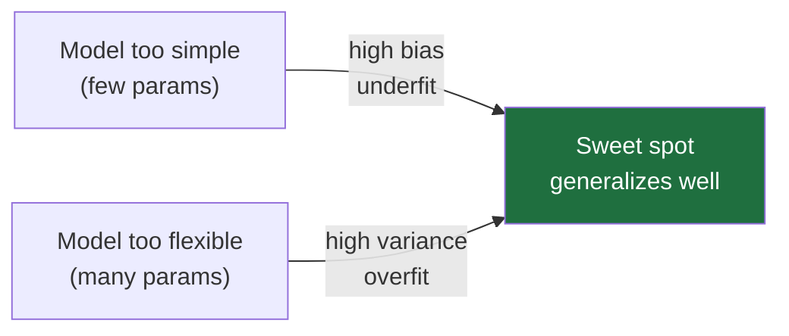
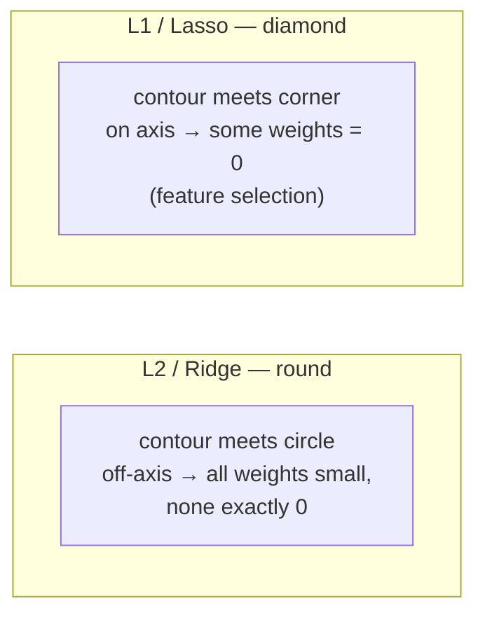
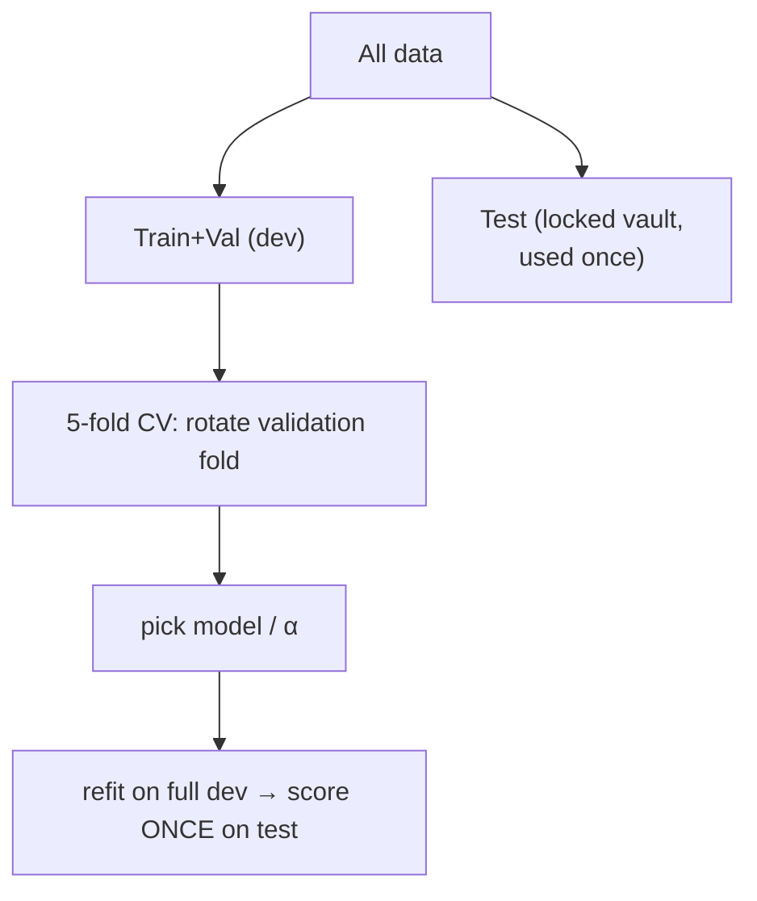

# 05 — Overfitting, Regularization & Evaluation

> Part 1 · Lesson 05 · Code stack: scikit-learn (+ a little numpy)

**Prerequisites:** [04 — Logistic Regression & Classification](04-logistic-regression.md)

**By the end you can:**
- Explain why a model that scores 100% on training data can still be useless in the field, using the **bias–variance tradeoff**.
- Split data correctly into **train / validation / test** and run **k-fold cross-validation** without leaking information.
- Apply **L2 (ridge)** and **L1 (lasso)** regularization and predict what each does to the weights.
- Pick the right **evaluation metric** for the job — and explain why **accuracy lies** on imbalanced data like rare-fault detection.
- Read a **learning curve** and an **ROC curve** to diagnose what is actually wrong with a model.

---

## 1. Intuition

A model's only job is to **generalize**: do well on data it has *never seen*. Training accuracy is a trap, because the model can always cheat by memorizing.

**Analogy — the student who memorizes the answer key.** Two students prep for an exam:

- **Student A (underfit / high bias)** skims one page and concludes "the answer is always B." Wrong on practice tests, wrong on the real exam. Too simple to capture reality.
- **Student B (overfit / high variance)** memorizes every practice question word-for-word, including the typos. Perfect on practice, lost the moment a question is reworded. Memorized noise instead of the pattern.
- **Student C (just right)** learns the underlying rules. Slightly imperfect on practice, but solid on the real exam.

Your model is one of these three. The whole game is keeping it near C.



For us on a USV: imagine fitting a model to predict drag from speed using 8 noisy log points. A straight line might underfit (the real curve is quadratic). A degree-7 polynomial will pass *exactly* through all 8 points — and then predict drag of −400 N at a speed you didn't log. It memorized the noise.

---

## 2. The Math

### Bias–variance decomposition

Suppose the truth is $y = f(x) + \varepsilon$, where $f$ is the real function and $\varepsilon$ is irreducible noise with variance $\sigma^2$ (sensor jitter you can never model away). We train a model $\hat{f}$ on a random dataset. The **expected squared error** at a test point $x_0$, averaged over all possible training sets, decomposes into three pieces:

$$
\mathbb{E}\big[(y - \hat{f}(x_0))^2\big] = \underbrace{\big(\,\mathbb{E}[\hat{f}(x_0)] - f(x_0)\,\big)^2}_{\text{Bias}^2} + \underbrace{\mathbb{E}\big[(\hat{f}(x_0) - \mathbb{E}[\hat{f}(x_0)])^2\big]}_{\text{Variance}} + \underbrace{\sigma^2}_{\text{Irreducible}}
$$

Where it comes from: add and subtract $\mathbb{E}[\hat{f}(x_0)]$ inside the square and expand; the cross term vanishes in expectation, leaving exactly these three.

- **Bias** = how far the *average* model is from the truth. Too-simple models have high bias (underfit).
- **Variance** = how much the model *wiggles* when you reshuffle the training data. Too-flexible models have high variance (overfit).
- **Irreducible** $\sigma^2$ = the noise floor. No model beats it.

You cannot drive both bias and variance to zero. Increasing model complexity lowers bias but raises variance. **Regularization is how you buy a little bias to kill a lot of variance.**

### Ridge (L2) and Lasso (L1)

Start from any loss $L(\mathbf{w})$ — say the mean squared error from [Lesson 02](02-linear-regression.md), where $\mathbf{w} \in \mathbb{R}^d$ is the weight vector. Regularization adds a **penalty on the size of the weights**:

$$
\text{Ridge:}\quad J(\mathbf{w}) = L(\mathbf{w}) + \alpha \sum_{j=1}^{d} w_j^2 = L(\mathbf{w}) + \alpha\,\lVert \mathbf{w} \rVert_2^2
$$

$$
\text{Lasso:}\quad J(\mathbf{w}) = L(\mathbf{w}) + \alpha \sum_{j=1}^{d} |w_j| = L(\mathbf{w}) + \alpha\,\lVert \mathbf{w} \rVert_1
$$

Here $\alpha \ge 0$ is the **regularization strength** (a knob you choose; $\alpha = 0$ recovers plain regression). Big weights are now expensive, so the optimizer prefers smaller, smoother solutions — less wiggle, less variance.

**Why L1 produces sparsity (zeros) and L2 does not.** Think geometrically. Minimizing $L$ subject to a budget on weight size is the same as constraining $\mathbf{w}$ to a ball. The L2 ball is a **circle** (smooth, no corners); the L1 ball is a **diamond** with corners *on the axes*. The loss contours expand until they touch the constraint region — and a diamond gets touched at a **corner**, where some coordinates are exactly $0$.



So: **ridge shrinks all weights toward zero; lasso shrinks and zeroes some out**, effectively doing feature selection. If you suspect only a handful of your 30 IMU/sonar features matter, lasso will tell you which.

### Evaluation metrics

**Regression** (predictions $\hat{y}_i$, truths $y_i$, $n$ samples):

$$
\text{MAE} = \frac{1}{n}\sum_i |y_i - \hat{y}_i|, \qquad
\text{MSE} = \frac{1}{n}\sum_i (y_i - \hat{y}_i)^2, \qquad
\text{RMSE} = \sqrt{\text{MSE}}
$$

$$
R^2 = 1 - \frac{\sum_i (y_i - \hat{y}_i)^2}{\sum_i (y_i - \bar{y})^2}
$$

- **MAE** is in the original units (meters, newtons) and treats every error equally.
- **MSE/RMSE** square the errors, so they punish big mistakes harder; RMSE is back in original units. Use these when a few large errors are dangerous (a 5 m position error matters more than five 1 m errors).
- **$R^2$** compares your model to the trivial "always predict the mean $\bar{y}$" baseline. $R^2 = 1$ is perfect, $R^2 = 0$ means no better than the mean, and **negative $R^2$ means you're worse than guessing the mean** (yes, that happens).

**Classification.** Everything starts from the **confusion matrix**, counting True/False Positives/Negatives:

|                | Predicted Positive | Predicted Negative |
|----------------|--------------------|--------------------|
| **Actual Pos** | TP                 | FN                 |
| **Actual Neg** | FP                 | TN                 |

$$
\text{Accuracy} = \frac{TP+TN}{TP+TN+FP+FN}, \quad
\text{Precision} = \frac{TP}{TP+FP}, \quad
\text{Recall} = \frac{TP}{TP+FN}
$$

$$
F_1 = 2 \cdot \frac{\text{Precision} \cdot \text{Recall}}{\text{Precision} + \text{Recall}} \quad(\text{the harmonic mean — punishes lopsided scores})
$$

- **Precision** = "when I shout *fault!*, how often am I right?" (cost of false alarms).
- **Recall** = "of all real faults, how many did I catch?" (cost of misses).
- These trade off: lower your decision threshold and you catch more faults (recall ↑) but cry wolf more (precision ↓). $F_1$ balances them.

**ROC and AUC.** A classifier outputs a *score* (probability); you pick a **threshold** to turn it into a yes/no. The **ROC curve** sweeps every threshold and plots **True Positive Rate** (= recall) against **False Positive Rate** $= FP/(FP+TN)$:

$$
\text{TPR} = \frac{TP}{TP+FN}, \qquad \text{FPR} = \frac{FP}{FP+TN}
$$

**AUC** = area under that curve $\in [0,1]$. It equals the probability that a random positive scores higher than a random negative. $\text{AUC}=0.5$ is a coin flip; $1.0$ is perfect. AUC is **threshold-independent** — it judges the ranking, not one operating point.

---

## 3. Code

### 3.1 Under/overfit with polynomial regression

```python
import numpy as np
import matplotlib.pyplot as plt
from sklearn.preprocessing import PolynomialFeatures
from sklearn.linear_model import LinearRegression
from sklearn.pipeline import make_pipeline

rng = np.random.default_rng(0)

# Ground truth is a smooth curve; we only see NOISY samples of it.
def true_f(x):
    return np.sin(1.5 * np.pi * x)

n = 30
X = np.sort(rng.uniform(0, 1, n)).reshape(-1, 1)   # shape (n, 1) for sklearn
y = true_f(X).ravel() + rng.normal(0, 0.25, n)     # add sensor-like noise

xs = np.linspace(0, 1, 300).reshape(-1, 1)         # dense grid for plotting

plt.figure(figsize=(12, 4))
for i, deg in enumerate([1, 4, 15]):               # underfit / good / overfit
    model = make_pipeline(PolynomialFeatures(deg), LinearRegression())
    model.fit(X, y)
    plt.subplot(1, 3, i + 1)
    plt.scatter(X, y, s=18, color="k", label="noisy data")
    plt.plot(xs, true_f(xs), "g--", label="truth")
    plt.plot(xs, model.predict(xs), "r", label=f"deg {deg} fit")
    plt.ylim(-2, 2)
    plt.title(f"degree {deg}  (train R²={model.score(X, y):.2f})")
    plt.legend(fontsize=7)
plt.tight_layout(); plt.show()
# -> degree 1  train R²=0.35   (underfit)
# -> degree 4  train R²=0.92   (good)
# -> degree 15 train R²=0.93   (overfit: wild swings between points)
```

What you should SEE: the degree-1 line is too flat to follow the sine (underfit); degree-4 hugs the green truth nicely; degree-15 snakes violently to touch the noise — its training $R^2$ is barely higher than degree-4, but the curve between points is garbage. **A high training score hides overfitting.**

### 3.2 Train / validation / test, and k-fold cross-validation

```python
from sklearn.model_selection import train_test_split, cross_val_score, KFold

# Test set is locked in a vault. You touch it ONCE, at the very end.
X_dev, X_test, y_dev, y_test = train_test_split(X, y, test_size=0.2, random_state=0)

# k-fold CV on the dev set: rotate which fold is the validation slice.
# Each point gets to be validation exactly once -> uses all data, low-variance estimate.
model = make_pipeline(PolynomialFeatures(4), LinearRegression())
scores = cross_val_score(model, X_dev, y_dev, cv=KFold(5, shuffle=True, random_state=0),
                         scoring="r2")
print("per-fold R²:", np.round(scores, 2))
print(f"CV R² = {scores.mean():.2f} ± {scores.std():.2f}")
# -> CV R² estimates generalization WITHOUT ever touching the locked test set.
```



The rule: **anything you use to make a decision (model choice, $\alpha$) must not be the test set.** Cross-validation lets you make those decisions using only the dev data.

### 3.3 Ridge vs Lasso — watch L1 zero out weights

```python
from sklearn.preprocessing import StandardScaler
from sklearn.linear_model import Ridge, Lasso

# 20 features, but only the FIRST 3 actually drive y. The other 17 are noise.
nf = 20
Xr = rng.normal(size=(80, nf))
true_w = np.zeros(nf); true_w[:3] = [3.0, -2.0, 1.5]
yr = Xr @ true_w + rng.normal(0, 0.5, 80)

# ALWAYS scale before regularizing: the penalty treats all weights equally,
# so features must be on the same scale or you penalize them unfairly.
ridge = make_pipeline(StandardScaler(), Ridge(alpha=10.0)).fit(Xr, yr)
lasso = make_pipeline(StandardScaler(), Lasso(alpha=0.1)).fit(Xr, yr)

print("ridge weights exactly 0:", np.sum(np.isclose(ridge[-1].coef_, 0)))  # -> 0
print("lasso weights exactly 0:", np.sum(np.isclose(lasso[-1].coef_, 0)))  # -> 16

plt.figure(figsize=(9, 3))
plt.bar(np.arange(nf) - 0.2, ridge[-1].coef_, width=0.4, label="Ridge (L2)")
plt.bar(np.arange(nf) + 0.2, lasso[-1].coef_, width=0.4, label="Lasso (L1)")
plt.axhline(0, color="k", lw=0.8); plt.xlabel("feature index"); plt.ylabel("weight")
plt.legend(); plt.title("L2 shrinks everything; L1 zeroes the junk features")
plt.tight_layout(); plt.show()
```

What you should SEE: ridge gives 20 small non-zero bars (all shrunk but present); lasso leaves only ~3-4 tall bars (features 0,1,2) and flattens the rest to zero. **Lasso did feature selection for you.**

### 3.4 Learning curve — diagnose underfit vs overfit

```python
from sklearn.model_selection import learning_curve

est = make_pipeline(PolynomialFeatures(4), LinearRegression())
sizes, train_sc, val_sc = learning_curve(
    est, X, y, cv=5, scoring="neg_mean_squared_error",
    train_sizes=np.linspace(0.3, 1.0, 6))

train_err = -train_sc.mean(axis=1)   # flip sign: neg_MSE -> MSE
val_err   = -val_sc.mean(axis=1)

plt.plot(sizes, train_err, "o-", label="train error")
plt.plot(sizes, val_err,  "s-", label="validation error")
plt.xlabel("training set size"); plt.ylabel("MSE"); plt.legend()
plt.title("Learning curve"); plt.show()
```

How to READ it:
- **Big gap, val ≫ train** that won't close → **overfitting** (high variance). Fix: more data, more regularization, simpler model.
- **Both curves high and stuck together** → **underfitting** (high bias). Fix: more complex model / better features. More data won't help.

---

## 4. Real Case — fault detector for an ROV, where faults are rare

You log telemetry from an underwater ROV (thruster current, IMU vibration, depth-rate, voltage sag). You want to flag **thruster faults** before the vehicle loses station-keeping. The catch: faults are **rare** — maybe 12% of windows in our simulated log, and in a healthy fleet it can be 1% or less. This is the regime where **accuracy lies**.

```python
from sklearn.linear_model import LogisticRegression
from sklearn.metrics import (confusion_matrix, classification_report,
                             precision_score, recall_score, f1_score,
                             roc_curve, roc_auc_score,
                             precision_recall_curve, average_precision_score)

# --- Simulate an imbalanced ROV telemetry log -------------------------------
N = 4000
Xc = rng.normal(size=(N, 6))                       # 6 telemetry features (standardized)
logit = -3.2 + 1.4*Xc[:, 0] + 1.1*Xc[:, 1] - 0.9*Xc[:, 2]   # only 3 features signal a fault
p = 1 / (1 + np.exp(-logit))
yc = (rng.uniform(size=N) < p).astype(int)         # 1 = thruster fault
print("fault rate:", yc.mean().round(3))           # -> ~0.118  (rare positives)

X_tr, X_te, y_tr, y_te = train_test_split(Xc, yc, test_size=0.3,
                                          stratify=yc, random_state=0)  # keep ratio in both splits

# class_weight='balanced' tells the model misses on the rare class cost more.
clf = make_pipeline(StandardScaler(),
                    LogisticRegression(class_weight="balanced", max_iter=1000)).fit(X_tr, y_tr)

proba = clf.predict_proba(X_te)[:, 1]              # P(fault) scores
pred  = (proba >= 0.5).astype(int)

# --- The lie of accuracy ----------------------------------------------------
dumb_acc = (y_te == 0).mean()                      # classifier that says "never a fault"
print(f"'always healthy' accuracy: {dumb_acc:.3f}")        # -> 0.882
print(f"our model accuracy:        {(pred == y_te).mean():.3f}")  # -> 0.772
```
```text
'always healthy' accuracy: 0.882   <-- a USELESS model "beats" ours on accuracy!
our model accuracy:        0.772
```

A model that **predicts no fault, ever** scores 88% accuracy and would let your ROV sink. Accuracy is dominated by the majority class. Look at the metrics that count for a rare positive:

```python
# NOTE: sklearn sorts labels ascending [0, 1], so its output is the TRANSPOSE
# of the Section 2 textbook table: rows/cols are ordered [Neg, Pos], giving
# layout [[TN FP], [FN TP]] (TN top-left), not [[TP FN], [FP TN]] (TP top-left).
print(confusion_matrix(y_te, pred))
# -> [[812 246]      812 TN, 246 FP (false alarms)
#     [ 28 114]]      28 FN (missed faults!), 114 TP

print(f"precision {precision_score(y_te, pred):.3f}  "   # -> 0.317 (many false alarms)
      f"recall {recall_score(y_te, pred):.3f}  "         # -> 0.803 (caught 80% of faults)
      f"F1 {f1_score(y_te, pred):.3f}")                  # -> 0.454
print(f"ROC-AUC {roc_auc_score(y_te, proba):.3f}  "      # -> 0.866 (good ranking)
      f"PR-AUC  {average_precision_score(y_te, proba):.3f}")  # -> 0.573
```

Now the real picture: the detector catches **80% of faults (recall)** but only **32% of its alarms are real (precision)** — lots of false alarms. For an ROV that may be the right call: a false alarm costs a check, a missed fault costs the vehicle. **You choose the threshold from the cost of each error**, not 0.5 by default.

```python
fpr, tpr, _ = roc_curve(y_te, proba)
plt.plot(fpr, tpr, label=f"ROC (AUC={roc_auc_score(y_te, proba):.2f})")
plt.plot([0, 1], [0, 1], "k--", label="random")
plt.xlabel("False Positive Rate"); plt.ylabel("True Positive Rate (recall)")
plt.title("ROV fault detector — ROC"); plt.legend(); plt.show()
```

What you should SEE: a curve bowing up toward the top-left corner (AUC ≈ 0.87), well above the diagonal "random" line. The closer to that corner, the better the score *ranks* faults above healthy windows regardless of threshold.

**Tip for heavy imbalance:** prefer the **Precision–Recall curve** and its area (**average precision / PR-AUC**) over ROC. ROC can look flatteringly good when negatives massively outnumber positives, because a huge TN count keeps FPR tiny. PR-AUC focuses only on the positive class you care about.

This pattern maps to any rare-event detector in our world: obstacle-in-path alerts from sonar, GPS-spoofing detection on a USV, leak detection on an ROV. **Rare positive + asymmetric cost ⇒ never trust accuracy; report recall, precision, F1, and PR-AUC, and tune the threshold to the mission.**

---

## 5. Pitfalls & Tips

- **Touching the test set more than once.** Every peek to "tune" leaks information and inflates your score. Lock it away; use cross-validation on the dev set for all decisions.
- **Scaling before splitting (data leakage).** Fit your `StandardScaler` on the *training fold only*, then apply it to validation/test. Putting the scaler in a `Pipeline` (as above) makes `cross_val_score` do this correctly and automatically. Fitting on all data first leaks test statistics into training.
- **Forgetting to scale before L1/L2.** The penalty $\sum w_j^2$ treats all weights equally, so a feature measured in millimeters gets a wildly different effective penalty than one in meters. Always standardize first.
- **Reporting accuracy on imbalanced data.** As shown, "always negative" can beat a real model. Default to precision/recall/F1 and PR-AUC for rare events.
- **`alpha` in ridge/lasso is *inverse* to `C` in `LogisticRegression`.** For `Ridge`/`Lasso`, larger `alpha` = *more* regularization. For `LogisticRegression`/`SVC`, larger `C` = *less* regularization ($C \approx 1/\alpha$). This bites everyone once.
- **Tune the decision threshold, not just the model.** The model gives probabilities; 0.5 is rarely the mission-optimal cutoff. Choose it from your false-alarm vs missed-fault costs.

---

## 6. Check Your Understanding

**Q1.** Your model gets train $R^2 = 0.99$ and validation $R^2 = 0.55$. What's wrong, and name two fixes.
<details><summary>Answer</summary>
A large train–val gap with high train score = <b>overfitting / high variance</b>. The model memorized noise. Fixes: increase regularization (raise <code>alpha</code>), use a simpler model (lower polynomial degree / fewer features, e.g. via lasso), or gather more training data. Reducing model complexity is the most direct lever.
</details>

**Q2.** You have 50 features but believe only ~5 matter. Ridge or lasso, and why?
<details><summary>Answer</summary>
<b>Lasso (L1)</b>. Its diamond-shaped constraint has corners on the axes, so the optimum lands with many weights <i>exactly zero</i> — automatic feature selection that leaves the ~5 useful features. Ridge would shrink all 50 toward zero but keep them all non-zero.
</details>

**Q3.** A leak detector reports 99.5% accuracy on a log where leaks are 0.4% of samples. Are you impressed?
<details><summary>Answer</summary>
No. A model that <i>always predicts "no leak"</i> scores 99.6% — better than the reported model — while catching zero leaks. Accuracy is meaningless here. Demand <b>recall</b> (what fraction of leaks were caught), <b>precision</b>, and <b>PR-AUC</b>.
</details>

**Q4.** Why is RMSE preferred over MAE when occasional large position errors are dangerous for a USV?
<details><summary>Answer</summary>
RMSE squares the errors before averaging, so a single large error contributes disproportionately more than several small ones. It penalizes big, dangerous mistakes harder. MAE weights every error linearly, so it can hide a rare but catastrophic miss. (RMSE stays in the original units, unlike MSE.)
</details>

**Q5.** Your team raises the fault-detector threshold from 0.3 to 0.7. What happens to precision and recall, and when is that the right move?
<details><summary>Answer</summary>
A higher threshold means you only flag faults you're very confident about: <b>precision goes up</b> (fewer false alarms) and <b>recall goes down</b> (you miss more borderline faults). Right move when false alarms are expensive and a missed fault is tolerable. For a safety-critical ROV thruster fault it's usually the opposite — you favor recall.
</details>

---

## Recap & Next

- **Generalization, not training score, is the goal.** The bias–variance tradeoff says you can't minimize both; regularization trades a little bias to slash variance.
- **Lock the test set; cross-validate on the dev set** for every model and hyperparameter decision. Keep scaling inside a pipeline to avoid leakage.
- **Ridge (L2)** shrinks all weights; **lasso (L1)** zeroes some out, giving sparse, interpretable models.
- **Match the metric to the mission:** MAE/RMSE/$R^2$ for regression; precision/recall/F1/ROC-AUC/PR-AUC for classification — and never trust accuracy on imbalanced data.
- A **learning curve** tells you whether to add data (overfit) or add complexity (underfit); an **ROC/PR curve** tells you how well you rank positives across thresholds.

Next we leave linear models behind and meet methods that draw curvy, non-linear decision boundaries — distances, splits, and voting committees: **[06 — k-NN, Decision Trees & Ensembles](06-knn-trees-ensembles.md)**.
