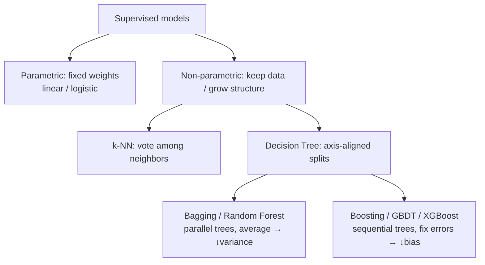

# 06 — k-NN, Decision Trees & Ensembles

> Part 2 · Lesson 06 · Code stack: scikit-learn

**Prerequisites:** [05 — Overfitting, Regularization & Evaluation](05-overfitting-evaluation.md) (you should already know train/test splits, cross-validation, and the bias–variance trade-off). Also helpful: [04 — Logistic Regression & Classification](04-logistic-regression.md) for the classification framing.

**By the end you can:**
- Explain how **k-Nearest Neighbors** classifies by distance, choose $k$ sensibly, and say *why* it falls apart in high dimensions.
- Describe how a **decision tree** picks splits using **Gini impurity** / **entropy** and **information gain**, and why deep trees overfit.
- Distinguish **bagging** (Random Forests — variance reduction by averaging) from **boosting** (Gradient Boosting / XGBoost — sequentially fixing errors).
- Train and compare all four in scikit-learn, plot decision boundaries, and read a **feature-importance** chart.

---

## 1. Intuition

Until now (lessons 02–05) every model was **parametric**: linear and logistic regression learn a fixed vector of weights $\mathbf{w}$ and then *throw the training data away*. This lesson is about models that work differently.

**k-NN is the laziest possible model.** It learns *nothing* at training time — it just memorizes the data. To classify a new point, it looks at the $k$ closest stored examples and takes a vote. Analogy: dropped into an unfamiliar town and asked "is this a safe street?", you'd glance at the nearest few houses and judge by them. No theory, just neighbors.

**A decision tree is a flowchart of yes/no questions.** "Is petal length < 2.5 cm? → if yes, *setosa*; if no, is petal width < 1.8 cm? ...". Each question slices the feature space with an axis-aligned cut. It's exactly how a marine surveyor might reason: *"Backscatter strong? Then rock or gravel. Slope steep too? Rock."*

**Ensembles** are the punchline: one tree is twitchy and overfits, but a *committee* of trees is powerful. Two recipes:
- **Bagging / Random Forest** — grow many trees on bootstrap resamples and *average* them. Averaging cancels the noise → lower variance.
- **Boosting** — grow trees *one at a time*, each one focused on the mistakes of the previous ones. This drives down bias, building a strong learner from weak ones.



Why care for autonomous vehicles? These models eat **heterogeneous tabular sensor features** (sonar backscatter, IMU variance, lidar return intensity, camera color stats) without needing them on the same scale (trees) or any training at all (k-NN). They're fast, interpretable baselines you reach for *before* a neural net.

---

## 2. The Math

### 2.1 k-Nearest Neighbors

No training objective — prediction *is* the algorithm. For a query point $\mathbf{x}$, find the index set $N_k(\mathbf{x})$ of the $k$ training points with smallest distance, then vote:

$$\hat{y}(\mathbf{x}) = \operatorname*{arg\,max}_{c}\sum_{i \in N_k(\mathbf{x})} \mathbb{1}[\,y_i = c\,]$$

where $c$ ranges over class labels, $y_i$ is the label of training point $i$, and $\mathbb{1}[\cdot]$ is 1 when the condition holds, else 0. For regression you'd average the neighbors' values instead of voting.

**Distance metrics.** The whole model hinges on what "close" means. The general **Minkowski** distance between points $\mathbf{x}, \mathbf{z} \in \mathbb{R}^d$ is

$$d_p(\mathbf{x},\mathbf{z}) = \left(\sum_{j=1}^{d} |x_j - z_j|^p\right)^{1/p}$$

- $p=2$ → **Euclidean** (straight-line). The default.
- $p=1$ → **Manhattan** (city-block); more robust to outliers in single coordinates.
- For directional data (e.g. heading vectors) **cosine** distance $1 - \frac{\mathbf{x}\cdot\mathbf{z}}{\lVert\mathbf{x}\rVert\,\lVert\mathbf{z}\rVert}$ is often better.

**Why you MUST scale features.** Distance sums over coordinates, so a feature measured in *metres* (range 0–1000) drowns out one in *radians* (range 0–6). Standardize first: $x_j \leftarrow (x_j - \mu_j)/\sigma_j$, with $\mu_j,\sigma_j$ the training mean and std of feature $j$. (This is exactly the `StandardScaler` from lesson 05.)

**Choosing $k$.** This is the bias–variance knob:
- $k=1$ → zero training error, jagged boundary, **high variance** (memorizes noise).
- $k$ large → smooth boundary, **high bias** (washes out real structure); at $k=N$ it just predicts the majority class.

Pick $k$ by cross-validation. A common rule of thumb is $k \approx \sqrt{N}$, and odd $k$ avoids ties in binary problems.

**The curse of dimensionality.** Here's the killer. In high dimensions, *all* points become roughly equidistant, so "nearest" loses meaning. One way to see it: the contrast between the farthest and nearest neighbor shrinks,

$$\frac{\mathbb{E}[\,d_{\max} - d_{\min}\,]}{\mathbb{E}[\,d_{\min}\,]} \to 0 \quad \text{as } d \to \infty.$$

Intuitively, volume explodes exponentially with $d$, so any fixed sample becomes sparse — your "neighbors" are no longer near. We'll *measure* this collapse in code below.

### 2.2 Decision Trees — how a split is chosen

A tree recursively partitions the data. At each node it searches over **(feature $j$, threshold $t$)** pairs and picks the split that most "purifies" the children. Purity of a node with class proportions $p_c$ (fraction of samples in class $c$) is measured two ways:

$$\underbrace{G = 1 - \sum_{c} p_c^2}_{\text{Gini impurity}}, \qquad \underbrace{H = -\sum_{c} p_c \log_2 p_c}_{\text{entropy}}$$

Both are **0 when the node is pure** (one class) and **maximal when classes are balanced** (for 2 classes: $G=0.5$, $H=1$ bit). Gini is the default in scikit-learn — it's cheaper (no log) and behaves almost identically.

> *Where do these come from?* Gini is the probability you'd misclassify a random sample if you labeled it by drawing from the node's class distribution: $\sum_c p_c(1-p_c) = 1-\sum_c p_c^2$. Entropy is Shannon's information content — bits needed to encode the label.

A candidate split sends a fraction $\frac{N_L}{N}$ of samples left and $\frac{N_R}{N}$ right. **Information gain** is the impurity *removed*:

$$\text{IG} = I(\text{parent}) - \left(\frac{N_L}{N}\,I(\text{left}) + \frac{N_R}{N}\,I(\text{right})\right)$$

where $I$ is Gini or entropy, $N$ is the parent count, $N_L, N_R$ the child counts. The tree **greedily picks the split with the largest IG**, then recurses. It stops when a node is pure, hits `max_depth`, or falls below `min_samples_leaf`.

**Why deep trees overfit.** With no depth limit a tree keeps splitting until every leaf has one sample — training error 0, but the boundary is a maze of slivers fit to noise. That's the **high-variance** end of lesson 05's trade-off. The cures: limit depth, require more samples per leaf, prune — or, better, *ensemble* them.

### 2.3 Ensembles — why a committee beats one tree

**Bagging (Bootstrap AGGregatING).** Train $B$ trees, each on a bootstrap resample (sample $N$ points *with replacement*) of the data, and average their predictions (vote for classification). Key fact: if the $B$ predictors each have variance $\sigma^2$ and pairwise correlation $\rho$, the average has variance

$$\operatorname{Var}\!\left(\tfrac{1}{B}\sum_{b} f_b\right) = \rho\,\sigma^2 + \frac{1-\rho}{B}\,\sigma^2.$$

As $B\to\infty$ the second term vanishes; what's left is $\rho\sigma^2$. So **the lower the correlation between trees, the more variance you kill.** A **Random Forest** is bagging plus one trick: at each split consider only a *random subset* of features (typically $\sqrt{d}$). That decorrelates the trees (no single strong feature dominates every tree), shrinking $\rho$ and squeezing more out of the average. Bias stays about the same as a single deep tree; variance drops hard.

**Boosting.** Instead of independent trees, build them **sequentially**, each correcting the running model's residual errors. **Gradient boosting** frames this as gradient descent in function space: the ensemble is

$$F_M(\mathbf{x}) = \sum_{m=1}^{M} \nu\, h_m(\mathbf{x}),$$

and each new weak tree $h_m$ is fit to the **negative gradient** of the loss w.r.t. the current prediction (for squared loss, that's literally the residual $y_i - F_{m-1}(\mathbf{x}_i)$):

$$h_m \approx -\left.\frac{\partial L}{\partial F}\right|_{F = F_{m-1}}, \qquad F_m = F_{m-1} + \nu\, h_m.$$

The **learning rate** $\nu \in (0,1]$ shrinks each tree's contribution — smaller $\nu$ needs more trees but generalizes better. **XGBoost / LightGBM** are the industrial-strength versions: same idea, plus a regularized objective, second-order (Newton) updates, and clever histogram-based split finding. Boosting attacks **bias** (turns shallow "stumps" into a strong learner) but can overfit if you use too many trees with no regularization — the opposite failure mode from a forest.

| | trees built | reduces mainly | overfits when | parallel? |
|---|---|---|---|---|
| **Random Forest** | independently | **variance** | almost never with more trees | yes |
| **Gradient Boosting** | sequentially | **bias** | too many trees / large $\nu$ | no |

**Feature importance.** Trees give it nearly free: for each feature, sum the (sample-weighted) impurity decrease over every split that used it, across all trees, then normalize to sum to 1. Caveat: this *impurity-based* importance is biased toward high-cardinality / continuous features. **Permutation importance** (shuffle one feature, measure the drop in validation score) is more trustworthy.

---

## 3. Code

We'll compare all four models on **Iris** (the classic), then visualize boundaries and importances. Everything below runs in one script.

```python
import numpy as np
import matplotlib.pyplot as plt
from sklearn.datasets import load_iris
from sklearn.model_selection import train_test_split, cross_val_score
from sklearn.preprocessing import StandardScaler
from sklearn.pipeline import make_pipeline
from sklearn.neighbors import KNeighborsClassifier
from sklearn.tree import DecisionTreeClassifier
from sklearn.ensemble import RandomForestClassifier, GradientBoostingClassifier
from sklearn.metrics import accuracy_score

# --- data -------------------------------------------------------------
iris = load_iris()
X, y = iris.data, iris.target          # 150 samples, 4 features, 3 classes
feat = iris.feature_names

# stratify=y keeps class proportions equal in train and test (lesson 05)
X_tr, X_te, y_tr, y_te = train_test_split(
    X, y, test_size=0.25, random_state=42, stratify=y)

# --- four models, one interface --------------------------------------
# NOTE: k-NN is wrapped in a pipeline so the SAME scaler fit on train is
#       reused on test. Trees are scale-invariant, so they need no scaler.
models = {
    "k-NN (k=5)":        make_pipeline(StandardScaler(),
                                       KNeighborsClassifier(n_neighbors=5)),
    "Decision Tree":     DecisionTreeClassifier(max_depth=3, random_state=0),
    "Random Forest":     RandomForestClassifier(n_estimators=200, random_state=0),
    "Gradient Boosting": GradientBoostingClassifier(n_estimators=200,
                                                    learning_rate=0.1,
                                                    random_state=0),
}

for name, m in models.items():
    m.fit(X_tr, y_tr)                              # fit on training split
    acc = accuracy_score(y_te, m.predict(X_te))    # held-out accuracy
    cv  = cross_val_score(m, X, y, cv=5).mean()    # 5-fold CV on all data
    print(f"{name:20s}  test acc {acc:.3f}   cv acc {cv:.3f}")

# -> k-NN (k=5)            test acc 0.921   cv acc 0.960
# -> Decision Tree         test acc 0.895   cv acc 0.960
# -> Random Forest         test acc 0.895   cv acc 0.960
# -> Gradient Boosting     test acc 0.974   cv acc 0.960
```

All four land around 95–96% CV accuracy — Iris is easy, so don't read too much into the single-split differences (they're a couple of flowers). The point is the **uniform scikit-learn API**: `fit` / `predict` / `cross_val_score` work identically across wildly different model families.

### Feel the curse of dimensionality

```python
from scipy.spatial.distance import pdist
rng = np.random.default_rng(0)
print("dim   contrast = (max-min)/min pairwise distance")
for d in [2, 10, 100, 1000]:
    P = rng.random((200, d))               # 200 uniform points in [0,1]^d
    dist = pdist(P)                        # all pairwise distances
    contrast = (dist.max() - dist.min()) / dist.min()
    print(f"{d:5d}   {contrast:.3f}")

# -> 2      533.858     <- nearest is ~500x closer than farthest: meaningful
# -> 10     4.928
# -> 100    0.618
# -> 1000   0.169       <- everything is ~equidistant: "nearest" is noise
```

As $d$ grows, the gap between nearest and farthest neighbor collapses toward zero — this is *why* k-NN needs dimensionality reduction (lesson 08, PCA) or feature selection before it works on high-dimensional data like raw pixels.

### Decision boundaries (2-D so we can see them)

```python
from sklearn.inspection import DecisionBoundaryDisplay

X2 = iris.data[:, 2:4]   # petal length & width only — most informative pair
clfs = {
    "k-NN (k=15)":    KNeighborsClassifier(n_neighbors=15),
    "Tree (depth=4)": DecisionTreeClassifier(max_depth=4, random_state=0),
    "Random Forest":  RandomForestClassifier(n_estimators=200, random_state=0),
}
fig, axes = plt.subplots(1, 3, figsize=(15, 4))
for ax, (name, clf) in zip(axes, clfs.items()):
    clf.fit(X2, y)
    DecisionBoundaryDisplay.from_estimator(
        clf, X2, ax=ax, alpha=0.3, response_method="predict")
    ax.scatter(X2[:, 0], X2[:, 1], c=y, edgecolor="k", s=20)
    ax.set_title(name)
    ax.set_xlabel("petal length (cm)"); ax.set_ylabel("petal width (cm)")
plt.tight_layout()
plt.savefig("boundaries.png", dpi=110)
```

**What you should SEE:** k-NN draws a *smooth, curved* boundary that follows the data cloud. The single tree's boundary is made of strictly **horizontal and vertical steps** (axis-aligned splits) — blocky and a bit over-confident in the corners. The Random Forest is also stair-stepped (it's still trees) but *smoother and softer* at the edges because it averages 200 of them — that smoothing is variance reduction made visible.

### Feature importance bar chart

```python
rf = RandomForestClassifier(n_estimators=300, random_state=0).fit(X, y)
order = np.argsort(rf.feature_importances_)[::-1]   # high → low

plt.figure(figsize=(6, 3.5))
plt.barh([feat[i] for i in order][::-1],
         rf.feature_importances_[order][::-1])
plt.xlabel("Mean impurity decrease (importance)")
plt.title("Random Forest feature importance — Iris")
plt.tight_layout()
plt.savefig("importance.png", dpi=110)

for i in order:
    print(f"  {feat[i]:22s} {rf.feature_importances_[i]:.3f}")
# ->   petal length (cm)      0.440
# ->   petal width (cm)       0.420
# ->   sepal length (cm)      0.113
# ->   sepal width (cm)       0.027
```

**What you should SEE:** two long bars (the two petal features) and two stubs. The forest *discovered* that petals separate the species and sepals barely matter — without you telling it. That's the kind of insight you'd want from a sensor-fusion model: *which channels actually drive the decision?*

> For a trustworthy version, swap in `from sklearn.inspection import permutation_importance` and run it on a held-out set — it isn't fooled by high-cardinality features.

---

## 4. Real Case — Seabed / Terrain Classification from Multi-Sensor Features

You're running a survey USV with a **multibeam sonar** and want to auto-label the seabed as **mud / sand / gravel / rock** (a real hydrographic task that feeds safe-navigation charts). You don't feed raw waveforms to a tree — you engineer a tabular feature vector per ping or per grid cell:

| feature | sensor | why it helps |
|---|---|---|
| mean backscatter intensity | sonar | rock reflects strongly, mud absorbs |
| backscatter std / texture (GLCM) | sonar | gravel is "rough", mud is smooth |
| local depth gradient / slope | bathymetry | rock outcrops are steep |
| depth | bathymetry | facies correlate with depth zones |
| return-pulse width | sonar | hard vs. soft bottom |

This is a textbook fit for tree ensembles, and here's the engineering reasoning:

- **No scaling needed.** Backscatter (dB), slope (degrees), and depth (m) live on totally different scales. Trees split on thresholds per-feature, so they're **invariant to monotonic rescaling** — you skip the `StandardScaler` headache that k-NN demands. (If you *did* use k-NN here, unscaled depth in metres would dominate the distance and wreck it.)
- **Mixed feature types & missing data.** Real surveys have dropouts; tree ensembles tolerate them far better than distance-based methods.
- **Random Forest first.** It's the no-tune baseline: robust, hard to overfit, and the **feature-importance chart tells the surveyor which sensor channel is carrying the classification** — maybe texture matters more than absolute intensity, which informs sensor calibration.
- **Then Gradient Boosting (XGBoost/LightGBM)** when you need to squeeze out the last few accuracy points for the final chart product — at the cost of tuning `n_estimators`, `learning_rate`, and `max_depth`.

Mapped onto the math: each tree asks questions like *"backscatter > -18 dB? and slope > 12°? → rock"*, exactly the axis-aligned splits from §2.2, chosen by Gini gain. The forest averages hundreds of such flowcharts so a single noisy ping doesn't flip the label. The same recipe transfers directly to **UAV terrain classification** (NDVI + elevation + texture → vegetation/soil/water) and **ROV pipeline inspection** (feature vectors → corrosion/clean/anomaly). If you prefer a public stand-in to practice on, the **UCI "Sonar, Mines vs. Rocks"** dataset (60 sonar-band energies → metal cylinder vs. rock) is the spiritual ancestor of this exact problem.

---

## 5. Pitfalls & Tips

- **k-NN without scaling is broken.** Distance is dominated by large-range features. Always `StandardScaler` (or `MinMaxScaler`) *inside a pipeline* so the scaler is fit on train only — never on the full data, or you leak test info (lesson 05).
- **Don't trust k-NN in high dimensions.** Past ~10–20 features the curse kicks in. Reduce dimensions (PCA, lesson 08) or select features first. Tree ensembles handle wide feature sets far better.
- **A single un-pruned tree almost always overfits.** Set `max_depth` / `min_samples_leaf`, validate with CV — or just use a Random Forest and stop worrying.
- **More trees never hurt a forest, but plateau.** Going from 100→1000 trees mostly costs compute. With *boosting* the opposite is true: too many trees overfit, so tune `n_estimators` against a validation curve and use early stopping.
- **Impurity-based feature importance is biased** toward continuous / high-cardinality features and can be misled by correlated features (importance gets split between them). Prefer `permutation_importance` on held-out data when the answer matters.
- **Trees can't extrapolate.** A regression tree predicts a constant outside the training range — fine for classification, dangerous if you're regressing a trajectory beyond observed conditions. Know this before trusting a tree to predict, say, drag at an unseen speed.

---

## 6. Check Your Understanding

**Q1.** You train k-NN on lidar features where range is in metres (0–120) and intensity is 0–1. Accuracy is terrible. What's the single most likely cause and fix?

<details><summary>Answer</summary>
Unscaled features. The Euclidean distance is dominated by `range` (spans ~120) while `intensity` (spans ~1) is invisible, so "nearest neighbor" is effectively decided by range alone. Fix: standardize features (`StandardScaler`) inside a pipeline. Trees wouldn't have this problem because they split per-feature.
</details>

**Q2.** A node has 80 samples of class A and 20 of class B. Compute its Gini impurity. Is this a good or bad split target?

<details><summary>Answer</summary>
$p_A = 0.8,\ p_B = 0.2$, so $G = 1 - (0.8^2 + 0.2^2) = 1 - (0.64 + 0.04) = 0.32$. It's fairly impure (max for 2 classes is 0.5). The tree will keep trying to split this node to drive $G$ toward 0 — a pure node has $G=0$.
</details>

**Q3.** Both Random Forests and Gradient Boosting are made of trees. In one sentence each, what does adding *more trees* do to each, and which mainly fights variance vs. bias?

<details><summary>Answer</summary>
**Random Forest:** trees are independent and averaged, so more trees keeps reducing variance and then plateaus — it (almost) never overfits from more trees; it mainly fights **variance**. **Gradient Boosting:** trees are sequential and additive, so more trees keeps reducing training error and *can* overfit; it mainly fights **bias**. (RF parallel, GB sequential.)
</details>

**Q4.** Why does a Random Forest restrict each split to a random subset of features, instead of always considering all of them like a single tree does?

<details><summary>Answer</summary>
To **decorrelate** the trees. If one feature is very predictive, every tree would split on it first and the trees would look alike — averaging correlated predictors barely reduces variance (recall $\rho\sigma^2$ stays). Forcing a random feature subset per split lowers $\rho$, so the average kills much more variance.
</details>

**Q5.** Your boundary plot shows the single decision tree's regions are all rectangles with horizontal/vertical edges, but k-NN's boundary is a smooth curve. Why the difference?

<details><summary>Answer</summary>
A decision tree splits on one feature at a time with a threshold ("$x_j < t$"), which is an **axis-aligned** cut — composing them yields only rectangular regions. k-NN's boundary follows local point density (the set of points equidistant between class clusters), which is generally curved. To get oblique boundaries from trees you'd need an ensemble (smoother) or a different model entirely (e.g. SVM with a kernel — next lesson).
</details>

---

## Recap & Next

- **k-NN** is lazy: memorize, then vote among the $k$ nearest neighbors. Scale your features, choose $k$ by CV, and beware the **curse of dimensionality**.
- **Decision trees** greedily pick axis-aligned splits that maximize **information gain** (drop in **Gini** / **entropy**). Alone they overfit; control depth or ensemble them.
- **Random Forests** = bagging + random features → average many decorrelated trees → **variance** down. The no-tune robust baseline.
- **Gradient Boosting / XGBoost** = sequential trees fixing residual errors → **bias** down. More powerful, more tuning, can overfit.
- **Feature importance** falls out of trees for free — but prefer permutation importance when it matters.

These tree boundaries are blocky and k-NN's are local. Next we get a model that draws the *single best straight (or, via kernels, curved) margin* between classes, with a beautiful optimization story behind it.

**Next:** [07 — Support Vector Machines & Kernels](07-svm-kernels.md)
