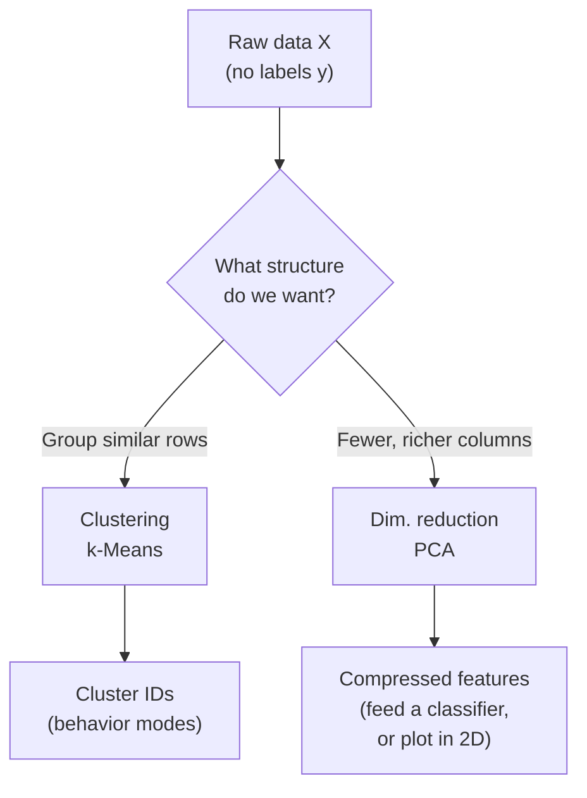
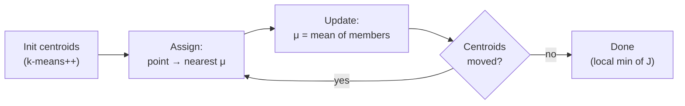

# 08 — Unsupervised Learning: k-Means & PCA

> Part 2 · Lesson 08 · Code stack: scikit-learn (+ tiny numpy PCA)

**Prerequisites:** [07 — Support Vector Machines & Kernels](07-svm-kernels.md)

**By the end you can:**
- Explain how **k-Means** finds clusters via the **Lloyd (assign/update) loop** and what objective it minimizes.
- Pick a sensible number of clusters $k$ using the **elbow method** and **silhouette score**, and name when k-Means breaks.
- Derive **PCA** as the directions of maximum variance and connect them to **eigenvectors of the covariance matrix**.
- Use **explained-variance ratio** to decide how many components to keep, and know when to reach for t-SNE/UMAP instead.
- Apply both to robotics data: cluster ROV dive logs into behavior modes, and compress high-dimensional sensor features before a classifier.

---

## 1. Intuition

Every method so far needed **labels**: you handed the model $(x, y)$ pairs and it learned the mapping. **Unsupervised learning** drops the $y$. You only have $X$, and you want the algorithm to surface *structure* on its own.

Two structures matter constantly:

- **Clustering** — "which points belong together?" Group rows. (k-Means)
- **Dimensionality reduction** — "which directions actually carry the information?" Squeeze columns. (PCA)

**Analogy.** Picture your ROV's flight recorder dumping thousands of timestamped snapshots — depth, pitch, thruster current, altitude-above-seabed, heading rate. Nobody labeled them. **k-Means** is like a dock supervisor sorting those snapshots into a few buckets — "transit," "station-keeping," "descent," "bottom-survey" — purely by how similar the numbers are. **PCA** is like realizing that out of 12 sensors, only 3 *combined* signals (a "dive aggressiveness" axis, a "lateral drift" axis, a "power draw" axis) explain almost everything; the rest is redundancy and noise. One groups rows, the other re-describes columns.



These two pair naturally: PCA first to denoise/compress, then k-Means on the compressed space — a workhorse pipeline you'll use again and again.

---

## 2. The Math

### k-Means: the objective

We have $n$ points $x_i \in \mathbb{R}^d$ and want $k$ clusters. k-Means picks $k$ **centroids** $\mu_1, \dots, \mu_k \in \mathbb{R}^d$ and assigns each point to its nearest centroid. It minimizes the **within-cluster sum of squares (WCSS)**, also called *inertia*:

$$
J = \sum_{i=1}^{n} \min_{j \in \{1,\dots,k\}} \; \lVert x_i - \mu_j \rVert^2
$$

- $x_i$ — the $i$-th data point (a $d$-dimensional vector).
- $\mu_j$ — centroid of cluster $j$.
- $\lVert \cdot \rVert^2$ — squared Euclidean distance; the "spread" we want small.
- $J$ — total squared distance from every point to *its* centroid. Smaller $J$ = tighter clusters.

Where it comes from: if every cluster is summarized by one prototype point, $J$ is the total squared reconstruction error of replacing each $x_i$ by its prototype. Minimizing it is exactly "make the prototypes representative."

### The Lloyd loop (why it works)

Minimizing $J$ jointly over assignments **and** centroids is NP-hard, so we alternate — fixing one, optimizing the other:

1. **Assign step.** Fix centroids. Put each point in the nearest cluster:
$$
c_i = \arg\min_{j} \; \lVert x_i - \mu_j \rVert^2
$$
This is optimal for $J$ given the centroids — each point picks its cheapest term.

2. **Update step.** Fix assignments. Set each centroid to the **mean** of its members:
$$
\mu_j = \frac{1}{|C_j|} \sum_{i \in C_j} x_i
$$
Why the mean? For a fixed cluster $C_j$, $\sum_{i \in C_j}\lVert x_i - \mu_j\rVert^2$ is minimized by setting $\nabla_{\mu_j} = 0$, i.e. $\sum_{i\in C_j}(x_i - \mu_j)=0 \Rightarrow \mu_j = \text{mean}$. The mean *is* the least-squares center.

Each step can only lower (or hold) $J$, and $J \ge 0$, so the loop **converges** — but only to a *local* minimum. Hence we run several random restarts (`n_init`) and keep the best. **k-means++** seeds the initial centroids spread out, which dramatically reduces bad local optima.



### Choosing $k$

- **Elbow method.** Plot $J(k)$ vs $k$. It always decreases (more centroids → tighter), but the *rate* drops sharply at the "right" $k$ — the elbow. Pick where the curve bends from steep to flat.
- **Silhouette score.** For point $i$, let $a_i$ = mean distance to its own cluster, $b_i$ = mean distance to the *nearest other* cluster. Then
$$
s_i = \frac{b_i - a_i}{\max(a_i, b_i)} \in [-1, 1]
$$
Near $+1$ = snugly in its cluster and far from others; near $0$ = on a boundary; negative = probably misassigned. Average $s_i$ over all points and pick the $k$ that maximizes it. Silhouette is more principled than the eyeball elbow.

### PCA: directions of maximum variance

Center the data: $\tilde{X} = X - \bar{x}$ (subtract the column means; PCA *requires* centering). The **covariance matrix** is

$$
\Sigma = \frac{1}{n-1}\, \tilde{X}^\top \tilde{X} \in \mathbb{R}^{d \times d}
$$

- $\Sigma_{ab}$ — how feature $a$ and feature $b$ co-vary. Diagonal = per-feature variance.

We want the unit direction $w$ ($\lVert w \rVert = 1$) along which the projected data $\tilde{X} w$ has **maximum variance**. The variance of the projection is

$$
\operatorname{Var}(\tilde{X} w) = w^\top \Sigma\, w
$$

Maximizing $w^\top \Sigma w$ subject to $\lVert w\rVert = 1$ is a constrained problem. The Lagrangian $w^\top\Sigma w - \lambda(w^\top w - 1)$ has gradient zero when

$$
\Sigma\, w = \lambda\, w
$$

That's the **eigenvector equation**. So the optimal directions are the **eigenvectors of $\Sigma$**, and the variance captured along each is its **eigenvalue** $\lambda$ (since $w^\top\Sigma w = \lambda$). Sort eigenvalues descending: the top eigenvector is **PC1** (most variance), next is **PC2** (most *remaining* variance, orthogonal to PC1), and so on.

To reduce to $p < d$ dimensions, project onto the top $p$ eigenvectors $W_p = [w_1, \dots, w_p]$:

$$
Z = \tilde{X}\, W_p \in \mathbb{R}^{n \times p}
$$

The **explained-variance ratio** of component $j$ is

$$
\text{EVR}_j = \frac{\lambda_j}{\sum_{m=1}^{d} \lambda_m}
$$

Keep enough components that the cumulative EVR clears a threshold (say 0.95 = "retain 95% of the variance").

> Practical note: in production you'd use the **SVD** of $\tilde{X}$ rather than forming $\Sigma$ explicitly (more numerically stable) — that's what scikit-learn does. The eigen-of-covariance view is the cleanest to *understand*; they give the same answer.

**PCA is linear.** For *visualizing* tangled, nonlinear structure (e.g., MNIST digit manifolds), reach for **t-SNE** or **UMAP** — they preserve local neighborhoods for pretty 2D maps. But they distort global distances and aren't reversible, so use them for *looking*, not as features for a downstream model. PCA stays the default for compression.

---

## 3. Code

```python
import numpy as np
import matplotlib.pyplot as plt
from sklearn.datasets import make_blobs
from sklearn.cluster import KMeans
from sklearn.metrics import silhouette_score

# --- Synthetic clusters: 4 Gaussian blobs in 2D ---------------------------
X, y_true = make_blobs(
    n_samples=600, centers=4, cluster_std=0.90,
    random_state=42,
)

# --- Fit k-Means -----------------------------------------------------------
km = KMeans(
    n_clusters=4,
    init="k-means++",   # smart seeding -> fewer bad local minima
    n_init=10,          # 10 random restarts, keep the lowest inertia
    random_state=42,
)
labels = km.fit_predict(X)

print(f"inertia (WCSS J): {km.inertia_:.1f}")
print(f"iterations to converge: {km.n_iter_}")
# -> inertia (WCSS J): 941.9
# -> iterations to converge: 2
```

Note we used the true number of blobs (4). In the wild you don't know it — so let's *find* it.

```python
# --- Choosing k: elbow (inertia) + silhouette ------------------------------
ks = range(2, 9)
inertias, sils = [], []
for k in ks:
    m = KMeans(n_clusters=k, n_init=10, random_state=42).fit(X)
    inertias.append(m.inertia_)
    sils.append(silhouette_score(X, m.labels_))

best_k = ks[int(np.argmax(sils))]
print(f"best k by silhouette: {best_k}")
# -> best k by silhouette: 4

fig, ax = plt.subplots(1, 2, figsize=(11, 4))
ax[0].plot(list(ks), inertias, "o-")
ax[0].set(xlabel="k", ylabel="inertia (WCSS J)", title="Elbow method")
ax[1].plot(list(ks), sils, "o-", color="tab:green")
ax[1].set(xlabel="k", ylabel="mean silhouette", title="Silhouette")
plt.tight_layout()
plt.show()
```

What you should SEE: the elbow plot bends hard at $k=4$ (steep then flat), and the silhouette plot peaks at $k=4$. Two independent signals agreeing on the truth.

```python
# --- Visualize clusters + centroids ---------------------------------------
plt.figure(figsize=(6, 5))
plt.scatter(X[:, 0], X[:, 1], c=labels, cmap="tab10", s=18, alpha=0.7)
plt.scatter(
    km.cluster_centers_[:, 0], km.cluster_centers_[:, 1],
    marker="X", s=260, c="black", edgecolor="white", linewidths=1.5,
    label="centroids",
)
plt.legend(); plt.title("k-Means clusters"); plt.tight_layout(); plt.show()
```

What you should SEE: four colored point-clouds with a black **X** sitting at the center of mass of each — the centroids landed right in the middle of every blob.

### PCA from scratch (numpy eig) vs scikit-learn

```python
from sklearn.decomposition import PCA
from sklearn.datasets import load_iris

iris = load_iris()
A = iris.data            # (150, 4): sepal/petal length & width
y = iris.target

# ---- From scratch: eigen-decomposition of the covariance matrix ----------
A_centered = A - A.mean(axis=0)                 # PCA needs centering
cov = np.cov(A_centered, rowvar=False)          # (4, 4) covariance Σ
eigvals, eigvecs = np.linalg.eigh(cov)          # eigh: symmetric -> real, sorted ASC

order = np.argsort(eigvals)[::-1]               # sort DESCENDING by variance
eigvals, eigvecs = eigvals[order], eigvecs[:, order]

evr = eigvals / eigvals.sum()                   # explained-variance ratio
print("EVR (from scratch):", np.round(evr, 4))
# -> EVR (from scratch): [0.9246 0.0531 0.0171 0.0052]

Z_scratch = A_centered @ eigvecs[:, :2]         # project onto top-2 PCs

# ---- scikit-learn (uses SVD internally) ----------------------------------
pca = PCA(n_components=2)
Z_sklearn = pca.fit_transform(A)                # sklearn centers for you
print("EVR (sklearn):     ", np.round(pca.explained_variance_ratio_, 4))
# -> EVR (sklearn):      [0.9246 0.0531]

# Same subspace — signs of eigenvectors can flip, so compare |coords|.
print("match:", np.allclose(np.abs(Z_scratch), np.abs(Z_sklearn), atol=1e-6))
# -> match: True
```

The first two of four components already hold **~98%** of the variance — Iris is nearly 2D in disguise.

```python
# --- Scatter the 2D projection --------------------------------------------
plt.figure(figsize=(6, 5))
for c, name in zip(range(3), iris.target_names):
    plt.scatter(Z_sklearn[y == c, 0], Z_sklearn[y == c, 1], s=22, label=name)
plt.xlabel("PC1 (92.5% var)"); plt.ylabel("PC2 (5.3% var)")
plt.legend(); plt.title("Iris projected to 2D via PCA"); plt.tight_layout(); plt.show()
```

What you should SEE: collapsing 4D → 2D, *setosa* sits as a cleanly separated blob on the left, while *versicolor* and *virginica* form two adjacent (slightly overlapping) groups — the structure survives the squeeze.

---

## 4. Real Case

### (a) Clustering ROV dive logs into behavior modes

Your ROV streams telemetry at 5 Hz. Per timestep you compute a feature vector — depth rate, pitch, roll rate, total thruster current, altitude-above-seabed, heading-rate magnitude. You want to *automatically segment* hours of footage into behavior modes without hand-labeling.

```python
import numpy as np
from sklearn.preprocessing import StandardScaler
from sklearn.cluster import KMeans
from sklearn.pipeline import make_pipeline

rng = np.random.default_rng(0)

def mode(n, depth_rate, thruster, altitude, hdg_rate):
    """Fake one behavior mode: [depth_rate, pitch, thruster_A, altitude_m, hdg_rate]."""
    return np.column_stack([
        rng.normal(depth_rate, 0.05, n),
        rng.normal(0.0,        0.5,  n),
        rng.normal(thruster,   0.3,  n),
        rng.normal(altitude,   0.4,  n),
        rng.normal(hdg_rate,   0.3,  n),
    ])

# transit: fast forward, mid altitude | descent: sinking | station-keep: hover | survey: low + steady
X = np.vstack([
    mode(300, depth_rate=0.0,  thruster=3.0, altitude=5.0, hdg_rate=0.2),  # transit
    mode(300, depth_rate=0.6,  thruster=1.5, altitude=8.0, hdg_rate=0.1),  # descent
    mode(300, depth_rate=0.0,  thruster=0.8, altitude=3.0, hdg_rate=0.0),  # station-keep
    mode(300, depth_rate=0.0,  thruster=1.2, altitude=1.0, hdg_rate=1.5),  # bottom survey
])

# CRITICAL: standardize. Thruster current (amps) and depth_rate (m/s) live on
# wildly different scales; without scaling, Euclidean distance is dominated by
# whichever feature has the biggest raw numbers.
pipe = make_pipeline(StandardScaler(), KMeans(n_clusters=4, n_init=10, random_state=0))
modes = pipe.fit_predict(X)

# Inspect cluster centers back in original units to NAME the modes.
km = pipe.named_steps["kmeans"]
scaler = pipe.named_steps["standardscaler"]
centers = scaler.inverse_transform(km.cluster_centers_)
cols = ["depth_rate", "pitch", "thruster_A", "altitude_m", "hdg_rate"]
for i, c in enumerate(centers):
    print(f"cluster {i}: " + ", ".join(f"{n}={v:+.2f}" for n, v in zip(cols, c)))
# -> e.g. cluster with depth_rate≈+0.6 -> "descent"; altitude≈1.0 & hdg_rate≈1.5 -> "bottom survey"
```

**Mapping.** k-Means hands you anonymous cluster IDs 0–3; *you* read the centroids (in real units, after `inverse_transform`) to attach human names. Now you can auto-tag a 3-hour dive, jump straight to "bottom-survey" segments, flag anomalous timesteps (large distance to every centroid = nothing-like-normal), and trigger different logging/control policies per mode — all unsupervised.

### (b) PCA to compress sensor features before a classifier

Imagine a 64-bin **forward-looking sonar** return per ping = a 64-dimensional vector, used to classify the seabed (sand / rock / wreck). Adjacent bins are highly correlated, so the *intrinsic* dimensionality is far below 64. PCA compresses before the classifier — fewer features → faster training, less overfitting (recall [05 — Overfitting & Evaluation](05-overfitting-evaluation.md)), and a denoising effect since the dropped low-variance components are mostly noise.

```python
from sklearn.datasets import load_digits          # 8x8 = 64-dim, a clean stand-in for sonar bins
from sklearn.decomposition import PCA
from sklearn.linear_model import LogisticRegression
from sklearn.pipeline import make_pipeline
from sklearn.model_selection import cross_val_score

digits = load_digits()
Xs, ys = digits.data, digits.target               # (1797, 64)

# Keep enough PCs to retain 90% of the variance -- let PCA pick the count.
clf = make_pipeline(PCA(n_components=0.90), LogisticRegression(max_iter=5000))
clf.fit(Xs, ys)
n_kept = clf.named_steps["pca"].n_components_
print(f"kept {n_kept} of 64 dims for 90% variance")
# -> kept 21 of 64 dims for 90% variance

acc_pca  = cross_val_score(clf, Xs, ys, cv=5).mean()
acc_full = cross_val_score(
    make_pipeline(LogisticRegression(max_iter=5000)), Xs, ys, cv=5).mean()
print(f"accuracy  PCA(21d): {acc_pca:.3f}   full(64d): {acc_full:.3f}")
# -> accuracy  PCA(21d): 0.893   full(64d): 0.914
```

We threw away **two-thirds** of the dimensions and kept essentially the same accuracy. On your sonar pipeline that means a lighter, faster model that fits the ROV's onboard compute budget — fit PCA once on logged data, then `.transform()` each incoming ping in real time.

---

## 5. Pitfalls & Tips

- **Always scale before k-Means and PCA.** Both rely on Euclidean distance / variance. A feature in amps (0–10) will swamp one in m/s (0–1). Use `StandardScaler` unless features are already comparable. This is the #1 cause of "my clusters look random."
- **k-Means assumes spherical, equal-size, equal-density clusters.** It draws straight (Voronoi) boundaries and will happily split one long ellipse in two or merge two thin ones. For elongated/nested/varying-density shapes, use **GMM** (elliptical) or **DBSCAN** (density-based, finds arbitrary shapes and outliers).
- **It always returns $k$ clusters — even on structureless noise.** k-Means can't tell you "there are no clusters." Validate with silhouette and domain sense; don't trust the IDs blindly.
- **Run multiple restarts.** Keep `n_init >= 10` and `init="k-means++"`. A single bad random seed can converge to a visibly wrong local minimum of $J$.
- **PCA needs centering and is variance-driven, not class-driven.** The top PC = most variance, which is *not* always the most *discriminative* direction. If you have labels and want separation, consider **LDA**. PCA is unsupervised by design.
- **Don't read meaning into t-SNE/UMAP geometry.** Cluster *sizes* and *between-cluster distances* in those plots are not faithful — they preserve local neighborhoods only. Use them to look, use PCA to compute features.

---

## 6. Check Your Understanding

**Q1.** Why does the centroid **update** step set $\mu_j$ to the *mean* of its assigned points, rather than, say, the median?

<details><summary>Answer</summary>
Because the objective $J$ uses *squared* Euclidean distance. Minimizing $\sum_{i\in C_j}\lVert x_i-\mu_j\rVert^2$ over $\mu_j$ gives $\nabla = -2\sum(x_i-\mu_j)=0 \Rightarrow \mu_j=\text{mean}$. The arithmetic mean is the least-*squares* center. (If the objective used absolute distance, the *median* would be optimal — that's k-medians.)
</details>

**Q2.** The elbow plot of inertia keeps dropping as $k$ grows and never bottoms out. Why can't you just minimize inertia to choose $k$?

<details><summary>Answer</summary>
Inertia $J$ is monotonically non-increasing in $k$: more centroids always fit the data tighter, reaching $J=0$ when $k=n$ (every point is its own cluster). So minimizing $J$ trivially picks $k=n$, which is useless. You want the *elbow* (diminishing returns) or to maximize a balance metric like silhouette, which penalizes both loose and over-split clusters.
</details>

**Q3.** In PCA, what exactly are the eigenvalues of the covariance matrix, and how do you use them to pick the number of components?

<details><summary>Answer</summary>
Each eigenvalue $\lambda_j$ is the **variance of the data along** its eigenvector (principal component): $w_j^\top\Sigma w_j=\lambda_j$. The explained-variance ratio is $\lambda_j/\sum_m\lambda_m$. Pick the smallest number of top components whose **cumulative** ratio clears your threshold (e.g. 0.95), keeping most of the signal while dropping low-variance (often noisy) directions.
</details>

**Q4.** You cluster raw ROV telemetry where thruster current ranges 0–10 A and depth-rate ranges 0–1 m/s, and the clusters look like they ignore depth entirely. What happened and what's the fix?

<details><summary>Answer</summary>
k-Means uses Euclidean distance, so the feature with the largest *numeric* spread (thruster current) dominates the distance and the small-range depth-rate is effectively invisible. Fix: standardize features first (`StandardScaler`, zero mean / unit variance) so every feature contributes comparably. Wrap it in a pipeline so the scaling is learned only on training data.
</details>

**Q5.** Your colleague made a beautiful t-SNE plot where two clusters are far apart and concludes those behavior modes are "very different." Is that conclusion sound?

<details><summary>Answer</summary>
Not necessarily. t-SNE (and UMAP) preserve *local* neighborhoods but distort *global* distances and cluster sizes — the gap between two clusters in the plot is largely an artifact of the embedding, not a faithful distance. To claim two modes are far apart, measure it in the original (or PCA) feature space, e.g. distance between centroids. Use t-SNE for qualitative looking only.
</details>

---

## Recap & Next

- **Unsupervised learning** finds structure with no labels: **k-Means** groups rows, **PCA** re-describes columns.
- **k-Means** minimizes within-cluster sum of squares via the **Lloyd loop** (assign → update-to-mean); it converges to a *local* min, so use k-means++ and many restarts. Choose $k$ with the **elbow** and **silhouette**; remember it assumes spherical, comparable clusters.
- **PCA** projects onto the **top eigenvectors of the covariance matrix** — the directions of maximum variance — and **explained-variance ratio** tells you how many to keep. It's linear; use t-SNE/UMAP only for visualization.
- **Always scale first.** Both methods are distance/variance driven.
- In robotics: cluster dive logs into named **behavior modes**, and PCA-compress high-dimensional sensor features to make a downstream classifier lighter and more robust.

Next, we leave classical ML and start building the engine of deep learning — stacking simple units into a network and pushing data through it: **[09 — Neural Networks & the Forward Pass](09-neural-networks-mlp.md)**.
