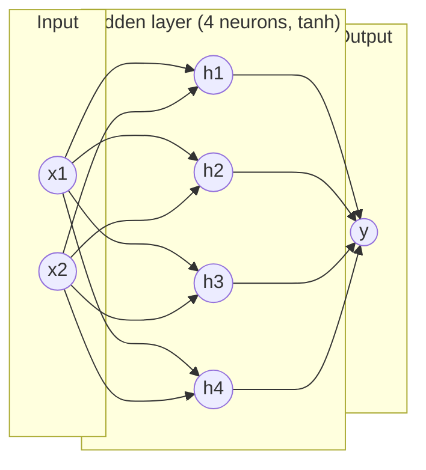

# 09 — Neural Networks & the Forward Pass

> Part 3 · Lesson 09 · Code stack: numpy-from-scratch

**Prerequisites:** [08 — Unsupervised Learning: k-Means & PCA](08-kmeans-pca.md) · and you should be comfortable with [02 — Linear Regression](02-linear-regression.md) and [04 — Logistic Regression & Classification](04-logistic-regression.md), since a neural network is built out of those pieces.

**By the end you can:**
- Explain how a neuron generalizes the linear models you already know, and why **stacking** them into layers buys you new power.
- State the **forward pass** as a repeated `matmul → add bias → activate` and implement it in numpy.
- Explain *mathematically* why **non-linear activations** are non-negotiable — without them a deep net collapses to a single linear map.
- Compare **sigmoid, tanh, and ReLU** and pick one with reasons.
- Build a 2-layer MLP from scratch and visualize the curved decision region it carves out.

---

## 1. Intuition

Everything you built so far — linear regression, logistic regression, the SVM's linear boundary — is one **neuron**. A neuron takes inputs, weights them, sums, adds a bias, and squashes the result through some function:

$$
\text{neuron}(\mathbf{x}) = f\!\left(\mathbf{w}^\top \mathbf{x} + b\right)
$$

Logistic regression *is* a single neuron with a sigmoid $f$. That's the whole secret: a neural network is not an exotic new model, it's **logistic regression repeated and wired together**.

So why stack them? Because one neuron can only draw a single straight cut through input space (lesson 04). Real signals aren't linearly separable. A sonar return that means "obstacle" vs "open water" lives in a tangled, curved region of feature space. One straight line can't fence it off.

The trick: feed the outputs of one layer of neurons into another layer. Each layer is a linear map followed by a *bend* (the activation). Stack a few bends and you can trace any curve you like.

**Analogy — the origami sheet.** Think of input space as a flat sheet of paper with two colors of dots scrambled on it. A linear model can only cut the sheet with one straight scissor stroke. Each non-linear layer is like *folding* the paper. After a couple of folds, dots that were hopelessly mixed line up so that a single straight cut separates them. The network learns *where to fold*; the final layer does the easy straight cut. Take away the folds (the non-linearity) and no amount of stacking helps — you're back to one straight cut.

This is the **perceptron** (Rosenblatt, 1958), the original single neuron, scaled up into the **multilayer perceptron (MLP)** — also called a fully-connected or dense network.



Every arrow is a learnable weight. Every neuron also has a bias (not drawn). Data flows strictly left → right: that one-directional sweep is the **forward pass**.

---

## 2. The Math

### A layer is a matrix multiply plus a bend

Bundle one layer's neurons together. If layer $\ell$ has $n_\ell$ neurons and receives input $\mathbf{a}^{(\ell-1)} \in \mathbb{R}^{n_{\ell-1}}$, then:

$$
\mathbf{z}^{(\ell)} = W^{(\ell)} \mathbf{a}^{(\ell-1)} + \mathbf{b}^{(\ell)}, \qquad
\mathbf{a}^{(\ell)} = f^{(\ell)}\!\left(\mathbf{z}^{(\ell)}\right)
$$

- $W^{(\ell)} \in \mathbb{R}^{n_\ell \times n_{\ell-1}}$ — the **weight matrix**. Row $i$ is one neuron's weight vector $\mathbf{w}_i^\top$, so the matrix-vector product just stacks all neurons' dot products at once.
- $\mathbf{b}^{(\ell)} \in \mathbb{R}^{n_\ell}$ — the **bias** vector, one offset per neuron.
- $\mathbf{z}^{(\ell)}$ — the **pre-activation** (also "logits" at the output). 
- $f^{(\ell)}$ — the **activation function**, applied element-wise.
- $\mathbf{a}^{(\ell)}$ — the **activation** (the layer's output). We set $\mathbf{a}^{(0)} = \mathbf{x}$, the raw input.

*Where it comes from:* one neuron is $f(\mathbf{w}_i^\top \mathbf{a} + b_i)$. Stack $n_\ell$ of them and the dot products $\mathbf{w}_i^\top \mathbf{a}$ become the rows of $W\mathbf{a}$. The matrix form is just bookkeeping — nothing new beyond lesson 02's linear model, applied $n_\ell$ times in parallel.

### The forward pass = compose layers

For an $L$-layer net the prediction is the composition

$$
\hat{\mathbf{y}} = f^{(L)}\!\Big(W^{(L)} f^{(L-1)}\big(\cdots f^{(1)}(W^{(1)}\mathbf{x} + \mathbf{b}^{(1)}) \cdots\big) + \mathbf{b}^{(L)}\Big).
$$

In practice you don't write that monster — you loop: `z = W @ a + b; a = f(z)`, layer by layer. That loop **is** the forward pass.

### Why non-linearity is the whole game

Suppose we drop the activations (use $f = \text{identity}$). Then two layers compose as:

$$
\mathbf{z}^{(2)} = W^{(2)}\big(W^{(1)}\mathbf{x} + \mathbf{b}^{(1)}\big) + \mathbf{b}^{(2)}
= \underbrace{W^{(2)}W^{(1)}}_{\tilde W}\,\mathbf{x} + \underbrace{(W^{(2)}\mathbf{b}^{(1)} + \mathbf{b}^{(2)})}_{\tilde{\mathbf b}}.
$$

The product of two matrices is *one* matrix; the combined bias is *one* vector. So a linear net of any depth is **exactly equivalent to a single linear layer** $\tilde W \mathbf{x} + \tilde{\mathbf b}$. Ten hidden layers, a million parameters — still just a line (or hyperplane). The non-linear $f$ is what breaks this collapse and lets depth add real expressive power. **Remember this: stacking linear maps gains you nothing; the bend between them is everything.**

### Three activations you'll meet constantly

| Name | $f(z)$ | Range | Notes |
|------|--------|-------|-------|
| **Sigmoid** | $\sigma(z)=\dfrac{1}{1+e^{-z}}$ | $(0,1)$ | Squashes to a probability; saturates (flat) for large $\lvert z\rvert$. |
| **Tanh** | $\tanh(z)=\dfrac{e^z-e^{-z}}{e^z+e^{-z}}$ | $(-1,1)$ | Zero-centered sigmoid; usually better in hidden layers. |
| **ReLU** | $\max(0,z)$ | $[0,\infty)$ | Cheap, doesn't saturate for $z>0$; the default for deep nets. |

Sigmoid and tanh are smooth S-curves; you met sigmoid as logistic regression's link function in lesson 04. **ReLU** (Rectified Linear Unit) is brutally simple — pass positives, zero out negatives — yet it's the workhorse of modern deep learning because it keeps gradients alive (you'll feel why in lesson 10). The key property all three share: they are **non-linear**, so they create the folds.

### Universal approximation — the reassuring theorem

The **universal approximation theorem** says: an MLP with a *single* hidden layer and a non-polynomial activation (sigmoid, tanh, ReLU all qualify) can approximate **any** continuous function on a bounded region to arbitrary accuracy — given enough hidden neurons.

*Intuition, not proof:* picture two opposing sigmoid steps. Subtract them and you get a localized "bump." Place enough bumps of the right height side by side and you can trace any curve, like building a smooth shape out of LEGO. Width = number of bumps you can afford.

Two caveats so you don't over-believe it: (1) "enough neurons" can be astronomically many for a shallow net — **depth** is usually far more parameter-efficient than width; (2) the theorem says a fit *exists*, not that gradient descent will *find* it. Existence ≠ trainability. Lessons 10–12 are about actually finding it.

---

## 3. Code

Pure numpy, no autograd. We build a 2-layer MLP ($2 \to 8 \to 1$) and run **only the forward pass** — weights are fixed (random or hand-set), because training is next lesson. Goal: see that a forward pass is just `matmul → bias → activate`, twice, and that it can represent a curved boundary.

```python
import numpy as np
import matplotlib.pyplot as plt

rng = np.random.default_rng(0)  # reproducible randomness

# ---- Activation functions (element-wise) -----------------------------------
def sigmoid(z):
    return 1.0 / (1.0 + np.exp(-z))

def tanh(z):
    return np.tanh(z)

def relu(z):
    return np.maximum(0.0, z)

# ---- One dense layer: z = a @ W.T + b, then activate -----------------------
# NOTE on shapes: we process a BATCH of N samples at once.
#   a has shape (N, n_in)  -> rows are samples.
#   W has shape (n_out, n_in), b has shape (n_out,).
#   a @ W.T -> (N, n_out): each row is that sample's pre-activations.
# Batching = the same math as the per-sample equation in section 2,
# just with N samples stacked as rows (vectorized, no Python loop over data).
def dense(a, W, b, activation):
    z = a @ W.T + b           # (N, n_in) @ (n_in, n_out) + (n_out,) -> (N, n_out)
    return activation(z)

# ---- A 2-layer MLP: input(2) -> hidden(8, tanh) -> output(1, sigmoid) ------
class MLP:
    def __init__(self, n_in, n_hidden, n_out, rng):
        # He-ish init scaled by fan-in so pre-activations aren't huge.
        # (Init strategy matters for TRAINING — covered properly in lesson 12.
        #  For a forward-pass demo we just want sane magnitudes.)
        self.W1 = rng.standard_normal((n_hidden, n_in)) * np.sqrt(2.0 / n_in)
        self.b1 = np.zeros(n_hidden)
        self.W2 = rng.standard_normal((n_out, n_hidden)) * np.sqrt(2.0 / n_hidden)
        self.b2 = np.zeros(n_out)

    def forward(self, X):
        # THE FORWARD PASS: layer by layer, each is matmul -> bias -> activate.
        a1 = dense(X,  self.W1, self.b1, tanh)     # hidden activations  (N, 8)
        a2 = dense(a1, self.W2, self.b2, sigmoid)  # output probability  (N, 1)
        return a2

net = MLP(n_in=2, n_hidden=8, n_out=1, rng=rng)

# Sanity check on a single point:
x = np.array([[0.5, -0.3]])          # one sample, shape (1, 2)
print("forward(x) =", net.forward(x))
# -> forward(x) = [[0.505...]]   (a probability in (0,1); exact value depends on seed)
```

The entire model is two `dense` calls. That's a neural network's forward pass — no magic.

### Random weights already carve curves

The point of an MLP is the *shape* of region it can represent. Let's color the plane by the network's output. Even with **random, untrained** weights the boundary is curved — proof that the non-linearity is doing geometric work.

```python
# Build a fine grid over the input plane.
xs = np.linspace(-3, 3, 300)
ys = np.linspace(-3, 3, 300)
gx, gy = np.meshgrid(xs, ys)
grid = np.column_stack([gx.ravel(), gy.ravel()])   # (90000, 2)

probs = net.forward(grid).reshape(gx.shape)         # (300, 300) probabilities

plt.figure(figsize=(5, 5))
plt.contourf(gx, gy, probs, levels=20, cmap="RdBu")
plt.colorbar(label="network output  σ(...)")
plt.contour(gx, gy, probs, levels=[0.5], colors="k", linewidths=2)  # decision line
plt.title("Forward pass of a random 2->8->1 MLP")
plt.xlabel("x1"); plt.ylabel("x2")
plt.tight_layout()
plt.show()
```

**What you should SEE:** a smooth red↔blue gradient with a *wiggly, curved* black 0.5 contour — not a straight line. Each of the 8 tanh hidden units contributes one soft "fold," and they sum into a bent boundary. Now flip `tanh` → identity in `dense` and rerun: the black contour snaps to a perfectly **straight line**, visually confirming the section-2 collapse. That single experiment is the most important takeaway of the lesson.

### Counting parameters

```python
def count_params(net):
    return sum(a.size for a in [net.W1, net.b1, net.W2, net.b2])

print("params:", count_params(net))
# -> params: 33
# W1: 8*2=16, b1: 8, W2: 1*8=8, b2: 1  ->  16+8+8+1 = 33
```

33 numbers fully define this network. Training (lesson 10) is the search for the *best* 33 numbers; the forward pass just evaluates whatever numbers you currently have.

---

## 4. Real Case — sensor fusion for a USV thruster command

You're driving a **USV** (unmanned surface vehicle). You want a reactive collision-avoidance controller: given the boat's situation, output a steering/thrust correction. The mapping from sensors to the right command is **nonlinear** — a small obstacle dead ahead at speed demands a hard turn, the same obstacle far off the beam demands nothing. A linear controller (one neuron) can't capture that interaction; an MLP can.

**Inputs (the feature vector $\mathbf{x}$):**

| Feature | Meaning | Source |
|---------|---------|--------|
| $x_1$ | range to nearest obstacle (m) | sonar / lidar |
| $x_2$ | bearing to obstacle (rad, signed) | sonar / lidar |
| $x_3$ | current surge speed (m/s) | GPS / IMU |
| $x_4$ | heading error to waypoint (rad) | path-follower |

**Output:** $y \in (-1, 1)$, a normalized rudder command (tanh output: $-1$ = full port, $+1$ = full starboard).

The net is $4 \to 16 \to 16 \to 1$. The forward pass maps four scalars to one command in microseconds — fast enough for a ROS2 control loop at 20 Hz.

```python
# A 3-layer reactive controller: 4 sensors -> 16 -> 16 -> 1 rudder command.
# Weights are RANDOM here (untrained) — we are only demonstrating the forward
# pass / shape of computation. In practice you'd train these on logged
# expert-helmsman data (behavior cloning) or via RL. Training = next lessons.
rng = np.random.default_rng(7)
W1 = rng.standard_normal((16, 4)) * np.sqrt(2/4);  b1 = np.zeros(16)
W2 = rng.standard_normal((16, 16)) * np.sqrt(2/16); b2 = np.zeros(16)
W3 = rng.standard_normal((1, 16)) * np.sqrt(2/16);  b3 = np.zeros(1)

def controller(x):
    a1 = relu(x @ W1.T + b1)    # ReLU hidden layers: cheap, deep-net default
    a2 = relu(a1 @ W2.T + b2)
    out = tanh(a2 @ W3.T + b3)  # tanh output -> bounded rudder in (-1, 1)
    return out

# A scenario: obstacle 8 m ahead, 0.1 rad off bow, 2 m/s, slight heading error.
state = np.array([[8.0, 0.10, 2.0, 0.05]])
print("rudder command:", controller(state))
# -> rudder command: [[ 0.xx ]]   (some value in (-1, 1); meaningless until trained)
```

How the method maps on:
- **Feature vector** = whatever your sensors/state estimator publish on a ROS2 topic. Normalize each channel (range in meters vs bearing in radians live on wildly different scales — see Pitfalls).
- **Hidden layers** learn the nonlinear interactions ("close AND ahead AND fast → turn hard").
- **Bounded output** (tanh) keeps the actuator command in a physically valid range — a built-in safety clamp.
- The forward pass is the **inference** step: trained weights live on the vehicle, and every control tick you run one forward pass to get the command. No optimization happens onboard at runtime.

For grounding against a **classic dataset**: the same $2 \to H \to 1$ architecture from section 3 is exactly what solves the famous **two-moons** / XOR-style toy problems that defeat linear models — the curved boundary you plotted is precisely what's needed to separate two interleaved crescents.

---

## 5. Pitfalls & Tips

- **Forgetting the non-linearity.** If you stack `Linear → Linear` with no activation between, you have wasted a layer — it algebraically collapses to one linear map (section 2). Always check there's a bend between weight layers.
- **Shape bugs are the #1 numpy error.** Decide a convention and hold it: here rows = samples, so $\mathbf{a} \in (N, n_{in})$ and $W \in (n_{out}, n_{in})$, giving `a @ W.T`. Print `.shape` at every layer the first time you wire a net.
- **Unnormalized inputs.** Feeding raw features on different scales (range ~100 m, bearing ~0.1 rad) drives some pre-activations huge and saturates sigmoid/tanh flat — the neuron stops responding. Standardize inputs (zero mean, unit variance) before the first layer.
- **Sigmoid in hidden layers.** It's zero-*not*-centered and saturates easily; prefer **tanh** or, for deep nets, **ReLU**. Reserve sigmoid for a single output that must be a probability.
- **Reading too much into untrained output.** A random-weight forward pass produces *some* number, but it's meaningless. The architecture defines what's *representable*; training (next lesson) decides what's actually *computed*.
- **Confusing width and depth.** Universal approximation lets one wide layer fit anything *in theory*, but in practice depth is far more parameter-efficient and trains better. Don't solve everything by widening one layer.

---

## 6. Check Your Understanding

**Q1.** You build a 5-layer network but accidentally use the identity (no activation) everywhere. How many *effectively distinct* linear regions can its decision boundary have, and why?

<details><summary>Answer</summary>
One — the boundary is a single straight hyperplane. With identity activations the whole net collapses to $\tilde W \mathbf{x} + \tilde{\mathbf b}$ where $\tilde W = W^{(5)}\cdots W^{(1)}$. Depth adds nothing without a non-linear bend between layers.
</details>

**Q2.** For the layer equation $\mathbf{z}^{(\ell)} = W^{(\ell)}\mathbf{a}^{(\ell-1)} + \mathbf{b}^{(\ell)}$, what are the shapes of $W^{(\ell)}$ and $\mathbf{b}^{(\ell)}$ if layer $\ell-1$ has 10 neurons and layer $\ell$ has 4?

<details><summary>Answer</summary>
$W^{(\ell)}$ is $4 \times 10$ (rows = output neurons, columns = input dimension), and $\mathbf{b}^{(\ell)}$ is length 4 (one bias per output neuron). The product $W\mathbf{a}$ maps a 10-vector to a 4-vector.
</details>

**Q3.** Logistic regression and a single sigmoid neuron — same model or different?

<details><summary>Answer</summary>
Same model. Logistic regression *is* one neuron: $\hat y = \sigma(\mathbf{w}^\top\mathbf{x}+b)$. A neural network is just many of these wired together across layers — which is exactly what unlocks non-linear boundaries one neuron can't draw.
</details>

**Q4.** The universal approximation theorem says one hidden layer can fit any continuous function. So why does anyone build deep networks?

<details><summary>Answer</summary>
Two reasons. (1) Efficiency: a shallow net may need *exponentially* more neurons than a deep one to represent the same function, so depth is far more parameter-efficient. (2) The theorem guarantees a good fit *exists*, not that gradient descent will *find* it from data. Existence ≠ trainability.
</details>

**Q5.** In the section-3 demo the weights were random and untrained, yet the plotted boundary was already curved. What does that tell you about the role of architecture vs. training?

<details><summary>Answer</summary>
Architecture (layers + non-linear activations) determines the *class of shapes* the network can represent — here, curved boundaries. Training only selects *which specific* curve fits your data by tuning the weights. A random forward pass shows the capability; it says nothing about correctness.
</details>

---

## Recap & Next

- A neuron is the linear model from lesson 02/04 plus an activation; an **MLP** stacks neurons into layers.
- The **forward pass** is the repeated `matmul → add bias → activate`, composed layer by layer — that's all inference is.
- **Non-linear activations are mandatory**: without them any depth collapses to a single linear map. Sigmoid, tanh, and ReLU are your everyday choices (ReLU for deep hidden layers, sigmoid/tanh for bounded outputs).
- **Universal approximation** says a wide-enough net can fit any continuous function — but depth is more efficient and existence isn't the same as trainability.
- We implemented a 2-layer net in numpy and saw random weights already carve a curved decision region; flipping off the non-linearity flattens it to a line.

We can *evaluate* a network but its weights are still random garbage. Next we make it **learn**: compute the loss, push gradients backward through every layer, and update the weights.

➡️ **Next:** [10 — Backpropagation from Scratch](10-backpropagation.md)
