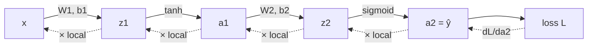

# 10 — Backpropagation from Scratch

> Part 3 · Lesson 10 · Code stack: numpy-from-scratch

**Prerequisites:** [09 — Neural Networks & the Forward Pass](09-neural-networks-mlp.md) — you must be comfortable with the layer equation $\mathbf{z}=W\mathbf{a}+\mathbf{b}$, activations, and the forward pass. You also lean hard on [03 — Gradient Descent](03-gradient-descent.md) (the update $\theta := \theta - \alpha\nabla J$) and the chain rule from [01 — The Math Toolbox](01-math-foundations.md).

**By the end you can:**
- Read a neural network as a **computation graph** and assign a **local gradient** to every node.
- State the chain rule as "multiply local gradients along the path" and use it to send error signals backward.
- **Derive by hand** the backward equations for a 2-layer MLP — $\partial L/\partial W$ and $\partial L/\partial \mathbf{b}$ for both layers, including the activation derivative.
- Implement a **complete** numpy MLP — forward, backward, gradient-descent update, training loop — that learns a nonlinear boundary (two-moons / XOR).
- **Numerically verify** your gradients, the same sanity check that catches 90% of backprop bugs.

---

## 1. Intuition

Lesson 09 gave you a network that can *represent* curved boundaries but whose weights were random garbage. Lesson 03 gave you the engine to fix that: gradient descent, $\theta := \theta - \alpha\nabla J$. The only missing piece is the gradient itself — $\partial L/\partial w$ for **every single weight** in the network, possibly millions of them.

**Backpropagation** is the algorithm that computes all those gradients in one efficient backward sweep. It is not a new optimizer; it's just the chain rule, organized so you reuse work instead of recomputing it. Once you have the gradients, lesson 03's update rule does the rest.

**The analogy — blame flowing backward through a kitchen.** A dish comes out wrong (high loss). The head chef doesn't re-cook everything; he asks "how much did *my* final plating contribute to the error?" then passes a portion of the blame back to the sauce station, which passes its share back to the prep cook, and so on. Each station only needs (a) the blame handed to it from downstream and (b) how sensitive its own output was to its own inputs — its **local gradient**. Multiply those two and you know how much to adjust *this* station; hand the rest upstream. That chain of "blame × local sensitivity," propagated from the output back to the inputs, **is** backpropagation.

The forward pass computes outputs left → right. Backprop computes gradients right → left, reusing every intermediate value the forward pass already stored.



Solid arrows = forward pass. Dashed arrows = the backward pass, each step multiplying by one node's local gradient. **The whole game is: go forward to get values, go backward to get gradients.**

---

## 2. The Math

### 2.1 The chain rule on a graph

A network is a chain of functions. If $L = f(g(h(w)))$, the chain rule says

$$
\frac{\partial L}{\partial w} = \frac{\partial L}{\partial f}\cdot\frac{\partial f}{\partial g}\cdot\frac{\partial g}{\partial h}\cdot\frac{\partial h}{\partial w}.
$$

Read it as: **to get the gradient w.r.t. an early variable, multiply the local derivatives along the path connecting it to the loss.** Each factor $\partial(\text{output})/\partial(\text{input})$ is a node's **local gradient** — it depends only on that node and its inputs, which the forward pass already computed. Backprop just walks this product from left ($\partial L/\partial f$) to right, carrying the running product so no factor is recomputed.

We define the key quantity, the **error signal** at the pre-activation of layer $\ell$:

$$
\boldsymbol{\delta}^{(\ell)} \;=\; \frac{\partial L}{\partial \mathbf{z}^{(\ell)}}.
$$

This $\boldsymbol{\delta}$ is exactly the "blame" handed to layer $\ell$. Everything below is bookkeeping to (a) turn $\boldsymbol{\delta}$ into weight gradients and (b) pass $\boldsymbol{\delta}$ one layer further back.

### 2.2 Our concrete 2-layer net

We use the lesson-09 architecture and shape convention (rows = samples). For a batch of $N$ samples:

$$
\begin{aligned}
\mathbf{z}_1 &= \mathbf{x}\,W_1^\top + \mathbf{b}_1, & \mathbf{a}_1 &= \tanh(\mathbf{z}_1) \\
\mathbf{z}_2 &= \mathbf{a}_1 W_2^\top + \mathbf{b}_2, & \hat{\mathbf{y}} = \mathbf{a}_2 &= \sigma(\mathbf{z}_2)
\end{aligned}
$$

with $W_1\in\mathbb{R}^{H\times 2}$, $W_2\in\mathbb{R}^{1\times H}$, $\mathbf{x}\in\mathbb{R}^{N\times 2}$. The loss is **binary cross-entropy** (the natural classification loss from lesson 04), averaged over the batch:

$$
L = -\frac{1}{N}\sum_{i=1}^{N}\Big[y_i\log \hat y_i + (1-y_i)\log(1-\hat y_i)\Big].
$$

- $L$ — scalar loss. $N$ — batch size. $y_i\in\{0,1\}$ — true label. $\hat y_i\in(0,1)$ — predicted probability.

### 2.3 The output layer — a beautiful cancellation

We need $\boldsymbol{\delta}^{(2)} = \partial L/\partial \mathbf{z}_2$. Naively that's two factors: $\frac{\partial L}{\partial \hat y}\cdot\frac{\partial \hat y}{\partial z_2}$. For one sample,

$$
\frac{\partial L}{\partial \hat y} = \frac{1}{N}\Big(\frac{-y}{\hat y} + \frac{1-y}{1-\hat y}\Big),
\qquad
\frac{\partial \hat y}{\partial z_2} = \sigma'(z_2) = \hat y\,(1-\hat y).
$$

(The second uses the tidy identity $\sigma'(z)=\sigma(z)(1-\sigma(z))$ from lesson 04.) Multiply and the $\hat y(1-\hat y)$ **cancels the denominators**:

$$
\boxed{\;\boldsymbol{\delta}^{(2)} = \frac{\partial L}{\partial \mathbf{z}_2} = \frac{1}{N}\,(\hat{\mathbf{y}} - \mathbf{y})\;}
$$

The error signal at the output is *just the prediction minus the truth*. This clean form is not luck — pairing sigmoid output with cross-entropy loss is engineered precisely so the messy derivatives cancel. (Same thing happens with softmax + cross-entropy; you'll see it again.)

### 2.4 Output-layer weight gradients

$\mathbf{z}_2 = \mathbf{a}_1 W_2^\top + \mathbf{b}_2$, so $\partial z_2/\partial W_2 = \mathbf{a}_1$ and $\partial z_2/\partial \mathbf{b}_2 = 1$. Applying the chain rule and summing the per-sample contributions (the matrix product does the sum automatically):

$$
\frac{\partial L}{\partial W_2} = \boldsymbol{\delta}^{(2)\top}\mathbf{a}_1, \qquad
\frac{\partial L}{\partial \mathbf{b}_2} = \sum_{i=1}^{N}\boldsymbol{\delta}^{(2)}_i.
$$

Shapes: $\boldsymbol{\delta}^{(2)}$ is $(N,1)$, $\mathbf{a}_1$ is $(N,H)$, so $\boldsymbol{\delta}^{(2)\top}\mathbf{a}_1$ is $(1,H)$ — exactly the shape of $W_2$. **Gradient-shape-matches-parameter-shape is your constant sanity check.**

### 2.5 Backprop into the hidden layer — two local gradients

Now push the blame from $\mathbf{z}_2$ back to $\mathbf{z}_1$. Two hops: through $W_2$ (the linear map), then through the $\tanh$ (element-wise).

**Hop 1 — through the weights.** $\mathbf{z}_2 = \mathbf{a}_1 W_2^\top + \mathbf{b}_2$, so $\partial z_2/\partial a_1 = W_2$:

$$
\frac{\partial L}{\partial \mathbf{a}_1} = \boldsymbol{\delta}^{(2)}W_2 \quad\text{(shape } (N,H)).
$$

**Hop 2 — through the activation.** $\mathbf{a}_1 = \tanh(\mathbf{z}_1)$, applied element-wise, so the local gradient is element-wise too. Using $\tanh'(z)=1-\tanh^2(z)=1-a_1^2$ (cheap — expressed in the activation we already stored):

$$
\boxed{\;\boldsymbol{\delta}^{(1)} = \frac{\partial L}{\partial \mathbf{z}_1} = \big(\boldsymbol{\delta}^{(2)}W_2\big)\odot\big(1 - \mathbf{a}_1^{2}\big)\;}
$$

where $\odot$ is the **element-wise (Hadamard) product**. This is the general backward rule for any layer: **error from above, pulled through the weights, then gated by the activation's local slope.** The activation derivative is the gate — and it's exactly why ReLU (slope 1 or 0) keeps gradients alive while saturated sigmoid/tanh (slope $\to 0$) chokes them, a problem you'll fight in lesson 12.

### 2.6 Hidden-layer weight gradients

Identical form to the output layer, now with input $\mathbf{x}$:

$$
\frac{\partial L}{\partial W_1} = \boldsymbol{\delta}^{(1)\top}\mathbf{x}, \qquad
\frac{\partial L}{\partial \mathbf{b}_1} = \sum_{i=1}^{N}\boldsymbol{\delta}^{(1)}_i.
$$

That's the complete backward pass. Notice the **pattern that generalizes to any depth**:

$$
\boldsymbol{\delta}^{(\ell)} = \big(\boldsymbol{\delta}^{(\ell+1)}W_{\ell+1}\big)\odot f'\!\big(\mathbf{z}^{(\ell)}\big),
\qquad
\frac{\partial L}{\partial W_\ell} = \boldsymbol{\delta}^{(\ell)\top}\mathbf{a}^{(\ell-1)}.
$$

Loop that recursion from the last layer to the first and you've backpropagated through a 100-layer net. Two layers or two hundred — same two equations.

### 2.7 Why this is efficient

The naive alternative — perturb each weight, re-run the forward pass, measure the loss change (numerical differentiation) — costs one full forward pass *per weight*: $\mathcal{O}(P^2)$ for $P$ parameters. Backprop computes **all** $P$ gradients in a single backward pass, $\mathcal{O}(P)$, by reusing the running product $\boldsymbol{\delta}$. For a million-parameter net that's the difference between milliseconds and never. This reuse is the entire reason deep learning is computationally feasible.

---

## 3. Code

Pure numpy, no autograd — we *are* the autograd. We build the full training loop on a two-moons dataset (two interleaved crescents that no straight line can separate), watch the loss fall and the boundary tighten, then numerically verify every gradient.

```python
import numpy as np
import matplotlib.pyplot as plt

rng = np.random.default_rng(0)

# ---- Activations AND their derivatives -------------------------------------
# Backprop needs the derivative of every activation. We express each
# derivative in terms of the activation OUTPUT, which the forward pass
# already cached — so backprop costs almost nothing extra.
def tanh(z):
    return np.tanh(z)

def tanh_grad(a):
    # d/dz tanh(z) = 1 - tanh(z)^2 = 1 - a^2   (a is the cached activation)
    return 1.0 - a**2

def sigmoid(z):
    return 1.0 / (1.0 + np.exp(-z))

# ---- Toy nonlinear dataset: two interleaved moons --------------------------
def make_moons(n, noise, rng):
    n_a = n // 2
    n_b = n - n_a
    t_a = np.linspace(0, np.pi, n_a)
    x_a = np.column_stack([np.cos(t_a), np.sin(t_a)])              # upper crescent
    t_b = np.linspace(0, np.pi, n_b)
    x_b = np.column_stack([1 - np.cos(t_b), 1 - np.sin(t_b) - 0.5])  # lower crescent
    X = np.vstack([x_a, x_b]) + rng.normal(0, noise, (n, 2))
    y = np.concatenate([np.zeros(n_a), np.ones(n_b)]).reshape(-1, 1)  # (N, 1)
    return X, y

X, y = make_moons(400, noise=0.15, rng=rng)
X = (X - X.mean(axis=0)) / X.std(axis=0)   # standardize inputs (see Pitfalls)
```

### The full MLP: forward, backward, step

```python
class MLP:
    """A 2 -> H -> 1 MLP. Rows = samples (same convention as lesson 09)."""
    def __init__(self, n_in, n_hidden, n_out, rng):
        # Init scaled by fan-in so pre-activations start at sane magnitudes.
        self.W1 = rng.standard_normal((n_hidden, n_in)) * np.sqrt(2.0 / n_in)
        self.b1 = np.zeros(n_hidden)
        self.W2 = rng.standard_normal((n_out, n_hidden)) * np.sqrt(2.0 / n_hidden)
        self.b2 = np.zeros(n_out)

    def forward(self, X):
        # Cache every intermediate — backprop reuses ALL of them.
        self.X  = X
        self.z1 = X @ self.W1.T + self.b1     # (N, H)
        self.a1 = tanh(self.z1)               # (N, H)  hidden activation
        self.z2 = self.a1 @ self.W2.T + self.b2  # (N, 1)
        self.a2 = sigmoid(self.z2)            # (N, 1)  output probability
        return self.a2

    def backward(self, y):
        # --- This method IS the section-2 derivation, line for line. ---
        N = y.shape[0]
        # Output error signal: delta2 = (yhat - y)/N   (the cancellation, eq 2.3)
        dz2 = (self.a2 - y) / N                # (N, 1)
        self.dW2 = dz2.T @ self.a1            # (1, H)   = delta2^T @ a1   (eq 2.4)
        self.db2 = dz2.sum(axis=0)            # (1,)     = sum_i delta2_i

        # Push blame into the hidden layer: through W2, then gate by tanh' (eq 2.5)
        da1 = dz2 @ self.W2                    # (N, H)   hop 1: through weights
        dz1 = da1 * tanh_grad(self.a1)        # (N, H)   hop 2: gate by activation slope
        self.dW1 = dz1.T @ self.X            # (H, 2)   = delta1^T @ x   (eq 2.6)
        self.db1 = dz1.sum(axis=0)           # (H,)

    def step(self, lr):
        # Lesson-03 update rule, applied to every parameter at once.
        self.W1 -= lr * self.dW1;  self.b1 -= lr * self.db1
        self.W2 -= lr * self.dW2;  self.b2 -= lr * self.db2

def bce_loss(a2, y):
    eps = 1e-12                                # guard against log(0)
    return -np.mean(y * np.log(a2 + eps) + (1 - y) * np.log(1 - a2 + eps))
```

### Train it

```python
net = MLP(n_in=2, n_hidden=16, n_out=1, rng=rng)

losses, snapshots = [], {}
snap_at = {0, 20, 100, 2000 - 1}             # epochs to snapshot the boundary
for epoch in range(2000):
    a2 = net.forward(X)                       # 1) forward: get predictions
    losses.append(bce_loss(a2, y))            #    record loss
    net.backward(y)                           # 2) backward: get all gradients
    net.step(lr=0.5)                          # 3) descend: update all weights
    if epoch in snap_at:                      #    (save weights for the boundary plot)
        snapshots[epoch] = (net.W1.copy(), net.b1.copy(),
                            net.W2.copy(), net.b2.copy())

pred = (net.forward(X) > 0.5).astype(float)
print("final loss:", round(losses[-1], 4))            # -> final loss: 0.0273
print("accuracy  :", round((pred == y).mean(), 4))    # -> accuracy  : 0.995
```

Three lines per epoch — `forward`, `backward`, `step` — and the random net from lesson 09 turns into a 99.5%-accurate classifier. That triple is *exactly* what `loss.backward(); optimizer.step()` does in PyTorch next lesson.

### Plot 1 — the loss curve

```python
plt.figure(figsize=(6, 4))
plt.plot(losses)
plt.xlabel("epoch"); plt.ylabel("BCE loss")
plt.title("Loss falling as backprop tunes the weights")
plt.yscale("log")          # log scale shows the long tail of refinement
plt.tight_layout(); plt.show()
```

**What you should SEE:** a steep drop in the first ~100 epochs (the net quickly finds the rough shape of the boundary) flattening into a long slow tail as it polishes — the classic learning curve. No upward kinks means `lr=0.5` is stable here.

### Plot 2 — the decision boundary tightening over epochs

```python
def predict_grid(W1, b1, W2, b2, grid):
    a1 = tanh(grid @ W1.T + b1)
    return sigmoid(a1 @ W2.T + b2)

xs = np.linspace(X[:,0].min()-0.5, X[:,0].max()+0.5, 250)
ys = np.linspace(X[:,1].min()-0.5, X[:,1].max()+0.5, 250)
gx, gy = np.meshgrid(xs, ys)
grid = np.column_stack([gx.ravel(), gy.ravel()])

fig, axes = plt.subplots(1, 4, figsize=(16, 4))
for ax, ep in zip(axes, sorted(snapshots)):
    probs = predict_grid(*snapshots[ep], grid).reshape(gx.shape)
    ax.contourf(gx, gy, probs, levels=20, cmap="RdBu", alpha=0.8)
    ax.contour(gx, gy, probs, levels=[0.5], colors="k", linewidths=2)  # boundary
    ax.scatter(X[:,0], X[:,1], c=y.ravel(), cmap="RdBu", edgecolors="k", s=12)
    ax.set_title(f"epoch {ep}"); ax.set_xticks([]); ax.set_yticks([])
plt.tight_layout(); plt.show()
```

**What you should SEE:** at epoch 0 the black 0.5 contour is a random wiggle ignoring the data; by epoch 20 it's roughly slicing between the clusters; by epoch 100 it's curving into the gap between the two crescents; by the final epoch it's a clean S-curve hugging the boundary between the moons. **You are literally watching gradient descent sculpt a nonlinear boundary** — the whole lesson in one figure.

### Gradient check — the test that saves you

Before you trust a from-scratch backward pass, verify it against the *definition* of a derivative, $\frac{\partial L}{\partial \theta}\approx\frac{L(\theta+\epsilon)-L(\theta-\epsilon)}{2\epsilon}$ (the centered difference — second-order accurate). If analytic and numerical gradients agree to ~$10^{-7}$, your math is right.

```python
def numerical_grad(net, X, y, name, eps=1e-5):
    """Centered finite-difference gradient for one parameter array."""
    P = getattr(net, name)
    num = np.zeros_like(P)
    it = np.nditer(P, flags=["multi_index"])
    while not it.finished:
        idx = it.multi_index
        orig = P[idx]
        P[idx] = orig + eps; lp = bce_loss(net.forward(X), y)   # L(theta + eps)
        P[idx] = orig - eps; lm = bce_loss(net.forward(X), y)   # L(theta - eps)
        P[idx] = orig                                           # restore
        num[idx] = (lp - lm) / (2 * eps)
        it.iternext()
    return num

check = MLP(2, 5, 1, rng)        # small net so the check is fast
check.forward(X); check.backward(y)
for name in ["W1", "b1", "W2", "b2"]:
    ana = getattr(check, "d" + name)
    num = numerical_grad(check, X, y, name)
    rel = np.linalg.norm(ana - num) / (np.linalg.norm(ana) + np.linalg.norm(num) + 1e-12)
    print(f"{name}: relative error = {rel:.2e}")
# -> W1: relative error = 4.12e-11
# -> b1: relative error = 1.76e-09
# -> W2: relative error = 6.59e-11
# -> b2: relative error = 1.44e-08
```

Relative errors near $10^{-9}$ mean the analytic gradients match the finite-difference estimate to machine-ish precision. **This is the single most valuable habit in this lesson:** any time you hand-derive a backward pass (a custom layer, a new loss), gradient-check it. A relative error above ~$10^{-4}$ means a bug — almost always a transpose, a missing activation derivative, or a forgotten $1/N$.

---

## 4. Real Case — you are now implementing autograd by hand

This lesson's "real application" is the deepest one in the course: **everything you just wrote is what PyTorch automates.** When you write `loss.backward()` next lesson, PyTorch is running the exact algorithm you implemented — it builds the computation graph during the forward pass, stores each node's local gradient, and walks the graph backward multiplying them. That's **reverse-mode automatic differentiation**, and it *is* backpropagation generalized to arbitrary graphs.

Map your code onto PyTorch's vocabulary so the next lesson feels like a relabeling, not a new world:

| Your numpy code | PyTorch equivalent | What it does |
|---|---|---|
| caching `z1, a1, z2, a2` in `forward` | the autograd graph (`grad_fn` on each tensor) | remember intermediates for the backward pass |
| your `backward()` method | `loss.backward()` | compute every `∂L/∂param` by chained local gradients |
| `self.dW1, self.dW2, ...` | `param.grad` | the gradient stored on each parameter |
| `net.step(lr)` | `optimizer.step()` | apply the lesson-03 update |
| (you derived `tanh_grad` by hand) | autograd knows it | local gradient of each op, built in |
| `numerical_grad` check | `torch.autograd.gradcheck` | the same finite-difference sanity test |

**Why bother doing it by hand if PyTorch hides it?** Because the abstraction leaks, and the leaks are exactly the failures you'll debug on real vehicles:

- A **USV waypoint controller** (the $4\to16\to16\to1$ net from lesson 09) trained by behavior cloning suddenly outputs `nan` rudder commands. You now know the suspects: a saturated activation zeroing $\boldsymbol{\delta}$ (vanishing gradient, section 2.5), or `log(0)` in the loss (why we added `eps`), or an exploding gradient blowing the weights up. You can't diagnose what you treat as magic.
- A **lidar segmentation net** for a drone learns nothing — flat loss curve. Backprop intuition tells you to check whether gradients are reaching the early layers at all (print `np.linalg.norm(dW1)`); a dead first layer means the error signal is dying on the way back, the central concern of lesson 12.
- Writing a **custom physics-informed loss** for an ROV dynamics model means deriving and gradient-checking a backward pass by hand — precisely the skill you just practiced.

**Classic-dataset anchor:** the same forward/backward/step loop, scaled to $784\to128\to10$ with a softmax output, trains a digit classifier on **MNIST** to ~97% accuracy. Backprop is architecture-agnostic — two moons or handwritten digits, the algorithm is identical; only the shapes change.

---

## 5. Pitfalls & Tips

- **Always gradient-check a hand-derived backward pass.** It takes ten lines (section 3) and catches the transpose/activation-derivative/missing-$1/N$ bugs that otherwise cost you a day. Relative error $> 10^{-4}$ = bug.
- **Forgetting the activation derivative.** The most common backprop bug is computing $\boldsymbol{\delta}^{(\ell+1)}W$ but *not* multiplying by $f'(\mathbf{z}^{(\ell)})$. The gate is mandatory — without it you're backpropagating through a phantom linear layer and your gradients are wrong.
- **Shape mismatches.** Every parameter gradient must have the *same shape as the parameter*. If `dW1.shape != W1.shape`, you have a transpose error. Check this before you even run — it's faster than debugging a bad loss curve.
- **Saturation kills gradients.** If pre-activations are huge, $\tanh'\approx 0$ and $\boldsymbol{\delta}^{(1)}\approx 0$ — the hidden layer stops learning (vanishing gradient). Standardize inputs and scale your init (we used $\sqrt{2/\text{fan-in}}$) so $\mathbf{z}$ starts near zero where the slope is healthy. Lesson 12 goes deep on this.
- **Stale gradients.** Each epoch you must recompute gradients from the *current* weights. In numpy that's automatic (we overwrite `dW`). In PyTorch you must `optimizer.zero_grad()` first, because gradients *accumulate* — forgetting it is the #1 beginner bug next lesson.
- **The $1/N$ must live in exactly one place.** We put it in $\boldsymbol{\delta}^{(2)}=(\hat y - y)/N$ so it propagates everywhere automatically. If you also divide again later, your effective learning rate is wrong by a factor of $N$ — silent and confusing.
- **Pair sigmoid output with BCE loss (and softmax with cross-entropy).** The clean $\boldsymbol{\delta}^{(2)}=\hat y - y$ depends on that pairing. Mix sigmoid-output with MSE and you reintroduce the $\hat y(1-\hat y)$ factor, which vanishes when the net is confidently wrong — slow, frustrating training.

---

## 6. Check Your Understanding

**Q1.** In one sentence each, what does the forward pass produce, and what does the backward pass produce — and which intermediates does backward reuse?

<details><summary>Answer</summary>

The forward pass produces the network's outputs (and caches every intermediate $\mathbf{z}^{(\ell)}, \mathbf{a}^{(\ell)}$). The backward pass produces the gradient of the loss w.r.t. every parameter, $\partial L/\partial W^{(\ell)}$ and $\partial L/\partial \mathbf{b}^{(\ell)}$. Backward reuses *all* of those cached intermediates — that reuse is what makes it $\mathcal{O}(P)$ instead of $\mathcal{O}(P^2)$.
</details>

**Q2.** Derive the output error signal $\boldsymbol{\delta}^{(2)}=\partial L/\partial z_2$ for sigmoid output + BCE loss, and explain the cancellation.

<details><summary>Answer</summary>

$\frac{\partial L}{\partial \hat y}=\frac{1}{N}\left(\frac{-y}{\hat y}+\frac{1-y}{1-\hat y}\right)=\frac{1}{N}\cdot\frac{\hat y - y}{\hat y(1-\hat y)}$, and $\frac{\partial \hat y}{\partial z_2}=\sigma'(z_2)=\hat y(1-\hat y)$. Their product cancels the $\hat y(1-\hat y)$ in the denominator, leaving $\boldsymbol{\delta}^{(2)}=\frac{1}{N}(\hat y - y)$. The sigmoid+BCE pairing is designed so its derivative exactly cancels, giving the clean "prediction minus truth."
</details>

**Q3.** When you backpropagate from $\mathbf{z}_2$ to $\mathbf{z}_1$, there are two "hops." What are they, and what is the role of the second?

<details><summary>Answer</summary>

Hop 1: pull the error through the weights, $\partial L/\partial \mathbf{a}_1 = \boldsymbol{\delta}^{(2)}W_2$. Hop 2: gate it by the activation's local slope, $\boldsymbol{\delta}^{(1)} = (\boldsymbol{\delta}^{(2)}W_2)\odot f'(\mathbf{z}_1)$ with $f'=1-\mathbf{a}_1^2$ for tanh. The second hop multiplies by the activation derivative; where the activation is saturated ($f'\approx 0$) it shrinks the gradient to nearly zero — the vanishing-gradient mechanism.
</details>

**Q4.** Your gradient check returns relative error $3\times 10^{-2}$ for `dW1` but $1\times 10^{-10}$ for `dW2`. Where is the bug, and name the two likeliest causes.

<details><summary>Answer</summary>

The output-layer gradient is correct; the error is in how you backprop *into* the hidden layer. The two likeliest causes: (1) forgetting (or wrongly computing) the activation derivative $f'(\mathbf{z}_1)$ in $\boldsymbol{\delta}^{(1)}$, or (2) a transpose error in $\boldsymbol{\delta}^{(2)}W_2$ or in $\boldsymbol{\delta}^{(1)\top}\mathbf{x}$. Since `dW2` checks out, the upstream signal $\boldsymbol{\delta}^{(2)}$ is fine, so the bug is strictly in the hidden-layer step.
</details>

**Q5.** Why is backprop $\mathcal{O}(P)$ while naive numerical differentiation is $\mathcal{O}(P^2)$ for $P$ parameters? When is numerical differentiation still useful?

<details><summary>Answer</summary>

Numerical differentiation perturbs one parameter and re-runs a full forward pass to estimate that parameter's gradient — one forward pass per parameter, so $P$ forward passes total ($\mathcal{O}(P^2)$ if each pass touches all $P$ params). Backprop computes *all* $P$ gradients in a single backward pass by carrying the shared running product $\boldsymbol{\delta}$ ($\mathcal{O}(P)$). Numerical differentiation stays useful as the gradient *check*: slow but assumption-free, it verifies the fast analytic backprop is correct.
</details>

---

## Recap & Next

- **Backpropagation is the chain rule on the computation graph:** to get $\partial L/\partial w$, multiply local gradients along the path from the loss back to $w$, reusing the running error signal $\boldsymbol{\delta}^{(\ell)}=\partial L/\partial \mathbf{z}^{(\ell)}$.
- For our 2-layer net the equations are: output $\boldsymbol{\delta}^{(2)}=(\hat y - y)/N$ (sigmoid+BCE cancellation), backprop $\boldsymbol{\delta}^{(1)}=(\boldsymbol{\delta}^{(2)}W_2)\odot(1-\mathbf{a}_1^2)$, and weight grads $\partial L/\partial W_\ell=\boldsymbol{\delta}^{(\ell)\top}\mathbf{a}^{(\ell-1)}$. The pattern recurses to any depth.
- The training loop is just **forward → backward → step**, where step is lesson-03 gradient descent. We watched it carve a clean nonlinear boundary on two-moons and hit 99.5% accuracy.
- **Always gradient-check** a hand-derived backward pass with a centered finite difference; agreement to ~$10^{-7}$–$10^{-9}$ means your math is right.
- Backprop is $\mathcal{O}(P)$ because it reuses intermediates — the reason training deep nets is feasible — and it is *exactly* what `loss.backward()` automates.

You've now built autograd by hand. Next we hand the bookkeeping to a library that does it for arbitrary graphs on a GPU, so you can focus on architecture instead of derivatives.

➡️ **Next:** [11 — PyTorch Fundamentals](11-pytorch-fundamentals.md)
