# 11 — PyTorch Fundamentals

> Part 3 · Lesson 11 · Code stack: pytorch

**Prerequisites:** [10 — Backpropagation from Scratch](10-backpropagation.md) — this lesson is the *same net, same data, same gradients*, just handed to a framework. If the chain rule and the manual update loop from lesson 10 are fresh in your mind, every PyTorch call below will click into a slot you already built by hand.

**By the end you can:**
- Create and manipulate **tensors**, move them to a **GPU** with `.to(device)`, and explain how a tensor differs from a numpy array.
- Explain how **autograd** (`requires_grad` + `loss.backward()`) computes the *exact* gradients you hand-derived last lesson — automatically.
- Define a model as an `nn.Module`, pick a loss (`nn.BCELoss`, `nn.CrossEntropyLoss`), and an optimizer (`torch.optim`).
- Write the **canonical training loop** — `zero_grad → forward → loss → backward → step` — from muscle memory.
- Batch data cleanly with `Dataset` / `DataLoader`, and map every PyTorch call back to the numpy line it replaces.

---

## 1. Intuition

Last lesson you wrote backprop by hand: forward pass, then a careful walk *backwards* through the chain rule to get $\partial \mathcal{L}/\partial W$ for every weight, then `W -= lr * grad`. It worked, and you now *understand* it. But it was ~40 lines of fragile index-juggling, and that was for a **2-layer net**. Try that for a 50-layer transformer and you'll spend a week debugging a transposed matrix.

**PyTorch's one big idea: you only ever write the forward pass. The backward pass is computed for you, exactly.**

How? Every time you do math on a tensor that has `requires_grad=True`, PyTorch quietly records the operation onto a **computation graph** — a DAG of "this tensor came from multiplying those two." When you call `loss.backward()`, it walks that graph in reverse, applying the chain rule at each node, and deposits the gradient into each parameter's `.grad`. It is doing *literally the same arithmetic you did by hand in lesson 10* — just bookkept automatically.

**Analogy — the recording dashcam.** Your scratch backprop was like driving a route, then trying to reconstruct every turn from memory to drive it backwards. Error-prone. Autograd is a dashcam: it records every operation as you go forward, so replaying the route in reverse (to assign blame for the loss) is mechanical and exact. You drive forward; the tape handles the return trip.

```mermaid
graph LR
    subgraph "You write (forward)"
        X[x] --> L1[Linear 2→8]
        L1 --> A[tanh]
        A --> L2[Linear 8→1]
        L2 --> S[sigmoid]
        S --> Loss[BCE loss]
    end
    Loss -. "loss.backward&#40;&#41; replays the tape in reverse" .-> X
```



The rest of PyTorch is convenience built on top: `nn.Module` to bundle weights, `torch.optim` to do the `W -= lr*grad` step (with smarter variants), and `DataLoader` to feed mini-batches. None of it is conceptually new — it's the lesson-10 loop with the tedious, error-prone parts automated and GPU-accelerated.

---

## 2. The Math

There is **no new math** in this lesson — that's the point. PyTorch computes the exact same quantities you derived in lessons 09 and 10. What's worth pinning down is *what autograd is mechanically doing* so it never feels like magic.

### The forward pass (unchanged from lesson 09)

For our 2-layer net, input $\mathbf{x}\in\mathbb{R}^2$:

$$
\mathbf{z}^{(1)} = W^{(1)}\mathbf{x} + \mathbf{b}^{(1)}, \quad
\mathbf{a}^{(1)} = \tanh(\mathbf{z}^{(1)}), \quad
z^{(2)} = W^{(2)}\mathbf{a}^{(1)} + b^{(2)}, \quad
\hat y = \sigma(z^{(2)})
$$

where $W^{(1)}\in\mathbb{R}^{8\times2}$, $W^{(2)}\in\mathbb{R}^{1\times8}$, $\sigma$ is the sigmoid, and $\hat y\in(0,1)$ is the probability of class 1.

### The loss (binary cross-entropy, from lesson 04)

$$
\mathcal{L} = -\frac{1}{N}\sum_{i=1}^{N}\Big[\, y_i \log \hat y_i + (1-y_i)\log(1-\hat y_i)\,\Big]
$$

$y_i\in\{0,1\}$ is the true label, $\hat y_i$ the predicted probability, $N$ the batch size.

### What `backward()` computes

Autograd populates, for **every** parameter $\theta$ (each entry of $W^{(1)}, \mathbf b^{(1)}, W^{(2)}, b^{(2)}$):

$$
\theta.\text{grad} \;=\; \frac{\partial \mathcal{L}}{\partial \theta}
$$

It gets there by the **chain rule applied node-by-node** along the recorded graph. For a single composition $\mathcal{L}(g(h(\theta)))$ it multiplies local derivatives:

$$
\frac{\partial \mathcal{L}}{\partial \theta}
= \frac{\partial \mathcal{L}}{\partial g}\cdot\frac{\partial g}{\partial h}\cdot\frac{\partial h}{\partial \theta}
$$

This is **reverse-mode automatic differentiation**: start from the scalar loss (gradient $= 1$), and propagate $\partial\mathcal L/\partial(\text{node})$ backwards, accumulating products. It is exactly your lesson-10 backward pass — same multiplications, same transposes — but generated from the recorded graph instead of typed out by you. Because it's the analytic chain rule (not a finite-difference approximation), the gradients are **exact to floating-point precision**.

### The update (from lesson 03)

The optimizer applies, for learning rate $\eta$:

$$
\theta \leftarrow \theta - \eta\,\theta.\text{grad}
$$

That's plain SGD — `optimizer.step()`. Fancier optimizers (Adam, etc.) tweak *how* the step is scaled; we save those for lesson 12.

---

## 3. Code

Install once: `pip install torch` (CPU build is fine for this lesson). Everything below runs on CPU; the GPU lines are no-ops if you don't have one.

### 3.1 Tensors — numpy arrays that remember their history and can live on a GPU

```python
import torch

# A tensor is an n-dimensional array, like numpy's ndarray, with two superpowers:
#   1. it can be moved to a GPU
#   2. it can track operations for automatic differentiation
a = torch.tensor([[1.0, 2.0],
                  [3.0, 4.0]])          # 2x2 float tensor
print(a.shape, a.dtype)                 # -> torch.Size([2, 2]) torch.float32

# Most numpy operations have a 1:1 PyTorch twin:
print(a @ a)        # matrix multiply       (numpy: a @ a)
print(a.T)          # transpose             (numpy: a.T)
print(a.mean())     # reduce to a scalar    (numpy: a.mean())

# Bridge to/from numpy when you need to (e.g. for matplotlib or sklearn):
import numpy as np
n = a.numpy()                  # tensor -> ndarray (shares memory on CPU!)
back = torch.from_numpy(n)     # ndarray -> tensor

# --- Device handling: write it ONCE, reuse everywhere ---------------------
# Pick the best available accelerator. 'cuda' = NVIDIA GPU, 'mps' = Apple Silicon.
device = (
    "cuda" if torch.cuda.is_available()
    else "mps" if torch.backends.mps.is_available()
    else "cpu"
)
print("device:", device)        # -> device: cpu   (or cuda / mps)

a = a.to(device)                # move data to the accelerator
# RULE: every tensor in a computation must be on the SAME device, or you get
#       "Expected all tensors to be on the same device" — the #1 beginner error.
```

A tensor on the GPU is the *whole* speedup story for deep learning: thousands of matrix multiplies running in parallel. You don't change your math — you change *where the bytes live* with `.to(device)`.

### 3.2 Autograd — `backward()` recreating your hand-derived gradient

Let's prove autograd matches calculus on something tiny so you trust it on the big net. Take $f(w) = w^2$, whose derivative is $f'(w) = 2w$.

```python
w = torch.tensor(3.0, requires_grad=True)  # "track gradients w.r.t. this"
f = w ** 2                                  # PyTorch records: f came from w**2
f.backward()                                # walk the graph backwards
print(w.grad)                               # -> tensor(6.)   ( = 2*w = 2*3 )
```

`w.grad` holds $\partial f/\partial w$ — and `6.0` is exactly $2w$. No finite differences, no approximation: the analytic chain rule. Now the same idea on a vector loss, mirroring lesson 10's manual `dW`:

```python
W = torch.randn(1, 2, requires_grad=True)   # one linear neuron's weights
x = torch.tensor([[2.0, -1.0]])             # one input row (1x2)
y = torch.tensor([[1.0]])                   # target

y_hat = torch.sigmoid(x @ W.T)              # forward: same as lesson 09
loss  = -(y*torch.log(y_hat) + (1-y)*torch.log(1-y_hat)).mean()  # BCE, lesson 04
loss.backward()                             # autograd fills W.grad

print(W.grad)   # -> the exact dL/dW you'd get from your hand-derived backprop
```

If you went back to lesson 10 and computed `dW` by hand for this same input, you'd get these numbers to the last decimal. That equivalence is the whole reason to trust the framework.

> **Two gotchas, learn them now:** (1) gradients **accumulate** — `.backward()` *adds* to `.grad`, it doesn't overwrite. That's why every training loop starts with `zero_grad()`. (2) Wrap inference/eval in `with torch.no_grad():` so PyTorch skips building the graph (faster, less memory) when you're not going to call `backward()`.

### 3.3 Rebuild lesson 10's net — the *whole thing* in ~15 lines

Here's the same `2 → 8 (tanh) → 1 (sigmoid)` net, the same two-moons data, the same BCE loss and SGD — but now PyTorch owns the weights, the gradients, and the step. Watch how each PyTorch call replaces a block of your numpy code.

```python
import torch
import torch.nn as nn
from sklearn.datasets import make_moons
from sklearn.preprocessing import StandardScaler

torch.manual_seed(0)

# ---- 1. Data: the same two interleaved crescents from lesson 09/10 --------
X_np, y_np = make_moons(n_samples=400, noise=0.20, random_state=0)
X_np = StandardScaler().fit_transform(X_np)         # standardize (lesson 09 pitfall!)

# numpy -> tensors. Note shapes: X is (N,2), y must be (N,1) float for BCE.
device = (
    "cuda" if torch.cuda.is_available()
    else "mps" if torch.backends.mps.is_available()
    else "cpu"
)
X = torch.tensor(X_np, dtype=torch.float32).to(device)
y = torch.tensor(y_np, dtype=torch.float32).unsqueeze(1).to(device)  # (400,) -> (400,1)

# ---- 2. Model: replaces your MLP class + W1/b1/W2/b2 init -----------------
# nn.Sequential chains layers; nn.Linear holds W and b AND initializes them.
model = nn.Sequential(
    nn.Linear(2, 8),    # was: W1 (8x2), b1 (8,)   -- weights live INSIDE this
    nn.Tanh(),          # was: your tanh()
    nn.Linear(8, 1),    # was: W2 (1x8), b2 (1,)
    nn.Sigmoid(),       # was: your sigmoid()  -> output is P(class=1)
)
model.to(device)        # move the weights to the accelerator -- MUST match the data
                        # (skip this and you get the device-mismatch crash from 3.1)

# ---- 3. Loss + optimizer: replace your hand-written BCE and W -= lr*grad --
loss_fn   = nn.BCELoss()                                  # binary cross-entropy
optimizer = torch.optim.SGD(model.parameters(), lr=0.5)   # plain gradient descent

# ---- 4. THE CANONICAL TRAINING LOOP --------------------------------------
for epoch in range(500):
    optimizer.zero_grad()         # (a) clear old grads  -- grads accumulate!
    y_hat = model(X)              # (b) forward pass     -- calls model.forward()
    loss  = loss_fn(y_hat, y)     # (c) compute loss
    loss.backward()               # (d) autograd: fills every param's .grad
    optimizer.step()              # (e) update: param -= lr * param.grad

    if epoch % 100 == 0:
        print(f"epoch {epoch:3d}  loss {loss.item():.4f}")

# -> epoch   0  loss 0.6780
# -> epoch 100  loss 0.3007
# -> epoch 200  loss 0.2851
# -> epoch 300  loss 0.2293
# -> epoch 400  loss 0.1776
# (reproducible: seed + random_state are pinned. Tiny last-digit drift is possible
#  across torch versions / hardware, but the trajectory is fixed.)
```

**The mental mapping — keep this table in your head:**

| Lesson 10 (numpy, by hand) | Lesson 11 (PyTorch) | What it does |
|---|---|---|
| `W1 = rng.standard_normal(...) * scale` | `nn.Linear(2, 8)` | Allocates & initializes weights + bias |
| `a1 = tanh(X @ W1.T + b1)` etc. | `model(X)` | Forward pass |
| hand-coded BCE expression | `nn.BCELoss()(y_hat, y)` | Loss |
| `dW1, db1, ... = backward(...)` | `loss.backward()` | Gradients (chain rule) |
| `W1 -= lr * dW1` (one line per param) | `optimizer.step()` | Update step |
| (you remembered to reset `dW`) | `optimizer.zero_grad()` | Clear accumulated grads |

Five steps `(a)–(e)` are the loop you will write for **every** model in this course, from this MLP to a transformer. Memorize the order: **zero → forward → loss → backward → step.** Get it wrong (e.g. forget `zero_grad`) and training silently misbehaves.

### 3.4 Visualize the learned boundary

```python
import numpy as np
import matplotlib.pyplot as plt

# Grid over input space
xx, yy = np.meshgrid(np.linspace(-2.5, 2.5, 300), np.linspace(-2.5, 2.5, 300))
grid = torch.tensor(np.c_[xx.ravel(), yy.ravel()], dtype=torch.float32).to(device)  # match the model

with torch.no_grad():                       # inference: no graph needed
    # .cpu() before .numpy(): numpy can't read a tensor that lives on GPU/MPS
    probs = model(grid).reshape(xx.shape).cpu().numpy()

plt.contourf(xx, yy, probs, levels=20, cmap="RdBu_r", alpha=0.8)
plt.contour(xx, yy, probs, levels=[0.5], colors="k", linewidths=2)  # the boundary
plt.scatter(X_np[:, 0], X_np[:, 1], c=y_np, cmap="RdBu_r", edgecolors="k", s=18)
plt.title("PyTorch MLP — learned decision boundary"); plt.show()
```

**What you should SEE:** a smooth blue↔red probability field with a **curved** black 0.5 contour that snakes between the two crescents, correctly fencing off each moon. It's the same wiggly boundary you got from scratch in lesson 10 — identical model, far less code.

### 3.5 `Dataset` and `DataLoader` — batching for free

Above we shoved all 400 points through at once (full-batch). Real datasets don't fit in memory, and **mini-batch** training (lesson 03's SGD) converges faster. `DataLoader` handles shuffling and batching so you never hand-slice arrays again.

```python
from torch.utils.data import TensorDataset, DataLoader

dataset = TensorDataset(X, y)                                  # pairs up (x_i, y_i)
loader  = DataLoader(dataset, batch_size=32, shuffle=True)     # 32-row mini-batches

model.to(device)                     # model already on `device` from 3.3 -- keep it
                                     # here so this block is safe to run standalone too
for epoch in range(200):
    for xb, yb in loader:            # loader yields one mini-batch per iteration
        xb, yb = xb.to(device), yb.to(device)   # move batch to same device as model
        optimizer.zero_grad()
        loss = loss_fn(model(xb), yb)
        loss.backward()
        optimizer.step()
# Same five steps -- now run per batch instead of per full dataset.
# The golden rule: model AND batch on the SAME device (see the 3.1 pitfall).
```

The inner four lines are byte-for-byte the canonical loop. `DataLoader` only changed *what `xb` contains* (a 32-row slice instead of all 400). That's the entire conceptual jump to large-scale training.

---

## 4. Real Case

**USV sonar obstacle classifier, GPU-ready.** Recall the running example from lessons 09–10: a USV reads a sonar/lidar return and must decide **obstacle vs. open water** — a binary classification on features like range and bearing. The decision region is curved (a hard return at close range *ahead* is an obstacle; the same range *abeam* may be a passing wake), so a linear model fails and the 2-layer MLP is exactly right.

In production on the boat, the difference from our toy run is only logistics, not concept:

- **Inputs** are real sonar feature vectors (range bins, intensity, bearing), standardized with the *same* `StandardScaler` fitted on training data and saved — never refit at inference.
- **The model is identical** `nn.Sequential` code; you only change `nn.Linear(2, 8)` to match your feature count.
- **Training moves to GPU** by adding `.to(device)` on the model and each batch — the five-step loop is unchanged. A dataset of 100k logged sonar returns that crawls on CPU trains in seconds on a GPU because every `nn.Linear` is a batched matrix multiply, the GPU's native talent.
- **Deployment** runs forward-only inside `torch.no_grad()` in the ROS2 perception node, emitting $\hat y > 0.5 \Rightarrow$ "obstacle" to the planner. No autograd, no optimizer — just the forward pass at, say, 20 Hz.

**Classic-dataset grounding.** The exact same code, with `nn.Linear(2, 8)` → input size 64 and `nn.BCELoss` → `nn.CrossEntropyLoss` (multi-class), trains a digit classifier on the **`digits`** dataset (`sklearn.datasets.load_digits`, 8×8 images flattened to 64 features, 10 classes). Note the loss swap: **for multi-class, use `nn.CrossEntropyLoss` and feed it raw logits — drop the final `nn.Sigmoid`/`nn.Softmax`.** CrossEntropyLoss applies log-softmax internally for numerical stability. That one substitution is the difference between binary and multi-class classification in PyTorch; everything else in the loop is the same.

---

## 5. Pitfalls & Tips

- **Forgetting `optimizer.zero_grad()`.** Gradients *accumulate* by design (handy for some tricks). Skip the reset and each step adds *all previous* gradients — your loss will lurch or diverge. It's the most common silent training bug. Make it the first line of the loop, always.
- **Device mismatch.** Model on GPU, data on CPU → `RuntimeError: Expected all tensors to be on the same device`. Move *both* the model (`model.to(device)`, once) and *every* input batch (`xb.to(device)`, each iteration).
- **Shape/dtype mismatches with the loss.** `nn.BCELoss` wants targets shaped `(N, 1)` as **float**; `nn.CrossEntropyLoss` wants targets shaped `(N,)` as **long (int) class indices**, and *raw logits* (no softmax). Mismatches throw cryptic errors or, worse, train on nonsense silently.
- **Calling `Sigmoid` then `BCELoss` vs. raw logits then `BCEWithLogitsLoss`.** The latter fuses sigmoid + BCE for better numerical stability and is preferred in practice. We used `Sigmoid + BCELoss` here only because it maps 1:1 onto the lesson-10 math you just learned.
- **Leaving autograd on during evaluation.** Forgetting `torch.no_grad()` at inference wastes memory building a graph you'll never backprop through — and can quietly OOM on large eval sets.
- **Comparing loss across batch sizes.** A full-batch loss and a 32-row mini-batch loss aren't directly comparable (different averages, more noise). Track the trend, not single numbers.

---

## 6. Check Your Understanding

**Q1.** What does `requires_grad=True` actually switch on, and which method consumes that information?

<details><summary>Answer</summary>
It tells PyTorch to **record every operation** involving that tensor onto the computation graph (the "dashcam"). `loss.backward()` then walks that recorded graph in reverse, applying the chain rule, and writes $\partial\mathcal{L}/\partial\theta$ into each tracked tensor's `.grad`. No `requires_grad`, no recording, no gradient.
</details>

**Q2.** Write the five steps of the canonical training loop in order, and say what breaks if you delete the first one.

<details><summary>Answer</summary>
`zero_grad → forward → loss → backward → step`. Delete `zero_grad()` and gradients **accumulate** across iterations (`.backward()` adds, not overwrites), so each `step()` uses the sum of all past gradients — training becomes unstable or diverges. It's the #1 silent bug.
</details>

**Q3.** Your scratch net needed explicit `W1, b1, W2, b2` arrays and an `init` that scaled random numbers. Where did all of that go in the PyTorch version?

<details><summary>Answer</summary>
Inside `nn.Linear`. Each `nn.Linear(in, out)` allocates its own weight matrix and bias vector *and* initializes them with a sensible scheme automatically. `model.parameters()` hands the whole collection to the optimizer, so you never touch the individual arrays.
</details>

**Q4.** You move your model to a GPU with `model.to("cuda")` but training crashes on the first batch. Most likely cause?

<details><summary>Answer</summary>
The input data is still on the CPU — `Expected all tensors to be on the same device`. Fix: move each batch too, `xb, yb = xb.to(device), yb.to(device)`. The model's weights and the data it operates on must live on the same device.
</details>

**Q5.** You switch from binary to 10-class classification. Which two lines change, and why drop the final `Sigmoid`?

<details><summary>Answer</summary>
Change the output layer to `nn.Linear(H, 10)` and the loss to `nn.CrossEntropyLoss`. Drop `nn.Sigmoid` (and any `Softmax`) because `CrossEntropyLoss` expects **raw logits** — it applies log-softmax internally for numerical stability. Targets also become `long` class indices of shape `(N,)`, not one-hot floats.
</details>

---

## Recap & Next

- A **tensor** is a numpy array that can track gradients and live on a **GPU** — write the device once and `.to(device)` everything.
- **Autograd** records the forward pass and, on `loss.backward()`, replays it in reverse to compute the *exact* gradients you derived by hand in lesson 10 — no approximation, no manual chain rule.
- `nn.Module`/`nn.Linear` hold and initialize weights; `torch.optim` does the update; you only ever write the **forward pass**.
- The **canonical loop** is five steps in fixed order: **zero_grad → forward → loss → backward → step.** `Dataset`/`DataLoader` feed it mini-batches with shuffling for free.
- We rebuilt lesson 10's exact net on the exact same data in a fraction of the code — proof that the framework automates the tedium without changing the math.

Now we can build nets effortlessly — but "the loop runs" is not "the net learns." Next we tackle *why* deep networks fail to converge and the techniques that fix it: better optimizers (Adam), learning-rate schedules, weight initialization, normalization, and regularization.

➡️ **Next:** [12 — Training Deep Networks That Actually Converge](12-training-deep-nets.md)
