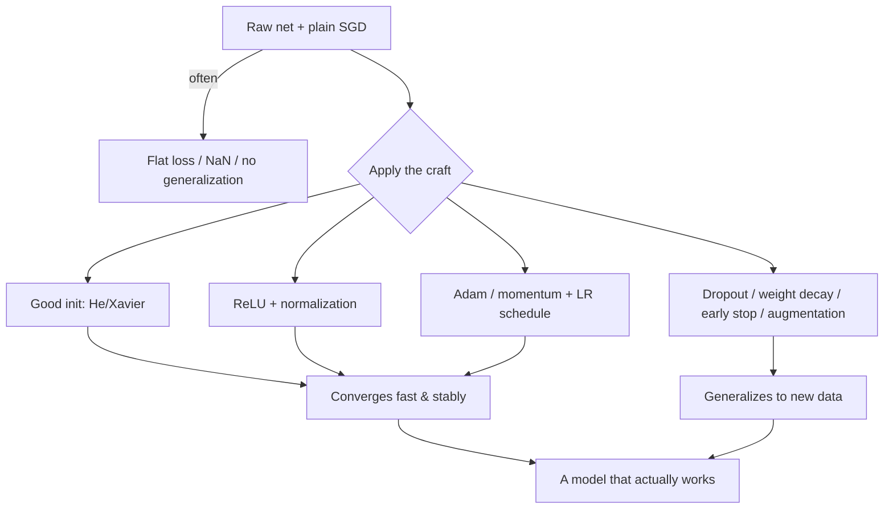

# 12 — Training Deep Networks That Actually Converge

> Part 3 · Lesson 12 · Code stack: pytorch

**Prerequisites:** [11 — PyTorch Fundamentals](11-pytorch-fundamentals.md) · and the gradient mechanics from [10 — Backpropagation from Scratch](10-backpropagation.md), plus the generalization ideas in [05 — Overfitting, Regularization & Evaluation](05-overfitting-evaluation.md).

**By the end you can:**
- Explain *why* plain SGD is fragile and pick between **momentum, RMSProp, and Adam** with reasons, not vibes.
- Diagnose **vanishing/exploding gradients** and fix them with **ReLU + good init (Xavier/He) + normalization**.
- Say exactly what **batch norm** and **layer norm** normalize, and when each is the right call.
- Regularize a net so it **generalizes** instead of memorizing: **dropout, weight decay, early stopping, data augmentation**.
- Run a real PyTorch training loop, read the **loss/val curves**, use an **LR schedule** + **LR-finder**, and reason about **batch size**.

---

## 1. Intuition

Lesson 9 built a net, lesson 10 derived backprop, lesson 11 handed you autograd and `optimizer.step()`. So you *can* train a net. The dirty secret: **most of the time your first training run silently fails.** The loss sits flat, or explodes to `NaN`, or trains beautifully and then performs like a coin flip on new data. None of these throw an error. The model just quietly doesn't work.

This lesson is the **craft** of making training converge to something that *generalizes*. It's the difference between "the gradients are mathematically correct" (lesson 10) and "the thing actually learns the sonar classifier you need."

Think of training as **descending a foggy mountain in the dark** (we're minimizing the loss surface from lesson 3, but now it's high-dimensional and viciously non-convex):

- **The optimizer** is *how you take steps*. Plain SGD steps straight downhill, so it rattles back and forth across narrow valleys and crawls along flat plateaus. **Momentum** gives you a heavy ball that builds speed downhill and rolls through small bumps. **Adam** additionally gives each coordinate its *own* step size, so steep directions get short careful steps and flat directions get long bold ones.
- **Weight initialization** is *where you start*. Start in a bad spot — all weights too big or too small — and the very first gradients are either zero (you can't move) or infinite (you fly off the map). Good init drops you somewhere the slope is informative.
- **Normalization** keeps the *footing stable* as you descend: it stops the ground from tilting wildly under you as earlier layers change.
- **Regularization** stops you from **memorizing the exact path down** instead of learning the *shape* of the mountain — so when you're dropped on a new mountain (test data) you still know which way is down.



The five knobs are not independent rituals — they attack the same failure from different angles. Let's see the math, then turn each knob in PyTorch and *watch* the curves change.

---

## 2. The Math

### 2.1 Optimizers: from plain SGD to Adam

Recall the loss $L(\theta)$ over parameters $\theta$ and the gradient $g_t = \nabla_\theta L(\theta_t)$ at step $t$. Plain **stochastic gradient descent (SGD)** is:

$$
\theta_{t+1} = \theta_t - \eta\, g_t
$$

where $\eta$ is the **learning rate** (step size). Problem: $g_t$ is computed on a *mini-batch*, so it's noisy, and the loss surface has valleys far steeper in some directions than others. A single scalar $\eta$ can't be both small enough to not overshoot the steep direction and large enough to make progress along the flat one.

**Momentum** fixes the zig-zag by accumulating an exponentially-decayed running average (a "velocity") of past gradients:

$$
v_{t} = \beta\, v_{t-1} + g_t, \qquad \theta_{t+1} = \theta_t - \eta\, v_t
$$

- $v_t$ — the **velocity**, a memory of recent gradient directions. Consistent directions add up (speed builds); oscillating ones cancel.
- $\beta \in [0,1)$ — the **momentum coefficient**, typically $0.9$. *Where it comes from:* it's the decay of a geometric series — the effective averaging window is about $\frac{1}{1-\beta}$ steps, so $\beta=0.9$ averages the last ~10 gradients.

**RMSProp** attacks the *per-direction scaling* problem. It keeps a running average of squared gradients and divides each step by its root — so a coordinate with consistently huge gradients gets a *smaller* step, and a tiny-gradient coordinate gets a *bigger* one:

$$
s_t = \rho\, s_{t-1} + (1-\rho)\, g_t^2, \qquad
\theta_{t+1} = \theta_t - \frac{\eta}{\sqrt{s_t}+\epsilon}\, g_t
$$

Here $g_t^2$ is **element-wise**, $s_t$ is the per-parameter second-moment estimate, $\rho \approx 0.9$, and $\epsilon \approx 10^{-8}$ guards against divide-by-zero. The division **adapts the learning rate per parameter** — this is the key idea behind every "adaptive" optimizer.

**Adam** = momentum **and** RMSProp together (the name is *ADAptive Moment estimation*). It tracks both the first moment (mean, like momentum) and second moment (uncentered variance, like RMSProp):

$$
m_t = \beta_1 m_{t-1} + (1-\beta_1) g_t, \qquad
v_t = \beta_2 v_{t-1} + (1-\beta_2) g_t^2
$$

Both averages start at $0$ and are therefore **biased toward zero** early on, so Adam bias-corrects them:

$$
\hat m_t = \frac{m_t}{1-\beta_1^{\,t}}, \qquad
\hat v_t = \frac{v_t}{1-\beta_2^{\,t}}, \qquad
\theta_{t+1} = \theta_t - \eta\,\frac{\hat m_t}{\sqrt{\hat v_t}+\epsilon}
$$

Defaults $\beta_1=0.9$, $\beta_2=0.999$, $\epsilon=10^{-8}$ work shockingly often — which is why Adam is the default "just make it train" optimizer. *The intuition to keep:* **momentum smooths the direction, the $\sqrt{\hat v}$ denominator auto-tunes the step per coordinate.**

> Rule of thumb: **Adam** to get training fast and forgivingly; **SGD + momentum** (with a schedule) often reaches a *slightly better* final test accuracy on big vision nets, at the cost of more tuning. Start with Adam.

### 2.2 Why bad initialization kills training

Consider the variance of activations flowing forward through a layer $z = \sum_{i=1}^{n_{\text{in}}} w_i x_i$. If the weights $w_i$ are i.i.d. with variance $\mathrm{Var}(w)$ and inputs have variance $\mathrm{Var}(x)$, then (independence, zero mean):

$$
\mathrm{Var}(z) = n_{\text{in}}\,\mathrm{Var}(w)\,\mathrm{Var}(x)
$$

- $n_{\text{in}}$ — the **fan-in**, number of inputs to the neuron.

To keep $\mathrm{Var}(z) \approx \mathrm{Var}(x)$ — so the signal neither blows up nor shrinks as it passes through $L$ layers — we need $\mathrm{Var}(w) = \tfrac{1}{n_{\text{in}}}$. That's **Xavier/Glorot init** (for tanh/sigmoid, it averages fan-in and fan-out). ReLU zeros half its inputs, halving the variance, so we double the target: $\mathrm{Var}(w) = \tfrac{2}{n_{\text{in}}}$ — that's **He init**.

$$
\text{Xavier: } \mathrm{Var}(w) = \frac{2}{n_{\text{in}}+n_{\text{out}}}, \qquad
\text{He: } \mathrm{Var}(w) = \frac{2}{n_{\text{in}}}
$$

If instead you initialize too large, $\mathrm{Var}(z)$ multiplies up each layer → activations saturate (sigmoid/tanh flatten) or explode → **exploding gradients**. Too small → signal decays geometrically toward zero → **vanishing gradients**. Either way the early layers get gradients $\approx 0$ and never learn. Init isn't cosmetic; it's the difference between a slope you can descend and a cliff or a flat.

### 2.3 The vanishing/exploding gradient problem

Backprop multiplies gradients layer by layer (chain rule, lesson 10). For an $L$-layer net the gradient w.r.t. an early weight contains a product of $L$ Jacobian-like factors. If each factor has magnitude $\approx r$, the early-layer gradient scales like $r^{L}$:

$$
\left\|\frac{\partial L}{\partial \theta^{(1)}}\right\| \sim \prod_{\ell} \|J^{(\ell)}\| \approx r^{L}
$$

- $r < 1$ → $r^L \to 0$: **vanishing** gradients, early layers freeze. Classic culprit: sigmoid/tanh, whose derivative maxes at $0.25$ (sigmoid) — multiply many of those and you're toast.
- $r > 1$ → $r^L \to \infty$: **exploding** gradients, loss `NaN`s.

Three fixes, working together: **ReLU** (derivative is exactly $1$ for active units → $r\approx1$, no decay), **good init** (sets $r\approx1$ at start), and **normalization** (re-centers each layer's pre-activations every step so $r$ *stays* near $1$ during training). For exploding gradients specifically, **gradient clipping** caps $\|g\|$ at a threshold — essential for RNNs (lesson 14).

### 2.4 Normalization layers

**Batch normalization** standardizes each feature *across the mini-batch*. For feature $j$ over a batch of $m$ samples:

$$
\mu_j = \frac{1}{m}\sum_{i=1}^{m} x_{ij}, \quad
\sigma_j^2 = \frac{1}{m}\sum_{i=1}^{m} (x_{ij}-\mu_j)^2, \quad
\hat x_{ij} = \frac{x_{ij}-\mu_j}{\sqrt{\sigma_j^2+\epsilon}}, \quad
y_{ij} = \gamma_j \hat x_{ij} + \beta_j
$$

- $\mu_j, \sigma_j^2$ — the **batch mean/variance** of feature $j$.
- $\gamma_j, \beta_j$ — **learnable** scale and shift, so the net can undo the normalization if it helps. *Where it comes from:* normalizing to zero-mean/unit-variance keeps each layer's input distribution stable as the layers below it change ("internal covariate shift"), and $\gamma,\beta$ restore representational freedom.

Batch norm uses *batch* statistics at train time and a *running average* at eval time (set `model.eval()`!). It hates small batches (noisy $\mu,\sigma$) and doesn't fit sequence models well.

**Layer normalization** normalizes across the *features of a single sample* instead of across the batch:

$$
\mu_i = \frac{1}{d}\sum_{j=1}^{d} x_{ij}, \quad \sigma_i^2 = \frac{1}{d}\sum_{j=1}^{d}(x_{ij}-\mu_i)^2
$$

(then the same $\hat x$, $\gamma$, $\beta$). Because it's per-sample, it's **independent of batch size** and behaves identically at train and eval — which is why **transformers and RNNs use layer norm** (lessons 14–15). Quick rule: **batch norm for CNNs with big batches, layer norm for sequences / tiny batches.**

### 2.5 Regularization for nets

- **Weight decay**: add $\frac{\lambda}{2}\|\theta\|^2$ to the loss → gradient gains a $\lambda\theta$ term pulling weights toward 0. This is the L2 penalty from lesson 5; smaller weights = smoother function = less overfit. ($\lambda$ ≈ $10^{-4}$ to $10^{-2}$.)
- **Dropout**: during training, zero each activation independently with probability $p$, then scale survivors by $\frac{1}{1-p}$ so the expected value is unchanged. It forces the net not to rely on any single neuron — like training an ensemble of sub-networks that share weights. Off at eval time.
- **Early stopping**: watch validation loss; stop (and keep the best checkpoint) when it starts rising while train loss keeps falling. The gap *is* overfitting.
- **Data augmentation**: synthetically enlarge the training set with label-preserving transforms (flip/rotate/noise an image; jitter/time-shift a sensor trace). More effective "data" = better generalization, and it's the cheapest regularizer you have.

---

## 3. Code

We'll train the same small net two ways on a noisy classification problem and **watch the loss/val curves diverge** — first the naive version, then the "with-the-craft" version. PyTorch.

```python
import torch
import torch.nn as nn
import torch.nn.functional as F
from torch.utils.data import TensorDataset, DataLoader
from sklearn.datasets import make_classification
from sklearn.model_selection import train_test_split
from sklearn.preprocessing import StandardScaler
import matplotlib.pyplot as plt

torch.manual_seed(0)

# --- A deliberately hard, noisy dataset (small N, many features) -------------
# Few samples + many features + label noise = a net WILL overfit if unchecked.
X, y = make_classification(
    n_samples=600, n_features=20, n_informative=8, n_redundant=4,
    flip_y=0.10,        # 10% label noise -> punishes memorization
    class_sep=0.8, random_state=0,
)
X_tr, X_val, y_tr, y_val = train_test_split(X, y, test_size=0.4, random_state=0)

# ALWAYS standardize inputs before a net (lesson 9 pitfall): zero mean/unit var,
# fit on TRAIN ONLY to avoid leaking validation stats into the model.
scaler = StandardScaler().fit(X_tr)
X_tr, X_val = scaler.transform(X_tr), scaler.transform(X_val)

def loader(X, y, train):
    ds = TensorDataset(torch.tensor(X, dtype=torch.float32),
                       torch.tensor(y, dtype=torch.long))
    return DataLoader(ds, batch_size=64, shuffle=train)

tr_loader, val_loader = loader(X_tr, y_tr, True), loader(X_val, y_val, False)
```

### 3.1 The naive net (no craft) vs. the regularized net

```python
class Net(nn.Module):
    """One architecture, a flag to toggle the 'craft'."""
    def __init__(self, in_dim=20, hidden=256, n_classes=2, regularized=False):
        super().__init__()
        self.regularized = regularized
        self.fc1 = nn.Linear(in_dim, hidden)
        self.fc2 = nn.Linear(hidden, hidden)
        self.fc3 = nn.Linear(hidden, n_classes)
        # Normalization + dropout only exist in the regularized variant
        self.bn1 = nn.BatchNorm1d(hidden)
        self.bn2 = nn.BatchNorm1d(hidden)
        self.drop = nn.Dropout(p=0.5)
        if regularized:
            self._he_init()          # He init for ReLU layers (section 2.2)

    def _he_init(self):
        for m in [self.fc1, self.fc2, self.fc3]:
            nn.init.kaiming_normal_(m.weight, nonlinearity="relu")  # He
            nn.init.zeros_(m.bias)

    def forward(self, x):
        if self.regularized:
            # Linear -> BatchNorm -> ReLU -> Dropout (the standard ordering)
            x = self.drop(F.relu(self.bn1(self.fc1(x))))
            x = self.drop(F.relu(self.bn2(self.fc2(x))))
        else:
            # No norm, no dropout, PyTorch default init -> easy to overfit
            x = F.relu(self.fc1(x))
            x = F.relu(self.fc2(x))
        return self.fc3(x)            # raw logits (CrossEntropyLoss adds softmax)


def run(regularized, epochs=120, weight_decay=0.0, lr=1e-3):
    model = Net(regularized=regularized)
    # Adam: momentum + per-parameter LR (section 2.1). weight_decay = L2 penalty.
    opt = torch.optim.Adam(model.parameters(), lr=lr, weight_decay=weight_decay)
    crit = nn.CrossEntropyLoss()
    hist = {"train": [], "val": [], "val_acc": []}

    for ep in range(epochs):
        model.train()                          # dropout ON, BN uses batch stats
        tr_loss = 0.0
        for xb, yb in tr_loader:
            opt.zero_grad()                    # clear last step's gradients
            loss = crit(model(xb), yb)
            loss.backward()                    # backprop (lesson 10, now automatic)
            opt.step()                         # apply the optimizer update rule
            tr_loss += loss.item() * len(xb)
        hist["train"].append(tr_loss / len(tr_loader.dataset))

        model.eval()                           # dropout OFF, BN uses running stats
        v_loss, correct = 0.0, 0
        with torch.no_grad():                  # no autograd graph at eval = faster
            for xb, yb in val_loader:
                out = model(xb)
                v_loss += crit(out, yb).item() * len(xb)
                correct += (out.argmax(1) == yb).sum().item()
        hist["val"].append(v_loss / len(val_loader.dataset))
        hist["val_acc"].append(correct / len(val_loader.dataset))
    return hist

naive = run(regularized=False, weight_decay=0.0)
craft = run(regularized=True,  weight_decay=1e-3)   # He init + BN + dropout + L2

print(f"naive  best val acc: {max(naive['val_acc']):.3f}")
print(f"craft  best val acc: {max(craft['val_acc']):.3f}")
# -> naive  best val acc: 0.858
# -> craft  best val acc: 0.867
# (Everything is seeded, so this is the exact deterministic output. Note the two
# val accuracies are nearly identical -- the gap does NOT show up in val ACCURACY.
# The overfitting lives in the LOSS curves: naive train loss collapses to ~0.0003
# while its val loss bottoms at ~0.34 then climbs to ~1.19; the craft net's train
# loss stays at ~0.16 and its val loss stays flat at ~0.45. That train/val LOSS
# gap -- not the accuracy -- is the point. Plot it next.)
```

### 3.2 Plot the curves — see the overfitting

```python
fig, ax = plt.subplots(1, 2, figsize=(11, 4))
for name, h, c in [("naive", naive, "tab:red"), ("craft", craft, "tab:blue")]:
    ax[0].plot(h["train"], c=c, ls="--", label=f"{name} train")
    ax[0].plot(h["val"],   c=c, ls="-",  label=f"{name} val")
    ax[1].plot(h["val_acc"], c=c, label=f"{name} val acc")
ax[0].set_title("Loss"); ax[0].set_xlabel("epoch"); ax[0].set_ylabel("loss"); ax[0].legend()
ax[1].set_title("Validation accuracy"); ax[1].set_xlabel("epoch"); ax[1].legend()
plt.tight_layout(); plt.show()
```

**What you should SEE:** the *naive* train loss (red dashed) plunges toward zero (~0.0003) while its val loss (red solid) bottoms out then **creeps back up** (~0.34 → ~1.19) — the textbook overfitting U-curve, and the place you'd apply **early stopping** (stop at the val-loss minimum). The *craft* curves (blue) stay closer together: train loss doesn't hit zero (~0.16, dropout + decay prevent memorization) and its val loss stays low and flat (~0.45). Watch the **loss**, not the accuracy — both nets land at ~0.86 *val accuracy*, so accuracy hides the story; the blown-open train/val **loss** gap is where the naive net's overfitting shows. The shrinking *gap* between dashed and solid is generalization improving.

### 3.3 The LR-finder idea

You don't have to guess the learning rate. **LR-finder** (popularized by fast.ai): start with a tiny LR and multiply it up every batch; plot loss vs LR. Loss is flat (LR too small to move), then drops steeply (the good zone), then explodes (LR too big). Pick an LR about one order of magnitude *below* the explosion — roughly the steepest-descent point.

```python
def lr_finder(make_model, lr_min=1e-6, lr_max=1.0, n=120):
    model = make_model()
    opt = torch.optim.Adam(model.parameters(), lr=lr_min)
    crit = nn.CrossEntropyLoss()
    mult = (lr_max / lr_min) ** (1 / n)       # geometric LR ramp per step
    lrs, losses = [], []
    it = iter(tr_loader)
    for i in range(n):
        try:
            xb, yb = next(it)
        except StopIteration:                  # restart loader if exhausted
            it = iter(tr_loader); xb, yb = next(it)
        lr = lr_min * (mult ** i)
        for g in opt.param_groups:
            g["lr"] = lr                       # manually bump the LR each step
        opt.zero_grad()
        loss = crit(model(xb), yb)
        loss.backward(); opt.step()
        lrs.append(lr); losses.append(loss.item())
        if loss.item() > 4 * min(losses):      # diverged -> stop early
            break
    plt.plot(lrs, losses); plt.xscale("log")
    plt.xlabel("learning rate (log)"); plt.ylabel("loss")
    plt.title("LR finder"); plt.show()
    return lrs, losses

lr_finder(lambda: Net(regularized=True))
# What you should SEE: a flat-then-steep-then-blowup curve. Pick the LR ~10x
# below where it blows up (here typically around 1e-3 to 3e-3 -> matches our lr).
```

### 3.4 Learning-rate schedules

A fixed LR is a compromise: big enough to move fast early, but then it overshoots near the minimum. A **schedule** anneals it down. Cosine annealing is a strong default.

```python
model = Net(regularized=True)
opt   = torch.optim.Adam(model.parameters(), lr=3e-3, weight_decay=1e-3)
# Cosine: LR smoothly decays from 3e-3 toward ~0 over T_max epochs.
sched = torch.optim.lr_scheduler.CosineAnnealingLR(opt, T_max=120)

for ep in range(120):
    model.train()
    for xb, yb in tr_loader:
        opt.zero_grad()
        nn.CrossEntropyLoss()(model(xb), yb).backward()
        opt.step()
    sched.step()           # advance the schedule ONCE PER EPOCH (not per batch)
# Effect: fast progress early, fine-tuning late -> usually a lower final loss
# and steadier val curve than a fixed LR.
```

---

## 4. Real Case — a sonar sensor classifier that *generalizes*, not memorizes

You're on a **ROV** (remotely operated underwater vehicle) doing seabed survey. The forward sonar returns an echo; you want to classify each return as **rock** vs **mine-like metal cylinder** — the classic **Sonar (Connectionist Bench)** dataset (Gorman & Sejnowski, 1988): 208 returns, each a **60-dim** vector of energy in frequency bands, binary label `R`/`M`.

This is *exactly* the trap this lesson is about: **60 features, only 208 samples.** A net with thousands of parameters can trivially memorize 208 examples — train accuracy 100%, and then it's useless on the next survey leg because it learned *those specific echoes*, not "what metal sounds like." Generalization is the entire job.

```python
import numpy as np, torch, torch.nn as nn, torch.nn.functional as F
from torch.utils.data import TensorDataset, DataLoader
import pandas as pd
from sklearn.model_selection import train_test_split
from sklearn.preprocessing import StandardScaler

# UCI Sonar dataset (60 features, R/M label). One-liner fetch:
url = "https://archive.ics.uci.edu/ml/machine-learning-databases/undocumented/connectionist-bench/sonar/sonar.all-data"
df = pd.read_csv(url, header=None)
X = df.iloc[:, :60].values.astype("float32")
y = (df.iloc[:, 60] == "M").astype("int64").values            # M(ine)=1, R(ock)=0

Xtr, Xval, ytr, yval = train_test_split(X, y, test_size=0.3, stratify=y, random_state=1)
sc = StandardScaler().fit(Xtr)                                 # fit on train only
Xtr, Xval = sc.transform(Xtr).astype("float32"), sc.transform(Xval).astype("float32")

def dl(X, y, train, bs=16):                                    # tiny dataset -> small batch
    ds = TensorDataset(torch.tensor(X), torch.tensor(y))
    # drop_last=train: with 145 train samples the last batch is a single sample,
    # and BatchNorm1d in train() mode CANNOT normalize a batch of 1 (it raises
    # "Expected more than 1 value per channel"). Drop it on the train loader; keep
    # every sample at eval (BN uses running stats there, so size-1 is fine).
    return DataLoader(ds, batch_size=bs, shuffle=train, drop_last=train)
tr, va = dl(Xtr, ytr, True), dl(Xval, yval, False)

class SonarNet(nn.Module):
    def __init__(self):
        super().__init__()
        self.fc1 = nn.Linear(60, 128); self.fc2 = nn.Linear(128, 64); self.fc3 = nn.Linear(64, 2)
        self.bn1, self.bn2 = nn.BatchNorm1d(128), nn.BatchNorm1d(64)
        self.drop = nn.Dropout(0.4)
        for m in (self.fc1, self.fc2, self.fc3):
            nn.init.kaiming_normal_(m.weight, nonlinearity="relu"); nn.init.zeros_(m.bias)
    def forward(self, x):
        x = self.drop(F.relu(self.bn1(self.fc1(x))))
        x = self.drop(F.relu(self.bn2(self.fc2(x))))
        return self.fc3(x)

def augment(xb):
    """Sensor data augmentation: add small Gaussian noise to mimic real
    echo variability. Label-preserving -> a 'free' regularizer (section 2.5)."""
    return xb + 0.05 * torch.randn_like(xb)

model = SonarNet()
opt = torch.optim.Adam(model.parameters(), lr=2e-3, weight_decay=1e-3)
crit = nn.CrossEntropyLoss()
best_acc, best_state, patience, bad = 0.0, None, 25, 0      # early-stopping state

for ep in range(300):
    model.train()
    for xb, yb in tr:
        opt.zero_grad()
        crit(model(augment(xb)), yb).backward()            # augment ONLY at train time
        opt.step()
    model.eval()
    with torch.no_grad():
        acc = np.mean([ (model(xb).argmax(1) == yb).float().mean().item() for xb, yb in va ])
    if acc > best_acc:                                     # early stopping: keep best
        best_acc, best_state, bad = acc, {k: v.clone() for k, v in model.state_dict().items()}, 0
    else:
        bad += 1
        if bad >= patience:                                # val hasn't improved in 25 epochs
            print(f"early stop at epoch {ep}"); break

model.load_state_dict(best_state)
print(f"best val acc: {best_acc:.3f}")
# -> best val acc: ~0.85-0.90  (vs ~0.75-0.80 for a naive overfit net)
```

How the craft maps onto the ROV problem:

- **Standardize features** — sonar energy bands span very different magnitudes; unscaled inputs saturate the first layer (lesson 9 pitfall) and break BatchNorm's assumptions.
- **He init + BatchNorm** keep gradients alive in a 3-layer net so all layers actually learn from 208 samples.
- **Dropout + weight decay** stop the net memorizing those exact 208 echoes — the difference between 100% train accuracy that fails at sea, and a model that flags real mines.
- **Data augmentation (noise injection)** mimics the run-to-run variability of a real sonar — the model learns the *shape* of a metallic return, not one frozen snapshot. The same trick generalizes to IMU/lidar streams: jitter, time-shift, dropout-channels.
- **Early stopping** picks the checkpoint *before* overfitting starts — critical when you have far too little data to spare a big validation split.
- **Small batch size (16)** is forced by the tiny dataset; note we chose BatchNorm anyway, and with full 16-sample batches it's stable. But watch the *last* batch: 145 train samples ÷ 16 leaves a remainder of 1, and BatchNorm1d in `train()` mode flat-out refuses a batch of size 1 (it can't compute a variance) — hence `drop_last=True` on the train loader above. With batches of 1–4 throughout you'd switch to **LayerNorm**.

---

## 5. Pitfalls & Tips

- **Forgetting `model.train()` / `model.eval()`.** Dropout and BatchNorm behave *differently* in the two modes. Leaving the model in `train()` at evaluation gives random, dropout-corrupted predictions and BN using batch (not running) stats — a silent 5–15% accuracy hit. Toggle them every loop.
- **Not standardizing inputs, or leaking the scaler.** Fit `StandardScaler` (or BatchNorm's running stats) on **train only**. Fitting on the full dataset leaks validation/test information and inflates your score — you'll be disappointed at deployment.
- **`loss` going `NaN`.** Almost always exploding gradients or LR too high. Lower the LR, add gradient clipping (`torch.nn.utils.clip_grad_norm_(model.parameters(), 1.0)`), check your init, and make sure you're not taking `log(0)` in a custom loss.
- **Adam + manual L2 ≠ true weight decay.** Adam's `weight_decay` param is fine for most cases, but the *correct* decoupled version is **AdamW** (`torch.optim.AdamW`) — prefer it when weight decay matters (transformers, lesson 15).
- **Big batch → fewer, smoother steps; small batch → noisier steps that regularize.** Larger batches need a *larger* LR (roughly linear scaling) and sometimes a warmup. Don't crank batch size for speed and keep the old LR — training will stall.
- **Stacking BatchNorm *and* high dropout** can fight each other (BN's batch statistics get noisy under heavy dropout). If using both, keep dropout moderate (≤0.5) and put dropout *after* the activation.
- **Tuning ten knobs at once.** Change one thing, watch the curve, then change the next. If you flip init, optimizer, LR, and dropout together and it works, you've learned nothing about *why*.

---

## 6. Check Your Understanding

**Q1.** Your 8-layer tanh network trains with the loss stuck dead flat from epoch 1, and the first-layer weights barely move. Name the most likely cause and two fixes.

<details><summary>Answer</summary>
<b>Vanishing gradients.</b> tanh's derivative is $\tanh'(x) = 1 - \tanh^2(x)$, which maxes at $1$ (at $x=0$) and shrinks toward $0$ as the unit saturates (~$0.07$ at $x=2$, ~$0.01$ at $x=3$); multiplied across 8 layers the early-layer gradient shrinks toward zero, so the first layers can't learn. Fixes: switch hidden activations to <b>ReLU</b> ($r\approx1$, no decay), use <b>He initialization</b>, and/or add <b>BatchNorm</b> to keep per-layer variance near 1. Any two of those.
</details>

**Q2.** What is the single conceptual difference between RMSProp and Adam?

<details><summary>Answer</summary>
RMSProp adapts the per-parameter learning rate using the running average of squared gradients ($\sqrt{s_t}$ denominator). <b>Adam = RMSProp + momentum</b>: it adds a running average of the gradients themselves ($m_t$, the first moment) plus bias-correction. So Adam smooths the *direction* and auto-scales the *step size* per coordinate; RMSProp only does the latter.
</details>

**Q3.** Batch norm vs layer norm: you're training a transformer with batch size 8 (and sometimes 1 during generation). Which do you pick and why?

<details><summary>Answer</summary>
<b>Layer norm.</b> It normalizes across the features of a *single* sample, so it's independent of batch size and behaves identically at train and inference — essential when batches are tiny or size-1. Batch norm relies on batch statistics, which are noisy/ill-defined at batch size 1, and it must switch to running stats at eval. Sequences/transformers → layer norm.
</details>

**Q4.** Your train accuracy is 99% but validation accuracy is 76% and falling. Which lesson-12 tools directly attack this, and what does the *gap itself* tell you?

<details><summary>Answer</summary>
The gap <b>is</b> overfitting — the net is memorizing training specifics. Directly attack it with <b>dropout</b>, <b>weight decay</b> (L2), <b>data augmentation</b>, and <b>early stopping</b> (stop at the validation-loss minimum). These don't make the net more powerful; they constrain it to learn generalizable structure instead of the training set's quirks. More/cleaner data is the ultimate fix.
</details>

**Q5.** You run the LR finder and the loss-vs-LR curve drops steeply around $10^{-3}$ and explodes around $10^{-1}$. What LR do you choose, and why not just pick the explosion point where loss is lowest?

<details><summary>Answer</summary>
Pick roughly $10^{-2}$ — about an order of magnitude *below* the explosion (near the steepest-descent region), not the minimum-loss point. The lowest plotted loss sits right at the edge of divergence; using that LR makes real training unstable (it'll NaN). You want the largest LR that still descends *reliably*, which is the steep middle of the curve, not its very end.
</details>

---

## Recap & Next

- **Optimizers**: plain SGD zig-zags; **momentum** smooths the direction, **RMSProp** adapts the per-parameter step, **Adam** does both (your default). Pair with an **LR schedule** (cosine) and find the LR with the **LR-finder** instead of guessing.
- **Init matters**: keep activation variance $\approx1$ layer to layer — **Xavier** for tanh/sigmoid, **He** for ReLU — or you get vanishing/exploding gradients before training even starts.
- **Vanishing/exploding gradients** come from multiplying $L$ factors in backprop; **ReLU + good init + normalization** keep that product near 1. Clip gradients to tame explosions.
- **Normalization**: BatchNorm normalizes a feature across the batch (great for CNNs, big batches); LayerNorm normalizes across a sample's features (great for sequences, tiny batches). Remember `train()`/`eval()`.
- **Regularization** — dropout, weight decay, early stopping, augmentation — closes the train/val gap so the model generalizes. We saw the naive net overfit and the crafted net hold its validation accuracy, and we trained a sonar classifier that learns *metal*, not *these 208 echoes*.

Now that we can reliably train a deep net, we'll give it the right *architecture* for spatial data — sharing weights across an image so the net learns local patterns (edges, textures, shapes) instead of memorizing pixels.

➡️ **Next:** [13 — Convolutional Neural Networks](13-cnns.md)
