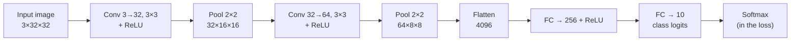
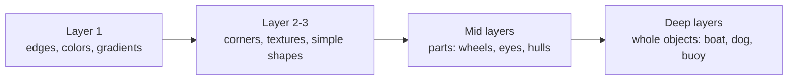

# 13 — Convolutional Neural Networks

> Part 4 · Lesson 13 · Code stack: pytorch

**Prerequisites:** [12 — Training Deep Networks That Actually Converge](12-training-deep-nets.md) · and you should be solid on the [09 — Neural Networks & the Forward Pass](09-neural-networks-mlp.md) and [11 — PyTorch Fundamentals](11-pytorch-fundamentals.md) you built earlier.

**By the end you can:**
- Explain *why* a fully-connected net is the wrong tool for images — parameter blowup and zero translation invariance.
- Define the **convolution** operation, **feature maps**, **stride**, **padding**, and **pooling**, and compute output shapes by hand.
- Track the **shape arithmetic** (channels, height, width) through a `conv → relu → pool` stack into the final classifier.
- Build, train, and evaluate a small CNN on **CIFAR-10** in PyTorch, reporting test accuracy.
- Visualize **learned first-layer filters** and feature maps, and explain the edges → textures → objects hierarchy.

---

## 1. Intuition

An image is not a flat list of numbers. It's a **grid** with structure: a pixel means almost nothing alone, but a pixel together with its *neighbors* forms an edge, a corner, a blob. Two facts dominate everything about vision:

1. **Locality** — what matters is local neighborhoods (a 3×3 patch of pixels), not arbitrary long-range pairs.
2. **Translation invariance** — a buoy in the top-left corner and the same buoy in the bottom-right are the *same thing*. The feature detector that finds it should not care *where* it is.

A fully-connected (dense) net from lesson 09 violates both. To feed a tiny 32×32 RGB image into a dense layer you first **flatten** it into a vector of $32 \times 32 \times 3 = 3072$ numbers. A single hidden layer of 1000 units then needs $3072 \times 1000 \approx 3.1$ million weights — for one layer, on a postage-stamp image. Scale to a real 1080p camera frame and the weight count explodes past anything trainable. Worse: flattening **throws away the grid**. The network has no idea pixel 31 sits directly above pixel 63; it has to *relearn* "this buoy looks the same shifted 5 pixels right" separately for every position. That's absurdly wasteful.

The **convolution** fixes both at once. Instead of one giant weight per (input pixel, output unit) pair, we learn a small **kernel** (also called a **filter**) — say 3×3 — and *slide it across the whole image*, computing a dot product at every position. The same 9 weights are reused everywhere. That's:

- **Parameter sharing** → a 3×3×3 kernel is 27 weights, not millions, and it works at every location.
- **Translation invariance** → because the *same* kernel scans everywhere, a feature detected in the corner is detected identically in the center.
- **Locality** → each output looks only at a small patch, matching how visual structure actually works.

**Analogy — the flashlight sweep.** Imagine a dark map and a small stencil-shaped flashlight. You drag the flashlight across the whole map in a raster scan. Wherever the terrain under the light matches the stencil's shape, it lights up bright; elsewhere it stays dim. The lit-up pattern you trace out is a **feature map**: a new image showing *where* that particular feature occurs. A CNN learns a stack of stencils (kernels), each tuned to a different feature, and re-applies each one everywhere.



The canonical CNN is exactly this: a few **conv → relu → pool** blocks that progressively shrink the spatial grid while growing the channel count (more feature detectors), then a small fully-connected head that maps the final feature vector to class scores.

---

## 2. The Math

### The convolution (cross-correlation) operation

Take a single-channel input $X$ of size $H \times W$ and a kernel $K$ of size $k \times k$. The output feature map $S$ is

$$
S[i,j] = \sum_{m=0}^{k-1} \sum_{n=0}^{k-1} X[i+m,\; j+n] \; K[m,n] \; + \; b
$$

where $S[i,j]$ is the output at row $i$, column $j$; $X[i+m,j+n]$ are the input pixels under the kernel when its top-left corner sits at $(i,j)$; $K[m,n]$ are the learnable kernel weights; and $b$ is a single scalar bias for this filter. **Where it comes from:** it's literally the dense-layer dot product $\mathbf{w}^\top\mathbf{x}+b$ from lesson 09, but restricted to a local patch and with $\mathbf{w}=K$ **reused** at every $(i,j)$. (Math purists: this is *cross-correlation*; true convolution flips the kernel. Deep-learning libraries don't flip, and since $K$ is learned the distinction is cosmetic. We call it convolution anyway.)

### Channels: the third dimension

Real images have **channels** — RGB is 3. A kernel must span *all* input channels. With $C_\text{in}$ input channels a single filter is a $C_\text{in} \times k \times k$ block, and it sums across channels too:

$$
S[i,j] = \sum_{c=0}^{C_\text{in}-1}\sum_{m=0}^{k-1}\sum_{n=0}^{k-1} X[c,\,i+m,\,j+n]\;K[c,m,n] \;+\; b
$$

A conv **layer** stacks $C_\text{out}$ such filters, each producing one output feature map. So the layer's weight tensor has shape $C_\text{out} \times C_\text{in} \times k \times k$, plus $C_\text{out}$ biases. Output channels = number of filters = number of distinct features this layer hunts for.

**Parameter count:** $C_\text{out}\,(C_\text{in}\,k^2 + 1)$. For our first layer ($C_\text{in}=3$, $C_\text{out}=32$, $k=3$): $32(3\cdot 9 + 1) = 896$ weights — independent of image size. Compare that to the dense layer's millions.

### Stride and padding → output size

Two knobs control the output grid:

- **Stride** $s$ — how many pixels the kernel jumps each step. $s=1$ scans every position; $s=2$ skips every other one, halving the output and downsampling.
- **Padding** $p$ — how many zero pixels we add around the border. $p=0$ ("valid") shrinks the output by $k-1$ each pass; choosing $p=\lfloor k/2 \rfloor$ ("same" padding, $=1$ for $k=3$) keeps height/width unchanged at $s=1$.

The output spatial size along one axis is

$$
H_\text{out} = \left\lfloor \frac{H_\text{in} + 2p - k}{s} \right\rfloor + 1
$$

**Where it comes from:** $H_\text{in}+2p$ is the padded length; the kernel's last valid top-left position is $k$ pixels from the end; dividing the span by the step size $s$ and adding 1 (for the starting position) counts how many places the kernel lands. Memorize this — you'll compute it constantly. Quick check: $H_\text{in}=32, k=3, p=1, s=1 \Rightarrow \lfloor(32+2-3)/1\rfloor+1 = 32$. Same padding holds the size.

### Pooling: deliberate downsampling

After conv+ReLU we **pool**: slide a small window (typically 2×2, stride 2) and collapse it to one number.

$$
\text{maxpool}(i,j) = \max_{0\le m,n < 2} A[\,2i+m,\; 2j+n\,] \qquad
\text{avgpool}(i,j) = \frac{1}{4}\sum_{0\le m,n<2} A[\,2i+m,\; 2j+n\,]
$$

**Max pooling** keeps the strongest activation in each window — "did this feature fire *anywhere* nearby?" — giving small-shift robustness and shrinking the grid 4×. It has **no learnable parameters**. Average pooling smooths instead. Max is the default for hidden layers; **global average pooling** (averaging each whole feature map to a single number) is a common modern replacement for the flatten+FC head. Pooling is why deep layers see a *coarse* grid built from *rich* channels.

### The full stack and its shape budget

Each block trades **space for semantics**: pooling halves $H,W$ while the next conv raises $C$. Spatial detail (where) is gradually exchanged for feature richness (what), until a tiny grid of many channels is flattened and handed to the classifier. The final layer outputs $C_\text{out}=$ (number of classes) logits, fed to `CrossEntropyLoss` exactly as in lesson 12.

---

## 3. Code

We'll train a small CNN on **CIFAR-10** (60k 32×32 RGB images, 10 classes: plane, car, bird, cat, deer, dog, frog, horse, ship, truck). Everything uses the PyTorch idioms from lessons 11–12.

```python
import torch
import torch.nn as nn
import torch.nn.functional as F
from torch.utils.data import DataLoader
import torchvision
import torchvision.transforms as T

# --- Device: use the best hardware available (lesson 11) ---
device = (
    "cuda" if torch.cuda.is_available()
    else "mps" if torch.backends.mps.is_available()  # Apple Silicon
    else "cpu"
)
print("device:", device)  # -> device: cuda  (or mps / cpu)

# --- Data ---
# Normalize each RGB channel to ~zero mean/unit std (the usual CIFAR-10 stats).
# Training set gets light augmentation; the test set must NOT be augmented.
MEAN, STD = (0.4914, 0.4822, 0.4465), (0.2470, 0.2435, 0.2616)
train_tf = T.Compose([
    T.RandomCrop(32, padding=4),     # shift-augmentation: teaches translation robustness
    T.RandomHorizontalFlip(),        # a flipped ship is still a ship
    T.ToTensor(),                    # HWC uint8 [0,255] -> CHW float [0,1]
    T.Normalize(MEAN, STD),
])
test_tf = T.Compose([T.ToTensor(), T.Normalize(MEAN, STD)])

train_ds = torchvision.datasets.CIFAR10("./data", train=True,  download=True, transform=train_tf)
test_ds  = torchvision.datasets.CIFAR10("./data", train=False, download=True, transform=test_tf)
train_dl = DataLoader(train_ds, batch_size=128, shuffle=True,  num_workers=2)
test_dl  = DataLoader(test_ds,  batch_size=256, shuffle=False, num_workers=2)
```

Now the network. Read the shape comments — they *are* the lesson:

```python
class SmallCNN(nn.Module):
    def __init__(self, num_classes=10):
        super().__init__()
        # conv(in_channels, out_channels, kernel_size, padding)
        # padding=1 with k=3 is "same" padding: H,W unchanged by the conv itself.
        self.conv1 = nn.Conv2d(3,  32, kernel_size=3, padding=1)   # 3 ->32 feature maps
        self.bn1   = nn.BatchNorm2d(32)                            # stabilizes training (lesson 12)
        self.conv2 = nn.Conv2d(32, 64, kernel_size=3, padding=1)   # 32->64
        self.bn2   = nn.BatchNorm2d(64)
        self.pool  = nn.MaxPool2d(2, 2)                            # halves H and W

        # After two pools, 32x32 -> 16x16 -> 8x8, with 64 channels: 64*8*8 = 4096 features.
        self.fc1   = nn.Linear(64 * 8 * 8, 256)
        self.drop  = nn.Dropout(0.5)                               # regularization (lesson 05/12)
        self.fc2   = nn.Linear(256, num_classes)

    def forward(self, x):
        # x:                                          (B, 3, 32, 32)
        x = self.pool(F.relu(self.bn1(self.conv1(x))))  # conv->relu->pool -> (B, 32, 16, 16)
        x = self.pool(F.relu(self.bn2(self.conv2(x))))  # conv->relu->pool -> (B, 64,  8,  8)
        x = torch.flatten(x, start_dim=1)               # keep batch dim   -> (B, 4096)
        x = self.drop(F.relu(self.fc1(x)))              #                  -> (B, 256)
        return self.fc2(x)                              # raw logits       -> (B, 10)

model = SmallCNN().to(device)
n_params = sum(p.numel() for p in model.parameters())
print(f"trainable parameters: {n_params:,}")
# -> trainable parameters: 1,070,986
# Note: the FC head (4096*256 ~ 1.05M) dominates; the two conv layers are ~19k combined.
```

Training and evaluation loops — identical pattern to lesson 12:

```python
loss_fn = nn.CrossEntropyLoss()                 # softmax + NLL fused; takes raw logits
opt = torch.optim.Adam(model.parameters(), lr=1e-3, weight_decay=1e-4)

def run_epoch(dl, train: bool):
    model.train() if train else model.eval()
    total_loss, correct, n = 0.0, 0, 0
    with torch.set_grad_enabled(train):         # no graph in eval -> faster, less memory
        for xb, yb in dl:
            xb, yb = xb.to(device), yb.to(device)
            logits = model(xb)
            loss = loss_fn(logits, yb)
            if train:
                opt.zero_grad()
                loss.backward()                 # autograd fills .grad for every weight
                opt.step()
            total_loss += loss.item() * xb.size(0)
            correct += (logits.argmax(1) == yb).sum().item()
            n += xb.size(0)
    return total_loss / n, correct / n

EPOCHS = 12
for epoch in range(1, EPOCHS + 1):
    tr_loss, tr_acc = run_epoch(train_dl, train=True)
    te_loss, te_acc = run_epoch(test_dl,  train=False)
    print(f"epoch {epoch:2d} | train loss {tr_loss:.3f} acc {tr_acc:.3f} "
          f"| test loss {te_loss:.3f} acc {te_acc:.3f}")

# Typical trajectory (numbers vary a little run-to-run):
# epoch  1 | train loss 1.452 acc 0.475 | test loss 1.180 acc 0.580
# epoch  6 | train loss 0.742 acc 0.740 | test loss 0.720 acc 0.752
# epoch 12 | train loss 0.520 acc 0.818 | test loss 0.640 acc 0.785
# -> final test accuracy ~0.78-0.80
```

About 79% on CIFAR-10 from ~1M params in a dozen epochs — a dense net of comparable size struggles to break 50%. **The convolution prior is doing the heavy lifting.**

### Visualizing the learned first-layer filters

The 32 filters of `conv1` are each 3×3×3 — small RGB tiles. Plot them to *see* what the network learned to detect:

```python
import matplotlib.pyplot as plt

# weight tensor: (out_channels=32, in_channels=3, 3, 3)
w = model.conv1.weight.detach().cpu()
# Min-max normalize each filter to [0,1] so it's displayable as an RGB image.
w_min = w.amin(dim=(1, 2, 3), keepdim=True)
w_max = w.amax(dim=(1, 2, 3), keepdim=True)
w_img = (w - w_min) / (w_max - w_min + 1e-8)

fig, axes = plt.subplots(4, 8, figsize=(8, 4))
for i, ax in enumerate(axes.flat):
    ax.imshow(w_img[i].permute(1, 2, 0))   # CHW -> HWC for imshow
    ax.axis("off")
fig.suptitle("Learned conv1 filters (3×3 RGB)")
plt.tight_layout(); plt.show()
```

**What you should see:** small color-and-edge templates — oriented light/dark gradients (edge detectors at various angles) and a few color-opponent blobs (e.g. blue-vs-orange). These emerged *purely from the CIFAR labels*; nobody told the net to look for edges. This is the universal first-layer signature: **early layers learn edges and colors**.

### Visualizing a feature map

To see *where* a filter fires, push one image through `conv1` and plot the activations:

```python
img, label = test_ds[0]                       # one normalized (3,32,32) tensor
with torch.no_grad():
    fmap = F.relu(model.conv1(img.unsqueeze(0).to(device)))  # (1, 32, 32, 32)
fmap = fmap.squeeze(0).cpu()

fig, axes = plt.subplots(2, 4, figsize=(8, 4))
for i, ax in enumerate(axes.flat):            # first 8 of 32 feature maps
    ax.imshow(fmap[i], cmap="viridis")
    ax.set_title(f"filter {i}", fontsize=8); ax.axis("off")
plt.tight_layout(); plt.show()
```

**What you should see:** ghostly versions of the input where each map highlights a different structure — one lights up on horizontal edges, another on a color region, another on the object's silhouette. Bright = "my feature is here." This is the **feature map** made literal.

### The feature hierarchy

You can only directly *see* layer-1 filters as RGB tiles; deeper kernels operate on abstract channels, not pixels. But probing studies (e.g. visualizing what maximally excites each unit) consistently reveal:



Each layer composes the features below it into something more abstract. That **compositional hierarchy** — not raw layer count — is the real reason depth helps in vision.

---

## 4. Real Case

**USV / UAV camera obstacle classification.** Your unmanned surface vehicle has a forward-facing camera. Before any path-planner can avoid a hazard, perception has to answer: *what is in this image patch?* — open water, buoy, another vessel, debris, shoreline, or a person in the water. That's an image-classification problem, and a small CNN like the one above is the natural first model.

**Concrete worked example.** Suppose your detection front-end already proposes candidate regions (from motion, a saliency map, or a sliding window) and crops each to a fixed 64×64 RGB patch. You retrain the head of our CNN for **6 classes** {water, buoy, vessel, debris, shore, person}. The only network change is the input/output bookkeeping:

```python
# 64x64 input -> after two 2x2 pools -> 16x16 spatial, 64 channels.
# Reuse SmallCNN but fix the FC input size and number of classes:
class HazardCNN(SmallCNN):
    def __init__(self):
        super().__init__(num_classes=6)
        self.fc1 = nn.Linear(64 * 16 * 16, 256)   # 64x64 -> 16x16 after two pools
```

The mapping onto our concepts:

- **Translation invariance is exactly the property you want.** A buoy at the left edge of the frame and the same buoy dead-center must classify identically — convolution gives that for free, where a dense net would need to relearn each position.
- **Channels = sensor fusion hook.** Our CIFAR model used 3 input channels (RGB). On a real USV you might stack RGB + a depth/disparity channel from a stereo rig, or thermal at night → set `Conv2d(in_channels=4, ...)`. The kernel learns to weight modalities jointly. (UAVs do the same with multispectral; ROVs swap the camera for **forward-looking sonar**, whose returns are 2-D images a CNN eats happily — see lesson 09's sonar example.)
- **Class imbalance is the operational reality.** 95% of patches are "water." Use a weighted `CrossEntropyLoss(weight=...)` so the rare "person" class isn't drowned out — a false negative there is the costliest possible error.
- **Latency matters on an embedded compute box.** ~1M params runs in real time on a Jetson; that's *why* we keep the net small rather than reaching for a 25M-param ResNet.

**Extensions (next steps, not this lesson):** classification answers *what*; the deployed perception stack also needs *where*. **Object detection** (YOLO, Faster R-CNN, SSD) outputs bounding boxes + classes, and **semantic segmentation** (U-Net, DeepLab) labels every pixel — invaluable for a USV to trace the exact water/shore boundary it must not cross. All three are built from the same conv → relu → pool backbone you just trained; detection and segmentation simply bolt different *heads* onto it. You now own the foundation.

---

## 5. Pitfalls & Tips

- **Wrong tensor layout.** PyTorch convs expect `(N, C, H, W)` — batch, channels, height, width. OpenCV/PIL give you `(H, W, C)`. `T.ToTensor()` does the swap *and* scales to `[0,1]`; if you build tensors by hand, `permute(2, 0, 1)` and don't forget the batch dim with `unsqueeze(0)`.
- **Off-by-one shape errors crash the first FC layer.** If you change image size, padding, or pool count, the flattened length changes and `nn.Linear` throws a shape mismatch. Recompute $H_\text{out}=\lfloor(H_\text{in}+2p-k)/s\rfloor+1$ per layer — or sidestep it entirely with `nn.AdaptiveAvgPool2d(1)` (global average pooling), which forces a fixed-size output regardless of input.
- **Normalize, and use *training-set* stats only.** Feeding raw `[0,255]` pixels or normalizing the test set with test-set statistics both hurt. Compute mean/std on train and reuse them everywhere.
- **Augment the train set, never the test set.** Random crops/flips are regularization (lesson 05) that fakes more data and teaches invariances. Applying them at test time just adds noise to your evaluation.
- **`model.eval()` vs `model.train()` is not optional.** BatchNorm and Dropout behave differently in the two modes. Forgetting `eval()` at inference uses batch statistics and active dropout, silently tanking accuracy — a classic "works in training, broken in deployment" bug.
- **Don't reach for a giant pretrained net first.** A small from-scratch CNN is the right baseline to *understand* the problem and your data. Transfer learning (lesson 17) is the upgrade once you've earned the right to need it.

---

## 6. Check Your Understanding

**Q1.** A 200×200 RGB image into a dense layer of 500 units needs how many weights? The first conv layer of our net (3→32, 3×3) needs how many? What does the gap tell you?

<details><summary>Answer</summary>
Dense: $200\cdot 200\cdot 3 \cdot 500 = 60{,}000{,}000$ weights (plus 500 biases). Conv: $32\,(3\cdot 3\cdot 3 + 1) = 896$ weights — and crucially **independent of image size**. The gap (60M vs ~900) is the parameter blowup that makes dense nets infeasible for images, and parameter *sharing* is what kills it.
</details>

**Q2.** Input is 28×28, kernel 5×5, stride 1, padding 0. What's the output spatial size? Now set padding 2 — what changes and why?

<details><summary>Answer</summary>
$p=0$: $\lfloor(28+0-5)/1\rfloor+1 = 24$, so 24×24 — the valid conv shrinks each side by $k-1=4$. $p=2$: $\lfloor(28+4-5)/1\rfloor+1 = 28$, back to 28×28. Padding $p=\lfloor k/2\rfloor = 2$ is "same" padding: it preserves spatial size so you can stack many conv layers without the grid vanishing.
</details>

**Q3.** Why does max pooling have zero learnable parameters, yet still help the network?

<details><summary>Answer</summary>
It's a fixed reduction (take the max of each window) — no weights to learn. It helps three ways: (1) downsamples the grid, cutting compute and memory in later layers; (2) gives **local translation invariance** — a feature shifted within the pool window yields the same output; (3) widens the **receptive field**, so deeper neurons "see" a larger slice of the original image.
</details>

**Q4.** After our two pooling layers, a 32×32 input becomes 8×8 spatially but 64 channels deep. State the principle, and why this trade is desirable.

<details><summary>Answer</summary>
The principle is **trading space for semantics**: each block shrinks $H,W$ (pooling) while growing $C$ (more filters). Early layers need high spatial resolution to localize edges; deep layers need many channels to represent abstract concepts (object parts), and those concepts don't need a fine grid. So coarse-grid-but-feature-rich is exactly right for feeding a classifier.
</details>

**Q5.** A teammate trains a buoy classifier, gets 92% in training, but it misclassifies buoys that appear in the top corner of test frames where training buoys were always centered. What broke, and what's the convolution-flavored fix?

<details><summary>Answer</summary>
Translation invariance was undermined by the data, not the architecture. Convolution makes the *features* position-agnostic, but if every training buoy is centered, the FC head can still learn a center bias. Fix with **random-crop / translation augmentation** (as in our `RandomCrop(padding=4)`) so buoys appear everywhere during training. Architecturally, replacing flatten+FC with **global average pooling** further reduces positional dependence in the head.
</details>

---

## Recap & Next

- Dense nets are wrong for images: **parameter blowup** (millions of weights, size-dependent) and **no translation invariance** (flattening destroys the grid).
- **Convolution** slides a small learned **kernel** over the input, reusing the *same* weights everywhere — buying parameter sharing, locality, and translation invariance at once. Each filter produces one **feature map**.
- Know the shape arithmetic cold: $H_\text{out}=\lfloor(H_\text{in}+2p-k)/s\rfloor+1$, a conv layer's weights are $C_\text{out}\times C_\text{in}\times k\times k$, and **pooling** halves the grid with zero parameters.
- The canonical CNN stacks **conv → relu → pool** blocks (space shrinks, channels grow) into an FC head; we trained one to ~79% on CIFAR-10 and saw layer-1 learn edges and color blobs on its own — the edges → textures → parts → objects hierarchy.
- For a USV/UAV camera, this *is* obstacle classification; channels are your sensor-fusion hook, and detection/segmentation are the same backbone with different heads.

CNNs assume the **grid** structure of images. But sonar pings over time, IMU streams, GPS tracks, and language are **sequences** — order matters and length varies. Next we build models that carry state through time.

➡️ **Next:** [14 — Sequence Models: RNNs & LSTMs](14-rnns-lstms.md)
