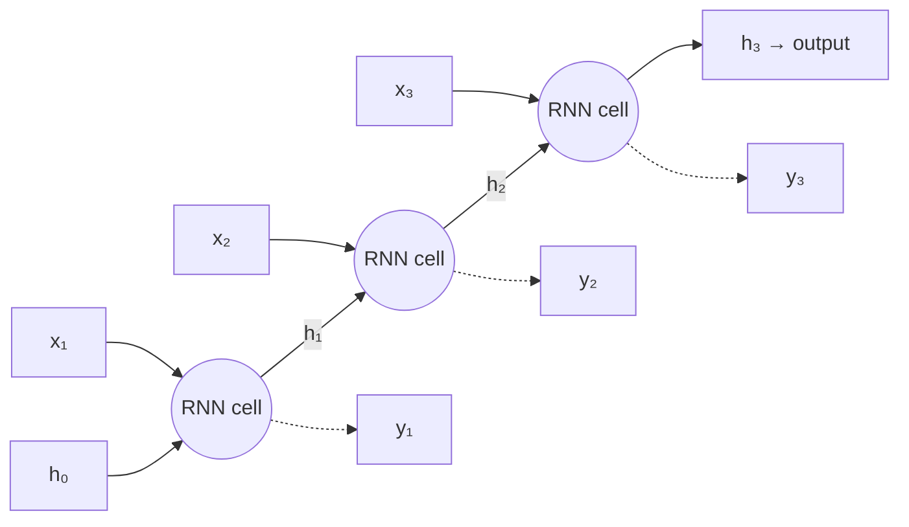
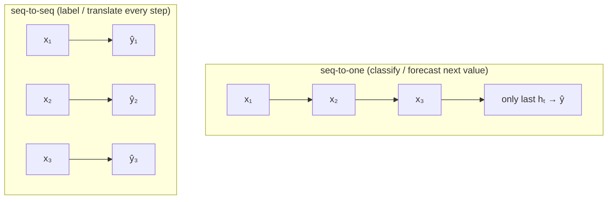

# 14 — Sequence Models: RNNs & LSTMs

> Part 4 · Lesson 14 · Code stack: pytorch

**Prerequisites:** [13 — Convolutional Neural Networks](13-cnns.md) · and you'll lean on [11 — PyTorch Fundamentals](11-pytorch-fundamentals.md), [10 — Backpropagation from Scratch](10-backpropagation.md), and the forward-pass mechanics from [09 — Neural Networks & the Forward Pass](09-neural-networks-mlp.md).

**By the end you can:**
- Explain the **recurrent idea** — a single set of weights re-applied at every time step, carrying a **hidden state** as memory.
- **Unroll** an RNN through time and explain why **backprop-through-time (BPTT)** makes long sequences suffer the **vanishing/exploding gradient** problem.
- Read the **LSTM** and **GRU** gate equations and say, in words, what each gate decides.
- Distinguish **sequence-to-one** (classify/forecast) from **sequence-to-sequence** framing.
- Build and train a small **LSTM forecaster** in PyTorch on a noisy sensor signal and plot prediction vs. truth.

---

## 1. Intuition

A CNN (lesson 13) slides a filter over an image and treats every position the same way. That works because spatial structure is fixed. But your robots produce **sequences**: an IMU streams `(ax, ay, az, gx, gy, gz)` at 200 Hz, a GPS track is a list of positions over time, a sonar ping is a 1-D signal in time. The defining feature of a sequence is **order matters and the past informs the present**. A velocity reading only makes sense relative to the readings before it.

A plain MLP has no notion of "before." If you flatten a 1000-step window into one giant input vector, you (a) fix the length forever and (b) force the network to relearn the same pattern at every offset. We want a model that processes one step at a time and **remembers** what it has seen.

That memory is the **hidden state** $h_t$ — a vector the network carries forward and updates at each step. A **recurrent neural network (RNN)** is just one small network applied *over and over*, feeding its own output back into itself:

> "Look at the current input, combine it with what you remember, produce a new memory, repeat."

**Analogy — reading a sentence.** You don't read a sentence by memorizing all words at once. You read left to right, holding a running understanding (the hidden state) and updating it with each word. By the end, that running state summarizes the whole sentence. An RNN reads a time series the same way: one sample at a time, updating a memory vector.

The same weights are reused at every step — that's **weight sharing across time**, exactly analogous to a CNN sharing one filter across space. It's what lets an RNN handle sequences of *any* length with a *fixed* number of parameters.



That horizontal arrow carrying $h$ to the right *is* the memory. The figure shows the network **unrolled**: it looks like a deep network, but every cell is the *same* cell with the *same* weights.

---

## 2. The Math

### The vanilla RNN cell

At each time step $t$ the cell takes the current input $\mathbf{x}_t \in \mathbb{R}^{d}$ and the previous hidden state $\mathbf{h}_{t-1} \in \mathbb{R}^{H}$ and produces a new hidden state:

$$
\mathbf{h}_t = \tanh\!\big(W_{xh}\,\mathbf{x}_t + W_{hh}\,\mathbf{h}_{t-1} + \mathbf{b}_h\big)
$$

- $\mathbf{x}_t$ — input at step $t$ (e.g. one IMU sample), dimension $d$.
- $\mathbf{h}_t$ — hidden state / memory at step $t$, dimension $H$ (you choose $H$).
- $W_{xh} \in \mathbb{R}^{H\times d}$ — weights mapping input into hidden space.
- $W_{hh} \in \mathbb{R}^{H\times H}$ — the **recurrent** weights, mapping old memory to new.
- $\mathbf{b}_h \in \mathbb{R}^{H}$ — bias. $\tanh$ squashes to $(-1,1)$ so the state can't blow up in one step.

**Where it comes from:** it's just a single dense layer (lesson 09) whose input is the *concatenation* $[\mathbf{x}_t;\,\mathbf{h}_{t-1}]$. Nothing new — except we feed the output back in. The output prediction is a second linear head on the hidden state:

$$
\hat{\mathbf{y}}_t = W_{hy}\,\mathbf{h}_t + \mathbf{b}_y
$$

The key point: $W_{xh}, W_{hh}, W_{hy}$ are **the same at every $t$**. Training learns one cell that works for all positions.

### Backprop-through-time (BPTT)

To train, we unroll the loop to length $T$, getting a feed-forward graph $T$ layers deep, and run ordinary backprop (lesson 10) over it. Because $W_{hh}$ is reused, its gradient is the **sum of its contribution at every step**:

$$
\frac{\partial \mathcal{L}}{\partial W_{hh}} = \sum_{t=1}^{T} \frac{\partial \mathcal{L}_t}{\partial W_{hh}}
$$

### Why long sequences break: vanishing/exploding gradients

To send error from step $T$ back to step $k$, the chain rule multiplies one Jacobian per step:

$$
\frac{\partial \mathbf{h}_T}{\partial \mathbf{h}_k} = \prod_{t=k+1}^{T} \frac{\partial \mathbf{h}_t}{\partial \mathbf{h}_{t-1}}
= \prod_{t=k+1}^{T} \operatorname{diag}\!\big(\tanh'(\cdot)\big)\, W_{hh}
$$

That's the **same matrix multiplied $T-k$ times**. A product of many copies of a matrix behaves like its dominant eigenvalue $\lambda$ raised to that power:

$$
\left\|\frac{\partial \mathbf{h}_T}{\partial \mathbf{h}_k}\right\| \sim |\lambda|^{\,T-k}
$$

- If $|\lambda| < 1$ → the gradient **vanishes** exponentially. Steps far in the past get ~zero gradient, so the RNN **cannot learn long-range dependencies**. ($\tanh' \le 1$ makes this the usual case.)
- If $|\lambda| > 1$ → the gradient **explodes** to NaN.

This is *the* central problem of vanilla RNNs: information from 50+ steps ago can't influence learning. The fix isn't a trick on the optimizer — it's a better cell.

### LSTM: a learned, gated memory

The **Long Short-Term Memory (LSTM)** cell adds a second state, the **cell state** $\mathbf{c}_t$, which acts as a conveyor belt of memory that information can ride along *almost untouched*. Three **gates** (each a sigmoid $\sigma \in (0,1)$, i.e. a soft 0–1 switch) decide what to erase, write, and read:

$$
\begin{aligned}
\mathbf{f}_t &= \sigma\big(W_f[\mathbf{h}_{t-1};\mathbf{x}_t] + \mathbf{b}_f\big) && \text{\textbf{forget} gate: keep or erase old memory}\\
\mathbf{i}_t &= \sigma\big(W_i[\mathbf{h}_{t-1};\mathbf{x}_t] + \mathbf{b}_i\big) && \text{\textbf{input} gate: how much new info to write}\\
\tilde{\mathbf{c}}_t &= \tanh\big(W_c[\mathbf{h}_{t-1};\mathbf{x}_t] + \mathbf{b}_c\big) && \text{candidate memory to maybe write}\\
\mathbf{c}_t &= \mathbf{f}_t \odot \mathbf{c}_{t-1} + \mathbf{i}_t \odot \tilde{\mathbf{c}}_t && \text{update the conveyor belt}\\
\mathbf{o}_t &= \sigma\big(W_o[\mathbf{h}_{t-1};\mathbf{x}_t] + \mathbf{b}_o\big) && \text{\textbf{output} gate: what to expose}\\
\mathbf{h}_t &= \mathbf{o}_t \odot \tanh(\mathbf{c}_t) && \text{the readable hidden state}
\end{aligned}
$$

Here $\odot$ is element-wise multiply and $[\,;\,]$ is concatenation. **Don't memorize these — read the gates as decisions.** The magic is the update line for $\mathbf{c}_t$: it is **additive**, not a repeated matrix multiply. When the forget gate $\mathbf{f}_t \approx 1$ and the input gate $\approx 0$, the cell state passes through *unchanged*, so $\partial \mathbf{c}_t / \partial \mathbf{c}_{t-1} \approx 1$. The gradient flows backward without shrinking — the **vanishing gradient is solved**. The network *learns* when to remember and when to forget.

### GRU: the lean cousin

The **Gated Recurrent Unit (GRU)** merges the cell and hidden state and uses two gates — a **reset** gate $\mathbf{r}_t$ and an **update** gate $\mathbf{z}_t$:

$$
\begin{aligned}
\mathbf{z}_t &= \sigma(W_z[\mathbf{h}_{t-1};\mathbf{x}_t]), \quad
\mathbf{r}_t = \sigma(W_r[\mathbf{h}_{t-1};\mathbf{x}_t])\\
\tilde{\mathbf{h}}_t &= \tanh\big(W_h[\mathbf{r}_t \odot \mathbf{h}_{t-1};\,\mathbf{x}_t]\big)\\
\mathbf{h}_t &= (1-\mathbf{z}_t)\odot \mathbf{h}_{t-1} + \mathbf{z}_t \odot \tilde{\mathbf{h}}_t
\end{aligned}
$$

Fewer parameters, often-similar accuracy, slightly faster. Rule of thumb: **try GRU first; reach for LSTM if you need a touch more capacity.**

### Sequence-to-one vs. sequence-to-sequence

How you read off an answer defines the task framing:



- **Seq-to-one:** consume the whole window, use the *final* hidden state → one prediction. (Gesture classification from IMU, "is the vehicle turning?", forecast the next position.)
- **Seq-to-seq:** emit an output at *every* step. (Per-timestep terrain labeling, denoising a signal, or an encoder–decoder for variable-length translation.)

---

## 3. Code

We'll forecast a **noisy sensor signal** — think a damped, drifting oscillation like a USV's roll angle in waves. The task is **seq-to-one**: given the last `seq_len` samples, predict the next one. We use PyTorch's `nn.LSTM`.

```python
import numpy as np
import torch
import torch.nn as nn
import matplotlib.pyplot as plt

torch.manual_seed(0)
np.random.seed(0)

# ----- 1. Make a synthetic "sensor" signal -------------------------------
# Damped + slow-drift sine: realistic-looking but fully reproducible.
N = 1500
t = np.linspace(0, 60, N)
signal = (np.sin(2 * np.pi * 0.15 * t)            # main oscillation
          + 0.3 * np.sin(2 * np.pi * 0.4 * t)     # higher-freq ripple
          + 0.02 * t)                             # slow upward drift
signal += 0.10 * np.random.randn(N)               # sensor noise
signal = signal.astype(np.float32)

# ----- 2. Window the series into (input window -> next value) -------------
SEQ_LEN = 40                                       # how many past steps the model sees
def make_windows(series, seq_len):
    X, y = [], []
    for i in range(len(series) - seq_len):
        X.append(series[i:i + seq_len])            # 40 past samples
        y.append(series[i + seq_len])              # the very next sample
    X = np.array(X)[..., None]                     # (samples, seq_len, 1 feature)
    y = np.array(y)[..., None]                     # (samples, 1)
    return torch.from_numpy(X), torch.from_numpy(y)

X, y = make_windows(signal, SEQ_LEN)

# Time-ordered split — NEVER shuffle a forecasting split (see Pitfalls).
split = int(0.7 * len(X))
X_tr, y_tr = X[:split], y[:split]
X_te, y_te = X[split:], y[split:]
print(X_tr.shape, y_tr.shape)   # -> torch.Size([1021, 40, 1]) torch.Size([1021, 1])
```

Now the model. `nn.LSTM` returns the output at every step plus the final `(h, c)` states; for seq-to-one we take the **last step's** hidden output and push it through a linear head.

```python
class LSTMForecaster(nn.Module):
    def __init__(self, input_size=1, hidden_size=32, num_layers=1):
        super().__init__()
        # batch_first=True -> tensors are (batch, seq_len, features)
        self.lstm = nn.LSTM(input_size, hidden_size, num_layers,
                            batch_first=True)
        self.head = nn.Linear(hidden_size, 1)      # hidden state -> scalar prediction

    def forward(self, x):
        # out: (batch, seq_len, hidden) — hidden state at EVERY step
        out, (h_n, c_n) = self.lstm(x)
        last = out[:, -1, :]                       # take the FINAL time step
        return self.head(last)                     # (batch, 1)

model = LSTMForecaster(hidden_size=32)
opt = torch.optim.Adam(model.parameters(), lr=1e-2)
loss_fn = nn.MSELoss()                             # regression -> mean squared error
```

Train with mini-batches and **gradient clipping** (cheap insurance against exploding gradients):

```python
EPOCHS = 60
BATCH = 64
n = len(X_tr)

for epoch in range(EPOCHS):
    model.train()
    perm = torch.randperm(n)                       # shuffle the WINDOWS (ok — each is i.i.d.)
    epoch_loss = 0.0
    for i in range(0, n, BATCH):
        idx = perm[i:i + BATCH]
        xb, yb = X_tr[idx], y_tr[idx]
        opt.zero_grad()
        pred = model(xb)
        loss = loss_fn(pred, yb)
        loss.backward()                            # this IS backprop-through-time
        nn.utils.clip_grad_norm_(model.parameters(), 1.0)  # clip exploding grads
        opt.step()
        epoch_loss += loss.item() * len(idx)
    if epoch % 10 == 0 or epoch == EPOCHS - 1:
        print(f"epoch {epoch:2d}  train MSE {epoch_loss / n:.4f}")
# -> epoch  0  train MSE 0.2216
# -> epoch 50  train MSE 0.0134
# -> epoch 59  train MSE 0.0143   (your numbers will be close, not identical)
```

Evaluate on the held-out tail and plot prediction vs. truth:

```python
model.eval()
with torch.no_grad():
    pred_te = model(X_te).squeeze().numpy()
truth_te = y_te.squeeze().numpy()
test_mse = np.mean((pred_te - truth_te) ** 2)
print(f"test MSE {test_mse:.4f}")   # -> test MSE 0.0136

plt.figure(figsize=(11, 4))
plt.plot(truth_te, label="truth", lw=2)
plt.plot(pred_te, label="LSTM 1-step forecast", lw=1.2, alpha=0.85)
plt.xlabel("time step (test region)")
plt.ylabel("sensor value")
plt.legend(); plt.title("LSTM one-step-ahead forecast"); plt.tight_layout()
plt.show()
```

**What you should see:** the orange prediction tracks the blue truth tightly through the oscillations and follows the slow upward drift, with the only visible error being a slight lag at the sharp peaks/troughs — the classic signature of a 1-step forecaster, which hedges toward "tomorrow looks like today."

> **Try this:** switch `nn.LSTM` to `nn.GRU` (drop the `c_n` from the unpack: GRU returns `out, h_n`). You'll usually get comparable MSE with fewer parameters. Then set `SEQ_LEN = 4` and watch the fit degrade — the model can no longer see a full oscillation period.

### Multi-step (closed-loop) forecasting

Forecasting *one* step is easy; the honest test is rolling forward by **feeding predictions back in**:

```python
def rollout(model, seed_window, steps):
    """Autoregressive forecast: predict, append, slide, repeat."""
    model.eval()
    window = seed_window.clone()                   # (1, seq_len, 1)
    preds = []
    with torch.no_grad():
        for _ in range(steps):
            nxt = model(window)                    # (1, 1)
            preds.append(nxt.item())
            # slide the window: drop oldest, append prediction
            window = torch.cat([window[:, 1:, :], nxt[:, None, :]], dim=1)
    return np.array(preds)

seed = X_te[0:1]                                   # one window to kick things off
future = rollout(model, seed, steps=120)
# Errors compound here — expect drift over long horizons (see Pitfalls).
```

---

## 4. Real Case

**Vehicle trajectory / IMU dead-reckoning forecast.** On a USV, GPS arrives at ~1–10 Hz but the IMU runs at ~100–200 Hz. Between GPS fixes you need to **predict where the boat will be** for the path-following controller. A short-horizon forecaster learns the boat's dynamics — momentum, turn-rate, wave-induced sway — straight from logged sequences, no hand-derived motion model required.

**Concretely:**
- **Input** at each step: a feature vector $\mathbf{x}_t = (v_x, v_y, \text{yaw}, \dot{\text{yaw}}, a_x, a_y)$ from IMU + odometry. So `input_size=6` instead of 1.
- **Window:** the last 0.5 s (e.g. 50–100 samples) — long enough to capture the current maneuver.
- **Target (seq-to-one):** the next position delta $(\Delta x, \Delta y)$, i.e. `head = nn.Linear(hidden, 2)`. Integrate the deltas to extend the trajectory.
- **Why LSTM and not an MLP:** the boat's *future* motion depends on its *recent history* (you're mid-turn, decelerating, or riding a wave). The hidden/cell state encodes "what maneuver am I in," which a stateless MLP on a single sample cannot.

A close cousin is **anomaly / fault detection**: run a seq-to-one forecaster on your IMU stream; when the prediction error spikes, the signal stopped behaving like normal operation — a stuck sensor, a collision, or thruster fault.

**A named public dataset to practice on:** the **UCI Human Activity Recognition (HAR)** set — smartphone accelerometer + gyroscope sequences labeled walking / sitting / climbing, etc. It's the same shape as your robot's IMU stream and is a textbook **seq-to-one classification** target: feed the window, read the final hidden state, `nn.Linear(hidden, n_classes)` + cross-entropy (lesson 04). Swapping the regression head for a classification head is the *only* change from the code above.

---

## 5. Pitfalls & Tips

- **Never shuffle the train/test *split* in time series.** Random splitting leaks the future into the past and gives a fantasy test score. Split by time (we did: first 70% train, last 30% test). Shuffling the *windows* during training is fine — each window is an independent sample.
- **Watch tensor shape conventions.** With `batch_first=True` everything is `(batch, seq, feature)`; the default is `(seq, batch, feature)`. A silent transpose here trains a model that learns garbage. Always `print(x.shape)`.
- **Clip gradients.** Even LSTMs can see exploding gradients on long/erratic sequences. `clip_grad_norm_(..., 1.0)` costs nothing and prevents NaN blowups.
- **Normalize your inputs.** IMU channels have wildly different scales (rad/s vs m/s²). Standardize each feature (lesson 05) using **train statistics only**, or the LSTM wastes capacity on scaling.
- **1-step forecasts flatter you; multi-step is the truth.** A model that just predicts "next ≈ current" can score a low 1-step MSE while being useless. Always evaluate the **rollout** error over your real planning horizon — it compounds.
- **More layers/units ≠ better.** RNNs overfit fast and train slowly (the time loop is sequential, so it can't parallelize like a CNN). Start with 1 layer, 32–64 hidden units, add dropout (`nn.LSTM(..., dropout=0.2, num_layers=2)`) before you add depth.

---

## 6. Check Your Understanding

**Q1.** Why does a vanilla RNN struggle to connect an event at step 5 to a target at step 200, and what specifically about the LSTM fixes it?

<details><summary>Answer</summary>
BPTT multiplies one Jacobian per step; over 195 steps that's the recurrent matrix raised to a high power, so the gradient shrinks like $|\lambda|^{195}\to 0$ (vanishing) — the early event gets ~zero learning signal. The LSTM's cell-state update $\mathbf{c}_t = \mathbf{f}_t\odot\mathbf{c}_{t-1} + \mathbf{i}_t\odot\tilde{\mathbf{c}}_t$ is **additive**. When the forget gate is near 1, $\partial\mathbf{c}_t/\partial\mathbf{c}_{t-1}\approx 1$, so gradient flows back over many steps without decaying — a learned "skip connection through time."
</details>

**Q2.** You have 50,000 fixed-length IMU windows, each labeled with one of 6 activities. Is this seq-to-one or seq-to-seq, and what's the final layer + loss?

<details><summary>Answer</summary>
Seq-to-one: one label per whole window. Take the **last** hidden state, feed it to `nn.Linear(hidden_size, 6)`, and train with `nn.CrossEntropyLoss`. (Per-step labels would make it seq-to-seq.)
</details>

**Q3.** In the LSTM equations, what would the cell do if the forget gate output were stuck at all-zeros for every step?

<details><summary>Answer</summary>
$\mathbf{f}_t\odot\mathbf{c}_{t-1}=0$, so the cell state is completely overwritten each step — all long-term memory is erased and the LSTM degenerates toward a memoryless cell. The forget gate being learnable (and biased toward 1 at init in good implementations) is what preserves long-range memory.
</details>

**Q4.** Your 1-step test MSE is excellent but the controller using the 120-step rollout behaves terribly. What's going on?

<details><summary>Answer</summary>
**Compounding error / exposure bias.** At training time each prediction conditions on *true* past values; in rollout it conditions on its *own* (slightly wrong) predictions, and small errors feed back and accumulate. Evaluate and, if needed, train on the multi-step horizon (e.g. scheduled sampling) that the controller actually uses.
</details>

**Q5.** Why can a CNN process all positions of its input in parallel while an RNN cannot, and why does that matter for the next lesson?

<details><summary>Answer</summary>
A CNN applies its filter to every position independently — fully parallel. An RNN's step $t$ needs $\mathbf{h}_{t-1}$, so it must run **sequentially** in time; this caps throughput on long sequences. The Transformer (lesson 15) removes recurrence entirely with **attention**, recovering parallelism and modeling long-range dependencies directly — which is why it has largely superseded RNNs.
</details>

---

## Recap & Next

- An **RNN** reuses one cell across time, carrying a **hidden state** as memory; training is **backprop-through-time** over the unrolled graph.
- Multiplying one Jacobian per step makes long-range gradients **vanish or explode** — vanilla RNNs can't learn long dependencies.
- **LSTM/GRU gates** add an additive, gated **cell state** so memory (and gradient) can flow across many steps; the network *learns* what to remember, write, and read.
- Framing matters: **seq-to-one** (one prediction from the final state) vs **seq-to-seq** (a prediction per step).
- In practice: split by time, normalize per-feature, clip gradients, and judge yourself on **multi-step rollout**, not 1-step MSE.

RNNs are sequential and struggle past a few hundred steps. The fix — process the whole sequence at once and let each position directly attend to every other — is the idea that now dominates the field. On to **[15 — Attention & Transformers](15-attention-transformers.md)**.
