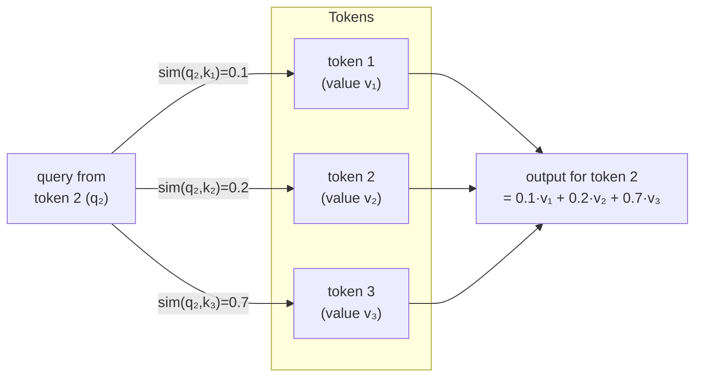
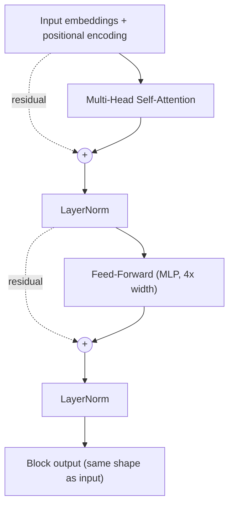

# 15 — Attention & Transformers

> Part 4 · Lesson 15 · Code stack: pytorch

**Prerequisites:** [14 — Sequence Models: RNNs & LSTMs](14-rnns-lstms.md) (you should know why recurrence struggles with long sequences and what a hidden state is). Helpful background: [13 — CNNs](13-cnns.md), [12 — Training Deep Networks](12-training-deep-nets.md), [11 — PyTorch Fundamentals](11-pytorch-fundamentals.md).

**By the end you can:**
- Explain attention as "each token queries every other token and takes a weighted average of their values."
- Derive and implement **scaled dot-product attention** $\text{softmax}(QK^\top/\sqrt{d})V$ from scratch in PyTorch.
- Build a full **Transformer block** (multi-head attention + feed-forward + residual + layer-norm) and add **positional encodings**.
- Distinguish encoder, decoder, and causal masking, and explain why a stack of decoder blocks is the backbone of modern LLMs.
- Articulate *why* attention beat RNNs: parallelism and direct long-range connections — and where that matters for multi-sensor fusion.

---

## 1. Intuition

An RNN reads a sequence one step at a time and crams everything it has seen into a single fixed-size hidden state. To connect token 1 to token 500, the signal has to survive 499 sequential updates — gradients vanish, information gets overwritten, and you can't parallelize because step $t$ needs step $t-1$ first.

**Attention** throws out the bottleneck. Instead of passing information down a chain, **every token looks directly at every other token in one shot** and decides how much each one matters to it.

The analogy I like: think of a **soft database lookup**. Each token issues a **query** ("I'm the word *it* — which earlier noun am I referring to?"). Every token also advertises a **key** ("I'm the noun *boat*, here's my signature"). The query is matched against all keys by similarity; the best matches get the most weight. Then you retrieve a blended answer — a weighted average of every token's **value** (its actual content). Unlike a hard dictionary lookup that returns exactly one row, attention returns a *soft* mixture: 70% boat, 20% water, 10% everything else.

For a USV analogy: imagine fusing readings from a sonar, a lidar, an IMU, and a GPS at one instant. The fusion "query" for *estimate my heading* should weight the IMU heavily and the sonar barely at all; the query for *estimate distance to the dock* should flip that. Attention learns those routing weights instead of hard-coding them.



Three properties fall out of this design:
- **Order-agnostic.** Attention is a weighted sum over a *set* — it has no built-in notion of position. We bolt order back on with **positional encodings** (Section 2).
- **Parallel.** All query-key comparisons are one big matrix multiply. No sequential dependency, so GPUs love it.
- **Constant path length.** Token 1 and token 500 are *one* attention step apart, not 499. Long-range dependencies become easy.

---

## 2. The Math

### Scaled dot-product attention

Pack a sequence of $n$ tokens, each a $d$-dimensional vector, into a matrix $X \in \mathbb{R}^{n \times d}$. We project $X$ into three roles using learned weight matrices $W_Q, W_K, W_V$:

$$
Q = X W_Q, \qquad K = X W_K, \qquad V = X W_V
$$

- $Q \in \mathbb{R}^{n \times d_k}$ — **queries**, one per token ("what am I looking for?").
- $K \in \mathbb{R}^{n \times d_k}$ — **keys**, one per token ("what do I offer, as a lookup signature?").
- $V \in \mathbb{R}^{n \times d_v}$ — **values**, one per token ("what content do I actually contribute?").

The attention output is:

$$
\text{Attention}(Q,K,V) = \underbrace{\text{softmax}\!\left(\frac{QK^\top}{\sqrt{d_k}}\right)}_{\text{attention weights } A \,\in\, \mathbb{R}^{n\times n}} V
$$

Let's read it left to right, because every piece has a reason:

1. **$QK^\top$** is an $n \times n$ matrix of dot products. Entry $(i,j)$ is $q_i \cdot k_j$ — how well token $i$'s query matches token $j$'s key. Dot product is the natural similarity score: it's large when two vectors point the same way.

2. **$/\sqrt{d_k}$ — the scaling.** Where does this come from? If the entries of $q_i$ and $k_j$ are roughly independent with mean 0 and variance 1, their dot product $\sum_{m=1}^{d_k} q_{im}k_{jm}$ has variance $d_k$, so its standard deviation is $\sqrt{d_k}$. For large $d_k$ the raw scores get huge, softmax saturates into a near one-hot spike, and its gradient nearly vanishes. Dividing by $\sqrt{d_k}$ rescales the scores back to unit variance so softmax stays in a healthy, trainable regime.

3. **$\text{softmax}(\cdot)$** is applied **row-wise**. Row $i$ becomes a probability distribution over all tokens $j$: $A_{ij} = \dfrac{\exp(s_{ij})}{\sum_{j'} \exp(s_{ij'})}$, where $s_{ij}$ is the scaled score. Each row sums to 1 — these are token $i$'s mixing weights.

4. **$A V$** multiplies those weights by the values. Output row $i$ is $\sum_j A_{ij}\, v_j$ — a weighted average of all value vectors, weighted by relevance to token $i$. That's the soft lookup.

**Self-attention** just means $Q$, $K$, $V$ all come from the same sequence $X$ (a sentence attending to itself). **Cross-attention** uses $Q$ from one sequence and $K,V$ from another (a decoder attending to an encoder's output).

### Multi-head attention

One attention computation forces all tokens to relate in a single way. Real relationships are multi-faceted: in language, one "head" might track subject–verb agreement while another tracks coreference. So we run $h$ attentions in parallel, each in its own lower-dimensional subspace:

$$
\text{head}_i = \text{Attention}(X W_Q^{(i)},\, X W_K^{(i)},\, X W_V^{(i)}), \qquad i = 1,\dots,h
$$

$$
\text{MultiHead}(X) = \text{Concat}(\text{head}_1, \dots, \text{head}_h)\, W_O
$$

Each head uses dimension $d_k = d_v = d_{\text{model}}/h$, so concatenating $h$ heads brings you back to $d_{\text{model}}$, and the output projection $W_O \in \mathbb{R}^{d_{\text{model}} \times d_{\text{model}}}$ mixes the heads. **Same total compute as one big head, but $h$ independent relationship subspaces.**

### Positional encodings

Attention is a sum over a set — permute the input tokens and the outputs just permute the same way; the model literally cannot tell "dock then boat" from "boat then dock." We inject order by **adding** a position-dependent vector to each token embedding. The original Transformer uses fixed sinusoids:

$$
PE_{(\text{pos},\, 2k)} = \sin\!\left(\frac{\text{pos}}{10000^{\,2k/d_{\text{model}}}}\right), \qquad
PE_{(\text{pos},\, 2k+1)} = \cos\!\left(\frac{\text{pos}}{10000^{\,2k/d_{\text{model}}}}\right)
$$

where $\text{pos}$ is the position index and $k$ indexes the embedding dimension. Each dimension is a sinusoid of a different wavelength (short wavelengths in low dims, long in high dims) — like the bits of a binary clock, the combination uniquely identifies a position. A useful bonus: $PE_{\text{pos}+\Delta}$ is a fixed linear function of $PE_{\text{pos}}$, so the model can learn to attend by *relative* offset. (Modern models often swap these for learned or rotary (RoPE) encodings, but the principle is identical: tell attention where each token sits.)

### The Transformer block

Stack the pieces with two stabilizers from earlier lessons — **residual connections** (so gradients flow, see [12 — Training Deep Networks](12-training-deep-nets.md)) and **layer normalization**:

$$
\begin{aligned}
Z &= \text{LayerNorm}\big(X + \text{MultiHead}(X)\big) \\
\text{Out} &= \text{LayerNorm}\big(Z + \text{FFN}(Z)\big)
\end{aligned}
$$

The **feed-forward network** $\text{FFN}(z) = W_2\,\sigma(W_1 z + b_1) + b_2$ is a per-token MLP (typically expanding to $4\times$ the width, e.g. GELU activation). Attention mixes information *across* tokens; the FFN then transforms each token *independently*. That alternation — mix, then process — is the whole engine.



Because the block's output has the **same shape** as its input, you can stack $N$ of them (12, 96, ...) like Lego.

---

## 3. Code

We'll build attention from scratch in PyTorch — first raw scaled dot-product on a toy sequence with a heatmap, then a reusable self-attention module, then a complete Transformer block. (Tested on PyTorch 2.8.)

### 3a. Scaled dot-product attention, by hand

```python
import torch
import torch.nn.functional as F
import math
import matplotlib.pyplot as plt

torch.manual_seed(0)

# Toy "sequence": 4 tokens, each a d_model-dimensional embedding.
# Pretend these are 4 sensor readings or 4 words.
seq_len, d_model = 4, 8
x = torch.randn(seq_len, d_model)          # X : (n=4, d=8)

# Learned-in-real-life projection matrices. Here just random, small.
Wq = torch.randn(d_model, d_model) * 0.5
Wk = torch.randn(d_model, d_model) * 0.5
Wv = torch.randn(d_model, d_model) * 0.5

Q = x @ Wq                                  # (4, 8) queries
K = x @ Wk                                  # (4, 8) keys
V = x @ Wv                                  # (4, 8) values

# Step 1: raw similarity scores, every query vs every key -> (4, 4)
scores = Q @ K.T / math.sqrt(d_model)       # the /sqrt(d) scaling

# Step 2: row-wise softmax -> attention weights, each row sums to 1
attn = F.softmax(scores, dim=-1)            # (4, 4)

# Step 3: weighted average of values
out = attn @ V                              # (4, 8)

print("attention weights:\n", attn.round(decimals=2))
print("row sums (must be 1):", attn.sum(dim=-1))
print("output shape:", out.shape)
# -> row sums (must be 1): tensor([1., 1., 1., 1.])
# -> output shape: torch.Size([4, 8])
```

### 3b. Visualize the attention weight matrix

```python
plt.figure(figsize=(4, 4))
plt.imshow(attn.detach(), cmap="viridis")
plt.colorbar(label="attention weight")
plt.xlabel("Key (token being looked AT)")
plt.ylabel("Query (token doing the LOOKING)")
plt.title("Attention weights  softmax(QKᵀ/√d)")
for i in range(seq_len):
    for j in range(seq_len):
        plt.text(j, i, f"{attn[i,j]:.2f}", ha="center", va="center",
                 color="white", fontsize=9)
plt.tight_layout()
plt.show()
```

**What you should see:** a 4×4 grid where each *row* is a probability distribution (brightnesses in a row sum to 1). A bright cell at $(i,j)$ means "token $i$ pulls strongly from token $j$." With random weights it looks fairly uniform; after training on a real task, rows develop sharp peaks — that's the model deciding *who attends to whom*.

### 3c. A reusable self-attention module (with optional causal mask)

```python
import torch.nn as nn

class SelfAttention(nn.Module):
    """Single-head scaled dot-product self-attention."""
    def __init__(self, d_model):
        super().__init__()
        self.Wq = nn.Linear(d_model, d_model, bias=False)
        self.Wk = nn.Linear(d_model, d_model, bias=False)
        self.Wv = nn.Linear(d_model, d_model, bias=False)
        self.scale = math.sqrt(d_model)

    def forward(self, x, mask=None):
        # x: (batch?, seq, d_model). Works on (seq, d_model) too.
        Q, K, V = self.Wq(x), self.Wk(x), self.Wv(x)
        scores = Q @ K.transpose(-2, -1) / self.scale       # (..., n, n)
        if mask is not None:
            # Set masked positions to -inf so softmax gives them ~0 weight.
            scores = scores.masked_fill(mask == 0, float("-inf"))
        attn = F.softmax(scores, dim=-1)
        return attn @ V, attn

# Causal mask: token i may only attend to tokens j <= i (no peeking ahead).
sl = 5
causal = torch.tril(torch.ones(sl, sl))     # lower-triangular ones
sa = SelfAttention(16)
o, w = sa(torch.randn(sl, 16), mask=causal)
print("token 0 attends to:", w[0].detach().round(decimals=2))
# -> token 0 attends to: tensor([1., 0., 0., 0., 0.])   # only itself
print("token 4 attends to:", w[4].detach().round(decimals=2))
# -> token 4 attends to: e.g. tensor([0.27, 0.10, 0.07, 0.13, 0.44])  # a distribution over
#    positions 0-4 that sums to 1 (exact values depend on the RNG/torch version; the point is
#    no position is masked, unlike token 0). With these random weights the split is roughly even.
```

The **causal mask** is the single trick that turns self-attention into a left-to-right generator: each position can only use the past. That's exactly what a language model needs to predict the next token.

### 3d. Full Transformer block (using PyTorch's multi-head attention)

```python
class TransformerBlock(nn.Module):
    """Post-norm Transformer encoder block: MHA -> FFN, both with residuals.

    This is the original 2017 (Vaswani) layout: LayerNorm is applied AFTER the
    residual add, matching Section 2's Z = LayerNorm(X + MultiHead(X)). Modern
    LLMs instead use *pre-norm* — norm INSIDE each sublayer, before attention/FFN,
    e.g. x = x + drop(attn(norm1(x), ...)) — which trains more stably at depth.
    """
    def __init__(self, d_model, n_heads, d_ff, dropout=0.1):
        super().__init__()
        self.attn = nn.MultiheadAttention(d_model, n_heads,
                                          dropout=dropout, batch_first=True)
        self.ff = nn.Sequential(
            nn.Linear(d_model, d_ff), nn.GELU(),
            nn.Dropout(dropout), nn.Linear(d_ff, d_model),
        )
        self.norm1 = nn.LayerNorm(d_model)
        self.norm2 = nn.LayerNorm(d_model)
        self.drop = nn.Dropout(dropout)

    def forward(self, x, attn_mask=None):
        # Sublayer 1: self-attention + residual
        a, _ = self.attn(x, x, x, attn_mask=attn_mask)   # Q=K=V=x
        x = self.norm1(x + self.drop(a))
        # Sublayer 2: position-wise feed-forward + residual
        x = self.norm2(x + self.drop(self.ff(x)))
        return x

block = TransformerBlock(d_model=16, n_heads=4, d_ff=64)
batch = torch.randn(2, 5, 16)               # (batch=2, seq=5, d_model=16)
print("block output shape:", block(batch).shape)
# -> block output shape: torch.Size([2, 5, 16])   # same shape in == out
```

Note `d_model=16` with `n_heads=4` gives each head $16/4 = 4$ dimensions — `n_heads` must divide `d_model`. Output shape equals input shape, so `nn.Sequential(*[TransformerBlock(...) for _ in range(N)])` stacks $N$ layers instantly. In real code you'd reach for `nn.TransformerEncoderLayer` / `nn.TransformerEncoder`, but building it once by hand is how it stops being magic.

---

## 4. Real Case

### Why attention beat RNNs — and where it matters for you

The 2017 paper that introduced Transformers ("Attention Is All You Need") trained on machine translation (the **WMT English–German** benchmark). Two practical wins, both visible in your own robotics work:

**1. Parallelism in training.** An RNN over a length-$n$ sequence is $n$ sequential steps — it *cannot* be parallelized along time. A Transformer's $QK^\top$ is a single batched matrix multiply: all positions at once. On a GPU that's the difference between hours and minutes, which is why models scaled from millions to billions of parameters once recurrence was removed.

**2. Long-range dependencies.** Connecting position 1 to position 1000 costs an RNN ~1000 lossy hops; attention does it in **one**. Concretely, in a path-following log where the USV's behavior at $t{=}900$ depends on an obstacle first seen at $t{=}10$, attention can route that information directly. The cost: attention is $O(n^2)$ in sequence length (the $n\times n$ matrix), whereas an RNN is $O(n)$ — so for *very* long sequences you trade memory for that direct access. (This $O(n^2)$ wall is what efficient-attention research keeps chipping at.)

**Multi-sensor fusion mapping.** Suppose at each timestep your USV produces a token by concatenating features from sonar, lidar, IMU, and GPS, projected to $d_{\text{model}}$. Run a small Transformer encoder over a window of recent timesteps:

| Transformer concept | USV fusion meaning |
|---|---|
| Token | One timestep's fused feature vector (or one sensor channel) |
| Query of token $t$ | "What context do I need to estimate state at $t$?" |
| Attention weights | Learned, *dynamic* sensor/time relevance — heavy IMU in a turn, heavy lidar near a dock |
| Positional encoding | The timestamp / ordering of readings (so the model knows recency) |
| Causal mask | Enforce *online* operation: only use past readings, never future ones |

The headline is that **attention weights are data-dependent**. A Kalman filter's gains are fixed by your noise model; attention *learns* to up-weight whichever sensor is trustworthy in the current situation — exactly the adaptive fusion you'd otherwise hand-tune.

### The bridge to LLMs

A modern large language model (GPT-style) is, structurally, almost entirely the same kit you built in 3d: **a deep stack of decoder Transformer blocks** — self-attention with a causal mask, feed-forward, residuals, layer-norm — repeated dozens to hundreds of times, fed token embeddings plus positional encodings, with a final linear layer predicting the next token. The one tweak is the *placement* of the layer-norm: 3d uses the original post-norm layout, while modern LLMs move the norm inside each sublayer (**pre-norm**, as the 3d docstring notes) for training stability at depth — same components, reordered. Train that to predict the next token over a few trillion tokens of text and the in-context routing you saw in the heatmap becomes grammar, facts, and reasoning. There's no new mechanism beyond this lesson — just scale, data, and the causal mask. We'll see how such models are adapted and deployed in [17 — Transfer Learning, LLMs & MLOps](17-transfer-learning-llms-mlops.md).

---

## 5. Pitfalls & Tips

- **Forgetting positional information.** Drop positional encodings and your model treats input as a bag of tokens — it can't distinguish "boat hits dock" from "dock hits boat." Always add positions (or use RoPE) before the first block.
- **Skipping the $\sqrt{d_k}$ scaling.** Without it, scores blow up with dimension, softmax saturates to one-hot, gradients vanish, and training stalls. It's one line; don't omit it.
- **`n_heads` must divide `d_model`.** PyTorch will raise an error otherwise. Each head gets $d_{\text{model}}/h$ dimensions.
- **Wrong mask, silent leakage.** A decoder/generator *must* use a causal mask. If you forget it, the model "cheats" by attending to future tokens, trains to near-zero loss, then fails completely at inference when the future isn't available. Sanity-check that token $i$'s weights are zero for $j>i$ (like the 3c output).
- **Confusing the padding mask with the causal mask.** Real batches pad variable-length sequences; you need a *padding* mask to zero out attention to pad tokens, separate from the causal mask. PyTorch separates `attn_mask` (causal) from `key_padding_mask`.
- **$O(n^2)$ memory surprise.** Attention's memory grows with the *square* of sequence length. Doubling a 4k-token context to 8k roughly quadruples the attention matrix — a common out-of-memory trap. Use shorter windows or efficient-attention variants for long logs.

---

## 6. Check Your Understanding

**Q1.** In $\text{softmax}(QK^\top/\sqrt{d_k})V$, what does a single *row* of the $n\times n$ attention matrix represent, and why must it sum to 1?

<details><summary>Answer</summary>
Row $i$ holds the mixing weights that token $i$ assigns to every token $j$ (including itself). Because each row is produced by a softmax, its entries are non-negative and sum to 1 — so the output for token $i$, $\sum_j A_{ij} v_j$, is a *convex combination* (weighted average) of all value vectors. It's a soft, normalized lookup, not an arbitrary sum.
</details>

**Q2.** Why divide the scores by $\sqrt{d_k}$ specifically, rather than some other constant?

<details><summary>Answer</summary>
If query and key entries are ~independent with unit variance, their dot product over $d_k$ dimensions has variance $d_k$ and standard deviation $\sqrt{d_k}$. Dividing by $\sqrt{d_k}$ restores unit variance, keeping softmax inputs in a moderate range where it isn't saturated and gradients stay healthy. Any other constant wouldn't track how the spread grows with dimension.
</details>

**Q3.** Self-attention is permutation-equivariant (shuffle the tokens, the outputs shuffle identically). Why is that a problem, and how do Transformers fix it?

<details><summary>Answer</summary>
It means the raw mechanism can't use word/timestep order — "A then B" looks identical to "B then A." That's fatal for language and time series. The fix is **positional encodings**: a position-dependent vector added to each token embedding (fixed sinusoids, learned, or rotary) so each token carries where it sits in the sequence.
</details>

**Q4.** What concrete advantage does multi-head attention give over a single attention head of the same total width?

<details><summary>Answer</summary>
It lets the model attend to information in **multiple independent representation subspaces simultaneously** — one head can track one type of relationship (e.g. syntactic agreement, or "which sensor matters for heading") while another tracks a different one. A single head must compress all relationship types into one averaged attention pattern. The compute cost is essentially the same because each head is correspondingly narrower.
</details>

**Q5.** You're building an *online* state estimator for a USV that must never use future sensor readings. Which masking do you apply inside self-attention, and what bug appears if you forget it?

<details><summary>Answer</summary>
A **causal (lower-triangular) mask**, so position $t$ only attends to positions $\le t$. Forget it and the model attends to future readings during training, drives loss artificially low, then collapses at deployment when the future genuinely isn't available — a classic train/serve leakage bug.
</details>

---

## Recap & Next

- **Attention** is a soft, learned lookup: each token forms a **query**, matches it against all **keys**, and retrieves a softmax-weighted average of all **values** — $\text{softmax}(QK^\top/\sqrt{d_k})V$.
- The $\sqrt{d_k}$ scaling keeps softmax trainable; **multi-head** attention runs several lookups in parallel subspaces; **positional encodings** restore the order that attention is blind to.
- A **Transformer block** alternates "mix across tokens" (attention) with "process each token" (feed-forward), glued by residual connections and layer-norm — and it stacks cleanly because input shape equals output shape.
- Attention beat RNNs by being **parallel** and giving **constant-length** paths between any two positions; the price is $O(n^2)$ cost in sequence length. For robotics this enables adaptive, data-dependent multi-sensor fusion.
- A modern **LLM is a deep stack of causal decoder blocks** — nothing in its core beyond this lesson, just scale and data.

Next, we use attention and the building blocks from Parts 3–4 to *create* data rather than classify it — autoencoders, VAEs, GANs, and diffusion models: [16 — Generative Models](16-generative-models.md).
