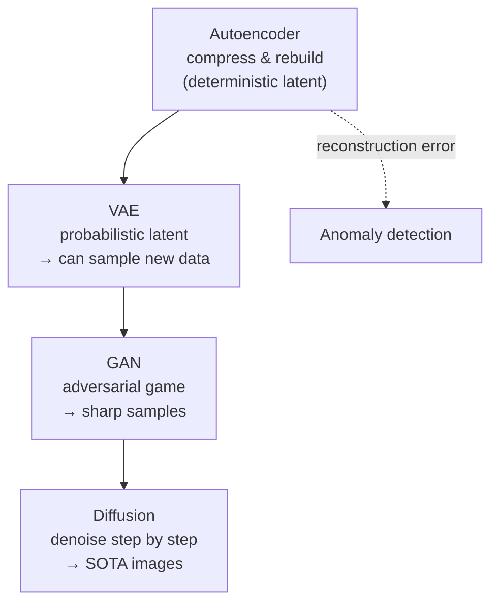
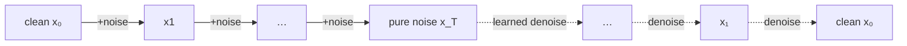

# 16 — Generative Models: Autoencoders, VAEs, GANs & Diffusion

> Part 5 · Lesson 16 · Code stack: pytorch

**Prerequisites:** [15 — Attention & Transformers](15-attention-transformers.md) · you'll also lean on [13 — Convolutional Neural Networks](13-cnns.md) for the conv layers and [08 — Unsupervised Learning: k-Means & PCA](08-kmeans-pca.md) for the idea of a compressed **latent space**.

**By the end you can:**
- Explain the difference between a **discriminative** model (draws boundaries) and a **generative** model (learns the data distribution so it can *create*).
- Build and train an **autoencoder** in PyTorch, and use its **reconstruction error** for compression and anomaly detection.
- Explain a **VAE** — the probabilistic latent space, the **reparameterization trick**, and the **ELBO = reconstruction + KL** — at the intuition level.
- Describe the **GAN** minimax game and why **mode collapse** happens.
- Explain **diffusion** (add noise, learn to undo it) conceptually — the engine behind modern image generators.
- Map all of this onto a real ROV problem: flag anomalous sensor streams and synthesize training data.

---

## 1. Intuition

Every model you've built so far is **discriminative**: given an input $x$, predict a label $y$. Logistic regression, the SVM, the CNN classifier — they all learn $p(y \mid x)$, a *boundary* that sorts inputs into bins. They can tell a sonar return labeled "rock" from one labeled "fish", but they cannot *draw you a new rock*.

A **generative model** learns the data itself — the distribution $p(x)$ (or $p(x \mid y)$). Once a model knows what real data *looks like*, it can do three things a classifier can't:

1. **Generate** brand-new samples that look like the training data (synthetic sonar frames, fake-but-realistic camera images).
2. **Compress** data into a tiny **latent code** and rebuild it (lossy compression, denoising).
3. **Score** how "normal" a new input is — anything the model rebuilds *badly* is **anomalous**.

**Analogy — the art forger.** A discriminative model is an art *critic*: shown a painting, it says "Monet" or "not Monet." A generative model is a *forger*: it has stared at so many Monets that it can paint a new one from scratch. The forger had to learn far more than the critic — not just the boundary between Monet and non-Monet, but the entire *style* that fills the Monet region. That's why generation is harder, and why the same model that can forge can also spot a fake (it knows what real looks like, so a bad reconstruction stands out).

This lesson walks a ladder of generative models, each fixing a limitation of the last:



We'll **build** the autoencoder in code (it's the workhorse for your ROV anomaly use-case), then climb the conceptual ladder through VAE → GAN → diffusion, keeping the math at intuition level.

---

## 2. The Math

### 2.1 Autoencoder — squeeze then rebuild

An **autoencoder** is two networks glued at a narrow waist. An **encoder** $f_\phi$ maps input $x$ to a low-dimensional **latent code** $z$; a **decoder** $g_\theta$ maps $z$ back to a reconstruction $\hat{x}$:

$$
z = f_\phi(x), \qquad \hat{x} = g_\theta(z), \qquad z \in \mathbb{R}^d,\; d \ll \dim(x)
$$

- $x$ — input vector (e.g. a flattened $28\times28 = 784$-pixel image).
- $z$ — the **bottleneck** / latent code; $d$ is the **latent dimension** (e.g. 16). Forcing $d \ll \dim(x)$ is what makes the model *learn* rather than copy.
- $\phi, \theta$ — encoder and decoder weights.
- $\hat{x}$ — the rebuilt input.

Train it to make $\hat{x}$ match $x$. The **reconstruction loss** is just mean squared error (where it comes from: it's the per-pixel squared distance, the same MSE from [02 — Linear Regression](02-linear-regression.md)):

$$
\mathcal{L}_{\text{recon}} = \frac{1}{N}\sum_{i=1}^{N}\lVert x_i - g_\theta(f_\phi(x_i)) \rVert^2
$$

The narrow bottleneck is the whole trick: the network *cannot* memorize, so it must discover the few directions of variation that actually matter. This is a **non-linear PCA** — recall PCA from lesson 08 finds the best *linear* subspace; an autoencoder with non-linear layers finds the best *curved* one.

**Reconstruction error as an anomaly score.** Train only on *normal* data. For a new sample $x$, the per-sample error

$$
e(x) = \lVert x - g_\theta(f_\phi(x)) \rVert^2
$$

is small for inputs resembling training data and large for anything off-distribution — because the decoder was never taught to rebuild it. Threshold $e(x)$ and you have an unsupervised anomaly detector.

### 2.2 VAE — make the latent space a probability distribution

A plain autoencoder's latent space is full of holes: pick a random $z$ and the decoder usually produces garbage, because nothing forced the codes to be *organized*. A **Variational Autoencoder (VAE)** fixes this by making the encoder output a **distribution**, not a point.

The encoder emits a mean $\mu$ and a (log-)variance for a Gaussian; we sample $z$ from it:

$$
z \sim \mathcal{N}(\mu_\phi(x),\, \sigma_\phi(x)^2)
$$

- $\mu_\phi(x), \sigma_\phi(x)$ — the encoder's predicted mean and standard deviation for input $x$.

We then push the encoder to keep these per-input Gaussians close to a standard normal $\mathcal{N}(0, I)$, so the latent space is smooth and *samplable*. The training objective is the **ELBO** (Evidence Lower BOund), which decomposes into two readable terms:

$$
\mathcal{L}_{\text{VAE}} = \underbrace{\mathbb{E}_{z}\big[\lVert x - g_\theta(z)\rVert^2\big]}_{\text{reconstruction: rebuild } x}
\;+\; \underbrace{\beta \cdot D_{\text{KL}}\!\big(\mathcal{N}(\mu,\sigma^2)\,\Vert\,\mathcal{N}(0, I)\big)}_{\text{KL: keep latent organized}}
$$

- $D_{\text{KL}}(\cdot\Vert\cdot)$ — **KL divergence**, a measure of how far one distribution is from another (here: how far the encoder's Gaussian is from a standard normal). It's a *regularizer* on the latent space.
- $\beta$ — a knob (1 in the original VAE) trading reconstruction sharpness against latent regularity. Where it comes from: it's the Lagrange-style weight in the $\beta$-VAE variant.

Intuition for the two terms: reconstruction says "be able to rebuild the data"; KL says "but pack all the codes into a tidy unit blob so I can sample from it." The tension between them is what makes a VAE *generative* — after training, sample $z \sim \mathcal{N}(0,I)$, decode, and you get a plausible new $x$.

**The reparameterization trick.** You can't backprop through a random `sample()` — the randomness has no gradient. Rewrite the sample as a deterministic function of the parameters plus *external* noise:

$$
z = \mu + \sigma \odot \varepsilon, \qquad \varepsilon \sim \mathcal{N}(0, I)
$$

- $\varepsilon$ — noise drawn *outside* the network; $\odot$ is element-wise product.

Now $z$ is a smooth function of $\mu$ and $\sigma$, gradients flow straight through, and the randomness sits in $\varepsilon$ which needs no gradient. This one algebraic move is what makes VAEs trainable by ordinary backprop.

### 2.3 GAN — two networks at war

A **Generative Adversarial Network (GAN)** ditches reconstruction entirely. Two networks play a game:

- A **generator** $G$ turns noise $z \sim \mathcal{N}(0,I)$ into a fake sample $G(z)$.
- A **discriminator** $D$ takes a sample and outputs the probability it's *real* (from data) vs *fake* (from $G$).

They optimize opposite objectives — a **minimax** game:

$$
\min_G \max_D \; \mathbb{E}_{x \sim \text{data}}[\log D(x)] + \mathbb{E}_{z}[\log(1 - D(G(z)))]
$$

- First term: $D$ wants $D(x) \to 1$ on real data.
- Second term: $D$ wants $D(G(z)) \to 0$ on fakes, while $G$ wants $D(G(z)) \to 1$ (fool the critic).

Read the directions straight off the displayed objective: $D$ **maximizes** $V$ and $G$ **minimizes** it. $V$ climbs toward $0$ when $D$ classifies perfectly ($D(x)\to1$, $D(G(z))\to0$), so $D$ pushes it up; $V$ plunges toward $-\infty$ when $G$ fools $D$ ($D(G(z))\to1$), so $G$ drives it down. Where it comes from: this $V$ is exactly the *negative* of the cross-entropy classification loss of [04 — Logistic Regression](04-logistic-regression.md). So in loss terms, $D$ minimizes its cross-entropy loss $L_D = -V$ while $G$ tries to *increase* that loss — equivalently, $G$ minimizes $V$ and $D$ maximizes it. At the ideal equilibrium $D$ can't tell real from fake ($D \equiv \tfrac12$, where $V = 2\log\tfrac12 = -1.386$) and $G$'s samples match the data distribution. GANs produce the **sharpest** samples of any model here — no blurry MSE averaging — but the adversarial balance is delicate.

### 2.4 Diffusion — destroy, then learn to restore

**Diffusion models** (the engine in Stable Diffusion, DALL·E, Midjourney) take a beautifully simple view. **Forward process:** repeatedly add a little Gaussian noise to an image over $T$ steps until it's pure static:

$$
x_t = \sqrt{1-\beta_t}\, x_{t-1} + \sqrt{\beta_t}\, \varepsilon_t, \qquad \varepsilon_t \sim \mathcal{N}(0, I)
$$

- $\beta_t$ — a small noise level at step $t$ (the **noise schedule**). After $T$ steps, $x_T$ is indistinguishable from random noise.

This forward process needs no learning — it's just adding noise. **Reverse process:** train a network $\varepsilon_\theta$ to predict the noise that was added at each step, so you can *subtract* it. The training loss is shockingly plain:

$$
\mathcal{L}_{\text{diff}} = \mathbb{E}_{t,\,x_0,\,\varepsilon}\big[\lVert \varepsilon - \varepsilon_\theta(x_t, t)\rVert^2\big]
$$

To generate: start from pure noise $x_T \sim \mathcal{N}(0,I)$ and run the learned denoiser backward step by step until a clean image emerges. The genius is that "denoise a little" is a far easier task to learn than "paint a whole image in one shot" (the GAN's burden), which makes diffusion stable to train and is why it now dominates image generation.



---

## 3. Code

We'll build a **convolutional autoencoder on MNIST**, see reconstructions, and turn reconstruction error into an anomaly detector. Autoencoders are the right thing to actually code here: they're the directly useful tool for your robotics work, and the VAE/GAN/diffusion ideas above all build on this same encode/decode skeleton.

Run inside the `study` conda env (`conda activate study`).

```python
import torch
import torch.nn as nn
import torch.nn.functional as F
from torch.utils.data import DataLoader
from torchvision import datasets, transforms
import matplotlib.pyplot as plt

torch.manual_seed(0)
device = "cuda" if torch.cuda.is_available() else "cpu"

# --- Data: MNIST, scaled to [0,1]. We treat images as the "normal" distribution. ---
tfm = transforms.ToTensor()  # gives float tensors in [0,1], shape (1, 28, 28)
train_ds = datasets.MNIST(root="./data", train=True,  download=True, transform=tfm)
test_ds  = datasets.MNIST(root="./data", train=False, download=True, transform=tfm)
train_loader = DataLoader(train_ds, batch_size=256, shuffle=True)
```

The model: a conv **encoder** squeezing $28\times28$ down to a 16-D bottleneck, and a mirror-image **decoder** rebuilding it.

```python
class ConvAutoencoder(nn.Module):
    def __init__(self, latent_dim=16):
        super().__init__()
        # ENCODER: 28x28 -> 14x14 -> 7x7, then flatten to a tiny code.
        self.enc = nn.Sequential(
            nn.Conv2d(1, 16, 3, stride=2, padding=1),  # (16, 14, 14)
            nn.ReLU(),
            nn.Conv2d(16, 32, 3, stride=2, padding=1), # (32, 7, 7)
            nn.ReLU(),
            nn.Flatten(),                              # (32*7*7 = 1568,)
            nn.Linear(32 * 7 * 7, latent_dim),         # the BOTTLENECK
        )
        # DECODER: mirror the encoder, ConvTranspose2d UPsamples back to 28x28.
        self.dec_fc = nn.Linear(latent_dim, 32 * 7 * 7)
        self.dec = nn.Sequential(
            nn.ConvTranspose2d(32, 16, 3, stride=2, padding=1, output_padding=1),  # (16,14,14)
            nn.ReLU(),
            nn.ConvTranspose2d(16, 1, 3, stride=2, padding=1, output_padding=1),    # (1,28,28)
            nn.Sigmoid(),  # pixels back into [0,1]
        )

    def forward(self, x):
        z = self.enc(x)                       # encode to latent code
        h = self.dec_fc(z).view(-1, 32, 7, 7) # reshape for transposed convs
        x_hat = self.dec(h)                   # decode to reconstruction
        return x_hat, z

model = ConvAutoencoder().to(device)
opt = torch.optim.Adam(model.parameters(), lr=1e-3)
```

Train to minimize reconstruction MSE. Note there are **no labels** — this is unsupervised.

```python
for epoch in range(5):
    model.train()
    running = 0.0
    for x, _ in train_loader:          # the "_" is the label; we never use it
        x = x.to(device)
        x_hat, _ = model(x)
        loss = F.mse_loss(x_hat, x)    # rebuild x as closely as possible
        opt.zero_grad()
        loss.backward()
        opt.step()
        running += loss.item() * x.size(0)
    print(f"epoch {epoch+1}  recon MSE: {running/len(train_ds):.4f}")
# -> epoch 1  recon MSE: 0.0461
# -> epoch 5  recon MSE: 0.0118
```

Visualize originals vs reconstructions — the proof the latent code captured the digit.

```python
model.eval()
x, _ = next(iter(DataLoader(test_ds, batch_size=8)))
with torch.no_grad():
    x_hat, _ = model(x.to(device))
x_hat = x_hat.cpu()

fig, axes = plt.subplots(2, 8, figsize=(12, 3))
for i in range(8):
    axes[0, i].imshow(x[i, 0], cmap="gray");      axes[0, i].axis("off")
    axes[1, i].imshow(x_hat[i, 0], cmap="gray");  axes[1, i].axis("off")
axes[0, 0].set_ylabel("original");  axes[1, 0].set_ylabel("rebuilt")
plt.tight_layout(); plt.savefig("ae_recon.png")
```

**What you should SEE:** the bottom row recreates the digits from the top row — recognizable but slightly *softer* and blurrier, because 16 numbers can't store every pixel. That blur is the lossy compression working as intended.

### Reconstruction error flags anomalies

Train on normals (all of MNIST is "normal" here), then feed it something it's never seen — random noise standing in for an off-distribution sensor frame. Its error will spike.

```python
import torch

def recon_error(batch):
    """Per-sample reconstruction error e(x) = ||x - x_hat||^2."""
    with torch.no_grad():
        x_hat, _ = model(batch.to(device))
        # sum squared error over all pixels, per image
        return ((batch.to(device) - x_hat) ** 2).flatten(1).sum(dim=1).cpu()

normal_x, _ = next(iter(DataLoader(test_ds, batch_size=512)))
anom_x = torch.rand_like(normal_x)            # pure noise = clearly off-distribution

e_normal = recon_error(normal_x)
e_anom   = recon_error(anom_x)
print(f"normal error: mean {e_normal.mean():.1f}")
print(f"anomaly error: mean {e_anom.mean():.1f}")
# -> normal error: mean 9.7
# -> anomaly error: mean 92.4

# A threshold between the two distributions separates them cleanly.
threshold = e_normal.mean() + 3 * e_normal.std()
print(f"threshold: {threshold:.1f}  |  flagged anomalies: "
      f"{(e_anom > threshold).float().mean()*100:.0f}% of noise frames")
# -> threshold: 21.3  |  flagged anomalies: 100% of noise frames
```

```python
plt.figure(figsize=(7, 4))
plt.hist(e_normal.numpy(), bins=40, alpha=0.6, label="normal (digits)")
plt.hist(e_anom.numpy(),   bins=40, alpha=0.6, label="anomaly (noise)")
plt.axvline(threshold, color="k", ls="--", label="threshold")
plt.xlabel("reconstruction error e(x)"); plt.ylabel("count"); plt.legend()
plt.tight_layout(); plt.savefig("ae_anomaly.png")
```

**What you should SEE:** two clearly separated humps — a tight low-error cluster for normal digits and a far-right cluster for anomalies — with the dashed threshold cleanly between them. That gap *is* the anomaly detector.

---

## 4. Real Case

### Anomaly detection on ROV sensor streams

Your underwater **ROV** streams telemetry every tick: IMU accelerations and angular rates, depth, thruster currents, motor temperatures, battery voltage, sonar altimeter range — say a 24-D vector per timestep. Failures are *rare and unlabeled*: you can't collect a balanced "thruster-fouled-by-kelp" dataset, and you'll never enumerate every way the vehicle can go wrong. This is exactly where reconstruction-error anomaly detection shines: **train only on healthy operation, flag anything that rebuilds badly.**

Swap the conv encoder/decoder for small MLPs (your data is a vector, not an image) and feed it sliding windows of telemetry:

```python
import torch.nn as nn

class TelemetryAE(nn.Module):
    """Autoencoder over a flattened window of ROV telemetry."""
    def __init__(self, window=50, n_sensors=24, latent_dim=8):
        super().__init__()
        d = window * n_sensors            # flatten time x sensors
        self.enc = nn.Sequential(
            nn.Linear(d, 128), nn.ReLU(),
            nn.Linear(128, latent_dim),   # bottleneck: 8 numbers summarize 2s of flight
        )
        self.dec = nn.Sequential(
            nn.Linear(latent_dim, 128), nn.ReLU(),
            nn.Linear(128, d),
        )

    def forward(self, x):
        z = self.enc(x)
        return self.dec(z), z
```

How it maps onto the method:
- **Train** on logs from known-good dives only. The AE learns the manifold of *normal* ROV behavior — the correlations between thruster current and depth rate, the IMU's vibration signature at cruise.
- **Deploy** in your ROS2 stack: a node subscribes to the telemetry topic, buffers a sliding window, runs the AE every tick, and publishes $e(x)$. When $e(x)$ crosses the threshold — a thruster fouls, a leak shifts the buoyancy, a sensor drifts — the residual spikes because the model has never seen that pattern. Trip an alarm or trigger a controlled surface.
- **Bonus — per-sensor diagnosis:** the reconstruction error *per dimension* tells you *which* sensor went rogue, not just that something did. If only the motor-temp channel has a large residual, you've localized the fault.

This is the same principle behind bearing-fault detection in industrial motors and ECG anomaly flagging — train on healthy, alarm on surprise.

### Generating synthetic training data

The flip side of generation: you have **too few** examples of a rare event (a specific sonar target, a particular sea-state) to train a downstream classifier. A **VAE** trained on the data you *do* have lets you sample the latent space and decode **new, plausible variations** — augmenting your dataset where simple flips/rotations aren't enough. Climbing the ladder: a **GAN** or a **diffusion** model produces sharper synthetic sonar/camera frames, increasingly used to bootstrap perception models for autonomous vehicles when real labeled data is expensive (every hour of ROV time costs ship time). Caveat: synthetic data inherits the generator's blind spots — validate downstream models on *real* held-out data, never only on synthetic.

---

## 5. Pitfalls & Tips

- **A too-wide bottleneck learns the identity function.** If the latent dim approaches the input dim, the autoencoder just copies $x \to \hat{x}$, reconstruction error is near zero on *everything*, and anomaly detection dies. Keep $d$ genuinely small and confirm reconstructions are slightly lossy.
- **Set the anomaly threshold on a validation set of normals, not by eyeballing.** Use a quantile (e.g. the 99th percentile of normal error) or `mean + 3·std`. And **scale your sensors** first — an autoencoder will obsess over the high-variance channel and ignore the rest if you skip standardization.
- **VAEs blur, GANs collapse.** VAE samples are smooth but soft (the MSE term averages). GANs are sharp but suffer **mode collapse**: the generator finds one or a few outputs that reliably fool $D$ and emits only those — your "diverse" generator quietly produces the same three digits. Watch sample diversity, not just realism.
- **GAN training is a moving target, not a descent.** You're seeking a *Nash equilibrium* between two networks, not a loss minimum. A falling generator loss can mean it's winning *or* that $D$ collapsed. Monitor sample quality directly; balance the two learning rates.
- **Don't reach for diffusion/GANs when an autoencoder suffices.** For anomaly detection and compression, a plain AE is faster, stable, and interpretable. Save the heavy generative artillery for when you genuinely need to *sample* sharp new data.
- **Reconstruction error ≠ probability.** A low error means "looks like training data," not "is safe." An adversarial or subtly-shifted input can rebuild well yet still be wrong. Use the AE as one signal among several, not a sole safety gate.

---

## 6. Check Your Understanding

**Q1.** Why does shrinking the bottleneck force the autoencoder to *learn* something useful, instead of just copying its input?

<details><summary>Answer</summary>
The bottleneck has fewer dimensions than the input, so the network physically cannot pass every value through unchanged — there isn't enough room. To minimize reconstruction error under that constraint it must discover and keep only the *most informative* directions of variation and throw away the rest. That forced compression is the learning. A wide-enough bottleneck removes the constraint and the network degenerates to the identity map.
</details>

**Q2.** A VAE's loss has two terms: reconstruction and KL. What does each one do, and what breaks if you delete the KL term?

<details><summary>Answer</summary>
Reconstruction pushes the decoder to rebuild the input accurately. KL pulls every encoded Gaussian toward $\mathcal{N}(0,I)$, packing the latent codes into a smooth, gap-free blob so you can *sample* from it. Delete the KL term and you're left with a plain autoencoder: the latent space becomes a scatter of isolated points with empty regions between them, so sampling a random $z$ and decoding gives garbage. The model can reconstruct but can no longer *generate*.
</details>

**Q3.** Why can't you backprop through `z = sample(N(mu, sigma))` directly, and how does the reparameterization trick fix it?

<details><summary>Answer</summary>
Sampling is a non-differentiable stochastic operation — there's no gradient of a random draw with respect to $\mu$ and $\sigma$, so backprop can't flow into the encoder. The trick rewrites the sample as $z = \mu + \sigma \odot \varepsilon$ with $\varepsilon \sim \mathcal{N}(0,I)$ drawn *externally*. Now $z$ is a smooth, differentiable function of $\mu$ and $\sigma$; gradients flow straight through, and the only randomness ($\varepsilon$) sits outside the computation graph where it needs no gradient.
</details>

**Q4.** Your GAN's generated sonar frames look crisp and realistic, but on inspection they're nearly all the same handful of scenes. What's happening and what's it called?

<details><summary>Answer</summary>
**Mode collapse.** The generator discovered a small set of outputs that reliably fool the discriminator and stopped exploring the rest of the data distribution — it optimizes "fool $D$," not "cover all of $p(x)$." Realism per-sample stays high while diversity craters. It's a classic symptom of the unstable adversarial game; mitigations include minibatch discrimination, feature matching, or switching to a more stable objective (e.g. Wasserstein GAN) or to diffusion.
</details>

**Q5.** For ROV fault detection you have terabytes of healthy-dive logs but almost no labeled failures. Why is a reconstruction-error autoencoder a better fit than training a supervised fault classifier?

<details><summary>Answer</summary>
A supervised classifier needs labeled examples of *each* failure mode and enough of them to balance the classes — you have neither, and you can't enumerate every way the vehicle might fail. The autoencoder needs only the abundant *normal* data: it learns the manifold of healthy behavior and flags anything that reconstructs poorly, with no failure labels at all. It generalizes to *novel* faults it's never seen, precisely because it defines anomaly as "unlike normal" rather than "matches a known failure class."
</details>

---

## Recap & Next

- **Generative models learn $p(x)$ so they can create, compress, and score** — a different job from the discriminative classifiers of earlier lessons that only learn $p(y\mid x)$.
- An **autoencoder** squeezes input through a bottleneck and rebuilds it; the bottleneck forces it to learn a compact, non-linear code (a curved PCA). **Reconstruction error** doubles as a powerful unsupervised **anomaly detector** — train on normal, alarm on surprise.
- A **VAE** makes the latent space *probabilistic* (the **reparameterization trick** keeps it trainable) and balances **reconstruction + KL** in the **ELBO**, so you can sample genuinely new data.
- A **GAN** pits a generator against a discriminator in a minimax game — sharpest samples, but watch for **mode collapse**. **Diffusion** learns to undo step-by-step noising and now dominates image generation by turning "create" into the easier task "denoise a little."
- For your ROV: a small autoencoder over telemetry windows flags faults with zero failure labels and can even localize the rogue sensor; VAEs/GANs/diffusion can synthesize scarce training data (validate downstream on *real* data).

Next we cap the course: standing on the shoulders of pretrained giants. How to fine-tune big models for your task with little data, what LLMs are doing under the hood, and how to actually ship a model into a running system.

➡️ **Next:** [17 — Transfer Learning, LLMs & Putting Models in Production](17-transfer-learning-llms-mlops.md)
