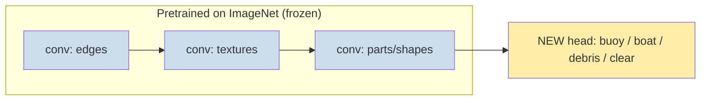

# 17 — Transfer Learning, LLMs & Putting Models in Production

> Part 5 · Lesson 17 · Code stack: pytorch (+ concepts)

**Prerequisites:** [16 — Generative Models](16-generative-models.md) · and you'll lean on [13 — Convolutional Neural Networks](13-cnns.md) (we fine-tune a CNN here) and [15 — Attention & Transformers](15-attention-transformers.md) (LLMs are Transformers at scale).

**By the end you can:**
- Explain **transfer learning** and why "fine-tune a pretrained model" is the *default* move in real projects, not training from scratch.
- Use **embeddings** as reusable, off-the-shelf feature representations.
- Give a grounded account of **LLMs**: tokens, pretraining vs. fine-tuning vs. instruction-tuning/RLHF, and where the Transformer from lesson 15 sits.
- Fine-tune a pretrained **torchvision ResNet** on a small custom dataset in PyTorch, choosing what to freeze.
- Name the **MLOps** realities that sink real deployments — leakage, train/serve skew, drift, reproducibility — and how to guard against each.

---

## 1. Intuition

Every lesson so far trained a model **from scratch**: random weights, then gradient descent on *your* data. That's how you *learn the mechanics*. It is almost never how you ship.

Here's the problem. A ResNet-50 has ~25 million parameters. To learn good visual features from nothing, it wants on the order of a million labeled images (ImageNet). You have 300 photos from your USV's bow camera. Train from scratch on 300 images and you'll overfit catastrophically — the net memorizes your 300 pictures and falls apart on the 301st.

**Transfer learning** is the escape. Someone already spent a GPU-month training a network on a million images. The *early* layers of that network learned generic vision primitives — edges, corners, textures, gradients, blobs — that are useful for *any* image task, buoy or banana. Only the *last* layer is ImageNet-specific ("this is a golden retriever"). So you **keep the learned feature extractor and replace only the head**, then nudge it with your tiny dataset.

**Analogy — hiring an experienced sailor vs. a newborn.** Training from scratch is raising a baby from birth to crew your boat: decades, enormous data. Transfer learning is hiring someone who already sailed for 20 years and giving them a one-week briefing on *your* specific vessel. They already know wind, rope, and balance (the generic features); you only teach them where *your* winch is (the new head). Far less data, far less time, far better result.



The same idea powers everything modern. A **Large Language Model (LLM)** is a Transformer (lesson 15) pretrained on a huge slice of the internet to predict the next token. That pretraining teaches it grammar, facts, and reasoning patterns. To make it *useful* you don't retrain — you **fine-tune** or just **prompt** it. Pretrain once, adapt forever: that's the whole modern playbook, in vision and in language.

The flip side of this lesson: a model that trains beautifully in your notebook can still fail in production. The second half is about that reality — **MLOps** — because in your domain a wrong prediction steers a real boat.

---

## 2. The Math

### Transfer learning = reuse the feature map, relearn the head

Think of a deep net as a composition: a **feature extractor** $\phi_\theta$ followed by a **head** $h_\psi$.

$$
\hat{y} = h_\psi\big(\phi_\theta(\mathbf{x})\big)
$$

- $\mathbf{x}$ — input (an image, a token sequence).
- $\phi_\theta$ — all-but-last layers, parameters $\theta$, maps the raw input to a **feature vector** (the **embedding**).
- $h_\psi$ — the final classifier/regressor, parameters $\psi$.

Pretraining gives you good $\theta^\star$. Transfer learning has two flavors:

**1. Feature extraction (freeze the backbone).** Set $\theta = \theta^\star$ and *don't* update it. Only train the new head:

$$
\min_{\psi}\ \frac{1}{N}\sum_{i=1}^N \mathcal{L}\big(h_\psi(\phi_{\theta^\star}(\mathbf{x}_i)),\, y_i\big)
$$

You're really running logistic regression (lesson 04) on fixed deep features. Cheap, fast, needs the least data. Why does freezing help? With $\theta$ fixed you've cut the number of trainable parameters from ~25M to a few thousand, so the **effective capacity** is tiny and overfitting on 300 images is hard. This is the bias–variance trade (lesson 05) used on purpose.

**2. Fine-tuning (unfreeze some/all of $\theta$).** Train both, but start from $\theta^\star$ and use a **small learning rate** so you nudge rather than obliterate the pretrained features:

$$
\theta \leftarrow \theta - \eta\,\nabla_\theta \mathcal{L},\qquad \eta \approx 10^{-4}\text{–}10^{-5}\ \text{(small!)}
$$

The intuition for "small $\eta$": $\theta^\star$ sits in a good basin of the loss landscape (lesson 12). A big step kicks you out of it and destroys the very features you came for — **catastrophic forgetting**. A small step lets you slide to a nearby, dataset-adapted minimum.

**Rule of thumb (memorize this table):**

| Your data | Similar to pretrain data? | Do this |
|---|---|---|
| Small (10²–10³) | Yes | Freeze backbone, train head |
| Small | No | Freeze early layers, fine-tune later ones |
| Large (10⁵+) | Yes | Fine-tune the whole thing |
| Large | No | Fine-tune all, maybe train from scratch |

Why? Early layers (edges, textures) are universal — keep them. Late layers are task-specific — those are the ones to adapt. The less data you have, the more you must freeze, because each *frozen* parameter is one you don't have to estimate from your scarce labels.

### Embeddings — learned coordinates that carry meaning

An **embedding** is just $\mathbf{z} = \phi_\theta(\mathbf{x})$: the feature vector a pretrained net produces, a point in $\mathbb{R}^d$ where *geometry encodes semantics*. Similar inputs land near each other; the network learned to arrange them that way to do its job.

Concretely, for two inputs you measure semantic similarity with **cosine similarity** of their embeddings:

$$
\text{sim}(\mathbf{z}_a, \mathbf{z}_b) = \frac{\mathbf{z}_a \cdot \mathbf{z}_b}{\lVert \mathbf{z}_a\rVert\,\lVert \mathbf{z}_b\rVert} \in [-1, 1]
$$

This is why embeddings are reusable currency: precompute $\mathbf{z}$ once, then do retrieval, clustering (lesson 08), or a cheap linear classifier on top — no gradient descent through the giant backbone each time. Word/token embeddings in language are the same idea: a token ID maps to a learned vector, and "king − man + woman ≈ queen" works because training *placed* those vectors with that structure.

### Where the Transformer fits — LLM training in one equation

An LLM is the lesson-15 Transformer trained on one objective: **next-token prediction**. Text is chopped into **tokens** (sub-word chunks; "sonar" might be `son` + `ar`), each an integer ID. Given tokens $t_1,\dots,t_{k-1}$, the model outputs a probability distribution over the next token and is trained to maximize the likelihood of the *actual* next token:

$$
\mathcal{L}_{\text{LM}} = -\sum_{k} \log p_\theta\big(t_k \mid t_1, \dots, t_{k-1}\big)
$$

That's it — the same **cross-entropy** from lesson 04, just over a vocabulary of ~50k–250k tokens, predicted by a stack of self-attention blocks. The three-stage modern recipe:

1. **Pretraining** — minimize $\mathcal{L}_{\text{LM}}$ on trillions of tokens of raw text. Result: a model that completes text and has absorbed broad knowledge, but only "autocompletes," it doesn't follow instructions.
2. **Instruction / supervised fine-tuning (SFT)** — continue training on curated (prompt → good answer) pairs so it learns to *answer* rather than ramble.
3. **RLHF / preference tuning** — humans rank candidate answers; a reward model is fit to those rankings; the LLM is optimized (e.g. PPO or DPO) to produce high-reward, helpful, harmless answers. This is what turns a raw text-predictor into an assistant.

Stages 1→2→3 are exactly transfer learning at language scale: pretrain the general $\theta$ once, then cheaply adapt. **Prompting** is the zero-training version — you give context and examples *in the input* and the frozen model adapts its behavior on the fly (in-context learning), no weight updates at all.

---

## 3. Code

We'll fine-tune a pretrained **ResNet-18** from `torchvision` on a small image-classification task. The pattern is identical whether your classes are {cat, dog} or {buoy, boat, debris, clear-water}. We use a tiny synthetic dataset so this runs anywhere, then point out exactly where you'd plug in real images.

```python
import torch
import torch.nn as nn
import torch.optim as optim
from torch.utils.data import DataLoader, TensorDataset
import torchvision.models as models

# --- Reproducibility: ALWAYS seed. (More on why in section 5.) ---
torch.manual_seed(0)

device = "cuda" if torch.cuda.is_available() else "cpu"

# --- 1. Load a model pretrained on ImageNet -------------------------------
# weights=... downloads the learned theta*. This IS the transfer.
weights = models.ResNet18_Weights.IMAGENET1K_V1
model = models.resnet18(weights=weights)

# The ImageNet head predicts 1000 classes. We have 4 (buoy/boat/debris/clear).
NUM_CLASSES = 4

# --- 2. FREEZE the backbone -----------------------------------------------
# Stop gradients for every existing parameter -> they won't update.
for param in model.parameters():
    param.requires_grad = False

# --- 3. REPLACE the head with a fresh, trainable layer --------------------
# resnet18's final layer is `model.fc`, a Linear(in_features -> 1000).
# A brand-new Linear has requires_grad=True by default, so ONLY it trains.
in_features = model.fc.in_features          # 512 for resnet18
model.fc = nn.Linear(in_features, NUM_CLASSES)
model = model.to(device)

# Sanity check: how many params are we actually training?
trainable = sum(p.numel() for p in model.parameters() if p.requires_grad)
total = sum(p.numel() for p in model.parameters())
print(f"Trainable: {trainable:,} / {total:,}")
# -> Trainable: 2,052 / 11,178,564   (we train 0.018% of the network!)
```

That print line is the whole point of freezing: **2,052** trainable parameters out of 11M. You *can* fit 2,052 numbers from a few hundred images without overfitting.

Now the training loop — standard PyTorch (lesson 11/12), but the optimizer only sees the head's parameters.

```python
# --- 4. Fake "dataset": 200 train + 60 val images, shape (3,224,224) ------
# Real version: use torchvision.datasets.ImageFolder + transforms below.
def make_fake_split(n):
    X = torch.randn(n, 3, 224, 224)            # pretend these are photos
    y = torch.randint(0, NUM_CLASSES, (n,))    # pretend these are labels
    return TensorDataset(X, y)

train_loader = DataLoader(make_fake_split(200), batch_size=32, shuffle=True)
val_loader   = DataLoader(make_fake_split(60),  batch_size=32)

# --- 5. Optimizer sees ONLY parameters with requires_grad=True ------------
# This filter is the line beginners forget; without it you'd try to update
# frozen tensors (no-op) and silently waste compute.
params_to_train = [p for p in model.parameters() if p.requires_grad]
optimizer = optim.Adam(params_to_train, lr=1e-3)   # head can take a big-ish lr
criterion = nn.CrossEntropyLoss()                  # multi-class, from lesson 04

def run_epoch(loader, train: bool):
    model.train() if train else model.eval()
    total_loss, correct, n = 0.0, 0, 0
    with torch.set_grad_enabled(train):
        for X, y in loader:
            X, y = X.to(device), y.to(device)
            logits = model(X)                  # forward through frozen body + new head
            loss = criterion(logits, y)
            if train:
                optimizer.zero_grad()
                loss.backward()                # grads flow ONLY into model.fc
                optimizer.step()
            total_loss += loss.item() * X.size(0)
            correct += (logits.argmax(1) == y).sum().item()
            n += X.size(0)
    return total_loss / n, correct / n

for epoch in range(3):
    tr_loss, tr_acc = run_epoch(train_loader, train=True)
    va_loss, va_acc = run_epoch(val_loader,   train=False)
    print(f"epoch {epoch}: train_loss={tr_loss:.3f} val_acc={va_acc:.3f}")
# -> epoch 0: train_loss=1.51 val_acc=0.23   (random data -> ~chance, expected)
# -> on REAL labeled images you'd see val_acc climb to 0.85+ within a few epochs
```

> On random noise the accuracy stays near chance (1/4) — there's nothing to learn. The output above is just to show the loop *runs*. On real images with real structure, freezing + a fresh head typically reaches strong validation accuracy in single-digit epochs.

### Stage 2: unfreeze and fine-tune with a small LR

Once the head is trained, you often squeeze out more accuracy by unfreezing the last block and continuing with a **much smaller** learning rate:

```python
# Unfreeze the last residual block (layer4) AND keep the head trainable.
for param in model.layer4.parameters():
    param.requires_grad = True

# Rebuild the optimizer: now it includes layer4 + fc, with a TINY lr.
optimizer = optim.Adam(
    [p for p in model.parameters() if p.requires_grad],
    lr=1e-5,                       # 100x smaller -> nudge, don't obliterate
)
# ...then run a few more epochs of run_epoch(train_loader, train=True).
# Small lr here is what prevents catastrophic forgetting of ImageNet features.
```

### The real-data piece: ImageFolder + the *correct* preprocessing

The single most common transfer-learning bug is feeding images preprocessed differently than during pretraining. The pretrained weights expect a specific resize + normalization. Use the transforms that *ship with the weights*:

```python
import torchvision.datasets as datasets

# The weights object knows EXACTLY how its images were preprocessed.
preprocess = weights.transforms()   # resize->centercrop->ToTensor->Normalize(ImageNet mean/std)

# Directory layout:  data/train/buoy/*.jpg, data/train/boat/*.jpg, ...
# ImageFolder reads the subfolder names as class labels automatically.
# train_ds = datasets.ImageFolder("data/train", transform=preprocess)
# val_ds   = datasets.ImageFolder("data/val",   transform=preprocess)
```

### Visualize embeddings (the reusable representation)

To *see* that the frozen backbone produces meaningful features, embed a batch and project to 2-D with PCA (lesson 08). Color by class.

```python
import matplotlib.pyplot as plt
from sklearn.decomposition import PCA

# Extract embeddings = the network WITHOUT its final head.
backbone = nn.Sequential(*list(model.children())[:-1]).eval().to(device)

X, y = next(iter(val_loader))
with torch.no_grad():
    z = backbone(X.to(device)).flatten(1).cpu().numpy()   # (batch, 512) embeddings

proj = PCA(n_components=2).fit_transform(z)
plt.scatter(proj[:, 0], proj[:, 1], c=y, cmap="tab10")
plt.title("ResNet-18 embeddings (PCA to 2-D)")
plt.xlabel("PC1"); plt.ylabel("PC2"); plt.colorbar(label="class")
plt.show()
```

**What you should SEE:** on *real* labeled data, points of the same class cluster together — proof the frozen backbone already maps your domain into a separable space, which is exactly why a tiny linear head suffices. (On the random fake data they'll be an uninformative blob — another reminder the demo data has no structure.)

---

## 4. Real Case — fine-tuning a vision model for a USV obstacle camera

You're building forward-obstacle awareness for an unmanned surface vehicle. The bow camera streams frames; you want to classify each crop as **{buoy, boat, debris, clear-water}** to feed your path planner. You went out for three afternoons and hand-labeled **~400 images**. Training a CNN from scratch on 400 images is hopeless. Transfer learning is the *only* sane move — and it's the single most practical deep-learning technique for your domain.

**The mapping:**

| Concept | Your USV project |
|---|---|
| Pretrained $\phi_{\theta^\star}$ | ResNet-18 ImageNet weights — edges, textures, "round shiny thing" detectors already exist |
| New head $h_\psi$ | `Linear(512 → 4)` for your 4 classes |
| Freeze backbone | Train just the head on your 400 images (Stage 1) |
| Fine-tune `layer4` | Squeeze accuracy once the head is stable (Stage 2) |
| Embedding $\mathbf{z}$ | The 512-vector — also reusable for *retrieval*: "find frames similar to this near-miss" |
| Data augmentation | `RandomHorizontalFlip`, brightness/contrast jitter — simulate glare, time of day, wakes; effectively multiplies 400 images |

**Worked sketch.** Split 400 → 280 train / 60 val / 60 test, **stratified by class** so each split has all four. Stage 1: freeze, train head 10 epochs → say val acc 0.82. Stage 2: unfreeze `layer4`, lr `1e-5`, 5 epochs → val acc 0.89. Lock the test set away until the very end; report test acc once. Heavy augmentation matters here because water scenes are dominated by lighting and reflections that change hour to hour — without it your model overfits to "the lighting of the three afternoons you went out."

**Why this is *the* technique for you:** robotics datasets are always small and expensive (every label is a person watching footage). A USV/UAV/ROV team will almost never have ImageNet-scale data of *their* environment. Pretrained backbones + a small head is how you get a working perception model this week instead of next year. The same recipe transfers to a UAV crop-survey classifier or an ROV coral-vs-rock head — swap the `ImageFolder` and the number of output classes.

A classic-dataset analog if you want to practice the *exact* code first: fine-tune the same ResNet on **CIFAR-10** or the Oxford **Flowers-102** dataset (both in `torchvision.datasets`), which are tiny enough to iterate fast and verify your pipeline before pointing it at hard-won marine footage.

---

## 5. Pitfalls & Tips

- **Data leakage is the #1 silent killer.** If information from validation/test sneaks into training, your reported accuracy is a lie. Classic traps: fitting the scaler/normalizer on the *whole* dataset before splitting; **augmenting then splitting** (the same image lands in train and val); near-duplicate frames from one video clip spread across splits (split **by clip/scene**, not by frame). Leakage looks like spectacular val accuracy that collapses in the real world.
- **Wrong preprocessing at inference = train/serve skew.** The model was trained on ImageNet-normalized 224×224 crops. If your robot's inference code resizes differently, skips normalization, or feeds BGR instead of RGB, accuracy quietly tanks. Use `weights.transforms()` in **both** training and the deployed pipeline. Pin it; test it.
- **Reproducibility: seed everything and log it.** Set `torch.manual_seed`, `numpy.random.seed`, Python's `random.seed`; for strict determinism also `torch.use_deterministic_algorithms(True)`. Track every run — code commit, config, seed, metrics — with a tool like **MLflow** or **Weights & Biases**. "It worked last Tuesday" is not a deliverable; a logged, reproducible run is.
- **Monitor drift after deployment.** Your training photos were summer daylight; in November the model sees fog and low sun and degrades — that's **data/concept drift**. The model won't tell you it's wrong. Log input statistics and prediction confidence in production, alert when they shift, and keep a feedback loop to collect new labeled hard cases and re-fine-tune.
- **Pick the deployment path on purpose.** Options: a Python service (FastAPI/TorchServe) the robot calls; **on-device** inference exported via **TorchScript / ONNX** (run with ONNX Runtime, or TensorRT on Jetson) for low latency and no network dependency — usually what you want on a USV/UAV with intermittent links. Always `model.eval()` (disables dropout/BatchNorm updates) and run under `torch.no_grad()` at inference.
- **Ethics, bias, and safety are part of engineering, not an afterthought.** A perception model trained only on calm-water daylight will be confidently wrong in conditions it never saw — dangerous when it steers a vehicle near people. Quantify uncertainty, set conservative thresholds, keep a human/fallback in the loop for low-confidence calls, and audit failure modes across the conditions you'll actually operate in. "High accuracy on the test set" is not "safe to deploy."

---

## 6. Check Your Understanding

**Q1.** You have 250 labeled sonar-image tiles and a model pretrained on natural photographs. Should you freeze the whole backbone, fine-tune everything, or something in between? Justify with the rule-of-thumb table.

<details><summary>Answer</summary>
Small data, and the domain (sonar) is *dissimilar* to natural photos. Per the table: freeze the **early** layers (generic edges/textures still help) but **fine-tune the later** layers so the task-specific features adapt to sonar's texture statistics. Pure freeze risks underfitting because late ImageNet features are tuned for photos, not sonar; full fine-tune risks overfitting 250 images. The middle path balances bias and variance.
</details>

**Q2.** Why must the fine-tuning learning rate be much smaller (e.g. `1e-5`) than the learning rate you'd use training from scratch?

<details><summary>Answer</summary>
The pretrained weights $\theta^\star$ already sit in a good loss basin encoding useful features. A large step would move you far out of that basin and **destroy** those features (catastrophic forgetting), wasting the whole point of transfer. A tiny step nudges the weights to a nearby, dataset-adapted minimum while preserving the learned structure.
</details>

**Q3.** A teammate normalizes the entire image set using the global mean/std, *then* splits into train/val. What's wrong, and what does it do to the reported metrics?

<details><summary>Answer</summary>
That's **data leakage**: the val set's statistics influenced the normalization applied to training, so information from val bled into the pipeline. (Worse here, you should be using the *pretrained weights'* normalization anyway, not your own global stats.) Effect: validation metrics are optimistically biased — they look better than the model will perform on truly unseen data. Fix: split first, then apply preprocessing fit only on training data (or, for transfer learning, just use `weights.transforms()`).
</details>

**Q4.** Explain in one or two sentences how training an LLM is "transfer learning," mapping the three LLM stages onto the freeze/fine-tune ideas from this lesson.

<details><summary>Answer</summary>
**Pretraining** learns the general parameters $\theta$ once via next-token cross-entropy on massive text — the expensive, reusable feature-learning step (like ImageNet pretraining of $\phi_\theta$). **Instruction/SFT** and **RLHF** are cheap adaptations of that pretrained model to a target behavior (answering helpfully) — analogous to replacing/fine-tuning the head on your small task. **Prompting** is the zero-update extreme: adapt behavior purely through the input, no weight changes at all.
</details>

**Q5.** Your USV obstacle classifier hits 94% test accuracy, ships, and three months later starts missing buoys at dusk. Nothing in the code changed. What happened and what should the system have had in place?

<details><summary>Answer</summary>
**Concept/data drift**: the operating distribution shifted (dusk lighting, glare, fog) away from the daytime data the model was trained on, so accuracy silently degraded — high test accuracy never guaranteed coverage of unseen conditions. The system should have had **production monitoring** (track input statistics and prediction confidence, alert on distribution shift), a **feedback loop** to capture and re-label hard cases, periodic **re-fine-tuning**, and conservative confidence thresholds with a fallback for low-confidence frames — because a wrong prediction here steers a real boat.
</details>

---

## Recap & Next

- **Transfer learning is the default**, not the exception: reuse a pretrained feature extractor $\phi_{\theta^\star}$ and replace/retrain only the head. With small data, **freeze** the backbone; with more data or a distant domain, **fine-tune** later layers with a *small* learning rate to avoid catastrophic forgetting.
- **Embeddings** are the reusable currency — $\mathbf{z} = \phi_\theta(\mathbf{x})$, points in a space where geometry (cosine similarity) encodes meaning. Precompute once, then classify, cluster, or retrieve cheaply.
- **LLMs are lesson-15 Transformers** trained on next-token cross-entropy, then adapted via SFT and RLHF; **prompting** adapts behavior with zero weight updates. Same pretrain-once-adapt-forever playbook as vision.
- **MLOps is where models live or die:** guard against **leakage** (split before you preprocess, split by scene not frame), **train/serve skew** (identical preprocessing everywhere — use `weights.transforms()`), and **drift** (monitor inputs and confidence in production). Seed and log everything for reproducibility.
- **Ethics and safety are engineering requirements.** Quantify uncertainty, set conservative thresholds, keep a fallback in the loop — a confident wrong prediction steers a real vehicle.

That's the core arc of supervised and self-supervised learning: from a single neuron to fine-tuning giants and shipping them safely. But the course keeps going — into the **decision-making, perception, and practical craft** that production ML on a real vehicle actually demands.

➡️ **Next:** [18 — Reinforcement Learning](18-reinforcement-learning.md) — let the agent *learn control policies by trial and error*, the natural bridge to path-following and station-keeping.

Then continue through Part 7 and 8: [19 — Object Detection & Segmentation](19-detection-segmentation.md) (not just "is there a buoy" but *where, exactly*, which your planner needs), [20 — Data & Feature Engineering](20-data-feature-engineering.md) (the unglamorous 80% of real ML), and [21 — Hyperparameter Optimization](21-hyperparameter-optimization.md) (tune systematically without fooling yourself). And eventually, *deployment on robots* — TorchScript/ONNX → TensorRT on Jetson, ROS2 inference nodes, latency budgets. Or jump anywhere from the **[Course Index](README.md)**.
