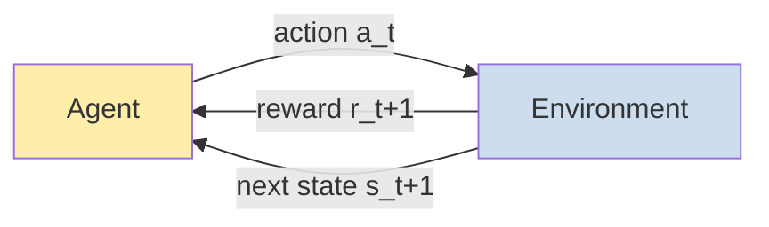

# 18 — Reinforcement Learning

> Part 6 · Lesson 18 · Code stack: numpy-from-scratch (tabular) + a brief PyTorch/Gym note

**Prerequisites:** [03 — Gradient Descent](03-gradient-descent.md) (RL updates are still "nudge toward a target") · and you'll lean on [12 — Training Deep Networks That Actually Converge](12-training-deep-nets.md) for the deep-RL note (DQN is just a net trained with a moving target).

**By the end you can:**
- Frame a control problem as a **Markov Decision Process** — states, actions, reward, transitions, discount $\gamma$ — and state the goal as maximizing expected discounted return.
- Define **policies**, **value functions** $V(s)$ and **action-values** $Q(s,a)$, and write the **Bellman equation** as a recursive consistency condition.
- Explain the **exploration–exploitation** tradeoff and implement **$\epsilon$-greedy**.
- Implement **tabular Q-learning** from scratch in numpy, train it on a USV gridworld, and read off the learned greedy policy.
- Give an honest, intuition-level account of **DQN** (replay buffer + target network) and **REINFORCE** (policy gradients), and the **sim-to-real** gap.

---

## 1. Intuition

Every model so far learned from a **fixed dataset** of correct answers: here are images, here are labels, minimize the error. **Reinforcement learning (RL)** throws that away. There is no answer key. There is an **agent** that takes **actions** in an **environment**, the environment hands back a **reward** (a single scalar — good/bad) and a new situation, and the agent must figure out, *by trial and error*, which actions lead to the most reward over time.

This is exactly the shape of vehicle control. Your USV is at some heading and position; it can move the rudder and throttle; the world responds with a new pose; "reward" is *staying on the path*. No one hands you the labeled action "the optimal rudder angle at this instant" — you have to discover it from the consequences.

Two things make RL genuinely harder than supervised learning:

- **Delayed reward / credit assignment.** A bad rudder command now might only put you off-path five seconds later. Which of the last 50 actions deserves the blame? RL has to propagate credit backward through time.
- **Your data depends on your behavior.** A classifier sees a frozen dataset. An agent that always turns left never *sees* what's to the right. You must deliberately **explore** to discover good actions, while also **exploiting** what you already know works. That tension has no analog in supervised learning.

**Analogy — learning to dock a boat with no instructor.** Nobody tells you the correct throttle. You try a maneuver, you either kiss the dock gently (reward) or scrape the hull (penalty), and over many attempts you build an internal sense of "from *this* approach angle and speed, *that* throttle tends to end well." RL formalizes that loop: act, observe reward and next state, update your estimate of how good things are, repeat.



The whole field is built on that one loop. Everything below is how to make the loop *converge* to good behavior.

---

## 2. The Math

### 2.1 The Markov Decision Process (MDP)

An MDP is the formal container for "agent acting in a world." It is the tuple $(\mathcal{S}, \mathcal{A}, P, R, \gamma)$:

- $\mathcal{S}$ — set of **states** $s$. The situation the agent is in (USV pose, errors).
- $\mathcal{A}$ — set of **actions** $a$. What the agent can do (rudder left/right, thrust).
- $P(s' \mid s, a)$ — **transition dynamics**: probability of landing in next state $s'$ after taking $a$ in $s$. This is the *world's* response, often unknown to the agent.
- $R(s, a)$ — **reward**: the scalar feedback for that step (we'll write the reward received as $r$).
- $\gamma \in [0,1)$ — **discount factor**.

The defining assumption is the **Markov property**: the next state depends *only* on the current state and action, not the whole history. $s$ must summarize everything relevant — which is why state design matters so much in robotics.

### 2.2 Return, discounting, and the goal

The agent doesn't maximize the *next* reward; it maximizes the **return** — total reward from now on. Because reward arriving later is worth less (uncertainty, and "a dock now beats a dock in an hour"), we **discount** it geometrically:

$$
G_t = r_{t+1} + \gamma\, r_{t+2} + \gamma^2 r_{t+3} + \cdots = \sum_{k=0}^{\infty} \gamma^k\, r_{t+k+1}
$$

- $G_t$ — the **discounted return** from time $t$.
- $\gamma$ near $0$ → myopic (only the next reward matters); $\gamma$ near $1$ → far-sighted. $\gamma=0.99$ is typical. *Where the geometric form comes from:* it's the only weighting that keeps an infinite sum finite for bounded rewards and makes the problem **recursive** — $G_t = r_{t+1} + \gamma G_{t+1}$ — which is the seed of everything in 2.4.

The **goal**: find behavior that maximizes the *expected* return $\mathbb{E}[G_t]$ (expectation because both the policy and the world can be random).

### 2.3 Policies and value functions

A **policy** $\pi$ is the agent's behavior — its strategy for picking actions.

- **Deterministic**: $a = \pi(s)$. One action per state. (Final control law.)
- **Stochastic**: $\pi(a \mid s)$ = probability of action $a$ in state $s$. Needed for exploration and for policy-gradient methods.

To compare policies we need to score states and actions under a policy. Two **value functions**:

$$
V^\pi(s) = \mathbb{E}_\pi\big[\, G_t \mid s_t = s \,\big]
\qquad\qquad
Q^\pi(s,a) = \mathbb{E}_\pi\big[\, G_t \mid s_t = s,\ a_t = a \,\big]
$$

- $V^\pi(s)$ — **state-value**: expected return if you start in $s$ and follow $\pi$ forever. "How good is it to be here?"
- $Q^\pi(s,a)$ — **action-value** (the **Q-function**): expected return if you start in $s$, take action $a$ *now*, then follow $\pi$. "How good is this action from here?"

$Q$ is the more useful one for control: if you know $Q$, you act by just picking the action with the largest $Q$ — no model of the world needed. That's the entire idea behind Q-learning.

### 2.4 The Bellman equation — recursion is everything

Plug $G_t = r_{t+1} + \gamma G_{t+1}$ into the definition of $Q^\pi$ and you get the **Bellman equation**, a *consistency condition* linking a value to the values one step later:

$$
Q^\pi(s,a) = \mathbb{E}\big[\, r + \gamma\, Q^\pi(s', a') \,\big]
\quad\text{with } a' \sim \pi(\cdot \mid s')
$$

The value of "here-and-now" equals "reward I get + discounted value of where I land." It's just $G_t = r_{t+1} + \gamma G_{t+1}$ under expectation — the recursion of return turned into a fixed-point equation for $Q$.

The point of RL is the **optimal** policy $\pi^\star$ and its **optimal action-value** $Q^\star(s,a) = \max_\pi Q^\pi(s,a)$. The optimal one satisfies the **Bellman optimality equation** — and the key difference is that an optimal agent assumes it will act *greedily* in the next state, so the expectation over $a'$ becomes a $\max$:

$$
Q^\star(s,a) = \mathbb{E}\Big[\, r + \gamma \max_{a'} Q^\star(s', a') \,\Big]
$$

Once you have $Q^\star$, the optimal policy is trivially **greedy**: $\pi^\star(s) = \arg\max_a Q^\star(s,a)$. The whole game is *estimating* $Q^\star$.

### 2.5 Exploration vs. exploitation, and $\epsilon$-greedy

If the agent always takes the action it currently *thinks* is best (pure **exploitation**), it can lock onto a mediocre habit and never discover a better one — it never gathers the data that would correct it. If it always acts randomly (pure **exploration**), it learns about the world but never cashes in. You need both.

The simplest balance is **$\epsilon$-greedy**: with probability $\epsilon$ pick a random action, otherwise pick the greedy one.

$$
a =
\begin{cases}
\text{random action from } \mathcal{A} & \text{with prob. } \epsilon \\[2pt]
\arg\max_{a'} Q(s, a') & \text{with prob. } 1-\epsilon
\end{cases}
$$

Standard practice: **decay $\epsilon$** over training — explore a lot early (you know nothing), exploit more later (your $Q$ is trustworthy).

### 2.6 Q-learning: the temporal-difference update

We can't compute the Bellman expectation exactly — we don't know $P$. **Q-learning** estimates $Q^\star$ from raw experience tuples $(s, a, r, s_{\text{next}})$, using each transition as a noisy sample of the Bellman equation. After taking action $a$ in state $s$, observing reward $r$ and next state $s_{\text{next}}$:

$$
Q(s,a) \;\leftarrow\; Q(s,a) \;+\; \alpha\,\Big[\, r + \gamma \max_{a_{\text{next}}} Q(s_{\text{next}}, a_{\text{next}}) \;-\; Q(s,a) \,\Big]
$$

- $\alpha \in (0,1]$ — **learning rate** (step size; lesson 03).
- The bracket is the **temporal-difference (TD) error**: it's the gap between our current estimate $Q(s,a)$ and a fresher **target** $r + \gamma \max_{a_{\text{next}}} Q(s_{\text{next}}, a_{\text{next}})$ built from the actual reward plus our best guess of the future. *Where it comes from:* this is "move the estimate a fraction $\alpha$ toward the Bellman-optimality right-hand side" — gradient-descent-flavored bootstrapping toward the recursion of 2.4.

Two adjectives you'll hear:
- **Temporal-difference**: it learns from the *difference* between successive value estimates, updating every step — no need to wait for the episode to end.
- **Off-policy**: the target uses $\max_{a_{\text{next}}}$ (what the *optimal* agent would do) regardless of what the agent actually did next (which might have been a random $\epsilon$-greedy move). So it learns the optimal $Q^\star$ even while behaving exploratorily. That decoupling is what makes the replay buffer in DQN legal.

---

## 3. Code

We'll build a tiny **gridworld**: a USV on a grid must reach the **dock** while avoiding **hazard** cells (rocks/shallows). Then we train tabular Q-learning from scratch in numpy, watch reward-per-episode climb, and render the learned greedy policy as arrows. Pure numpy — no framework.

### 3.1 The environment

```python
import numpy as np
import matplotlib.pyplot as plt

rng = np.random.default_rng(0)

# --- USV gridworld ----------------------------------------------------------
# A 5x5 grid. The USV starts top-left, must reach the dock (bottom-right),
# avoiding hazard cells. State = flattened cell index 0..24. 4 actions.
GRID = 5
N_STATES = GRID * GRID
ACTIONS = ['up', 'down', 'left', 'right']      # 0,1,2,3
N_ACTIONS = len(ACTIONS)

START = (0, 0)
DOCK = (4, 4)                                  # goal
HAZARDS = {(1, 1), (2, 3), (3, 1)}             # rocks/shallows

def to_state(rc):                              # (row, col) -> flat index
    return rc[0] * GRID + rc[1]

def step(rc, a):
    """Apply action a in cell rc. Returns (next_rc, reward, done)."""
    r, c = rc
    if a == 0:   r -= 1     # up
    elif a == 1: r += 1     # down
    elif a == 2: c -= 1     # left
    elif a == 3: c += 1     # right
    # Walls: bumping the boundary leaves you in place (no teleporting off-grid).
    r = min(max(r, 0), GRID - 1)
    c = min(max(c, 0), GRID - 1)
    nxt = (r, c)

    # Reward design: this is the most important line in the whole file.
    if nxt == DOCK:
        return nxt, 10.0, True                 # big payoff for docking
    if nxt in HAZARDS:
        return nxt, -10.0, True                # episode ends badly
    return nxt, -0.1, False                    # small step cost -> prefer SHORT paths
```

The `-0.1` per step is **reward shaping**: without it the agent is indifferent to path length (every non-terminal step is 0) and wanders. The small negative makes "fewer steps" strictly better, so the optimal policy is the *shortest safe path* to the dock.

### 3.2 Tabular Q-learning from scratch

```python
# Q-table: rows = states, cols = actions. Start optimistic-ish at zero.
Q = np.zeros((N_STATES, N_ACTIONS))

alpha = 0.5        # learning rate
gamma = 0.95       # discount: care about the future, finite return
epsilon = 1.0      # start fully exploratory...
eps_min, eps_decay = 0.05, 0.995  # ...decay toward mostly-greedy
n_episodes = 600
max_steps = 100    # safety cap so a bad policy can't loop forever

def choose_action(s, eps):
    """epsilon-greedy action selection (section 2.5)."""
    if rng.random() < eps:
        return rng.integers(N_ACTIONS)         # explore: random action
    return int(np.argmax(Q[s]))                # exploit: best known action

rewards_per_episode = []

for ep in range(n_episodes):
    rc = START
    s = to_state(rc)
    total_r = 0.0

    for t in range(max_steps):
        a = choose_action(s, epsilon)
        nxt_rc, r, done = step(rc, a)
        s_next = to_state(nxt_rc)

        # --- THE Q-LEARNING UPDATE (section 2.6) ---------------------------
        # target = r + gamma * max-over-next-actions of Q(s_next, .)
        # On a terminal transition there is no future, so drop the bootstrap.
        best_next = 0.0 if done else np.max(Q[s_next])
        td_target = r + gamma * best_next
        td_error = td_target - Q[s, a]
        Q[s, a] += alpha * td_error            # nudge estimate toward target
        # -------------------------------------------------------------------

        s, rc = s_next, nxt_rc
        total_r += r
        if done:
            break

    epsilon = max(eps_min, epsilon * eps_decay)  # anneal exploration
    rewards_per_episode.append(total_r)

print(f"last-50 mean reward: {np.mean(rewards_per_episode[-50:]):.2f}")
# -> last-50 mean reward: 7.68  (positive: mostly docking; the residual gap is the
#    leftover 5% epsilon still firing occasional random moves into hazards)
```

Early episodes are full of random flailing into hazards (return around $-10$). As $\epsilon$ decays and $Q$ sharpens, the agent reliably docks and the return climbs to a clearly positive plateau — close to the $+10$ dock reward minus a handful of $-0.1$ step costs along the shortest safe route, dragged down only by the residual $\epsilon=0.05$ exploration occasionally walking into a hazard.

### 3.3 Watch it learn, and read off the policy

```python
# --- Plot 1: reward per episode (smoothed) ----------------------------------
fig, (ax1, ax2) = plt.subplots(1, 2, figsize=(12, 4.5))

rew = np.array(rewards_per_episode)
window = 20
smooth = np.convolve(rew, np.ones(window) / window, mode='valid')
ax1.plot(rew, alpha=0.25, label='raw')
ax1.plot(np.arange(window - 1, len(rew)), smooth, lw=2, label=f'{window}-ep avg')
ax1.set_xlabel('episode'); ax1.set_ylabel('total reward')
ax1.set_title('Learning curve'); ax1.legend()

# --- Plot 2: the learned greedy policy as an arrow grid ---------------------
ARROW = {0: '↑', 1: '↓', 2: '←', 3: '→'}
ax2.set_xlim(-0.5, GRID - 0.5); ax2.set_ylim(-0.5, GRID - 0.5)
ax2.set_xticks(range(GRID)); ax2.set_yticks(range(GRID))
ax2.invert_yaxis(); ax2.grid(True)
ax2.set_title('Greedy policy  argmax_a Q(s,a)')

for r in range(GRID):
    for c in range(GRID):
        if (r, c) == DOCK:
            ax2.text(c, r, 'DOCK', ha='center', va='center', color='green', fontweight='bold')
        elif (r, c) in HAZARDS:
            ax2.text(c, r, 'XX', ha='center', va='center', color='red', fontweight='bold')
        else:
            best_a = int(np.argmax(Q[to_state((r, c))]))
            ax2.text(c, r, ARROW[best_a], ha='center', va='center', fontsize=20)

plt.tight_layout(); plt.show()
```

**What you should see:** the **left** plot rises from deeply negative (random crashes into hazards) and saturates near the per-episode payoff once the policy is solid — the canonical RL learning curve. The **right** plot shows arrows that *flow* from the start toward `DOCK`, routing **around** the `XX` hazard cells. That arrow field *is* the learned controller: in any cell, follow the arrow.

### 3.4 Optional: scaling up with Gymnasium + a PyTorch DQN

Tabular Q-learning needs a finite, smallish state set — one table row per state. A real USV's state (continuous cross-track error, heading, speed) has *infinitely many* states; no table fits. The fix (section 4 below): replace the table with a **neural network** $Q_\theta(s,a)$ that *generalizes* across nearby states. Sketch with **Gymnasium** (the standard RL environment API) and PyTorch — **optional, illustrative, not a full DQN**:

```python
# OPTIONAL — requires `pip install gymnasium`. Shown for shape, not as a finished agent.
import gymnasium as gym
import torch, torch.nn as nn

env = gym.make("CartPole-v1")          # 4-dim continuous state, 2 actions
obs, _ = env.reset(seed=0)

# Q-network: state vector -> one Q-value per action (replaces the Q-table).
qnet = nn.Sequential(
    nn.Linear(env.observation_space.shape[0], 128), nn.ReLU(),
    nn.Linear(128, env.action_space.n),            # outputs Q(s, .) for all actions
)

# Greedy action from the net (epsilon-greedy in a real loop, as in 3.2):
state = torch.tensor(obs, dtype=torch.float32)
action = int(qnet(state).argmax())     # argmax_a Q_theta(s, a)
obs, reward, terminated, truncated, _ = env.step(action)
env.close()
# Full DQN adds: a replay buffer of (s,a,r,s_next) tuples sampled in minibatches,
# a slowly-updated TARGET network for the max-term, and an MSE loss on the TD error
# trained by gradient descent (lesson 12). That's it — same update as 3.2, learned.
```

The training loop is *the same Q-learning update from 3.2*, but the table assignment becomes a **gradient-descent step** minimizing the squared TD error, with two stabilizers covered next.

---

## 4. Real Case

### USV path-following as an MDP

Forget the toy grid; here's the real framing your planner would use. A USV must follow a planned track (a line between waypoints). Cast it as an MDP:

| MDP element | USV path-following |
|---|---|
| **State** $s$ | $(e_{\text{cross}},\ e_{\psi},\ \dot{e}_{\text{cross}})$ — **cross-track error** (signed lateral distance off the path), **heading error** (angle between boat heading and path tangent), and their rate of change. Continuous → needs function approximation (DQN/policy gradient), not a table. |
| **Action** $a$ | rudder angle and thrust — discretized into bins for DQN (e.g. rudder $\{-15^\circ, 0^\circ, +15^\circ\}$), or continuous for policy-gradient/actor-critic methods. |
| **Reward** $r$ | $r = -\,(e_{\text{cross}}^2 + \lambda\, e_{\psi}^2) - \mu\,(\Delta\,\text{rudder})^2$ — penalize being off-path and off-heading, plus a small penalty on jerky control so the boat doesn't oscillate the rudder. |
| **Transitions** $P$ | the boat's hydrodynamics — unknown analytically, which is *exactly* why model-free RL (Q-learning / policy gradients) is attractive: it learns control without a hand-derived dynamics model. |
| **Discount** $\gamma$ | $\approx 0.99$ — a heading correction now pays off over the next several seconds, so we look ahead. |

This is **station-keeping** if the "path" collapses to a single setpoint (hold position against current/wind) and **path-following** if it's a track. The learned policy is your controller — a learned alternative or complement to a hand-tuned PID or model-predictive controller.

**Reward shaping is where projects live or die.** The quadratic penalty above is the workhorse (it mirrors an LQR cost). Watch for two failure modes: a **reward hacking** policy that finds a degenerate way to score (e.g. sitting still if "off-path" is the only penalty and there's no progress term — add a forward-progress reward), and **sparse reward** (only reward reaching the final waypoint), which makes credit assignment nearly impossible — shape it with dense per-step signals like the negative deviation above.

### The sim-to-real gap

RL is **data-hungry**: a DQN can need millions of transitions. You cannot crash a real USV (or UAV, or ROV) ten thousand times to gather them. So the universal recipe is **train in simulation first** — a physics sim of the vehicle (e.g. Gazebo/ROS2, or a custom hydrodynamic model) — then transfer the policy to hardware.

The catch is the **sim-to-real gap**: the sim is never exactly the real vehicle (unmodeled currents, sensor noise, actuator lag, payload changes), so a policy that's perfect in sim can fail at sea. Standard mitigations:
- **Domain randomization** — randomize mass, drag, current, sensor noise, latency *during* training so the policy learns to be robust to a *range* of dynamics rather than overfitting one sim.
- **System identification** — measure the real vehicle's response and tune the sim to match before training.
- **Conservative deployment** — keep a safety envelope and a fallback controller; an RL policy steering a real boat near people needs the same uncertainty-aware guardrails we stressed in lesson 17.

For an **ROV**, add buoyancy/tether drag to the sim; for a **UAV**, add wind gusts and battery sag. Same gap, different physics. A good classic anchor to *practice the algorithms* first: **CartPole-v1** and **LunarLander-v3** in Gymnasium — small enough to train in minutes, and LunarLander is literally a thrust-control task that rhymes with vehicle control.

---

## 5. Pitfalls & Tips

- **State design carries the Markov property.** Q-learning assumes the state summarizes everything relevant. If you feed cross-track error but omit its rate of change, the agent can't tell "drifting off fast" from "drifting off slow" — it's effectively non-Markov and learning stalls. Include velocities/derivatives, or stack recent frames.
- **Reward shaping is the real design surface.** Sparse rewards (only at the goal) make credit assignment brutal; shape with dense per-step signals. But beware **reward hacking** — agents exploit *exactly* what you wrote, not what you meant. If "stay on path" is the only term, the optimum may be "never move." Always add a progress/objective term and sanity-check the policy the reward actually induces.
- **Decay $\epsilon$; don't pin it.** Too little exploration early → the agent commits to a bad habit before it has seen alternatives. Too much exploration late → it keeps throwing away known-good behavior with random moves. Anneal high→low. Same goes for $\alpha$ in noisy problems.
- **Deep RL is unstable by default.** A naive neural Q-learner often diverges, because the target $r + \gamma \max Q_\theta(s_{\text{next}}, \cdot)$ *moves as you train* (you're chasing your own tail), and consecutive transitions are highly correlated. **DQN's two fixes:** a **replay buffer** (store transitions, sample random minibatches → breaks correlation, reuses data) and a **target network** (a periodically-frozen copy $Q_{\theta^-}$ used to compute the max-term → a stable target). Know these two names.
- **RL is data-hungry — budget for it and train in sim.** Millions of steps is normal. Don't expect to learn a control policy on hardware from scratch. Simulate, randomize the dynamics, then transfer and fine-tune carefully.
- **Value-based vs. policy-based — pick per problem.** Q-learning/DQN shine with **discrete** actions. For **continuous** control (a real rudder angle), reach for **policy gradients** (REINFORCE → actor-critic → PPO/SAC), which optimize a parameterized policy $\pi_\theta(a\mid s)$ directly. The REINFORCE idea in one line: nudge the policy to make actions that *led to high return* more likely — $\nabla_\theta J = \mathbb{E}\big[\,G_t\,\nabla_\theta \log \pi_\theta(a_t\mid s_t)\,\big]$ (the **score function** / log-policy times return). High return → push that log-probability up; this is gradient *ascent* on expected return.

---

## 6. Check Your Understanding

**Q1.** Why does Q-learning use $\max_{a_{\text{next}}} Q(s_{\text{next}}, a_{\text{next}})$ in its target even when the agent's *next* action was a random exploratory one? What property does this give Q-learning a name for?

<details><summary>Answer</summary>
The target is built from the Bellman *optimality* equation, which assumes optimal (greedy) behavior from the next state on — hence the $\max$ over next actions, *independent of what the agent actually did next*. This makes Q-learning **off-policy**: it learns the optimal action-value $Q^\star$ while behaving with an exploratory ($\epsilon$-greedy) policy. The decoupling between the behavior policy and the learned target policy is exactly what lets DQN replay old transitions later.
</details>

**Q2.** In the gridworld, what would change if you set the per-step reward to $0$ instead of $-0.1$ (keeping $+10$ dock, $-10$ hazard)? What if you set $\gamma = 0$?

<details><summary>Answer</summary>
With a $0$ step cost, the agent becomes **indifferent to path length** — any safe route that eventually docks is equally optimal, so it may learn long, wandering paths (and with discounting it still prefers shorter, but the pressure is weak). The $-0.1$ makes the *shortest* safe path strictly best. With $\gamma = 0$ the agent is fully **myopic**: it only values the immediate reward, so it cannot learn to navigate toward a dock that's many steps away — the $+10$ never propagates backward, and learning collapses.
</details>

**Q3.** Your USV's continuous state is `(cross_track_error, heading_error)` ∈ ℝ². Why can't you use the tabular Q-learning from section 3 directly, and what's the standard fix?

<details><summary>Answer</summary>
A Q-*table* needs one row per discrete state; a continuous state space has infinitely many states, so there's no finite table and (even if you discretize finely) you'd never visit each cell enough to learn it — **no generalization** across nearby states. The fix is **function approximation**: replace the table with a parameterized $Q_\theta(s,a)$ — a neural network (**DQN**) — that generalizes, so an update near one error value improves the estimate at similar error values. For continuous *actions* too, switch to **policy-gradient** methods.
</details>

**Q4.** Name DQN's two stabilizing tricks and the specific instability each one fixes.

<details><summary>Answer</summary>
(1) **Replay buffer**: store past $(s,a,r,s_{\text{next}})$ transitions and train on random minibatches. Fixes the **correlation** between consecutive samples (and reuses data, improving sample efficiency). (2) **Target network**: a periodically-frozen copy $Q_{\theta^-}$ used to compute the $\max$-term in the target. Fixes the **moving-target / non-stationarity** problem — without it you're regressing toward a target that shifts every gradient step, which causes divergence.
</details>

**Q5.** A teammate trains a path-following policy in simulation; it tracks the line perfectly in sim but veers off at sea. Name the phenomenon and two concrete mitigations.

<details><summary>Answer</summary>
The **sim-to-real gap**: the simulator's dynamics (drag, current, sensor noise, actuator lag) don't match the real vehicle, so a policy overfit to sim fails in reality. Mitigations: **domain randomization** (randomize mass/drag/current/noise/latency during training so the policy is robust to a range of dynamics), **system identification** (measure the real boat and tune the sim to match before training), and conservative deployment with a fallback controller and safety envelope.
</details>

---

## Recap & Next

- **RL learns to act by trial and error.** Frame control as an **MDP** $(\mathcal{S},\mathcal{A},P,R,\gamma)$; the goal is to maximize the expected **discounted return** $G_t = \sum_k \gamma^k r_{t+k+1}$ — there is no labeled answer key, only reward.
- **Value functions score behavior.** $V^\pi(s)$ and $Q^\pi(s,a)$ obey the **Bellman equation** (value now = reward + discounted value next). The optimal $Q^\star$ uses a $\max$ over next actions, and acting greedily on $Q^\star$ is optimal.
- **Tabular Q-learning** updates $Q(s,a) \leftarrow Q(s,a) + \alpha\,[\,r + \gamma \max_{a_{\text{next}}} Q(s_{\text{next}}, a_{\text{next}}) - Q(s,a)\,]$ — an off-policy TD step. Balance **exploration vs. exploitation** with decaying **$\epsilon$-greedy**.
- **Scale up with function approximation:** **DQN** = neural $Q_\theta$ + **replay buffer** + **target network**; **REINFORCE/policy gradients** optimize $\pi_\theta$ directly via the score function $G_t\,\nabla_\theta\log\pi_\theta(a\mid s)$ — the right tool for continuous control.
- **For vehicles:** state = cross-track + heading error, reward = negative path deviation, train in **simulation** first because RL is data-hungry, and budget for the **sim-to-real gap** (domain randomization, sys-id, conservative deployment).

**Where to go next:** before an agent can *act* on the world, it usually has to *see* it precisely — not just "is there a buoy" but "where is it, exactly." That's the perception layer your planner and any vision-based RL policy depend on: **[19 — Object Detection and Segmentation](19-detection-segmentation.md)**.
