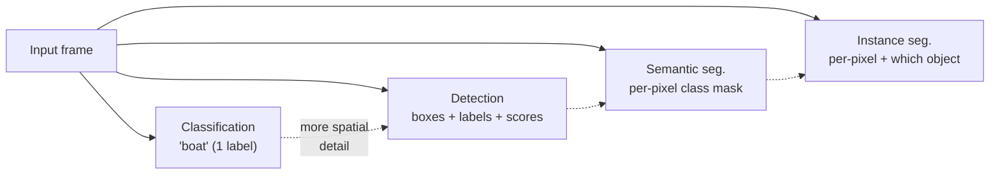
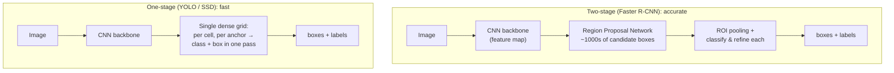

# 19 — Object Detection & Segmentation

> Part 7 · Lesson 19 · Code stack: pytorch (torchvision pretrained models)

**Prerequisites:** [13 — Convolutional Neural Networks](13-cnns.md) (you must be comfortable with conv stacks, feature maps, and shape arithmetic). Helpful background: [12 — Training Deep Networks](12-training-deep-nets.md) (loss heads, training stability) and [17 — Transfer Learning, LLMs & MLOps](17-transfer-learning-llms-mlops.md) (using pretrained backbones).

**By the end you can:**
- Explain the jump from **classification** ("what is in the image") to **detection** ("what *and where*, as boxes") and **segmentation** ("which pixels").
- Define **IoU**, **anchor boxes**, **NMS**, and **mAP**, and say *why* a path planner needs each.
- Contrast **two-stage** (Faster R-CNN) vs **one-stage** (YOLO/SSD) detectors and reason about the speed/accuracy tradeoff.
- Run a **pretrained torchvision detector** on a real image, filter by score, apply **NMS**, and draw boxes.
- Trace the **encoder–decoder / U-Net** shape, including **transposed convolution** and **skip connections**, through a tiny forward pass.

---

## 1. Intuition

Your CNN classifier from lesson 13 answers one question: *"What is this image?"* → `"boat"`. That is almost useless to a path planner. The planner does not care that *a* boat exists somewhere in the frame; it needs to know **where** the boat is, **how big** it is, and **how far off the bow** — so it can decide whether to hold course or give way. Classification collapses a whole scene into one label. Perception for control has to keep the **spatial structure**.

There are three escalating tasks, and the difference is entirely about *spatial resolution of the answer*:

- **Classification** — one label for the whole image. (Lesson 13.)
- **Object detection** — a set of **bounding boxes**, each with a class label and a confidence score. "Boat at pixels (x=410, y=300, w=120, h=80), score 0.94." Tells the planner discrete obstacles and their footprint.
- **Segmentation** — a class for **every pixel**. **Semantic segmentation** says "this pixel is water, that one is sky"; **instance segmentation** goes further and says "this pixel belongs to *boat #2*."



**Analogy — the harbormaster's three reports.** Classification is a radio call: *"There's traffic out there."* Useless for steering. Detection is a radar plot: *discrete blips with position and size* — exactly what a collision-avoidance algorithm consumes. Segmentation is a painted chart where every square meter of the scene is colored "navigable water / shoreline / vessel / sky" — what you want when the hazard is a *region* (a sandbar, the shoreline) rather than a discrete object you can box.

For an autonomous vehicle, the rule of thumb is: **detect discrete obstacles, segment continuous regions.** A buoy or another boat is a box. The water/shore boundary, or the seabed an ROV must not scrape, is a mask.

---

## 2. The Math

### 2.1 A box, and how to score it

A bounding box is just four numbers. Two common conventions: corner form $(x_1, y_1, x_2, y_2)$ (top-left and bottom-right) or center form $(x_c, y_c, w, h)$. torchvision uses **corner form**. A detector outputs, per box, a class label and a **confidence score** $s \in [0,1]$.

To measure whether a predicted box $A$ matches a ground-truth box $B$, we need an overlap metric. That metric is **Intersection-over-Union (IoU)**:

$$
\text{IoU}(A, B) = \frac{\text{area}(A \cap B)}{\text{area}(A \cup B)}
$$

where $A \cap B$ is the overlapping rectangle and $A \cup B = \text{area}(A) + \text{area}(B) - \text{area}(A \cap B)$ is the combined footprint. **Where it comes from:** it is the **Jaccard index** (lesson 05's set-similarity measure) applied to pixel sets. $\text{IoU}=1$ means perfect overlap, $\text{IoU}=0$ means disjoint. The intersection rectangle is computed by taking the inner edges:

$$
x_1^\cap = \max(x_1^A, x_1^B),\quad y_1^\cap = \max(y_1^A, y_1^B),\quad
x_2^\cap = \min(x_2^A, x_2^B),\quad y_2^\cap = \min(y_2^A, y_2^B)
$$

and if $x_2^\cap > x_1^\cap$ and $y_2^\cap > y_1^\cap$ the intersection area is their product, else $0$ (boxes don't touch).

IoU is the workhorse of detection: it decides whether a prediction "counts" as correct (typically $\text{IoU} \ge 0.5$), and it drives NMS below.

### 2.2 Anchor boxes — turning detection into regression

How do you make a CNN *emit* boxes? You can't easily ask a fixed-size network to output a variable number of arbitrary rectangles. The trick that unlocked modern detectors: **anchor boxes** (also called priors or default boxes).

Overlay a grid on the image. At each grid cell, predefine a handful of reference rectangles of fixed sizes and aspect ratios — e.g. a tall one, a wide one, a square one, at three scales. These are **anchors**. The network's job is no longer "invent a box from nothing" but "for each anchor, predict (a) is there an object here? and (b) a small **offset** correcting the anchor to the true box." That converts an open-ended search into a fixed, parallel **classification + regression** problem the CNN already knows how to do.

The regression targets are offsets relative to an anchor $(x_a, y_a, w_a, h_a)$:

$$
t_x = \frac{x - x_a}{w_a},\quad t_y = \frac{y - y_a}{h_a},\quad
t_w = \log\frac{w}{w_a},\quad t_h = \log\frac{h}{h_a}
$$

where $(x,y,w,h)$ is the true box center/size. **Where it comes from:** dividing by the anchor size makes the target **scale-invariant** (a 10-pixel error on a tiny buoy and a 100-pixel error on a huge ship are comparable when normalized), and the $\log$ on width/height keeps growth/shrink symmetric and forces positive sizes. The network predicts $\hat{t}$; you invert these equations to recover the actual box.

### 2.3 Two families: two-stage vs one-stage



- **Two-stage (R-CNN → Fast R-CNN → Faster R-CNN).** Stage 1: a **Region Proposal Network (RPN)** scans the backbone feature map and emits a few thousand class-agnostic "there might be *something* here" boxes. Stage 2: for each proposal, **ROI pooling** crops the corresponding feature patch to a fixed size and a small head classifies it and refines the box. Two passes = more compute but high accuracy, especially on small objects.

- **One-stage (YOLO, SSD).** Skip proposals entirely. A single forward pass over the grid predicts, for every cell and every anchor, the class scores *and* the box offsets *at once*. One pass = real-time speeds (tens to hundreds of FPS) at some accuracy cost.

**The tradeoff, in one sentence:** two-stage spends compute zooming in on promising regions before deciding (accurate, slower); one-stage decides everywhere simultaneously (fast, slightly less precise on small/cluttered objects). On a USV at 20 FPS doing collision avoidance you almost always pick **one-stage**; for an offline survey re-analysis where accuracy is king, two-stage is fine.

### 2.4 Non-Maximum Suppression (NMS)

Anchors are dense, so the network fires *many overlapping boxes on the same object* — five slightly-shifted boxes all yelling "boat!". You want **one box per object**. **NMS** is the cleanup:

1. Sort all boxes (of a class) by score, highest first.
2. Take the top box, keep it, and **remove every remaining box with $\text{IoU} \ge \tau$** against it (they're duplicates of the same object). $\tau$ is the NMS threshold, e.g. $0.5$.
3. Repeat with the next-highest surviving box until none remain.

It's a greedy "the most confident box wins its neighborhood" filter. Too low a $\tau$ and you suppress genuinely distinct adjacent objects (two boats side by side merge into one); too high and duplicates leak through.

### 2.5 mAP — the detection scorecard

You can't use plain accuracy: detection has variable numbers of objects, and "correct" depends on both label *and* IoU. The standard metric is **mean Average Precision (mAP)**:

- A prediction is a **true positive** if its label is right **and** $\text{IoU} \ge$ threshold (e.g. 0.5) with an unmatched ground-truth box; otherwise a **false positive**. Missed ground truths are **false negatives**.
- Sweep the score threshold from high to low; at each level compute **precision** $= \frac{TP}{TP+FP}$ and **recall** $= \frac{TP}{TP+FN}$ (lesson 05). This traces a **precision–recall curve**; its area is the **Average Precision (AP)** for that class.
- **mAP** averages AP over all classes (and, in COCO, over IoU thresholds 0.50→0.95). Higher is better; it rewards finding objects (recall) *without* spraying false boxes (precision).

---

## 3. Code

We'll load a **pretrained Faster R-CNN** from torchvision, run it on one image, filter weak detections, apply **NMS**, and draw the boxes. The model was trained on **COCO** (80 everyday classes — `person`, `car`, `boat`, `bird`, ...), so it already knows "boat" out of the box, which is convenient for a marine demo.

> **Heads up:** the first run **downloads pretrained weights (~160 MB) once** and caches them. It runs fine on CPU (a second or two per image); a GPU is optional. Requires `torchvision` in your `study` env (`pip install torchvision`).

```python
import torch
import torchvision
from torchvision.models.detection import (
    fasterrcnn_resnet50_fpn, FasterRCNN_ResNet50_FPN_Weights
)
import torchvision.ops as ops

# --- 1. Load the pretrained detector in EVAL mode ---------------------------
# .DEFAULT picks the best available pretrained weights bundle. The bundle also
# carries (a) the COCO class names and (b) the exact preprocessing transform.
weights = FasterRCNN_ResNet50_FPN_Weights.DEFAULT
model = fasterrcnn_resnet50_fpn(weights=weights)
model.eval()                       # disable dropout/BN updates — inference only

categories = weights.meta["categories"]   # list; index 0 is "__background__"
print(categories[:10])
# -> ['__background__', 'person', 'bicycle', 'car', 'motorcycle',
#     'airplane', 'bus', 'train', 'truck', 'boat']

# The model's own preprocessing: convert to float, scale, normalize.
preprocess = weights.transforms()
```

Now run inference. The detection model takes a **list of image tensors** (it handles variable sizes internally) and returns a **list of dicts**, one per image, with keys `boxes`, `labels`, `scores`.

```python
from torchvision.io import read_image   # reads as uint8 CHW tensor

# Use any image you have. For a marine scene, a harbor/boat photo is ideal.
img_uint8 = read_image("harbor.jpg")     # shape: (3, H, W), dtype uint8
batch = [preprocess(img_uint8)]          # list of one preprocessed tensor

with torch.no_grad():                    # no gradients needed for inference
    outputs = model(batch)

pred = outputs[0]                        # dict for our single image
print(pred["boxes"].shape, pred["scores"].shape)
# -> torch.Size([N, 4]) torch.Size([N])   # N raw detections, boxes in (x1,y1,x2,y2)
```

The raw output has many low-confidence and duplicate boxes. We clean it in two steps — **score filter**, then **NMS**:

```python
# --- 2. Filter by confidence score -----------------------------------------
SCORE_THRESH = 0.7                       # keep only confident detections
keep = pred["scores"] >= SCORE_THRESH
boxes_filt  = pred["boxes"][keep]        # (M, 4)  score-filtered, still has dups
labels_filt = pred["labels"][keep]       # (M,)  integer class ids
scores_filt = pred["scores"][keep]       # (M,)

# --- 3. Non-Maximum Suppression: kill duplicate boxes ----------------------
# ops.nms returns the INDICES to keep, sorted by score, removing any box whose
# IoU with a higher-scoring box exceeds the threshold.
NMS_IOU = 0.5
keep_idx = ops.nms(boxes_filt, scores_filt, iou_threshold=NMS_IOU)
boxes  = boxes_filt[keep_idx]            # NMS-deduplicated subset
labels = labels_filt[keep_idx]
scores = scores_filt[keep_idx]

for b, l, s in zip(boxes, labels, scores):
    name = categories[l.item()]
    x1, y1, x2, y2 = b.tolist()
    print(f"{name:8s} score={s:.2f}  box=({x1:.0f},{y1:.0f},{x2:.0f},{y2:.0f})")
# -> boat     score=0.99  box=(412,301,640,455)
# -> boat     score=0.91  box=(110,330,250,420)
# -> person   score=0.85  box=(470,250,505,330)
```

It is worth seeing NMS as a one-liner so the "magic" is demystified. Here is the IoU + greedy-NMS computed by hand, matching `torchvision.ops.nms`:

```python
def iou(box, boxes):
    """IoU of one box (4,) against many boxes (K,4). Corner format."""
    x1 = torch.maximum(box[0], boxes[:, 0])          # inner-left edge
    y1 = torch.maximum(box[1], boxes[:, 1])
    x2 = torch.minimum(box[2], boxes[:, 2])          # inner-right edge
    y2 = torch.minimum(box[3], boxes[:, 3])
    inter = (x2 - x1).clamp(min=0) * (y2 - y1).clamp(min=0)
    area  = lambda b: (b[..., 2] - b[..., 0]) * (b[..., 3] - b[..., 1])
    union = area(box) + area(boxes) - inter
    return inter / union

def my_nms(boxes, scores, thresh=0.5):
    order = scores.argsort(descending=True)          # highest score first
    keep = []
    while order.numel() > 0:
        i = order[0]                                 # the winner
        keep.append(i.item())
        if order.numel() == 1:
            break
        rest = order[1:]
        ious = iou(boxes[i], boxes[rest])
        order = rest[ious < thresh]                  # drop overlapping duplicates
    return torch.tensor(keep)

# Sanity check against the library: run BOTH on the pre-NMS (score-filtered)
# boxes and confirm the kept-index sets agree. (Running on the already-
# deduplicated `boxes` would trivially keep everything and prove nothing.)
mine = set(my_nms(boxes_filt, scores_filt, NMS_IOU).tolist())
lib  = set(ops.nms(boxes_filt, scores_filt, NMS_IOU).tolist())
assert mine == lib
```

**Draw the boxes** with matplotlib:

```python
import matplotlib.pyplot as plt
import matplotlib.patches as patches

fig, ax = plt.subplots(figsize=(8, 6))
ax.imshow(img_uint8.permute(1, 2, 0))                # CHW -> HWC for imshow
for b, l, s in zip(boxes, labels, scores):
    x1, y1, x2, y2 = b.tolist()
    rect = patches.Rectangle((x1, y1), x2 - x1, y2 - y1,
                             linewidth=2, edgecolor="lime", facecolor="none")
    ax.add_patch(rect)
    ax.text(x1, y1 - 4, f"{categories[l.item()]} {s:.2f}",
            color="black", fontsize=9,
            bbox=dict(facecolor="lime", alpha=0.8, pad=1))
ax.axis("off"); plt.tight_layout(); plt.show()
```

**What you should see:** the original photo with tight green rectangles hugging each boat/person, each tagged with its class name and confidence — and crucially, exactly *one* box per object (NMS did its job; without it you'd see clusters of near-duplicate boxes on each hull).

### Shape walkthrough — a tiny U-Net (segmentation)

Detection gives boxes; **segmentation** gives a per-pixel mask, and the canonical architecture is the **U-Net**: an **encoder** that downsamples to learn semantics, a **decoder** that *upsamples back to full resolution*, and **skip connections** carrying fine detail across. The decoder's upsampling uses **transposed convolution** (a learnable upsample — the inverse-shape of a conv: it *spreads* each input pixel into a larger patch, increasing H and W). Watch the spatial dims shrink then grow:

```python
import torch.nn as nn

class TinyUNet(nn.Module):
    def __init__(self, in_ch=3, n_classes=3):       # e.g. water / sky / shore
        super().__init__()
        self.enc1 = nn.Conv2d(in_ch, 16, 3, padding=1)   # keep H,W
        self.enc2 = nn.Conv2d(16, 32, 3, padding=1)
        self.pool = nn.MaxPool2d(2)                       # halves H,W
        self.bottleneck = nn.Conv2d(32, 64, 3, padding=1)
        # transposed conv: stride 2 DOUBLES H,W (learnable upsampling)
        self.up   = nn.ConvTranspose2d(64, 32, 2, stride=2)
        # after concatenating the skip (32 + 32 = 64 channels):
        self.dec  = nn.Conv2d(64, 32, 3, padding=1)
        self.head = nn.Conv2d(32, n_classes, 1)           # per-pixel logits

    def forward(self, x):
        s1 = torch.relu(self.enc1(x))     # encoder feature, full res — SKIP source
        s2 = torch.relu(self.enc2(s1))
        p  = self.pool(s2)                # downsample
        b  = torch.relu(self.bottleneck(p))
        u  = self.up(b)                   # upsample back toward full res
        u  = torch.cat([u, s2], dim=1)    # SKIP connection: fuse fine detail
        d  = torch.relu(self.dec(u))
        return self.head(d)               # (N, n_classes, H, W) per-pixel logits

x = torch.randn(1, 3, 64, 64)             # one 64x64 RGB image
net = TinyUNet()
print("input     ", tuple(x.shape))                       # (1, 3, 64, 64)
print("output    ", tuple(net(x).shape))                  # (1, 3, 64, 64)
# -> input      (1, 3, 64, 64)
# -> output     (1, 3, 64, 64)   # per-pixel class scores, SAME H,W as input
```

The output has the **same height and width as the input** but `n_classes` channels: take `argmax` over the channel dim and you get a full-resolution label mask. The **skip connection** (`torch.cat([u, s2])`) is the whole trick — the encoder destroys spatial precision while learning *what*; the skip hands the decoder back the *where* (sharp edges) it would otherwise have lost. Without it, U-Net masks come out blurry.

---

## 4. Real Case

### USV/UAV camera perception for collision avoidance

Put a forward camera on a USV. Run a one-stage detector (YOLO-class, or torchvision's `ssdlite320_mobilenet_v3_large` for a light real-time model) at 15–30 FPS. The detector emits boxes: `boat (0.96)`, `boat (0.88)`, `bird (0.71)`. Now the box geometry feeds the planner directly:

- **Bearing** comes from the box's horizontal center: a box centered left of frame center is a contact off the port bow. With camera intrinsics, pixel column → angle.
- **Range proxy / closing risk** comes from box size and its *growth rate* between frames: a `boat` box that doubles in height over two seconds is approaching fast — escalate to an avoidance maneuver.
- **Footprint** (box width) sets how much lateral clearance to plan.

A bare class label ("there is a boat") cannot do any of this. The planner is a geometry engine; it consumes *positions and extents*, which is exactly what detection provides and classification throws away. This is also where **NMS matters operationally**: without it, one approaching boat shows up as five flickering boxes, and the tracker that feeds your collision-avoidance logic sees five phantom contacts.

For a **UAV** doing landing-zone or line inspection, same story: detect people/vehicles to keep clear of, and use box position to keep the target centered for a gimbal lock.

### ROV / USV region segmentation

Some hazards aren't discrete objects — they're *regions*. Here you want **semantic segmentation** (U-Net or DeepLab-class):

- **USV horizon/water segmentation** — label every pixel `water` / `sky` / `shore/obstacle`. The water/non-water boundary defines the **navigable region**; the planner stays inside the water mask. This is robust where detection fails: distant shoreline, breaking waves, or unfamiliar floating debris have no "class," but they're clearly *not open water*.
- **ROV seabed/structure segmentation** — segment `seabed` / `water column` / `structure (pipe, hull, reef)` from the downward camera or forward sonar imagery so the ROV holds a safe altitude and doesn't scrape the bottom or collide with a pipeline it's inspecting.

**Anchor (classic dataset):** the torchvision detector here is trained on **COCO** (Common Objects in Context, 80 classes, ~330k images) — the standard detection benchmark and the reason `boat`, `person`, and `bird` work zero-shot in our demo. The segmentation equivalents you'd fine-tune from are **Cityscapes** / **Pascal VOC**; for marine work, domain datasets like **MaSTr1325** (USV water/sky/obstacle segmentation) or **MODD** (marine obstacle detection) are the right starting points.

---

## 5. Pitfalls & Tips

- **Use the model's own preprocessing.** `weights.transforms()` applies the exact normalization the network was trained with. Feeding raw `[0,255]` pixels, or your own mean/std, silently wrecks accuracy — a classic **train/serve skew** (lesson 17). Detection models also expect a *list* of CHW tensors, not a stacked batch tensor.
- **Score threshold ≠ NMS threshold.** They're different knobs. The **score** threshold filters weak detections (raise it to cut false positives); the **NMS IoU** threshold merges duplicates (raise it if distinct adjacent objects are being wrongly merged, lower it if you see duplicate boxes). Tune them separately.
- **Off-by-one on class indices.** torchvision detection models reserve **index 0 for `__background__`**, so `categories[label]` is correct *only* because that background entry shifts everything. Don't subtract 1; index straight into `weights.meta["categories"]`.
- **Don't trust mAP@0.5 blindly for safety.** A high mAP can hide that the model misses *small* objects — and a buoy at 200 m is small. Evaluate on your *own* operating conditions (dusk, glare, fog) and on the size range you actually care about, not just COCO's distribution.
- **Detection vs segmentation: pick by hazard type.** Discrete obstacle → box (cheaper, gives a clean contact). Continuous region (navigable water, seabed) → mask. Forcing a box around "the shoreline" is the wrong tool.
- **NMS is per-class by default in good pipelines.** A `boat` box and a `person` box that overlap (person standing on the boat) should *both* survive. `ops.nms` is class-agnostic; for multi-class use `ops.batched_nms`, which offsets boxes by class so cross-class overlaps aren't suppressed.

---

## 6. Check Your Understanding

**Q1.** Two predicted boat boxes for the same hull: $A=(100,100,200,200)$ and $B=(150,100,250,200)$ (corner format, pixels). Compute their IoU. If NMS runs with $\tau=0.4$, what happens?

<details><summary>Answer</summary>
Intersection: $x_1^\cap=\max(100,150)=150$, $x_2^\cap=\min(200,250)=200$, so width $=50$; $y$ fully overlaps, height $=100$. Intersection $=50\times100=5000$. Each box is $100\times100=10000$, union $=10000+10000-5000=15000$. $\text{IoU}=5000/15000 \approx \mathbf{0.33}$. Since $0.33 < \tau=0.4$, NMS keeps **both** boxes — it would *not* treat them as duplicates at this threshold. (Lower $\tau$ to ~0.3 and the lower-scoring one gets suppressed.)
</details>

**Q2.** Why does a one-stage detector (YOLO/SSD) run faster than a two-stage one (Faster R-CNN), and what do you typically give up?

<details><summary>Answer</summary>
One-stage predicts class scores **and** box offsets for every grid cell/anchor in a **single forward pass** — no separate region-proposal stage and no per-proposal ROI cropping/classification. Two-stage does an RPN pass to propose ~thousands of regions, then re-processes each one, which is far more compute. You typically give up some **accuracy, especially on small and densely-clustered objects**, where the proposal-then-refine pipeline is more precise. For real-time vehicle perception you usually accept that tradeoff for the framerate.
</details>

**Q3.** Your detector outputs eleven boxes on a single approaching boat, all score > 0.8. What stage is missing, and why does it specifically endanger the collision-avoidance logic?

<details><summary>Answer</summary>
**NMS** is missing (or its IoU threshold is set too high to merge them). Anchors are dense, so many overlapping boxes fire on one object. The danger: the **tracker/planner downstream sees 11 separate "contacts"** for one real boat — phantom obstacles that can trigger erratic avoidance maneuvers, inflate the apparent traffic density, or confuse a multi-object tracker into splitting/swapping IDs. One object must yield one box.
</details>

**Q4.** In a U-Net, what concretely do the **skip connections** add, and what goes wrong without them? What operation grows the spatial resolution back?

<details><summary>Answer</summary>
Skip connections **concatenate encoder feature maps (high spatial precision, the *where*) into the decoder** at matching resolutions, fusing them with the upsampled semantic features (the *what*). Without them the decoder must reconstruct sharp boundaries from heavily-downsampled features, so masks come out **blurry / spatially imprecise** — bad when the water/shore boundary must be pixel-accurate. The resolution is grown back by **transposed convolution** (learnable upsampling), which spreads each input element into a larger output patch (stride 2 doubles H and W).
</details>

**Q5.** A planner needs to know *where* the navigable water is so the USV stays in it, and separately needs to avoid two other boats. Which task (detection vs segmentation) fits each, and why?

<details><summary>Answer</summary>
**Navigable water → semantic segmentation.** It's a continuous *region*, not a countable object; a per-pixel `water` mask defines the drivable area directly, and works even for unfamiliar/undefined hazards (debris, shoreline) that have no class. **Other boats → detection.** They're discrete objects, and the planner wants each one as a clean contact with position and footprint (a box) to reason about bearing, closing rate, and clearance — far cheaper and more actionable than a mask for that purpose.
</details>

---

## Recap & Next

- **Detection = what + where (boxes + labels + scores); segmentation = which pixels** (semantic = per-class, instance = per-object). Classification alone is too coarse for a planner that reasons about geometry.
- **IoU** scores box overlap (intersection / union); it gates "correct" matches, drives **NMS** (greedy "best box wins its neighborhood" to kill duplicates), and underlies **mAP** (area under the precision–recall curve, averaged over classes).
- **Anchor boxes** turn open-ended box-finding into per-anchor **classify + offset-regress**. **Two-stage** (Faster R-CNN: propose then refine) trades speed for accuracy; **one-stage** (YOLO/SSD: one grid pass) trades a little accuracy for real-time speed — usually the right call on a vehicle.
- A **pretrained torchvision detector** runs zero-shot on COCO classes (`boat`, `person`, ...): preprocess → infer → **score filter** → **NMS** → draw. Always use `weights.transforms()` and remember index 0 is `__background__`.
- **U-Net** = encoder (downsample, learn semantics) + decoder (**transposed conv** upsample back to full resolution) + **skip connections** (carry fine detail across), producing a same-size per-pixel mask.

**Next:** models are only as good as what you feed them. **[20 — Data & Feature Engineering](20-data-feature-engineering.md)** — how to build, clean, label, and augment the datasets (including detection boxes and segmentation masks) that make all of this work.
