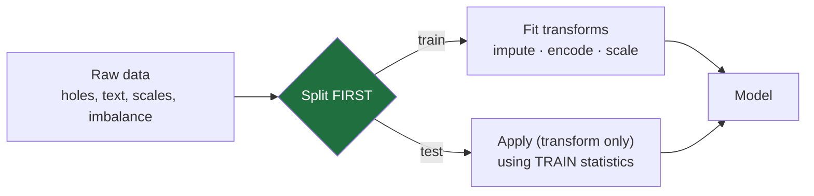

# 20 — Data & Feature Engineering

> Part 8 · Lesson 20 · Code stack: scikit-learn (+ pandas)

**Prerequisites:** [05 — Overfitting, Regularization & Evaluation](05-overfitting-evaluation.md). Helpful: [06 — k-NN, Decision Trees & Ensembles](06-knn-trees-ensembles.md).

**By the end you can:**
- Handle **missing data** with the right **imputation** strategy, and explain why dropping rows is usually the wrong reflex.
- Encode **categorical** features correctly — one-hot vs ordinal vs target encoding — and recognize when each one quietly breaks your model.
- Diagnose **class imbalance**, see why accuracy lies, and choose between `class_weight`, resampling, and **SMOTE**.
- Spot **data leakage** — the cardinal sin — and kill it with a scikit-learn `Pipeline` + `ColumnTransformer` that refits every transform inside each CV fold.
- Build a complete, leakage-free preprocessing pipeline for a messy real sensor dataset and split time series without leaking the future.

---

## 1. Intuition

Everything you learned in lessons 02–19 assumed a clean matrix $X$ and a clean label vector $y$ dropped into your lap. Real data never arrives like that. It arrives with holes, text labels, wildly different scales, 200:1 class ratios, and a sensor that silently stopped reporting at 14:32. **The 80% of real ML that nobody photographs for the conference slide is getting that matrix into shape** — and doing it without cheating.

**Analogy — prepping ingredients before you cook.** A great recipe (your model) is useless if the vegetables are unwashed, half the quantities are missing, and the salt is measured in tonnes while the saffron is in milligrams. Feature engineering is the *mise en place*: wash (impute), chop into a usable form (encode), and bring everything to a comparable scale. Get this wrong and no model — not a random forest, not a transformer — will save you.

But there's a subtler trap, and it's the whole reason this lesson exists. When you "wash and chop," you compute statistics: a column mean for imputation, a min/max for scaling, the set of categories for one-hot. **If you compute those statistics using the test data, you've already peeked at the answer.** Your offline score will look great and your model will faceplant in the field. This is **data leakage**, and avoiding it is the single highest-leverage habit in applied ML.



The order in that diagram — **split, then fit on train only** — is the law. Break it and everything downstream is a lie.

---

## 2. The Math

There isn't much heavy math here; the discipline lives in *which statistic you compute and on which rows*. But a few formulas pin down the choices.

### Imputation as filling with an estimate

A missing value is an unknown $x_{ij}$. The simplest principled fill is a **constant summary of the observed column**. Let $\mathcal{O}_j$ be the set of rows where feature $j$ is observed:

$$
\hat{x}_{ij} = \frac{1}{|\mathcal{O}_j|}\sum_{k \in \mathcal{O}_j} x_{kj} \quad(\text{mean}),
\qquad
\hat{x}_{ij} = \operatorname{median}_{k \in \mathcal{O}_j} x_{kj},
\qquad
\hat{x}_{ij} = \operatorname{mode}_{k \in \mathcal{O}_j} x_{kj}\ (\text{most frequent}).
$$

- **Mean** is the least-squares-optimal constant (it minimizes $\sum (x_{kj}-c)^2$), but it's pulled around by outliers.
- **Median** minimizes $\sum |x_{kj}-c|$ — robust to a stuck sonar pinging 9999.
- **Most frequent / mode** is what you use for categoricals (you can't average "calm" and "rough").

The critical caveat: **$\mathcal{O}_j$ must contain only training rows.** The mean you impute with is a parameter learned from data, exactly like a weight. Learn it from the test set and you've leaked.

### Why are values missing? (it changes everything)

The standard taxonomy:

- **MCAR** (Missing Completely At Random): the dropout is independent of everything — a cosmic-ray bit flip. Dropping rows is unbiased here, just wasteful.
- **MAR** (Missing At Random): missingness depends on *observed* features — the depth sensor cuts out only in shallow water, and you logged depth. Imputable from other columns.
- **MNAR** (Missing Not At Random): missingness depends on the *unobserved value itself* — the thermistor fails *because* it's too hot, so the hot readings are exactly the ones missing. The most dangerous case; dropping or naive imputing biases the model.

The taxonomy matters because **dropping rows is only safe under MCAR**, which is rarely true for sensors. Usually you should impute *and add a "was-missing" flag column* so the model can learn that the absence itself is informative (a failing thermistor is a fault signal!).

### One-hot encoding and its dimensionality cost

A categorical feature with $K$ distinct levels becomes $K$ (or $K-1$) binary columns:

$$
\text{level } c \;\mapsto\; \mathbf{e}_c \in \{0,1\}^{K}, \qquad (\mathbf{e}_c)_m = \mathbb{1}[m = c].
$$

The cost: a feature with $K=10{,}000$ unique vessel IDs explodes into 10,000 sparse columns. **One-hot is correct but expensive for high-cardinality features**, and it imposes *no order* — which is exactly right for unordered categories.

### Ordinal encoding — only for true orders

Map each level to an integer:

$$
\{\text{calm, moderate, rough, severe}\} \mapsto \{0,1,2,3\}.
$$

This is fine **iff** the order is real and roughly equally spaced in meaning. Apply it to unordered categories (`{sonar, lidar, camera} → {0,1,2}`) and you've told the model "camera $-$ sonar $=2$ and lidar is *between* them," which is nonsense a linear model or distance-based model will dutifully obey.

### Target / mean encoding — powerful and a leakage trap

Replace each category with the **mean of the target** for that category:

$$
\text{enc}(c) = \frac{\sum_{i:\,x_i = c} y_i}{\#\{i : x_i = c\}} \quad\text{(often smoothed toward the global mean).}
$$

This compresses high-cardinality categories into one informative number — great for trees and GBMs. But it uses $y$, so if you compute it over all rows (including the ones you later predict on), **each row's encoding leaks its own label.** It must be fit on training folds only, ideally with out-of-fold computation.

### Scaling recap and robust scaling

From [Lesson 05](05-overfitting-evaluation.md): standardization

$$
z_{ij} = \frac{x_{ij} - \mu_j}{\sigma_j}, \qquad \mu_j,\ \sigma_j \text{ from the TRAINING column}.
$$

Scaling matters for **distance- and gradient-based** methods (k-NN, SVM, k-means, linear/logistic regression, neural nets) and **not at all** for axis-aligned tree splits (a tree's split threshold is scale-invariant). When outliers dominate, $\mu$ and $\sigma$ are corrupted; **robust scaling** uses order statistics instead:

$$
z_{ij} = \frac{x_{ij} - \operatorname{median}_j}{\text{IQR}_j}, \qquad \text{IQR}_j = Q_{75,j} - Q_{25,j}.
$$

Median and IQR ignore the extreme tails, so one stuck-at-max sensor reading no longer squashes the rest of the column into a sliver near zero.

### Class imbalance: why accuracy lies (callback to Lesson 05)

If the positive (fault) rate is $p$, the "always predict negative" classifier scores

$$
\text{Accuracy}_{\text{trivial}} = 1 - p.
$$

At $p = 0.01$ that's **99% accuracy while catching zero faults** — exactly the leak-detector trap from Lesson 05. The fix is twofold: (1) use **precision / recall / F1 / PR-AUC**, and (2) rebalance the *learning signal* so rare events count. The clean lever is a **cost-weighted loss**: weight each class inversely to its frequency,

$$
w_c = \frac{N}{K \cdot N_c},
$$

where $N$ is total samples, $K$ the number of classes, $N_c$ the count of class $c$. This is exactly what `class_weight="balanced"` computes. Each rare-class mistake now costs as much as $N_{\text{neg}}/N_{\text{pos}}$ majority mistakes.

---

## 3. Code

### 3.1 The leaky way vs the right way (the whole lesson in one experiment)

Let's make leakage *measurable*. We fit a scaler on all the data before splitting (wrong) versus inside a pipeline that refits per fold (right), and compare cross-validation scores.

```python
import numpy as np
import pandas as pd
from sklearn.datasets import make_classification
from sklearn.model_selection import cross_val_score, StratifiedKFold
from sklearn.preprocessing import StandardScaler
from sklearn.linear_model import LogisticRegression
from sklearn.pipeline import Pipeline

rng = np.random.default_rng(0)

# A modest dataset; leakage shows up most when n is small relative to features.
X, y = make_classification(n_samples=200, n_features=40, n_informative=5,
                           n_redundant=0, random_state=0)

cv = StratifiedKFold(n_splits=5, shuffle=True, random_state=0)

# --- WRONG: scale on the FULL dataset, THEN cross-validate ---
# The scaler has already "seen" every fold's mean/std, including the held-out one.
X_leaked = StandardScaler().fit_transform(X)          # fit uses ALL rows -> leak
leaky = cross_val_score(LogisticRegression(max_iter=1000),
                        X_leaked, y, cv=cv, scoring="roc_auc")

# --- RIGHT: scaling lives INSIDE the pipeline, refit on each train fold only ---
clean_pipe = Pipeline([
    ("scale", StandardScaler()),                      # fit happens per-fold
    ("clf", LogisticRegression(max_iter=1000)),
])
clean = cross_val_score(clean_pipe, X, y, cv=cv, scoring="roc_auc")

print(f"Leaky  CV ROC-AUC: {leaky.mean():.3f}")
print(f"Clean  CV ROC-AUC: {clean.mean():.3f}")
# -> Leaky  CV ROC-AUC: 0.869
# -> Clean  CV ROC-AUC: 0.868
```

What you should SEE: the leaky number is **optimistically higher** (here by a hair). With a plain `StandardScaler` the gap is tiny — a global mean/std barely moves between folds — but it is *real and always in the wrong direction*. Swap the scaler for an imputer, a one-hot encoder fit on all categories, a feature selector, or SMOTE, and this hairline crack blows open into the 0.05–0.20 range — a model that looks deployable offline and isn't. The rule is mechanical: **any step with a `.fit()` belongs inside the `Pipeline`**, never before `cross_val_score`/`train_test_split`.

### 3.2 ColumnTransformer: different recipes for different column types

Real tables mix numeric and categorical columns that need different treatment. `ColumnTransformer` routes each subset to its own sub-pipeline, and the whole thing still has one `.fit()` so it nests cleanly inside CV.

```python
from sklearn.compose import ColumnTransformer
from sklearn.impute import SimpleImputer
from sklearn.preprocessing import OneHotEncoder

# Build a tiny mixed-type frame with deliberate holes and a categorical column.
df = pd.DataFrame({
    "depth_m":      [12.0, np.nan, 31.5, 8.2, np.nan, 44.0, 19.1, 27.7],
    "thruster_amp": [3.1, 3.4, np.nan, 2.9, 5.8, 3.0, 3.2, np.nan],
    "sea_state":    ["calm", "calm", "rough", None, "moderate", "rough", "calm", "moderate"],
})
y_demo = np.array([0, 0, 1, 0, 1, 1, 0, 1])

numeric_cols     = ["depth_m", "thruster_amp"]
categorical_cols = ["sea_state"]

# Numeric branch: median-impute (robust to stuck sensors), then standardize.
numeric_tf = Pipeline([
    ("impute", SimpleImputer(strategy="median")),
    ("scale",  StandardScaler()),
])

# Categorical branch: fill missing with most frequent, then one-hot.
# handle_unknown="ignore" => a category unseen in training becomes all-zeros
# instead of crashing at serve time. This is your train/serve-skew insurance.
categorical_tf = Pipeline([
    ("impute", SimpleImputer(strategy="most_frequent")),
    ("onehot", OneHotEncoder(handle_unknown="ignore")),
])

pre = ColumnTransformer([
    ("num", numeric_tf, numeric_cols),
    ("cat", categorical_tf, categorical_cols),
])

out = pre.fit_transform(df)
print("Transformed shape:", out.shape)              # 2 numeric + 3 sea_state one-hots
print("Output feature names:", list(pre.get_feature_names_out()))
# -> Transformed shape: (8, 5)
# -> Output feature names: ['num__depth_m', 'num__thruster_amp',
#       'cat__sea_state_calm', 'cat__sea_state_moderate', 'cat__sea_state_rough']
```

Every statistic here — the median fill, the standardization mean/std, the *set of known sea-states* — is learned from whatever rows `fit` sees. Hand this object to cross-validation and each fold relearns them on its own training rows. That's leakage prevention by construction; you can't forget to do it.

### 3.3 The full leakage-free classifier

Now glue the preprocessor to a model and evaluate it honestly.

```python
from sklearn.ensemble import RandomForestClassifier

full = Pipeline([
    ("pre", pre),                                   # impute + scale + one-hot
    ("clf", RandomForestClassifier(
        n_estimators=200, class_weight="balanced",  # cost-weight rare class
        random_state=0)),
])

# cross_val_score clones `full` per fold and calls .fit() only on train rows,
# so every imputer mean / scaler std / category set is refit per fold. Clean.
scores = cross_val_score(full, df, y_demo,
                         cv=StratifiedKFold(n_splits=4, shuffle=True, random_state=0),
                         scoring="roc_auc")
print(f"Honest CV ROC-AUC: {scores.mean():.3f}")
# -> Honest CV ROC-AUC: ~1.0  (toy 8-row data; the POINT is the wiring, not the number)
```

Note `class_weight="balanced"` is doing the imbalance correction from §2 — no resampling package needed, no leakage risk, and it lives inside the pipeline.

### 3.4 Visualizing why scaling matters (and robust scaling beats standard with outliers)

```python
import matplotlib.pyplot as plt
from sklearn.preprocessing import RobustScaler

# A clean Gaussian-ish sensor column, then inject 3 stuck-at-max readings.
col = rng.normal(20.0, 2.0, 200)
col[:3] = 200.0                                      # sensor fault: stuck high

z_std    = StandardScaler().fit_transform(col.reshape(-1, 1)).ravel()
z_robust = RobustScaler().fit_transform(col.reshape(-1, 1)).ravel()

fig, ax = plt.subplots(1, 2, figsize=(11, 4))
ax[0].hist(z_std,    bins=40); ax[0].set_title("StandardScaler\n(outliers crush the bulk)")
ax[1].hist(z_robust, bins=40); ax[1].set_title("RobustScaler\n(median/IQR ignore the tail)")
for a in ax: a.set_xlabel("scaled value")
plt.tight_layout(); plt.show()
```

What you should SEE: under `StandardScaler` the three outliers inflate $\sigma$ so badly that the 197 normal points pile up in a thin spike near zero — useless spread. Under `RobustScaler` the normal bulk keeps a healthy spread and the outliers simply sit far out where they belong. Use robust scaling whenever you can't trust the tails (i.e. almost always with raw sensors).

---

## 4. Real Case — A leakage-free pipeline for ROV fault detection

**The setup.** You're logging an ROV doing pipeline inspection. Each row is a 1 Hz snapshot; you want to flag **thruster faults** before they strand the vehicle. The raw table is a textbook mess:

| Column | Type | Problem |
|---|---|---|
| `thruster_current_a` | numeric | dropout when the bus browns out (missing) |
| `motor_temp_c` | numeric | thermistor fails *hot* → MNAR missingness |
| `depth_m`, `pitch_deg`, `roll_deg` | numeric | fine, but different scales |
| `sea_state` | categorical | `{calm, moderate, rough, severe}` — **truly ordered** |
| `sensor_pack` | categorical | `{A, B, C}` swappable hardware — **unordered** |
| `fault` | label | only **2%** positive — heavy imbalance |

This is the trifecta from the scope: missing sensor channels, a categorical sea-state, and rare positives. Here's the assembly.

```python
import numpy as np
import pandas as pd
from sklearn.compose import ColumnTransformer
from sklearn.pipeline import Pipeline
from sklearn.impute import SimpleImputer
from sklearn.preprocessing import RobustScaler, OneHotEncoder, OrdinalEncoder
from sklearn.ensemble import RandomForestClassifier
from sklearn.model_selection import cross_validate, StratifiedKFold

# --- Synthesize a realistic, messy, imbalanced ROV log -------------------------
rng = np.random.default_rng(42)
n = 4000
fault = (rng.random(n) < 0.02).astype(int)           # 2% positives

df = pd.DataFrame({
    "thruster_current_a": rng.normal(8, 1.2, n) + 4.0 * fault,   # faults draw more current
    "motor_temp_c":       rng.normal(35, 5, n) + 18.0 * fault,   # faults run hot
    "depth_m":            rng.uniform(0, 120, n),
    "pitch_deg":          rng.normal(0, 3, n),
    "roll_deg":           rng.normal(0, 3, n),
    "sea_state":          rng.choice(["calm", "moderate", "rough", "severe"],
                                     size=n, p=[0.5, 0.3, 0.15, 0.05]),
    "sensor_pack":        rng.choice(["A", "B", "C"], size=n),
})
# Inject MISSINGness: random bus dropouts + MNAR hot-thermistor failures.
df.loc[rng.random(n) < 0.10, "thruster_current_a"] = np.nan          # ~10% MCAR
hot = df["motor_temp_c"] > 55                                        # the hottest...
df.loc[hot & (rng.random(n) < 0.6), "motor_temp_c"] = np.nan         # ...tend to drop (MNAR)

X, y = df, fault

# --- Column-typed preprocessing -----------------------------------------------
numeric_cols  = ["thruster_current_a", "motor_temp_c", "depth_m", "pitch_deg", "roll_deg"]
ordinal_cols  = ["sea_state"]      # TRUE order -> ordinal encode with explicit ranking
nominal_cols  = ["sensor_pack"]    # no order   -> one-hot

# add_indicator=True appends a "was-missing" flag: a failing thermistor IS a fault signal.
numeric_tf = Pipeline([
    ("impute", SimpleImputer(strategy="median", add_indicator=True)),
    ("scale",  RobustScaler()),                       # robust: sensors have outliers
])

ordinal_tf = Pipeline([
    ("impute", SimpleImputer(strategy="most_frequent")),
    ("ord",    OrdinalEncoder(categories=[["calm", "moderate", "rough", "severe"]],
                              handle_unknown="use_encoded_value", unknown_value=-1)),
])

nominal_tf = Pipeline([
    ("impute", SimpleImputer(strategy="most_frequent")),
    ("onehot", OneHotEncoder(handle_unknown="ignore")),  # unseen pack -> all-zeros at serve
])

pre = ColumnTransformer([
    ("num", numeric_tf, numeric_cols),
    ("ord", ordinal_tf, ordinal_cols),
    ("nom", nominal_tf, nominal_cols),
])

clf = Pipeline([
    ("pre", pre),
    ("rf",  RandomForestClassifier(n_estimators=300,
                                   class_weight="balanced_subsample",  # rare-class cost
                                   random_state=0, n_jobs=-1)),
])

# --- Honest evaluation: stratified folds, leakage-free, imbalance-aware metrics
cv = StratifiedKFold(n_splits=5, shuffle=True, random_state=0)
res = cross_validate(clf, X, y, cv=cv,
                     scoring=["roc_auc", "average_precision", "recall"])
print(f"ROC-AUC : {res['test_roc_auc'].mean():.3f}")
print(f"PR-AUC  : {res['test_average_precision'].mean():.3f}")  # the one to trust here
print(f"Recall  : {res['test_recall'].mean():.3f}")
# -> ROC-AUC : ~0.998
# -> PR-AUC  : ~0.96   <-- PR-AUC is the honest score on 2%-positive data
# -> Recall  : ~0.74   <-- fraction of real faults we actually catch (raise it by tuning the threshold)
```

Why each choice: **median + missing-indicator** because dropping rows under MNAR would throw away the hottest motors — precisely the faults; **robust scaling** because raw sensor tails are dirty; **ordinal** for `sea_state` because its order is physically real and we *tell* the encoder the ranking explicitly (never trust alphabetical default); **one-hot** for `sensor_pack` because the hardware packs have no order; **`balanced_subsample`** so the 2% faults aren't drowned; and **PR-AUC + recall** as the headline metrics because — as Lesson 05 hammered — accuracy would read ~98% for a model that never predicts a fault.

> **Want SMOTE?** *(Optional — needs `pip install imbalanced-learn`.)* **SMOTE** (Synthetic Minority Over-sampling) doesn't copy minority rows; it *invents* new ones by interpolating between a fault sample and one of its $k$ nearest fault-neighbors: $x_{\text{new}} = x_i + \lambda (x_{\text{nbr}} - x_i)$ with $\lambda \sim U(0,1)$. It must run **only on training folds**, so use `imblearn`'s pipeline, not sklearn's, because it has to resample *after* the split: `from imblearn.pipeline import Pipeline as ImbPipeline; ImbPipeline([("pre", pre), ("smote", SMOTE()), ("rf", clf_step)])`. Resample on the full set and you've leaked synthetic neighbors of test points into training — a classic, score-inflating mistake.

### Time-series faults: split chronologically, never shuffle

The ROV log is a *time series*. If you `shuffle=True`, a row from 14:35 lands in train while 14:34 sits in test — you'd be predicting the past from the future. Use a time-aware split so train always precedes test:

```python
from sklearn.model_selection import TimeSeriesSplit, cross_val_score
tscv = TimeSeriesSplit(n_splits=5)          # fold k trains on [0..t], tests on (t..t+Δ]
ts_scores = cross_val_score(clf, X, y, cv=tscv, scoring="average_precision")
print(f"Time-series PR-AUC: {ts_scores.mean():.3f}")
# -> Time-series PR-AUC: ~0.95  (our synthetic features are stationary, so it stays high)
```

On this toy data the score barely moves because our features are i.i.d. through time. **In real logs it almost always drops** — and that drop is the point. Consecutive 1 Hz samples are highly autocorrelated, so shuffling drops a row's near-twin from 14:34 into training while you "predict" 14:35: the model is half-memorizing rows it has essentially already seen. The chronological split forbids that, mimicking deployment (train on the past, predict the future), so its number is the one that predicts field performance. When `TimeSeriesSplit` scores far below shuffled CV, it's the shuffled score that was lying.

---

## 5. Pitfalls & Tips

- **The cardinal sin: fitting any transform on the full dataset before the split.** Scaler, imputer, encoder, PCA, feature selector, SMOTE — if it has `.fit()`, it learns parameters, and learning them from test rows leaks. Put every one inside a `Pipeline` and let `cross_val_score`/`GridSearchCV` refit per fold. This single habit prevents most "great offline, awful in production" disasters.
- **Dropping rows with missing values is usually wrong.** It only fails gracefully under MCAR, which sensors rarely satisfy, and under MNAR (`dropna()`) it systematically deletes the informative cases. Impute and add a missing-indicator instead.
- **Ordinal-encoding unordered categories injects a fake order.** `{sonar, lidar, camera} → {0,1,2}` tells the model camera is "twice" lidar. Use one-hot for nominal features; reserve ordinal for genuinely ranked ones, and pass the ranking explicitly — don't trust the default (often alphabetical) order.
- **Target/mean encoding leaks unless done out-of-fold.** It uses $y$, so computing it over all rows lets each row peek at its own label. Smooth it toward the global mean and compute it inside CV folds, or use a library that does out-of-fold encoding.
- **Watch one-hot dimensionality.** High-cardinality IDs (vessel, port, MMSI) explode column counts and memory. Consider grouping rare levels into "other", hashing, or target encoding for those.
- **Train/serve skew is silent until production.** Always set `OneHotEncoder(handle_unknown="ignore")` so an unseen category doesn't crash inference, persist the *fitted pipeline* (e.g. `joblib.dump`) and load the exact same object at serve time — never re-derive scaling stats from live data.
- **Scaling is a no-op for tree models** (random forests, gradient boosting) but mandatory for k-NN, SVM, linear/logistic, k-means, and neural nets. It never hurts a tree, so leaving it in a shared pipeline is fine.

---

## 6. Check Your Understanding

**Q1.** A teammate runs `StandardScaler().fit_transform(X)` on the whole dataset, *then* does `train_test_split`. They report 0.97 AUC. Why is that number not trustworthy, and what's the fix?
<details><summary>Answer</summary>
The scaler computed each feature's mean and std from <b>all</b> rows, including the test set, so test-set statistics leaked into training — the model has indirectly "seen" the test distribution. The reported 0.97 is optimistically inflated. Fix: split first, or (better) put the scaler inside a <code>Pipeline</code> so <code>cross_val_score</code>/<code>train_test_split</code> refit it on the training rows only. Every <code>.fit()</code> step must live inside the pipeline.
</details>

**Q2.** You have a `sea_state ∈ {calm, moderate, rough, severe}` column and a `sensor_pack ∈ {A, B, C}` column. Which encoding for each, and why?
<details><summary>Answer</summary>
<b>Ordinal</b> for <code>sea_state</code> — it has a real, monotone order (calm &lt; moderate &lt; rough &lt; severe), so integers 0–3 carry genuine information; pass the ranking explicitly so the encoder doesn't sort alphabetically. <b>One-hot</b> for <code>sensor_pack</code> — A/B/C are interchangeable hardware with no order, so ordinal codes would invent a false "B is between A and C" relationship.
</details>

**Q3.** Your fault detector reports 98% accuracy on a log that is 2% faults. Should you ship it? What should you look at instead?
<details><summary>Answer</summary>
No. A model that <i>always predicts "no fault"</i> scores 98% while catching zero faults (callback to Lesson 05). Accuracy is meaningless on imbalanced data. Look at <b>recall</b> (fraction of real faults caught), <b>precision</b>, and <b>PR-AUC</b> (average precision), and rebalance the learning signal with <code>class_weight="balanced"</code>, resampling, or SMOTE.
</details>

**Q4.** Why must SMOTE be applied only to the training fold, never before the train/test split?
<details><summary>Answer</summary>
SMOTE creates synthetic minority points by interpolating between real minority samples and their nearest neighbors. If you run it before the split, synthetic points derived from <i>test</i> samples (or near them) end up in the training set — the model effectively trains on interpolations of the very points it's evaluated on. That's leakage and it inflates the score. Use <code>imblearn.pipeline.Pipeline</code> so resampling happens inside each fold, after the split.
</details>

**Q5.** Your sensor log is a time series. Cross-validation with `shuffle=True` gives PR-AUC 0.90; `TimeSeriesSplit` gives 0.62. Which do you report, and why the gap?
<details><summary>Answer</summary>
Report the <b>0.62</b> from <code>TimeSeriesSplit</code>. Shuffling lets the model train on future rows to predict past rows — impossible at deployment, so the 0.90 is leakage from temporal autocorrelation. The chronological split mimics reality (train on the past, predict the future), so it honestly estimates field performance. The gap is the size of the lie shuffling told you.
</details>

---

## Recap & Next

- **Data prep is 80% of real ML, and leakage is the cardinal sin.** Split first; fit every transform — scaler, imputer, encoder, SMOTE — on training rows only. A `Pipeline` + `ColumnTransformer` enforces this automatically inside each CV fold.
- **Impute, don't drop.** Median is robust, most-frequent for categoricals, and add a missing-indicator because the absence itself can be the signal (especially under MNAR sensor failures).
- **Encode by category type:** one-hot for unordered (watch dimensionality), ordinal *only* for true orders, target/mean encoding when powerful but only computed out-of-fold.
- **Imbalance makes accuracy lie.** Use `class_weight`, resampling, or SMOTE, and judge with recall / precision / PR-AUC — never raw accuracy.
- **Respect time.** Use `TimeSeriesSplit`, persist the fitted pipeline, and feed serving the exact same object to avoid train/serve skew.

With a clean, leakage-free pipeline in hand, the last lever is choosing the model's *settings* well — without overfitting your tuning to the validation set: **[21 — Hyperparameter Optimization](21-hyperparameter-optimization.md)**.
