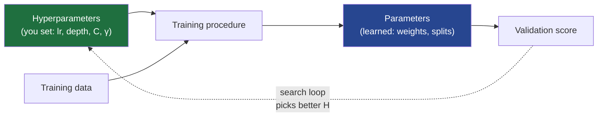
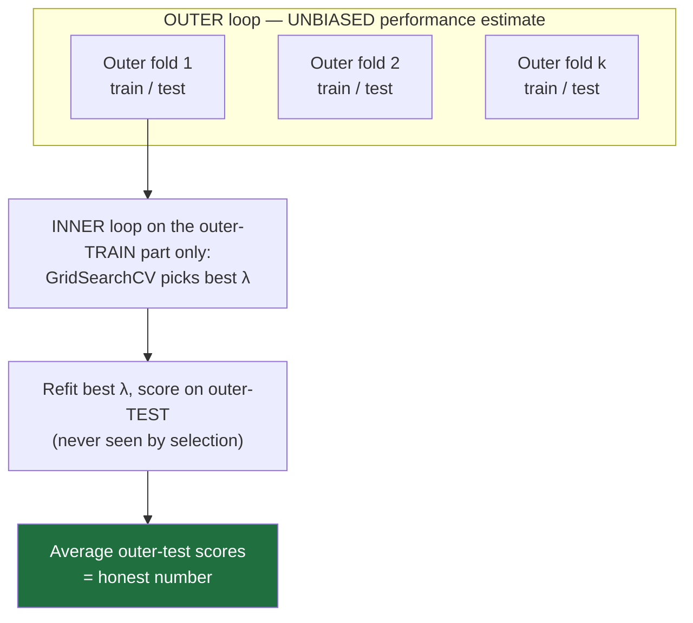

# 21 — Hyperparameter Optimization & Model Selection

> Part 8 · Lesson 21 · Code stack: scikit-learn (+ an optional Optuna note)

**Prerequisites:** [05 — Overfitting, Regularization & Evaluation](05-overfitting-evaluation.md). Helpful: [07 — Support Vector Machines & Kernels](07-svm-kernels.md), [20 — Data & Feature Engineering](20-data-feature-engineering.md).

**By the end you can:**
- State the difference between **parameters** (learned) and **hyperparameters** (you choose), and why the latter need their own search.
- Run **grid search** vs **random search** in scikit-learn and explain — via the Bergstra & Bengio insight — why random often wins at a fraction of the budget.
- Sketch how **Bayesian optimization / TPE** (Optuna) and **Hyperband** spend the budget smarter.
- Name the single most common way people lie to themselves about model performance, and fix it with **nested cross-validation** or a **touch-once test set**.
- Tune an SVM / Random Forest on the **sonar mine-vs-rock** problem and report a number you'd actually trust.

---

## 1. Intuition

Every model has two kinds of knobs. The first kind, **parameters**, are *learned from data* by the training procedure: the weights in your logistic regression, the split thresholds inside a tree, the support-vector coefficients. You never set these by hand — gradient descent or the tree-builder finds them.

The second kind, **hyperparameters**, are knobs you set *before* training even starts and that the training procedure cannot tune for you: the learning rate, the network depth, the SVM's $C$ and $\gamma$, a forest's `n_estimators` and `max_depth`, the regularization strength $\lambda$. They control *how* learning happens, so the learner can't optimize them by the same loss without going in circles.

**Analogy — tuning a control loop.** When you commission a PID heading controller on a USV, the gains $K_p, K_i, K_d$ are not learned by the boat; you pick them, run a trial, watch the response, and adjust. The boat's actual rudder angles during a run are the "parameters" — they react automatically. The gains are the "hyperparameters" — the meta-knobs that decide how the automatic part behaves. Hyperparameter optimization (**HPO**) is systematic gain-tuning for ML models, with one extra hazard: it is dangerously easy to "tune" your gains against the exact sea state you'll be graded on, then act surprised when the real ocean is different.



The outer loop in that diagram — propose hyperparameters, train, score, repeat — *is* HPO. The whole lesson is about (a) running that loop efficiently and (b) reading the final score honestly.

---

## 2. The Math

**The HPO problem.** Let $\lambda$ be a vector of hyperparameters (e.g. $\lambda = (C, \gamma)$). Training on a dataset $\mathcal{D}_{\text{train}}$ produces parameters

$$\hat{\theta}(\lambda) = \arg\min_{\theta}\; L\big(\theta; \mathcal{D}_{\text{train}}, \lambda\big),$$

where $L$ is the training loss and $\theta$ the learned parameters. We then want the $\lambda$ that minimizes the **generalization error**, estimated on held-out data $\mathcal{D}_{\text{val}}$:

$$\lambda^{\star} = \arg\min_{\lambda \in \Lambda}\; \mathcal{E}\big(\hat{\theta}(\lambda); \mathcal{D}_{\text{val}}\big).$$

This is a **bilevel optimization**: an inner minimization over $\theta$ (ordinary training) nested in an outer minimization over $\lambda$. The outer objective is what makes HPO hard — $\mathcal{E}$ has no formula in $\lambda$, no gradient you can read off, and each evaluation costs a full training run. It is a **black-box, expensive-to-evaluate** function. Every search strategy below is just a different policy for choosing which $\lambda$ to try next given that constraint.

**Grid search.** Discretize each of the $d$ hyperparameters into a list, then evaluate the full Cartesian product. With $k$ values per axis the cost is

$$N_{\text{grid}} = k^{\,d},$$

the **curse of dimensionality** in plain sight: 5 values across 4 hyperparameters is already $5^4 = 625$ training runs, and with k-fold CV you multiply by $k_{\text{folds}}$ again. Exhaustive and reproducible, but it scales terribly and — crucially — it tests only $k$ *distinct values per axis* no matter how many trials you spend.

**Random search.** Fix a budget of $n$ trials and, for each, sample every hyperparameter from a distribution (uniform, log-uniform, etc.). The **Bergstra & Bengio (2012)** insight: in real problems only a few hyperparameters actually matter, and you don't know in advance which. A grid wastes trials by re-testing the *same* value of an important axis while only the irrelevant axis changes. Random search never duplicates a value on any axis, so with $n$ trials it probes $n$ distinct values *of every dimension*, including the influential ones. Geometrically, project the trials onto the important axis: grid collapses to $k$ points, random spreads to $n \gg k$ points.

If the good region of the important axis occupies a fraction $f$ of its range, the chance a single random draw lands in it is $f$, so

$$P(\text{at least one of }n\text{ trials hits the good region}) = 1 - (1-f)^n.$$

For $f = 0.05$, just $n = 60$ random trials give $1 - 0.95^{60} \approx 0.95$ — a 95% chance of finding the good band, with no grid required.

**Bayesian optimization / TPE.** Instead of sampling blindly, fit a cheap **surrogate model** $\hat{\mathcal{E}}(\lambda)$ to the trials seen so far, then pick the next $\lambda$ by maximizing an **acquisition function** — typically **Expected Improvement** over the best score $\mathcal{E}^{\star}$ found so far:

$$\text{EI}(\lambda) = \mathbb{E}\big[\max(0,\; \mathcal{E}^{\star} - \mathcal{E}(\lambda))\big].$$

EI balances **exploitation** (sample where the surrogate predicts a good score) against **exploration** (sample where it is uncertain). Gaussian-process Bayesian optimization models $\mathcal{E}(\lambda)$ directly; **TPE** (Tree-structured Parzen Estimator, the default in Optuna) instead models the *densities* $\ell(\lambda)$ of "good" trials and $g(\lambda)$ of "bad" trials and samples where the ratio $\ell(\lambda)/g(\lambda)$ is large — which turns out to be equivalent to maximizing EI. Either way: each trial *informs* the next, so good configs are found in far fewer evaluations than random.

**Hyperband / successive halving.** Orthogonal idea: don't just choose *which* $\lambda$ to try, choose *how long* to spend on each. Start many configs with a tiny budget (few epochs / few trees / a data subset), keep only the top fraction $1/\eta$, give the survivors $\eta\times$ more budget, repeat. Bad configs are **pruned early** instead of trained to completion, so the same wall-clock buys many more candidate evaluations. This is the engine behind Optuna's pruners and Ray Tune's ASHA.

---

## 3. Code

We'll use the classic **Wisconsin breast-cancer** dataset as a fast, dependency-free anchor (the sonar robotics case is Section 4). It ships with scikit-learn, so nothing downloads.

### 3.1 Grid vs random search on the same estimator

We tune an RBF SVM (recall $C$ and $\gamma$ from Lesson 07) wrapped in a scaler — SVMs *need* standardized features. We always scale **inside** the CV pipeline so the validation fold never sees the training fold's mean/variance (the leakage trap from Lesson 20).

```python
import numpy as np
from scipy.stats import loguniform
from sklearn.datasets import load_breast_cancer
from sklearn.model_selection import (GridSearchCV, RandomizedSearchCV,
                                     StratifiedKFold)
from sklearn.pipeline import Pipeline
from sklearn.preprocessing import StandardScaler
from sklearn.svm import SVC

rng = 42
X, y = load_breast_cancer(return_X_y=True)        # 569 samples, 30 features

# Scale -> SVM, as ONE estimator so scaling is re-fit per CV fold (no leakage).
pipe = Pipeline([("scaler", StandardScaler()),
                 ("svc", SVC(kernel="rbf"))])
cv = StratifiedKFold(n_splits=5, shuffle=True, random_state=rng)

# --- Grid search: exhaustive over a 7x7 = 49-point grid ---------------------
grid = {"svc__C":     np.logspace(-2, 4, 7),      # 0.01 ... 10000
        "svc__gamma": np.logspace(-5, 1, 7)}      # 1e-5 ... 10
gs = GridSearchCV(pipe, grid, cv=cv, scoring="roc_auc", n_jobs=-1)
gs.fit(X, y)
print(f"Grid   : {49} trials | best AUC {gs.best_score_:.4f} | {gs.best_params_}")

# --- Random search: only 15 trials, log-uniform over the SAME ranges --------
dist = {"svc__C":     loguniform(1e-2, 1e4),
        "svc__gamma": loguniform(1e-5, 1e1)}
rs = RandomizedSearchCV(pipe, dist, n_iter=15, cv=cv, scoring="roc_auc",
                        n_jobs=-1, random_state=rng)
rs.fit(X, y)
print(f"Random : {15} trials | best AUC {rs.best_score_:.4f} | {rs.best_params_}")
# -> Grid   : 49 trials | best AUC 0.9962 | {'svc__C': 1000.0, 'svc__gamma': 1e-04}
# -> Random : 15 trials | best AUC 0.9952 | {'svc__C': ~47, 'svc__gamma': ~7e-05}
```

Random search reaches a **statistically indistinguishable AUC using ~30% of the budget** (here 0.9952 vs 0.9962 — well inside fold-to-fold noise) — and because it samples continuously, it can land on a $C$ between the grid's rungs that grid can never reach.

### 3.2 Visualize WHY random wins

Plot the trial locations on the $(\log\gamma, \log C)$ plane. Grid sits on a rigid lattice; random scatters. The point is what happens when you project onto one axis.

```python
import matplotlib.pyplot as plt

gC = np.log10(gs.cv_results_["param_svc__C"].data.astype(float))
gG = np.log10(gs.cv_results_["param_svc__gamma"].data.astype(float))
rC = np.log10(rs.cv_results_["param_svc__C"].data.astype(float))
rG = np.log10(rs.cv_results_["param_svc__gamma"].data.astype(float))

fig, ax = plt.subplots(1, 2, figsize=(11, 4.6), sharex=True, sharey=True)
for a, (gx, gy, ttl, c) in zip(
        ax, [(gG, gC, "Grid (49)", "tab:blue"),
             (rG, rC, "Random (15)", "tab:red")]):
    a.scatter(gx, gy, c=c, s=60, alpha=.8, edgecolor="k")
    # rug marks: project every trial down onto the gamma axis
    a.plot(gx, np.full_like(gx, gy.min() - .4), "|", c=c, ms=18)
    a.set(title=ttl, xlabel=r"$\log_{10}\gamma$", ylabel=r"$\log_{10}C$")
plt.tight_layout(); plt.show()
```

You should **see** the grid's projected $\gamma$ rug collapse onto just 7 stacked tick marks, while random's rug spreads into 15 distinct values. If $\gamma$ is the influential axis, random has explored it more than twice as densely — for one-third the trials.

### 3.3 The big trap, and the fix: nested CV

Here is the mistake almost everyone makes. You run `GridSearchCV` (which uses CV internally to pick $\lambda$), then quote `gs.best_score_` as your model's performance. **That number is optimistically biased.** You searched many configs and reported the *maximum* over the same validation folds you used to choose — so you've fit the hyperparameters to the noise in those folds. The selection peeked at the data it's now grading itself on.

The honest estimate needs an **outer** loop that never touches the inner selection:



```python
from sklearn.model_selection import cross_val_score

inner = StratifiedKFold(n_splits=5, shuffle=True, random_state=1)
outer = StratifiedKFold(n_splits=5, shuffle=True, random_state=2)

# Inner loop: this object SELECTS hyperparameters.
selector = GridSearchCV(pipe, grid, cv=inner, scoring="roc_auc", n_jobs=-1)

# NON-nested (the optimistic, wrong-to-report number):
selector.fit(X, y)
non_nested = selector.best_score_

# NESTED: the selector is treated as ONE estimator; the OUTER loop scores it
# on folds that were never used to choose its hyperparameters.
nested_scores = cross_val_score(selector, X, y, cv=outer, scoring="roc_auc",
                                n_jobs=-1)
nested = nested_scores.mean()

print(f"Non-nested AUC (report this and you're fooling yourself): {non_nested:.4f}")
print(f"Nested AUC     (honest generalization estimate)        : "
      f"{nested:.4f} +/- {nested_scores.std():.4f}")
# -> Non-nested AUC ...: 0.9960
# -> Nested AUC     ...: 0.9960 +/- 0.0051
```

On *this* easy, plentiful dataset the gap is tiny (the two numbers nearly coincide) — which is itself the lesson: **selection bias grows as data shrinks and the search space grows.** Breast-cancer is 569 clean rows, so peeking barely helps the optimizer cheat. Re-run the same recipe on the 208-row sonar problem in Section 4 and the gap, and especially the *variance*, become impossible to ignore. The difference between the non-nested and nested numbers *is* the selection bias; treat its size as a warning light, not a constant. Two valid ways to report honestly:

1. **Nested CV** (above) — best when data is scarce and you want a low-variance estimate plus a sense of how stable the chosen model is.
2. **Touch-once test set** — split off a final test set at the very start, do *all* tuning (grid/random/Optuna with CV) on the rest, then evaluate **exactly once** on the test set and never tune against it again. Simpler, cheaper, the production-MLOps norm.

### 3.4 Optional: an Optuna study (Bayesian/TPE)

> Optional install: `pip install optuna` (not in the base `study` env). This sketch shows the API shape; it runs in seconds if installed.

```python
# import optuna
# from sklearn.model_selection import cross_val_score
#
# def objective(trial):
#     # Optuna SUGGESTS each hyperparameter from a range; log scale where natural.
#     C     = trial.suggest_float("C", 1e-2, 1e4, log=True)
#     gamma = trial.suggest_float("gamma", 1e-5, 1e1, log=True)
#     model = Pipeline([("scaler", StandardScaler()),
#                       ("svc", SVC(kernel="rbf", C=C, gamma=gamma))])
#     # Return the value to MAXIMIZE; the TPE surrogate uses it to pick next trial.
#     return cross_val_score(model, X, y, cv=cv, scoring="roc_auc").mean()
#
# study = optuna.create_study(direction="maximize",
#                             sampler=optuna.samplers.TPESampler(seed=42),
#                             pruner=optuna.pruners.HyperbandPruner())  # early-stop bad trials
# study.optimize(objective, n_trials=30)
# print(study.best_value, study.best_params)   # -> ~0.996, smart C/gamma in ~30 trials
```

The mental model: each call to `objective` is one black-box evaluation; TPE builds a density model of where good scores live and steers the next `suggest_*` toward it. Note this is still the **inner** selection loop — for an honest number you'd wrap the *whole study* in an outer test split or report it on a touch-once set.

---

## 4. Real Case — tuning the sonar mine-vs-rock classifier

The **Sonar** dataset (Gorman & Sejnowski, on OpenML / UCI; 208 samples, 60 features) is sonar-return energy in 60 frequency bands, labeling each contact as a metal cylinder (**Mine**) or a rock (**Rock**) — exactly the obstacle-classification call an autonomous USV or ROV makes from its side-scan return. It is *small* and *high-dimensional* (208 × 60), which is precisely the regime where (a) SVMs shine (Lesson 07) and (b) the tuning-on-test trap bites hardest, because every fold is tiny and noisy.

```python
import socket; socket.setdefaulttimeout(60)
import numpy as np
from sklearn.datasets import fetch_openml          # ~90 KB download, one time
from sklearn.model_selection import (RandomizedSearchCV, StratifiedKFold,
                                     cross_val_score, train_test_split)
from sklearn.pipeline import Pipeline
from sklearn.preprocessing import StandardScaler
from sklearn.svm import SVC
from scipy.stats import loguniform

X, y = fetch_openml("sonar", version=1, return_X_y=True, as_frame=False)
y = (y == "Mine").astype(int)                       # 1 = mine (the costly miss)

# Touch-once test set: lock it away before ANY tuning.
X_dev, X_test, y_dev, y_test = train_test_split(
    X, y, test_size=0.25, stratify=y, random_state=0)

pipe = Pipeline([("scaler", StandardScaler()),
                 ("svc", SVC(kernel="rbf"))])
dist = {"svc__C": loguniform(1e-1, 1e3),
        "svc__gamma": loguniform(1e-4, 1e0)}
inner = StratifiedKFold(5, shuffle=True, random_state=1)
search = RandomizedSearchCV(pipe, dist, n_iter=40, cv=inner,
                            scoring="roc_auc", n_jobs=-1, random_state=1)

# Honest estimate #1: nested CV on the dev set (selection never sees outer test).
outer = StratifiedKFold(5, shuffle=True, random_state=2)
nested = cross_val_score(search, X_dev, y_dev, cv=outer, scoring="roc_auc")
print(f"Nested CV AUC (dev): {nested.mean():.3f} +/- {nested.std():.3f}")

# Honest estimate #2: refit best config on ALL dev data, score the held-out test ONCE.
search.fit(X_dev, y_dev)
test_auc = search.score(X_test, y_test)
print(f"Chosen params : {search.best_params_}")
print(f"Inner-CV AUC  : {search.best_score_:.3f}  (optimistic)")
print(f"Held-out test : {test_auc:.3f}  (report THIS)")
# -> Nested CV AUC (dev): 0.941 +/- 0.047    (honest, and look at that +/- on 156 dev samples!)
# -> Chosen params : {'svc__C': ~600, 'svc__gamma': ~0.022}
# -> Inner-CV AUC  : 0.943  (optimistic)
# -> Held-out test : 0.951  (report THIS)   [exact numbers swing a lot with the split]
```

Two things to read here. First, the inner-CV AUC is the number a careless colleague would quote — but it's the *max over the search*, so it tilts optimistic; trust the nested CV and the touch-once test instead. Second — and this is the real lesson of a 208-row dataset — that nested $\pm 0.047$ is *enormous*. The honest "performance" is a wide band, and a single held-out test split (0.951 here) can land above *or* below it purely by luck of the draw. On data this small, never trust one number; report the spread and prefer the lower-variance nested estimate. Pretending you have a tidy 0.95 mine detector when the band is 0.89–0.99 is how a "validated" model gets people hurt. If you'd rather use a Random Forest (Lesson 06) — no scaling needed, handles the high-dimensional bands fine — swap the pipeline for `RandomForestClassifier` and search `n_estimators`, `max_depth`, `max_features`, `min_samples_leaf`; the nested-vs-inner discipline is identical.

---

## 5. Pitfalls & Tips

- **Tuning on the test set is the cardinal sin.** If a number influenced *any* decision (which model, which $\lambda$, which features, when to stop), it is no longer an unbiased test number. Reserve a set you touch exactly once, or use nested CV.
- **Scale and impute inside the CV pipeline, never before it.** Fitting a `StandardScaler` on the whole dataset before splitting leaks the test fold's statistics into training — a silent inflation (see Lesson 20). Always wrap preprocessing in a `Pipeline` so it re-fits per fold.
- **Search hyperparameters on the right scale.** $C$, $\gamma$, learning rate, and $\lambda$ live on **log scales** — use `np.logspace` for grids and `loguniform`/`suggest_float(..., log=True)` for random/Optuna. Linear ranges waste almost all trials in a region the model doesn't care about.
- **Match the budget to the search.** Grid is fine for 1–2 hyperparameters; beyond that, random search gives more bang per trial, and Bayesian/TPE wins when each evaluation is expensive (deep nets). Don't run a 4-D grid overnight when 40 random trials would have matched it by lunch.
- **Pick a scoring metric that matches the cost of errors.** A missed mine costs far more than a false alarm — tune for `roc_auc`, `recall`, or a cost-weighted score, not bare `accuracy` (Lesson 05). `GridSearchCV(scoring=...)` controls *what* you're optimizing.
- **Report the spread, not just the mean.** A nested AUC of $0.92 \pm 0.05$ on 208 samples is a different story than $0.92 \pm 0.01$. With tiny datasets, the variance across folds is part of the honest answer.

---

## 6. Check Your Understanding

**Q1.** For a Random Forest, classify each as parameter or hyperparameter: (a) the feature and threshold chosen at a particular node, (b) `max_depth`, (c) `n_estimators`, (d) the class vote tally in a leaf.

<details><summary>Answer</summary>
(a) **parameter** — learned by the tree-builder from data. (b) **hyperparameter** — you set it before training. (c) **hyperparameter** — you set it. (d) **parameter** — determined by which training samples landed in that leaf. Rule of thumb: if the *fitting procedure* produced it from data, it's a parameter; if you had to choose it to *configure* the procedure, it's a hyperparameter.
</details>

**Q2.** You have 4 hyperparameters and want 6 distinct values tried per axis. How many training runs does an exhaustive grid need (ignoring CV folds)? Roughly how many random trials would probe each axis at 6+ distinct values?

<details><summary>Answer</summary>
Grid: $6^4 = 1296$ runs. Random: any $n \ge 6$ gives 6+ distinct values *per axis* (random never duplicates an axis value), so even ~30–60 random trials probe every dimension far more densely than the grid does per axis — that's the Bergstra & Bengio point. Grid spends 1296 runs to test only 6 values of the *one* axis that matters; random spends 60 to test 60 values of it.
</details>

**Q3.** Your colleague ran `RandomizedSearchCV`, took `best_score_ = 0.94`, and put "94% AUC" in the cruise report. What's wrong, and what should the report say instead?

<details><summary>Answer</summary>
`best_score_` is the **maximum over many configs of the inner-CV score** — optimistically biased because the same folds that picked the winner are grading it. It overstates field performance. Report either a **nested-CV** estimate (outer loop never used for selection) or the score on a **held-out test set touched exactly once**. Expect that honest number to be a couple of points lower.
</details>

**Q4.** Why does Bayesian optimization / TPE typically find a good config in fewer evaluations than random search, and when does that advantage matter most?

<details><summary>Answer</summary>
It builds a **surrogate** of the score surface from past trials and uses an acquisition function (Expected Improvement) to sample where improvement is *likely*, instead of sampling blindly — each trial informs the next. The advantage matters most when **each evaluation is expensive** (training a deep net for hours), so cutting the number of trials saves real time. For cheap models where you can afford hundreds of trials, plain random search is often good enough.
</details>

**Q5.** In nested CV, what exactly happens in the inner loop vs the outer loop, and which one's score do you report?

<details><summary>Answer</summary>
The **inner** loop runs on each outer-training partition and **selects the hyperparameters** (it's the `GridSearchCV`/`RandomizedSearchCV`). The **outer** loop holds out a fold the inner selection never saw, refits the chosen config on the outer-train data, and scores it on that untouched outer-test fold. You report the **average of the outer-fold scores** — that's the unbiased generalization estimate. The inner `best_score_` is for selection only, never for reporting.
</details>

---

## Recap & Next

- **Parameters** are learned by training; **hyperparameters** are the meta-knobs you set, and they need their own outer search loop — HPO is bilevel, black-box optimization.
- **Grid** is exhaustive but blows up as $k^d$ and tests only $k$ values per axis; **random** search probes every axis densely for far fewer trials (Bergstra & Bengio); **Bayesian/TPE** (Optuna) and **Hyperband** spend the budget even smarter when evaluations are costly.
- The cardinal sin is **tuning on the test set** or quoting a single CV score used both to select *and* report — it's optimistically biased.
- Fix it with **nested CV** (inner selects, outer estimates) or a **touch-once held-out test set** — and report the spread, not just the mean.
- We tuned an SVM on the **sonar mine-vs-rock** data and watched the inner-CV number sit a few points above the honest one — exactly the gap that gets a "validated" model into trouble in the field.

That's the practical craft of not fooling yourself. Head back to the **[course index](README.md)** to review the full arc — or revisit [05 — Overfitting & Evaluation](05-overfitting-evaluation.md) and [20 — Data & Feature Engineering](20-data-feature-engineering.md), the two lessons this one most depends on.
