# Machine Learning & Deep Learning — Beginner to Master

A from-scratch, math-first course that takes you from "what even *is* a model?" to building Transformers, training control policies with reinforcement learning, and shipping perception models to production. It's written for a learner who likes math and works on autonomous vehicles and ROS2 — USVs, UAVs, ROVs — so the worked examples are dock detection, fault sensing, IMU/trajectory forecasting, and obstacle classification rather than yet another iris dataset.

Every concept follows the same arc: **Intuition → Math → Code → Real case.** You build the intuition first, see the equations that make it precise, implement it (often from scratch in NumPy), and then ground it in a robotics problem you'd actually face.

---

## How to use this course

Read the **22 lessons in order** (`00` → `21`). Each builds on the previous one — the from-scratch NumPy work in Parts 1–3 is exactly what PyTorch automates later, and skipping ahead means skipping the "why."

Every lesson shares the same **6-section structure**:

1. **Intuition** — the plain-language picture and why the idea exists.
2. **The Math** — the equations, derived rather than dropped on you.
3. **Code** — a runnable implementation you can paste into the `study` env.
4. **Real case** — a USV/UAV/ROV application of the idea.
5. **Pitfalls & tips** — the mistakes that bite in practice.
6. **Recap & what's next** — the through-line into the following lesson (often with a self-test).

A few conventions:

- **Math renders as GitHub LaTeX** — inline `$...$` and block `$$...$$` math display natively on GitHub, so read these lessons on GitHub (or any GitHub-flavored-Markdown viewer with math support).
- **Code progresses deliberately:** **NumPy-from-scratch → scikit-learn → PyTorch.** Early lessons make you build the gradients by hand; the classical-ML lessons lean on scikit-learn; the neural-network lessons graduate to PyTorch once you've earned it.
- All code is meant to run in the **conda environment named `study`** (see Setup).

---

## Setup

All code runs inside the conda env named **`study`**:

```bash
conda activate study
```

Then install the stack:

```bash
# core scientific + classical ML
pip install numpy matplotlib scikit-learn pandas

# deep learning
pip install torch torchvision

# notebooks
pip install jupyter
```

If you prefer conda for the scientific core:

```bash
conda activate study
conda install numpy matplotlib scikit-learn pandas jupyter
pip install torch torchvision   # follow pytorch.org for your CUDA/MPS build
```

> The PyTorch lessons auto-select GPU/MPS/CPU via `.to(device)`, so the code runs on an Apple-silicon laptop, an NVIDIA box, or plain CPU — just slower.

---

## Learning roadmap

```mermaid
flowchart TD
    subgraph P0["Part 0 · Foundations"]
        L00["00 · What Is ML?"]
        L01["01 · Math Toolbox"]
    end
    subgraph P1["Part 1 · Supervised from Scratch"]
        L02["02 · Linear Regression"]
        L03["03 · Gradient Descent ★"]
        L04["04 · Logistic Regression"]
        L05["05 · Overfitting & Evaluation"]
    end
    subgraph P2["Part 2 · Classical ML"]
        L06["06 · k-NN, Trees & Ensembles"]
        L07["07 · SVMs & Kernels"]
        L08["08 · k-Means & PCA"]
    end
    subgraph P3["Part 3 · Neural Networks"]
        L09["09 · Neural Nets & Forward Pass"]
        L10["10 · Backpropagation ★"]
        L11["11 · PyTorch Fundamentals"]
        L12["12 · Training Deep Nets"]
    end
    subgraph P4["Part 4 · Architectures"]
        L13["13 · CNNs"]
        L14["14 · RNNs & LSTMs"]
        L15["15 · Attention & Transformers"]
    end
    subgraph P5["Part 5 · Master Topics"]
        L16["16 · Generative Models"]
        L17["17 · Transfer Learning, LLMs & MLOps"]
    end
    subgraph P6["Part 6 · Decision & Control"]
        L18["18 · Reinforcement Learning ◆"]
    end
    subgraph P7["Part 7 · Perception"]
        L19["19 · Detection & Segmentation"]
    end
    subgraph P8["Part 8 · Practical Craft"]
        L20["20 · Data & Feature Engineering"]
        L21["21 · Hyperparameter Optimization"]
    end

    L00 --> L01 --> L02 --> L03 --> L04 --> L05
    L05 --> L06 --> L07 --> L08
    L08 --> L09 --> L10 --> L11 --> L12
    L12 --> L13 --> L14 --> L15
    L15 --> L16 --> L17
    L17 --> L18 --> L19 --> L20 --> L21

    style L03 fill:#ffe08a,stroke:#d4a017,stroke-width:2px
    style L10 fill:#ffe08a,stroke:#d4a017,stroke-width:2px
    style L18 fill:#bfe3c0,stroke:#3a8a4f,stroke-width:2px
```



---

## Table of contents

### Part 0 · Foundations

- [00 · What Is Machine Learning?](00-what-is-ml.md) — AI vs ML vs DL, the three learning paradigms, the end-to-end workflow, and when ML is (and isn't) the right tool.
- [01 · The Math Toolbox](01-math-foundations.md) — The minimum linear algebra, calculus, and probability used throughout the course, built from scratch in NumPy with geometric intuition and robotics examples.

### Part 1 · Supervised from Scratch

- [02 · Linear Regression](02-linear-regression.md) — The simplest predictor: fit `y = Xw + b` by minimizing MSE, solved in closed form via the normal equation and understood geometrically as projecting the target onto the column space.
- [03 · Gradient Descent](03-gradient-descent.md) — The optimization engine of ML — rolling downhill on a loss surface via `θ := θ − α∇J`, built from scratch with learning-rate diagnostics, GD variants, and why iterative GD beats matrix inversion in high dimensions.
- [04 · Logistic Regression & Classification](04-logistic-regression.md) — Turn the linear model into a classifier with the sigmoid, train it with binary cross-entropy whose gradient is the same clean `Xᵀ(ŷ−y)`, and read off a linear decision boundary.
- [05 · Overfitting, Regularization & Evaluation](05-overfitting-evaluation.md) — Why models that ace training data fail in the wild — the bias-variance tradeoff, train/val/test splits, k-fold CV, L1/L2 regularization, and choosing metrics that don't lie on imbalanced data.

### Part 2 · Classical ML

- [06 · k-NN, Decision Trees & Ensembles](06-knn-trees-ensembles.md) — Non-parametric and tree-based models: k-NN with distance metrics and the curse of dimensionality, decision trees via Gini/entropy information gain, and ensembles (Random Forests, Gradient Boosting) compared in scikit-learn.
- [07 · Support Vector Machines & Kernels](07-svm-kernels.md) — Max-margin classification, support vectors, the soft-margin hinge loss with C, and the kernel trick (linear/poly/RBF, gamma) — visualized on two-moons and applied to small-sample acoustic fault detection.
- [08 · Unsupervised Learning: k-Means & PCA](08-kmeans-pca.md) — Learn structure without labels: k-Means clustering (Lloyd loop, WCSS, choosing k) and PCA (max-variance directions via covariance eigenvectors), applied to ROV behavior modes and sensor compression.

### Part 3 · Neural Networks

- [09 · Neural Networks & the Forward Pass](09-neural-networks-mlp.md) — How a neuron generalizes linear models, why stacking them with non-linear activations unlocks curved boundaries, and how to implement the forward pass from scratch in NumPy.
- [10 · Backpropagation from Scratch](10-backpropagation.md) — Derive and implement backpropagation by hand — the chain rule applied layer by layer — then train a from-scratch NumPy MLP on two-moons and verify the gradients numerically.
- [11 · PyTorch Fundamentals](11-pytorch-fundamentals.md) — Graduate from NumPy-by-hand to PyTorch: tensors and GPU, autograd that recomputes lesson 10's exact gradients, `nn.Module` models, optimizers, and the canonical training loop.
- [12 · Training Deep Networks That Actually Converge](12-training-deep-nets.md) — The practical craft: optimizers (momentum/RMSProp/Adam), init (Xavier/He), vanishing/exploding gradients, batch vs layer norm, regularization, LR schedules, and reading loss/val curves.

### Part 4 · Architectures

- [13 · Convolutional Neural Networks](13-cnns.md) — Why dense nets fail on images and how convolution, pooling, and the conv-relu-pool stack build translation-invariant feature hierarchies, trained on CIFAR-10 in PyTorch.
- [14 · Sequence Models: RNNs & LSTMs](14-rnns-lstms.md) — How networks gain memory for sequences — the recurrent hidden state, backprop-through-time and vanishing gradients, LSTM/GRU gates, and a working PyTorch sensor-signal forecaster.
- [15 · Attention & Transformers](15-attention-transformers.md) — Builds the attention mechanism and the full Transformer block from scratch in PyTorch — queries/keys/values, scaled dot-product attention, multi-head, positional encodings, and the encoder/decoder split that powers modern LLMs.

### Part 5 · Master Topics

- [16 · Generative Models: Autoencoders, VAEs, GANs & Diffusion](16-generative-models.md) — Climb the generative ladder — autoencoders, VAEs, GANs, and diffusion — and build a PyTorch autoencoder that reconstructs MNIST and flags anomalies via reconstruction error.
- [17 · Transfer Learning, LLMs & Putting Models in Production](17-transfer-learning-llms-mlops.md) — The capstone: reuse pretrained models via transfer learning and fine-tuning, understand LLMs as scaled Transformers, and ship models reliably with MLOps discipline.

### Part 6 · Decision & Control

- [18 · Reinforcement Learning](18-reinforcement-learning.md) — Learn to act by trial and error: MDPs, value/Q functions, the Bellman equation, ε-greedy exploration, and tabular Q-learning from scratch on a USV docking gridworld — plus DQN and policy-gradient intuition. **The bridge to vehicle control.**

### Part 7 · Perception

- [19 · Object Detection & Segmentation](19-detection-segmentation.md) — Beyond "what" to "where": bounding-box detection (IoU, anchors, NMS, mAP; one- vs two-stage) and semantic/instance segmentation with the U-Net, run via a pretrained torchvision detector — for USV/UAV obstacle perception.

### Part 8 · Practical Craft

- [20 · Data & Feature Engineering](20-data-feature-engineering.md) — The unglamorous 80%: missing-data imputation, categorical encoding, class imbalance (SMOTE/class weights), data leakage, and leakage-free scikit-learn Pipelines with ColumnTransformer.
- [21 · Hyperparameter Optimization & Model Selection](21-hyperparameter-optimization.md) — Tune systematically — grid vs random vs Bayesian (Optuna) search — and use nested cross-validation so you don't fool yourself about generalization.

---

## ★ The two load-bearing lessons

If you internalize nothing else, internalize these two — every later lesson rests on them:

- **[03 · Gradient Descent](03-gradient-descent.md)** — the *optimization* pillar. Every model in this course, from linear regression to a Transformer, is trained by some descendant of `θ := θ − α∇J`. Understand this and training stops being magic.
- **[10 · Backpropagation](10-backpropagation.md)** — the *gradient* pillar. It's how `∇J` actually gets computed in a deep net, and it's *exactly* what `loss.backward()` automates in PyTorch. Build it by hand once and autograd will never feel like a black box again.

Everything in Parts 4 and 5 is, mechanically, "stack a new architecture, then apply 03 and 10."

---

## Appendix

- **[Math cheatsheet](appendix-math-cheatsheet.md)** — a quick reference for the formulas used across all 22 lessons — linear algebra, calculus, probability, losses, optimizers, RL, and detection metrics.

---

Begin at **[00 · What Is Machine Learning?](00-what-is-ml.md)**
