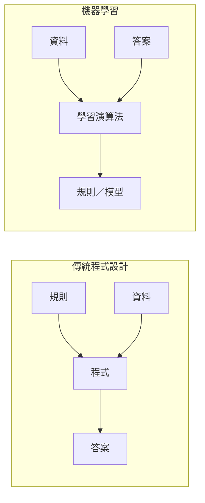
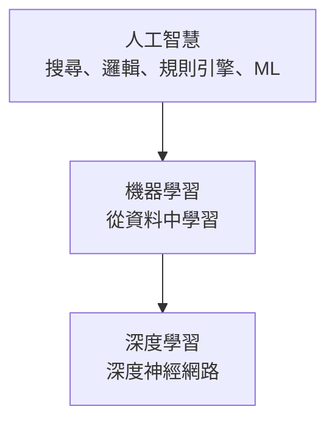
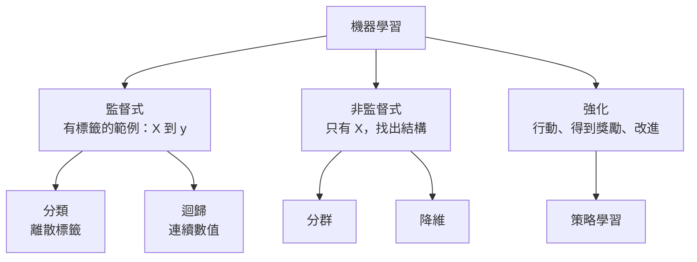
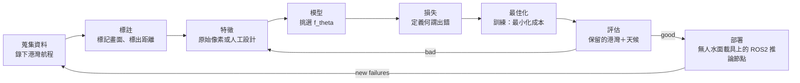

# 00 — 什麼是機器學習？

> 第 0 部分 · 第 00 課 · 程式技術棧：numpy-from-scratch

**先備知識：** 無 — 從這裡開始。

**學完本課你能：**
- 區分 **AI**、**ML** 與 **DL**，並說出各自所處的層次。
- 說出三種學習範式（**監督式**、**非監督式**、**強化**），並為一個問題挑出正確的那一種。
- 追蹤從原始資料到部署模型的**端到端 ML 工作流程**。
- 判斷何時 ML 是對的工具 — 以及何時一個單純的 `if` 敘述就贏過它。
- 把一個真實的機器人任務（無人水面載具的碼頭偵測／避障）框架化為一個 ML 問題：輸入、輸出、範式。

---

## 1. 直覺理解

傳統程式設計與機器學習從相反的兩端解決同一類問題。

在**傳統程式設計**中，是*你*寫下規則。「如果聲納回波距離小於 3 公尺，就向右舵轉向。」你知道邏輯、你把它打出來、電腦執行它。輸出是你所撰寫規則的*結果*。

在**機器學習**中，你不寫規則。你交給機器一堆**範例** — 一對對的（情境、正確答案）— 然後由一個演算法去搜尋最能重現那些答案的規則。這些規則（稱為**模型**）是被*發掘*出來的，而非被撰寫出來的。



我喜歡的比喻是：**傳統程式設計是寫一份食譜；ML 是品嚐一萬道菜並反推出食譜。**當你已經知道怎麼做這道菜時，你會去寫食譜。當這道菜微妙到無法用文字描述時，你會去品嚐並反推 — 例如「在霧氣、眩光與浪湧中，碼頭在相機畫面裡*看起來*是什麼樣子？」沒有人能手寫出那個 `if` 敘述。這就是 ML 填補的缺口。

**AI vs ML vs DL。**這些詞在行銷中被混用；它們其實不一樣。

- **人工智慧 (Artificial Intelligence, AI)** — 讓機器做出看起來有智慧的事這個廣泛目標。包含 ML，但也包含手寫邏輯、搜尋演算法（用於路徑規劃的 A\* 是 AI，而且其中*完全沒有*學習成分）以及規則引擎。
- **機器學習 (Machine Learning, ML)** — AI 的子集合，其行為是*從資料中學來的*，而非手寫的。
- **深度學習 (Deep Learning, DL)** — ML 的子集合，使用具有許多層的**神經網路**。它仍然是「從資料中學規則」，但模型是一個堆疊得很深的函數，強大到足以學出自己的特徵。（我們從第 [09](09-neural-networks-mlp.md) 課開始建構這些。）



一個好用的檢驗法：你的 A\* 路徑規劃器與你的 PID 控制器是 AI／控制，**不是** ML — 其中沒有任何東西被學習。一個從過去的慣性測量單元 (IMU) 加 GPS 資料來預測當前漂流的模型*才是* ML。

### 三種學習範式

機器如何學習，取決於它得到什麼樣的回饋。



- **監督式學習 (supervised learning)** — 你同時擁有輸入**與**正確答案（**標籤**）。模型學習輸入 → 標籤的映射。又分為**分類**（標籤是一個類別：「碼頭」／「浮標」／「開闊水域」）與**迴歸**（標籤是一個數字：「到障礙物的距離，以公尺計」）。這是第 02–13 課的大部分內容。
- **非監督式學習 (unsupervised learning)** — 你有輸入，但*沒有*答案。模型自行找出結構：把相似的光達掃描分組（**分群**），或把一個 64 通道的聲納陣列壓縮成 3 個有意義的軸（**降維**）。第 [08](08-kmeans-pca.md) 課。
- **強化學習 (reinforcement learning, RL)** — 一個**代理人**在環境中採取動作，收到一個純量**獎勵**，並學出一個能最大化長期獎勵的**策略**。這正是你會用來訓練無人水面載具在水流中定點保持、或讓無人機降落的方法。每一步沒有固定的「正確答案」 — 只有延遲的獎勵。（超出本課程核心範圍，但你會認得它。）

一個快速的決策規則：*我有帶標籤的答案嗎？→ 監督式。只有原始資料、想找出結構？→ 非監督式。一個代理人隨時間行動以換取獎勵？→ 強化。*

---

## 2. 數學原理

這裡的數學刻意保持輕量 — 第 [01](01-math-foundations.md) 課才會建立真正的工具箱。但監督式學習的核心*框架*值得用一組符號交代清楚，因為後面每一課都是它的一種變化。

我們想學習一個函數

$$
f_\theta : \mathcal{X} \rightarrow \mathcal{Y}
$$

其中 $\mathcal{X}$ 是**輸入空間**（例如所有可能的聲納讀數），$\mathcal{Y}$ 是**輸出空間**（例如以公尺計的距離，或類別的集合），而 $\theta$（theta）是**參數**向量 — 也就是學習過程要調整的那些數字。單一個輸入是 $x \in \mathcal{X}$；它的真實答案是 $y \in \mathcal{Y}$；模型的猜測是 $\hat{y} = f_\theta(x)$（讀作「y-hat」）。

我們得到一個由 $n$ 個帶標籤範例組成的**訓練集**：

$$
\mathcal{D} = \{(x^{(1)}, y^{(1)}), \dots, (x^{(n)}, y^{(n)})\}
$$

上標 $(i)$ 是範例的索引（它*不是*指數）。每個 $x^{(i)}$ 通常是一個**特徵**向量 — 也就是測得的量，例如 $[\text{range}, \text{intensity}, \text{bearing}]$。

為了說出一個猜測有多*錯*，我們定義一個**損失函數** $\ell(\hat{y}, y)$，當猜得好時它很小、當猜得差時它很大。把損失在整個訓練集上取平均，就得到**成本**（或稱**經驗風險**）：

$$
J(\theta) = \frac{1}{n} \sum_{i=1}^{n} \ell\big(f_\theta(x^{(i)}),\, y^{(i)}\big)
$$

這從何而來？它就只是「在我看過的資料上平均犯的錯」。對迴歸來說，一個經典選擇是**平方誤差** $\ell(\hat{y}, y) = (\hat{y} - y)^2$（重重懲罰大幅偏離）；對分類，我們會在第 [04](04-logistic-regression.md) 課使用不同的損失。

**訓練** = 求解這個最佳化問題

$$
\theta^{*} = \arg\min_{\theta} \; J(\theta)
$$

也就是找出使平均損失最小的那組參數。我們會在第 [03](03-gradient-descent.md) 課用**梯度下降**來做這件事。**推論** = 在一個*新的* $x$ 上使用訓練好的 $f_{\theta^{*}}$ 來得到 $\hat{y}$。

整場遊戲用一句話講完：**挑一個模型族 $f_\theta$、定義一個損失，然後在 $\theta$ 上搜尋以最小化平均損失 — 同時確保它在你沒看過的資料上仍然管用。**最後那個子句就是**泛化**，也是難的部分。

> **泛化**是「死背訓練集」與「真正學到規律」之間的差別。一個在訓練資料上拿到滿分、卻在新資料上失敗的模型，就是**過度擬合** — 它把雜訊都背了下來。第 [05](05-overfitting-evaluation.md) 課完全在講如何量測並修正這件事。

---

## 3. 程式碼

還沒有真正的訓練 — 那從第 02 課開始。這裡的目標是用一個極小的 `numpy` 範例把那個*迴圈*具體化，好讓這些詞彙不再抽象。我們會擬合一個盡可能簡單的模型 — 一個單一數字，也就是平均 — 來配適資料，做法是字面上地逐一嘗試各個值並觀察損失。

```python
import numpy as np

# ---- 1. DATA --------------------------------------------------------------
# 假裝一台無人水面載具在 8 個時刻量測了「到最近障礙物的距離」（公尺）。
# 在監督式學習中，這些會是「標籤」(y)。這裡為了把它弄到最精簡，
# 我們的「模型」沒有輸入 x — 它只是對所有情況都預測同一個常數值。
y = np.array([12.1, 11.8, 13.0, 12.5, 11.2, 12.9, 12.3, 12.7])

# ---- 2. MODEL -------------------------------------------------------------
# 我們的模型族很簡單：f_theta(x) = theta，只有單一個參數。
# 「每次都預測同一個數字。」theta 就是我們試圖要學的東西。
def model(theta):
    return theta  # 刻意忽略輸入；這是最簡單可能的 f_theta

# ---- 3. LOSS / COST -------------------------------------------------------
# 均方誤差：所有範例上 (prediction - truth)^2 的平均。
def cost(theta, y):
    preds = model(theta)            # 一個數字，會與所有 y 廣播相減
    return np.mean((preds - y) ** 2)

# ---- 4. "OPTIMIZE" (brute-force search, just to SEE the minimum) ----------
# 真正的 ML 使用梯度下降（第 03 課）。這裡我們掃描候選的 theta。
candidates = np.linspace(10.0, 14.0, 401)     # 從 10 到 14 的 401 個猜測
costs = np.array([cost(t, y) for t in candidates])

best_idx   = np.argmin(costs)                  # 最小成本的索引
theta_star = candidates[best_idx]              # 學到的參數
print(f"learned theta*: {theta_star:.3f}")     # -> learned theta*: 12.310
print(f"min cost:       {costs[best_idx]:.3f}")# -> min cost:       0.319

# 檢驗：對 MSE 而言，最佳的常數正好就是 y 的平均。
print(f"mean of y:      {y.mean():.3f}")       # -> mean of y:      12.312
```

`theta_star` 正好落在 `y.mean()` 上 — 這不是巧合。對於使用平方誤差損失的常數模型，成本 $J(\theta) = \frac{1}{n}\sum (\theta - y^{(i)})^2$ 在 $\theta$ 上是一條拋物線；把它的導數設為零會得到 $\theta^{*} = \bar{y}$，也就是平均。你剛剛用暴力法做完了你的第一道 ML 數學，而解析解也與之吻合。那個「有個底部的拋物線」形狀，正是第 03 課裡梯度下降要*往下滾*的東西。

現在來把**損失地形 (loss landscape)** 視覺化 — 這是 ML 裡最重要的一張圖：

```python
import matplotlib.pyplot as plt

plt.figure(figsize=(6, 4))
plt.plot(candidates, costs, label="cost J(theta)")
plt.axvline(theta_star, color="red", linestyle="--",
            label=f"theta* = {theta_star:.2f}")
plt.xlabel("theta (predicted distance, m)")
plt.ylabel("mean squared error")
plt.title("Loss landscape: training = find the bottom of this curve")
plt.legend()
plt.tight_layout()
plt.show()
```

**你應該看到：**一條平滑的 U 形（拋物線）曲線，它唯一的最低點落在紅色虛線處，大約在 `theta = 12.31`。在後面每一課裡，訓練都是在找像這樣一條曲線的底部 — 只不過 $\theta$ 將會有數千或數百萬個維度，而不是一個維度，而且我們無法用暴力法掃描它。

---

## 4. 實際案例

**任務：一台無人水面載具必須從它前方的相機加聲納偵測碼頭並避開障礙物。**讓我們把它框架化為 ML，而非手寫規則。

為什麼不直接寫規則就好？你可以試試：「碼頭 = 靠近水線的大型明亮矩形。」但碼頭千變萬化（木造、混凝土、浮動式、有船／沒船），而光照從黎明的眩光擺盪到霧氣。你每加一個 `if` 去修補一個失敗案例，就會弄壞另外兩個。這正是經典的徵兆，告訴你應該從範例中*學*出規則，而不是去撰寫它。

**把它逐項框架化：**

| ML 概念 | 這個任務 |
|---|---|
| **輸入** $x$ | 該瞬間的一個相機畫面（像素）加上一個融合後的聲納／光達距離向量 |
| **特徵** | 可以是原始像素（DL 會學出自己的特徵，第 13 課）或人工設計的：邊緣密度、主要距離、強度直方圖 |
| **輸出** $y$ | 兩個頭：*(a)* 類別 — `{dock, buoy, vessel, open_water}`；*(b)* 數字 — 到最近障礙物的距離（公尺） |
| **範式** | (a) 監督式**分類**；(b) 監督式**迴歸** — 兩者都是監督式，因為我們會替錄下的航程加上標籤 |
| **標籤** | 由人去標註記錄下來的影像：畫框／標記畫面。這是花錢的部分。 |
| **損失** | 類別頭用交叉熵；距離頭用平方誤差（第 04、02 課） |
| **訓練／推論** | 在工作站／GPU 上以帶標籤的紀錄離線訓練；在無人水面載具的機載算力上、於 ROS2 感知節點中即時跑**推論** |
| **泛化** | 真正的考驗：它在一個*從未訓練過*的港灣、在它從未見過的天候裡管用嗎？以一個保留下來的測試集來量測（第 05 課）。 |

這個專案的整套**端到端工作流程**：



注意這是一個**迴圈**，而不是一條直線。無人水面載具在部署中遇上一個失敗案例 — 比方說它把一艘停泊的獨木舟誤判為開闊水域 — 而那個失敗就變成新的帶標籤訓練資料。那個回饋迴圈才是真正工作的大部分；擬合模型的數學只是輕鬆的 10%。

一個用來打底的經典：同一套監督式框架也描述了 **Iris** 資料集（特徵 = 花瓣／花萼的量測值，標籤 = 花的物種，範式 = 分類），以及 **California housing**（特徵 = 街區統計量，標籤 = 房價中位數，範式 = 迴歸）。同樣的骨架，不同的 $x$ 與 $y$。一旦你看懂這個骨架，你就會到處都看見它。

---

## 5. 常見陷阱與技巧

- **規則行得通時別動用 ML。**如果你能可靠地寫出那個 `if` 敘述（例如「若深度 < 0.5 公尺則停止」），就那樣做 — 它可測試、可除錯，而且沒有訓練資料的成本。唯有當規則複雜或模糊到無法手寫時，ML 才值回票價。
- **沒有標籤 ≠「那就做非監督就好」。**非監督式學習找出的是*結構*，而非*你要的特定答案*。如果你需要「碼頭 vs 非碼頭」，分群不會免費把那個標籤交到你手上 — 你在某個環節仍需要監督。許多真實專案之所以夭折，就是因為沒人替標註編列預算。
- **訓練準確率是個虛榮指標。**一個模型可以在它看過的資料上拿到 100%，卻毫無用處。永遠要以模型從未訓練過的**保留**集來評斷。我們會在第 05 課把這件事形式化 — 現在就先把這個直覺內化。
- **垃圾進、垃圾出 — 而且問題大多出在「垃圾進」。**標錯的畫面、一小時後就開始漂移的聲納、鏡頭有汙漬的相機：模型會忠實地把你資料裡的缺陷都學起來。預期你會花在資料上的時間遠多於花在模型上的時間。
- **分布偏移會反咬你一口。**一個在平靜淡水試驗池中訓練出來的模型，可能在鹹水、浪湧與眩光中失敗。部署的世界很少與訓練的世界吻合；要計畫去量測並重新訓練。
- **AI ≠ ML ≠ DL — 把它們分清楚。**在線性迴歸（第 02 課）就夠用時卻動用深度神經網路，是一個真實且常見的錯誤。從簡單開始；唯有在能證明較簡單的模型確實不足時，才增加複雜度。

---

## 6. 自我檢測

**Q1.** 你的隊友說「我們在路徑規劃器上用了 AI — 它是 A\* 搜尋。」這是機器學習嗎？為什麼是或為什麼不是？

<details><summary>解答</summary>

不是。A\* 是一個**搜尋演算法** — 它遵循手寫的邏輯去找出一條最短路徑。沒有任何東西是*從資料中學來的*；相同的輸入永遠依固定規則產生相同的輸出。它是 AI（有智慧的行為），但不是 ML。它只有在你（比方說）從記錄下來的穿越資料中學出邊權重成本函數時，才會變成 ML。

</details>

**Q2.** 你有 50,000 筆記錄下來的聲納掃描，但**沒有**標籤告訴你每一筆掃描裡有什麼。你想要發掘這些掃描是否落入幾種自然的「類型」。是哪一種範式，又是哪一個子任務？

<details><summary>解答</summary>

**非監督式學習**，具體來說是**分群** — 在沒有任何標籤的情況下把相似的掃描分組。（第 08 課。）如果你之後想把那些分群*命名*為「碼頭／開闊水域／船隻」，那個命名步驟就會需要監督 — 也就是來自人的標籤。

</details>

**Q3.** 在符號 $f_\theta(x^{(i)}) = \hat{y}^{(i)}$ 與標籤 $y^{(i)}$ 之中，學習演算法在訓練期間改變的是哪一個，固定不變的又是哪一個？

<details><summary>解答</summary>

訓練改變的是 **$\theta$**（參數），好讓 $\hat{y}^{(i)} = f_\theta(x^{(i)})$ 接近真實的 $y^{(i)}$。資料 $x^{(i)}$ 與標籤 $y^{(i)}$ 是**固定的** — 它們是我們學習所依據的範例。我們調的是那些旋鈕（$\theta$），而不是世界。

</details>

**Q4.** 一個模型在它訓練過的資料上拿到 99% 準確率，但在一個它從未見過的新港灣上只有 61%。這叫什麼名字，而且那個訓練數字令人安心嗎？

<details><summary>解答</summary>

這是**過度擬合** — 模型把訓練集（連同它的雜訊／怪癖）都背了起來，而不是學到一個能**泛化**的規律。那個 99% *並不*令人安心；它幾乎是個警訊。在未見過的資料上那個 61% 才是重要的數字。（第 05 課專門在講偵測並修正這件事。）

</details>

**Q5.** 為什麼端到端 ML 工作流程被畫成一個迴圈，而不是從資料到部署的一條直線？

<details><summary>解答</summary>

因為部署會浮現新的失敗案例（新的港灣、新的天候、標錯的邊界情形），這些會回饋到資料蒐集與標註中。真實的 ML 系統會被持續評估並重新訓練；「出貨一次就忘了它」幾乎從不成立。擬合模型那個步驟，只是一個由資料工作主導的、持續循環中的一小片。

</details>

---

## 回顧與下一步

- **AI ⊃ ML ⊃ DL**：AI 是廣泛的目標，ML 從資料中學規則，DL 使用深度神經網路。A\* 與 PID 是 AI／控制，但*不是* ML。
- 三種範式：**監督式**（帶標籤的 X→y；分類＋迴歸）、**非監督式**（從無標籤的 X 找出結構）、**強化**（行動 → 獎勵 → 策略）。
- 一句話講完監督式學習：挑一個模型 $f_\theta$、定義一個**損失**，並在訓練資料上**最小化平均損失** — 然後檢查它能**泛化**到未見過的資料。
- 端到端工作流程 — 資料 → 特徵 → 模型 → 損失 → 最佳化 → 評估 → 部署 — 是一個**迴圈**，而且資料工作遠遠蓋過數學。
- 唯有在規則複雜到無法手寫時才使用 ML；否則一個 `if` 敘述就贏了。

接下來我們要建構那個真正的工具箱 — 向量、矩陣、導數與機率 — 它讓上述這一切變得可計算：**[01 — 數學工具箱](01-math-foundations.md)**。
