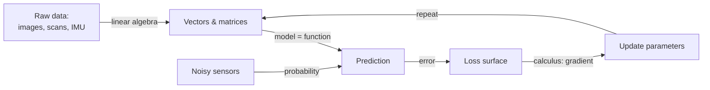

# 01 — 數學工具箱

> 第 0 部分 · 第 01 課 · 程式技術棧：numpy-from-scratch

**先備知識：** [00 — 什麼是機器學習？](00-what-is-ml.md)

**學完本課你能：**
- 在 NumPy 中讀取與操作**純量 (scalar)、向量 (vector)、矩陣 (matrix) 與張量 (tensor)**，並說明各自代表什麼。
- 計算並從幾何角度*解讀* **內積 (dot product)**、矩陣乘積、轉置 (transpose)、反矩陣 (inverse matrix) 與 **L1/L2 範數 (norm)**。
- 解釋**導數 (derivative) 即斜率**、**梯度 (gradient) 即最陡上升方向**，並運用**連鎖律 (chain rule)**（反向傳播 (backpropagation) 的種子）。
- 推理**隨機變數、分布 (distribution)、平均 (mean)、變異數 (variance)、高斯分布 (Gaussian)、條件機率 (conditional probability) 與貝氏定理 (Bayes' rule)**。
- 將這一切連結回機器人領域：把慣性測量單元 (IMU)/航向 (heading) 讀值表示成向量，並用內積衡量兩個航向有多一致。

這一課就是工具箱。後面每一課都會伸手進來取用。你不需要背證明——你需要的是*流暢的直覺*，再加上那幾個到處都會出現的公式。我們會用簡短的 NumPy 片段加上一張圖來建立每個概念。

---

## 1. 直覺理解

機器學習大致就是三種數學披著風衣假扮成一個東西：

1. **線性代數**——我們如何*儲存與轉換*資料。一張相機影像、一次光達 (lidar) 掃描、一批 IMU 樣本：全都只是一堆數字陣列。線性代數就是組合它們的文法。
2. **微積分**——我們如何*改進*。訓練模型 = 在誤差曲面上把數字往下坡推。梯度告訴我們哪個方向是下坡。
3. **機率**——我們如何*處理不確定性*。感測器有雜訊，世界有一部分是未知的。機率讓我們可以說「障礙物*很可能*在前方 3 公尺」，而不是假裝我們確切知道。

一個好用的比喻：把訓練模型想成**在霧中駕駛一艘無人水面載具 (USV) 朝向一顆浮標前進**。
- **狀態 (state)**（位置、航向、速度）是一個*向量*——線性代數。
- 「我該往哪個方向轉，才能最快縮短與浮標的距離？」是一個*梯度*——微積分。
- 「在收到一個有雜訊的雷達回波後，浮標在哪裡？」是*不確定性下的推論*——機率。



記住這個迴圈：**表示 → 預測 → 衡量誤差 → 沿梯度往下坡走 → 重複。** 下面所有內容都是這些箭頭其中之一的運作機制。

---

## 2. 數學原理

### 2.1 純量、向量、矩陣、張量

這些都只是依 0、1、2 或更多軸來索引的容器。

- **純量**是單一數字，例如 $x = 3.0$。零個軸。
- **向量**是一個有序列表，$\mathbf{v} \in \mathbb{R}^n$。一個軸。我們把它寫成一個欄：

$$\mathbf{v} = \begin{bmatrix} v_1 \\ v_2 \\ \vdots \\ v_n \end{bmatrix}, \qquad v_i \in \mathbb{R}.$$

這裡 $\mathbb{R}^n$ 表示「$n$ 個實數所構成的空間」；$v_i$ 是第 $i$ 個**分量 (component)**。
- **矩陣** $A \in \mathbb{R}^{m \times n}$ 是一個有 $m$ 列、$n$ 行的網格。兩個軸。元素 $A_{ij}$ 位於第 $i$ 列、第 $j$ 行。
- **張量**是任意軸數的統稱。一張彩色影像是一個三軸張量 $\mathbb{R}^{H \times W \times 3}$（高、寬、色彩通道）；一批影像會再加上第四個軸。在深度學習中，「張量」就是「n 維陣列」。

把軸數想成你需要幾個索引才能指到某一個數字。

### 2.2 內積——機器學習中最重要的運算

對於兩個向量 $\mathbf{a}, \mathbf{b} \in \mathbb{R}^n$，**內積**是

$$\mathbf{a} \cdot \mathbf{b} = \sum_{i=1}^{n} a_i b_i.$$

這是代數。真正重要的是*幾何*：

$$\mathbf{a} \cdot \mathbf{b} = \|\mathbf{a}\|\,\|\mathbf{b}\|\cos\theta,$$

其中 $\|\mathbf{a}\|$ 是 $\mathbf{a}$ 的長度（在 2.5 定義），$\theta$ 是兩向量之間的夾角。**它從何而來：** 這是餘弦定理重新排列的結果——展開 $\|\mathbf{a}-\mathbf{b}\|^2$，那個交叉項*就是*內積。重點是：

- 內積**衡量一致性 (alignment)**。同方向 → 大的正值。垂直（$\theta = 90°$）→ 零。相反 → 負值。
- 一個計算 $\mathbf{w}\cdot\mathbf{x}$ 的神經元 (neuron) 字面上就是在問「這個輸入與這個學到的模式有多一致？」這一個觀念會在線性迴歸 (linear regression)、邏輯迴歸 (logistic regression)、注意力 (attention) 與卷積 (convolution) 中反覆出現。

### 2.3 矩陣–向量與矩陣–矩陣乘法

矩陣是一個**轉換向量的函數**。把 $A \in \mathbb{R}^{m\times n}$ 乘上 $\mathbf{x} \in \mathbb{R}^n$ 會得到 $\mathbf{y} \in \mathbb{R}^m$：

$$y_i = \sum_{j=1}^{n} A_{ij}\,x_j \quad\Longleftrightarrow\quad \mathbf{y} = A\mathbf{x}.$$

把每個輸出分量 $y_i$ 讀成 **$A$ 第 $i$ 列與 $\mathbf{x}$ 的內積**。所以矩陣乘向量就是「一疊內積」。從幾何上看，$A$ 對輸入做旋轉／縮放／剪切／投影。

對於兩個矩陣 $A \in \mathbb{R}^{m\times k}$ 與 $B \in \mathbb{R}^{k\times n}$：

$$(AB)_{ij} = \sum_{p=1}^{k} A_{ip}\,B_{pj}, \qquad AB \in \mathbb{R}^{m\times n}.$$

**內側維度必須相符**（$k = k$）；結果取外側維度。$(AB)_{ij}$ 是 $A$ 第 $i$ 列與 $B$ 第 $j$ 行的內積。組合矩陣 = 組合轉換。一個神經網路 (neural network) 層正好就是這個：$\mathbf{y} = W\mathbf{x} + \mathbf{b}$。

### 2.4 轉置、單位矩陣、反矩陣

**轉置** $A^\top$ 把列與行互換：$(A^\top)_{ij} = A_{ji}$。它把欄向量變成列向量，這就是為什麼你會看到內積寫成 $\mathbf{a}^\top\mathbf{b}$。

**單位矩陣 (identity matrix)** $I$ 是「什麼都不做」的矩陣——對角線是 1、其餘是 0——所以 $I\mathbf{x} = \mathbf{x}$。

**反矩陣** $A^{-1}$ 會還原 $A$：$A^{-1}A = I$。直覺：如果 $A$ 旋轉並拉伸空間，$A^{-1}$ 就把它旋轉並拉伸回去。它只在 $A$ 是方陣、且不會把任何維度壓縮成零（行列式非零）時才存在。在機器學習中我們*很少*直接計算反矩陣（它們昂貴且數值上脆弱）——我們改為解線性系統或執行梯度下降 (gradient descent)——但「這個轉換可逆嗎？」這個*概念*很重要，例如線性迴歸中的正規方程式 (normal equation)。

### 2.5 範數——衡量大小

**範數**衡量一個向量的長度。你會不斷用到的兩種：

$$\|\mathbf{v}\|_2 = \sqrt{\sum_i v_i^2} \quad(\text{L2, Euclidean}), \qquad \|\mathbf{v}\|_1 = \sum_i |v_i| \quad(\text{L1, Manhattan}).$$

- **L2** 是直線距離（$n$ 維中的畢氏定理）——最小平方法中誤差的代價，也是「這兩個特徵向量相距多遠？」的基礎。
- **L1** 是絕對位移的總和（街區步數）。它出現在 **L1 正則化 (regularization)** 中，會把權重 (weight) 逼到*恰好為零*並產生稀疏模型（你會在 [05 — 過度擬合與正則化](05-overfitting-evaluation.md) 中看到原因）。

### 2.6 微積分：導數、偏導數、梯度

單變數函數 $f$ 的**導數**是其切線的斜率——瞬時變化率：

$$f'(x) = \frac{df}{dx} = \lim_{h\to 0}\frac{f(x+h) - f(x)}{h}.$$

它回答「如果我把 $x$ 推動一點點，$f$ 會移動多少，往哪個方向？」

當 $f$ 依賴多個變數 $f(x_1, \dots, x_n)$ 時，**偏導數 (partial derivative)** $\frac{\partial f}{\partial x_i}$ 是*沿著某一個軸*的斜率，並固定其他變數。把所有偏導數收進一個向量，你就得到**梯度**：

$$\nabla f = \left[\frac{\partial f}{\partial x_1},\ \frac{\partial f}{\partial x_2},\ \dots,\ \frac{\partial f}{\partial x_n}\right]^\top.$$

**關鍵事實：** 梯度指向**最陡上升 (steepest ascent)** 的方向——在曲面 $f$ 上最快*往上坡*的方向。所以 $-\nabla f$ 指向下坡。這就是訓練背後的全部觀念：要*最小化*一個損失，就逆著它的梯度走一步。**為什麼它指向上坡：** 對於一個小步 $\mathbf{u}$，$f$ 的變化量 $\approx \nabla f \cdot \mathbf{u}$（一個內積！），根據 2.2，當 $\mathbf{u}$ 與 $\nabla f$ 一致時這個值最大。

### 2.7 連鎖律——反向傳播的種子

如果你把函數組合起來，$z = f(g(x))$，導數就是把局部斜率相乘：

$$\frac{dz}{dx} = \frac{dz}{dg}\cdot\frac{dg}{dx}.$$

直覺：齒輪。如果齒輪 A 以比例 $\frac{dg}{dx}$ 帶動齒輪 B，而 B 以比例 $\frac{dz}{dg}$ 帶動 C，整體比例就是它們的乘積。一個深層網路是一長串函數 $f_L(\dots f_2(f_1(x)))$；**反向傳播**（[10 — 反向傳播](10-backpropagation.md)）就是逐層套用的連鎖律，把局部斜率從輸出往回乘到輸入。現在把這個鎖進腦中，之後反向傳播就會感覺理所當然。

### 2.8 機率：隨機變數、分布、平均、變異數

**隨機變數** $X$ 是一個取值不確定的量——例如聲納 (sonar) 的一次有雜訊的深度讀值。**機率分布**描述每個值有多可能出現。對於連續的 $X$，我們使用**機率密度 (probability density)** $p(x)$，且 $\int p(x)\,dx = 1$。

**平均／期望值 (expectation)** 是長期平均——「質心」：

$$\mu = \mathbb{E}[X] = \int x\,p(x)\,dx \quad\Big(\text{or } \textstyle\sum_x x\,p(x)\text{ for discrete }X\Big).$$

**變異數**衡量離散程度（有多吵）：

$$\sigma^2 = \operatorname{Var}[X] = \mathbb{E}\big[(X-\mu)^2\big],$$

而 $\sigma$（**標準差 (standard deviation)**）的單位與 $X$ 相同。

**高斯（常態）分布**是感測器雜訊的預設模型（多虧中央極限定理——許多獨立小誤差的總和看起來會像高斯）：

$$p(x) = \frac{1}{\sqrt{2\pi\sigma^2}}\exp\!\left(-\frac{(x-\mu)^2}{2\sigma^2}\right).$$

它完全由 $\mu$（中心）與 $\sigma$（寬度）描述。約 68% 的質量落在 $\pm\sigma$ 之內，95% 落在 $\pm 2\sigma$ 之內。

### 2.9 條件機率與貝氏定理

$P(A \mid B)$ 是**在 $B$ 發生的條件下** $A$ 的機率。依定義 $P(A\mid B) = \frac{P(A,B)}{P(B)}$。把聯合機率用兩種方式重新排列，就得到**貝氏定理**：

$$P(A \mid B) = \frac{P(B \mid A)\,P(A)}{P(B)}.$$

用白話說：**後驗 (posterior)** $\propto$ **似然 (likelihood)** $\times$ **先驗 (prior)**。這就是機器人如何把一個有雜訊的測量（$B$）與它原本的信念（$P(A)$）融合，得到一個更新後的信念（$P(A\mid B)$）——這是卡爾曼濾波器、粒子濾波器與貝氏推論的數學核心。它也是單純貝氏 (Naive Bayes) 這類分類器的基礎。

---

## 3. 程式碼

純 NumPy——還沒用任何機器學習函式庫。我們親手打造工具箱，讓這些運算不再像魔法。

```python
import numpy as np

# ----- 3.1 純量、向量、矩陣、張量 -----
scalar = np.array(3.0)              # 0 個軸
vector = np.array([1.0, 2.0, 3.0])  # 1 個軸, shape (3,)
matrix = np.array([[1.0, 2.0],
                   [3.0, 4.0],
                   [5.0, 6.0]])     # 2 個軸, shape (3, 2)
tensor = np.zeros((2, 3, 4))        # 3 個軸, 例如 2 個類 RGB 影格

# .ndim = 軸的數量, .shape = 沿每個軸的大小
print(scalar.ndim, vector.shape, matrix.shape, tensor.shape)
# -> 0 (3,) (3, 2) (2, 3, 4)
```

```python
# ----- 3.2 內積與它的幾何 -----
a = np.array([1.0, 0.0])   # 指向東方
b = np.array([1.0, 1.0])   # 指向東北方

dot = np.dot(a, b)                          # = 1*1 + 0*1 = 1
cos_theta = dot / (np.linalg.norm(a) * np.linalg.norm(b))
angle_deg = np.degrees(np.arccos(cos_theta))
print(dot, round(cos_theta, 3), round(angle_deg, 1))
# -> 1.0 0.707 45.0   (兩向量相差 45 度)

# 垂直的向量內積為零：
print(np.dot(np.array([1.0, 0.0]), np.array([0.0, 1.0])))
# -> 0.0
```

```python
# ----- 3.3 矩陣乘向量與矩陣乘矩陣 -----
A = np.array([[1.0, 2.0],
              [3.0, 4.0]])
x = np.array([1.0, 1.0])

print(A @ x)            # 每個輸出 = dot(row_i, x): [1+2, 3+4]
# -> [3. 7.]

B = np.array([[1.0, 0.0],
              [0.0, 2.0]])   # 將 y 放大 2 倍
print(A @ B)            # 組合轉換; 內側維度 (2==2) 相符
# -> [[1. 4.]
#     [3. 8.]]
```

```python
# ----- 3.4 轉置、單位矩陣、反矩陣 -----
print(A.T)                      # 列 <-> 行
# -> [[1. 3.]
#     [2. 4.]]

I = np.eye(2)                   # 單位矩陣
print(np.allclose(A @ I, A))    # I 什麼都不做
# -> True

A_inv = np.linalg.inv(A)        # 存在: det(A) = -2 != 0
print(np.allclose(A_inv @ A, I))
# -> True
```

```python
# ----- 3.5 範數 -----
v = np.array([3.0, -4.0])
print(np.linalg.norm(v, 2))     # L2: sqrt(9 + 16) = 5
print(np.linalg.norm(v, 1))     # L1: |3| + |-4| = 7
# -> 5.0
# -> 7.0
```

### 把梯度視覺化為向量場

我們取碗狀曲面 $f(x,y) = x^2 + y^2$。它的梯度是 $\nabla f = [2x,\ 2y]$，永遠指向*外側且上坡*。把它取負就會指向原點處的最小值——正是梯度下降前進的方向。

```python
import numpy as np
import matplotlib.pyplot as plt

# (x, y) 點的網格
xs = np.linspace(-3, 3, 20)
ys = np.linspace(-3, 3, 20)
X, Y = np.meshgrid(xs, ys)

# f(x,y) = x^2 + y^2   ->   grad f = [2x, 2y]
U, V = 2 * X, 2 * Y                       # 梯度分量 (上坡)

fig, ax = plt.subplots(figsize=(6, 6))
# 填色等高線顯示碗的「高度」
ax.contourf(X, Y, X**2 + Y**2, levels=20, alpha=0.6, cmap="viridis")
# 箭頭顯示「負」梯度: 下坡方向
ax.quiver(X, Y, -U, -V, color="white")
ax.set_title(r"$-\nabla f$ for $f=x^2+y^2$ (arrows point downhill)")
ax.set_xlabel("x"); ax.set_ylabel("y"); ax.set_aspect("equal")
plt.tight_layout(); plt.show()
```

**你應該看到：** 同心的等高線環（從上方看的碗），到處都是指向*中心*的白色箭頭。每個箭頭都是從該點出發梯度下降會踏出的方向——直直朝向最小值。

### 繪製高斯分布

```python
import numpy as np
import matplotlib.pyplot as plt

def gaussian(x, mu, sigma):
    # 2.8 節的常態密度
    coeff = 1.0 / np.sqrt(2 * np.pi * sigma**2)
    return coeff * np.exp(-((x - mu) ** 2) / (2 * sigma**2))

x = np.linspace(-6, 6, 400)
plt.figure(figsize=(7, 4))
for sigma in (0.5, 1.0, 2.0):
    plt.plot(x, gaussian(x, mu=0.0, sigma=sigma), label=f"$\\sigma={sigma}$")
plt.title("Gaussian: same center, different spreads")
plt.xlabel("x"); plt.ylabel("p(x)"); plt.legend()
plt.tight_layout(); plt.show()
```

**你應該看到：** 三條以 0 為中心的鐘形曲線。$\sigma$ 越小 = 越高越窄（有把握、低雜訊）；$\sigma$ 越大 = 越矮越寬（不確定、高雜訊）。它們圍出的面積都是 1。

```python
# ----- 從樣本估計經驗平均與變異數 (蒙地卡羅) -----
rng = np.random.default_rng(0)
samples = rng.normal(loc=2.0, scale=1.5, size=100_000)   # mu=2, sigma=1.5
print(round(samples.mean(), 3), round(samples.var(), 3))
# -> 1.999 2.251    (var 約等於 sigma^2 = 1.5^2 = 2.25)
```

---

## 4. 實際案例：IMU/航向向量與內積

你正在操作一艘自主 **USV**，上面有一個回報船隻航向的 **IMU**，以及一個朝下一個航點 (waypoint) 發出期望航向的規劃器。兩個航向都只是水平面上的**單位向量**：

$$\mathbf{h}_{\text{imu}} = \begin{bmatrix}\cos\psi \\ \sin\psi\end{bmatrix}, \qquad \mathbf{h}_{\text{goal}} = \begin{bmatrix}\cos\phi \\ \sin\phi\end{bmatrix},$$

其中 $\psi$ 是測得的偏航角，$\phi$ 是目標方位。**內積衡量一致性**——正是控制器在意的航向誤差：

$$\mathbf{h}_{\text{imu}} \cdot \mathbf{h}_{\text{goal}} = \cos(\psi - \phi).$$

- 內積接近 $+1$ → 航向一致，保持航線。
- 接近 $0$ → 偏離 90°，急轉。
- 負值 → 指向錯誤方向，你已經轉過頭了，或者航點在你後方。

這就是為什麼內積是合適的「一致性感測器」。它也透過 2D 外積（$h_{x}g_{y} - h_{y}g_{x}$）給你轉向的*正負號*：正 = 左轉，負 = 右轉。

```python
import numpy as np

def heading_vec(psi_rad):
    """從偏航角得到單位航向向量。"""
    return np.array([np.cos(psi_rad), np.sin(psi_rad)])

# IMU 說我們指向 30 度; 規劃器想要 80 度。
h_imu  = heading_vec(np.radians(30))
h_goal = heading_vec(np.radians(80))

alignment = np.dot(h_imu, h_goal)              # 航向誤差的 cos 值
error_deg = np.degrees(np.arccos(np.clip(alignment, -1, 1)))

cross = h_imu[0]*h_goal[1] - h_imu[1]*h_goal[0]  # 正負號 => 轉向方向
turn = "left" if cross > 0 else "right"

print(round(alignment, 3), round(error_deg, 1), turn)
# -> 0.643 50.0 left   (偏離 50 度, 朝航點左轉)
```

同樣的「內積即一致性」觀念可以放大：把一批 $N$ 個航向向量疊成一個矩陣 $H \in \mathbb{R}^{N\times 2}$，然後用一次矩陣乘向量 $H\,\mathbf{h}_{\text{goal}}$ 算出對某個目標的所有一致性——向量化、沒有 Python 迴圈。這正是神經網路一次拿許多輸入對學到的權重評分時所用的模式。

如果想用一個扎實的*經典*資料集來練習這些基本運算，載入 **Iris**（`sklearn.datasets.load_iris`）：每朵花是一個 4 維特徵向量，而向量之間的 L2 距離就足以讓你開始分群 (clustering) 或做最近鄰分類（[06 — k-NN](06-knn-trees-ensembles.md)）。

---

## 5. 常見陷阱與技巧

- **形狀不符是 NumPy 第一名的 bug。** 不斷 `print` 出 `.shape`。對於 $AB$，內側維度必須相符：$(m\times k)(k\times n)$。一個 `ValueError: matmul: ... mismatch` 幾乎一定代表少了一個轉置。
- **廣播 (broadcasting) 既是功能*也是*陷阱。** `np.array([1,2,3]) + np.array([[1],[2]])` 會悄悄產生一個 $2\times3$ 的結果。雖然方便，但它會藏住 bug——用斷言檢查你預期的輸出形狀。
- **不要反轉矩陣。** `np.linalg.inv(A) @ b` 比 `np.linalg.solve(A, b)` 更慢且更不穩定。反矩陣是用來*理解*的*概念*，通常不是你真的會去跑的計算。
- **列向量 vs 欄向量。** 一個形狀為 `(n,)` 的 1 維 NumPy 陣列兩者都不是；`A @ x` 與 `x @ A` 都會藉由自動定向而「能跑」，這可能掩蓋邏輯錯誤。當它重要時，用 `x.reshape(-1, 1)` 明確指定。
- **梯度指向*上坡*。** 要*最小化*損失，你要沿著 $-\nabla f$ 走一步。把這個正負號弄反是經典的訓練 bug——你的損失會*變大*。
- **變異數的單位是平方。** 一個 $\sigma = 0.1\,\text{m}$ 的深度感測器，其變異數為 $0.01\,\text{m}^2$。對人類回報 $\sigma$（公尺），但演算法內部常常攜帶 $\sigma^2$。

---

## 6. 自我檢測

**Q1.** 兩個航向向量的內積恰好為 $0$。它們之間的夾角是多少，USV 控制器該怎麼做？

<details><summary>解答</summary>
$\cos\theta = 0 \Rightarrow \theta = 90°$。船隻指向與期望航向垂直——一個很大的誤差。控制器應該下令急轉；2D 外積的正負號告訴它是左轉還是右轉。
</details>

**Q2.** 你有 $A \in \mathbb{R}^{4\times 3}$ 與 $\mathbf{x} \in \mathbb{R}^{3}$。$A\mathbf{x}$ 的形狀是什麼，每個輸出分量又是什麼？

<details><summary>解答</summary>
$A\mathbf{x} \in \mathbb{R}^{4}$。第 $i$ 個輸出分量是 $A$ 第 $i$ 列（長度 3）與 $\mathbf{x}$（長度 3）的內積：$y_i = \sum_{j=1}^{3} A_{ij}x_j$。
</details>

**Q3.** 對於 $f(x, y) = x^2 + y^2$，計算在點 $(1, 2)$ 處的 $\nabla f$。哪個方向能最快減少 $f$？

<details><summary>解答</summary>
在 $(1,2)$ 處 $\nabla f = [2x, 2y] = [2, 4]$。那是最陡*上升*方向。要最快減少 $f$，沿著 $-\nabla f = [-2, -4]$ 走一步——回頭朝向原點（最小值）。
</details>

**Q4.** 為什麼連鎖律被稱為「反向傳播的種子」？

<details><summary>解答</summary>
一個神經網路是許多函數（層）的組合。連鎖律說組合的導數是各局部導數的乘積。反向傳播透過把這些局部導數從輸出層往回乘到輸入，計算出損失對每個參數的梯度——這就是反覆且高效地套用連鎖律。
</details>

**Q5.** 一個聲納的深度讀值被建模為高斯分布，$\mu = 5.0\,\text{m}$、$\sigma = 0.2\,\text{m}$。大約哪個範圍涵蓋了 95% 的讀值？用貝氏定理，你會把這個測量與什麼結合來估計真實深度？

<details><summary>解答</summary>
大約 $\mu \pm 2\sigma = 5.0 \pm 0.4$，即 $[4.6, 5.4]\,\text{m}$。貝氏：把**似然** $P(\text{reading}\mid\text{depth})$（這個高斯分布）與一個**先驗**信念 $P(\text{depth})$（例如來自海圖或前一次的估計）結合，得到**後驗** $P(\text{depth}\mid\text{reading})$——這正是卡爾曼濾波器所做的事。
</details>

---

## 回顧與下一步

- **線性代數 = 表示。** 資料是向量／矩陣／張量；**內積衡量一致性**，是幾乎每個機器學習運算的原子；矩陣是你可以組合的轉換。
- **範數衡量大小／距離**——L2（歐幾里得）用於最小平方法與相似度，L1（曼哈頓）用於稀疏性。
- **微積分 = 改進。** 導數 = 斜率，**梯度 = 最陡上升方向**，所以 $-\nabla f$ 是下坡。**連鎖律**把局部斜率串接起來——那就是反向傳播的雛形。
- **機率 = 不確定性。** 隨機變數有分布，可由**平均與變異數**摘要；**高斯分布**建模感測器雜訊；**貝氏定理**更新信念 = 似然 × 先驗。
- 你把它連結回了機器人領域：把 IMU/航向讀值當作向量，並用內積當作一致性感測器。

接下來我們把整個迴圈——表示、預測、衡量誤差、沿梯度走——用在一個真實的模型上。

➡️ **[02 — 線性迴歸](02-linear-regression.md)**
