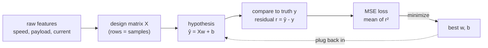
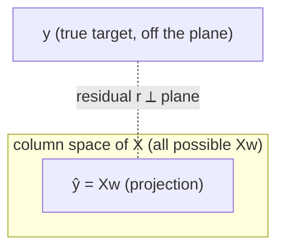

# 02 — 線性迴歸

> 第 1 部分 · 第 02 課 · 程式技術棧：numpy-from-scratch

**先備知識：** [01 — 數學工具箱](01-math-foundations.md)

**學完本課你能：**
- 寫出線性假設 $\hat{y} = Xw + b$，並從原始特徵組裝出**設計矩陣 (design matrix)**。
- 解釋我們*為什麼*要對誤差取平方，以及**均方誤差 (mean squared error, MSE)** 損失實際上在衡量什麼。
- 推導並運用**正規方程式 (normal equation)** $w = (X^\top X)^{-1} X^\top y$，並把它讀作幾何上的**投影 (projection)**。
- 在 NumPy 中完整實作整套流程：產生資料、擬合、畫出迴歸線、畫出殘差。
- 辨識何時**特徵縮放 (feature scaling)** 很重要（以及對正規方程式而言何時其實無所謂）。

---

## 1. 直覺理解

線性迴歸是最簡單而實用的預測器：假設你想預測的東西是**輸入的加權總和**，再加上一個常數偏移量。就這樣。本課程中的其他一切——邏輯迴歸、神經網路、Transformer——都是這個想法再加上各種變化，所以把它徹底搞懂非常划算。

用你熟悉的領域打個具體比方：你的無人水面載具 (USV) 在移動時會消耗電力。你猜想電力大致與速度成正比（再加上電子設備永遠開著的基礎耗電）。於是你猜：

$$\text{power} \approx w \cdot \text{speed} + b$$

$w$ 是「每 (m/s) 消耗的瓦數」——也就是斜率，代表電力隨速度爬升得多陡。$b$ 是零速度時的基礎耗電——也就是截距。線性迴歸的工作，就是去看記錄下來的 `(speed, power)` 配對，並挑出讓直線*盡可能貼近*這團點雲的 $w$ 與 $b$。「盡可能貼近」這部分我們得講清楚，而這份精確正是整堂課的重點。



關鍵的心智圖像是：我們有一團資料點，然後滑動／傾斜一條直線（在更高維度則是一塊平坦的平面／超平面），直到它與各點之間垂直間隙的平方總和小到不能再小。因為損失是一個平滑的碗狀曲面，所以恰好存在唯一一條最佳直線，而且我們可以直接解出它——不需要任何試誤。那個直接解就是正規方程式。

---

## 2. 數學原理

### 假設與設計矩陣

我們有 $n$ 個樣本，每個樣本有 $d$ 個特徵。把它們堆疊成一個矩陣 $X \in \mathbb{R}^{n \times d}$，其中第 $i$ 列是某個樣本的特徵。**權重向量 (weight vector)** $w \in \mathbb{R}^d$ 為每個特徵各保留一個係數，而**偏值 (bias，截距)** $b \in \mathbb{R}$ 是單一的純量偏移量。一次對所有樣本的預測是：

$$\hat{y} = Xw + b \quad\in \mathbb{R}^n$$

這裡 $\hat{y}_i$ 是樣本 $i$ 的預測目標，$y_i$ 是真實目標。一直把 $b$ 分開帶著很煩，所以標準技巧是**把偏值吸收進權重裡**：在 $X$ 前面加上一整欄的 1。定義**增廣設計矩陣 (augmented design matrix)** $\tilde{X} = [\mathbf{1} \mid X] \in \mathbb{R}^{n \times (d+1)}$ 與擴展權重 $\tilde{w} = [b, w_1, \dots, w_d]^\top$。於是

$$\hat{y} = \tilde{X}\tilde{w}.$$

這欄 1 之所以管用，是因為這個特徵永遠是 $1$，所以它的係數 $b$ 會無條件地加到每一筆預測上——這正是截距該做的事。從這裡開始我會省略那些波浪號，直接寫成 $X$ 與 $w$，並假設那欄 1 已經內含其中。

### MSE 損失——以及為什麼要平方

我們用**殘差 (residual)** $r_i = \hat{y}_i - y_i$ 來衡量誤差。**均方誤差**就是殘差平方的平均：

$$L(w) = \frac{1}{n}\sum_{i=1}^{n}(\hat{y}_i - y_i)^2 = \frac{1}{n}\lVert Xw - y \rVert_2^2$$

其中 $\lVert \cdot \rVert_2$ 是歐幾里得 (L2) 範數。為什麼要對誤差*取平方*，而不是比方說取絕對值呢？

- **不分正負且平滑。** 取平方會消掉正負號（高估與低估都同樣付出代價），而且不像 $|r|$，它處處可微——包括在零點。正是這份平滑性，讓我們能把導數設為零並求出閉式解。
- **它是一個拋物面。** 把 $L$ 視為 $w$ 的函數，它是一個凸的二次碗狀曲面，只有單一的全域最小值。沒有會卡住的區域最小值。
- **統計意義。** 如果 $y$ 上的雜訊是高斯分布，那麼最小化平方誤差正好就是**最大概似 (maximum likelihood)** 估計（我們會在 [05 — 過度擬合與評估](05-overfitting-evaluation.md) 再談）。鐘形曲線與拋物線講的是同一個故事：$\log(e^{-r^2}) = -r^2$。

另一面也值得現在就點出來：取平方也意味著**離群值會佔據主導地位**。一個 10 的殘差會貢獻 100；十個 1 的殘差總共才貢獻 10。一筆糟糕的聲納讀數就能把你整條擬合線拖歪。

### 正規方程式

要最小化這個碗，就對 $L$ 取相對於 $w$ 的梯度並設為零。利用 $\lVert Xw - y\rVert^2 = (Xw-y)^\top(Xw-y)$ 與矩陣微積分規則 $\nabla_w (Xw-y)^\top(Xw-y) = 2X^\top(Xw - y)$：

$$\nabla_w L = \frac{2}{n} X^\top (Xw - y) = 0 \;\Longrightarrow\; X^\top X w = X^\top y.$$

最後那些式子就是**正規方程式 (normal equations)**。解出 $w$：

$$\boxed{\,w = (X^\top X)^{-1} X^\top y\,}$$

前提是 $X^\top X$ 可逆（只要你的特徵欄彼此不冗餘，它就是可逆的——詳見「常見陷阱」）。$X^\top X \in \mathbb{R}^{(d+1)\times(d+1)}$ 很小（每個特徵對應一列／一欄），所以即使有上百萬筆樣本，反轉它仍然很便宜。

### 幾何意義：投影到欄空間

這部分值得真正內化。把 $y$ 想成 $\mathbb{R}^n$ 中的單一一點（每個樣本對應一個座標）。*所有可能預測值* $Xw$ 構成的集合——當 $w$ 取遍一切時——就是 $X$ 的**欄空間 (column space)**：由你的各特徵欄所張成的子空間。通常 $y$ **並不**落在那個子空間裡（你的特徵無法完美解釋目標），所以我們能做到最好的，就是在子空間中找出*最靠近* $y$ 的那一點。那個最近點正是 $y$ 在欄空間上的**正交投影 (orthogonal projection)**。

「歐幾里得距離上最近」字面上就是「$\lVert Xw - y\rVert$ 最小」——這正是 MSE 所最小化的東西。而正交投影意味著殘差向量 $r = Xw - y$ **垂直於每一個特徵欄**，亦即 $X^\top r = 0$，整理後就得到 $X^\top X w = X^\top y$。所以正規方程式*就是*「讓殘差正交於欄空間」這個陳述。



擬合出的 $\hat{y} = X(X^\top X)^{-1}X^\top y = Hy$，其中 $H = X(X^\top X)^{-1}X^\top$ 是**帽子矩陣 (hat matrix)**（它「把帽子戴到 $y$ 頭上」）。$H$ 是一個投影：$H^2 = H$。你不需要把這背下來，但這是個乾淨的方式，讓你看清擬合*就是在投影*。

---

## 3. 程式碼

純 NumPy，不用 scikit-learn。我們產生合成的 USV 電力資料，用正規方程式擬合，然後畫圖。（透過梯度下降做迭代式擬合是*下一*課的內容——這裡我們直接求解。）

```python
import numpy as np
import matplotlib.pyplot as plt

rng = np.random.default_rng(42)  # 可重現的隨機性

# --- 1. 產生合成資料 -------------------------------------------
# 假裝我們記錄了一艘 USV 以各種速度巡航時的耗電量。
# 我們假裝「不知道」的真實關係：power = 18 * speed + 40 + noise
n = 80
speed = rng.uniform(0.0, 6.0, size=n)          # m/s，n 個樣本
true_w, true_b = 18.0, 40.0                     # 每 (m/s) 的瓦數、基礎瓦數
noise = rng.normal(0.0, 12.0, size=n)           # 感測器／量測雜訊
power = true_w * speed + true_b + noise          # 觀測到的目標 y

# --- 2. 建立增廣設計矩陣 ---------------------------------
# 在前面加上一整欄的 1，讓偏值只是另一個權重。
# X 的形狀為 (n, 2)：第 0 欄 = 1（偏值），第 1 欄 = speed。
X = np.column_stack([np.ones(n), speed])         # 形狀 (80, 2)
y = power                                         # 形狀 (80,)

# --- 3. 解正規方程式：w = (XᵀX)⁻¹ Xᵀ y ------------------------
# 我們用 np.linalg.solve(A, b) 而不是 inv(A) @ b：它直接解 A w = b，
# 比起先算出 inv(A) 更快、在數值上也更穩定。
XtX = X.T @ X                                     # (2, 2)
Xty = X.T @ y                                     # (2,)
w = np.linalg.solve(XtX, Xty)                     # [bias, slope]
print(f"fitted bias b = {w[0]:.2f}, slope = {w[1]:.2f}")
# -> 擬合出的偏值 b = 35.69，斜率 = 18.93   （接近真實的 40 與 18）

# --- 4. 預測並衡量 -----------------------------------------------
y_hat = X @ w                                     # 預測，形狀 (80,)
residuals = y_hat - y
mse = np.mean(residuals**2)
# R^2：被解釋的變異數比例（1.0 = 完美，0 = 不比取平均好）
ss_res = np.sum(residuals**2)
ss_tot = np.sum((y - y.mean())**2)
r2 = 1 - ss_res / ss_tot
print(f"MSE = {mse:.2f}, R^2 = {r2:.3f}")
# -> MSE = 123.00，R^2 = 0.884
```

程式碼中有幾件事值得注意：
- `np.linalg.solve(XtX, Xty)` 是「套用 $(X^\top X)^{-1}$」的正式生產級做法。只要能避免，就**絕不要**呼叫 `np.linalg.inv`——明確地反轉矩陣會丟失精度。
- 擬合出的斜率 (18.93) 與偏值 (35.69) 落在真實的 18 與 40 附近。它們不會完全準確，因為我們加了雜訊；樣本更多時就會收得更緊。
- $R^2 \approx 0.88$ 代表我們的直線解釋了電力 88% 的變異數。很扎實——剩下的 12% 就是我們注入的量測雜訊。

現在把擬合與殘差視覺化——這是迴歸之後你*永遠*該看的兩張圖。

```python
fig, (ax1, ax2) = plt.subplots(1, 2, figsize=(12, 4.5))

# 左圖：資料點雲 + 擬合線
order = np.argsort(speed)                         # 排序以畫出乾淨的線
ax1.scatter(speed, power, alpha=0.6, label="logged data")
ax1.plot(speed[order], y_hat[order], "r-", lw=2, label="fit: ŷ = Xw")
ax1.set_xlabel("speed (m/s)"); ax1.set_ylabel("power (W)")
ax1.set_title("Fit"); ax1.legend()

# 右圖：殘差 vs 預測（應該看起來像一條沒有結構的帶狀）
ax2.scatter(y_hat, residuals, alpha=0.6)
ax2.axhline(0, color="k", lw=1)
ax2.set_xlabel("predicted power (W)"); ax2.set_ylabel("residual (ŷ - y)")
ax2.set_title("Residuals")
plt.tight_layout(); plt.show()
```

**你應該看到**：左圖——紅線乾淨俐落地穿過點雲的正中央，並隨速度上升而往上傾斜。右圖——殘差隨機散布在以零為中心的水平帶狀區內，**沒有漏斗狀、也沒有曲線**。那條沒有結構的帶狀正是一個設定良好的線性模型在視覺上的特徵。如果你反而看到一個 U 形，就代表真實關係是非線性的，而直線是錯誤的假設（這暗示著之後會用到的多項式特徵）。

---

## 4. 實際案例

**USV 測繪任務的電力預算編列。** 電池容量是固定的；任務規劃者需要預測能耗，這樣才不會讓船隻擱淺在外海。一個一階能量模型告訴我們，流體動力阻力功率會隨速度陡峭地增長，但在某個*巡航區間*（比方說 1–5 m/s）內，一條直線是非常好的區域近似，而且從遙測資料擬合它再簡單不過。

你會從馬達控制器記錄幾趟航程的 `(speed, power)`，把它們丟進上面的程式碼，然後讀出：
- **斜率 $w$** → 每多 1 m/s 所增加的邊際瓦數。告訴你開得更快的能量代價。
- **偏值 $b$** → 即使停在原地也要付出的基礎內務負載（運算、感測器、通訊）。

那麼，以速度 $v$ 行駛距離 $D$ 的航段，估計能量為 $E \approx (w v + b)\cdot (D/v) = D\,(w + b/v)$。注意這個*線性*模型隱含著什麼：$E$ 隨 $v$ 上升而單調下降（$dE/dv = -Db/v^2 < 0$），所以對於固定的電池，航程 $D_{\max} = E_{\max}\,v/(wv+b)$ 永遠只會隨速度*增加*——線性模型說的是「能開多快就開多快」。這裡並不存在內部的航程最佳巡航速度。真正的甜蜜點只有在功率呈**超線性**增長（也就是本課延後到後面才談的 $v^2$ 阻力項）時才會出現：屆時基礎耗電 $b$ 會懲罰開太慢，而阻力會懲罰開太快，這個權衡就有了一個內部最小值。所以要把這兩個擬合出的數字當成巡航區間內可解讀的規劃輸入——而不是當成尋找最佳速度的工具，因為線性形式根本產不出那種最佳速度。（一旦推到高速，阻力大致以 $v^2$ 甚至更糟的方式增長，這條直線無論如何都會崩壞——見「常見陷阱」與殘差圖。）

**用來落地的經典資料集：** **加州房價 (California Housing)** 資料集（`sklearn.datasets.fetch_california_housing`）——從中位數收入、平均房間數等 8 個特徵預測房屋中位數價值。這裡 $d=8$，所以加上那欄 1 之後 $X$ 是 $(20640, 9)$，而同樣的 `np.linalg.solve(X.T@X, X.T@y)` 會一次擬合全部九個係數。幾何意義完全相同；你只是沒辦法把那個 8 維超平面畫出來。最有用的診斷工具依然是殘差圖。

---

## 5. 常見陷阱與技巧

- **奇異的 $X^\top X$（共線性）。** 如果兩個特徵欄是線性相依的——例如你同時放進了以 m/s *和*以節 (knots) 為單位的速度，或是某個值是常數的特徵——那麼 $X^\top X$ 就不可逆，`np.linalg.solve` 會炸掉。解法：刪掉冗餘的那一欄，或改用 `np.linalg.lstsq(X, y, rcond=None)`，它會透過偽逆優雅地處理秩虧損。
- **特徵縮放：*對正規方程式而言*沒你想得那麼重要。** 閉式解在答案上是尺度不變的——不管單位是什麼，它都會找到正確的 $w$。但如果特徵量級差異懸殊（例如一個特徵在 $10^{-3}$ 量級、另一個在 $10^6$），就會使 $X^\top X$ **病態 (ill-conditioned)**，導致反矩陣失去精度。把特徵標準化成平均 0、標準差 1（`(X - X.mean(0)) / X.std(0)`），讓矩陣保持良好性質。對於下一課的*梯度下降*，縮放就不是選配的了——未縮放的特徵會讓收斂慢如龜爬。
- **離群值會毀掉平方損失。** 一個被標錯的樣本，或一筆出包、殘差巨大的感測器讀數，就會把整條線往它那邊拉（記得：殘差 10 → 成本 100）。檢查殘差圖；如果少數幾個點佔了主導地位，可以考慮穩健損失（Huber）或清理資料。
- **不要外推超出你的資料範圍。** 在 1–5 m/s 上擬合出的線，對 9 m/s 完全沒有任何可信度。線性模型在訓練範圍之外是「很有自信的騙子」。
- **高 $R^2$ 不等於「正確」。** $R^2$ 衡量的是在你訓練所用資料上的擬合程度。它對泛化、對線性*形式*是否正確都隻字未提。殘差圖能抓出 $R^2$ 所掩蓋的形式錯誤。
- **永遠記得加上偏值欄。** 忘了那欄 1，就會逼著直線通過原點（$b=0$），而這幾乎從來不是你想要的——你的 USV 在零速度時也是會耗電的。

---

## 6. 自我檢測

**Q1.** 為什麼我們要在 $X$ 前面加上一整欄的 1，而不是在數學裡把偏值 $b$ 當成獨立變數來處理？

<details><summary>解答</summary>
一整欄的 1 是一個永遠為 1 的特徵，所以它的係數會被無條件地加到每一筆預測上——這正是截距該做的事。把它折疊進來，讓我們能把整個模型寫成單一一個矩陣乘積 $\hat{y}=Xw$，並推導出單一而乾淨的正規方程式，而不必在每條公式裡都分開帶著 $b$。
</details>

**Q2.** 正規方程式說殘差 $r = \hat{y}-y$ 正交於 $X$ 的欄空間，亦即 $X^\top r = 0$。用一句話說明，為什麼*最佳*擬合一定要具備這個性質？

<details><summary>解答</summary>
如果殘差有任何分量落*在*欄空間*之內*，我們就能藉由調整 $w$ 把那個分量扣掉，並嚴格地更靠近 $y$——所以最靠近（距離最小、MSE 最小）的那一點，就是殘差純粹垂直於子空間的那一點。垂直 = 在平面內已經沒有任何可改進的空間了。
</details>

**Q3.** 你對 USV 的電力 vs 速度擬合了一條直線，而殘差圖呈現明顯的 U 形（中間是負殘差，兩端是正殘差）。這告訴你什麼？

<details><summary>解答</summary>
真實關係是彎曲的，而非線性的（這與阻力功率隨速度增長得比線性更快是一致的）。在這個範圍內，直線是錯誤的假設。你會在設計矩陣裡加進一個像 $\text{speed}^2$ 這樣的非線性特徵，這樣能讓模型在彎曲擬合的同時*仍對權重保持線性*（所以同一條正規方程式依然管用）。
</details>

**Q4.** 你的同事用 `np.linalg.inv(X.T @ X) @ X.T @ y` 計算 $w$。它能跑，但給出的數字比 `np.linalg.solve(X.T @ X, X.T @ y)` 稍微差一點。為什麼要偏好 `solve`？

<details><summary>解答</summary>
`solve` 透過分解直接解線性系統 $X^\top X\,w = X^\top y$，這樣更快、在數值上也更穩定。用 `inv` 明確算出反矩陣會做額外的運算，並放大浮點誤差，在 $X^\top X$ 病態時尤其嚴重。經驗法則：你幾乎永遠不需要明確的反矩陣。
</details>

**Q5.** 你設計矩陣裡的兩個特徵是「以 m/s 表示的速度」與「以節表示的速度」。當你呼叫 `np.linalg.solve(X.T @ X, X.T @ y)` 時會發生什麼事，又該怎麼修？

<details><summary>解答</summary>
這兩欄彼此互為純量倍數，所以 $X$ 是秩虧損的，而 $X^\top X$ 是奇異的（不可逆）——`solve` 會丟出 `LinAlgError`（或者若因浮點而僅僅是「差一點點才奇異」，則會回傳垃圾值）。修法：刪掉其中一個冗餘欄，或改用 `np.linalg.lstsq`，它使用偽逆並回傳一個有效的最小範數解。
</details>

---

## 回顧與下一步

- 一旦你把偏值當成設計矩陣裡的一欄 1 吸收進來，線性假設 $\hat{y}=Xw+b$ 就變成了單一一個矩陣乘積 $\hat{y}=Xw$。
- 我們透過最小化 **MSE**，$\frac{1}{n}\lVert Xw-y\rVert^2$ 來擬合——之所以用平方誤差，是因為它平滑、凸，而且是高斯雜訊下的最大概似選擇（但對離群值敏感）。
- **正規方程式** $w=(X^\top X)^{-1}X^\top y$ 以閉式解解出它，其*意義*是把 $y$ 正交投影到 $X$ 的欄空間上——殘差最終會垂直於每一個特徵。
- 在 NumPy 中：用一欄 1 建出 $X$，用 `np.linalg.solve(X.T@X, X.T@y)` 擬合，並**永遠**同時看擬合線與殘差圖。
- 特徵縮放對閉式解的*答案*幾乎沒有影響，但能讓 $X^\top X$ 保持良態；對接下來的迭代方法而言，它則變成必不可少。

正規方程式是精確的，但要反轉一個 $(d+1)\times(d+1)$ 的矩陣——特徵只有寥寥幾個時還好，但當 $d$ 龐大或資料以串流方式湧入時就很痛苦。接下來我們會學著在 MSE 碗上*往下坡走*，而不是一次解出它，這種做法可以擴展、也能推廣到本課程後續的每一個模型。

下一課：[03 — 梯度下降](03-gradient-descent.md)
