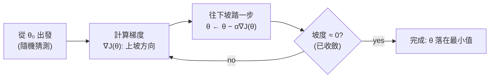

# 03 — 梯度下降

> 第 1 部分 · 第 03 課 · 程式技術棧：numpy-from-scratch

**先備知識：** [02 — 線性迴歸](02-linear-regression.md) — 你應該已經熟悉均方誤差 (MSE) 損失，以及正規方程式 (normal equation) 解 $\theta = (X^\top X)^{-1}X^\top y$。

**學完本課你能：**
- 將梯度下降 (gradient descent) 解釋成在損失曲面上「順著山坡往下滾」，並能憑記憶寫出更新規則 $\theta := \theta - \alpha \nabla J(\theta)$。
- 用兩行推導出 MSE 梯度 $\nabla J = \frac{1}{m}X^\top(X\theta - y)$，並用 NumPy 實作出來。
- 從損失曲線診斷出不良的學習率 (learning rate)（發散 vs. 龜速爬行），並修正它。
- 在批次 (batch)、隨機 (stochastic)、小批次 (mini-batch) GD 之間做選擇，並說明我們為什麼要做特徵縮放 (feature scaling)。
- 精確說出*為什麼*當特徵維度很大時，迭代式 GD 勝過正規方程式。

---

## 1. 直覺理解

線性迴歸給了你一個封閉解：把一個矩陣反轉一下，就完工了。但機器學習裡幾乎沒有別的東西能讓你享受這種待遇。真正訓練*幾乎所有東西*的主力引擎——邏輯迴歸、SVM、你日後會碰到的每一個神經網路——就是**梯度下降**。把它在這裡學透，課程其餘部分就會變成「同一套引擎，不同的損失」。

想像一下：你的損失 $J(\theta)$ 是一片**地形**。水平軸是參數 $\theta$（你能調整的旋鈕）；高度則是你錯得有多離譜。訓練 = 找出最低的谷底。你像個健行者，被丟在這片地形上某處，四周濃霧瀰漫——你看不到整張地圖，但你*能*感覺到腳下的坡度。於是你往**下坡**踏一步，再感覺坡度，再踏一步。如此反覆，直到腳下的地變平。

**梯度** $\nabla J(\theta)$ 精確地告訴你「哪個方向是上坡，以及有多陡」。所以你往*相反*方向踏出去。**學習率** $\alpha$ 是你的步幅。太膽怯就龜速前進；太大膽就會一躍跨過整個山谷，最後落得比起點還高。



對於**線性迴歸的 MSE 損失**，這片地形是一個完美的碗（一個凸的拋物面）——只有一個谷底，沒有任何陷阱。這正是本課要善用的禮物：我們可以觀察 GD 運作而不必擔心會卡住。要等到第 09 課以後，地形才會開始變得險惡。

---

## 2. 數學原理

### 損失，以及我們要最小化什麼

我們沿用第 02 課的 MSE。有 $m$ 筆訓練樣本，設計矩陣 $X \in \mathbb{R}^{m \times n}$（每一列是一筆樣本的特徵，最前面有一欄全為 1 用於偏值），目標值 $y \in \mathbb{R}^m$，以及參數 $\theta \in \mathbb{R}^n$：

$$
J(\theta) = \frac{1}{2m}\sum_{i=1}^{m}\big(\hat{y}_i - y_i\big)^2
= \frac{1}{2m}\,\lVert X\theta - y\rVert^2
$$

- $\hat{y}_i = x_i^\top \theta$ 是對第 $i$ 筆樣本的預測。
- $\lVert \cdot \rVert$ 是歐幾里得範數 (Euclidean norm)，所以 $\lVert v \rVert^2 = \sum_j v_j^2$。
- 那個 $\frac{1}{2}$ 只是美觀用途：它會抵消對平方項微分時掉出來的那個 2，留下一個乾淨的梯度。$\frac{1}{m}$ 則讓損失成為一個*平均值*，這樣當你改變資料集大小時，就不必重新調整 $\alpha$。

### 梯度——它從何而來

**梯度** $\nabla J$ 是偏導數構成的向量 $\big[\frac{\partial J}{\partial \theta_1}, \dots, \frac{\partial J}{\partial \theta_n}\big]^\top$。它指向 $J$ *上升最陡*的方向。用連鎖律 (chain rule) 兩行就能推導出來，其中殘差向量 $r = X\theta - y$：

$$
J = \frac{1}{2m}\, r^\top r, \qquad \frac{\partial r}{\partial \theta} = X
\;\;\Longrightarrow\;\;
\nabla J(\theta) = \frac{1}{m}\,X^\top r = \frac{1}{m}\,X^\top\big(X\theta - y\big)
$$

就這樣。從物理意義來讀它：$r = X\theta - y$ 是**每個預測錯得多離譜**（帶正負號）。$X^\top r$ 接著對每個特徵問：「這些誤差與這個特徵相關嗎？」如果特徵 $j$ 傾向於恰好在我們高估時取大值，那麼 $\partial J / \partial \theta_j > 0$，所以我們就*減少* $\theta_j$。梯度是一場投票，由每一筆樣本投出、以誤差作為加權。

### 更新規則

這是整門課最重要的一個方程式：

$$
\boxed{\;\theta := \theta - \alpha\, \nabla J(\theta)\;}
$$

- $:=$ 代表「賦值」——每次迭代我們都用新值覆寫 $\theta$。
- $\alpha > 0$ 是**學習率**（步伐大小／步幅）。
- 那個負號把「最陡的*上*坡」翻轉成「往*下*坡走」。

為什麼沿 $-\nabla J$ 踏一步真的能降低 $J$：一階泰勒展開給出 $J(\theta - \alpha\nabla J) \approx J(\theta) - \alpha\lVert\nabla J\rVert^2$。只要 $\nabla J \neq 0$ 且 $\alpha$ 夠小，修正項 $-\alpha\lVert\nabla J\rVert^2$ 就是負的——所以損失下降。關鍵就卡在這個*「夠小」*。

### $\alpha$ 能有多大？（條件數）

對於一個二次碗形，GD 可被證明會收斂，當且僅當

$$
0 < \alpha < \frac{2}{\lambda_{\max}}, \qquad \text{(在 } \alpha \approx \tfrac{2}{\lambda_{\max}+\lambda_{\min}} \text{ 附近最快)}
$$

其中 $\lambda_{\max}, \lambda_{\min}$ 是**海森矩陣 (Hessian)** $H = \frac{1}{m}X^\top X$（碗形的曲率）的最大／最小特徵值。比值 $\kappa = \lambda_{\max}/\lambda_{\min}$ 就是**條件數 (condition number)**。一個渾圓的碗（$\kappa \approx 1$）幾步就收斂；一條又長又窄的峽谷（$\kappa \gg 1$）則會讓 GD 來回曲折、龜速爬行。**特徵縮放**（第 5 節）就是我們把碗修圓的方法——它直接縮小 $\kappa$。

### GD 的三種風味

每一步都對*全部* $m$ 筆樣本計算 $\nabla J$ 就是**批次 GD**。我們也可以改用一個子集來估計梯度：

| 風味 | 梯度使用 | 每步成本 | 路徑 |
|---|---|---|---|
| **批次 (Batch)** | 全部 $m$ 筆樣本 | 高 | 平滑，直奔最小值 |
| **隨機 (SGD)** | 1 筆隨機樣本 | 極小 | 嘈雜、抖動 |
| **小批次 (Mini-batch)** | $b$ 筆樣本（例如 32） | 中等 | 大致平滑，帶些雜訊 |

這三者都在最小化*同一個* $J$；它們是用梯度準確度去換取速度。SGD 裡的雜訊也不全然是壞事——日後在非凸地形中，它能把你從不好的位置敲出來。小批次正是大家在深度學習裡實際使用的方式。

---

## 3. 程式碼

純 NumPy 從零打造。我們先為線性迴歸建立批次 GD，接著看不同學習率互相較勁，最後在等高線圖上畫出下降路徑。

```python
import numpy as np
import matplotlib.pyplot as plt

rng = np.random.default_rng(0)

# ---- 1. 合成資料: y = 4 + 3*x + noise -------------------------------
m = 200
x = rng.uniform(-2, 2, size=m)
y = 4.0 + 3.0 * x + rng.normal(0, 1.0, size=m)   # 真實 bias=4, slope=3

# 設計矩陣最前面有一欄全為 1, 對應偏值項。
# X[:,0]=1 -> theta[0] 是截距; X[:,1]=x -> theta[1] 是斜率。
X = np.column_stack([np.ones(m), x])             # 形狀 (m, 2)

def mse_loss(theta):
    r = X @ theta - y                            # 殘差, 形狀 (m,)
    return (r @ r) / (2 * m)                      # 純量 J(theta)

def grad(theta):
    r = X @ theta - y                            # (m,)
    return (X.T @ r) / m                          # 梯度, 形狀 (2,)  == (1/m) X^T r

# ---- 2. 批次梯度下降 --------------------------------------------
def gradient_descent(theta0, alpha, n_iters):
    theta = theta0.astype(float).copy()
    history = {"theta": [theta.copy()], "loss": [mse_loss(theta)]}
    for _ in range(n_iters):
        theta = theta - alpha * grad(theta)       # 那條更新規則
        history["theta"].append(theta.copy())
        history["loss"].append(mse_loss(theta))
    return theta, history

theta_final, hist = gradient_descent(np.zeros(2), alpha=0.1, n_iters=60)
print("GD solution:   ", np.round(theta_final, 3))   # -> [3.914 2.939]  (≈ 真實值 4, 3)

# ---- 3. 與封閉解 (正規方程式) 做合理性檢查 ------------
theta_closed = np.linalg.solve(X.T @ X, X.T @ y)
print("Closed form:   ", np.round(theta_closed, 3))  # -> [3.921 2.937]  ~ 幾乎相同的答案
print("Final loss:    ", round(hist["loss"][-1], 4)) # -> ~0.52 (不可消除的雜訊下限)
```

GD 落在與正規方程式給出的本質上相同的參數上（多跑幾次迭代，連最後幾位數也會收斂在一起）——它只是用走的、而不是用反矩陣抵達那裡。

### 學習率對決

```python
# 在同一個問題上比較數個學習率, 並畫出損失對迭代次數的曲線。
rates = [0.005, 0.2, 0.5, 1.4]     # 龜速, 良好, 快但仍穩, 太大
plt.figure(figsize=(7, 4.5))
for a in rates:
    _, h = gradient_descent(np.zeros(2), alpha=a, n_iters=60)
    plt.plot(h["loss"], label=f"α = {a}")
plt.yscale("log")                  # 用對數刻度, 這樣收斂與爆炸都看得到
plt.xlabel("iteration"); plt.ylabel("loss J(θ)  (log)")
plt.title("Learning rate controls everything")
plt.legend(); plt.tight_layout(); plt.show()
```

**你應該看到**：$\alpha=0.005$ 是一條緩緩傾斜的線，到第 60 次迭代時仍遠在下限之上（龜速爬行——最終損失 $\approx 7.5$）。$\alpha=0.2$ 和 $\alpha=0.5$ 都平滑地俯衝到雜訊下限（$\approx 0.52$）；$0.5$ 比較快但仍然穩定。$\alpha=1.4$ 則**急遽向上彎曲**——損失每一步都在*增長*（到第 60 次迭代時達到 $\sim 5\times 10^{7}$），GD 正在發散。把 $\alpha$ 推到 $2$，你會在幾次迭代內就得到 `inf`／`nan`。

> 這裡的穩定極限是 $\alpha < 2/\lambda_{\max}$。對於這個 $X$，$\frac{1}{m}X^\top X$ 的 $\lambda_{\max}$ 約為 $1.53$，所以截止點是 $\alpha \approx 1.31$——在此之下 GD 收斂，在此之上則發散。這就是為什麼 $0.5$ 沒問題、$1.4$ 卻爆掉。

### 在等高線圖上的下降路徑

```python
# 在 (bias, slope) 空間上建立一個網格, 並在其上求 J 的值。
b_range = np.linspace(-1, 8, 120)      # 候選的 bias 值  (theta[0])
w_range = np.linspace(-1, 7, 120)      # 候選的 slope 值 (theta[1])
B, W = np.meshgrid(b_range, w_range)
# 對整個網格做向量化的損失計算:
#   網格點 (b,w) 對樣本 i 的殘差是 (b + w*x_i - y_i)
Jgrid = np.zeros_like(B)
for i in range(B.shape[0]):
    for j in range(B.shape[1]):
        Jgrid[i, j] = mse_loss(np.array([B[i, j], W[i, j]]))

# 跑一個我們要追蹤的 GD; 小 alpha + 從遠處出發, 會畫出漂亮的路徑。
_, h = gradient_descent(np.array([0.0, -1.0]), alpha=0.08, n_iters=40)
path = np.array(h["theta"])            # 形狀 (n_iters+1, 2)

plt.figure(figsize=(6, 5.5))
cs = plt.contour(B, W, Jgrid, levels=np.logspace(-0.3, 2.2, 18), cmap="viridis")
plt.clabel(cs, inline=True, fontsize=7)
plt.plot(path[:, 0], path[:, 1], "o-", color="red", ms=3, lw=1, label="GD path")
plt.scatter(*theta_closed, color="black", marker="*", s=180, zorder=5, label="optimum")
plt.xlabel("bias  θ₀"); plt.ylabel("slope  θ₁")
plt.title("Rolling downhill on the loss surface")
plt.legend(); plt.tight_layout(); plt.show()
```

**你應該看到**：一圈圈同心橢圓（從上方俯視的凸碗形），黑色星號落在正中央。紅色路徑從外緣出發、一路往內走，每一步都**與等高線垂直**（永遠是正下坡方向），而且當梯度在底部附近趨於平緩時，步伐會*逐漸縮短*——這正是收斂的視覺特徵。如果橢圓拉得非常細長，路徑就會來回曲折；那種拉伸就是高 $\kappa$，也就是特徵縮放要修正的東西。

### 十行內的小批次／SGD

```python
def minibatch_gd(theta0, alpha, n_epochs, batch_size):
    theta = theta0.astype(float).copy()
    losses = []
    idx = np.arange(m)
    for _ in range(n_epochs):
        rng.shuffle(idx)                           # 每個訓練週期重新洗牌
        for start in range(0, m, batch_size):
            b = idx[start:start + batch_size]      # 這個小批次的索引
            r = X[b] @ theta - y[b]
            g = (X[b].T @ r) / len(b)              # 只在這個批次上算梯度
            theta = theta - alpha * g
        losses.append(mse_loss(theta))             # 用全資料的損失來追蹤進度
    return theta, losses

# batch_size=1 -> 純 SGD; =32 -> 小批次; =m -> 批次 GD
theta_mb, mb_losses = minibatch_gd(np.zeros(2), alpha=0.05, n_epochs=30, batch_size=16)
print("Mini-batch GD: ", np.round(theta_mb, 3))   # -> ~[3.92  2.96], 同樣的最優解, 但全資料掃過的次數更少
```

小批次在每次更新時只碰到少得多的樣本，卻能抵達相同的答案——一旦資料量變大，這正是它的全部意義所在。

---

## 4. 實際案例：當你*無法*反轉 $X^\top X$ 時

你正在無人水面載具 (USV) 上做感測器融合：從每個時間戳，你把降採樣後的聲納 (sonar) 回波、光達 (lidar) 距離分箱、由慣性測量單元 (IMU) 推導出的運動特徵，以及工程化的交叉項堆疊起來，組成一個特徵向量——假設 $n \approx 50{,}000$ 個特徵。你記錄了數百萬個時間戳（$m$ 也很龐大）。你想用一個線性模型來預測,例如,前方的障礙物距離。

第 02 課的正規方程式說 $\theta = (X^\top X)^{-1}X^\top y$。那為什麼不直接用它呢？

- $X^\top X$ 是 $n \times n = 50{,}000 \times 50{,}000$。用 float64 儲存它就要 $50{,}000^2 \times 8 \approx 20$ **GB**——這還只是在你試著反轉它*之前*。
- 矩陣反轉是 $\mathcal{O}(n^3)$。在 $n=50{,}000$ 時那是*每解一次*就要 $\sim 10^{14}$ 次運算。你會等上好幾個鐘頭，而且如果特徵共線（聲納分箱常常如此），$X^\top X$ 會接近奇異，反矩陣在數值上就是一團垃圾。

梯度下降把這一切都繞了過去。每一步批次 GD 都是一次矩陣-向量乘積 $X^\top(X\theta - y)$，那是 $\mathcal{O}(mn)$——對維度是*線性*的，完全不用形成那個 $n\times n$ 矩陣。用**小批次** GD 你還能更進一步：從磁碟（或直接從 ROS2 主題）串流時間戳的批次進來，每個批次更新一次 $\theta$，從不需把整個資料集放進記憶體。這正是為什麼每一個大模型都是用（小批次）GD 訓練的，而非用封閉解。

實作要點速寫（同樣的程式碼，更大的形狀）：

```python
# n 個特徵, m 筆樣本, 但我們從不建立 (n x n)。每一步都是一次 matmul。
n, m_big = 50_000, 200_000
# X_big 會是 (m_big, n) 並以批次串流進來; theta 只是長度為 n 的向量。
# step: g = X_batch.T @ (X_batch @ theta - y_batch) / len(batch)   # O(batch * n)
#       theta -= alpha * g
# 同時握在手上的記憶體: 一個批次 + theta。那個 20 GB 的 Gram 矩陣從不存在。
```

你要接受的代價：GD 在 $k$ 步之後給出的是*近似*解，而不是精確解。但對學習問題而言這並不是缺點——你反正都會提早停下（第 05 課，早停 early stopping），而那個雜訊下限的最優解已經是你能企盼的全部了。

**經典資料集錨點：** 同一份程式碼也能訓練一個加州房價迴歸器（8 個特徵、約 2 萬列）。在那裡正規方程式瞬間完成，GD 反而殺雞用牛刀——而這正是重點：GD 是你*恰好*在 $n$（與 $m$）大到直接反矩陣已吃不消時才會伸手去拿的工具。

---

## 5. 常見陷阱與技巧

- **永遠要縮放你的特徵。** 如果聲納振幅落在 $[0, 4000]$、IMU 偏航角速率落在 $[-0.1, 0.1]$，那麼損失碗形會是一條薄如刀刃的峽谷（$\kappa$ 極為巨大），GD 會永無止盡地來回曲折。把每個特徵標準化為零平均、單位變異數（`(x - x.mean()) / x.std()`）。這會縮小 $\kappa$，並讓單一個 $\alpha$ 對所有參數都管用。縮放統計量只能在*訓練集*上計算，再把同一組數值套用到驗證／測試集上。
- **以對數刻度調 $\alpha$。** 試試 $\{0.001, 0.003, 0.01, 0.03, 0.1, 0.3\}$，並觀察損失曲線。發散／`nan` ⟹ 太大；近乎平坦的緩慢下降 ⟹ 太小。中間有一段很寬的「良好」區帶。
- **別忘了偏值欄。** $X$ 裡那欄全為 1 的東西，正是讓這條線不必通過原點的關鍵。忘掉它是最常見的無聲臭蟲——模型沒辦法上下平移。
- **看曲線，別只看最終數字。** 平滑單調的下降（批次）或嘈雜但趨勢向下（SGD）才是健康的。一條先下降後*上升*、或以漸增振幅震盪的曲線，意味著 $\alpha$ 太大。
- **對 SGD 而言,排程勝過固定的 $\alpha$。** SGD 配上固定的 $\alpha$ 會讓你在最小值附近彈來彈去、永不安定。把它衰減掉（例如 $\alpha_t = \alpha_0/(1 + \text{decay}\cdot t)$），這樣當你逼近時步伐就會縮短。
- **現在是凸的,以後可不是。** MSE-線性是單一的全域碗形，所以任何下降法都行得通。別把這份舒適過度推廣——從第 09 課起，曲面會有許多最小值和鞍點，*初始化*與*雜訊*也開始變得重要。

---

## 6. 自我檢測

**Q1.** 寫出梯度下降的更新規則，並用一句話說明這三個部件（$\theta$、$\alpha$、$\nabla J$）各自的作用。

<details><summary>解答</summary>

$\theta := \theta - \alpha\nabla J(\theta)$。$\theta$ 是我們要最佳化的參數向量；$\nabla J(\theta)$ 指向上坡（損失上升最陡的方向），所以 $-\nabla J$ 是下坡方向；$\alpha$ 是步伐大小，決定每次迭代往那個方向移動多遠。
</details>

**Q2.** 為 $J(\theta) = \frac{1}{2m}\lVert X\theta - y\rVert^2$ 推導出 $\nabla J$。

<details><summary>解答</summary>

令 $r = X\theta - y$，於是 $J = \frac{1}{2m}r^\top r$。由於 $\partial r/\partial\theta = X$，連鎖律給出 $\nabla J = \frac{1}{2m}\cdot 2\,X^\top r = \frac{1}{m}X^\top r = \frac{1}{m}X^\top(X\theta - y)$。損失裡的那個 $\frac{1}{2}$ 恰好就是用來抵消平方項微分出來的因子 2。
</details>

**Q3.** 你的損失曲線*下降*了 3 次迭代，接著開始攀升並達到 `nan`。哪裡出錯了，要怎麼修？

<details><summary>解答</summary>

學習率 $\alpha$ 太大了：每一步都越過最小值、落到某個更高的地方，而這個越過量會不斷累積放大，直到數字爆炸（超出了 $\alpha < 2/\lambda_{\max}$）。修法：降低 $\alpha$（試著除以 3 到 10），且／或對特徵做縮放以降低條件數，這會抬高穩定上限。
</details>

**Q4.** 在一個 50,000 個特徵的感測器模型上，為什麼要用迭代式 GD，而不用封閉解 $\theta = (X^\top X)^{-1}X^\top y$？

<details><summary>解答</summary>

形成 $X^\top X$ 是 $n^2$ 的記憶體（在 $n{=}50\text{k}$ 時約 20 GB），反轉它是 $\mathcal{O}(n^3)$ 的時間，而且共線的特徵會讓它接近奇異／數值不穩。一步 GD 只是 $X^\top(X\theta - y)$，那是 $\mathcal{O}(mn)$，而且從不建立那個 $n\times n$ 矩陣；小批次 GD 還能串流資料，所以資料不必塞進記憶體。
</details>

**Q5.** 批次、隨機、小批次 GD 都在最小化同一個 $J$。它們究竟差在哪裡，又為什麼小批次是深度學習的預設選擇？

<details><summary>解答</summary>

它們的差別只在於每次*梯度估計*用了多少筆樣本：全部 $m$ 筆（批次，精確但昂貴）、1 筆（SGD，便宜但嘈雜），或 $b$ 筆（小批次，介於兩者之間）。小批次以一小部分的成本就給出夠好的梯度，在 GPU 上向量化效果良好，而且它溫和的雜訊能幫助在非凸地形中逃離不良區域——對大模型而言是最佳的速度／品質權衡。
</details>

---

## 回顧與下一步

- 梯度下降透過更新 $\theta := \theta - \alpha\nabla J(\theta)$ 在損失曲面上往下坡走——這是本課程中幾乎每一個模型背後的唯一引擎。
- 對 MSE-線性而言，$\nabla J = \frac{1}{m}X^\top(X\theta - y)$，曲面是一個凸碗形，而且在 $0 < \alpha < 2/\lambda_{\max}$ 時 GD 可被證明會抵達全域最小值。
- 學習率 $\alpha$ 就是一切：太小則龜速，太大則發散；從損失曲線上把它讀出來，並以對數刻度調整。
- 批次 vs. SGD vs. 小批次是用梯度準確度去換取速度；特徵縮放會降低條件數，讓 GD 直線前進而非來回曲折。
- 我們恰好在 $X^\top X$ 大到、或病態到無法反轉時才會伸手去拿迭代式 GD——高維度的感測器融合，以及每一個神經網路。

接下來我們保留同一套下降引擎，但更換損失並加上一個非線性，把迴歸變成分類：**[04 — 邏輯迴歸與分類](04-logistic-regression.md)**。
