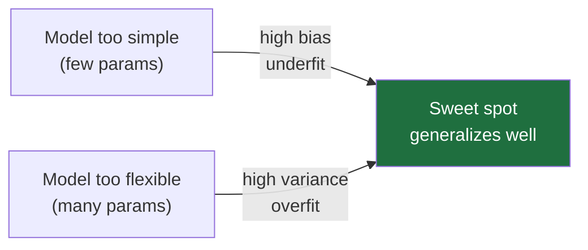
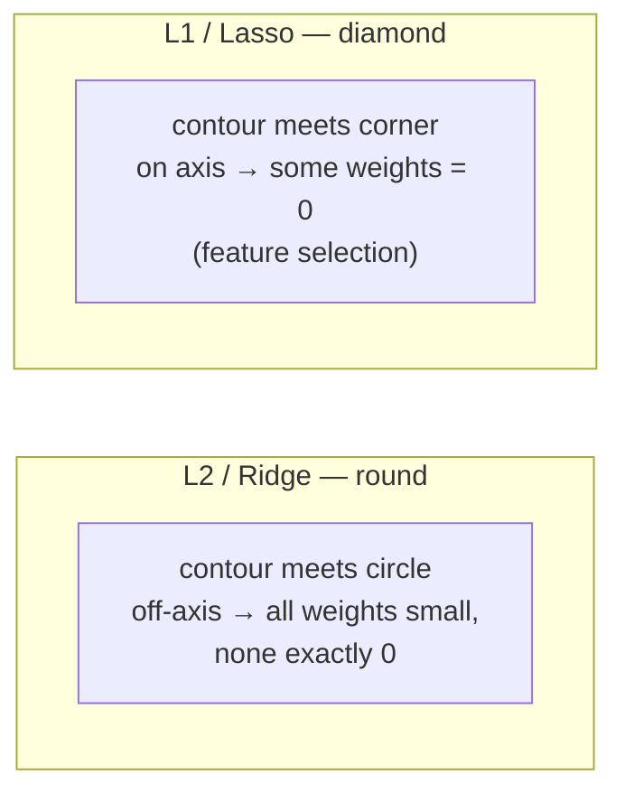
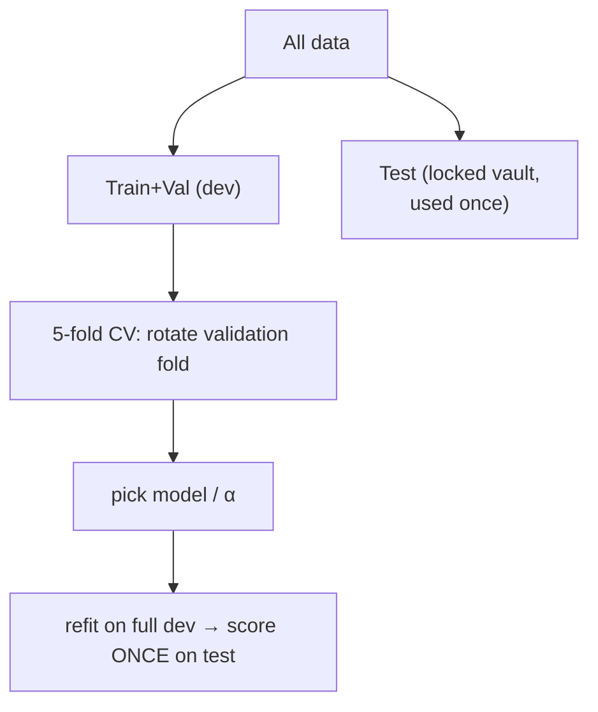

# 05 — 過度擬合、正則化與評估

> 第 1 部分 · 第 05 課 · 程式技術棧：scikit-learn (+ a little numpy)

**先備知識：** [04 — 邏輯迴歸與分類](04-logistic-regression.md)

**學完本課你能：**
- 用**偏差-變異數權衡 (bias–variance tradeoff)** 解釋為什麼一個在訓練資料上拿到 100% 分數的模型，到了實地仍可能毫無用處。
- 正確地把資料切分成**訓練/驗證/測試 (train / validation / test)**，並在不洩漏資訊的前提下執行 **k 折交叉驗證 (k-fold cross-validation)**。
- 套用 **L2 (ridge)** 與 **L1 (lasso) 正則化 (regularization)**，並預測各自對權重的影響。
- 為任務挑出正確的**評估指標**，並解釋為什麼在像稀有故障偵測這類**類別不平衡 (class imbalance)** 的資料上**準確率會說謊**。
- 看懂**學習曲線 (learning curve)** 與 **ROC 曲線**，診斷模型到底哪裡出了問題。

---

## 1. 直覺理解

模型唯一的工作就是**泛化 (generalize)**：在它*從未見過*的資料上表現良好。訓練準確率是個陷阱，因為模型總是能靠死背來作弊。

**比喻——背答案卷的學生。** 兩位學生準備考試：

- **學生 A（低度擬合/高偏差）** 只草草翻了一頁就斷定「答案永遠是 B」。模擬考錯、正式考也錯。太簡單，無法捕捉真實情況。
- **學生 B（過度擬合/高變異數）** 把每一道模擬題連同錯字都一字不漏地背下來。模擬考滿分，但題目一換句話問就全亂了。他背的是雜訊，而不是規律。
- **學生 C（剛剛好）** 學到了背後的規則。模擬考略有瑕疵，但正式考很穩。

你的模型就是這三者之一。整個遊戲就是讓它盡量靠近 C。



換到我們無人水面載具 (USV) 的情境：想像用 8 個帶雜訊的紀錄點來擬合一個模型，由速度預測阻力。一條直線可能會低度擬合（真實曲線其實是二次的）。一個 7 次多項式會*精準地*穿過全部 8 個點——然後在你沒記錄到的某個速度上預測出 −400 N 的阻力。它背的是雜訊。

---

## 2. 數學原理

### 偏差-變異數分解

假設真實情況是 $y = f(x) + \varepsilon$，其中 $f$ 是真正的函數，$\varepsilon$ 是變異數為 $\sigma^2$ 的不可約雜訊（你永遠無法建模掉的感測器抖動）。我們在一個隨機資料集上訓練出模型 $\hat{f}$。在測試點 $x_0$ 上、對所有可能的訓練集取平均後的**期望平方誤差**，可以分解成三個部分：

$$
\mathbb{E}\big[(y - \hat{f}(x_0))^2\big] = \underbrace{\big(\,\mathbb{E}[\hat{f}(x_0)] - f(x_0)\,\big)^2}_{\text{Bias}^2} + \underbrace{\mathbb{E}\big[(\hat{f}(x_0) - \mathbb{E}[\hat{f}(x_0)])^2\big]}_{\text{Variance}} + \underbrace{\sigma^2}_{\text{Irreducible}}
$$

它的來源：在平方項裡加減 $\mathbb{E}[\hat{f}(x_0)]$ 再展開；交叉項在取期望後消失，剛好就留下這三項。

- **偏差 (Bias)** = *平均*模型離真實情況有多遠。太簡單的模型偏差高（低度擬合）。
- **變異數 (Variance)** = 當你重新洗牌訓練資料時，模型*抖動*得有多厲害。太靈活的模型變異數高（過度擬合）。
- **不可約 (Irreducible)** $\sigma^2$ = 雜訊地板。沒有任何模型能贏過它。

你無法把偏差和變異數同時壓到零。提高模型複雜度會降低偏差但拉高變異數。**正則化就是你用一點點偏差去換掉大量變異數的手段。**

### Ridge (L2) 與 Lasso (L1)

從任意一個損失函數 $L(\mathbf{w})$ 出發——比方說[第 02 課](02-linear-regression.md)的均方誤差，其中 $\mathbf{w} \in \mathbb{R}^d$ 是權重向量。正則化會加上一個**對權重大小的懲罰項**：

$$
\text{Ridge:}\quad J(\mathbf{w}) = L(\mathbf{w}) + \alpha \sum_{j=1}^{d} w_j^2 = L(\mathbf{w}) + \alpha\,\lVert \mathbf{w} \rVert_2^2
$$

$$
\text{Lasso:}\quad J(\mathbf{w}) = L(\mathbf{w}) + \alpha \sum_{j=1}^{d} |w_j| = L(\mathbf{w}) + \alpha\,\lVert \mathbf{w} \rVert_1
$$

這裡 $\alpha \ge 0$ 是**正則化強度**（你自己選的旋鈕；$\alpha = 0$ 時退回成普通迴歸）。大權重現在變得很昂貴，所以最佳化器會偏好更小、更平滑的解——抖動更少，變異數更小。

**為什麼 L1 會產生稀疏性（零值）而 L2 不會。** 用幾何角度想。在權重大小有預算上限的限制下最小化 $L$，等價於把 $\mathbf{w}$ 限制在一個球體裡。L2 的球是一個**圓**（平滑、沒有角）；L1 的球是一個**菱形**，而且角*落在座標軸上*。損失等高線會一直擴張，直到碰到限制區域——而菱形被碰到的地方是**角**，那裡有些座標恰好是 $0$。



所以：**ridge 把所有權重往零的方向縮小；lasso 縮小的同時還把某些權重歸零**，等於在做特徵選擇。如果你懷疑 30 個 IMU/聲納特徵裡只有少數幾個重要，lasso 會告訴你是哪幾個。

### 評估指標

**迴歸**（預測值 $\hat{y}_i$、真實值 $y_i$、$n$ 個樣本）：

$$
\text{MAE} = \frac{1}{n}\sum_i |y_i - \hat{y}_i|, \qquad
\text{MSE} = \frac{1}{n}\sum_i (y_i - \hat{y}_i)^2, \qquad
\text{RMSE} = \sqrt{\text{MSE}}
$$

$$
R^2 = 1 - \frac{\sum_i (y_i - \hat{y}_i)^2}{\sum_i (y_i - \bar{y})^2}
$$

- **MAE（平均絕對誤差）** 採用原始單位（公尺、牛頓），並對每個誤差一視同仁。
- **MSE/RMSE（均方誤差）** 把誤差平方，所以會更嚴厲地懲罰大錯；RMSE 又回到原始單位。當少數幾個大誤差很危險時就用這些（一個 5 公尺的位置誤差比五個 1 公尺誤差更要命）。
- **$R^2$（決定係數）** 把你的模型和「永遠預測平均值 $\bar{y}$」這個無腦基準比較。$R^2 = 1$ 是完美，$R^2 = 0$ 代表不比平均值好，而**負的 $R^2$ 代表你比瞎猜平均值還糟**（沒錯，這真的會發生）。

**分類。** 一切都從**混淆矩陣 (confusion matrix)** 開始，它計算 True/False Positives/Negatives 的數量：

|                | Predicted Positive | Predicted Negative |
|----------------|--------------------|--------------------|
| **Actual Pos** | TP                 | FN                 |
| **Actual Neg** | FP                 | TN                 |

$$
\text{Accuracy} = \frac{TP+TN}{TP+TN+FP+FN}, \quad
\text{Precision} = \frac{TP}{TP+FP}, \quad
\text{Recall} = \frac{TP}{TP+FN}
$$

$$
F_1 = 2 \cdot \frac{\text{Precision} \cdot \text{Recall}}{\text{Precision} + \text{Recall}} \quad(\text{the harmonic mean — punishes lopsided scores})
$$

- **精確率 (Precision)** = 「當我大喊*故障！*時，我有多常是對的？」（誤報的代價）。
- **召回率 (Recall)** = 「在所有真實故障裡，我抓到了幾個？」（漏報的代價）。
- 兩者互相權衡：降低你的決策閾值就會抓到更多故障（召回率 ↑），但也更常狼來了（精確率 ↓）。$F_1$ 在兩者之間取得平衡。

**ROC 與 AUC。** 一個分類器輸出的是*分數*（機率）；你挑一個**閾值**把它變成是/否。**ROC 曲線**掃過每一個閾值，並把**真陽率 (True Positive Rate)**（= 召回率）對上**偽陽率 (False Positive Rate)** $= FP/(FP+TN)$ 作圖：

$$
\text{TPR} = \frac{TP}{TP+FN}, \qquad \text{FPR} = \frac{FP}{FP+TN}
$$

**AUC（曲線下面積）** = 那條曲線底下的面積 $\in [0,1]$。它等於「一個隨機的正樣本得分高於一個隨機的負樣本」的機率。$\text{AUC}=0.5$ 是擲銅板；$1.0$ 是完美。AUC 是**與閾值無關的**——它評斷的是排序，而不是單一個操作點。

---

## 3. 程式碼

### 3.1 用多項式迴歸看低度/過度擬合

```python
import numpy as np
import matplotlib.pyplot as plt
from sklearn.preprocessing import PolynomialFeatures
from sklearn.linear_model import LinearRegression
from sklearn.pipeline import make_pipeline

rng = np.random.default_rng(0)

# 真實情況是一條平滑曲線；我們只看得到它的「帶雜訊」樣本。
def true_f(x):
    return np.sin(1.5 * np.pi * x)

n = 30
X = np.sort(rng.uniform(0, 1, n)).reshape(-1, 1)   # 形狀 (n, 1)，供 sklearn 使用
y = true_f(X).ravel() + rng.normal(0, 0.25, n)     # 加入類似感測器的雜訊

xs = np.linspace(0, 1, 300).reshape(-1, 1)         # 繪圖用的密集格點

plt.figure(figsize=(12, 4))
for i, deg in enumerate([1, 4, 15]):               # 低度擬合 / 良好 / 過度擬合
    model = make_pipeline(PolynomialFeatures(deg), LinearRegression())
    model.fit(X, y)
    plt.subplot(1, 3, i + 1)
    plt.scatter(X, y, s=18, color="k", label="noisy data")
    plt.plot(xs, true_f(xs), "g--", label="truth")
    plt.plot(xs, model.predict(xs), "r", label=f"deg {deg} fit")
    plt.ylim(-2, 2)
    plt.title(f"degree {deg}  (train R²={model.score(X, y):.2f})")
    plt.legend(fontsize=7)
plt.tight_layout(); plt.show()
# -> degree 1  train R²=0.35   （低度擬合）
# -> degree 4  train R²=0.92   （良好）
# -> degree 15 train R²=0.93   （過度擬合：在點與點之間劇烈擺盪）
```

你應該看到：1 次的直線太平，跟不上正弦曲線（低度擬合）；4 次緊緊貼著綠色的真實曲線；15 次為了碰到雜訊而瘋狂蛇行——它的訓練 $R^2$ 只比 4 次的高一點點，但點與點之間的曲線根本是垃圾。**高訓練分數會掩蓋過度擬合。**

### 3.2 訓練/驗證/測試，以及 k 折交叉驗證

```python
from sklearn.model_selection import train_test_split, cross_val_score, KFold

# 測試集鎖在保險庫裡。你只在最後最後碰它「一次」。
X_dev, X_test, y_dev, y_test = train_test_split(X, y, test_size=0.2, random_state=0)

# 在 dev 集上做 k 折交叉驗證：輪流讓某一折當驗證切片。
# 每個點剛好都當過一次驗證 -> 用上全部資料，得到低變異數的估計。
model = make_pipeline(PolynomialFeatures(4), LinearRegression())
scores = cross_val_score(model, X_dev, y_dev, cv=KFold(5, shuffle=True, random_state=0),
                         scoring="r2")
print("per-fold R²:", np.round(scores, 2))
print(f"CV R² = {scores.mean():.2f} ± {scores.std():.2f}")
# -> CV R² 在「完全不碰被鎖住的測試集」的情況下估計泛化能力。
```



規則：**任何用來做決策的東西（模型選擇、$\alpha$）都不能是測試集。** 交叉驗證讓你只靠 dev 資料就能做出那些決策。

### 3.3 Ridge vs Lasso——看著 L1 把權重歸零

```python
from sklearn.preprocessing import StandardScaler
from sklearn.linear_model import Ridge, Lasso

# 20 個特徵，但只有「前 3 個」真正驅動 y。另外 17 個都是雜訊。
nf = 20
Xr = rng.normal(size=(80, nf))
true_w = np.zeros(nf); true_w[:3] = [3.0, -2.0, 1.5]
yr = Xr @ true_w + rng.normal(0, 0.5, 80)

# 正則化前「務必」先縮放：懲罰項對所有權重一視同仁，
# 所以特徵必須在相同尺度上，否則你會不公平地懲罰它們。
ridge = make_pipeline(StandardScaler(), Ridge(alpha=10.0)).fit(Xr, yr)
lasso = make_pipeline(StandardScaler(), Lasso(alpha=0.1)).fit(Xr, yr)

print("ridge weights exactly 0:", np.sum(np.isclose(ridge[-1].coef_, 0)))  # -> 0
print("lasso weights exactly 0:", np.sum(np.isclose(lasso[-1].coef_, 0)))  # -> 16

plt.figure(figsize=(9, 3))
plt.bar(np.arange(nf) - 0.2, ridge[-1].coef_, width=0.4, label="Ridge (L2)")
plt.bar(np.arange(nf) + 0.2, lasso[-1].coef_, width=0.4, label="Lasso (L1)")
plt.axhline(0, color="k", lw=0.8); plt.xlabel("feature index"); plt.ylabel("weight")
plt.legend(); plt.title("L2 shrinks everything; L1 zeroes the junk features")
plt.tight_layout(); plt.show()
```

你應該看到：ridge 給出 20 根小小的非零長條（全都被縮小但仍然存在）；lasso 只留下約 3-4 根高長條（特徵 0、1、2），其餘全部壓平到零。**Lasso 替你做了特徵選擇。**

### 3.4 學習曲線——診斷低度擬合 vs 過度擬合

```python
from sklearn.model_selection import learning_curve

est = make_pipeline(PolynomialFeatures(4), LinearRegression())
sizes, train_sc, val_sc = learning_curve(
    est, X, y, cv=5, scoring="neg_mean_squared_error",
    train_sizes=np.linspace(0.3, 1.0, 6))

train_err = -train_sc.mean(axis=1)   # 翻轉正負號：neg_MSE -> MSE
val_err   = -val_sc.mean(axis=1)

plt.plot(sizes, train_err, "o-", label="train error")
plt.plot(sizes, val_err,  "s-", label="validation error")
plt.xlabel("training set size"); plt.ylabel("MSE"); plt.legend()
plt.title("Learning curve"); plt.show()
```

怎麼看懂它：
- **間隙很大、驗證 ≫ 訓練**，而且不會收斂 → **過度擬合**（高變異數）。修法：更多資料、更強的正則化、更簡單的模型。
- **兩條曲線都很高且黏在一起** → **低度擬合**（高偏差）。修法：更複雜的模型／更好的特徵。增加資料沒有用。

---

## 4. 實際案例——故障罕見的 ROV 故障偵測器

你記錄一台水下遙控潛水器 (ROV) 的遙測資料（推進器電流、IMU 振動、深度變化率、電壓驟降）。你想在載具失去定點保持之前就標記出**推進器故障**。難處在於：故障**很罕見**——在我們模擬的紀錄裡也許只占 12% 的時間窗，而在一支健康的船隊裡可能是 1% 甚至更低。這正是**準確率會說謊**的場景。

```python
from sklearn.linear_model import LogisticRegression
from sklearn.metrics import (confusion_matrix, classification_report,
                             precision_score, recall_score, f1_score,
                             roc_curve, roc_auc_score,
                             precision_recall_curve, average_precision_score)

# --- 模擬一份類別不平衡的 ROV 遙測紀錄 -------------------------------
N = 4000
Xc = rng.normal(size=(N, 6))                       # 6 個遙測特徵（已標準化）
logit = -3.2 + 1.4*Xc[:, 0] + 1.1*Xc[:, 1] - 0.9*Xc[:, 2]   # 只有 3 個特徵透露故障訊號
p = 1 / (1 + np.exp(-logit))
yc = (rng.uniform(size=N) < p).astype(int)         # 1 = 推進器故障
print("fault rate:", yc.mean().round(3))           # -> ~0.118  （罕見的正樣本）

X_tr, X_te, y_tr, y_te = train_test_split(Xc, yc, test_size=0.3,
                                          stratify=yc, random_state=0)  # 兩邊切分都維持相同比例

# class_weight='balanced' 告訴模型：漏判罕見類別的代價更高。
clf = make_pipeline(StandardScaler(),
                    LogisticRegression(class_weight="balanced", max_iter=1000)).fit(X_tr, y_tr)

proba = clf.predict_proba(X_te)[:, 1]              # P(故障) 分數
pred  = (proba >= 0.5).astype(int)

# --- 準確率的謊言 ----------------------------------------------------
dumb_acc = (y_te == 0).mean()                      # 一個只會說「永遠沒故障」的分類器
print(f"'always healthy' accuracy: {dumb_acc:.3f}")        # -> 0.882
print(f"our model accuracy:        {(pred == y_te).mean():.3f}")  # -> 0.772
```
```text
'always healthy' accuracy: 0.882   <-- a USELESS model "beats" ours on accuracy!
our model accuracy:        0.772
```

一個**永遠預測沒故障**的模型可以拿到 88% 的準確率，卻會讓你的 ROV 沉下去。準確率被多數類別主導了。看看那些對罕見正樣本才真正重要的指標：

```python
# 注意：sklearn 把標籤升冪排序成 [0, 1]，所以它的輸出是第 2 節
# 課本表格的「轉置」：列/欄的順序是 [Neg, Pos]，排版為
# [[TN FP], [FN TP]]（TN 在左上角），而不是 [[TP FN], [FP TN]]（TP 在左上角）。
print(confusion_matrix(y_te, pred))
# -> [[812 246]      812 個 TN，246 個 FP（誤報）
#     [ 28 114]]      28 個 FN（漏掉的故障！），114 個 TP

print(f"precision {precision_score(y_te, pred):.3f}  "   # -> 0.317 （誤報很多）
      f"recall {recall_score(y_te, pred):.3f}  "         # -> 0.803 （抓到 80% 的故障）
      f"F1 {f1_score(y_te, pred):.3f}")                  # -> 0.454
print(f"ROC-AUC {roc_auc_score(y_te, proba):.3f}  "      # -> 0.866 （排序良好）
      f"PR-AUC  {average_precision_score(y_te, proba):.3f}")  # -> 0.573
```

現在看到真實的全貌：這個偵測器抓到了 **80% 的故障（召回率）**，但只有 **32% 的警報是真的（精確率）**——誤報一大堆。對一台 ROV 來說這也許正是對的選擇：一次誤報只是多檢查一下，一次漏判卻可能賠上整台載具。**你要依據每種錯誤的代價來選閾值**，而不是預設用 0.5。

```python
fpr, tpr, _ = roc_curve(y_te, proba)
plt.plot(fpr, tpr, label=f"ROC (AUC={roc_auc_score(y_te, proba):.2f})")
plt.plot([0, 1], [0, 1], "k--", label="random")
plt.xlabel("False Positive Rate"); plt.ylabel("True Positive Rate (recall)")
plt.title("ROV fault detector — ROC"); plt.legend(); plt.show()
```

你應該看到：一條向左上角拱起的曲線（AUC ≈ 0.87），明顯高於對角的「random」線。越靠近那個角落，代表這個分數無論用什麼閾值都越能把故障*排*在健康時間窗之上。

**重度不平衡的小技巧：** 比起 ROC，優先看**精確率-召回率曲線 (Precision–Recall curve)** 及其面積（**平均精確度／PR-AUC**）。當負樣本數量遠遠壓過正樣本時，ROC 可能會好看到失真，因為龐大的 TN 數量會讓 FPR 一直很小。PR-AUC 只聚焦在你真正在乎的正類別上。

這個模式可以對應到我們領域裡任何稀有事件偵測器：聲納發出的路徑障礙物警報、USV 上的 GPS 欺騙偵測、ROV 上的漏水偵測。**罕見正樣本 + 不對稱代價 ⇒ 永遠別信任準確率；改而回報召回率、精確率、F1 與 PR-AUC，並把閾值調到符合任務需求。**

---

## 5. 常見陷阱與技巧

- **碰測試集超過一次。** 每次為了「調參」而偷看都會洩漏資訊並灌水你的分數。把它鎖起來；所有決策都在 dev 集上用交叉驗證來做。
- **切分前就先縮放（資料洩漏）。** 你的 `StandardScaler` 只能在*訓練折*上擬合，再套用到驗證/測試。把縮放器放進 `Pipeline`（如上）能讓 `cross_val_score` 自動正確地這樣做。先在全部資料上擬合會把測試統計量洩漏進訓練。
- **做 L1/L2 前忘記縮放。** 懲罰項 $\sum w_j^2$ 對所有權重一視同仁，所以以毫米為單位量測的特徵，其有效懲罰會和以公尺為單位的差非常多。永遠先標準化。
- **在不平衡資料上回報準確率。** 如前所示，「永遠判負」可以贏過一個真正的模型。對稀有事件預設改用精確率/召回率/F1 和 PR-AUC。
- **ridge/lasso 裡的 `alpha` 與 `LogisticRegression` 裡的 `C` 是「相反」的。** 對 `Ridge`/`Lasso`，`alpha` 越大 = 正則化*越強*。對 `LogisticRegression`/`SVC`，`C` 越大 = 正則化*越弱*（$C \approx 1/\alpha$）。這一點每個人都會被咬一次。
- **要調的是決策閾值，不只是模型。** 模型給的是機率；0.5 很少是任務上的最佳切點。請從你的誤報 vs 漏判代價來選它。

---

## 6. 自我檢測

**Q1.** 你的模型拿到訓練 $R^2 = 0.99$、驗證 $R^2 = 0.55$。哪裡出了問題？說出兩個修法。
<details><summary>解答</summary>
訓練分數很高但訓練-驗證間隙很大 = <b>過度擬合／高變異數</b>。模型把雜訊背了起來。修法：加強正則化（提高 <code>alpha</code>）、改用更簡單的模型（降低多項式次數／減少特徵，例如透過 lasso），或蒐集更多訓練資料。降低模型複雜度是最直接的操作桿。
</details>

**Q2.** 你有 50 個特徵，但相信只有約 5 個重要。選 ridge 還是 lasso，為什麼？
<details><summary>解答</summary>
<b>Lasso (L1)</b>。它菱形的限制區域在座標軸上有角，所以最佳解會落在許多權重<i>恰好為零</i>的地方——自動特徵選擇，會留下那約 5 個有用的特徵。Ridge 則會把全部 50 個往零縮小，但全都保持非零。
</details>

**Q3.** 在一份漏水只占 0.4% 樣本的紀錄上，某漏水偵測器回報 99.5% 的準確率。你被打動了嗎？
<details><summary>解答</summary>
不。一個<i>永遠預測「沒漏水」</i>的模型可以拿到 99.6%——比回報的那個模型還高——卻一個漏水都沒抓到。準確率在這裡毫無意義。要求看 <b>召回率</b>（抓到了多少比例的漏水）、<b>精確率</b>，以及 <b>PR-AUC</b>。
</details>

**Q4.** 當偶發的大位置誤差對 USV 很危險時，為什麼 RMSE 優於 MAE？
<details><summary>解答</summary>
RMSE 在取平均前先把誤差平方，所以單一個大誤差的貢獻會遠超過好幾個小誤差。它對又大又危險的錯誤懲罰得更重。MAE 對每個誤差都是線性加權，所以可能會藏住一個罕見但災難性的漏判。（RMSE 維持在原始單位，這點和 MSE 不同。）
</details>

**Q5.** 你的團隊把故障偵測器的閾值從 0.3 提高到 0.7。精確率與召回率會怎麼變？什麼時候這是對的做法？
<details><summary>解答</summary>
閾值更高代表你只標記那些你非常有把握的故障：<b>精確率上升</b>（誤報更少），<b>召回率下降</b>（你會漏掉更多模稜兩可的故障）。當誤報很昂貴而漏判可以容忍時，這就是對的做法。但對安全攸關的 ROV 推進器故障，通常剛好相反——你會偏向召回率。
</details>

---

## 回顧與下一步

- **目標是泛化，不是訓練分數。** 偏差-變異數權衡告訴你無法同時最小化兩者；正則化用一點偏差去大砍變異數。
- **鎖住測試集；在 dev 集上做交叉驗證**，用於每一個模型與超參數決策。把縮放放在管線內以避免洩漏。
- **Ridge (L2)** 縮小所有權重；**lasso (L1)** 把某些權重歸零，給出稀疏、可解釋的模型。
- **讓指標配合任務：** 迴歸用 MAE/RMSE/$R^2$；分類用精確率/召回率/F1/ROC-AUC/PR-AUC——而且在不平衡資料上永遠別信任準確率。
- **學習曲線**告訴你該加資料（過度擬合）還是加複雜度（低度擬合）；**ROC/PR 曲線**告訴你在各種閾值下把正樣本排序得有多好。

接下來我們要把線性模型拋在腦後，認識那些畫出彎曲、非線性決策邊界的方法——距離、分割，與投票委員會：**[06 — k-NN、決策樹與集成](06-knn-trees-ensembles.md)**。
