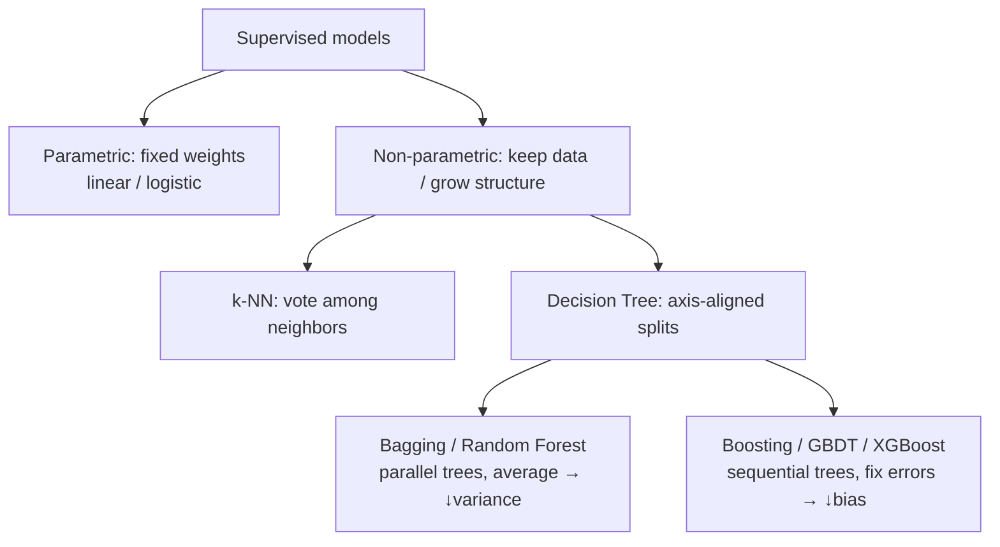

# 06 — k-最近鄰、決策樹與集成

> 第 2 部分 · 第 06 課 · 程式技術棧：scikit-learn

**先備知識：** [05 — 過度擬合、正則化與評估](05-overfitting-evaluation.md)（你應該已經熟悉訓練/測試切分、交叉驗證，以及偏差-變異數權衡）。另外也建議參考：[04 — 邏輯迴歸與分類](04-logistic-regression.md) 以理解分類的框架。

**學完本課你能：**
- 解釋 **k-最近鄰 (k-Nearest Neighbors)** 如何透過距離進行分類、如何明智地選擇 $k$，並說出*為什麼*它在高維度中會崩潰。
- 描述**決策樹 (decision tree)** 如何運用**吉尼不純度 (Gini impurity)** / **熵 (entropy)** 與**資訊增益 (information gain)** 來挑選分裂點，以及為什麼深層的樹會過度擬合。
- 區分**裝袋法 (bagging)**（隨機森林 (Random Forest)——透過平均來降低變異數）與**提升法 (boosting)**（梯度提升 (Gradient Boosting) / XGBoost——逐步修正錯誤）的差異。
- 在 scikit-learn 中訓練並比較這四種模型、繪製決策邊界，並讀懂**特徵重要性 (feature importance)** 圖表。

---

## 1. 直覺理解

到目前為止（第 02–05 課），每個模型都是**參數式 (parametric)** 的：線性與邏輯迴歸學習一個固定的權重向量 $\mathbf{w}$，然後就把訓練資料*丟掉*。這一課要談的是運作方式完全不同的模型。

**k-最近鄰是最懶惰的模型。** 它在訓練時*什麼都不學*——只是把資料背下來。要分類一個新點，它就看 $k$ 個最接近的儲存樣本，然後投票表決。打個比方：你被丟到一個陌生的城鎮，被問「這條街安全嗎？」，你會瞄一眼最近的幾棟房子來判斷。沒有理論，只有鄰居。

**決策樹是一張由是非問題組成的流程圖。**「花瓣長度 < 2.5 cm 嗎？→ 是的話，*setosa*；不是的話，花瓣寬度 < 1.8 cm 嗎？……」。每個問題都用一刀與座標軸對齊的切分來分割特徵空間。這正是一位海洋測量員可能採用的推理方式：*「反向散射強嗎？那就是岩石或礫石。坡度也陡嗎？那是岩石。」*

**集成 (ensemble)** 才是精彩之處：單一棵樹神經質又容易過度擬合，但一個由眾多樹組成的*委員會*卻威力強大。有兩種配方：
- **裝袋法 / 隨機森林**——在多個自助重抽樣 (bootstrap resample) 上各種一棵樹，然後*平均*它們。平均會抵消雜訊 → 降低變異數。
- **提升法**——一次種*一棵*樹，每一棵都專注於修正前面那些樹犯的錯。這會壓低偏差，用一群弱學習器組合出一個強學習器。



為什麼自主載具 (autonomous vehicle) 要在意這些？這些模型可以直接吃下**異質的表格式感測器特徵**（聲納反向散射、IMU 變異數、光達回波強度、相機色彩統計量），而不需要把它們縮放到相同尺度（樹），甚至完全不需要訓練（k-NN）。它們是快速、可解釋的基準模型，是你*在*動用神經網路*之前*會先伸手去拿的工具。

---

## 2. 數學原理

### 2.1 k-最近鄰

沒有訓練目標——預測本身*就是*演算法。對於一個查詢點 $\mathbf{x}$，找出距離最小的 $k$ 個訓練點所構成的索引集合 $N_k(\mathbf{x})$，然後投票：

$$\hat{y}(\mathbf{x}) = \operatorname*{arg\,max}_{c}\sum_{i \in N_k(\mathbf{x})} \mathbb{1}[\,y_i = c\,]$$

其中 $c$ 遍歷各個類別標籤，$y_i$ 是訓練點 $i$ 的標籤，$\mathbb{1}[\cdot]$ 在條件成立時為 1，否則為 0。若是迴歸問題，則改成平均鄰居的數值而非投票。

**距離度量。** 整個模型都繫於「接近」的定義。點 $\mathbf{x}, \mathbf{z} \in \mathbb{R}^d$ 之間一般化的 **Minkowski** 距離為

$$d_p(\mathbf{x},\mathbf{z}) = \left(\sum_{j=1}^{d} |x_j - z_j|^p\right)^{1/p}$$

- $p=2$ → **歐幾里得 (Euclidean)** 距離（直線距離）。預設選項。
- $p=1$ → **曼哈頓 (Manhattan)** 距離（城市街區距離）；對單一座標上的離群值更為穩健。
- 對於方向性資料（例如航向向量），**餘弦 (cosine)** 距離 $1 - \frac{\mathbf{x}\cdot\mathbf{z}}{\lVert\mathbf{x}\rVert\,\lVert\mathbf{z}\rVert}$ 通常更合適。

**為什麼你「必須」縮放特徵。** 距離是對各座標求和，因此一個以*公尺*計（範圍 0–1000）的特徵會淹沒掉一個以*弧度*計（範圍 0–6）的特徵。先標準化：$x_j \leftarrow (x_j - \mu_j)/\sigma_j$，其中 $\mu_j,\sigma_j$ 是特徵 $j$ 在訓練集上的平均與標準差。（這正是第 05 課的 `StandardScaler`。）

**選擇 $k$。** 這是調控偏差-變異數的旋鈕：
- $k=1$ → 訓練誤差為零、邊界鋸齒狀、**高變異數**（把雜訊都背下來）。
- $k$ 很大 → 邊界平滑、**高偏差**（把真正的結構也抹平了）；當 $k=N$ 時，它就只會預測多數類別。

用交叉驗證來挑 $k$。一個常見的經驗法則是 $k \approx \sqrt{N}$，而採用奇數的 $k$ 可以在二元問題中避免平手。

**維度災難 (curse of dimensionality)。** 殺手來了。在高維度中，*所有*點都會變得大致等距，於是「最近」失去了意義。可以從一個角度來看：最遠鄰居與最近鄰居之間的對比會逐漸縮小，

$$\frac{\mathbb{E}[\,d_{\max} - d_{\min}\,]}{\mathbb{E}[\,d_{\min}\,]} \to 0 \quad \text{as } d \to \infty.$$

直覺上，體積會隨 $d$ 呈指數爆炸，因此任何固定大小的樣本都會變得稀疏——你的「鄰居」其實一點也不近。我們會在下面用程式碼*量測*這種崩潰。

### 2.2 決策樹——分裂點是如何選出來的

樹會遞迴地分割資料。在每個節點上，它會搜尋所有的 **（特徵 $j$、閾值 $t$）** 組合，並挑出最能「淨化」子節點的分裂。一個具有類別比例 $p_c$（類別 $c$ 中樣本的占比）的節點，其純度可以用兩種方式衡量：

$$\underbrace{G = 1 - \sum_{c} p_c^2}_{\text{Gini impurity}}, \qquad \underbrace{H = -\sum_{c} p_c \log_2 p_c}_{\text{entropy}}$$

兩者在**節點純淨時（只有一個類別）皆為 0**，而在**類別均衡時達到最大值**（對 2 個類別而言：$G=0.5$，$H=1$ 位元）。吉尼不純度是 scikit-learn 的預設——它較便宜（不用算 log），而且行為幾乎一模一樣。

> *這些公式從何而來？* 吉尼不純度是：如果你依照節點的類別分布隨機抽取來為一個樣本標記，你會誤分類的機率：$\sum_c p_c(1-p_c) = 1-\sum_c p_c^2$。熵則是 Shannon 的資訊量——編碼該標籤所需的位元數。

一個候選分裂會把一部分 $\frac{N_L}{N}$ 的樣本送往左邊、把 $\frac{N_R}{N}$ 送往右邊。**資訊增益**就是被*移除*的不純度：

$$\text{IG} = I(\text{parent}) - \left(\frac{N_L}{N}\,I(\text{left}) + \frac{N_R}{N}\,I(\text{right})\right)$$

其中 $I$ 是吉尼不純度或熵，$N$ 是父節點的樣本數，$N_L, N_R$ 是子節點的樣本數。樹會**貪婪地挑出資訊增益最大的那個分裂**，然後遞迴下去。當一個節點變純淨、達到 `max_depth`、或低於 `min_samples_leaf` 時，它就會停止。

**為什麼深層的樹會過度擬合。** 在沒有深度限制的情況下，樹會一直分裂到每片葉子都只剩一個樣本——訓練誤差為 0，但邊界卻是一座由貼合雜訊的細條碎片堆成的迷宮。這就是第 05 課那個權衡的**高變異數**那一端。治法有：限制深度、要求每片葉子有更多樣本、剪枝——或者，更好的是，把它們*集成*起來。

### 2.3 集成——為什麼委員會勝過單一棵樹

**裝袋法（Bootstrap AGGregatING）。** 訓練 $B$ 棵樹，每一棵都在資料的一個自助重抽樣（*有放回地*抽 $N$ 個點）上訓練，然後平均它們的預測（分類則投票）。關鍵事實：若這 $B$ 個預測器各自的變異數為 $\sigma^2$，且兩兩之間的相關係數為 $\rho$，則平均後的變異數為

$$\operatorname{Var}\!\left(\tfrac{1}{B}\sum_{b} f_b\right) = \rho\,\sigma^2 + \frac{1-\rho}{B}\,\sigma^2.$$

當 $B\to\infty$ 時，第二項消失；剩下的就是 $\rho\sigma^2$。所以**樹與樹之間的相關性越低，你能殺掉的變異數就越多。** 一座**隨機森林**就是裝袋法再加上一個訣竅：在每個分裂點上只考慮特徵的一個*隨機子集*（通常是 $\sqrt{d}$ 個）。這會讓樹彼此去相關（沒有任何單一強特徵會主宰每一棵樹），縮小 $\rho$，從平均中榨出更多效益。偏差大致和單一深層樹相當；變異數則大幅下降。

**提升法。** 不是訓練各自獨立的樹，而是**循序地**建立它們，每一棵都修正當前模型的殘差誤差。**梯度提升**把這件事框架化為函數空間中的梯度下降：整個集成為

$$F_M(\mathbf{x}) = \sum_{m=1}^{M} \nu\, h_m(\mathbf{x}),$$

而每一棵新的弱樹 $h_m$ 都被擬合到損失對當前預測的**負梯度**（對平方損失而言，那字面上就是殘差 $y_i - F_{m-1}(\mathbf{x}_i)$）：

$$h_m \approx -\left.\frac{\partial L}{\partial F}\right|_{F = F_{m-1}}, \qquad F_m = F_{m-1} + \nu\, h_m.$$

**學習率** $\nu \in (0,1]$ 會縮小每棵樹的貢獻——較小的 $\nu$ 需要更多樹，但泛化得更好。**XGBoost / LightGBM** 是工業級的版本：同樣的點子，再加上正則化的目標函數、二階（牛頓）更新，以及聰明的基於直方圖的分裂尋找。提升法攻擊的是**偏差**（把淺淺的「樹樁」變成一個強學習器），但若你用了太多樹又完全不正則化，它也會過度擬合——這和森林剛好是相反的失效模式。

| | 樹如何建立 | 主要降低 | 何時過度擬合 | 可平行？ |
|---|---|---|---|---|
| **隨機森林** | 各自獨立 | **變異數** | 樹再多也幾乎不會 | 可以 |
| **梯度提升** | 循序 | **偏差** | 樹太多 / $\nu$ 太大 | 不行 |

**特徵重要性。** 樹幾乎免費就給了你它：對每個特徵，把所有樹中用到它的每個分裂所帶來的（樣本加權）不純度下降量加總起來，再正規化讓總和為 1。注意事項：這種*基於不純度*的重要性偏向於高基數 / 連續型的特徵。**排列重要性 (permutation importance)**（打亂某一個特徵、量測驗證分數的下降幅度）則更值得信賴。

---

## 3. 程式碼

我們會在 **Iris**（經典資料集）上比較這四種模型，然後將邊界與重要性視覺化。底下所有程式都可以在同一個腳本中執行。

```python
import numpy as np
import matplotlib.pyplot as plt
from sklearn.datasets import load_iris
from sklearn.model_selection import train_test_split, cross_val_score
from sklearn.preprocessing import StandardScaler
from sklearn.pipeline import make_pipeline
from sklearn.neighbors import KNeighborsClassifier
from sklearn.tree import DecisionTreeClassifier
from sklearn.ensemble import RandomForestClassifier, GradientBoostingClassifier
from sklearn.metrics import accuracy_score

# --- 資料 -------------------------------------------------------------
iris = load_iris()
X, y = iris.data, iris.target          # 150 個樣本、4 個特徵、3 個類別
feat = iris.feature_names

# stratify=y 讓訓練與測試集中的類別比例維持一致（第 05 課）
X_tr, X_te, y_tr, y_te = train_test_split(
    X, y, test_size=0.25, random_state=42, stratify=y)

# --- 四個模型、同一套介面 --------------------------------------
# 注意：k-NN 被包進一個 pipeline，這樣在訓練上擬合的「同一個」scaler
#       會被重複用在測試上。樹對尺度不變，所以不需要 scaler。
models = {
    "k-NN (k=5)":        make_pipeline(StandardScaler(),
                                       KNeighborsClassifier(n_neighbors=5)),
    "Decision Tree":     DecisionTreeClassifier(max_depth=3, random_state=0),
    "Random Forest":     RandomForestClassifier(n_estimators=200, random_state=0),
    "Gradient Boosting": GradientBoostingClassifier(n_estimators=200,
                                                    learning_rate=0.1,
                                                    random_state=0),
}

for name, m in models.items():
    m.fit(X_tr, y_tr)                              # 在訓練切分上擬合
    acc = accuracy_score(y_te, m.predict(X_te))    # 保留測試集上的準確率
    cv  = cross_val_score(m, X, y, cv=5).mean()    # 對全部資料做 5 折交叉驗證
    print(f"{name:20s}  test acc {acc:.3f}   cv acc {cv:.3f}")

# -> k-NN (k=5)            test acc 0.921   cv acc 0.960
# -> Decision Tree         test acc 0.895   cv acc 0.960
# -> Random Forest         test acc 0.895   cv acc 0.960
# -> Gradient Boosting     test acc 0.974   cv acc 0.960
```

四者的交叉驗證準確率都落在 95–96% 左右——Iris 很容易，所以別太認真看待單次切分間的差異（那不過是差幾朵花而已）。重點在於**統一的 scikit-learn API**：`fit` / `predict` / `cross_val_score` 在差異極大的模型家族之間運作方式完全相同。

### 感受維度災難

```python
from scipy.spatial.distance import pdist
rng = np.random.default_rng(0)
print("dim   contrast = (max-min)/min pairwise distance")
for d in [2, 10, 100, 1000]:
    P = rng.random((200, d))               # 在 [0,1]^d 中的 200 個均勻分布點
    dist = pdist(P)                        # 所有兩兩之間的距離
    contrast = (dist.max() - dist.min()) / dist.min()
    print(f"{d:5d}   {contrast:.3f}")

# -> 2      533.858     <- 最近者比最遠者近約 500 倍：有意義
# -> 10     4.928
# -> 100    0.618
# -> 1000   0.169       <- 所有點都約等距：「最近」就是雜訊
```

隨著 $d$ 變大，最近與最遠鄰居之間的差距會塌縮趨近於零——這正是*為什麼* k-NN 在處理像原始像素這種高維資料之前，需要先做降維（第 08 課，主成分分析）或特徵選擇。

### 決策邊界（用 2 維好讓我們看得見）

```python
from sklearn.inspection import DecisionBoundaryDisplay

X2 = iris.data[:, 2:4]   # 只取花瓣長度與寬度——資訊量最豐富的一對
clfs = {
    "k-NN (k=15)":    KNeighborsClassifier(n_neighbors=15),
    "Tree (depth=4)": DecisionTreeClassifier(max_depth=4, random_state=0),
    "Random Forest":  RandomForestClassifier(n_estimators=200, random_state=0),
}
fig, axes = plt.subplots(1, 3, figsize=(15, 4))
for ax, (name, clf) in zip(axes, clfs.items()):
    clf.fit(X2, y)
    DecisionBoundaryDisplay.from_estimator(
        clf, X2, ax=ax, alpha=0.3, response_method="predict")
    ax.scatter(X2[:, 0], X2[:, 1], c=y, edgecolor="k", s=20)
    ax.set_title(name)
    ax.set_xlabel("petal length (cm)"); ax.set_ylabel("petal width (cm)")
plt.tight_layout()
plt.savefig("boundaries.png", dpi=110)
```

**你應該看到：** k-NN 畫出一條*平滑、彎曲*的邊界，緊貼著資料雲團。單一棵樹的邊界則是由嚴格的**水平與垂直階梯**構成（與座標軸對齊的分裂）——方塊狀，而且在角落有點過度自信。隨機森林同樣是階梯狀（畢竟它還是樹）但邊緣*更平滑、更柔和*，因為它平均了 200 棵樹——這種平滑化正是變異數降低被具體看見的樣子。

### 特徵重要性長條圖

```python
rf = RandomForestClassifier(n_estimators=300, random_state=0).fit(X, y)
order = np.argsort(rf.feature_importances_)[::-1]   # 由高到低

plt.figure(figsize=(6, 3.5))
plt.barh([feat[i] for i in order][::-1],
         rf.feature_importances_[order][::-1])
plt.xlabel("Mean impurity decrease (importance)")
plt.title("Random Forest feature importance — Iris")
plt.tight_layout()
plt.savefig("importance.png", dpi=110)

for i in order:
    print(f"  {feat[i]:22s} {rf.feature_importances_[i]:.3f}")
# ->   petal length (cm)      0.440
# ->   petal width (cm)       0.420
# ->   sepal length (cm)      0.113
# ->   sepal width (cm)       0.027
```

**你應該看到：** 兩根長條（兩個花瓣特徵）與兩個短樁。森林*發現*了花瓣能區分品種、而萼片幾乎無關緊要——而且不用你告訴它。這正是你會想從一個感測器融合模型中得到的洞見：*到底哪些通道真正驅動了決策？*

> 想要更值得信賴的版本，改用 `from sklearn.inspection import permutation_importance`，並在一個保留集上執行——它不會被高基數的特徵騙到。

---

## 4. 實際案例——以多感測器特徵進行海床 / 地形分類

你正在操作一艘做測量的無人水面載具 (USV)，配備一具**多波束聲納**，想要把海床自動標記成**泥 / 沙 / 礫石 / 岩石**（這是一項真實的水文測量任務，會餵給安全航行海圖）。你不會把原始波形直接餵給一棵樹——而是為每個聲脈衝或每個網格儲存格設計一個表格式特徵向量：

| 特徵 | 感測器 | 為什麼有幫助 |
|---|---|---|
| 平均反向散射強度 | 聲納 | 岩石反射強烈，泥會吸收 |
| 反向散射標準差 / 紋理（GLCM） | 聲納 | 礫石「粗糙」，泥則平滑 |
| 局部深度梯度 / 坡度 | 水深 | 岩石露頭很陡 |
| 深度 | 水深 | 沉積相與深度帶相關 |
| 回波脈衝寬度 | 聲納 | 硬底 vs. 軟底 |

這是樹集成的教科書級適用情境，工程上的推理如下：

- **不需要縮放。** 反向散射（dB）、坡度（度）與深度（m）位於完全不同的尺度上。樹是針對每個特徵以閾值來分裂，所以它們對**單調的重新縮放是不變的**——你可以略過 k-NN 所要求的那種 `StandardScaler` 麻煩。（如果你*真的*在這裡用了 k-NN，未經縮放、以公尺計的深度會主宰距離並把它搞砸。）
- **混合的特徵型別與缺失資料。** 真實的測量會有資料掉失；樹集成對此的容忍度遠勝過基於距離的方法。
- **先試隨機森林。** 它是免調參的基準：穩健、難以過度擬合，而且**特徵重要性圖告訴測量員是哪一個感測器通道在扛起整個分類**——也許紋理比絕對強度更重要，這就能反過來指導感測器校正。
- **接著上梯度提升（XGBoost/LightGBM）**，當你需要為最終的海圖成品再榨出最後那幾個百分點的準確率時——代價是要調 `n_estimators`、`learning_rate` 和 `max_depth`。

對映回數學：每棵樹會問像 *「反向散射 > -18 dB？而且坡度 > 12°？→ 岩石」* 這樣的問題，這正是 §2.2 中那些與座標軸對齊、由吉尼增益選出的分裂。森林會平均數百張這樣的流程圖，於是單一個帶雜訊的聲脈衝不會翻轉標籤。同一套配方可以直接轉移到**無人飛行載具 (UAV) 地形分類**（NDVI + 高程 + 紋理 → 植被/土壤/水）以及**遙控潛水器 (ROV) 管線檢查**（特徵向量 → 腐蝕/乾淨/異常）。如果你偏好用一個公開資料集來代打練習，UCI 的 **"Sonar, Mines vs. Rocks"** 資料集（60 個聲納頻帶能量 → 金屬圓柱 vs. 岩石）就是這個確切問題的精神始祖。

---

## 5. 常見陷阱與技巧

- **沒縮放的 k-NN 是壞掉的。** 距離會被大範圍的特徵主宰。永遠把 `StandardScaler`（或 `MinMaxScaler`）放*在一個 pipeline 裡面*，這樣 scaler 只會在訓練集上擬合——絕不要在完整資料上擬合，否則你會洩漏測試資訊（第 05 課）。
- **別在高維度中信任 k-NN。** 超過約 10–20 個特徵後，災難就開始作祟。先降維（PCA，第 08 課）或先做特徵選擇。樹集成處理寬特徵集的能力遠勝一籌。
- **單一棵未剪枝的樹幾乎一定過度擬合。** 設定 `max_depth` / `min_samples_leaf`，並用交叉驗證來驗證——或者乾脆用隨機森林，別再煩惱了。
- **樹越多不會傷害森林，但會趨於平緩。** 從 100 棵增到 1000 棵主要只是耗算力。對*提升法*而言則恰恰相反：太多樹會過度擬合，所以要對照一條驗證曲線來調 `n_estimators`，並使用提早停止。
- **基於不純度的特徵重要性是有偏的**，會偏向連續型 / 高基數的特徵，也可能被相關特徵誤導（重要性會在它們之間被瓜分）。當答案攸關重大時，請優先在保留資料上使用 `permutation_importance`。
- **樹無法外推。** 一棵迴歸樹在訓練範圍之外會預測一個常數——對分類沒問題，但若你要迴歸一條超出已觀測條件的軌跡就很危險。在你信任一棵樹去預測（比如說）某個未見過速度下的阻力之前，要先知道這一點。

---

## 6. 自我檢測

**Q1.** 你在光達特徵上訓練 k-NN，其中距離以公尺計（0–120）而強度為 0–1。準確率很糟。最可能的單一原因與修正方法是什麼？

<details><summary>解答</summary>
未經縮放的特徵。歐幾里得距離被 `range`（橫跨約 120）主宰，而 `intensity`（橫跨約 1）形同隱形，於是「最近鄰」實際上幾乎只由距離單獨決定。修正方法：在一個 pipeline 裡面標準化特徵（`StandardScaler`）。樹不會有這個問題，因為它是針對每個特徵分裂的。
</details>

**Q2.** 一個節點有 80 個 A 類樣本與 20 個 B 類樣本。計算它的吉尼不純度。這是個好還是壞的分裂目標？

<details><summary>解答</summary>
$p_A = 0.8,\ p_B = 0.2$，所以 $G = 1 - (0.8^2 + 0.2^2) = 1 - (0.64 + 0.04) = 0.32$。它相當不純（2 個類別的最大值是 0.5）。樹會持續嘗試分裂這個節點，把 $G$ 推向 0——一個純淨的節點 $G=0$。
</details>

**Q3.** 隨機森林與梯度提升都是由樹組成的。各用一句話說明，*增加更多的樹*對兩者各自有什麼影響，以及哪一個主要對抗變異數、哪一個主要對抗偏差？

<details><summary>解答</summary>
**隨機森林：** 樹彼此獨立並被平均，所以樹越多就持續降低變異數、然後趨於平緩——增加樹（幾乎）絕不會讓它過度擬合；它主要對抗**變異數**。**梯度提升：** 樹是循序且累加的，所以樹越多就持續降低訓練誤差、而且*可能*過度擬合；它主要對抗**偏差**。（隨機森林可平行，梯度提升是循序。）
</details>

**Q4.** 為什麼隨機森林要把每個分裂限制在特徵的一個隨機子集上，而不是像單一棵樹那樣每次都考慮全部特徵？

<details><summary>解答</summary>
為了讓樹彼此**去相關**。如果某個特徵很有預測力，每棵樹都會先用它來分裂，於是各棵樹看起來會很像——平均相關的預測器幾乎降不了變異數（回想 $\rho\sigma^2$ 會留下來）。強迫每個分裂使用一個隨機特徵子集會降低 $\rho$，於是平均能殺掉更多的變異數。
</details>

**Q5.** 你的邊界圖顯示單一決策樹的區域全都是邊緣為水平/垂直的矩形，但 k-NN 的邊界卻是一條平滑曲線。為什麼會有這種差異？

<details><summary>解答</summary>
決策樹一次針對一個特徵以一個閾值來分裂（「$x_j < t$」），這是一刀與座標軸對齊的切分——把它們組合起來只會得到矩形的區域。k-NN 的邊界則跟隨局部的點密度（介於各類別群集之間等距的那些點所構成的集合），通常是彎曲的。要從樹得到傾斜的邊界，你會需要一個集成（較平滑）或徹底換一個模型（例如帶核的 SVM——下一課）。
</details>

---

## 回顧與下一步

- **k-NN** 很懶：先背起來，再在 $k$ 個最近鄰居間投票。請縮放你的特徵、用交叉驗證選 $k$，並提防**維度災難**。
- **決策樹**貪婪地挑選與座標軸對齊、能最大化**資訊增益**（**吉尼不純度** / **熵**的下降）的分裂。單獨使用會過度擬合；要控制深度或將它們集成。
- **隨機森林** = 裝袋法 + 隨機特徵 → 平均許多去相關的樹 → **變異數**下降。是免調參的穩健基準。
- **梯度提升 / XGBoost** = 循序的樹修正殘差誤差 → **偏差**下降。更強大、要調更多參數、可能過度擬合。
- **特徵重要性**從樹中免費掉出來——但當它攸關重大時，請優先用排列重要性。

這些樹的邊界是方塊狀的，而 k-NN 的邊界是局部的。下一課我們會得到一個能在類別之間畫出*單一條最佳的直線（或者透過核函數畫出曲線）間隔*的模型，背後還有一個精彩的最佳化故事。

**下一課：** [07 — 支持向量機與核函數](07-svm-kernels.md)
