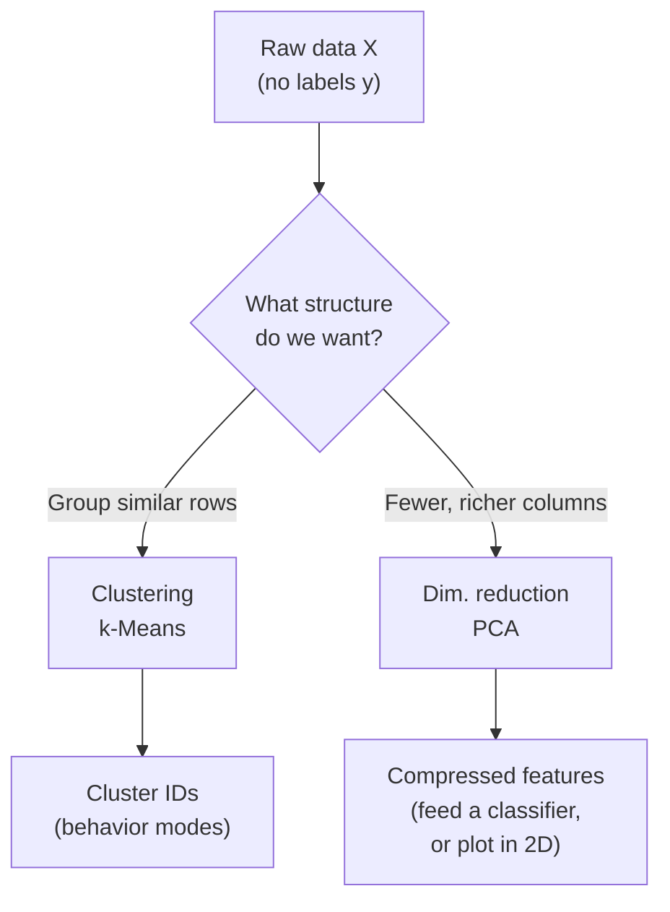
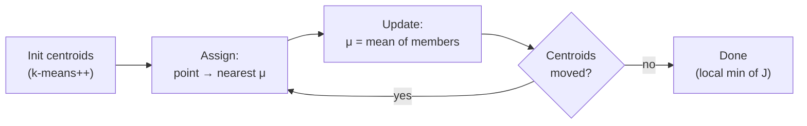

# 08 — 非監督式學習：k-平均與主成分分析

> 第 2 部分 · 第 08 課 · 程式技術棧：scikit-learn (+ tiny numpy PCA)

**先備知識：** [07 — 支持向量機與核](07-svm-kernels.md)

**學完本課你能：**
- 解釋 **k-平均 (k-means)** 如何透過 **Lloyd（指派/更新）迴圈** 找出分群，以及它最小化的是什麼目標函數。
- 用 **手肘法 (elbow method)** 與 **輪廓分數 (silhouette score)** 挑選合理的分群數 $k$，並說出 k-平均在什麼情況下會失效。
- 把 **主成分分析 (PCA)** 推導為最大變異數的方向，並把它和 **共變異數矩陣 (covariance matrix) 的特徵向量** 連結起來。
- 用 **解釋變異數比例 (explained-variance ratio)** 決定要保留幾個成分，並知道何時該改用 t-SNE/UMAP。
- 把兩者都應用到機器人資料上：把遙控潛水器 (ROV) 的下潛紀錄分群成行為模式，並在丟進分類器前先壓縮高維度的感測器特徵。

---

## 1. 直覺理解

到目前為止的每個方法都需要 **標籤 (label)**：你把 $(x, y)$ 配對交給模型，它學會這個映射。**非監督式學習 (unsupervised learning)** 拿掉了 $y$。你手上只有 $X$，而你希望演算法自己浮現出*結構*。

有兩種結構不斷地重要：

- **分群 (clustering)** ——「哪些點屬於同一群？」把列 (rows) 分組。（k-平均）
- **降維 (dimensionality reduction)** ——「哪些方向真正承載了資訊？」把欄 (columns) 壓縮。（主成分分析）

**類比。** 想像你的遙控潛水器的飛行紀錄器傾倒出數千筆帶時間戳的快照——深度、俯仰、推進器電流、距海床高度、航向變化率。沒有人標記它們。**k-平均** 就像一位碼頭主管把這些快照分類進幾個桶子——「巡航」、「定點保持」、「下潛」、「海底測量」——純粹依據數字有多相似。**主成分分析** 則像是發現，在 12 個感測器當中，其實只有 3 個*組合*訊號（一個「下潛積極度」軸、一個「橫向漂移」軸、一個「耗電量」軸）就解釋了幾乎所有東西；其餘的都是冗餘與雜訊。一個把列分組，另一個重新描述欄。



這兩者天生就是一對：先用主成分分析去雜訊/壓縮，再對壓縮後的空間做 k-平均——這是你會一再使用的主力管線。

---

## 2. 數學原理

### k-平均：目標函數

我們有 $n$ 個點 $x_i \in \mathbb{R}^d$，想要 $k$ 個分群。k-平均挑選 $k$ 個 **質心 (centroid)** $\mu_1, \dots, \mu_k \in \mathbb{R}^d$，並把每個點指派給最近的質心。它最小化 **群內平方和（WCSS, within-cluster sum of squares）**，也稱為*慣量 (inertia)*：

$$
J = \sum_{i=1}^{n} \min_{j \in \{1,\dots,k\}} \; \lVert x_i - \mu_j \rVert^2
$$

- $x_i$ —— 第 $i$ 個資料點（一個 $d$ 維向量）。
- $\mu_j$ —— 第 $j$ 群的質心。
- $\lVert \cdot \rVert^2$ —— 平方歐氏距離；我們想讓它變小的「離散程度」。
- $J$ —— 每個點到*它自己*質心的總平方距離。$J$ 越小 = 分群越緊密。

它從何而來：如果每個分群都用一個原型點來概括，$J$ 就是把每個 $x_i$ 換成其原型所造成的總平方重建誤差。最小化它正是「讓原型具代表性」。

### Lloyd 迴圈（為什麼它有效）

同時對指派**與**質心去最小化 $J$ 是 NP-hard 的，所以我們交替進行——固定一邊，最佳化另一邊：

1. **指派步驟。** 固定質心。把每個點放進最近的分群：
$$
c_i = \arg\min_{j} \; \lVert x_i - \mu_j \rVert^2
$$
給定質心後，這對 $J$ 而言是最佳的——每個點都挑選成本最低的那一項。

2. **更新步驟。** 固定指派。把每個質心設為其成員的 **平均 (mean)**：
$$
\mu_j = \frac{1}{|C_j|} \sum_{i \in C_j} x_i
$$
為什麼是平均？對於固定的分群 $C_j$，$\sum_{i \in C_j}\lVert x_i - \mu_j\rVert^2$ 會在令 $\nabla_{\mu_j} = 0$ 時最小化，也就是 $\sum_{i\in C_j}(x_i - \mu_j)=0 \Rightarrow \mu_j = \text{mean}$。平均*就是*最小平方意義下的中心。

每一步都只會降低（或維持）$J$，且 $J \ge 0$，所以這個迴圈會 **收斂**——但只收斂到*局部*最小值。因此我們會跑數次隨機重啟（`n_init`）並保留最好的結果。**k-means++** 會把初始質心散開來播種，這能大幅減少糟糕的局部最佳解。



### 選擇 $k$

- **手肘法。** 畫出 $J(k)$ 對 $k$ 的圖。它總是遞減（質心越多 → 越緊密），但*下降速率*會在「對的」$k$ 處急遽變緩——也就是手肘。挑曲線從陡轉平的轉折處。
- **輪廓分數。** 對於點 $i$，令 $a_i$ = 到它自己群的平均距離，$b_i$ = 到*最近的其他*群的平均距離。則
$$
s_i = \frac{b_i - a_i}{\max(a_i, b_i)} \in [-1, 1]
$$
接近 $+1$ = 緊貼在自己群裡且遠離其他群；接近 $0$ = 位於邊界上；負值 = 大概被指派錯了。把所有點的 $s_i$ 取平均，挑選讓它最大化的 $k$。輪廓分數比肉眼看手肘更有原則。

### 主成分分析：最大變異數的方向

把資料置中：$\tilde{X} = X - \bar{x}$（減去各欄的平均；主成分分析*要求*置中）。**共變異數矩陣** 為

$$
\Sigma = \frac{1}{n-1}\, \tilde{X}^\top \tilde{X} \in \mathbb{R}^{d \times d}
$$

- $\Sigma_{ab}$ —— 特徵 $a$ 與特徵 $b$ 如何共同變動。對角線 = 每個特徵的變異數。

我們想找出單位方向 $w$（$\lVert w \rVert = 1$），使得投影後的資料 $\tilde{X} w$ 具有 **最大變異數**。投影的變異數是

$$
\operatorname{Var}(\tilde{X} w) = w^\top \Sigma\, w
$$

在 $\lVert w\rVert = 1$ 的限制下最大化 $w^\top \Sigma w$ 是一個帶約束的問題。拉格朗日函數 $w^\top\Sigma w - \lambda(w^\top w - 1)$ 在以下情況時梯度為零

$$
\Sigma\, w = \lambda\, w
$$

這就是 **特徵向量方程式**。所以最佳方向就是 **$\Sigma$ 的特徵向量**，而沿著每個方向所擷取的變異數就是它的 **特徵值** $\lambda$（因為 $w^\top\Sigma w = \lambda$）。把特徵值由大到小排序：最頂端的特徵向量是 **PC1**（變異數最多），下一個是 **PC2**（在與 PC1 正交的前提下擷取最多*剩餘*變異數），依此類推。

要降到 $p < d$ 維，就投影到前 $p$ 個特徵向量 $W_p = [w_1, \dots, w_p]$ 上：

$$
Z = \tilde{X}\, W_p \in \mathbb{R}^{n \times p}
$$

第 $j$ 個成分的 **解釋變異數比例** 為

$$
\text{EVR}_j = \frac{\lambda_j}{\sum_{m=1}^{d} \lambda_m}
$$

保留足夠多的成分，使累積 EVR 超過某個門檻（比方說 0.95 = 「保留 95% 的變異數」）。

> 實務提醒：在生產環境中，你會用 $\tilde{X}$ 的 **SVD（奇異值分解）** 而不是顯式地構造 $\Sigma$（數值上更穩定）——這正是 scikit-learn 所做的。共變異數特徵分解的觀點最容易*理解*；兩者給出相同的答案。

**主成分分析是線性的。** 若要*視覺化*糾結的非線性結構（例如 MNIST 數字流形），請改用 **t-SNE** 或 **UMAP**——它們會保留局部鄰域，畫出漂亮的 2D 圖。但它們會扭曲全域距離且不可逆，所以拿它們來*觀看*，而不是當作下游模型的特徵。壓縮的預設選擇仍然是主成分分析。

---

## 3. 程式碼

```python
import numpy as np
import matplotlib.pyplot as plt
from sklearn.datasets import make_blobs
from sklearn.cluster import KMeans
from sklearn.metrics import silhouette_score

# --- 合成分群：2D 中的 4 個高斯團塊 ---------------------------
X, y_true = make_blobs(
    n_samples=600, centers=4, cluster_std=0.90,
    random_state=42,
)

# --- 擬合 k-平均 -----------------------------------------------------------
km = KMeans(
    n_clusters=4,
    init="k-means++",   # 聰明的播種 -> 較少糟糕的局部最小值
    n_init=10,          # 10 次隨機重啟，保留慣量最低的那一個
    random_state=42,
)
labels = km.fit_predict(X)

print(f"inertia (WCSS J): {km.inertia_:.1f}")
print(f"iterations to converge: {km.n_iter_}")
# -> inertia (WCSS J): 941.9
# -> iterations to converge: 2
```

注意我們用了真實的團塊數（4）。在真實世界中你並不知道它——所以讓我們來*找出*它。

```python
# --- 選擇 k：手肘（慣量）+ 輪廓 ------------------------------
ks = range(2, 9)
inertias, sils = [], []
for k in ks:
    m = KMeans(n_clusters=k, n_init=10, random_state=42).fit(X)
    inertias.append(m.inertia_)
    sils.append(silhouette_score(X, m.labels_))

best_k = ks[int(np.argmax(sils))]
print(f"best k by silhouette: {best_k}")
# -> best k by silhouette: 4

fig, ax = plt.subplots(1, 2, figsize=(11, 4))
ax[0].plot(list(ks), inertias, "o-")
ax[0].set(xlabel="k", ylabel="inertia (WCSS J)", title="Elbow method")
ax[1].plot(list(ks), sils, "o-", color="tab:green")
ax[1].set(xlabel="k", ylabel="mean silhouette", title="Silhouette")
plt.tight_layout()
plt.show()
```

**你應該看到：** 手肘圖在 $k=4$ 處急遽彎折（先陡後平），而輪廓圖在 $k=4$ 處達到峰值。兩個獨立的訊號一致地指向真相。

```python
# --- 視覺化分群 + 質心 ---------------------------------------
plt.figure(figsize=(6, 5))
plt.scatter(X[:, 0], X[:, 1], c=labels, cmap="tab10", s=18, alpha=0.7)
plt.scatter(
    km.cluster_centers_[:, 0], km.cluster_centers_[:, 1],
    marker="X", s=260, c="black", edgecolor="white", linewidths=1.5,
    label="centroids",
)
plt.legend(); plt.title("k-Means clusters"); plt.tight_layout(); plt.show()
```

**你應該看到：** 四團彩色的點雲，每團的質量中心都坐著一個黑色的 **X**——質心正好落在每個團塊的正中央。

### 從零實作主成分分析（numpy eig）對比 scikit-learn

```python
from sklearn.decomposition import PCA
from sklearn.datasets import load_iris

iris = load_iris()
A = iris.data            # (150, 4)：花萼/花瓣的長與寬
y = iris.target

# ---- 從零實作：共變異數矩陣的特徵分解 ----------
A_centered = A - A.mean(axis=0)                 # 主成分分析需要置中
cov = np.cov(A_centered, rowvar=False)          # (4, 4) 共變異數 Σ
eigvals, eigvecs = np.linalg.eigh(cov)          # eigh：對稱矩陣 -> 實數、由小到大排序

order = np.argsort(eigvals)[::-1]               # 依變異數由大到小排序
eigvals, eigvecs = eigvals[order], eigvecs[:, order]

evr = eigvals / eigvals.sum()                   # 解釋變異數比例
print("EVR (from scratch):", np.round(evr, 4))
# -> EVR (from scratch): [0.9246 0.0531 0.0171 0.0052]

Z_scratch = A_centered @ eigvecs[:, :2]         # 投影到前 2 個主成分

# ---- scikit-learn（內部使用 SVD）----------------------------------
pca = PCA(n_components=2)
Z_sklearn = pca.fit_transform(A)                # sklearn 會幫你置中
print("EVR (sklearn):     ", np.round(pca.explained_variance_ratio_, 4))
# -> EVR (sklearn):      [0.9246 0.0531]

# 相同的子空間——特徵向量的正負號可能翻轉，所以比較 |座標|。
print("match:", np.allclose(np.abs(Z_scratch), np.abs(Z_sklearn), atol=1e-6))
# -> match: True
```

四個成分當中的前兩個就已經握有 **約 98%** 的變異數——鳶尾花資料其實偽裝成 4D，骨子裡幾乎是 2D。

```python
# --- 散點繪製 2D 投影 --------------------------------------------
plt.figure(figsize=(6, 5))
for c, name in zip(range(3), iris.target_names):
    plt.scatter(Z_sklearn[y == c, 0], Z_sklearn[y == c, 1], s=22, label=name)
plt.xlabel("PC1 (92.5% var)"); plt.ylabel("PC2 (5.3% var)")
plt.legend(); plt.title("Iris projected to 2D via PCA"); plt.tight_layout(); plt.show()
```

**你應該看到：** 從 4D 壓縮到 2D 後，*setosa* 以一個乾淨分離的團塊坐在左側，而 *versicolor* 與 *virginica* 形成兩個相鄰（略微重疊）的群——這個結構撐過了壓縮。

---

## 4. 實際案例

### (a) 把遙控潛水器下潛紀錄分群成行為模式

你的遙控潛水器以 5 Hz 串流遙測資料。每個時間步你都計算出一個特徵向量——深度變化率、俯仰、橫滾率、推進器總電流、距海床高度、航向變化率大小。你想*自動分段*數小時的影像為各種行為模式，而不需要手動標記。

```python
import numpy as np
from sklearn.preprocessing import StandardScaler
from sklearn.cluster import KMeans
from sklearn.pipeline import make_pipeline

rng = np.random.default_rng(0)

def mode(n, depth_rate, thruster, altitude, hdg_rate):
    """偽造一種行為模式：[depth_rate, pitch, thruster_A, altitude_m, hdg_rate]。"""
    return np.column_stack([
        rng.normal(depth_rate, 0.05, n),
        rng.normal(0.0,        0.5,  n),
        rng.normal(thruster,   0.3,  n),
        rng.normal(altitude,   0.4,  n),
        rng.normal(hdg_rate,   0.3,  n),
    ])

# transit：快速前進、中等高度 | descent：下沉 | station-keep：懸停 | survey：低且穩定
X = np.vstack([
    mode(300, depth_rate=0.0,  thruster=3.0, altitude=5.0, hdg_rate=0.2),  # transit
    mode(300, depth_rate=0.6,  thruster=1.5, altitude=8.0, hdg_rate=0.1),  # descent
    mode(300, depth_rate=0.0,  thruster=0.8, altitude=3.0, hdg_rate=0.0),  # station-keep
    mode(300, depth_rate=0.0,  thruster=1.2, altitude=1.0, hdg_rate=1.5),  # bottom survey
])

# 關鍵：標準化。推進器電流（安培）與 depth_rate（公尺/秒）落在
# 截然不同的尺度上；不縮放的話，歐氏距離會被原始數值最大的那個
# 特徵所主宰。
pipe = make_pipeline(StandardScaler(), KMeans(n_clusters=4, n_init=10, random_state=0))
modes = pipe.fit_predict(X)

# 把分群中心反轉回原始單位來「命名」這些模式。
km = pipe.named_steps["kmeans"]
scaler = pipe.named_steps["standardscaler"]
centers = scaler.inverse_transform(km.cluster_centers_)
cols = ["depth_rate", "pitch", "thruster_A", "altitude_m", "hdg_rate"]
for i, c in enumerate(centers):
    print(f"cluster {i}: " + ", ".join(f"{n}={v:+.2f}" for n, v in zip(cols, c)))
# -> 例如 depth_rate≈+0.6 的群 -> 「descent」；altitude≈1.0 且 hdg_rate≈1.5 -> 「bottom survey」
```

**對應。** k-平均交給你的是匿名的分群 ID 0–3；*你*要去解讀質心（在 `inverse_transform` 之後、以真實單位）來貼上人類可讀的名稱。現在你就能自動標記一段 3 小時的下潛、直接跳到「海底測量」片段、標記異常的時間步（到每個質心的距離都很大 = 不像任何正常情況），並針對每種模式觸發不同的紀錄/控制策略——全都是非監督式的。

### (b) 在分類器前用主成分分析壓縮感測器特徵

想像一個每次 ping 回傳 64 個 bin 的 **前視聲納 (forward-looking sonar)** = 一個 64 維向量，用來分類海床（沙 / 岩石 / 沉船）。相鄰的 bin 高度相關，所以*本質*維度遠低於 64。主成分分析在分類器之前先壓縮——特徵更少 → 訓練更快、過度擬合更少（回想 [05 — 過度擬合與評估](05-overfitting-evaluation.md)），而且因為被丟掉的低變異數成分大多是雜訊，還有去雜訊的效果。

```python
from sklearn.datasets import load_digits          # 8x8 = 64 維，當作聲納 bin 的乾淨替身
from sklearn.decomposition import PCA
from sklearn.linear_model import LogisticRegression
from sklearn.pipeline import make_pipeline
from sklearn.model_selection import cross_val_score

digits = load_digits()
Xs, ys = digits.data, digits.target               # (1797, 64)

# 保留足夠的主成分以留住 90% 的變異數 —— 讓 PCA 自己挑數量。
clf = make_pipeline(PCA(n_components=0.90), LogisticRegression(max_iter=5000))
clf.fit(Xs, ys)
n_kept = clf.named_steps["pca"].n_components_
print(f"kept {n_kept} of 64 dims for 90% variance")
# -> kept 21 of 64 dims for 90% variance

acc_pca  = cross_val_score(clf, Xs, ys, cv=5).mean()
acc_full = cross_val_score(
    make_pipeline(LogisticRegression(max_iter=5000)), Xs, ys, cv=5).mean()
print(f"accuracy  PCA(21d): {acc_pca:.3f}   full(64d): {acc_full:.3f}")
# -> accuracy  PCA(21d): 0.893   full(64d): 0.914
```

我們丟掉了 **三分之二** 的維度，卻維持了基本相同的準確率。對你的聲納管線而言，這意味著一個更輕、更快、能塞進遙控潛水器機載運算預算的模型——在記錄下來的資料上擬合 PCA 一次，然後即時對每筆進來的 ping 做 `.transform()`。

---

## 5. 常見陷阱與技巧

- **在 k-平均與主成分分析之前永遠要縮放。** 兩者都依賴歐氏距離 / 變異數。一個以安培計（0–10）的特徵會淹沒一個以公尺/秒計（0–1）的特徵。除非特徵本來就可比較，否則請用 `StandardScaler`。這是「我的分群看起來像亂的」的頭號成因。
- **k-平均假設分群是球狀、等大小、等密度的。** 它畫的是直線（Voronoi）邊界，會欣然地把一個長橢圓切成兩半，或把兩個細長的合併成一個。對於拉長/巢狀/密度不一的形狀，請用 **GMM**（橢圓狀）或 **DBSCAN**（基於密度，能找出任意形狀與離群值）。
- **它永遠會回傳 $k$ 個分群——即使在毫無結構的雜訊上。** k-平均無法告訴你「這裡沒有分群」。要用輪廓分數和領域常識來驗證；別盲目相信那些 ID。
- **多跑幾次重啟。** 保持 `n_init >= 10` 和 `init="k-means++"`。單一個糟糕的隨機種子可能收斂到一個肉眼可見錯誤的 $J$ 局部最小值。
- **主成分分析需要置中，且是由變異數驅動，而非由類別驅動。** 頂端主成分 = 最大變異數，這*不見得*總是最具*鑑別力*的方向。如果你有標籤且想要分離，可考慮 **LDA**。主成分分析的設計本質就是非監督式的。
- **別把意義讀進 t-SNE/UMAP 的幾何裡。** 那些圖中的分群*大小*與*群間距離*並不忠實——它們只保留局部鄰域。用它們來看，用主成分分析來計算特徵。

---

## 6. 自我檢測

**Q1.** 為什麼質心 **更新** 步驟要把 $\mu_j$ 設為其被指派點的*平均*，而不是，比方說，中位數？

<details><summary>解答</summary>
因為目標函數 $J$ 用的是*平方*歐氏距離。對 $\mu_j$ 最小化 $\sum_{i\in C_j}\lVert x_i-\mu_j\rVert^2$ 會得到 $\nabla = -2\sum(x_i-\mu_j)=0 \Rightarrow \mu_j=\text{mean}$。算術平均是最小*平方*意義下的中心。（如果目標函數用的是絕對距離，*中位數*才會是最佳——那就是 k-medians。）
</details>

**Q2.** 慣量的手肘圖隨著 $k$ 增大持續下降，從不見底。為什麼你不能直接最小化慣量來選 $k$？

<details><summary>解答</summary>
慣量 $J$ 對 $k$ 是單調非遞增的：質心越多總是把資料擬合得越緊，當 $k=n$ 時（每個點都是它自己的群）達到 $J=0$。所以最小化 $J$ 會理所當然地選出 $k=n$，毫無用處。你要的是*手肘*（報酬遞減處），或是去最大化一個平衡的指標如輪廓分數，它對過鬆與過度切分的分群都會懲罰。
</details>

**Q3.** 在主成分分析中，共變異數矩陣的特徵值究竟是什麼，你又如何用它們來挑選成分數量？

<details><summary>解答</summary>
每個特徵值 $\lambda_j$ 是 **資料沿著** 其特徵向量（主成分）方向的 **變異數**：$w_j^\top\Sigma w_j=\lambda_j$。解釋變異數比例是 $\lambda_j/\sum_m\lambda_m$。挑選使其 **累積** 比例超過你的門檻（例如 0.95）的最少數量的頂端成分，保留大部分訊號，同時丟掉低變異數（常常是雜訊）的方向。
</details>

**Q4.** 你對原始的遙控潛水器遙測資料分群，其中推進器電流範圍為 0–10 A，深度變化率範圍為 0–1 m/s，而分群看起來完全忽略了深度。發生了什麼事，又該如何修正？

<details><summary>解答</summary>
k-平均使用歐氏距離，所以*數值*散布最大的特徵（推進器電流）主宰了距離，而小範圍的深度變化率實際上變得隱形了。修正方法：先標準化特徵（`StandardScaler`，零平均 / 單位變異數），讓每個特徵都能可比較地貢獻。把它包進管線裡，這樣縮放只會從訓練資料學習。
</details>

**Q5.** 你的同事做了一張漂亮的 t-SNE 圖，圖中有兩個分群相距很遠，於是他斷定這些行為模式「非常不同」。這個結論站得住腳嗎？

<details><summary>解答</summary>
不一定。t-SNE（與 UMAP）保留*局部*鄰域，卻扭曲*全域*距離與分群大小——圖中兩個分群之間的間隙在很大程度上是嵌入的產物，而非忠實的距離。要主張兩種模式相距很遠，請在原始（或主成分分析）特徵空間中量測它，例如質心之間的距離。t-SNE 只用於定性的觀看。
</details>

---

## 回顧與下一步

- **非監督式學習** 在沒有標籤的情況下找出結構：**k-平均** 把列分組，**主成分分析** 重新描述欄。
- **k-平均** 透過 **Lloyd 迴圈**（指派 → 更新為平均）最小化群內平方和；它收斂到*局部*最小值，所以要用 k-means++ 和多次重啟。用 **手肘法** 與 **輪廓分數** 選擇 $k$；記得它假設分群是球狀、可比較的。
- **主成分分析** 投影到 **共變異數矩陣的頂端特徵向量** 上——也就是最大變異數的方向——而 **解釋變異數比例** 告訴你要保留幾個。它是線性的；t-SNE/UMAP 只用於視覺化。
- **永遠先縮放。** 兩個方法都是由距離/變異數驅動的。
- 在機器人領域：把下潛紀錄分群成命名好的 **行為模式**，並用主成分分析壓縮高維度的感測器特徵，讓下游分類器更輕、更穩健。

接下來，我們將離開古典機器學習，開始打造深度學習的引擎——把簡單的單元堆疊成一個網路並把資料推送通過它：**[09 — 神經網路與前向傳播](09-neural-networks-mlp.md)**。
