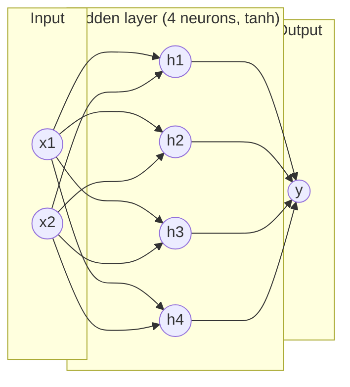

# 09 — 神經網路與前向傳播

> 第 3 部分 · 第 09 課 · 程式技術棧：numpy-from-scratch

**先備知識：** [08 — 非監督式學習：k-平均與主成分分析](08-kmeans-pca.md) · 並且你應該熟悉 [02 — 線性迴歸](02-linear-regression.md) 與 [04 — 邏輯迴歸與分類](04-logistic-regression.md)，因為神經網路 (neural network) 正是由這些元件堆疊而成。

**學完本課你能：**
- 解釋一個神經元 (neuron) 如何泛化你已經熟悉的線性模型，以及為什麼把它們**堆疊**成多層能帶來新的能力。
- 把**前向傳播 (forward pass)** 表述為重複的 `matmul → add bias → activate`，並以 numpy 實作它。
- 從*數學上*解釋為什麼**非線性啟動 (non-linear activation)** 不可或缺——少了它，深層網路會塌縮成單一線性映射。
- 比較 **sigmoid、tanh 與 ReLU**，並能說出理由挑選其中一個。
- 從零開始建立一個 2 層的多層感知器 (multilayer perceptron, MLP)，並視覺化它劃分出的曲線決策區域。

---

## 1. 直覺理解

你目前為止建立的一切——線性迴歸、邏輯迴歸、支持向量機的線性邊界——都是**一個神經元**。神經元接收輸入，加權、求和、加上偏值 (bias)，再把結果壓過某個函數：

$$
\text{neuron}(\mathbf{x}) = f\!\left(\mathbf{w}^\top \mathbf{x} + b\right)
$$

邏輯迴歸*就是*一個帶有 sigmoid $f$ 的單一神經元。這就是全部的祕密：神經網路不是什麼奇異的新模型，它只是**把邏輯迴歸重複並連接起來**。

那為什麼要堆疊它們？因為一個神經元只能在輸入空間中畫出一道直線切割（第 04 課）。真實訊號並非線性可分。一個代表「障礙物」相對於「開闊水域」的聲納回波，落在特徵空間中一塊糾纏、彎曲的區域裡。單一直線無法把它圍起來。

訣竅在於：把一層神經元的輸出餵給下一層。每一層都是一個線性映射，後面接著一道*彎折*（啟動）。堆疊幾道彎折，你就能描繪出任何你想要的曲線。

**類比——摺紙。** 把輸入空間想成一張平坦的紙，上面散落著兩種顏色的點。線性模型只能用一刀直線剪法切割這張紙。每一個非線性層就像*摺疊*這張紙。摺個幾次之後，原本毫無希望地混在一起的點就排列整齊，使得一刀直線切割就能把它們分開。網路學習*該往哪裡摺*；最後一層只做那簡單的直線切割。把摺疊（非線性）拿掉，再怎麼堆疊也沒用——你又回到了一刀直線切割。

這就是**感知器 (perceptron)**（Rosenblatt，1958 年），最初的單一神經元，放大成**多層感知器 (MLP)**——也稱為全連接 (fully-connected) 或密集 (dense) 網路。



每一個箭頭都是一個可學習的權重 (weight)。每個神經元也各有一個偏值（圖中未畫出）。資料嚴格地由左流向右：那一次單向的掃過，就是**前向傳播**。

---

## 2. 數學原理

### 一層就是一次矩陣乘法加上一道彎折

把一層的神經元打包在一起。如果第 $\ell$ 層有 $n_\ell$ 個神經元，並接收輸入 $\mathbf{a}^{(\ell-1)} \in \mathbb{R}^{n_{\ell-1}}$，那麼：

$$
\mathbf{z}^{(\ell)} = W^{(\ell)} \mathbf{a}^{(\ell-1)} + \mathbf{b}^{(\ell)}, \qquad
\mathbf{a}^{(\ell)} = f^{(\ell)}\!\left(\mathbf{z}^{(\ell)}\right)
$$

- $W^{(\ell)} \in \mathbb{R}^{n_\ell \times n_{\ell-1}}$ ——**權重矩陣**。第 $i$ 列是某一個神經元的權重向量 $\mathbf{w}_i^\top$，所以這個矩陣-向量乘積一次就把所有神經元的內積堆疊起來。
- $\mathbf{b}^{(\ell)} \in \mathbb{R}^{n_\ell}$ ——**偏值**向量，每個神經元一個偏移量。
- $\mathbf{z}^{(\ell)}$ ——**預啟動值 (pre-activation)**（在輸出層也稱為「logits」）。
- $f^{(\ell)}$ ——**啟動函數 (activation function)**，逐元素套用。
- $\mathbf{a}^{(\ell)}$ ——**啟動值 (activation)**（該層的輸出）。我們設定 $\mathbf{a}^{(0)} = \mathbf{x}$，也就是原始輸入。

*它從何而來：* 一個神經元是 $f(\mathbf{w}_i^\top \mathbf{a} + b_i)$。堆疊 $n_\ell$ 個，那些內積 $\mathbf{w}_i^\top \mathbf{a}$ 就成了 $W\mathbf{a}$ 的各列。矩陣形式只是記帳工具——除了第 02 課的線性模型平行套用 $n_\ell$ 次之外，沒有任何新東西。

### 前向傳播 = 把各層複合起來

對一個 $L$ 層的網路，預測就是這個複合函數

$$
\hat{\mathbf{y}} = f^{(L)}\!\Big(W^{(L)} f^{(L-1)}\big(\cdots f^{(1)}(W^{(1)}\mathbf{x} + \mathbf{b}^{(1)}) \cdots\big) + \mathbf{b}^{(L)}\Big).
$$

實務上你不會寫出那個怪物——你用迴圈：`z = W @ a + b; a = f(z)`，一層接一層。那個迴圈**就是**前向傳播。

### 為什麼非線性是整場遊戲的關鍵

假設我們把啟動拿掉（使用 $f = \text{identity}$）。那麼兩層複合起來會是：

$$
\mathbf{z}^{(2)} = W^{(2)}\big(W^{(1)}\mathbf{x} + \mathbf{b}^{(1)}\big) + \mathbf{b}^{(2)}
= \underbrace{W^{(2)}W^{(1)}}_{\tilde W}\,\mathbf{x} + \underbrace{(W^{(2)}\mathbf{b}^{(1)} + \mathbf{b}^{(2)})}_{\tilde{\mathbf b}}.
$$

兩個矩陣的乘積是*一個*矩陣；合併後的偏值是*一個*向量。所以任何深度的線性網路都**恰好等價於單一線性層** $\tilde W \mathbf{x} + \tilde{\mathbf b}$。十個隱藏層、一百萬個參數——仍然只是一條線（或超平面）。非線性的 $f$ 才是打破這種塌縮、讓深度真正帶來表達能力的東西。**記住這一點：堆疊線性映射什麼也得不到；它們之間的那道彎折才是一切。**

### 三種你會不斷遇到的啟動函數

| 名稱 | $f(z)$ | 值域 | 備註 |
|------|--------|-------|-------|
| **Sigmoid** | $\sigma(z)=\dfrac{1}{1+e^{-z}}$ | $(0,1)$ | 壓縮成機率；對於大的 $\lvert z\rvert$ 會飽和（變平）。 |
| **Tanh** | $\tanh(z)=\dfrac{e^z-e^{-z}}{e^z+e^{-z}}$ | $(-1,1)$ | 以零為中心的 sigmoid；在隱藏層通常表現更好。 |
| **ReLU** | $\max(0,z)$ | $[0,\infty)$ | 便宜，對 $z>0$ 不會飽和；深層網路的預設選擇。 |

Sigmoid 與 tanh 都是平滑的 S 形曲線；你在第 04 課把 sigmoid 當作邏輯迴歸的連結函數認識過。**ReLU**（Rectified Linear Unit，修正線性單元）簡單得近乎粗暴——讓正值通過、把負值歸零——但它卻是現代深度學習的主力，因為它讓梯度保持存活（你會在第 10 課感受到原因）。三者共有的關鍵性質是：它們都是**非線性的**，所以它們製造出那些摺疊。

### 通用近似——那個令人安心的定理

**通用近似定理 (universal approximation theorem)** 說：一個只有*單一*隱藏層、搭配非多項式啟動（sigmoid、tanh、ReLU 都符合）的 MLP，只要隱藏神經元夠多，就能在有界區域上以任意精度近似**任何**連續函數。

*這是直覺，不是證明：* 想像兩個方向相反的 sigmoid 階梯。把它們相減，你就得到一個局部的「凸起」。把夠多適當高度的凸起並排放置，你就能描繪出任何曲線，就像用樂高拼出一個平滑的形狀。寬度 = 你負擔得起的凸起數量。

兩點提醒，免得你太相信它：(1) 對於淺層網路，「夠多的神經元」可能是天文數字般龐大——**深度**通常在參數效率上遠勝過寬度；(2) 這個定理只說擬合*存在*，不保證梯度下降*找得到*它。存在 ≠ 可訓練。第 10–12 課就是在講如何真正找到它。

---

## 3. 程式碼

純 numpy，沒有自動微分。我們建立一個 2 層 MLP（$2 \to 8 \to 1$），而且**只跑前向傳播**——權重是固定的（隨機或手動設定），因為訓練是下一課的內容。目標：看清楚前向傳播只不過是 `matmul → bias → activate` 做兩次，以及它能夠表示一條曲線邊界。

```python
import numpy as np
import matplotlib.pyplot as plt

rng = np.random.default_rng(0)  # 可重現的隨機性

# ---- 啟動函數（逐元素） -----------------------------------
def sigmoid(z):
    return 1.0 / (1.0 + np.exp(-z))

def tanh(z):
    return np.tanh(z)

def relu(z):
    return np.maximum(0.0, z)

# ---- 一個密集層：z = a @ W.T + b，然後啟動 -----------------------
# 關於形狀的注意事項：我們一次處理一個 N 個樣本的批次。
#   a 的形狀為 (N, n_in)  -> 各列是樣本。
#   W 的形狀為 (n_out, n_in)，b 的形狀為 (n_out,)。
#   a @ W.T -> (N, n_out)：每一列是該樣本的預啟動值。
# 批次化 = 與第 2 節中逐樣本方程式完全相同的數學，
# 只是把 N 個樣本堆疊成各列（向量化，沒有對資料的 Python 迴圈）。
def dense(a, W, b, activation):
    z = a @ W.T + b           # (N, n_in) @ (n_in, n_out) + (n_out,) -> (N, n_out)
    return activation(z)

# ---- 一個 2 層 MLP：input(2) -> hidden(8, tanh) -> output(1, sigmoid) ------
class MLP:
    def __init__(self, n_in, n_hidden, n_out, rng):
        # 用扇入數縮放的 He 式初始化，讓預啟動值不會太大。
        # （初始化策略對「訓練」很重要——第 12 課會正式介紹。
        #  對於前向傳播的展示，我們只想要合理的數量級。）
        self.W1 = rng.standard_normal((n_hidden, n_in)) * np.sqrt(2.0 / n_in)
        self.b1 = np.zeros(n_hidden)
        self.W2 = rng.standard_normal((n_out, n_hidden)) * np.sqrt(2.0 / n_hidden)
        self.b2 = np.zeros(n_out)

    def forward(self, X):
        # 前向傳播：一層接一層，每一層都是 matmul -> bias -> activate。
        a1 = dense(X,  self.W1, self.b1, tanh)     # 隱藏層啟動值  (N, 8)
        a2 = dense(a1, self.W2, self.b2, sigmoid)  # 輸出機率      (N, 1)
        return a2

net = MLP(n_in=2, n_hidden=8, n_out=1, rng=rng)

# 對單一點做合理性檢查：
x = np.array([[0.5, -0.3]])          # 一個樣本，形狀 (1, 2)
print("forward(x) =", net.forward(x))
# -> forward(x) = [[0.505...]]   (一個落在 (0,1) 的機率；確切值取決於種子)
```

整個模型就是兩次 `dense` 呼叫。那就是神經網路的前向傳播——沒有魔法。

### 隨機權重就已經劃出曲線

MLP 的重點在於它能表示的區域*形狀*。讓我們用網路的輸出為平面上色。即使用**隨機、未訓練**的權重，邊界也是彎曲的——這證明了非線性正在做幾何上的工作。

```python
# 在輸入平面上建立一個細密的網格。
xs = np.linspace(-3, 3, 300)
ys = np.linspace(-3, 3, 300)
gx, gy = np.meshgrid(xs, ys)
grid = np.column_stack([gx.ravel(), gy.ravel()])   # (90000, 2)

probs = net.forward(grid).reshape(gx.shape)         # (300, 300) 機率

plt.figure(figsize=(5, 5))
plt.contourf(gx, gy, probs, levels=20, cmap="RdBu")
plt.colorbar(label="network output  σ(...)")
plt.contour(gx, gy, probs, levels=[0.5], colors="k", linewidths=2)  # 決策線
plt.title("Forward pass of a random 2->8->1 MLP")
plt.xlabel("x1"); plt.ylabel("x2")
plt.tight_layout()
plt.show()
```

**你應該看到：** 一個平滑的紅↔藍漸層，加上一條*蜿蜒、彎曲*的黑色 0.5 等高線——而不是一條直線。8 個 tanh 隱藏單元各貢獻一道柔和的「摺疊」，它們加總成一條彎折的邊界。現在把 `dense` 裡的 `tanh` → identity 並重新執行：黑色等高線會瞬間貼成一條完美的**直線**，從視覺上印證第 2 節的塌縮。那一個實驗就是本課最重要的收穫。

### 計算參數數量

```python
def count_params(net):
    return sum(a.size for a in [net.W1, net.b1, net.W2, net.b2])

print("params:", count_params(net))
# -> params: 33
# W1: 8*2=16, b1: 8, W2: 1*8=8, b2: 1  ->  16+8+8+1 = 33
```

33 個數字就完整定義了這個網路。訓練（第 10 課）就是在搜尋*最好的*那 33 個數字；前向傳播只是評估你目前手上不管是什麼的那些數字。

---

## 4. 實際案例——為無人水面載具推進器指令做感測器融合

你正在駕駛一艘**無人水面載具 (USV)**。你想要一個反應式的避碰控制器：給定船的處境，輸出一個轉向/推力修正。從感測器到正確指令的映射是**非線性的**——一個高速時正前方的小障礙物需要急轉彎，同樣的障礙物若遠在船舷側方則什麼都不用做。線性控制器（一個神經元）無法捕捉那種交互作用；MLP 可以。

**輸入（特徵向量 $\mathbf{x}$）：**

| 特徵 | 意義 | 來源 |
|---------|---------|--------|
| $x_1$ | 到最近障礙物的距離（公尺） | 聲納 / 光達 |
| $x_2$ | 到障礙物的方位（弧度，帶正負號） | 聲納 / 光達 |
| $x_3$ | 目前的縱移速度（公尺/秒） | GPS / 慣性測量單元 (IMU) |
| $x_4$ | 到航點的航向誤差（弧度） | 路徑跟隨器 |

**輸出：** $y \in (-1, 1)$，一個正規化的舵 (rudder) 指令（tanh 輸出：$-1$ = 全左舵，$+1$ = 全右舵）。

這個網路是 $4 \to 16 \to 16 \to 1$。前向傳播在微秒級把四個純量映射成一個指令——足夠快，能跑在 20 Hz 的 ROS2 控制迴圈裡。

```python
# 一個 3 層的反應式控制器：4 個感測器 -> 16 -> 16 -> 1 個舵指令。
# 這裡的權重是隨機的（未訓練）——我們只是在展示前向傳播 /
# 計算的形狀。實務上你會用記錄下來的專家舵手資料來訓練這些權重
# （行為複製）或透過強化學習。訓練 = 接下來幾課。
rng = np.random.default_rng(7)
W1 = rng.standard_normal((16, 4)) * np.sqrt(2/4);  b1 = np.zeros(16)
W2 = rng.standard_normal((16, 16)) * np.sqrt(2/16); b2 = np.zeros(16)
W3 = rng.standard_normal((1, 16)) * np.sqrt(2/16);  b3 = np.zeros(1)

def controller(x):
    a1 = relu(x @ W1.T + b1)    # ReLU 隱藏層：便宜，深層網路的預設
    a2 = relu(a1 @ W2.T + b2)
    out = tanh(a2 @ W3.T + b3)  # tanh 輸出 -> 有界的舵值，落在 (-1, 1)
    return out

# 一個情境：障礙物在正前方 8 公尺、偏船首 0.1 弧度、2 公尺/秒、有些微航向誤差。
state = np.array([[8.0, 0.10, 2.0, 0.05]])
print("rudder command:", controller(state))
# -> rudder command: [[ 0.xx ]]   (某個落在 (-1, 1) 的值；訓練前毫無意義)
```

這個方法是怎麼對應上去的：
- **特徵向量** = 你的感測器/狀態估計器在某個 ROS2 主題上發布的任何東西。對每個通道做正規化（以公尺計的距離與以弧度計的方位，落在天差地別的尺度上——見常見陷阱）。
- **隱藏層**學習非線性的交互作用（「近 AND 在前方 AND 高速 → 急轉彎」）。
- **有界的輸出**（tanh）讓致動器指令保持在物理上有效的範圍內——一個內建的安全箝制。
- 前向傳播就是**推論**步驟：訓練好的權重存在載具上，每一個控制節拍你就跑一次前向傳播取得指令。執行期間在船上不會發生任何最佳化。

為了用**經典資料集**來印證：第 3 節那個相同的 $2 \to H \to 1$ 架構，正是能解開著名的**雙月牙 (two-moons)** / XOR 型玩具問題的東西，而這些問題會打敗線性模型——你畫出來的那條曲線邊界，正是分開兩個交錯彎月所需要的。

---

## 5. 常見陷阱與技巧

- **忘了加非線性。** 如果你堆疊 `Linear → Linear` 而中間沒有啟動，你就浪費了一層——它在代數上塌縮成一個線性映射（第 2 節）。永遠要檢查權重層之間有一道彎折。
- **形狀錯誤是 numpy 的頭號錯誤。** 決定一個慣例並堅持它：這裡列 = 樣本，所以 $\mathbf{a} \in (N, n_{in})$ 而 $W \in (n_{out}, n_{in})$，於是用 `a @ W.T`。第一次接好一個網路時，在每一層都印出 `.shape`。
- **未正規化的輸入。** 餵入尺度不同的原始特徵（距離 ~100 公尺、方位 ~0.1 弧度）會把某些預啟動值推得很大，並讓 sigmoid/tanh 飽和變平——神經元就不再有反應。在第一層之前先標準化輸入（零平均、單位變異數）。
- **在隱藏層用 sigmoid。** 它*不*以零為中心而且很容易飽和；隱藏層偏好 **tanh**，深層網路則偏好 **ReLU**。把 sigmoid 保留給那個必須是機率的單一輸出。
- **對未訓練的輸出過度解讀。** 隨機權重的前向傳播會產生*某個*數字，但它毫無意義。架構定義了什麼是*可表示的*；訓練（下一課）才決定實際上*算出*什麼。
- **混淆寬度與深度。** 通用近似在*理論上*讓一個寬層能擬合任何東西，但實務上深度在參數效率上遠勝且更好訓練。別什麼問題都靠加寬某一層來解決。

---

## 6. 自我檢測

**Q1.** 你建了一個 5 層網路，但不小心到處都用了 identity（沒有啟動）。它的決策邊界能有多少個*有效相異*的線性區域，為什麼？

<details><summary>解答</summary>
一個——邊界是單一條筆直的超平面。在 identity 啟動下，整個網路塌縮成 $\tilde W \mathbf{x} + \tilde{\mathbf b}$，其中 $\tilde W = W^{(5)}\cdots W^{(1)}$。層與層之間若沒有非線性的彎折，深度什麼也不會增加。
</details>

**Q2.** 對於層方程式 $\mathbf{z}^{(\ell)} = W^{(\ell)}\mathbf{a}^{(\ell-1)} + \mathbf{b}^{(\ell)}$，如果第 $\ell-1$ 層有 10 個神經元、第 $\ell$ 層有 4 個，那麼 $W^{(\ell)}$ 與 $\mathbf{b}^{(\ell)}$ 的形狀各是什麼？

<details><summary>解答</summary>
$W^{(\ell)}$ 是 $4 \times 10$（列 = 輸出神經元，行 = 輸入維度），而 $\mathbf{b}^{(\ell)}$ 長度為 4（每個輸出神經元一個偏值）。乘積 $W\mathbf{a}$ 把一個 10 維向量映射成一個 4 維向量。
</details>

**Q3.** 邏輯迴歸和單一 sigmoid 神經元——是同一個模型還是不同的模型？

<details><summary>解答</summary>
同一個模型。邏輯迴歸*就是*一個神經元：$\hat y = \sigma(\mathbf{w}^\top\mathbf{x}+b)$。神經網路只是把許多這樣的神經元跨層連接起來——而這正是解鎖單一神經元畫不出的非線性邊界的關鍵。
</details>

**Q4.** 通用近似定理說一個隱藏層就能擬合任何連續函數。那為什麼還有人要建深層網路？

<details><summary>解答</summary>
兩個原因。(1) 效率：淺層網路為了表示同一個函數，可能需要比深層網路*指數級*更多的神經元，所以深度在參數效率上遠勝。(2) 這個定理保證好的擬合*存在*，不保證梯度下降會從資料中*找到*它。存在 ≠ 可訓練。
</details>

**Q5.** 在第 3 節的展示中權重是隨機且未訓練的，然而畫出來的邊界卻已經是彎曲的。這告訴你架構相對於訓練各自扮演什麼角色？

<details><summary>解答</summary>
架構（層 + 非線性啟動）決定了網路能表示的*形狀類別*——在這裡是曲線邊界。訓練只是透過調整權重來選出*哪一條具體的*曲線擬合你的資料。隨機的前向傳播展現了這種能力；它對正確性隻字未提。
</details>

---

## 回顧與下一步

- 神經元就是第 02/04 課的線性模型再加上一個啟動；**MLP** 把神經元堆疊成多層。
- **前向傳播**就是重複的 `matmul → add bias → activate`，一層接一層複合起來——推論的全部內容就是這樣。
- **非線性啟動是必要的**：少了它，任何深度都會塌縮成單一線性映射。Sigmoid、tanh 與 ReLU 是你的日常選擇（深層隱藏層用 ReLU，有界輸出用 sigmoid/tanh）。
- **通用近似**說一個夠寬的網路能擬合任何連續函數——但深度更有效率，而且存在和可訓練並不是同一回事。
- 我們在 numpy 中實作了一個 2 層網路，看到隨機權重就已經劃出一塊曲線決策區域；把非線性關掉，它就被壓平成一條直線。

我們可以*評估*一個網路，但它的權重仍然是隨機的垃圾。接下來我們要讓它**學習**：計算損失、把梯度往回推過每一層，並更新權重。

➡️ **下一課：** [10 — 從零開始的反向傳播](10-backpropagation.md)
