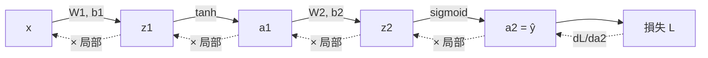

# 10 — 從零實作反向傳播

> 第 3 部分 · 第 10 課 · 程式技術棧：numpy-from-scratch

**先備知識：** [09 — 神經網路與前向傳播](09-neural-networks-mlp.md) — 你必須熟悉層方程式 $\mathbf{z}=W\mathbf{a}+\mathbf{b}$、啟動函數，以及前向傳播 (forward pass)。你也會大量倚賴 [03 — 梯度下降](03-gradient-descent.md)（更新式 $\theta := \theta - \alpha\nabla J$）與 [01 — 數學工具箱](01-math-foundations.md) 裡的連鎖律 (chain rule)。

**學完本課你能：**
- 把神經網路讀成一張**計算圖 (computation graph)**，並為每個節點指派一個**局部梯度 (local gradient)**。
- 把連鎖律陳述成「沿著路徑把局部梯度相乘」，並用它把誤差訊號往回傳。
- **親手推導**一個 2 層多層感知器 (MLP) 的反向方程式 —— 兩層各自的 $\partial L/\partial W$ 與 $\partial L/\partial \mathbf{b}$，包含啟動函數的導數。
- 實作一個**完整**的 numpy MLP —— 前向傳播、反向傳播 (backpropagation)、梯度下降 (gradient descent) 更新、訓練迴圈 —— 讓它學會一條非線性邊界（two-moons / XOR）。
- **以數值方式驗證**你的梯度，這項健全性檢查能抓出 90% 的反向傳播錯誤。

---

## 1. 直覺理解

第 09 課給了你一個能*表示*彎曲邊界的網路，但它的權重都是隨機的垃圾。第 03 課給了你修正它的引擎：梯度下降，$\theta := \theta - \alpha\nabla J$。唯一缺的一塊就是梯度本身 —— 網路裡**每一個權重**的 $\partial L/\partial w$，而那可能多達數百萬個。

**反向傳播 (backpropagation)** 就是在一次有效率的反向掃描中，把所有這些梯度都算出來的演算法。它不是一個新的最佳化器；它只是連鎖律，組織成讓你重複利用計算結果而不必重算的形式。一旦有了梯度，第 03 課的更新規則就能搞定剩下的事。

**比喻 —— 責任在廚房裡向後流動。** 一道菜出錯了（損失很高）。主廚不會把所有東西重煮一遍；他問的是「*我自己*最後的擺盤對這個錯誤貢獻了多少？」然後把一部分責任往回傳給醬汁站，醬汁站再把它分到的那份往回傳給備料廚師，依此類推。每一站只需要 (a) 從下游交到它手上的責任，以及 (b) 它自己的輸出對自己的輸入有多敏感 —— 也就是它的**局部梯度 (local gradient)**。把這兩者相乘，你就知道要怎麼調整*這一站*；剩下的往上游交出去。這條「責任 × 局部敏感度」的鏈，從輸出一路傳回輸入，**正是**反向傳播。

前向傳播由左到右計算輸出。反向傳播由右到左計算梯度，重複利用前向傳播已經存下來的每一個中間值。



實線箭頭＝前向傳播。虛線箭頭＝反向傳播，每一步都乘上一個節點的局部梯度。**整場遊戲就是：往前走拿到值，往後走拿到梯度。**

---

## 2. 數學原理

### 2.1 圖上的連鎖律

網路是一連串函數的鏈。若 $L = f(g(h(w)))$，連鎖律告訴我們

$$
\frac{\partial L}{\partial w} = \frac{\partial L}{\partial f}\cdot\frac{\partial f}{\partial g}\cdot\frac{\partial g}{\partial h}\cdot\frac{\partial h}{\partial w}.
$$

把它讀成：**要得到對某個早期變數的梯度，就把連接它到損失的那條路徑上的局部導數相乘。**每個因子 $\partial(\text{輸出})/\partial(\text{輸入})$ 都是某個節點的**局部梯度** —— 它只取決於該節點與它的輸入，而那些值前向傳播早就算過了。反向傳播只是把這個乘積從左（$\partial L/\partial f$）走到右，並隨身帶著當前的累乘結果，這樣沒有任何一個因子會被重算。

我們定義關鍵量，也就是第 $\ell$ 層在預啟動值處的**誤差訊號 (error signal)**：

$$
\boldsymbol{\delta}^{(\ell)} \;=\; \frac{\partial L}{\partial \mathbf{z}^{(\ell)}}.
$$

這個 $\boldsymbol{\delta}$ 恰恰就是交給第 $\ell$ 層的那份「責任」。底下的一切都是在做帳，目的是 (a) 把 $\boldsymbol{\delta}$ 轉成權重梯度，以及 (b) 把 $\boldsymbol{\delta}$ 再往回傳一層。

### 2.2 我們具體的 2 層網路

我們沿用第 09 課的架構與形狀慣例（列＝樣本）。對於一批 $N$ 個樣本：

$$
\begin{aligned}
\mathbf{z}_1 &= \mathbf{x}\,W_1^\top + \mathbf{b}_1, & \mathbf{a}_1 &= \tanh(\mathbf{z}_1) \\
\mathbf{z}_2 &= \mathbf{a}_1 W_2^\top + \mathbf{b}_2, & \hat{\mathbf{y}} = \mathbf{a}_2 &= \sigma(\mathbf{z}_2)
\end{aligned}
$$

其中 $W_1\in\mathbb{R}^{H\times 2}$、$W_2\in\mathbb{R}^{1\times H}$、$\mathbf{x}\in\mathbb{R}^{N\times 2}$。損失是**二元交叉熵 (binary cross-entropy)**（來自第 04 課的自然分類損失），在整批上取平均：

$$
L = -\frac{1}{N}\sum_{i=1}^{N}\Big[y_i\log \hat y_i + (1-y_i)\log(1-\hat y_i)\Big].
$$

- $L$ —— 純量損失。$N$ —— 批次大小。$y_i\in\{0,1\}$ —— 真實標籤。$\hat y_i\in(0,1)$ —— 預測機率。

### 2.3 輸出層 —— 一場漂亮的消去

我們需要 $\boldsymbol{\delta}^{(2)} = \partial L/\partial \mathbf{z}_2$。天真地看，那是兩個因子：$\frac{\partial L}{\partial \hat y}\cdot\frac{\partial \hat y}{\partial z_2}$。對單一樣本，

$$
\frac{\partial L}{\partial \hat y} = \frac{1}{N}\Big(\frac{-y}{\hat y} + \frac{1-y}{1-\hat y}\Big),
\qquad
\frac{\partial \hat y}{\partial z_2} = \sigma'(z_2) = \hat y\,(1-\hat y).
$$

（第二個式子用到第 04 課那個漂亮的恆等式 $\sigma'(z)=\sigma(z)(1-\sigma(z))$。）相乘之後，$\hat y(1-\hat y)$ **把分母消掉了**：

$$
\boxed{\;\boldsymbol{\delta}^{(2)} = \frac{\partial L}{\partial \mathbf{z}_2} = \frac{1}{N}\,(\hat{\mathbf{y}} - \mathbf{y})\;}
$$

輸出處的誤差訊號*就是預測值減去真實值*。這個乾淨的形式不是運氣 —— 把 sigmoid 輸出和交叉熵損失配在一起，是刻意設計出來，好讓那些雜亂的導數彼此消去的。（softmax + 交叉熵也會發生同樣的事；你之後會再看到。）

### 2.4 輸出層的權重梯度

$\mathbf{z}_2 = \mathbf{a}_1 W_2^\top + \mathbf{b}_2$，所以 $\partial z_2/\partial W_2 = \mathbf{a}_1$ 且 $\partial z_2/\partial \mathbf{b}_2 = 1$。套用連鎖律並把每個樣本的貢獻加總（矩陣乘法會自動完成這個加總）：

$$
\frac{\partial L}{\partial W_2} = \boldsymbol{\delta}^{(2)\top}\mathbf{a}_1, \qquad
\frac{\partial L}{\partial \mathbf{b}_2} = \sum_{i=1}^{N}\boldsymbol{\delta}^{(2)}_i.
$$

形狀：$\boldsymbol{\delta}^{(2)}$ 是 $(N,1)$，$\mathbf{a}_1$ 是 $(N,H)$，所以 $\boldsymbol{\delta}^{(2)\top}\mathbf{a}_1$ 是 $(1,H)$ —— 正好是 $W_2$ 的形狀。**梯度形狀要與參數形狀相符，是你恆久不變的健全性檢查。**

### 2.5 反向傳播進入隱藏層 —— 兩個局部梯度

現在把責任從 $\mathbf{z}_2$ 往回推到 $\mathbf{z}_1$。兩跳：穿過 $W_2$（線性映射），再穿過 $\tanh$（逐元素）。

**第 1 跳 —— 穿過權重。** $\mathbf{z}_2 = \mathbf{a}_1 W_2^\top + \mathbf{b}_2$，所以 $\partial z_2/\partial a_1 = W_2$：

$$
\frac{\partial L}{\partial \mathbf{a}_1} = \boldsymbol{\delta}^{(2)}W_2 \quad\text{(形狀 } (N,H)).
$$

**第 2 跳 —— 穿過啟動函數。** $\mathbf{a}_1 = \tanh(\mathbf{z}_1)$ 是逐元素套用，所以局部梯度也是逐元素的。用 $\tanh'(z)=1-\tanh^2(z)=1-a_1^2$（很省 —— 用我們已經存下來的啟動值就能表示）：

$$
\boxed{\;\boldsymbol{\delta}^{(1)} = \frac{\partial L}{\partial \mathbf{z}_1} = \big(\boldsymbol{\delta}^{(2)}W_2\big)\odot\big(1 - \mathbf{a}_1^{2}\big)\;}
$$

其中 $\odot$ 是**逐元素（Hadamard）乘積**。這就是任何一層的通用反向規則：**上游來的誤差，先被拉過權重，再被啟動函數的局部斜率閘控。** 啟動函數的導數就是那道閘 —— 這也正是為什麼 ReLU（斜率 1 或 0）能讓梯度保持活著，而飽和的 sigmoid/tanh（斜率 $\to 0$）會把梯度掐住，這個問題你會在第 12 課裡對抗。

### 2.6 隱藏層的權重梯度

形式與輸出層完全相同，只是現在的輸入是 $\mathbf{x}$：

$$
\frac{\partial L}{\partial W_1} = \boldsymbol{\delta}^{(1)\top}\mathbf{x}, \qquad
\frac{\partial L}{\partial \mathbf{b}_1} = \sum_{i=1}^{N}\boldsymbol{\delta}^{(1)}_i.
$$

這就是完整的反向傳播。注意這個**可推廣到任意深度的模式**：

$$
\boldsymbol{\delta}^{(\ell)} = \big(\boldsymbol{\delta}^{(\ell+1)}W_{\ell+1}\big)\odot f'\!\big(\mathbf{z}^{(\ell)}\big),
\qquad
\frac{\partial L}{\partial W_\ell} = \boldsymbol{\delta}^{(\ell)\top}\mathbf{a}^{(\ell-1)}.
$$

把這個遞迴從最後一層迴圈到第一層，你就完成了一個 100 層網路的反向傳播。兩層也好、兩百層也好 —— 都是同樣這兩條方程式。

### 2.7 為什麼這很有效率

天真的替代方案 —— 擾動每個權重、重跑一次前向傳播、量損失的變化（數值微分）—— 每個權重就要花一整次前向傳播：對 $P$ 個參數而言是 $\mathcal{O}(P^2)$。反向傳播只用一次反向傳播就算出**全部** $P$ 個梯度，$\mathcal{O}(P)$，靠的是重複利用那個累乘結果 $\boldsymbol{\delta}$。對一個百萬參數的網路來說，這是毫秒與永遠之間的差別。這種重複利用，正是深度學習在計算上可行的全部原因。

---

## 3. 程式碼

純 numpy，沒有自動微分 (autograd) —— 我們*就是*那個自動微分。我們在一個 two-moons 資料集上建立完整的訓練迴圈（兩道交錯的彎月，沒有任何直線能把它們分開），看著損失下降、邊界收緊，然後以數值方式驗證每一個梯度。

```python
import numpy as np
import matplotlib.pyplot as plt

rng = np.random.default_rng(0)

# ---- 啟動函數及其導數 -------------------------------------
# 反向傳播需要每個啟動函數的導數。我們把每個導數
# 用啟動函數的「輸出」來表示，而那個輸出前向傳播
# 已經快取了 —— 所以反向傳播幾乎不需要額外成本。
def tanh(z):
    return np.tanh(z)

def tanh_grad(a):
    # d/dz tanh(z) = 1 - tanh(z)^2 = 1 - a^2   (a 是快取的啟動值)
    return 1.0 - a**2

def sigmoid(z):
    return 1.0 / (1.0 + np.exp(-z))

# ---- 玩具型非線性資料集：兩道交錯的彎月 --------------------------
def make_moons(n, noise, rng):
    n_a = n // 2
    n_b = n - n_a
    t_a = np.linspace(0, np.pi, n_a)
    x_a = np.column_stack([np.cos(t_a), np.sin(t_a)])              # 上彎月
    t_b = np.linspace(0, np.pi, n_b)
    x_b = np.column_stack([1 - np.cos(t_b), 1 - np.sin(t_b) - 0.5])  # 下彎月
    X = np.vstack([x_a, x_b]) + rng.normal(0, noise, (n, 2))
    y = np.concatenate([np.zeros(n_a), np.ones(n_b)]).reshape(-1, 1)  # (N, 1)
    return X, y

X, y = make_moons(400, noise=0.15, rng=rng)
X = (X - X.mean(axis=0)) / X.std(axis=0)   # 標準化輸入（見「常見陷阱」）
```

### 完整的 MLP：前向、反向、更新一步

```python
class MLP:
    """一個 2 -> H -> 1 的 MLP。列＝樣本（與第 09 課相同的慣例）。"""
    def __init__(self, n_in, n_hidden, n_out, rng):
        # 用 fan-in 縮放初始化，讓預啟動值一開始就維持在合理的量級。
        self.W1 = rng.standard_normal((n_hidden, n_in)) * np.sqrt(2.0 / n_in)
        self.b1 = np.zeros(n_hidden)
        self.W2 = rng.standard_normal((n_out, n_hidden)) * np.sqrt(2.0 / n_hidden)
        self.b2 = np.zeros(n_out)

    def forward(self, X):
        # 快取每一個中間值 —— 反向傳播會重複利用它們「全部」。
        self.X  = X
        self.z1 = X @ self.W1.T + self.b1     # (N, H)
        self.a1 = tanh(self.z1)               # (N, H)  隱藏層啟動值
        self.z2 = self.a1 @ self.W2.T + self.b2  # (N, 1)
        self.a2 = sigmoid(self.z2)            # (N, 1)  輸出機率
        return self.a2

    def backward(self, y):
        # --- 這個方法「就是」第 2 節的推導，一行對一行。 ---
        N = y.shape[0]
        # 輸出誤差訊號：delta2 = (yhat - y)/N   (那場消去，式 2.3)
        dz2 = (self.a2 - y) / N                # (N, 1)
        self.dW2 = dz2.T @ self.a1            # (1, H)   = delta2^T @ a1   (式 2.4)
        self.db2 = dz2.sum(axis=0)            # (1,)     = sum_i delta2_i

        # 把責任推進隱藏層：穿過 W2，再用 tanh' 閘控 (式 2.5)
        da1 = dz2 @ self.W2                    # (N, H)   第 1 跳：穿過權重
        dz1 = da1 * tanh_grad(self.a1)        # (N, H)   第 2 跳：用啟動函數斜率閘控
        self.dW1 = dz1.T @ self.X            # (H, 2)   = delta1^T @ x   (式 2.6)
        self.db1 = dz1.sum(axis=0)           # (H,)

    def step(self, lr):
        # 第 03 課的更新規則，一次套用到每一個參數上。
        self.W1 -= lr * self.dW1;  self.b1 -= lr * self.db1
        self.W2 -= lr * self.dW2;  self.b2 -= lr * self.db2

def bce_loss(a2, y):
    eps = 1e-12                                # 防止 log(0)
    return -np.mean(y * np.log(a2 + eps) + (1 - y) * np.log(1 - a2 + eps))
```

### 訓練它

```python
net = MLP(n_in=2, n_hidden=16, n_out=1, rng=rng)

losses, snapshots = [], {}
snap_at = {0, 20, 100, 2000 - 1}             # 要為邊界拍快照的訓練週期
for epoch in range(2000):
    a2 = net.forward(X)                       # 1) 前向：得到預測
    losses.append(bce_loss(a2, y))            #    記錄損失
    net.backward(y)                           # 2) 反向：得到所有梯度
    net.step(lr=0.5)                          # 3) 下降：更新所有權重
    if epoch in snap_at:                      #    (存下權重以便繪製邊界圖)
        snapshots[epoch] = (net.W1.copy(), net.b1.copy(),
                            net.W2.copy(), net.b2.copy())

pred = (net.forward(X) > 0.5).astype(float)
print("final loss:", round(losses[-1], 4))            # -> 最終損失：0.0273
print("accuracy  :", round((pred == y).mean(), 4))    # -> 準確率：0.995
```

每個訓練週期三行 —— `forward`、`backward`、`step` —— 第 09 課那個隨機網路就變成了 99.5% 準確率的分類器。這三人組*正是*下一課裡 PyTorch 的 `loss.backward(); optimizer.step()` 在做的事。

### 圖 1 —— 損失曲線

```python
plt.figure(figsize=(6, 4))
plt.plot(losses)
plt.xlabel("epoch"); plt.ylabel("BCE loss")
plt.title("Loss falling as backprop tunes the weights")
plt.yscale("log")          # 對數刻度能呈現精修階段那條長尾
plt.tight_layout(); plt.show()
```

**你應該看到：** 前 ~100 個訓練週期裡陡降（網路很快找到邊界的粗略形狀），接著趨平成一條長而緩的尾巴，邊磨邊修 —— 這是經典的學習曲線。沒有往上的折角，代表 `lr=0.5` 在這裡是穩定的。

### 圖 2 —— 決策邊界隨訓練週期逐漸收緊

```python
def predict_grid(W1, b1, W2, b2, grid):
    a1 = tanh(grid @ W1.T + b1)
    return sigmoid(a1 @ W2.T + b2)

xs = np.linspace(X[:,0].min()-0.5, X[:,0].max()+0.5, 250)
ys = np.linspace(X[:,1].min()-0.5, X[:,1].max()+0.5, 250)
gx, gy = np.meshgrid(xs, ys)
grid = np.column_stack([gx.ravel(), gy.ravel()])

fig, axes = plt.subplots(1, 4, figsize=(16, 4))
for ax, ep in zip(axes, sorted(snapshots)):
    probs = predict_grid(*snapshots[ep], grid).reshape(gx.shape)
    ax.contourf(gx, gy, probs, levels=20, cmap="RdBu", alpha=0.8)
    ax.contour(gx, gy, probs, levels=[0.5], colors="k", linewidths=2)  # 邊界
    ax.scatter(X[:,0], X[:,1], c=y.ravel(), cmap="RdBu", edgecolors="k", s=12)
    ax.set_title(f"epoch {ep}"); ax.set_xticks([]); ax.set_yticks([])
plt.tight_layout(); plt.show()
```

**你應該看到：** 在第 0 個訓練週期，黑色的 0.5 等高線是一條無視資料的隨機波浪；到第 20 個週期，它大致切在兩團資料之間；到第 100 個週期，它彎進兩道彎月之間的縫隙裡；到最後一個週期，它成了一條乾淨的 S 形曲線，緊貼著兩道彎月之間的邊界。**你字面上正在看著梯度下降雕琢出一條非線性邊界** —— 整堂課就濃縮在這一張圖裡。

### 梯度檢查 —— 那項救你一命的測試

在你信任一個從零寫起的反向傳播之前，先拿它對照導數的*定義*來驗證，$\frac{\partial L}{\partial \theta}\approx\frac{L(\theta+\epsilon)-L(\theta-\epsilon)}{2\epsilon}$（中心差分 —— 二階精度）。如果解析梯度與數值梯度吻合到 ~$10^{-7}$，你的數學就是對的。

```python
def numerical_grad(net, X, y, name, eps=1e-5):
    """對單一參數陣列的中心有限差分梯度。"""
    P = getattr(net, name)
    num = np.zeros_like(P)
    it = np.nditer(P, flags=["multi_index"])
    while not it.finished:
        idx = it.multi_index
        orig = P[idx]
        P[idx] = orig + eps; lp = bce_loss(net.forward(X), y)   # L(theta + eps)
        P[idx] = orig - eps; lm = bce_loss(net.forward(X), y)   # L(theta - eps)
        P[idx] = orig                                           # 還原
        num[idx] = (lp - lm) / (2 * eps)
        it.iternext()
    return num

check = MLP(2, 5, 1, rng)        # 小網路讓檢查跑得快
check.forward(X); check.backward(y)
for name in ["W1", "b1", "W2", "b2"]:
    ana = getattr(check, "d" + name)
    num = numerical_grad(check, X, y, name)
    rel = np.linalg.norm(ana - num) / (np.linalg.norm(ana) + np.linalg.norm(num) + 1e-12)
    print(f"{name}: relative error = {rel:.2e}")
# -> W1: 相對誤差 = 4.12e-11
# -> b1: 相對誤差 = 1.76e-09
# -> W2: 相對誤差 = 6.59e-11
# -> b2: 相對誤差 = 1.44e-08
```

相對誤差落在 $10^{-9}$ 附近，意味著解析梯度與有限差分估計吻合到近乎機器精度。**這是本課最有價值的一個習慣：** 每當你親手推導一個反向傳播（自訂的層、新的損失），就做梯度檢查。相對誤差高過 ~$10^{-4}$ 就代表有錯 —— 幾乎總是某個轉置、漏掉的啟動函數導數，或忘記的 $1/N$。

---

## 4. 實際案例 —— 你現在正在親手實作自動微分

本課的「實際應用」是整門課程裡最深的一個：**你剛剛寫的所有東西，正是 PyTorch 所自動化的。** 當你在下一課寫下 `loss.backward()` 時，PyTorch 跑的正是你實作的那套演算法 —— 它在前向傳播時建起計算圖、儲存每個節點的局部梯度，然後沿著圖往回走把它們相乘。那就是**反向模式自動微分 (reverse-mode automatic differentiation)**，而它*就是*推廣到任意圖上的反向傳播。

把你的程式碼對應到 PyTorch 的詞彙上，這樣下一課就會像是換個標籤，而不是踏進一個新世界：

| 你的 numpy 程式碼 | PyTorch 對應 | 它做什麼 |
|---|---|---|
| 在 `forward` 裡快取 `z1, a1, z2, a2` | 自動微分圖（每個張量上的 `grad_fn`） | 記住中間值供反向傳播使用 |
| 你的 `backward()` 方法 | `loss.backward()` | 透過鏈接的局部梯度算出每一個 `∂L/∂param` |
| `self.dW1, self.dW2, ...` | `param.grad` | 儲存在每個參數上的梯度 |
| `net.step(lr)` | `optimizer.step()` | 套用第 03 課的更新 |
| （你親手推導了 `tanh_grad`） | 自動微分內建知道 | 每個運算的局部梯度，內建好了 |
| `numerical_grad` 檢查 | `torch.autograd.gradcheck` | 同一個有限差分健全性測試 |

**既然 PyTorch 把它藏起來了，為什麼還要親手做一遍？** 因為這層抽象會漏，而那些漏洞，正好就是你會在真實載具上除錯的故障：

- 一個用行為克隆訓練的**無人水面載具 (USV) 航點控制器**（第 09 課那個 $4\to16\to16\to1$ 的網路）突然輸出 `nan` 舵令。你現在知道嫌疑犯了：某個飽和的啟動函數把 $\boldsymbol{\delta}$ 歸零（梯度消失，2.5 節）、損失裡出現 `log(0)`（這就是我們加 `eps` 的原因），或者梯度爆炸把權重炸上天。你沒辦法診斷一個你當成魔法看待的東西。
- 一個給無人機用的**光達 (lidar) 語意分割網路**什麼都學不到 —— 損失曲線一片平坦。反向傳播的直覺會告訴你去檢查梯度到底有沒有抵達早期的那些層（印出 `np.linalg.norm(dW1)`）；第一層死掉就代表誤差訊號在往回的路上就消失了，這正是第 12 課的核心關切。
- 為一個**遙控潛水器 (ROV)** 動力學模型寫一個**自訂的物理啟發損失 (physics-informed loss)**，意味著要親手推導並做梯度檢查一個反向傳播 —— 正是你剛剛練習過的技能。

**經典資料集定錨：** 同一個前向／反向／更新迴圈，放大成 $784\to128\to10$ 並搭配 softmax 輸出，就能在 **MNIST** 上把一個數字分類器訓練到 ~97% 準確率。反向傳播與架構無關 —— two-moons 也好、手寫數字也好，演算法完全相同；變的只有形狀。

---

## 5. 常見陷阱與技巧

- **永遠對親手推導的反向傳播做梯度檢查。** 它只要十行（第 3 節），就能抓出那些否則會花掉你一整天的轉置／啟動函數導數／漏掉 $1/N$ 的錯誤。相對誤差 $> 10^{-4}$ ＝有錯。
- **忘記啟動函數的導數。** 最常見的反向傳播錯誤，就是算了 $\boldsymbol{\delta}^{(\ell+1)}W$ 卻*沒有*乘上 $f'(\mathbf{z}^{(\ell)})$。那道閘是必要的 —— 少了它，你就是在對一個幻影般的線性層做反向傳播，你的梯度是錯的。
- **形狀不匹配。** 每一個參數梯度都必須與該*參數同形狀*。如果 `dW1.shape != W1.shape`，你就有轉置錯誤。在你還沒開始跑之前就先檢查這點 —— 比起對著一條糟糕的損失曲線除錯，這快多了。
- **飽和會殺死梯度。** 如果預啟動值很大，$\tanh'\approx 0$ 而 $\boldsymbol{\delta}^{(1)}\approx 0$ —— 隱藏層就停止學習了（梯度消失）。標準化輸入並縮放你的初始化（我們用了 $\sqrt{2/\text{fan-in}}$），讓 $\mathbf{z}$ 一開始就接近零，也就是斜率還健康的地方。第 12 課會深入談這件事。
- **過期的梯度。** 每個訓練週期你都必須從*當前*的權重重新計算梯度。在 numpy 裡這是自動的（我們會覆寫 `dW`）。在 PyTorch 裡你必須先 `optimizer.zero_grad()`，因為梯度會*累積* —— 忘了它正是下一課新手的頭號錯誤。
- **那個 $1/N$ 必須恰好活在一個地方。** 我們把它放進 $\boldsymbol{\delta}^{(2)}=(\hat y - y)/N$，這樣它就會自動傳播到每個地方。如果你之後又再除一次，你的有效學習率就會差了 $N$ 倍 —— 既無聲又令人困惑。
- **把 sigmoid 輸出和 BCE 損失配在一起（以及 softmax 和交叉熵）。** 那個乾淨的 $\boldsymbol{\delta}^{(2)}=\hat y - y$ 取決於這個配對。把 sigmoid 輸出和 MSE 混在一起，你就會重新引入 $\hat y(1-\hat y)$ 這個因子，而當網路自信地犯錯時它會消失 —— 訓練既慢又令人挫折。

---

## 6. 自我檢測

**Q1.** 各用一句話說明：前向傳播產出什麼、反向傳播產出什麼 —— 以及反向傳播重複利用了哪些中間值？

<details><summary>解答</summary>

前向傳播產出網路的輸出（並快取每一個中間值 $\mathbf{z}^{(\ell)}, \mathbf{a}^{(\ell)}$）。反向傳播產出損失對每一個參數的梯度，$\partial L/\partial W^{(\ell)}$ 與 $\partial L/\partial \mathbf{b}^{(\ell)}$。反向傳播重複利用了*所有*那些快取的中間值 —— 正是這種重複利用，讓它是 $\mathcal{O}(P)$ 而非 $\mathcal{O}(P^2)$。
</details>

**Q2.** 推導 sigmoid 輸出 + BCE 損失下的輸出誤差訊號 $\boldsymbol{\delta}^{(2)}=\partial L/\partial z_2$，並解釋那場消去。

<details><summary>解答</summary>

$\frac{\partial L}{\partial \hat y}=\frac{1}{N}\left(\frac{-y}{\hat y}+\frac{1-y}{1-\hat y}\right)=\frac{1}{N}\cdot\frac{\hat y - y}{\hat y(1-\hat y)}$，且 $\frac{\partial \hat y}{\partial z_2}=\sigma'(z_2)=\hat y(1-\hat y)$。兩者相乘消去了分母裡的 $\hat y(1-\hat y)$，留下 $\boldsymbol{\delta}^{(2)}=\frac{1}{N}(\hat y - y)$。sigmoid+BCE 這個配對之所以這麼設計，就是為了讓它的導數恰好消去，給出乾淨的「預測值減真實值」。
</details>

**Q3.** 當你從 $\mathbf{z}_2$ 反向傳播到 $\mathbf{z}_1$ 時，有兩「跳」。它們是什麼，第二跳的作用又是什麼？

<details><summary>解答</summary>

第 1 跳：把誤差拉過權重，$\partial L/\partial \mathbf{a}_1 = \boldsymbol{\delta}^{(2)}W_2$。第 2 跳：用啟動函數的局部斜率閘控它，$\boldsymbol{\delta}^{(1)} = (\boldsymbol{\delta}^{(2)}W_2)\odot f'(\mathbf{z}_1)$，對 tanh 而言 $f'=1-\mathbf{a}_1^2$。第二跳乘上啟動函數的導數；在啟動函數飽和之處（$f'\approx 0$），它會把梯度縮小到幾乎為零 —— 這就是梯度消失的機制。
</details>

**Q4.** 你的梯度檢查對 `dW1` 回傳相對誤差 $3\times 10^{-2}$，但對 `dW2` 回傳 $1\times 10^{-10}$。錯誤在哪裡，請說出兩個最可能的成因。

<details><summary>解答</summary>

輸出層的梯度是對的；錯誤出在你如何反向傳播*進入*隱藏層。兩個最可能的成因：(1) 在 $\boldsymbol{\delta}^{(1)}$ 裡忘記（或算錯）啟動函數導數 $f'(\mathbf{z}_1)$，或 (2) 在 $\boldsymbol{\delta}^{(2)}W_2$ 或 $\boldsymbol{\delta}^{(1)\top}\mathbf{x}$ 裡有轉置錯誤。既然 `dW2` 過關，上游訊號 $\boldsymbol{\delta}^{(2)}$ 就沒問題，所以錯誤嚴格地落在隱藏層那一步。
</details>

**Q5.** 為什麼對 $P$ 個參數而言，反向傳播是 $\mathcal{O}(P)$，而天真的數值微分是 $\mathcal{O}(P^2)$？數值微分在什麼時候仍然有用？

<details><summary>解答</summary>

數值微分擾動一個參數、重跑一整次前向傳播來估計那個參數的梯度 —— 每個參數一次前向傳播，所以共 $P$ 次前向傳播（若每次傳播都觸及全部 $P$ 個參數，就是 $\mathcal{O}(P^2)$）。反向傳播只用一次反向傳播，靠著帶著共用的累乘結果 $\boldsymbol{\delta}$，就算出*全部* $P$ 個梯度（$\mathcal{O}(P)$）。數值微分作為梯度*檢查*仍然有用：慢，但不依賴任何假設，它能驗證那個快速的解析反向傳播是否正確。
</details>

---

## 回顧與下一步

- **反向傳播就是計算圖上的連鎖律：** 要得到 $\partial L/\partial w$，就把從損失回到 $w$ 那條路徑上的局部梯度相乘，並重複利用那個一路累積的誤差訊號 $\boldsymbol{\delta}^{(\ell)}=\partial L/\partial \mathbf{z}^{(\ell)}$。
- 對我們的 2 層網路，方程式是：輸出 $\boldsymbol{\delta}^{(2)}=(\hat y - y)/N$（sigmoid+BCE 消去）、反向傳播 $\boldsymbol{\delta}^{(1)}=(\boldsymbol{\delta}^{(2)}W_2)\odot(1-\mathbf{a}_1^2)$，以及權重梯度 $\partial L/\partial W_\ell=\boldsymbol{\delta}^{(\ell)\top}\mathbf{a}^{(\ell-1)}$。這個模式可以遞迴到任意深度。
- 訓練迴圈就只是**前向 → 反向 → 更新**，其中更新就是第 03 課的梯度下降。我們看著它在 two-moons 上刻出一條乾淨的非線性邊界，並達到 99.5% 準確率。
- **永遠用中心有限差分對親手推導的反向傳播做梯度檢查**；吻合到 ~$10^{-7}$–$10^{-9}$ 就代表你的數學是對的。
- 反向傳播之所以是 $\mathcal{O}(P)$，是因為它重複利用中間值 —— 這正是訓練深度網路得以可行的原因 —— 而它*正是* `loss.backward()` 所自動化的東西。

你現在已經親手建好了自動微分。接下來我們把做帳的工作交給一個能在 GPU 上對任意圖完成這件事的函式庫，這樣你就能專注在架構上，而不是導數上。

➡️ **下一課：** [11 — PyTorch 基礎](11-pytorch-fundamentals.md)
