# 11 — PyTorch 基礎

> 第 3 部分 · 第 11 課 · 程式技術棧：pytorch

**先備知識：** [10 — 從零實作反向傳播](10-backpropagation.md) — 這一課用的是*同一個網路、同一份資料、同樣的梯度*，只是交給框架去處理。如果第 10 課的連鎖律和手寫更新迴圈還記憶猶新，那麼下面每一個 PyTorch 呼叫都會精準地對應到你親手搭建過的某個位置。

**學完本課你能：**
- 建立並操作**張量 (tensor)**，用 `.to(device)` 把它們搬到 **GPU**，並說明張量與 numpy 陣列的差異。
- 解釋**自動微分 (autograd)**（`requires_grad` + `loss.backward()`）如何*自動*算出你上一課親手推導的那些*精確*梯度。
- 把模型定義為 `nn.Module`，挑選一個損失函數（`nn.BCELoss`、`nn.CrossEntropyLoss`）以及一個最佳化器（`torch.optim`）。
- 憑著肌肉記憶寫出**標準訓練迴圈** — `zero_grad → forward → loss → backward → step`。
- 用 `Dataset` / `DataLoader` 乾淨俐落地把資料分批，並把每一個 PyTorch 呼叫對應回它所取代的那一行 numpy 程式碼。

---

## 1. 直覺理解

上一課你親手寫了反向傳播 (backpropagation)：先做前向傳播 (forward pass)，然後沿著連鎖律 (chain rule)小心翼翼地*往回走*，對每一個權重算出 $\partial \mathcal{L}/\partial W$，再執行 `W -= lr * grad`。它能跑，而且你現在*懂*它了。但那大約是 40 行脆弱的索引拼湊，而且還只是針對一個**2 層網路**。換成 50 層的 transformer 試試看，你會花一整週去除錯一個轉置錯誤的矩陣。

**PyTorch 的一個核心理念：你永遠只需要寫前向傳播。反向傳播會精確地替你算好。**

怎麼辦到的？每當你對一個 `requires_grad=True` 的張量做運算時，PyTorch 會悄悄地把這個運算記錄到一張**計算圖 (computation graph)**上 — 一個記錄著「這個張量是由那兩個相乘而來」的有向無環圖 (DAG)。當你呼叫 `loss.backward()`，它就反向走過這張圖，在每個節點套用連鎖律，把梯度存進每個參數的 `.grad`。它做的*正是你第 10 課親手做過的那套算術* — 只是自動幫你記帳而已。

**類比 — 行車記錄器。**你手刻的反向傳播就像開車走一條路線，然後試著憑記憶重建每一個轉彎好倒著開回去。容易出錯。自動微分則像一台行車記錄器：它在你前進時把每一個運算都錄下來，所以倒帶重播路線（把損失歸咎到各處）就變得機械化而精確。你只管往前開；錄影帶會處理回程。

```mermaid
graph LR
    subgraph "You write (forward)"
        X[x] --> L1[Linear 2→8]
        L1 --> A[tanh]
        A --> L2[Linear 8→1]
        L2 --> S[sigmoid]
        S --> Loss[BCE loss]
    end
    Loss -. "loss.backward&#40;&#41; replays the tape in reverse" .-> X
```



PyTorch 的其餘部分都是建立在這之上的便利工具：`nn.Module` 用來打包權重，`torch.optim` 用來執行 `W -= lr*grad` 那一步（還有更聰明的變體），`DataLoader` 用來餵小批次。這些在概念上都不是新東西 — 它就是第 10 課的那個迴圈，只是把繁瑣、易錯的部分自動化並用 GPU 加速了。

---

## 2. 數學原理

這一課**沒有新的數學** — 這正是重點。PyTorch 計算的量跟你在第 09、10 課推導出來的一模一樣。值得釐清的是*自動微分在機制上到底在做什麼*，這樣它就永遠不會讓人覺得像魔法。

### 前向傳播（與第 09 課相同）

對我們的 2 層網路，輸入 $\mathbf{x}\in\mathbb{R}^2$：

$$
\mathbf{z}^{(1)} = W^{(1)}\mathbf{x} + \mathbf{b}^{(1)}, \quad
\mathbf{a}^{(1)} = \tanh(\mathbf{z}^{(1)}), \quad
z^{(2)} = W^{(2)}\mathbf{a}^{(1)} + b^{(2)}, \quad
\hat y = \sigma(z^{(2)})
$$

其中 $W^{(1)}\in\mathbb{R}^{8\times2}$，$W^{(2)}\in\mathbb{R}^{1\times8}$，$\sigma$ 是 sigmoid 函數，$\hat y\in(0,1)$ 是屬於類別 1 的機率。

### 損失（二元交叉熵，來自第 04 課）

$$
\mathcal{L} = -\frac{1}{N}\sum_{i=1}^{N}\Big[\, y_i \log \hat y_i + (1-y_i)\log(1-\hat y_i)\,\Big]
$$

$y_i\in\{0,1\}$ 是真實標籤，$\hat y_i$ 是預測機率，$N$ 是批次大小。

### `backward()` 計算的是什麼

自動微分會替**每一個**參數 $\theta$（$W^{(1)}, \mathbf b^{(1)}, W^{(2)}, b^{(2)}$ 的每一個元素）填入：

$$
\theta.\text{grad} \;=\; \frac{\partial \mathcal{L}}{\partial \theta}
$$

它是沿著記錄下來的計算圖，**逐節點套用連鎖律**達成的。對一個單一的複合函數 $\mathcal{L}(g(h(\theta)))$，它會把局部導數相乘：

$$
\frac{\partial \mathcal{L}}{\partial \theta}
= \frac{\partial \mathcal{L}}{\partial g}\cdot\frac{\partial g}{\partial h}\cdot\frac{\partial h}{\partial \theta}
$$

這就是**反向模式自動微分 (reverse-mode automatic differentiation)**：從純量損失出發（梯度 $= 1$），把 $\partial\mathcal L/\partial(\text{節點})$ 往回傳播，一路累乘。它正是你第 10 課的反向傳播 — 同樣的乘法、同樣的轉置 — 但這次是從記錄下來的計算圖產生，而不是由你親手打出來的。因為它是解析的連鎖律（不是有限差分近似），所以這些梯度**在浮點精度範圍內是精確的**。

### 更新（來自第 03 課）

最佳化器會以學習率 $\eta$ 套用：

$$
\theta \leftarrow \theta - \eta\,\theta.\text{grad}
$$

這就是單純的 SGD — `optimizer.step()`。更高級的最佳化器（Adam 等）會調整步伐*如何*被縮放；那些我們留到第 12 課再談。

---

## 3. 程式碼

只需安裝一次：`pip install torch`（這一課用 CPU 版本就夠了）。底下所有程式都能在 CPU 上跑；如果你沒有 GPU，那些 GPU 相關的行會自動變成無作用。

### 3.1 張量 — 會記住自己歷史、且能住在 GPU 上的 numpy 陣列

```python
import torch

# 張量是一個 n 維陣列，就像 numpy 的 ndarray，但多了兩項超能力：
#   1. 它可以被搬到 GPU 上
#   2. 它可以追蹤運算以進行自動微分
a = torch.tensor([[1.0, 2.0],
                  [3.0, 4.0]])          # 2x2 的 float 張量
print(a.shape, a.dtype)                 # -> torch.Size([2, 2]) torch.float32

# 大多數 numpy 運算在 PyTorch 都有 1:1 的對應寫法：
print(a @ a)        # 矩陣乘法            (numpy: a @ a)
print(a.T)          # 轉置                (numpy: a.T)
print(a.mean())     # 約化為純量          (numpy: a.mean())

# 需要時可以在 numpy 之間來回轉換（例如給 matplotlib 或 sklearn 用）：
import numpy as np
n = a.numpy()                  # 張量 -> ndarray（在 CPU 上會共用記憶體！）
back = torch.from_numpy(n)     # ndarray -> 張量

# --- 裝置處理：只寫一次，到處重用 ---------------------
# 挑選可用的最佳加速器。'cuda' = NVIDIA GPU，'mps' = Apple Silicon。
device = (
    "cuda" if torch.cuda.is_available()
    else "mps" if torch.backends.mps.is_available()
    else "cpu"
)
print("device:", device)        # -> device: cpu   （或 cuda / mps）

a = a.to(device)                # 把資料搬到加速器上
# 規則：一個運算中的每一個張量都必須在「同一個」裝置上，否則你會得到
#       "Expected all tensors to be on the same device" — 初學者第一名的錯誤。
```

對深度學習而言，把張量放到 GPU 上*就是*整個加速故事：成千上萬個矩陣乘法平行運行。你不必改數學 — 你只是用 `.to(device)` 改變*位元組住在哪裡*。

### 3.2 自動微分 — `backward()` 重現你親手推導的梯度

我們先在一個極小的東西上證明自動微分跟微積分一致，這樣你才會在大網路上信任它。取 $f(w) = w^2$，其導數為 $f'(w) = 2w$。

```python
w = torch.tensor(3.0, requires_grad=True)  # 「追蹤對這個變數的梯度」
f = w ** 2                                  # PyTorch 記錄下：f 來自 w**2
f.backward()                                # 反向走過計算圖
print(w.grad)                               # -> tensor(6.)   （ = 2*w = 2*3 ）
```

`w.grad` 存的是 $\partial f/\partial w$ — 而 `6.0` 正好就是 $2w$。沒有有限差分、沒有近似：就是解析的連鎖律。現在把同樣的概念用在向量損失上，對應第 10 課的手寫 `dW`：

```python
W = torch.randn(1, 2, requires_grad=True)   # 一個線性神經元的權重
x = torch.tensor([[2.0, -1.0]])             # 一筆輸入（1x2）
y = torch.tensor([[1.0]])                   # 目標

y_hat = torch.sigmoid(x @ W.T)              # 前向傳播：與第 09 課相同
loss  = -(y*torch.log(y_hat) + (1-y)*torch.log(1-y_hat)).mean()  # BCE，第 04 課
loss.backward()                             # 自動微分填入 W.grad

print(W.grad)   # -> 你親手推導反向傳播會得到的那個精確 dL/dW
```

如果你回到第 10 課，對這同一筆輸入親手算 `dW`，你會得到一模一樣到最後一位小數的數字。這個等價性正是值得信任這個框架的全部原因。

> **兩個陷阱，現在就學起來：**(1) 梯度會**累加** — `.backward()` 是*加*到 `.grad`，不是覆寫。這就是為什麼每個訓練迴圈都從 `zero_grad()` 開始。(2) 把推論/評估包在 `with torch.no_grad():` 裡，這樣當你不打算呼叫 `backward()` 時，PyTorch 就會跳過建立計算圖（更快、更省記憶體）。

### 3.3 重建第 10 課的網路 — *整個東西*只要約 15 行

這裡是同一個 `2 → 8 (tanh) → 1 (sigmoid)` 網路、同一份 two-moons 資料、同樣的 BCE 損失和 SGD — 但現在權重、梯度和更新步驟都歸 PyTorch 管。注意看每一個 PyTorch 呼叫如何取代你一整塊 numpy 程式碼。

```python
import torch
import torch.nn as nn
from sklearn.datasets import make_moons
from sklearn.preprocessing import StandardScaler

torch.manual_seed(0)

# ---- 1. 資料：與第 09/10 課相同的兩道交錯月牙 --------
X_np, y_np = make_moons(n_samples=400, noise=0.20, random_state=0)
X_np = StandardScaler().fit_transform(X_np)         # 標準化（第 09 課的陷阱！）

# numpy -> 張量。注意形狀：X 是 (N,2)，給 BCE 用的 y 必須是 (N,1) 的 float。
device = (
    "cuda" if torch.cuda.is_available()
    else "mps" if torch.backends.mps.is_available()
    else "cpu"
)
X = torch.tensor(X_np, dtype=torch.float32).to(device)
y = torch.tensor(y_np, dtype=torch.float32).unsqueeze(1).to(device)  # (400,) -> (400,1)

# ---- 2. 模型：取代你的 MLP 類別 + W1/b1/W2/b2 初始化 -----------------
# nn.Sequential 把各層串起來；nn.Linear 持有 W 和 b 並會把它們初始化。
model = nn.Sequential(
    nn.Linear(2, 8),    # 原本是：W1 (8x2), b1 (8,)   -- 權重就住在這裡面
    nn.Tanh(),          # 原本是：你的 tanh()
    nn.Linear(8, 1),    # 原本是：W2 (1x8), b2 (1,)
    nn.Sigmoid(),       # 原本是：你的 sigmoid()  -> 輸出是 P(class=1)
)
model.to(device)        # 把權重搬到加速器上 -- 必須與資料一致
                        # （略過這行，你就會碰到 3.1 提過的裝置不一致當機）

# ---- 3. 損失 + 最佳化器：取代你手寫的 BCE 和 W -= lr*grad --
loss_fn   = nn.BCELoss()                                  # 二元交叉熵
optimizer = torch.optim.SGD(model.parameters(), lr=0.5)   # 單純的梯度下降

# ---- 4. 標準訓練迴圈 --------------------------------------
for epoch in range(500):
    optimizer.zero_grad()         # (a) 清掉舊梯度  -- 梯度會累加！
    y_hat = model(X)              # (b) 前向傳播    -- 呼叫 model.forward()
    loss  = loss_fn(y_hat, y)     # (c) 計算損失
    loss.backward()               # (d) 自動微分：填入每個參數的 .grad
    optimizer.step()              # (e) 更新：param -= lr * param.grad

    if epoch % 100 == 0:
        print(f"epoch {epoch:3d}  loss {loss.item():.4f}")

# -> epoch   0  loss 0.6780
# -> epoch 100  loss 0.3007
# -> epoch 200  loss 0.2851
# -> epoch 300  loss 0.2293
# -> epoch 400  loss 0.1776
# （可重現：seed 與 random_state 都已固定。跨 torch 版本／硬體時最後一位數字可能
#  有微小漂移，但整體軌跡是固定的。）
```

**心智對照表 — 把這張表記在腦中：**

| 第 10 課（numpy，親手寫） | 第 11 課（PyTorch） | 它做什麼 |
|---|---|---|
| `W1 = rng.standard_normal(...) * scale` | `nn.Linear(2, 8)` | 配置並初始化權重 + 偏值 |
| `a1 = tanh(X @ W1.T + b1)` 等等 | `model(X)` | 前向傳播 |
| 手寫的 BCE 運算式 | `nn.BCELoss()(y_hat, y)` | 損失 |
| `dW1, db1, ... = backward(...)` | `loss.backward()` | 梯度（連鎖律） |
| `W1 -= lr * dW1`（每個參數一行） | `optimizer.step()` | 更新步驟 |
| （你得記得重置 `dW`） | `optimizer.zero_grad()` | 清掉累加的梯度 |

`(a)–(e)` 這五個步驟，就是你在本課程中對**每一個**模型都會寫的那個迴圈，從這個 MLP 到 transformer 都一樣。把順序背起來：**zero → forward → loss → backward → step。**搞錯（例如忘了 `zero_grad`），訓練就會悄悄地出問題。

### 3.4 視覺化學到的決策邊界

```python
import numpy as np
import matplotlib.pyplot as plt

# 在輸入空間上鋪一個網格
xx, yy = np.meshgrid(np.linspace(-2.5, 2.5, 300), np.linspace(-2.5, 2.5, 300))
grid = torch.tensor(np.c_[xx.ravel(), yy.ravel()], dtype=torch.float32).to(device)  # 與模型一致

with torch.no_grad():                       # 推論：不需要計算圖
    # 在 .numpy() 之前先 .cpu()：numpy 讀不了住在 GPU/MPS 上的張量
    probs = model(grid).reshape(xx.shape).cpu().numpy()

plt.contourf(xx, yy, probs, levels=20, cmap="RdBu_r", alpha=0.8)
plt.contour(xx, yy, probs, levels=[0.5], colors="k", linewidths=2)  # 決策邊界
plt.scatter(X_np[:, 0], X_np[:, 1], c=y_np, cmap="RdBu_r", edgecolors="k", s=18)
plt.title("PyTorch MLP — learned decision boundary"); plt.show()
```

**你應該看到：**一片平滑的藍↔紅機率場，有一條**彎曲的**黑色 0.5 等高線在兩道月牙之間蜿蜒，正確地把每個月牙圍起來。這就是你第 10 課從零得到的那條彎彎曲曲的邊界 — 同樣的模型，少了非常多程式碼。

### 3.5 `Dataset` 和 `DataLoader` — 免費分批

上面我們是把全部 400 個點一次全塞進去（全批次）。真實的資料集放不進記憶體，而且**小批次 (mini-batch)** 訓練（第 03 課的 SGD）收斂得更快。`DataLoader` 會處理洗牌和分批，讓你再也不用親手去切陣列。

```python
from torch.utils.data import TensorDataset, DataLoader

dataset = TensorDataset(X, y)                                  # 把 (x_i, y_i) 配成對
loader  = DataLoader(dataset, batch_size=32, shuffle=True)     # 每批 32 列的小批次

model.to(device)                     # 模型在 3.3 已經在 `device` 上 -- 這裡保留它
                                     # 是為了讓這段程式也能獨立執行
for epoch in range(200):
    for xb, yb in loader:            # loader 每次迭代產出一個小批次
        xb, yb = xb.to(device), yb.to(device)   # 把這批資料搬到與模型相同的裝置上
        optimizer.zero_grad()
        loss = loss_fn(model(xb), yb)
        loss.backward()
        optimizer.step()
# 一樣的五個步驟 -- 只是現在改成每批跑一次，而不是每整份資料集跑一次。
# 黃金守則：模型「和」這批資料要在「同一個」裝置上（見 3.1 的陷阱）。
```

內層那四行就是逐字逐句的標準迴圈。`DataLoader` 唯一改變的是 *`xb` 裝了什麼*（一個 32 列的切片，而不是全部 400 列）。這就是邁向大規模訓練在概念上的全部跳躍。

---

## 4. 實際案例

**USV 聲納障礙物分類器，GPU 就緒。**回想第 09–10 課的貫穿範例：一艘無人水面載具 (USV) 讀取聲納/光達回波，必須判斷**障礙物 vs. 開闊水域** — 這是針對距離、方位等特徵的二元分類。決策區域是彎曲的（*正前方*近距離的強回波是障礙物；同樣距離但在*正橫方向*可能只是駛過的尾流），所以線性模型會失敗，而 2 層 MLP 正合適。

在船上的正式環境裡，跟我們玩具版本的差別只在後勤，不在概念：

- **輸入**是真實的聲納特徵向量（距離區間、強度、方位），用在訓練資料上配適並儲存的*同一個* `StandardScaler` 來標準化 — 推論時絕不重新配適。
- **模型是一模一樣**的 `nn.Sequential` 程式碼；你只需把 `nn.Linear(2, 8)` 改成符合你的特徵數量。
- **訓練搬到 GPU** 只需在模型和每一批資料上加 `.to(device)` — 那五個步驟的迴圈完全不變。一份 10 萬筆記錄的聲納回波資料集在 CPU 上慢如龜爬，在 GPU 上幾秒就訓練完，因為每個 `nn.Linear` 都是批次矩陣乘法，這正是 GPU 的天生強項。
- **部署**時在 ROS2 感知節點裡僅以前向方式跑在 `torch.no_grad()` 中，輸出 $\hat y > 0.5 \Rightarrow$「障礙物」給規劃器。沒有自動微分、沒有最佳化器 — 就只有前向傳播，比方說以 20 Hz 執行。

**經典資料集印證。**完全一樣的程式碼，把 `nn.Linear(2, 8)` → 輸入大小 64，`nn.BCELoss` → `nn.CrossEntropyLoss`（多類別），就能在 **`digits`** 資料集（`sklearn.datasets.load_digits`，8×8 影像攤平成 64 個特徵，10 個類別）上訓練一個數字分類器。注意損失的替換：**多類別時，請用 `nn.CrossEntropyLoss` 並餵給它原始 logits — 拿掉最後的 `nn.Sigmoid`/`nn.Softmax`。**`CrossEntropyLoss` 內部會套用 log-softmax 以維持數值穩定。那一個替換就是 PyTorch 中二元與多類別分類的差別；迴圈裡其他一切都相同。

---

## 5. 常見陷阱與技巧

- **忘了 `optimizer.zero_grad()`。**梯度是刻意設計成會*累加*的（對某些技巧很方便）。略過重置，每一步就會加上*之前所有*的梯度 — 你的損失會劇烈跳動或發散。這是最常見的無聲訓練 bug。永遠把它放在迴圈的第一行。
- **裝置不一致。**模型在 GPU、資料在 CPU → `RuntimeError: Expected all tensors to be on the same device`。把模型（`model.to(device)`，一次）和*每一批*輸入（`xb.to(device)`，每次迭代）*都*搬過去。
- **與損失之間的形狀/dtype 不一致。**`nn.BCELoss` 要的目標形狀是 `(N, 1)` 且為 **float**；`nn.CrossEntropyLoss` 要的目標形狀是 `(N,)` 且為 **long（整數）類別索引**，輸入則是*原始 logits*（不經 softmax）。不一致會丟出晦澀的錯誤，更糟的是悄悄地在垃圾上訓練。
- **先 `Sigmoid` 再 `BCELoss` vs. 原始 logits 再 `BCEWithLogitsLoss`。**後者把 sigmoid + BCE 融合在一起以獲得更好的數值穩定性，在實務上較受青睞。我們這裡用 `Sigmoid + BCELoss` 只是因為它能 1:1 對應到你剛學的第 10 課數學。
- **評估時忘了關掉自動微分。**推論時忘了 `torch.no_grad()`，會浪費記憶體去建立一張你永遠不會反向傳播的計算圖 — 在大型評估集上還可能悄悄地耗盡記憶體 (OOM)。
- **跨批次大小比較損失。**全批次損失和 32 列小批次損失無法直接比較（平均的範圍不同、雜訊更多）。看趨勢，別看單一數字。

---

## 6. 自我檢測

**Q1.** `requires_grad=True` 實際上開啟了什麼？哪個方法會消費這項資訊？

<details><summary>解答</summary>
它告訴 PyTorch 把所有牽涉到該張量的運算**記錄**到計算圖上（那台「行車記錄器」）。接著 `loss.backward()` 反向走過這張記錄下來的圖，套用連鎖律，把 $\partial\mathcal{L}/\partial\theta$ 寫進每個被追蹤張量的 `.grad`。沒有 `requires_grad`，就沒有記錄，也就沒有梯度。
</details>

**Q2.** 依序寫出標準訓練迴圈的五個步驟，並說明如果刪掉第一個會壞掉什麼。

<details><summary>解答</summary>
`zero_grad → forward → loss → backward → step`。刪掉 `zero_grad()`，梯度就會跨迭代**累加**（`.backward()` 是加，不是覆寫），所以每次 `step()` 用的是過去所有梯度的總和 — 訓練會變得不穩定或發散。這是第一名的無聲 bug。
</details>

**Q3.** 你的手刻網路需要明確的 `W1, b1, W2, b2` 陣列，還有一個會縮放亂數的 `init`。這些在 PyTorch 版本裡都跑去哪了？

<details><summary>解答</summary>
都進了 `nn.Linear` 裡面。每個 `nn.Linear(in, out)` 會配置自己的權重矩陣和偏值向量，*而且*自動用一套合理的方案把它們初始化。`model.parameters()` 把整批參數交給最佳化器，所以你完全不必碰那些個別的陣列。
</details>

**Q4.** 你用 `model.to("cuda")` 把模型搬到 GPU，但訓練在第一批就當掉了。最可能的原因？

<details><summary>解答</summary>
輸入資料還在 CPU 上 — `Expected all tensors to be on the same device`。修法：把每一批也搬過去，`xb, yb = xb.to(device), yb.to(device)`。模型的權重和它運算的資料必須住在同一個裝置上。
</details>

**Q5.** 你從二元改成 10 類別分類。哪兩行要改？又為什麼要拿掉最後的 `Sigmoid`？

<details><summary>解答</summary>
把輸出層改成 `nn.Linear(H, 10)`，損失改成 `nn.CrossEntropyLoss`。拿掉 `nn.Sigmoid`（以及任何 `Softmax`），因為 `CrossEntropyLoss` 期待的是**原始 logits** — 它內部會套用 log-softmax 以維持數值穩定。目標也變成形狀為 `(N,)` 的 `long` 類別索引，而不是獨熱編碼的 float。
</details>

---

## 回顧與下一步

- **張量**是一個能追蹤梯度、能住在 **GPU** 上的 numpy 陣列 — 把裝置寫一次，然後對所有東西 `.to(device)`。
- **自動微分**記錄前向傳播，並在 `loss.backward()` 時反向重播，算出你第 10 課親手推導的那些*精確*梯度 — 沒有近似、沒有手寫連鎖律。
- `nn.Module`/`nn.Linear` 持有並初始化權重；`torch.optim` 負責更新；你永遠只需要寫**前向傳播**。
- **標準迴圈**是固定順序的五個步驟：**zero_grad → forward → loss → backward → step。**`Dataset`/`DataLoader` 免費地為它餵入會洗牌的小批次。
- 我們用一小部分的程式碼，在完全相同的資料上重建了第 10 課那個一模一樣的網路 — 證明這個框架在不改變數學的前提下自動化了繁瑣的部分。

現在我們可以毫不費力地建構網路了 — 但「迴圈能跑」不等於「網路學得會」。下一課我們將處理深度網路*為何*無法收斂，以及修正它的技術：更好的最佳化器（Adam）、學習率排程、權重初始化、正規化，以及正則化。

➡️ **下一課：** [12 — 訓練真正能收斂的深度網路](12-training-deep-nets.md)
