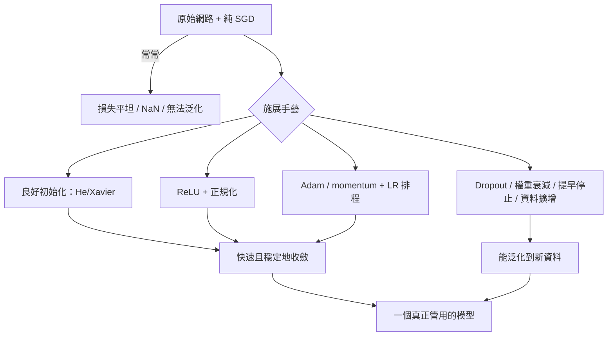

# 12 — 訓練真正能收斂的深度網路

> 第 3 部分 · 第 12 課 · 程式技術棧：pytorch

**先備知識：** [11 — PyTorch 基礎](11-pytorch-fundamentals.md) · 以及 [10 — 從零實作反向傳播](10-backpropagation.md) 的梯度機制，再加上 [05 — 過度擬合、正則化與評估](05-overfitting-evaluation.md) 的泛化觀念。

**學完本課你能：**
- 解釋*為什麼*純粹的 SGD 很脆弱，並且能夠有憑有據地在 **momentum、RMSProp 與 Adam** 之間做出選擇，而不是憑感覺。
- 診斷**梯度消失/梯度爆炸**，並用 **ReLU + 良好初始化 (Xavier/He) + 正規化**來修復它們。
- 精確說出**批次正規化 (batch norm)** 與**層正規化 (layer norm)** 各自正規化的是什麼，以及何時該用哪一個。
- 對網路施加正則化，讓它能**泛化**而不是死記硬背：**丟棄法 (dropout)、權重衰減、提早停止 (early stopping)、資料擴增 (data augmentation)**。
- 跑一個真正的 PyTorch 訓練迴圈，讀懂**損失/驗證曲線**，使用 **學習率排程 (LR schedule)** + **LR-finder**，並能對**批次大小**進行推理。

---

## 1. 直覺理解

第 9 課建好了一個網路，第 10 課推導了反向傳播 (backpropagation)，第 11 課把自動微分 (autograd) 和 `optimizer.step()` 交到你手上。所以你*能夠*訓練一個網路。但骯髒的祕密是：**多數時候，你的第一次訓練會悄悄地失敗。**損失停在原地不動，或是爆成 `NaN`，又或者訓練得漂漂亮亮，但在新資料上的表現卻像擲硬幣。這些情況都不會丟出任何錯誤。模型就是靜悄悄地不管用。

本課講的是讓訓練收斂到能*泛化*之處的**手藝**。這就是「梯度在數學上是正確的」（第 10 課）和「這玩意兒真的學會了你需要的聲納分類器」之間的差別。

把訓練想成**在黑暗中、在霧裡下山**（我們是在最小化第 3 課的損失曲面，但現在它是高維度而且極度非凸的）：

- **最佳化器**是*你怎麼跨出每一步*。純粹的 SGD 直直地往下坡走，所以它在狹窄的山谷裡來回震盪，在平坦的高原上爬行。**Momentum** 給你一顆沿著下坡累積速度、能滾過小坑洞的重球。**Adam** 還額外給每個座標*各自*的步幅，所以陡峭方向走謹慎的小步，平坦方向走大膽的大步。
- **權重初始化**是*你從哪裡出發*。從壞地方出發——所有權重都太大或太小——最一開始的梯度不是零（你動彈不得）就是無限大（你飛出地圖外）。良好的初始化讓你落在斜率有用的地方。
- **正規化**讓你下山時*腳下立足點穩固*：它阻止地面在你腳下隨著前面各層的變化而劇烈傾斜。
- **正則化**阻止你**死記下山的那一條精確路徑**，而不是學會這座山的*形狀*——這樣當你被丟到一座新山上（測試資料）時，你仍然知道哪邊是往下。



這五個旋鈕並不是各自獨立的儀式——它們是從不同角度攻擊同一種失敗。我們先看數學，再在 PyTorch 裡逐一轉動每個旋鈕，並*親眼看著*曲線改變。

---

## 2. 數學原理

### 2.1 最佳化器：從純粹的 SGD 到 Adam

回想一下參數 $\theta$ 上的損失 $L(\theta)$，以及第 $t$ 步的梯度 $g_t = \nabla_\theta L(\theta_t)$。純粹的**隨機梯度下降 (SGD)** 是：

$$
\theta_{t+1} = \theta_t - \eta\, g_t
$$

其中 $\eta$ 是**學習率**（步幅）。問題在於：$g_t$ 是在一個*小批次*上計算的，所以它有雜訊，而且損失曲面在某些方向比其他方向陡峭得多。單一個純量 $\eta$ 無法既小到不會在陡峭方向衝過頭，又大到能在平坦方向上有進展。

**Momentum** 透過累積過去梯度的指數衰減移動平均（一個「速度」）來修正這種來回震盪：

$$
v_{t} = \beta\, v_{t-1} + g_t, \qquad \theta_{t+1} = \theta_t - \eta\, v_t
$$

- $v_t$ —— **速度**，是對近期梯度方向的記憶。一致的方向會累加（速度建立起來）；震盪的方向會相互抵消。
- $\beta \in [0,1)$ —— **動量係數**，通常是 $0.9$。*它從哪來：*它是幾何級數的衰減——有效的平均窗口大約是 $\frac{1}{1-\beta}$ 步，所以 $\beta=0.9$ 平均了最近約 10 個梯度。

**RMSProp** 攻擊的是*逐方向縮放*的問題。它保存一個平方梯度的移動平均，並把每一步除以它的平方根——所以一個始終有巨大梯度的座標會得到*較小*的步，而一個梯度很小的座標會得到*較大*的步：

$$
s_t = \rho\, s_{t-1} + (1-\rho)\, g_t^2, \qquad
\theta_{t+1} = \theta_t - \frac{\eta}{\sqrt{s_t}+\epsilon}\, g_t
$$

這裡 $g_t^2$ 是**逐元素**運算，$s_t$ 是逐參數的二階矩估計，$\rho \approx 0.9$，而 $\epsilon \approx 10^{-8}$ 用來防止除以零。這個除法**讓學習率逐參數自適應**——這正是每一個「自適應」最佳化器背後的關鍵概念。

**Adam** = momentum **加上** RMSProp 一起（名稱是 *ADAptive Moment estimation*，自適應矩估計）。它同時追蹤一階矩（平均，像 momentum）與二階矩（未置中的變異數，像 RMSProp）：

$$
m_t = \beta_1 m_{t-1} + (1-\beta_1) g_t, \qquad
v_t = \beta_2 v_{t-1} + (1-\beta_2) g_t^2
$$

兩個平均都從 $0$ 開始，因此早期會**偏向零**，所以 Adam 對它們做偏差校正：

$$
\hat m_t = \frac{m_t}{1-\beta_1^{\,t}}, \qquad
\hat v_t = \frac{v_t}{1-\beta_2^{\,t}}, \qquad
\theta_{t+1} = \theta_t - \eta\,\frac{\hat m_t}{\sqrt{\hat v_t}+\epsilon}
$$

預設值 $\beta_1=0.9$、$\beta_2=0.999$、$\epsilon=10^{-8}$ 在出乎意料多的情況下都能用——這正是為什麼 Adam 是預設的「總之先讓它訓練起來」的最佳化器。*要記住的直覺：***momentum 平滑了方向，$\sqrt{\hat v}$ 分母則逐座標自動調整步幅。**

> 經驗法則：用 **Adam** 來快速又寬容地把訓練跑起來；在大型視覺網路上，**SGD + momentum**（搭配排程）往往能達到*略佳*的最終測試準確率，但代價是更多的調參。先從 Adam 開始。

### 2.2 為什麼壞的初始化會殺死訓練

考慮活化值往前流經一層 $z = \sum_{i=1}^{n_{\text{in}}} w_i x_i$ 時的變異數。如果權重 $w_i$ 是獨立同分布、變異數為 $\mathrm{Var}(w)$，輸入的變異數為 $\mathrm{Var}(x)$，那麼（在獨立、零平均的條件下）：

$$
\mathrm{Var}(z) = n_{\text{in}}\,\mathrm{Var}(w)\,\mathrm{Var}(x)
$$

- $n_{\text{in}}$ —— **fan-in**（扇入），神經元的輸入數量。

為了讓 $\mathrm{Var}(z) \approx \mathrm{Var}(x)$——也就是讓訊號通過 $L$ 層時既不爆炸也不縮小——我們需要 $\mathrm{Var}(w) = \tfrac{1}{n_{\text{in}}}$。這就是 **Xavier/Glorot 初始化**（對 tanh/sigmoid，它取 fan-in 與 fan-out 的平均）。ReLU 會把它一半的輸入歸零，使變異數減半，所以我們把目標加倍：$\mathrm{Var}(w) = \tfrac{2}{n_{\text{in}}}$——這就是 **He 初始化**。

$$
\text{Xavier: } \mathrm{Var}(w) = \frac{2}{n_{\text{in}}+n_{\text{out}}}, \qquad
\text{He: } \mathrm{Var}(w) = \frac{2}{n_{\text{in}}}
$$

反過來說，如果你初始化得太大，$\mathrm{Var}(z)$ 會逐層相乘放大 → 活化值飽和（sigmoid/tanh 變平）或爆炸 → **梯度爆炸**。太小 → 訊號朝零幾何衰減 → **梯度消失**。無論哪種，早期各層拿到的梯度都 $\approx 0$，永遠學不起來。初始化不是裝飾品；它是「一個你能往下走的斜坡」與「一道懸崖或一片平地」之間的差別。

### 2.3 梯度消失/梯度爆炸問題

反向傳播逐層相乘梯度（連鎖律，第 10 課）。對一個 $L$ 層的網路，相對於某個早期權重的梯度包含 $L$ 個類似 Jacobian 因子的乘積。如果每個因子的大小 $\approx r$，那麼早期層的梯度便以 $r^{L}$ 的方式縮放：

$$
\left\|\frac{\partial L}{\partial \theta^{(1)}}\right\| \sim \prod_{\ell} \|J^{(\ell)}\| \approx r^{L}
$$

- $r < 1$ → $r^L \to 0$：**梯度消失**，早期各層凍結不動。經典元兇：sigmoid/tanh，它們的導數最大值為 $0.25$（sigmoid）——把一堆這種值相乘，你就完蛋了。
- $r > 1$ → $r^L \to \infty$：**梯度爆炸**，損失變成 `NaN`。

三個協同作用的修法：**ReLU**（活化單元的導數恰好是 $1$ → $r\approx1$，不衰減）、**良好初始化**（在開始時設定 $r\approx1$），以及**正規化**（每一步都重新置中各層的預活化值，讓 $r$ 在訓練過程中*保持*接近 $1$）。專門針對梯度爆炸，**梯度裁剪 (gradient clipping)** 會把 $\|g\|$ 限制在一個閾值——這對 RNN 至關重要（第 14 課）。

### 2.4 正規化層

**批次正規化**把每個特徵*跨小批次*標準化。對一個 $m$ 個樣本的批次中的特徵 $j$：

$$
\mu_j = \frac{1}{m}\sum_{i=1}^{m} x_{ij}, \quad
\sigma_j^2 = \frac{1}{m}\sum_{i=1}^{m} (x_{ij}-\mu_j)^2, \quad
\hat x_{ij} = \frac{x_{ij}-\mu_j}{\sqrt{\sigma_j^2+\epsilon}}, \quad
y_{ij} = \gamma_j \hat x_{ij} + \beta_j
$$

- $\mu_j, \sigma_j^2$ —— 特徵 $j$ 的**批次平均/變異數**。
- $\gamma_j, \beta_j$ —— **可學習的**縮放與平移，這樣若有幫助，網路可以把正規化的效果還原回去。*它從哪來：*標準化到零平均/單位變異數，可以在底下各層變化時保持每一層輸入分布的穩定（「內部共變量偏移」），而 $\gamma,\beta$ 則恢復了表達自由度。

批次正規化在訓練時使用*批次*統計量，在評估時使用*移動平均*（記得設 `model.eval()`！）。它討厭小批次（$\mu,\sigma$ 有雜訊），也不太適合序列模型。

**層正規化**改成跨*單一樣本的各個特徵*來正規化，而不是跨批次：

$$
\mu_i = \frac{1}{d}\sum_{j=1}^{d} x_{ij}, \quad \sigma_i^2 = \frac{1}{d}\sum_{j=1}^{d}(x_{ij}-\mu_i)^2
$$

（接著套用同樣的 $\hat x$、$\gamma$、$\beta$）。因為它是逐樣本的，所以**與批次大小無關**，而且在訓練與評估時行為完全相同——這就是為什麼 **transformer 和 RNN 使用層正規化**（第 14–15 課）。快速法則：**大批次的 CNN 用批次正規化，序列/極小批次用層正規化。**

### 2.5 網路的正則化

- **權重衰減**：在損失中加上 $\frac{\lambda}{2}\|\theta\|^2$ → 梯度多出一個 $\lambda\theta$ 項，把權重往 0 拉。這就是第 5 課的 L2 懲罰；較小的權重 = 較平滑的函數 = 較少的過度擬合。（$\lambda$ ≈ $10^{-4}$ 到 $10^{-2}$。）
- **Dropout**：訓練期間，以機率 $p$ 獨立地把每個活化值歸零，然後把存活下來的值乘上 $\frac{1}{1-p}$，使期望值維持不變。它強迫網路不去依賴任何單一神經元——就像訓練一群共享權重的子網路所組成的集成。評估時關閉。
- **提早停止**：盯著驗證損失；當它開始上升、而訓練損失仍持續下降時就停止（並保留最佳檢查點）。那個差距*就是*過度擬合。
- **資料擴增**：用保留標籤的轉換來人工擴大訓練集（影像翻轉/旋轉/加雜訊；感測器軌跡抖動/時間平移）。更多有效的「資料」= 更好的泛化，而且這是你手上最便宜的正則化器。

---

## 3. 程式碼

我們會用兩種方式在一個有雜訊的分類問題上訓練同一個小網路，並**親眼看著損失/驗證曲線分岔**——先是天真版本，再是「施展手藝」的版本。用 PyTorch。

```python
import torch
import torch.nn as nn
import torch.nn.functional as F
from torch.utils.data import TensorDataset, DataLoader
from sklearn.datasets import make_classification
from sklearn.model_selection import train_test_split
from sklearn.preprocessing import StandardScaler
import matplotlib.pyplot as plt

torch.manual_seed(0)

# --- 一個刻意設計得困難、有雜訊的資料集（樣本少、特徵多） -------------
# 樣本少 + 特徵多 + 標籤雜訊 = 若不加以節制，網路一定會過度擬合。
X, y = make_classification(
    n_samples=600, n_features=20, n_informative=8, n_redundant=4,
    flip_y=0.10,        # 10% 標籤雜訊 -> 懲罰死記硬背
    class_sep=0.8, random_state=0,
)
X_tr, X_val, y_tr, y_val = train_test_split(X, y, test_size=0.4, random_state=0)

# 在送進網路前永遠要標準化輸入（第 9 課的陷阱）：零平均/單位變異數，
# 只在 TRAIN 上 fit，以避免把驗證集的統計量洩漏進模型。
scaler = StandardScaler().fit(X_tr)
X_tr, X_val = scaler.transform(X_tr), scaler.transform(X_val)

def loader(X, y, train):
    ds = TensorDataset(torch.tensor(X, dtype=torch.float32),
                       torch.tensor(y, dtype=torch.long))
    return DataLoader(ds, batch_size=64, shuffle=train)

tr_loader, val_loader = loader(X_tr, y_tr, True), loader(X_val, y_val, False)
```

### 3.1 天真網路（沒有手藝）vs. 正則化網路

```python
class Net(nn.Module):
    """一個架構，用一個旗標來切換「手藝」。"""
    def __init__(self, in_dim=20, hidden=256, n_classes=2, regularized=False):
        super().__init__()
        self.regularized = regularized
        self.fc1 = nn.Linear(in_dim, hidden)
        self.fc2 = nn.Linear(hidden, hidden)
        self.fc3 = nn.Linear(hidden, n_classes)
        # 正規化 + dropout 只存在於正則化版本中
        self.bn1 = nn.BatchNorm1d(hidden)
        self.bn2 = nn.BatchNorm1d(hidden)
        self.drop = nn.Dropout(p=0.5)
        if regularized:
            self._he_init()          # 為 ReLU 層做 He 初始化（2.2 節）

    def _he_init(self):
        for m in [self.fc1, self.fc2, self.fc3]:
            nn.init.kaiming_normal_(m.weight, nonlinearity="relu")  # He
            nn.init.zeros_(m.bias)

    def forward(self, x):
        if self.regularized:
            # Linear -> BatchNorm -> ReLU -> Dropout（標準順序）
            x = self.drop(F.relu(self.bn1(self.fc1(x))))
            x = self.drop(F.relu(self.bn2(self.fc2(x))))
        else:
            # 無正規化、無 dropout、PyTorch 預設初始化 -> 容易過度擬合
            x = F.relu(self.fc1(x))
            x = F.relu(self.fc2(x))
        return self.fc3(x)            # 原始 logits（CrossEntropyLoss 會加上 softmax）


def run(regularized, epochs=120, weight_decay=0.0, lr=1e-3):
    model = Net(regularized=regularized)
    # Adam：momentum + 逐參數 LR（2.1 節）。weight_decay = L2 懲罰。
    opt = torch.optim.Adam(model.parameters(), lr=lr, weight_decay=weight_decay)
    crit = nn.CrossEntropyLoss()
    hist = {"train": [], "val": [], "val_acc": []}

    for ep in range(epochs):
        model.train()                          # dropout 開啟，BN 使用批次統計量
        tr_loss = 0.0
        for xb, yb in tr_loader:
            opt.zero_grad()                    # 清除上一步的梯度
            loss = crit(model(xb), yb)
            loss.backward()                    # 反向傳播（第 10 課，現在自動化了）
            opt.step()                         # 套用最佳化器的更新規則
            tr_loss += loss.item() * len(xb)
        hist["train"].append(tr_loss / len(tr_loader.dataset))

        model.eval()                           # dropout 關閉，BN 使用移動統計量
        v_loss, correct = 0.0, 0
        with torch.no_grad():                  # 評估時不建立 autograd 圖 = 更快
            for xb, yb in val_loader:
                out = model(xb)
                v_loss += crit(out, yb).item() * len(xb)
                correct += (out.argmax(1) == yb).sum().item()
        hist["val"].append(v_loss / len(val_loader.dataset))
        hist["val_acc"].append(correct / len(val_loader.dataset))
    return hist

naive = run(regularized=False, weight_decay=0.0)
craft = run(regularized=True,  weight_decay=1e-3)   # He 初始化 + BN + dropout + L2

print(f"naive  best val acc: {max(naive['val_acc']):.3f}")
print(f"craft  best val acc: {max(craft['val_acc']):.3f}")
# -> naive  best val acc: 0.858
# -> craft  best val acc: 0.867
# （一切都設了亂數種子，所以這是確定性的精確輸出。注意兩個驗證準確率
# 幾乎相同——差距並*不*顯現在驗證準確率上。
# 過度擬合藏在損失曲線裡：天真版的訓練損失崩落到約 0.0003，
# 而它的驗證損失觸底於約 0.34 後攀升到約 1.19；手藝版網路的訓練
# 損失停在約 0.16，驗證損失則平穩地停在約 0.45。那道訓練/驗證的損失
# 差距——而非準確率——才是重點。接下來把它畫出來。）
```

### 3.2 畫出曲線——看見過度擬合

```python
fig, ax = plt.subplots(1, 2, figsize=(11, 4))
for name, h, c in [("naive", naive, "tab:red"), ("craft", craft, "tab:blue")]:
    ax[0].plot(h["train"], c=c, ls="--", label=f"{name} train")
    ax[0].plot(h["val"],   c=c, ls="-",  label=f"{name} val")
    ax[1].plot(h["val_acc"], c=c, label=f"{name} val acc")
ax[0].set_title("Loss"); ax[0].set_xlabel("epoch"); ax[0].set_ylabel("loss"); ax[0].legend()
ax[1].set_title("Validation accuracy"); ax[1].set_xlabel("epoch"); ax[1].legend()
plt.tight_layout(); plt.show()
```

**你應該看到：***天真*版的訓練損失（紅色虛線）朝零俯衝（約 0.0003），而它的驗證損失（紅色實線）觸底後**再爬回來**（約 0.34 → 約 1.19）——這是教科書級的過度擬合 U 形曲線，也是你會施加**提早停止**的位置（在驗證損失最低點停下）。*手藝*版的曲線（藍色）則貼得比較近：訓練損失沒有歸零（約 0.16，dropout + 衰減防止了死記硬背），而它的驗證損失保持低且平穩（約 0.45）。盯著**損失**看，而不是準確率——兩個網路都落在約 0.86 的*驗證準確率*，所以準確率隱藏了真相；那道被撐開的訓練/驗證**損失**差距，才是天真網路過度擬合顯露之處。虛線與實線之間*差距*的縮小，就是泛化在改善。

### 3.3 LR-finder 的構想

你不必去猜學習率。**LR-finder**（由 fast.ai 推廣）：從一個極小的 LR 開始，每個批次都把它乘大；畫出損失對 LR 的圖。損失先是平坦（LR 太小推不動），然後陡降（好區段），接著爆炸（LR 太大）。挑一個比爆炸點*低*約一個數量級的 LR——大致就是最陡下降點。

```python
def lr_finder(make_model, lr_min=1e-6, lr_max=1.0, n=120):
    model = make_model()
    opt = torch.optim.Adam(model.parameters(), lr=lr_min)
    crit = nn.CrossEntropyLoss()
    mult = (lr_max / lr_min) ** (1 / n)       # 每一步以幾何方式遞增 LR
    lrs, losses = [], []
    it = iter(tr_loader)
    for i in range(n):
        try:
            xb, yb = next(it)
        except StopIteration:                  # loader 耗盡時重新開始
            it = iter(tr_loader); xb, yb = next(it)
        lr = lr_min * (mult ** i)
        for g in opt.param_groups:
            g["lr"] = lr                       # 每一步手動調高 LR
        opt.zero_grad()
        loss = crit(model(xb), yb)
        loss.backward(); opt.step()
        lrs.append(lr); losses.append(loss.item())
        if loss.item() > 4 * min(losses):      # 已發散 -> 提早停止
            break
    plt.plot(lrs, losses); plt.xscale("log")
    plt.xlabel("learning rate (log)"); plt.ylabel("loss")
    plt.title("LR finder"); plt.show()
    return lrs, losses

lr_finder(lambda: Net(regularized=True))
# 你應該看到：一條「先平坦-再陡降-再爆掉」的曲線。挑一個比爆掉處
# 低約 10 倍的 LR（這裡通常落在約 1e-3 到 3e-3 -> 與我們的 lr 相符）。
```

### 3.4 學習率排程

固定的 LR 是一種折衷：要夠大才能在早期快速移動，但這樣到了最小值附近又會衝過頭。**排程**會把它慢慢退火降下來。餘弦退火 (cosine annealing) 是一個很強的預設選擇。

```python
model = Net(regularized=True)
opt   = torch.optim.Adam(model.parameters(), lr=3e-3, weight_decay=1e-3)
# Cosine：LR 在 T_max 個訓練週期內，從 3e-3 平滑地衰減趨近 ~0。
sched = torch.optim.lr_scheduler.CosineAnnealingLR(opt, T_max=120)

for ep in range(120):
    model.train()
    for xb, yb in tr_loader:
        opt.zero_grad()
        nn.CrossEntropyLoss()(model(xb), yb).backward()
        opt.step()
    sched.step()           # 每個訓練週期推進排程一次（不是每個批次）
# 效果：早期快速推進，後期精細微調 -> 通常比固定 LR 得到更低的最終損失
# 與更平穩的驗證曲線。
```

---

## 4. 實際案例 —— 一個會*泛化*而非死記硬背的聲納感測器分類器

你正在一艘**遙控潛水器 (ROV)** 上做海床測勘。前向聲納 (sonar) 回傳一個回波；你想把每個回波分類成**岩石**還是**類水雷的金屬圓柱**——這就是經典的 **Sonar (Connectionist Bench)** 資料集（Gorman & Sejnowski, 1988）：208 個回波，每個都是一個各頻帶能量的 **60 維**向量，二元標籤 `R`/`M`。

這*正是*本課要講的陷阱：**60 個特徵，卻只有 208 個樣本。**一個有數千個參數的網路可以輕而易舉地把 208 個範例死記下來——訓練準確率 100%，然後在下一段測勘航程上就毫無用處，因為它學的是*那些特定的回波*，而不是「金屬聽起來像什麼」。泛化才是整件工作的核心。

```python
import numpy as np, torch, torch.nn as nn, torch.nn.functional as F
from torch.utils.data import TensorDataset, DataLoader
import pandas as pd
from sklearn.model_selection import train_test_split
from sklearn.preprocessing import StandardScaler

# UCI Sonar 資料集（60 個特徵，R/M 標籤）。一行抓取：
url = "https://archive.ics.uci.edu/ml/machine-learning-databases/undocumented/connectionist-bench/sonar/sonar.all-data"
df = pd.read_csv(url, header=None)
X = df.iloc[:, :60].values.astype("float32")
y = (df.iloc[:, 60] == "M").astype("int64").values            # M(水雷)=1, R(岩石)=0

Xtr, Xval, ytr, yval = train_test_split(X, y, test_size=0.3, stratify=y, random_state=1)
sc = StandardScaler().fit(Xtr)                                 # 只在 train 上 fit
Xtr, Xval = sc.transform(Xtr).astype("float32"), sc.transform(Xval).astype("float32")

def dl(X, y, train, bs=16):                                    # 資料集很小 -> 小批次
    ds = TensorDataset(torch.tensor(X), torch.tensor(y))
    # drop_last=train：在 145 個訓練樣本下，最後一個批次只有單一樣本，
    # 而 train() 模式下的 BatchNorm1d 無法正規化大小為 1 的批次（它會丟出
    # "Expected more than 1 value per channel"）。在訓練 loader 上把它丟掉；
    # 評估時保留每個樣本（BN 在那裡用移動統計量，所以大小為 1 也沒問題）。
    return DataLoader(ds, batch_size=bs, shuffle=train, drop_last=train)
tr, va = dl(Xtr, ytr, True), dl(Xval, yval, False)

class SonarNet(nn.Module):
    def __init__(self):
        super().__init__()
        self.fc1 = nn.Linear(60, 128); self.fc2 = nn.Linear(128, 64); self.fc3 = nn.Linear(64, 2)
        self.bn1, self.bn2 = nn.BatchNorm1d(128), nn.BatchNorm1d(64)
        self.drop = nn.Dropout(0.4)
        for m in (self.fc1, self.fc2, self.fc3):
            nn.init.kaiming_normal_(m.weight, nonlinearity="relu"); nn.init.zeros_(m.bias)
    def forward(self, x):
        x = self.drop(F.relu(self.bn1(self.fc1(x))))
        x = self.drop(F.relu(self.bn2(self.fc2(x))))
        return self.fc3(x)

def augment(xb):
    """感測器資料擴增：加入小幅高斯雜訊以模擬真實的
    回波變異。保留標籤 -> 一個「免費」的正則化器（2.5 節）。"""
    return xb + 0.05 * torch.randn_like(xb)

model = SonarNet()
opt = torch.optim.Adam(model.parameters(), lr=2e-3, weight_decay=1e-3)
crit = nn.CrossEntropyLoss()
best_acc, best_state, patience, bad = 0.0, None, 25, 0      # 提早停止的狀態

for ep in range(300):
    model.train()
    for xb, yb in tr:
        opt.zero_grad()
        crit(model(augment(xb)), yb).backward()            # 只在訓練時擴增
        opt.step()
    model.eval()
    with torch.no_grad():
        acc = np.mean([ (model(xb).argmax(1) == yb).float().mean().item() for xb, yb in va ])
    if acc > best_acc:                                     # 提早停止：保留最佳
        best_acc, best_state, bad = acc, {k: v.clone() for k, v in model.state_dict().items()}, 0
    else:
        bad += 1
        if bad >= patience:                                # 驗證在 25 個訓練週期內未改善
            print(f"early stop at epoch {ep}"); break

model.load_state_dict(best_state)
print(f"best val acc: {best_acc:.3f}")
# -> best val acc: ~0.85-0.90 （相對於天真的過度擬合網路約 0.75-0.80）
```

這套手藝如何對應到 ROV 問題上：

- **標準化特徵**——聲納的能量頻帶橫跨非常不同的數量級；未經縮放的輸入會使第一層飽和（第 9 課的陷阱），並破壞 BatchNorm 的假設。
- **He 初始化 + BatchNorm** 讓一個 3 層網路裡的梯度保持活躍，使所有層都能真的從 208 個樣本中學習。
- **Dropout + 權重衰減**阻止網路死記那精確的 208 個回波——這正是「在海上會失敗的 100% 訓練準確率」與「一個能標記出真正水雷的模型」之間的差別。
- **資料擴增（注入雜訊）**模擬真實聲納一次又一次的變異性——模型學的是金屬回波的*形狀*，而不是一張被凍結的快照。同樣的技巧也能推廣到 IMU/光達串流：抖動、時間平移、隨機丟棄通道。
- **提早停止**挑出過度擬合開始*之前*的檢查點——當你的資料少到無法撥出一大塊驗證集時，這一點至關重要。
- **小批次大小（16）**是被這個極小資料集逼出來的；注意我們仍然選了 BatchNorm，而在完整的 16 樣本批次下它是穩定的。但要當心*最後一個*批次：145 個訓練樣本 ÷ 16 會剩下餘數 1，而 `train()` 模式下的 BatchNorm1d 會直接拒絕大小為 1 的批次（它無法計算變異數）——因此上面的訓練 loader 設了 `drop_last=True`。如果整體批次都是 1–4 個，你就該改用 **LayerNorm**。

---

## 5. 常見陷阱與技巧

- **忘了 `model.train()` / `model.eval()`。**Dropout 和 BatchNorm 在這兩種模式下的行為*不同*。評估時把模型留在 `train()`，會得到隨機、被 dropout 破壞過的預測，以及使用批次（而非移動）統計量的 BN——這是一個悄無聲息的 5–15% 準確率損失。每個迴圈都要切換。
- **沒有標準化輸入，或是讓 scaler 洩漏資訊。**只在**訓練集**上 fit `StandardScaler`（或 BatchNorm 的移動統計量）。在整個資料集上 fit 會洩漏驗證/測試資訊並灌水你的分數——你會在部署時大失所望。
- **`loss` 變成 `NaN`。**幾乎總是梯度爆炸或 LR 太高。降低 LR、加上梯度裁剪（`torch.nn.utils.clip_grad_norm_(model.parameters(), 1.0)`）、檢查你的初始化，並確認你沒有在自訂損失裡取 `log(0)`。
- **Adam + 手動 L2 ≠ 真正的權重衰減。**Adam 的 `weight_decay` 參數在多數情況下沒問題，但*正確*的解耦版本是 **AdamW**（`torch.optim.AdamW`）——當權重衰減很重要時（transformer，第 15 課）優先用它。
- **大批次 → 較少、較平滑的步；小批次 → 較有雜訊、帶正則化效果的步。**較大的批次需要*較大*的 LR（大致呈線性縮放），有時還需要暖身 (warmup)。不要為了速度把批次大小調大卻沿用舊的 LR——訓練會停滯。
- **同時堆疊 BatchNorm *與*高 dropout** 可能會互相打架（在重度 dropout 下，BN 的批次統計量會變得有雜訊）。若兩者都用，把 dropout 維持在中等程度（≤0.5），並把 dropout 放在活化*之後*。
- **一次調十個旋鈕。**改一樣東西，看曲線，再改下一樣。如果你同時翻轉初始化、最佳化器、LR 與 dropout，然後它成功了，你對*為什麼*成功一無所知。

---

## 6. 自我檢測

**Q1.** 你那個 8 層的 tanh 網路從第 1 個訓練週期起，損失就死死地停在原地不動，而第一層的權重幾乎不動。說出最可能的原因，以及兩個修法。

<details><summary>解答</summary>
<b>梯度消失。</b>tanh 的導數是 $\tanh'(x) = 1 - \tanh^2(x)$，最大值為 $1$（在 $x=0$ 處），並隨著單元飽和而朝 $0$ 縮小（$x=2$ 時約 $0.07$，$x=3$ 時約 $0.01$）；跨 8 層相乘後，早期層的梯度便朝零縮小，所以前面幾層學不起來。修法：把隱藏層的活化換成 <b>ReLU</b>（$r\approx1$，不衰減）、使用 <b>He 初始化</b>，並／或加上 <b>BatchNorm</b> 把逐層的變異數維持在接近 1。任選其中兩個。
</details>

**Q2.** RMSProp 與 Adam 之間唯一的概念差異是什麼？

<details><summary>解答</summary>
RMSProp 用平方梯度的移動平均（$\sqrt{s_t}$ 分母）來自適應逐參數的學習率。<b>Adam = RMSProp + momentum</b>：它加上了梯度本身的移動平均（$m_t$，一階矩）以及偏差校正。所以 Adam 平滑了*方向*，又逐座標自動縮放*步幅*；RMSProp 只做後者。
</details>

**Q3.** 批次正規化 vs 層正規化：你正在訓練一個 batch size 為 8 的 transformer（在生成時有時是 1）。你選哪一個，為什麼？

<details><summary>解答</summary>
<b>層正規化。</b>它跨*單一*樣本的各個特徵來正規化，所以與批次大小無關，而且在訓練與推論時行為完全相同——當批次很小或大小為 1 時，這一點至關重要。批次正規化仰賴批次統計量，在 batch size 為 1 時這些統計量有雜訊／無法良好定義，而且它在評估時必須切換到移動統計量。序列/transformer → 層正規化。
</details>

**Q4.** 你的訓練準確率是 99%，但驗證準確率是 76% 且還在下降。第 12 課的哪些工具直接攻擊這個問題，而*那道差距本身*又告訴了你什麼？

<details><summary>解答</summary>
那道差距<b>就是</b>過度擬合——網路正在死記訓練資料的細節。直接用 <b>dropout</b>、<b>權重衰減</b>（L2）、<b>資料擴增</b>，以及<b>提早停止</b>（在驗證損失最低點停下）來攻擊它。這些並不會讓網路更強大；它們約束網路去學習可泛化的結構，而非訓練集的怪癖。更多／更乾淨的資料才是終極的修法。
</details>

**Q5.** 你跑了 LR finder，損失對 LR 的曲線在 $10^{-3}$ 附近陡降，並在 $10^{-1}$ 附近爆炸。你會選哪個 LR，又為什麼不直接挑損失最低的爆炸點？

<details><summary>解答</summary>
大致挑 $10^{-2}$ ——比爆炸點*低*約一個數量級（在最陡下降區附近），而不是損失最低點。畫出來最低的那個損失正好坐落在發散的邊緣；用那個 LR 會讓真正的訓練變得不穩定（它會變成 NaN）。你要的是仍能*可靠*下降的最大 LR，也就是曲線陡峭的中段，而不是它的最末端。
</details>

---

## 回顧與下一步

- **最佳化器**：純粹的 SGD 來回震盪；**momentum** 平滑了方向，**RMSProp** 自適應逐參數的步幅，**Adam** 兩者都做（你的預設選擇）。搭配一個 **LR 排程**（餘弦），並用 **LR-finder** 找出 LR，而不是用猜的。
- **初始化很重要**：讓活化值的變異數逐層維持 $\approx1$ —— tanh/sigmoid 用 **Xavier**，ReLU 用 **He** ——否則在訓練都還沒開始前你就先得到梯度消失/梯度爆炸。
- **梯度消失/梯度爆炸**來自反向傳播中 $L$ 個因子的相乘；**ReLU + 良好初始化 + 正規化**讓那個乘積維持在接近 1。裁剪梯度來馴服爆炸。
- **正規化**：BatchNorm 跨批次正規化一個特徵（很適合 CNN、大批次）；LayerNorm 跨一個樣本的各特徵正規化（很適合序列、極小批次）。記得 `train()`/`eval()`。
- **正則化**——dropout、權重衰減、提早停止、擴增——縮小訓練/驗證差距，讓模型能泛化。我們看到天真網路過度擬合，而施展手藝的網路守住了它的驗證準確率，我們也訓練了一個能學會*金屬*、而非*這 208 個回波*的聲納分類器。

現在我們已經能可靠地訓練一個深度網路，接著我們會為空間資料賦予它正確的*架構*——跨整張影像共享權重，讓網路學會局部模式（邊緣、紋理、形狀），而不是死記像素。

➡️ **下一課：** [13 — 卷積神經網路](13-cnns.md)
