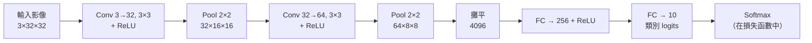
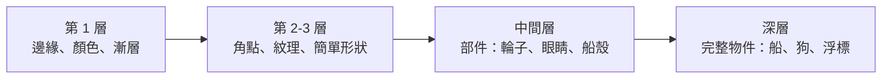

# 13 — 卷積神經網路

> 第 4 部分 · 第 13 課 · 程式技術棧：pytorch

**先備知識：** [12 — 訓練真正能收斂的深度網路](12-training-deep-nets.md) · 而且你應該已經熟練掌握先前建立的 [09 — 神經網路與前向傳播](09-neural-networks-mlp.md) 和 [11 — PyTorch 基礎](11-pytorch-fundamentals.md)。

**學完本課你能：**
- 解釋*為什麼*全連接網路是處理影像的錯誤工具——參數量暴增以及完全沒有平移不變性。
- 定義**卷積 (convolution)** 運算、**特徵圖 (feature map)**、**步幅 (stride)**、**填補 (padding)** 與**池化 (pooling)**，並手動計算輸出形狀。
- 追蹤一個 `conv → relu → pool` 堆疊中（通道、高度、寬度）的**形狀運算**，一路到最後的分類器。
- 在 PyTorch 中於 **CIFAR-10** 上建立、訓練並評估一個小型卷積神經網路 (convolutional neural network)，並回報測試準確率。
- 視覺化**第一層學到的濾波器 (filter)** 與特徵圖，並解釋邊緣 → 紋理 → 物件的層級結構。

---

## 1. 直覺理解

影像不是一串扁平的數字。它是一個帶有結構的**網格**：一個像素單獨來看幾乎沒有意義，但一個像素和它的*鄰居*放在一起就形成了邊緣、角點、斑塊。關於視覺，有兩個事實主宰了一切：

1. **局部性 (Locality)** — 重要的是局部鄰域（一個 3×3 的像素區塊），而不是任意的遠距離配對。
2. **平移不變性 (Translation invariance)** — 左上角的一個浮標和右下角同樣的浮標是*同一個東西*。偵測它的特徵偵測器不應該在意它*在哪裡*。

第 09 課的全連接（稠密）網路同時違反了這兩點。要把一張小小的 32×32 RGB 影像餵進稠密層，你得先把它**攤平 (flatten)** 成一個 $32 \times 32 \times 3 = 3072$ 個數字的向量。一個有 1000 個單元的隱藏層接著就需要 $3072 \times 1000 \approx 3.1$ 百萬個權重——而這只是一層，處理的還是郵票大小的影像。換成真實的 1080p 攝影機畫格，權重數量會爆炸到任何可訓練範圍之外。更糟的是：攤平**丟掉了網格結構**。網路完全不知道像素 31 正好位於像素 63 的上方；它必須針對每個位置分別*重新學習*「這個浮標往右移 5 個像素看起來還是一樣」。這荒謬地浪費。

**卷積**一次解決了這兩個問題。我們不再為每一對（輸入像素、輸出單元）學一個巨大的權重，而是學一個小型的**卷積核 (kernel)**（也稱為**濾波器 (filter)**）——比方說 3×3——然後*把它滑過整張影像*，在每個位置計算內積。同樣的 9 個權重在各處重複使用。這帶來了：

- **參數共享 (Parameter sharing)** → 一個 3×3×3 的卷積核是 27 個權重，而不是數百萬個，而且它在每個位置都管用。
- **平移不變性** → 因為*同一個*卷積核掃描各處，在角落偵測到的特徵在中央也會被一模一樣地偵測到。
- **局部性** → 每個輸出只看一個小區塊，符合視覺結構實際運作的方式。

**類比——手電筒掃描。** 想像一張黑暗的地圖和一個小型、有特定鏤空形狀的手電筒。你以光柵掃描的方式把手電筒拖過整張地圖。凡是光線下的地形符合鏤空形狀的地方，就會亮起來；其他地方則維持昏暗。你描繪出的這個亮起的圖案就是一張**特徵圖**：一張新影像，顯示那個特定特徵*出現在哪裡*。卷積神經網路學的是一疊鏤空模板（卷積核），每一個都針對不同的特徵調校，並且把每一個都在各處重新套用。



典型的卷積神經網路正是這樣：幾個 **conv → relu → pool** 區塊，逐步縮小空間網格、同時增長通道數（更多特徵偵測器），接著一個小型的全連接頭部，把最終的特徵向量映射到類別分數。

---

## 2. 數學原理

### 卷積（互相關）運算

取一張大小為 $H \times W$ 的單通道輸入 $X$，以及一個大小為 $k \times k$ 的卷積核 $K$。輸出特徵圖 $S$ 為

$$
S[i,j] = \sum_{m=0}^{k-1} \sum_{n=0}^{k-1} X[i+m,\; j+n] \; K[m,n] \; + \; b
$$

其中 $S[i,j]$ 是第 $i$ 列、第 $j$ 行的輸出；$X[i+m,j+n]$ 是當卷積核左上角位於 $(i,j)$ 時、落在卷積核之下的輸入像素；$K[m,n]$ 是可學習的卷積核權重；$b$ 則是這個濾波器的單一純量偏值。**它從何而來：** 它字面上就是第 09 課的稠密層內積 $\mathbf{w}^\top\mathbf{x}+b$，只是限制在一個局部區塊上，而且 $\mathbf{w}=K$ 在每個 $(i,j)$ 都**重複使用**。（給數學純粹主義者：這其實是*互相關 (cross-correlation)*；真正的卷積會翻轉卷積核。深度學習函式庫不做翻轉，而既然 $K$ 是學出來的，這個區別只是形式上的。我們還是稱它為卷積。）

### 通道：第三個維度

真實影像有**通道 (channel)**——RGB 有 3 個。一個卷積核必須橫跨*所有*輸入通道。若有 $C_\text{in}$ 個輸入通道，單一濾波器就是一個 $C_\text{in} \times k \times k$ 的方塊，而且它也會跨通道加總：

$$
S[i,j] = \sum_{c=0}^{C_\text{in}-1}\sum_{m=0}^{k-1}\sum_{n=0}^{k-1} X[c,\,i+m,\,j+n]\;K[c,m,n] \;+\; b
$$

一個卷積**層**堆疊了 $C_\text{out}$ 個這樣的濾波器，每一個產生一張輸出特徵圖。所以該層的權重張量形狀為 $C_\text{out} \times C_\text{in} \times k \times k$，再加上 $C_\text{out}$ 個偏值。輸出通道數 = 濾波器數量 = 這一層所尋找的相異特徵數量。

**參數量：** $C_\text{out}\,(C_\text{in}\,k^2 + 1)$。以我們的第一層為例（$C_\text{in}=3$、$C_\text{out}=32$、$k=3$）：$32(3\cdot 9 + 1) = 896$ 個權重——而且與影像大小無關。相較之下，稠密層卻要數百萬個。

### 步幅與填補 → 輸出尺寸

有兩個旋鈕控制著輸出網格：

- **步幅 (Stride)** $s$ — 卷積核每一步跳幾個像素。$s=1$ 掃描每個位置；$s=2$ 每隔一個跳過，把輸出減半並做降採樣。
- **填補 (Padding)** $p$ — 我們在邊界周圍加上幾圈零像素。$p=0$（「valid」）每經過一次就把輸出縮小 $k-1$；選擇 $p=\lfloor k/2 \rfloor$（「same」填補，對 $k=3$ 來說 $=1$）則在 $s=1$ 時保持高/寬不變。

沿著某一軸的輸出空間尺寸為

$$
H_\text{out} = \left\lfloor \frac{H_\text{in} + 2p - k}{s} \right\rfloor + 1
$$

**它從何而來：** $H_\text{in}+2p$ 是填補後的長度；卷積核最後一個合法的左上角位置距離末端 $k$ 個像素；把這段跨度除以步幅 $s$，再加 1（為了起始位置），就數出了卷積核能落腳的位置數。把這個式子背起來——你會不斷地用到它。快速驗算：$H_\text{in}=32, k=3, p=1, s=1 \Rightarrow \lfloor(32+2-3)/1\rfloor+1 = 32$。same 填補保住了尺寸。

### 池化：刻意的降採樣

在 conv+ReLU 之後我們做**池化**：滑動一個小視窗（通常是 2×2、步幅 2），把它塌縮成一個數字。

$$
\text{maxpool}(i,j) = \max_{0\le m,n < 2} A[\,2i+m,\; 2j+n\,] \qquad
\text{avgpool}(i,j) = \frac{1}{4}\sum_{0\le m,n<2} A[\,2i+m,\; 2j+n\,]
$$

**最大池化 (Max pooling)** 保留每個視窗中最強的啟動值——「這個特徵*在附近任何地方*有沒有觸發？」——帶來小幅平移的穩健性，並把網格縮小 4 倍。它**沒有可學習的參數**。平均池化則是做平滑。隱藏層的預設是最大池化；**全域平均池化 (global average pooling)**（把每整張特徵圖平均成單一數字）則是用來取代「攤平 + 全連接」頭部的常見現代做法。池化正是為什麼深層看到的是由*豐富*通道所構成的*粗糙*網格。

### 完整堆疊與其形狀預算

每個區塊都在**用空間換取語意**：池化把 $H,W$ 減半，而下一個卷積層提高 $C$。空間細節（在哪裡）逐步換成特徵豐富度（是什麼），直到一個由眾多通道構成的微小網格被攤平、交給分類器。最後一層輸出 $C_\text{out}=$（類別數量）個 logits，餵給 `CrossEntropyLoss`，與第 12 課完全一樣。

---

## 3. 程式碼

我們將在 **CIFAR-10** 上訓練一個小型卷積神經網路（6 萬張 32×32 的 RGB 影像，10 個類別：plane、car、bird、cat、deer、dog、frog、horse、ship、truck）。所有東西都使用第 11–12 課的 PyTorch 慣用寫法。

```python
import torch
import torch.nn as nn
import torch.nn.functional as F
from torch.utils.data import DataLoader
import torchvision
import torchvision.transforms as T

# --- 裝置：使用可用的最佳硬體（第 11 課）---
device = (
    "cuda" if torch.cuda.is_available()
    else "mps" if torch.backends.mps.is_available()  # Apple Silicon
    else "cpu"
)
print("device:", device)  # -> device: cuda  （或 mps / cpu）

# --- 資料 ---
# 把每個 RGB 通道正規化到接近零均值/單位標準差（常用的 CIFAR-10 統計值）。
# 訓練集做輕度增強；測試集絕對不能做增強。
MEAN, STD = (0.4914, 0.4822, 0.4465), (0.2470, 0.2435, 0.2616)
train_tf = T.Compose([
    T.RandomCrop(32, padding=4),     # 平移增強：教會平移穩健性
    T.RandomHorizontalFlip(),        # 翻轉後的船還是船
    T.ToTensor(),                    # HWC uint8 [0,255] -> CHW float [0,1]
    T.Normalize(MEAN, STD),
])
test_tf = T.Compose([T.ToTensor(), T.Normalize(MEAN, STD)])

train_ds = torchvision.datasets.CIFAR10("./data", train=True,  download=True, transform=train_tf)
test_ds  = torchvision.datasets.CIFAR10("./data", train=False, download=True, transform=test_tf)
train_dl = DataLoader(train_ds, batch_size=128, shuffle=True,  num_workers=2)
test_dl  = DataLoader(test_ds,  batch_size=256, shuffle=False, num_workers=2)
```

現在來看網路。讀懂這些形狀註解——它們*就是*本課的重點：

```python
class SmallCNN(nn.Module):
    def __init__(self, num_classes=10):
        super().__init__()
        # conv(in_channels, out_channels, kernel_size, padding)
        # k=3 時 padding=1 是「same」填補：卷積本身不改變 H、W。
        self.conv1 = nn.Conv2d(3,  32, kernel_size=3, padding=1)   # 3 ->32 張特徵圖
        self.bn1   = nn.BatchNorm2d(32)                            # 穩定訓練（第 12 課）
        self.conv2 = nn.Conv2d(32, 64, kernel_size=3, padding=1)   # 32->64
        self.bn2   = nn.BatchNorm2d(64)
        self.pool  = nn.MaxPool2d(2, 2)                            # 把 H 與 W 減半

        # 經過兩次池化後，32x32 -> 16x16 -> 8x8，搭配 64 個通道：64*8*8 = 4096 個特徵。
        self.fc1   = nn.Linear(64 * 8 * 8, 256)
        self.drop  = nn.Dropout(0.5)                               # 正則化（第 05/12 課）
        self.fc2   = nn.Linear(256, num_classes)

    def forward(self, x):
        # x:                                          (B, 3, 32, 32)
        x = self.pool(F.relu(self.bn1(self.conv1(x))))  # conv->relu->pool -> (B, 32, 16, 16)
        x = self.pool(F.relu(self.bn2(self.conv2(x))))  # conv->relu->pool -> (B, 64,  8,  8)
        x = torch.flatten(x, start_dim=1)               # 保留批次維度    -> (B, 4096)
        x = self.drop(F.relu(self.fc1(x)))              #                  -> (B, 256)
        return self.fc2(x)                              # 原始 logits      -> (B, 10)

model = SmallCNN().to(device)
n_params = sum(p.numel() for p in model.parameters())
print(f"trainable parameters: {n_params:,}")
# -> trainable parameters: 1,070,986
# 注意：全連接頭部（4096*256 ~ 1.05M）佔了大宗；兩個卷積層合計才約 19k。
```

訓練與評估迴圈——與第 12 課完全相同的模式：

```python
loss_fn = nn.CrossEntropyLoss()                 # softmax + NLL 融合；吃原始 logits
opt = torch.optim.Adam(model.parameters(), lr=1e-3, weight_decay=1e-4)

def run_epoch(dl, train: bool):
    model.train() if train else model.eval()
    total_loss, correct, n = 0.0, 0, 0
    with torch.set_grad_enabled(train):         # 評估時不建計算圖 -> 更快、更省記憶體
        for xb, yb in dl:
            xb, yb = xb.to(device), yb.to(device)
            logits = model(xb)
            loss = loss_fn(logits, yb)
            if train:
                opt.zero_grad()
                loss.backward()                 # 自動微分為每個權重填入 .grad
                opt.step()
            total_loss += loss.item() * xb.size(0)
            correct += (logits.argmax(1) == yb).sum().item()
            n += xb.size(0)
    return total_loss / n, correct / n

EPOCHS = 12
for epoch in range(1, EPOCHS + 1):
    tr_loss, tr_acc = run_epoch(train_dl, train=True)
    te_loss, te_acc = run_epoch(test_dl,  train=False)
    print(f"epoch {epoch:2d} | train loss {tr_loss:.3f} acc {tr_acc:.3f} "
          f"| test loss {te_loss:.3f} acc {te_acc:.3f}")

# 典型的訓練軌跡（數字每次執行會略有不同）：
# epoch  1 | train loss 1.452 acc 0.475 | test loss 1.180 acc 0.580
# epoch  6 | train loss 0.742 acc 0.740 | test loss 0.720 acc 0.752
# epoch 12 | train loss 0.520 acc 0.818 | test loss 0.640 acc 0.785
# -> 最終測試準確率約 0.78-0.80
```

在十多個訓練週期內、用約 1M 參數就能在 CIFAR-10 上達到約 79%——相近規模的稠密網路想突破 50% 都很吃力。**卷積這個先驗 (prior) 才是真正在挑大樑。**

### 視覺化第一層學到的濾波器

`conv1` 的 32 個濾波器每一個都是 3×3×3——小小的 RGB 方塊。把它們畫出來，*親眼看看*網路學會偵測什麼：

```python
import matplotlib.pyplot as plt

# 權重張量：(out_channels=32, in_channels=3, 3, 3)
w = model.conv1.weight.detach().cpu()
# 對每個濾波器做 min-max 正規化到 [0,1]，這樣才能顯示成 RGB 影像。
w_min = w.amin(dim=(1, 2, 3), keepdim=True)
w_max = w.amax(dim=(1, 2, 3), keepdim=True)
w_img = (w - w_min) / (w_max - w_min + 1e-8)

fig, axes = plt.subplots(4, 8, figsize=(8, 4))
for i, ax in enumerate(axes.flat):
    ax.imshow(w_img[i].permute(1, 2, 0))   # CHW -> HWC 以便 imshow
    ax.axis("off")
fig.suptitle("Learned conv1 filters (3×3 RGB)")
plt.tight_layout(); plt.show()
```

**你應該看到：** 小小的「顏色與邊緣」樣板——帶方向的明暗漸層（各種角度的邊緣偵測器），以及少數幾個顏色對立的斑塊（例如藍對橘）。這些*純粹從 CIFAR 標籤中*湧現出來；沒人告訴網路要去找邊緣。這就是第一層放諸四海皆準的特徵：**早期層學到的是邊緣與顏色**。

### 視覺化一張特徵圖

要看出一個濾波器*在哪裡*觸發，把一張影像推過 `conv1`，再把啟動值畫出來：

```python
img, label = test_ds[0]                       # 一個已正規化的 (3,32,32) 張量
with torch.no_grad():
    fmap = F.relu(model.conv1(img.unsqueeze(0).to(device)))  # (1, 32, 32, 32)
fmap = fmap.squeeze(0).cpu()

fig, axes = plt.subplots(2, 4, figsize=(8, 4))
for i, ax in enumerate(axes.flat):            # 32 張特徵圖中的前 8 張
    ax.imshow(fmap[i], cmap="viridis")
    ax.set_title(f"filter {i}", fontsize=8); ax.axis("off")
plt.tight_layout(); plt.show()
```

**你應該看到：** 輸入影像的幽靈般版本，每張圖突顯了不同的結構——一張在水平邊緣上亮起，另一張在某個顏色區域上亮起，又一張在物件的輪廓上亮起。亮 = 「我的特徵在這裡」。這就是把**特徵圖**具體呈現出來。

### 特徵層級結構

你只能直接*看見*第一層的濾波器並把它當成 RGB 方塊；更深的卷積核操作的是抽象通道，而非像素。但探測研究（例如視覺化什麼最能激發每個單元）一致地揭示：



每一層都把它下方的特徵組合成更抽象的東西。正是這種**組合式層級結構**——而非單純的層數——才是深度在視覺任務中真正有幫助的原因。

---

## 4. 實際案例

**USV / UAV 攝影機障礙物分類。** 你的無人水面載具 (USV) 有一台朝前的攝影機。在任何路徑規劃器能避開危險之前，感知系統得先回答：*這個影像區塊裡是什麼？* — 開闊水面、浮標、另一艘船、漂浮物、岸線，或落水的人。這是個影像分類問題，而像上面那樣的小型卷積神經網路正是自然的第一個模型。

**具體實作範例。** 假設你的偵測前端已經提出了候選區域（來自運動、顯著性圖，或滑動視窗），並把每個都裁切成固定的 64×64 RGB 區塊。你為 **6 個類別**重新訓練我們卷積神經網路的頭部 {water、buoy、vessel、debris、shore、person}。網路唯一的更動就是輸入/輸出的形狀帳目：

```python
# 64x64 輸入 -> 經過兩次 2x2 池化 -> 空間 16x16，64 個通道。
# 重用 SmallCNN，但固定全連接層的輸入尺寸與類別數量：
class HazardCNN(SmallCNN):
    def __init__(self):
        super().__init__(num_classes=6)
        self.fc1 = nn.Linear(64 * 16 * 16, 256)   # 64x64 經過兩次池化後 -> 16x16
```

對應到我們的各個概念：

- **平移不變性正是你想要的性質。** 畫格左邊緣的一個浮標和正中央同樣的浮標必須被分類成同一類——卷積免費給你這個能力，而稠密網路得針對每個位置重新學習。
- **通道 = 感測器融合的接口。** 我們的 CIFAR 模型用了 3 個輸入通道（RGB）。在真實的 USV 上，你可能會把 RGB + 立體相機組所得的深度/視差通道疊在一起，或在夜間用熱影像 → 設定 `Conv2d(in_channels=4, ...)`。卷積核會學會聯合地權衡各個模態。（UAV 用多光譜做同樣的事；遙控潛水器 (ROV) 則把攝影機換成**前視聲納 (forward-looking sonar)**，其回波是 2D 影像，卷積神經網路吃得很開心——見第 09 課的聲納範例。）
- **類別不平衡是運作現場的現實。** 95% 的區塊都是「water」。使用加權的 `CrossEntropyLoss(weight=...)`，讓罕見的「person」類別不會被淹沒——在那裡出現一次偽陰性是可能代價最高的錯誤。
- **延遲在嵌入式運算盒上很重要。** 約 1M 參數能在 Jetson 上即時執行；這*正是*為什麼我們把網路保持得小，而不去搬出一個 2500 萬參數的 ResNet。

**延伸（後續步驟，非本課內容）：** 分類回答*是什麼*；部署的感知堆疊還需要*在哪裡*。**物件偵測 (object detection)**（YOLO、Faster R-CNN、SSD）輸出邊界框 (bounding box) + 類別，而**語意分割 (semantic segmentation)**（U-Net、DeepLab）為每個像素標記類別——對 USV 來說，能描繪出它絕不可越過的精確水/岸邊界極為珍貴。這三者都是建構在你剛訓練的那個 conv → relu → pool 骨幹之上；偵測與分割只是把不同的*頭部*裝上去而已。你現在已經擁有這個基礎了。

---

## 5. 常見陷阱與技巧

- **錯誤的張量排列。** PyTorch 的卷積預期 `(N, C, H, W)`——批次、通道、高度、寬度。OpenCV/PIL 給你的是 `(H, W, C)`。`T.ToTensor()` 會做這個交換*並且*把值縮放到 `[0,1]`；如果你手動建立張量，要用 `permute(2, 0, 1)`，而且別忘了用 `unsqueeze(0)` 補上批次維度。
- **差一 (off-by-one) 的形狀錯誤會讓第一個全連接層崩潰。** 如果你改了影像大小、填補或池化次數，攤平後的長度就會改變，`nn.Linear` 會丟出形狀不符的錯誤。每層都重新計算 $H_\text{out}=\lfloor(H_\text{in}+2p-k)/s\rfloor+1$——或乾脆用 `nn.AdaptiveAvgPool2d(1)`（全域平均池化）整個繞過它，它能不論輸入為何都強制產生固定大小的輸出。
- **要正規化，而且只用*訓練集*的統計值。** 餵入原始 `[0,255]` 像素，或用測試集統計值來正規化測試集，兩者都會造成傷害。在訓練集上計算均值/標準差，並到處都重複使用它們。
- **增強訓練集，絕不增強測試集。** 隨機裁切/翻轉是一種正則化（第 05 課），它假造出更多資料並教會不變性。在測試時套用它們只會替你的評估添加雜訊。
- **`model.eval()` 對 `model.train()` 不是可有可無。** 批次正規化 (BatchNorm) 與丟棄法 (Dropout) 在這兩種模式下的行為不同。推論時忘了呼叫 `eval()`，會使用批次統計值並讓 dropout 仍在作用，悄悄地把準確率拖垮——這是經典的「訓練時沒事、部署就壞掉」臭蟲。
- **別一開始就去搬一個巨大的預訓練網路。** 一個從零開始的小型卷積神經網路才是用來*理解*問題與你的資料的正確基線。遷移學習（第 17 課）是等你真正需要時才該升級的選項。

---

## 6. 自我檢測

**Q1.** 一張 200×200 的 RGB 影像進入一個 500 單元的稠密層需要多少權重？我們網路的第一個卷積層（3→32、3×3）需要多少？這個差距告訴你什麼？

<details><summary>解答</summary>
稠密層：$200\cdot 200\cdot 3 \cdot 500 = 60{,}000{,}000$ 個權重（外加 500 個偏值）。卷積：$32\,(3\cdot 3\cdot 3 + 1) = 896$ 個權重——而且關鍵在於它**與影像大小無關**。這個差距（6000 萬對約 900）就是讓稠密網路對影像而言不可行的參數量暴增，而參數*共享*正是消滅它的關鍵。
</details>

**Q2.** 輸入是 28×28、卷積核 5×5、步幅 1、填補 0。輸出空間尺寸是多少？現在把填補設為 2——什麼改變了，為什麼？

<details><summary>解答</summary>
$p=0$：$\lfloor(28+0-5)/1\rfloor+1 = 24$，所以是 24×24——valid 卷積讓每一邊縮小 $k-1=4$。$p=2$：$\lfloor(28+4-5)/1\rfloor+1 = 28$，回到 28×28。填補 $p=\lfloor k/2\rfloor = 2$ 就是「same」填補：它保留空間尺寸，讓你可以堆疊許多卷積層而不會讓網格消失。
</details>

**Q3.** 為什麼最大池化沒有任何可學習的參數，卻仍然能幫助網路？

<details><summary>解答</summary>
它是一種固定的縮減（取每個視窗的最大值）——沒有權重要學。它在三方面有幫助：(1) 對網格降採樣，削減後續各層的運算與記憶體；(2) 帶來**局部平移不變性**——一個特徵在池化視窗內移動仍會產生相同的輸出；(3) 擴大**感受野 (receptive field)**，讓更深的神經元「看見」原始影像中更大的一塊。
</details>

**Q4.** 經過我們的兩個池化層後，一個 32×32 的輸入在空間上變成 8×8，但深度為 64 個通道。請陳述這個原則，以及為什麼這種交換是值得的。

<details><summary>解答</summary>
這個原則就是**用空間換取語意**：每個區塊縮小 $H,W$（池化），同時增長 $C$（更多濾波器）。早期層需要高空間解析度來定位邊緣；深層需要許多通道來表示抽象概念（物件部件），而那些概念並不需要精細的網格。所以「網格粗糙但特徵豐富」正好適合餵給分類器。
</details>

**Q5.** 一位隊友訓練了一個浮標分類器，在訓練時得到 92%，但對於出現在測試畫格頂角的浮標卻分類錯誤，而訓練時的浮標總是置中的。是什麼壞了，帶有卷積風味的修法是什麼？

<details><summary>解答</summary>
平移不變性是被資料而非架構破壞的。卷積讓*特徵*與位置無關，但如果每個訓練浮標都置中，全連接頭部仍可能學到一個置中的偏好。用**隨機裁切 / 平移增強**來修（就像我們的 `RandomCrop(padding=4)`），讓浮標在訓練時出現在各處。在架構上，把「攤平 + 全連接」換成**全域平均池化**能進一步降低頭部的位置依賴性。
</details>

---

## 回顧與下一步

- 稠密網路對影像而言是錯的：**參數量暴增**（數百萬個權重、且與大小相關）以及**沒有平移不變性**（攤平摧毀了網格）。
- **卷積**把一個小型、學出來的**卷積核**滑過輸入，在各處重複使用*同樣的*權重——一次買到參數共享、局部性與平移不變性。每個濾波器產生一張**特徵圖**。
- 把形狀運算背得滾瓜爛熟：$H_\text{out}=\lfloor(H_\text{in}+2p-k)/s\rfloor+1$，一個卷積層的權重是 $C_\text{out}\times C_\text{in}\times k\times k$，而**池化**用零參數把網格減半。
- 典型的卷積神經網路把 **conv → relu → pool** 區塊（空間縮小、通道增長）堆疊成一個全連接頭部；我們訓練了一個，在 CIFAR-10 上達到約 79%，並看到第一層自己學會了邊緣與顏色斑塊——也就是邊緣 → 紋理 → 部件 → 物件的層級結構。
- 對 USV/UAV 攝影機來說，這*就是*障礙物分類；通道是你的感測器融合接口，而偵測/分割則是同一個骨幹搭配不同的頭部。

卷積神經網路假設影像具有**網格**結構。但隨時間變化的聲納回波、慣性測量單元 (IMU) 串流、GPS 軌跡，以及語言都是**序列 (sequence)**——順序很重要，而且長度會變動。接下來我們要建立能讓狀態貫穿時間的模型。

➡️ **下一課：** [14 — 序列模型：RNN 與 LSTM](14-rnns-lstms.md)
