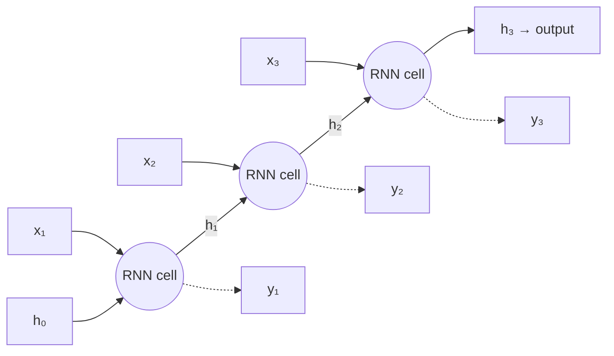
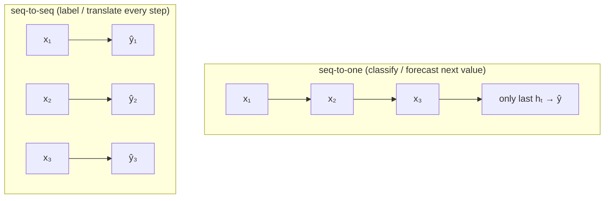

# 14 — 序列模型：RNN 與 LSTM

> 第 4 部分 · 第 14 課 · 程式技術棧：pytorch

**先備知識：** [13 — 卷積神經網路](13-cnns.md) · 你也會用到 [11 — PyTorch 基礎](11-pytorch-fundamentals.md)、[10 — 從零實作反向傳播](10-backpropagation.md)，以及 [09 — 神經網路與前向傳播](09-neural-networks-mlp.md) 裡的前向傳播機制。

**學完本課你能：**
- 解釋**循環的核心想法 (recurrent idea)**——同一組權重在每一個時間步上反覆套用，並攜帶一個**隱藏狀態 (hidden state)** 作為記憶。
- 將 RNN 沿時間**展開 (unroll)**，並說明為何**時間反向傳播 (backprop-through-time, BPTT)** 會讓長序列產生**梯度消失/爆炸 (vanishing/exploding gradient)** 的問題。
- 讀懂 **LSTM** 與 **GRU** 的閘門方程式，並用文字說出每個閘門在決定什麼。
- 區分**序列對單一 (sequence-to-one)**（分類/預測）與**序列對序列 (sequence-to-sequence)** 的問題框架。
- 在 PyTorch 中對一個帶雜訊的感測器訊號，建立並訓練一個小型 **LSTM 預測器 (forecaster)**，並繪製預測值與真實值的對照圖。

---

## 1. 直覺理解

CNN（第 13 課）在影像上滑動一個濾波器，對每個位置一視同仁。這之所以可行，是因為空間結構是固定的。但你的機器人產生的是**序列 (sequence)**：IMU 以 200 Hz 串流 `(ax, ay, az, gx, gy, gz)`、GPS 軌跡是隨時間排列的一連串位置、一次聲納回波是時間上的一維訊號。序列的決定性特徵在於**順序很重要，而且過去會影響現在**。一個速度讀數只有相對於它前面的讀數才有意義。

單純的 MLP 沒有「之前」的概念。如果你把一個 1000 步的視窗攤平成一個巨大的輸入向量，你會（a）把長度永遠固定死，而且（b）逼迫網路在每一個位移處重新學習同一個模式。我們想要一個能一次處理一步、並且能**記住**它看過什麼的模型。

那個記憶就是**隱藏狀態** $h_t$——一個由網路向前攜帶、並在每一步更新的向量。一個**循環神經網路 (recurrent neural network, RNN)** 其實就是一個小網路*一遍又一遍*地套用，把自己的輸出回饋給自己：

> 「看一眼當前的輸入，把它和你記得的東西結合起來，產生一份新的記憶，然後重複。」

**類比——讀一個句子。** 你不會靠一次記住所有字來讀一個句子。你由左讀到右，腦中持有一份不斷更新的理解（隱藏狀態），並隨著每個字更新它。讀到結尾時，那份不斷更新的狀態就總結了整個句子。RNN 讀一段時間序列也是同樣的方式：一次一個樣本，更新一個記憶向量。

同一組權重在每一步都被重複使用——這就是**跨時間的權重共享 (weight sharing across time)**，恰好類比於 CNN 在空間上共享同一個濾波器。正是這一點讓 RNN 能用*固定*數量的參數處理*任意*長度的序列。



那條把 $h$ 向右傳遞的水平箭頭*就是*記憶。圖中顯示的是網路被**展開**後的樣子：它看起來像一個深層網路，但每個單元都是*同一個*單元、用著*同一組*權重。

---

## 2. 數學原理

### 標準版 RNN 單元

在每一個時間步 $t$，單元接收當前輸入 $\mathbf{x}_t \in \mathbb{R}^{d}$ 與前一個隱藏狀態 $\mathbf{h}_{t-1} \in \mathbb{R}^{H}$，並產生一個新的隱藏狀態：

$$
\mathbf{h}_t = \tanh\!\big(W_{xh}\,\mathbf{x}_t + W_{hh}\,\mathbf{h}_{t-1} + \mathbf{b}_h\big)
$$

- $\mathbf{x}_t$ —— 第 $t$ 步的輸入（例如一個 IMU 樣本），維度為 $d$。
- $\mathbf{h}_t$ —— 第 $t$ 步的隱藏狀態/記憶，維度為 $H$（$H$ 由你決定）。
- $W_{xh} \in \mathbb{R}^{H\times d}$ —— 把輸入映射到隱藏空間的權重。
- $W_{hh} \in \mathbb{R}^{H\times H}$ —— **循環 (recurrent)** 權重，把舊記憶映射成新記憶。
- $\mathbf{b}_h \in \mathbb{R}^{H}$ —— 偏值。$\tanh$ 把值壓縮到 $(-1,1)$，所以狀態不會在一步之內爆掉。

**它從何而來：** 它其實就是一個單一的密集層（第 09 課），只是它的輸入是*串接* $[\mathbf{x}_t;\,\mathbf{h}_{t-1}]$。沒有什麼新東西——只差在我們把輸出回饋了進來。輸出的預測是作用在隱藏狀態上的第二個線性頭：

$$
\hat{\mathbf{y}}_t = W_{hy}\,\mathbf{h}_t + \mathbf{b}_y
$$

關鍵重點：$W_{xh}, W_{hh}, W_{hy}$ **在每一個 $t$ 都相同**。訓練學的是一個適用於所有位置的單元。

### 時間反向傳播 (BPTT)

要訓練，我們把這個迴圈展開到長度 $T$，得到一個 $T$ 層深的前饋圖，然後在它上面跑普通的反向傳播（第 10 課）。因為 $W_{hh}$ 被重複使用，它的梯度是它**在每一步貢獻的總和**：

$$
\frac{\partial \mathcal{L}}{\partial W_{hh}} = \sum_{t=1}^{T} \frac{\partial \mathcal{L}_t}{\partial W_{hh}}
$$

### 為何長序列會壞掉：梯度消失/爆炸

要把誤差從第 $T$ 步往回送到第 $k$ 步，連鎖律會在每一步乘上一個雅可比矩陣 (Jacobian)：

$$
\frac{\partial \mathbf{h}_T}{\partial \mathbf{h}_k} = \prod_{t=k+1}^{T} \frac{\partial \mathbf{h}_t}{\partial \mathbf{h}_{t-1}}
= \prod_{t=k+1}^{T} \operatorname{diag}\!\big(\tanh'(\cdot)\big)\, W_{hh}
$$

那是**同一個矩陣被乘了 $T-k$ 次**。許多份同一矩陣相乘的結果，其行為就像它的主特徵值 $\lambda$ 被升到那個次方：

$$
\left\|\frac{\partial \mathbf{h}_T}{\partial \mathbf{h}_k}\right\| \sim |\lambda|^{\,T-k}
$$

- 若 $|\lambda| < 1$ → 梯度會以指數方式**消失**。遠在過去的步驟得到的梯度約等於零，所以 RNN **學不到長距離的依賴關係**。（$\tanh' \le 1$ 讓這成為常見情況。）
- 若 $|\lambda| > 1$ → 梯度會**爆炸**成 NaN。

這就是標準版 RNN *最核心*的問題：來自 50 步以前的資訊無法影響學習。解方不是在最佳化器上耍什麼花招——而是換一個更好的單元。

### LSTM：一種可學習的閘控記憶

**長短期記憶 (Long Short-Term Memory, LSTM)** 單元加入了第二個狀態，也就是**細胞狀態 (cell state)** $\mathbf{c}_t$，它的作用像一條記憶的輸送帶，資訊可以*幾乎原封不動地*在上面搭乘前進。三個**閘門 (gate)**（每個都是一個 sigmoid $\sigma \in (0,1)$，亦即一個柔性的 0–1 開關）決定要抹除、寫入與讀取什麼：

$$
\begin{aligned}
\mathbf{f}_t &= \sigma\big(W_f[\mathbf{h}_{t-1};\mathbf{x}_t] + \mathbf{b}_f\big) && \text{\textbf{forget} gate: keep or erase old memory}\\
\mathbf{i}_t &= \sigma\big(W_i[\mathbf{h}_{t-1};\mathbf{x}_t] + \mathbf{b}_i\big) && \text{\textbf{input} gate: how much new info to write}\\
\tilde{\mathbf{c}}_t &= \tanh\big(W_c[\mathbf{h}_{t-1};\mathbf{x}_t] + \mathbf{b}_c\big) && \text{candidate memory to maybe write}\\
\mathbf{c}_t &= \mathbf{f}_t \odot \mathbf{c}_{t-1} + \mathbf{i}_t \odot \tilde{\mathbf{c}}_t && \text{update the conveyor belt}\\
\mathbf{o}_t &= \sigma\big(W_o[\mathbf{h}_{t-1};\mathbf{x}_t] + \mathbf{b}_o\big) && \text{\textbf{output} gate: what to expose}\\
\mathbf{h}_t &= \mathbf{o}_t \odot \tanh(\mathbf{c}_t) && \text{the readable hidden state}
\end{aligned}
$$

這裡 $\odot$ 是逐元素相乘，$[\,;\,]$ 是串接。**別去死背這些——把每個閘門當成一個決策來讀。** 神奇之處在於 $\mathbf{c}_t$ 的更新那一行：它是**加法式的**，不是重複的矩陣相乘。當遺忘閘 $\mathbf{f}_t \approx 1$ 而輸入閘 $\approx 0$ 時，細胞狀態會*原封不動*地通過，因此 $\partial \mathbf{c}_t / \partial \mathbf{c}_{t-1} \approx 1$。梯度往回流動時不會縮小——**梯度消失問題就此解決**。網路會*學會*什麼時候該記住、什麼時候該遺忘。

### GRU：精簡版的表親

**閘控循環單元 (Gated Recurrent Unit, GRU)** 把細胞狀態與隱藏狀態合而為一，並使用兩個閘門——一個**重置 (reset)** 閘 $\mathbf{r}_t$ 與一個**更新 (update)** 閘 $\mathbf{z}_t$：

$$
\begin{aligned}
\mathbf{z}_t &= \sigma(W_z[\mathbf{h}_{t-1};\mathbf{x}_t]), \quad
\mathbf{r}_t = \sigma(W_r[\mathbf{h}_{t-1};\mathbf{x}_t])\\
\tilde{\mathbf{h}}_t &= \tanh\big(W_h[\mathbf{r}_t \odot \mathbf{h}_{t-1};\,\mathbf{x}_t]\big)\\
\mathbf{h}_t &= (1-\mathbf{z}_t)\odot \mathbf{h}_{t-1} + \mathbf{z}_t \odot \tilde{\mathbf{h}}_t
\end{aligned}
$$

參數較少、準確率常常相近、速度略快。經驗法則：**先試 GRU；如果你需要再多一點容量，再改用 LSTM。**

### 序列對單一 vs. 序列對序列

你如何讀出答案，定義了問題的框架：



- **序列對單一：** 吃進整個視窗，使用*最後*的隱藏狀態 → 一個預測。（從 IMU 做手勢分類、「載具正在轉彎嗎？」、預測下一個位置。）
- **序列對序列：** 在*每一步*都吐出一個輸出。（逐時間步的地形標註、訊號去雜訊，或用於可變長度翻譯的編碼器–解碼器。）

---

## 3. 程式碼

我們要預測一個**帶雜訊的感測器訊號**——把它想成一個阻尼且漂移的振盪，就像 USV 在波浪中的橫搖角度。這個任務是**序列對單一**：給定最後 `seq_len` 個樣本，預測下一個。我們使用 PyTorch 的 `nn.LSTM`。

```python
import numpy as np
import torch
import torch.nn as nn
import matplotlib.pyplot as plt

torch.manual_seed(0)
np.random.seed(0)

# ----- 1. 製作一個合成的「感測器」訊號 -------------------------------
# 阻尼 + 緩慢漂移的正弦波：看起來逼真，但完全可重現。
N = 1500
t = np.linspace(0, 60, N)
signal = (np.sin(2 * np.pi * 0.15 * t)            # 主振盪
          + 0.3 * np.sin(2 * np.pi * 0.4 * t)     # 較高頻的漣漪
          + 0.02 * t)                             # 緩慢向上的漂移
signal += 0.10 * np.random.randn(N)               # 感測器雜訊
signal = signal.astype(np.float32)

# ----- 2. 把序列切成（輸入視窗 -> 下一個值）的視窗 -------------
SEQ_LEN = 40                                       # 模型能看到多少個過去的步驟
def make_windows(series, seq_len):
    X, y = [], []
    for i in range(len(series) - seq_len):
        X.append(series[i:i + seq_len])            # 過去的 40 個樣本
        y.append(series[i + seq_len])              # 緊接著的下一個樣本
    X = np.array(X)[..., None]                     # (samples, seq_len, 1 feature)
    y = np.array(y)[..., None]                     # (samples, 1)
    return torch.from_numpy(X), torch.from_numpy(y)

X, y = make_windows(signal, SEQ_LEN)

# 依時間順序切分——預測任務的切分「絕對不要」打亂（見常見陷阱）。
split = int(0.7 * len(X))
X_tr, y_tr = X[:split], y[:split]
X_te, y_te = X[split:], y[split:]
print(X_tr.shape, y_tr.shape)   # -> torch.Size([1021, 40, 1]) torch.Size([1021, 1])
```

現在來看模型。`nn.LSTM` 會回傳每一步的輸出，外加最終的 `(h, c)` 狀態；對序列對單一而言，我們取**最後一步**的隱藏輸出，並把它送過一個線性頭。

```python
class LSTMForecaster(nn.Module):
    def __init__(self, input_size=1, hidden_size=32, num_layers=1):
        super().__init__()
        # batch_first=True -> 張量的形狀是 (batch, seq_len, features)
        self.lstm = nn.LSTM(input_size, hidden_size, num_layers,
                            batch_first=True)
        self.head = nn.Linear(hidden_size, 1)      # 隱藏狀態 -> 純量預測

    def forward(self, x):
        # out: (batch, seq_len, hidden) —— 每一步的隱藏狀態
        out, (h_n, c_n) = self.lstm(x)
        last = out[:, -1, :]                       # 取最後一個時間步
        return self.head(last)                     # (batch, 1)

model = LSTMForecaster(hidden_size=32)
opt = torch.optim.Adam(model.parameters(), lr=1e-2)
loss_fn = nn.MSELoss()                             # 迴歸 -> 均方誤差
```

用小批次與**梯度裁剪 (gradient clipping)** 來訓練（這是防範梯度爆炸的廉價保險）：

```python
EPOCHS = 60
BATCH = 64
n = len(X_tr)

for epoch in range(EPOCHS):
    model.train()
    perm = torch.randperm(n)                       # 打亂「視窗」（沒問題——每個視窗都是 i.i.d.）
    epoch_loss = 0.0
    for i in range(0, n, BATCH):
        idx = perm[i:i + BATCH]
        xb, yb = X_tr[idx], y_tr[idx]
        opt.zero_grad()
        pred = model(xb)
        loss = loss_fn(pred, yb)
        loss.backward()                            # 這就是時間反向傳播
        nn.utils.clip_grad_norm_(model.parameters(), 1.0)  # 裁剪爆炸的梯度
        opt.step()
        epoch_loss += loss.item() * len(idx)
    if epoch % 10 == 0 or epoch == EPOCHS - 1:
        print(f"epoch {epoch:2d}  train MSE {epoch_loss / n:.4f}")
# -> epoch  0  train MSE 0.2216
# -> epoch 50  train MSE 0.0134
# -> epoch 59  train MSE 0.0143   （你的數字會很接近，但不會完全相同）
```

在保留的尾段資料上評估，並繪製預測值與真實值的對照圖：

```python
model.eval()
with torch.no_grad():
    pred_te = model(X_te).squeeze().numpy()
truth_te = y_te.squeeze().numpy()
test_mse = np.mean((pred_te - truth_te) ** 2)
print(f"test MSE {test_mse:.4f}")   # -> test MSE 0.0136

plt.figure(figsize=(11, 4))
plt.plot(truth_te, label="truth", lw=2)
plt.plot(pred_te, label="LSTM 1-step forecast", lw=1.2, alpha=0.85)
plt.xlabel("time step (test region)")
plt.ylabel("sensor value")
plt.legend(); plt.title("LSTM one-step-ahead forecast"); plt.tight_layout()
plt.show()
```

**你應該看到：** 橘色的預測緊緊跟著藍色的真實值穿過各個振盪，並跟上那緩慢向上的漂移，唯一可見的誤差是在尖銳的波峰/波谷處略有滯後——這是 1 步預測器的經典特徵，它會傾向於賭「明天看起來像今天」。

> **試試看：** 把 `nn.LSTM` 換成 `nn.GRU`（解包時去掉 `c_n`：GRU 回傳的是 `out, h_n`）。你通常會用更少的參數得到相當的 MSE。然後把 `SEQ_LEN = 4`，看看擬合如何劣化——模型再也看不到一個完整的振盪週期了。

### 多步（閉迴路）預測

預測*一*步很容易；誠實的考驗是靠**把預測值餵回去**來往前滾動：

```python
def rollout(model, seed_window, steps):
    """自迴歸預測：預測、附加、滑動、重複。"""
    model.eval()
    window = seed_window.clone()                   # (1, seq_len, 1)
    preds = []
    with torch.no_grad():
        for _ in range(steps):
            nxt = model(window)                    # (1, 1)
            preds.append(nxt.item())
            # 滑動視窗：丟掉最舊的，附加上預測值
            window = torch.cat([window[:, 1:, :], nxt[:, None, :]], dim=1)
    return np.array(preds)

seed = X_te[0:1]                                   # 用一個視窗來起頭
future = rollout(model, seed, steps=120)
# 誤差在此處會累積——長視野下要預期會有漂移（見常見陷阱）。
```

---

## 4. 實際案例

**載具軌跡 / IMU 航位推算預測。** 在 USV 上，GPS 約以 1–10 Hz 抵達，但 IMU 卻以約 100–200 Hz 運行。在兩次 GPS 定位之間，你需要為路徑跟隨控制器**預測船會在哪裡**。一個短視野的預測器可以直接從記錄下來的序列中學到船的動力學——慣性、轉向率、波浪引起的橫擺——完全不需要手工推導的運動模型。

**具體來說：**
- **每一步的輸入：** 一個來自 IMU + 里程計的特徵向量 $\mathbf{x}_t = (v_x, v_y, \text{yaw}, \dot{\text{yaw}}, a_x, a_y)$。所以 `input_size=6` 而不是 1。
- **視窗：** 最後 0.5 秒（例如 50–100 個樣本）——長到足以捕捉當前的操縱動作。
- **目標（序列對單一）：** 下一個位置增量 $(\Delta x, \Delta y)$，亦即 `head = nn.Linear(hidden, 2)`。把這些增量積分起來就能延伸軌跡。
- **為何用 LSTM 而不用 MLP：** 船*未來*的運動取決於它*近期的歷史*（你正在轉彎途中、正在減速，或正在乘浪）。隱藏/細胞狀態編碼了「我正處於什麼操縱動作中」，這是一個在單一樣本上無狀態的 MLP 做不到的。

一個很相近的表親是**異常 / 故障偵測**：在你的 IMU 串流上跑一個序列對單一的預測器；當預測誤差暴增時，代表訊號不再表現得像正常運作了——可能是感測器卡死、一次碰撞，或推進器故障。

**一個可供練習、有名稱的公開資料集：** **UCI 人類活動辨識 (Human Activity Recognition, HAR)** 資料集——智慧型手機的加速度計 + 陀螺儀序列，標註著走路 / 坐著 / 爬樓梯等等。它的形狀和你機器人的 IMU 串流一模一樣，是教科書級的**序列對單一分類**目標：餵進視窗、讀出最終的隱藏狀態、`nn.Linear(hidden, n_classes)` + 交叉熵（第 04 課）。把迴歸頭換成分類頭，是相對於上面程式碼*唯一*要改的地方。

---

## 5. 常見陷阱與技巧

- **在時間序列中，絕對不要打亂訓練/測試的*切分*。** 隨機切分會讓未來洩漏到過去，給你一個幻想中的測試分數。要依時間切分（我們就是這麼做的：前 70% 訓練、後 30% 測試）。訓練時打亂*視窗*是沒問題的——每個視窗都是一個獨立的樣本。
- **留意張量的形狀慣例。** 用 `batch_first=True` 時一切都是 `(batch, seq, feature)`；預設則是 `(seq, batch, feature)`。這裡若發生一次無聲的轉置，訓練出來的模型就會學到一堆垃圾。永遠記得 `print(x.shape)`。
- **裁剪梯度。** 即使是 LSTM，在長而不規律的序列上也可能遇到梯度爆炸。`clip_grad_norm_(..., 1.0)` 不花什麼成本，卻能防止 NaN 暴掉。
- **正規化你的輸入。** IMU 各通道的尺度差異極大（rad/s vs m/s²）。用**僅來自訓練集的統計量**對每個特徵做標準化（第 05 課），否則 LSTM 會把容量浪費在處理縮放上。
- **1 步預測會奉承你；多步才是真相。** 一個只預測「下一個 ≈ 當前」的模型，可以拿到很低的 1 步 MSE，卻毫無用處。永遠要在你真正的規劃視野上評估**滾動 (rollout)** 的誤差——它會累積。
- **更多層數/單元 ≠ 更好。** RNN 過度擬合得很快，訓練得很慢（時間迴圈是循序的，所以無法像 CNN 那樣平行化）。先從 1 層、32–64 個隱藏單元開始，在加深之前先加上丟棄法（`nn.LSTM(..., dropout=0.2, num_layers=2)`）。

---

## 6. 自我檢測

**Q1.** 為什麼標準版 RNN 很難把第 5 步的事件連結到第 200 步的目標？而 LSTM 具體靠什麼修正了這一點？

<details><summary>解答</summary>
BPTT 在每一步乘上一個雅可比矩陣；歷經 195 步，那就是循環矩陣被升到一個很高的次方，於是梯度像 $|\lambda|^{195}\to 0$ 一樣縮小（消失）——早期的事件得到約等於零的學習訊號。LSTM 的細胞狀態更新 $\mathbf{c}_t = \mathbf{f}_t\odot\mathbf{c}_{t-1} + \mathbf{i}_t\odot\tilde{\mathbf{c}}_t$ 是**加法式的**。當遺忘閘接近 1 時，$\partial\mathbf{c}_t/\partial\mathbf{c}_{t-1}\approx 1$，所以梯度能往回流經許多步而不衰減——這是一條學來的「穿越時間的跳躍連接」。
</details>

**Q2.** 你有 50,000 個固定長度的 IMU 視窗，每個都標註著 6 種活動之一。這是序列對單一還是序列對序列？最後一層 + 損失該用什麼？

<details><summary>解答</summary>
序列對單一：整個視窗對應一個標籤。取**最後**的隱藏狀態，把它餵給 `nn.Linear(hidden_size, 6)`，並用 `nn.CrossEntropyLoss` 訓練。（若是逐步的標籤，那就會變成序列對序列。）
</details>

**Q3.** 在 LSTM 方程式中，如果遺忘閘的輸出在每一步都卡在全零，細胞會怎麼樣？

<details><summary>解答</summary>
$\mathbf{f}_t\odot\mathbf{c}_{t-1}=0$，所以細胞狀態每一步都被完全覆寫——所有長期記憶都被抹除，LSTM 退化成一個無記憶的單元。遺忘閘是可學習的（在好的實作中初始化時還會偏向 1），正是這一點保住了長距離的記憶。
</details>

**Q4.** 你的 1 步測試 MSE 非常出色，但使用 120 步滾動的控制器卻表現得很糟。發生了什麼事？

<details><summary>解答</summary>
**累積誤差 / 暴露偏差 (exposure bias)。** 訓練時每個預測都是以*真實的*過去值為條件；但在滾動中，它是以它*自己*（略有偏差）的預測為條件，於是小誤差回饋並累積。要在控制器實際使用的多步視野上評估，必要時也在其上訓練（例如排程取樣 scheduled sampling）。
</details>

**Q5.** 為什麼 CNN 能平行處理其輸入的所有位置，而 RNN 不能？這對下一課為何重要？

<details><summary>解答</summary>
CNN 對每個位置獨立地套用它的濾波器——完全平行。RNN 的第 $t$ 步需要 $\mathbf{h}_{t-1}$，所以它必須在時間上**循序地**運行；這在長序列上限制了吞吐量。Transformer（第 15 課）以**注意力**徹底移除了循環，重新取得平行性，並直接建模長距離的依賴關係——這就是它為何已大致取代了 RNN。
</details>

---

## 回顧與下一步

- **RNN** 跨時間重複使用一個單元，攜帶一個**隱藏狀態**作為記憶；訓練是在展開後的圖上做**時間反向傳播**。
- 每一步乘上一個雅可比矩陣，會讓長距離的梯度**消失或爆炸**——標準版 RNN 學不到長依賴關係。
- **LSTM/GRU 閘門**加入了一個加法式、閘控的**細胞狀態**，讓記憶（與梯度）能流經許多步；網路會*學會*要記住、寫入與讀取什麼。
- 框架很重要：**序列對單一**（從最終狀態得出一個預測）vs **序列對序列**（每一步一個預測）。
- 在實務上：依時間切分、逐特徵正規化、裁剪梯度，並用**多步滾動**而非 1 步 MSE 來評斷自己。

RNN 是循序的，超過數百步就會吃力。解方——一次處理整個序列，並讓每個位置都能直接關注其他每一個位置——正是如今主宰整個領域的想法。前往 **[15 — 注意力與 Transformer](15-attention-transformers.md)**。
