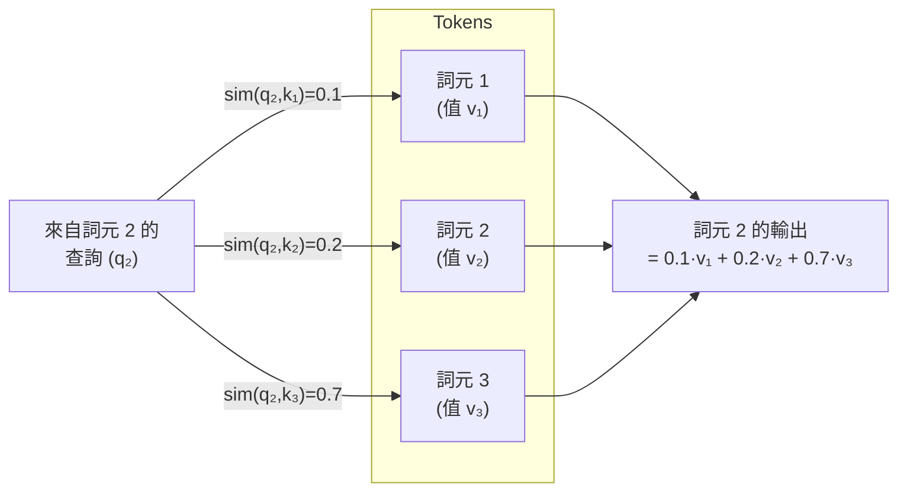
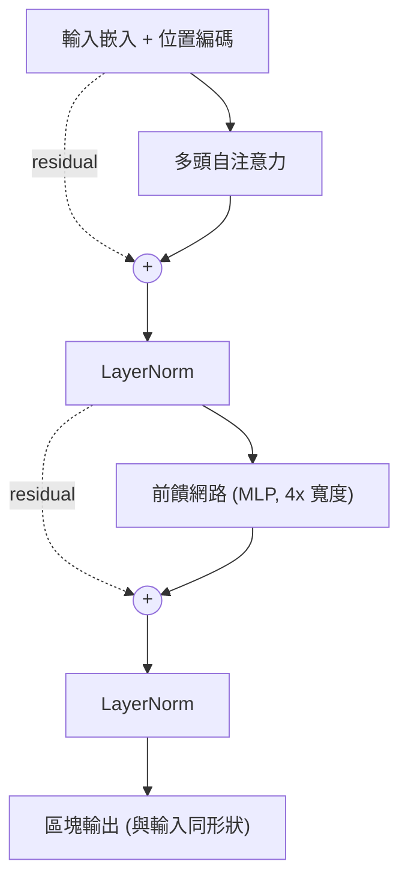

# 15 — 注意力與 Transformer

> 第 4 部分 · 第 15 課 · 程式技術棧：pytorch

**先備知識：** [14 — 序列模型：RNN 與 LSTM](14-rnns-lstms.md)（你應該了解為什麼循環結構在處理長序列時會遇到困難，以及隱藏狀態 (hidden state) 是什麼）。有幫助的背景知識：[13 — CNN](13-cnns.md)、[12 — 訓練深層網路](12-training-deep-nets.md)、[11 — PyTorch 基礎](11-pytorch-fundamentals.md)。

**學完本課你能：**
- 把注意力 (attention) 解釋為「每個詞元向所有其他詞元發出查詢，並取它們值的加權平均」。
- 從頭在 PyTorch 中推導並實作**縮放點積注意力 (scaled dot-product attention)** $\text{softmax}(QK^\top/\sqrt{d})V$。
- 建構一個完整的 **Transformer 區塊**（多頭注意力 (multi-head attention) + 前饋網路 + 殘差 + 層正規化 (layer normalization)），並加入**位置編碼 (positional encoding)**。
- 區分編碼器 (encoder)、解碼器 (decoder) 與因果遮罩 (causal masking)，並解釋為什麼一疊解碼器區塊是現代大型語言模型 (LLM) 的骨幹。
- 闡述注意力*為什麼*能勝過 RNN：平行性與直接的長距離連接——以及這對多感測器融合有何重要意義。

---

## 1. 直覺理解

RNN 一次讀取序列的一個步驟，並把它看過的所有東西塞進單一固定大小的隱藏狀態裡。為了把第 1 個詞元連接到第 500 個詞元，訊號必須撐過 499 次連續更新——梯度會消失、資訊會被覆寫，而且你無法平行化，因為步驟 $t$ 必須先有步驟 $t-1$ 才能進行。

**注意力**徹底擺脫了這個瓶頸。它不再讓資訊沿著一條鏈傳遞下去，而是讓**每個詞元一次就直接看向所有其他詞元**，並決定每一個對自己有多重要。

我喜歡的類比：把它想成**柔性資料庫查詢 (soft database lookup)**。每個詞元發出一個**查詢 (query)**（「我是 *it* 這個詞——我指的是前面哪一個名詞？」）。每個詞元同時也亮出一把**鍵 (key)**（「我是名詞 *boat*，這是我的識別簽章」）。查詢會依相似度與所有鍵比對；最相符的得到最大權重。然後你取回一個混合後的答案——對每個詞元的**值 (value)**（它實際的內容）取加權平均。不像硬性字典查詢只回傳恰好一列，注意力回傳的是一個*柔性*混合：70% boat、20% water、10% 其他全部。

USV 的類比：想像在某一瞬間融合來自聲納 (sonar)、光達 (lidar)、慣性測量單元 (IMU) 與 GPS 的讀數。針對*估計我的航向 (heading)* 的融合「查詢」應該大量加權 IMU，而幾乎不理會聲納；針對*估計到碼頭的距離*的查詢則應該反過來。注意力會學習這些路由權重，而不是把它們寫死。



這個設計帶來三個性質：
- **與順序無關。** 注意力是對一個*集合*的加權總和——它本身沒有任何關於位置的概念。我們透過**位置編碼**（第 2 節）把順序重新裝回去。
- **可平行。** 所有查詢-鍵的比對是一次大型矩陣乘法。沒有連續相依性，所以 GPU 很喜歡它。
- **路徑長度固定。** 第 1 個詞元和第 500 個詞元只相距*一*個注意力步驟，而不是 499 個。長距離相依性變得很容易處理。

---

## 2. 數學原理

### 縮放點積注意力

把一個由 $n$ 個詞元組成的序列（每個詞元是一個 $d$ 維向量）打包成矩陣 $X \in \mathbb{R}^{n \times d}$。我們用學到的權重矩陣 $W_Q, W_K, W_V$ 把 $X$ 投影成三種角色：

$$
Q = X W_Q, \qquad K = X W_K, \qquad V = X W_V
$$

- $Q \in \mathbb{R}^{n \times d_k}$ ——**查詢**，每個詞元一個（「我在找什麼？」）。
- $K \in \mathbb{R}^{n \times d_k}$ ——**鍵**，每個詞元一個（「作為查詢的識別簽章，我提供什麼？」）。
- $V \in \mathbb{R}^{n \times d_v}$ ——**值**，每個詞元一個（「我實際貢獻什麼內容？」）。

注意力的輸出為：

$$
\text{Attention}(Q,K,V) = \underbrace{\text{softmax}\!\left(\frac{QK^\top}{\sqrt{d_k}}\right)}_{\text{attention weights } A \,\in\, \mathbb{R}^{n\times n}} V
$$

我們從左到右讀它，因為每一塊都有它存在的理由：

1. **$QK^\top$** 是一個 $n \times n$ 的點積矩陣。位置 $(i,j)$ 的元素是 $q_i \cdot k_j$ ——也就是詞元 $i$ 的查詢與詞元 $j$ 的鍵有多匹配。內積 (dot product) 是天然的相似度分數：當兩個向量指向相同方向時它會很大。

2. **$/\sqrt{d_k}$ ——縮放。** 這從哪裡來？如果 $q_i$ 與 $k_j$ 的元素大致獨立、平均 (mean) 為 0、變異數 (variance) 為 1，那它們的內積 $\sum_{m=1}^{d_k} q_{im}k_{jm}$ 的變異數為 $d_k$，所以它的標準差 (standard deviation) 為 $\sqrt{d_k}$。對於大的 $d_k$，原始分數會變得非常巨大，softmax 會飽和成近乎 one-hot 的尖峰，其梯度幾乎消失。除以 $\sqrt{d_k}$ 把分數重新縮放回單位變異數，使 softmax 維持在健康、可訓練的範圍。

3. **$\text{softmax}(\cdot)$** 是**逐列 (row-wise)** 套用的。第 $i$ 列變成一個對所有詞元 $j$ 的機率 (probability) 分布 (distribution)：$A_{ij} = \dfrac{\exp(s_{ij})}{\sum_{j'} \exp(s_{ij'})}$，其中 $s_{ij}$ 是縮放後的分數。每一列加總為 1 ——這就是詞元 $i$ 的混合權重。

4. **$A V$** 把那些權重乘上值。第 $i$ 列的輸出是 $\sum_j A_{ij}\, v_j$ ——所有值向量的加權平均，依其對詞元 $i$ 的相關性加權。這就是柔性查詢。

**自注意力 (self-attention)** 只是表示 $Q$、$K$、$V$ 全都來自同一個序列 $X$（一個句子對自己做注意力）。**交叉注意力 (cross-attention)** 則用來自一個序列的 $Q$ 和來自另一個序列的 $K,V$（解碼器對編碼器的輸出做注意力）。

### 多頭注意力

單次注意力計算強迫所有詞元以單一方式產生關聯。真實的關係是多面向的：在語言中，某個「頭」可能追蹤主詞-動詞一致性，而另一個追蹤指代關係 (coreference)。所以我們平行地跑 $h$ 個注意力，每個都在它自己的較低維子空間中進行：

$$
\text{head}_i = \text{Attention}(X W_Q^{(i)},\, X W_K^{(i)},\, X W_V^{(i)}), \qquad i = 1,\dots,h
$$

$$
\text{MultiHead}(X) = \text{Concat}(\text{head}_1, \dots, \text{head}_h)\, W_O
$$

每個頭使用維度 $d_k = d_v = d_{\text{model}}/h$，因此把 $h$ 個頭串接起來會帶你回到 $d_{\text{model}}$，而輸出投影 $W_O \in \mathbb{R}^{d_{\text{model}} \times d_{\text{model}}}$ 則混合這些頭。**總計算量與一個大頭相同，卻有 $h$ 個獨立的關係子空間。**

### 位置編碼

注意力是對一個集合的加總——把輸入詞元重新排列，輸出也只是以相同方式重排；模型根本分不出「dock then boat」與「boat then dock」。我們透過對每個詞元嵌入 (embedding) **加上**一個與位置相關的向量來注入順序。原始的 Transformer 使用固定的正弦波：

$$
PE_{(\text{pos},\, 2k)} = \sin\!\left(\frac{\text{pos}}{10000^{\,2k/d_{\text{model}}}}\right), \qquad
PE_{(\text{pos},\, 2k+1)} = \cos\!\left(\frac{\text{pos}}{10000^{\,2k/d_{\text{model}}}}\right)
$$

其中 $\text{pos}$ 是位置索引，而 $k$ 索引嵌入維度。每個維度都是一個不同波長的正弦波（低維是短波長，高維是長波長）——就像二進位時鐘的位元，這個組合能唯一地辨識出一個位置。一個有用的附加好處是：$PE_{\text{pos}+\Delta}$ 是 $PE_{\text{pos}}$ 的一個固定線性函數，所以模型可以學會依*相對*偏移量來做注意力。（現代模型常把這些換成學習式或旋轉式 (RoPE) 編碼，但原理完全相同：告訴注意力每個詞元位在哪裡。）

### Transformer 區塊

把這些零件與先前課程中的兩個穩定器疊在一起——**殘差連接 (residual connections)**（讓梯度得以流動，見 [12 — 訓練深層網路](12-training-deep-nets.md)）與**層正規化**：

$$
\begin{aligned}
Z &= \text{LayerNorm}\big(X + \text{MultiHead}(X)\big) \\
\text{Out} &= \text{LayerNorm}\big(Z + \text{FFN}(Z)\big)
\end{aligned}
$$

**前饋網路 (feed-forward network)** $\text{FFN}(z) = W_2\,\sigma(W_1 z + b_1) + b_2$ 是一個逐詞元的 MLP（通常擴展到 $4\times$ 寬度，例如使用 GELU 啟動函數 (activation function)）。注意力*跨*詞元混合資訊；接著 FFN *獨立地*轉換每個詞元。那種交替——先混合、再處理——就是整個引擎。



因為這個區塊的輸出和它的輸入有**相同的形狀**，你可以像樂高一樣堆疊 $N$ 個（12 個、96 個……）。

---

## 3. 程式碼

我們會從頭在 PyTorch 中建構注意力——先在一個玩具序列上做原始的縮放點積並畫出熱圖，接著做一個可重用的自注意力模組，最後做一個完整的 Transformer 區塊。（在 PyTorch 2.8 上測試。）

### 3a. 親手實作縮放點積注意力

```python
import torch
import torch.nn.functional as F
import math
import matplotlib.pyplot as plt

torch.manual_seed(0)

# 玩具「序列」：4 個詞元，每個是一個 d_model 維的嵌入。
# 把它們想成 4 個感測器讀數或 4 個單字。
seq_len, d_model = 4, 8
x = torch.randn(seq_len, d_model)          # X : (n=4, d=8)

# 真實情況下會學到的投影矩陣。這裡只是隨機的小數值。
Wq = torch.randn(d_model, d_model) * 0.5
Wk = torch.randn(d_model, d_model) * 0.5
Wv = torch.randn(d_model, d_model) * 0.5

Q = x @ Wq                                  # (4, 8) 查詢
K = x @ Wk                                  # (4, 8) 鍵
V = x @ Wv                                  # (4, 8) 值

# 步驟 1：原始相似度分數，每個查詢對每個鍵 -> (4, 4)
scores = Q @ K.T / math.sqrt(d_model)       # /sqrt(d) 縮放

# 步驟 2：逐列 softmax -> 注意力權重，每一列加總為 1
attn = F.softmax(scores, dim=-1)            # (4, 4)

# 步驟 3：值的加權平均
out = attn @ V                              # (4, 8)

print("attention weights:\n", attn.round(decimals=2))
print("row sums (must be 1):", attn.sum(dim=-1))
print("output shape:", out.shape)
# -> row sums (must be 1): tensor([1., 1., 1., 1.])
# -> output shape: torch.Size([4, 8])
```

### 3b. 視覺化注意力權重矩陣

```python
plt.figure(figsize=(4, 4))
plt.imshow(attn.detach(), cmap="viridis")
plt.colorbar(label="attention weight")
plt.xlabel("Key (token being looked AT)")
plt.ylabel("Query (token doing the LOOKING)")
plt.title("Attention weights  softmax(QKᵀ/√d)")
for i in range(seq_len):
    for j in range(seq_len):
        plt.text(j, i, f"{attn[i,j]:.2f}", ha="center", va="center",
                 color="white", fontsize=9)
plt.tight_layout()
plt.show()
```

**你應該看到：** 一個 4×4 的網格，其中每一*列*都是一個機率分布（一列裡的亮度加總為 1）。在 $(i,j)$ 處有一個亮格表示「詞元 $i$ 強烈地從詞元 $j$ 提取資訊」。在隨機權重下它看起來相當均勻；但在真實任務上訓練之後，各列會發展出尖銳的峰值——那就是模型在決定*誰對誰做注意力*。

### 3c. 一個可重用的自注意力模組（含可選的因果遮罩）

```python
import torch.nn as nn

class SelfAttention(nn.Module):
    """單頭的縮放點積自注意力。"""
    def __init__(self, d_model):
        super().__init__()
        self.Wq = nn.Linear(d_model, d_model, bias=False)
        self.Wk = nn.Linear(d_model, d_model, bias=False)
        self.Wv = nn.Linear(d_model, d_model, bias=False)
        self.scale = math.sqrt(d_model)

    def forward(self, x, mask=None):
        # x: (batch?, seq, d_model)。在 (seq, d_model) 上也能運作。
        Q, K, V = self.Wq(x), self.Wk(x), self.Wv(x)
        scores = Q @ K.transpose(-2, -1) / self.scale       # (..., n, n)
        if mask is not None:
            # 把被遮罩的位置設為 -inf，這樣 softmax 會給它們 ~0 的權重。
            scores = scores.masked_fill(mask == 0, float("-inf"))
        attn = F.softmax(scores, dim=-1)
        return attn @ V, attn

# 因果遮罩：詞元 i 只能對詞元 j <= i 做注意力（不能偷看未來）。
sl = 5
causal = torch.tril(torch.ones(sl, sl))     # 下三角矩陣全為 1
sa = SelfAttention(16)
o, w = sa(torch.randn(sl, 16), mask=causal)
print("token 0 attends to:", w[0].detach().round(decimals=2))
# -> token 0 attends to: tensor([1., 0., 0., 0., 0.])   # 只有它自己
print("token 4 attends to:", w[4].detach().round(decimals=2))
# -> token 4 attends to: 例如 tensor([0.27, 0.10, 0.07, 0.13, 0.44])  # 一個對
#    位置 0-4 的分布，加總為 1（確切數值取決於 RNG/torch 版本；重點是
#    沒有任何位置被遮罩，這與詞元 0 不同）。在這些隨機權重下，分配大致是平均的。
```

**因果遮罩 (causal mask)** 是把自注意力變成從左到右生成器的唯一訣竅：每個位置只能使用過去。這正是語言模型用來預測下一個詞元所需要的。

### 3d. 完整的 Transformer 區塊（使用 PyTorch 的多頭注意力）

```python
class TransformerBlock(nn.Module):
    """後正規化 (post-norm) 的 Transformer 編碼器區塊：MHA -> FFN，兩者都帶殘差。

    這是原始的 2017 年（Vaswani）佈局：LayerNorm 在殘差相加*之後*套用，
    對應第 2 節的 Z = LayerNorm(X + MultiHead(X))。現代的 LLM 則改用
    *前正規化 (pre-norm)* ——正規化放在每個子層*內部*、注意力/FFN 之前，
    例如 x = x + drop(attn(norm1(x), ...)) ——它在深層時訓練得更穩定。
    """
    def __init__(self, d_model, n_heads, d_ff, dropout=0.1):
        super().__init__()
        self.attn = nn.MultiheadAttention(d_model, n_heads,
                                          dropout=dropout, batch_first=True)
        self.ff = nn.Sequential(
            nn.Linear(d_model, d_ff), nn.GELU(),
            nn.Dropout(dropout), nn.Linear(d_ff, d_model),
        )
        self.norm1 = nn.LayerNorm(d_model)
        self.norm2 = nn.LayerNorm(d_model)
        self.drop = nn.Dropout(dropout)

    def forward(self, x, attn_mask=None):
        # 子層 1：自注意力 + 殘差
        a, _ = self.attn(x, x, x, attn_mask=attn_mask)   # Q=K=V=x
        x = self.norm1(x + self.drop(a))
        # 子層 2：逐位置前饋網路 + 殘差
        x = self.norm2(x + self.drop(self.ff(x)))
        return x

block = TransformerBlock(d_model=16, n_heads=4, d_ff=64)
batch = torch.randn(2, 5, 16)               # (batch=2, seq=5, d_model=16)
print("block output shape:", block(batch).shape)
# -> block output shape: torch.Size([2, 5, 16])   # 輸入 == 輸出 同形狀
```

注意 `d_model=16` 搭配 `n_heads=4` 會讓每個頭有 $16/4 = 4$ 個維度——`n_heads` 必須能整除 `d_model`。輸出形狀等於輸入形狀，所以 `nn.Sequential(*[TransformerBlock(...) for _ in range(N)])` 能瞬間堆疊 $N$ 層。在真實程式碼中你會直接用 `nn.TransformerEncoderLayer` / `nn.TransformerEncoder`，但親手建一次正是它不再顯得像魔法的方法。

---

## 4. 實際案例

### 為什麼注意力勝過 RNN ——以及它對你的重要性

2017 年那篇引入 Transformer 的論文（《Attention Is All You Need》）是在機器翻譯（**WMT 英德**基準）上訓練的。有兩個實務上的勝利，兩者在你自己的機器人研究中都看得到：

**1. 訓練時的平行性。** RNN 處理一個長度為 $n$ 的序列是 $n$ 個連續步驟——它*無法*沿時間軸平行化。Transformer 的 $QK^\top$ 是單一批次矩陣乘法：所有位置一次到位。在 GPU 上這就是數小時與數分鐘的差別，這正是為什麼一旦移除循環結構，模型就能從數百萬擴展到數十億個參數。

**2. 長距離相依性。** 把位置 1 連接到位置 1000，RNN 要花約 1000 次有損的跳躍；注意力只用**一**次就辦到。具體來說，在一份路徑跟隨 (path following) 日誌中，若 USV 在 $t{=}900$ 的行為取決於它在 $t{=}10$ 首次看到的障礙物 (obstacle)，注意力就能直接路由那份資訊。代價是：注意力對序列長度是 $O(n^2)$（那個 $n\times n$ 矩陣），而 RNN 是 $O(n)$ ——所以對於*極*長的序列，你是用記憶體去換取那種直接存取。（這道 $O(n^2)$ 高牆正是高效注意力研究一直在攻克的目標。）

**多感測器融合對映。** 假設在每個時間步，你的 USV 把來自聲納、光達、IMU 與 GPS 的特徵串接起來、投影到 $d_{\text{model}}$，產生一個詞元。在最近若干時間步的窗口上跑一個小型 Transformer 編碼器：

| Transformer 概念 | USV 融合上的意義 |
|---|---|
| 詞元 | 一個時間步的融合特徵向量（或一個感測器通道） |
| 詞元 $t$ 的查詢 | 「為了估計 $t$ 時刻的狀態，我需要什麼脈絡？」 |
| 注意力權重 | 學習到的、*動態的*感測器/時間相關性——轉彎時重 IMU，靠近碼頭時重光達 |
| 位置編碼 | 讀數的時間戳記／順序（這樣模型才知道近期程度） |
| 因果遮罩 | 強制*線上 (online)* 運作：只用過去的讀數，絕不用未來的 |

重點在於**注意力權重是依資料而定的**。卡爾曼濾波器的增益是由你的雜訊模型固定的；注意力則*學會*去加重在當前情境下最值得信任的感測器——這正是你原本得手動調整的那種自適應融合。

### 通往 LLM 的橋樑

一個現代的大型語言模型（GPT 式）在結構上幾乎完全就是你在 3d 中所建構的那套工具：**一疊很深的解碼器 Transformer 區塊**——帶因果遮罩的自注意力、前饋網路、殘差、層正規化——重複數十到數百次，餵入詞元嵌入加上位置編碼，最後用一個線性層來預測下一個詞元。唯一的調整是層正規化的*擺放位置*：3d 使用原始的後正規化佈局，而現代 LLM 把正規化移到每個子層內部（**前正規化**，如 3d 的 docstring 所述）以求深層時的訓練穩定性——相同的元件，重新排序。把它訓練成在數兆個詞元的文字上預測下一個詞元，你在熱圖中看到的那種脈絡內路由就變成了文法、事實與推理。除了這一課之外沒有什麼新機制——只有規模、資料與因果遮罩。我們會在 [17 — 遷移學習、LLM 與 MLOps](17-transfer-learning-llms-mlops.md) 看到這類模型如何被調整與部署。

---

## 5. 常見陷阱與技巧

- **忘記位置資訊。** 拿掉位置編碼，你的模型就把輸入當成一袋詞元——它分不出「boat hits dock」與「dock hits boat」。在第一個區塊之前一定要加上位置（或使用 RoPE）。
- **跳過 $\sqrt{d_k}$ 縮放。** 沒有它，分數會隨維度爆增，softmax 飽和成 one-hot，梯度消失，訓練停滯。它只是一行；別省略它。
- **`n_heads` 必須整除 `d_model`。** 否則 PyTorch 會丟出錯誤。每個頭分到 $d_{\text{model}}/h$ 個維度。
- **錯誤的遮罩，悄無聲息的洩漏。** 解碼器/生成器*必須*使用因果遮罩。如果你忘了，模型就會藉著對未來詞元做注意力來「作弊」，訓練到接近零的損失，然後在推論時、當未來尚不可用時徹底失敗。請做完整性檢查：對 $j>i$ 的位置，詞元 $i$ 的權重應為零（如同 3c 的輸出）。
- **把填補遮罩 (padding mask) 與因果遮罩搞混。** 真實的批次會填補 (pad) 變長序列；你需要一個*填補*遮罩來把對填補詞元的注意力歸零，這與因果遮罩是分開的。PyTorch 把 `attn_mask`（因果）和 `key_padding_mask` 分開處理。
- **$O(n^2)$ 記憶體的意外。** 注意力的記憶體隨序列長度的*平方*成長。把 4k 詞元的脈絡加倍到 8k，注意力矩陣大約會變成四倍——這是常見的記憶體不足陷阱。對於很長的日誌，請使用較短的窗口或高效注意力的變體。

---

## 6. 自我檢測

**Q1.** 在 $\text{softmax}(QK^\top/\sqrt{d_k})V$ 中，$n\times n$ 注意力矩陣的單一*列*代表什麼，而它為什麼必須加總為 1？

<details><summary>解答</summary>
第 $i$ 列存放的是詞元 $i$ 分配給每個詞元 $j$（包含它自己）的混合權重。因為每一列都是由 softmax 產生的，它的元素都非負且加總為 1 ——所以詞元 $i$ 的輸出 $\sum_j A_{ij} v_j$ 是所有值向量的*凸組合 (convex combination)*（加權平均）。它是一個柔性、已正規化的查詢，而不是任意的加總。
</details>

**Q2.** 為什麼要特地把分數除以 $\sqrt{d_k}$，而不是某個其他常數？

<details><summary>解答</summary>
如果查詢與鍵的元素大致獨立且具單位變異數，它們在 $d_k$ 個維度上的內積會有變異數 $d_k$ 與標準差 $\sqrt{d_k}$。除以 $\sqrt{d_k}$ 會恢復單位變異數，使 softmax 的輸入維持在一個適中、不會飽和的範圍，讓梯度保持健康。任何其他常數都無法跟上這個散布隨維度成長的方式。
</details>

**Q3.** 自注意力具有排列等變性（把詞元打亂，輸出也以相同方式打亂）。為什麼這是個問題，而 Transformer 如何修正它？

<details><summary>解答</summary>
這表示原始機制無法利用單字/時間步的順序——「A then B」看起來與「B then A」完全相同。這對語言和時間序列是致命的。修正方法是**位置編碼**：對每個詞元嵌入加上一個與位置相關的向量（固定正弦波、學習式或旋轉式），讓每個詞元都帶有它在序列中所處位置的資訊。
</details>

**Q4.** 相較於同樣總寬度的單一注意力頭，多頭注意力帶來什麼具體的優勢？

<details><summary>解答</summary>
它讓模型能**同時在多個獨立的表示子空間中做注意力**——某個頭可以追蹤某一類關係（例如語法一致性，或「哪個感測器對航向重要」），而另一個追蹤不同的關係。單一頭必須把所有類型的關係壓縮進一個被平均掉的注意力模式裡。計算成本基本上相同，因為每個頭都相應地變窄了。
</details>

**Q5.** 你正在為一台 USV 建構一個*線上*狀態估計器，它絕不能使用未來的感測器讀數。你會在自注意力內部套用哪種遮罩，而如果忘了它會出現什麼 bug？

<details><summary>解答</summary>
一個**因果（下三角）遮罩**，這樣位置 $t$ 只對位置 $\le t$ 做注意力。忘了它，模型就會在訓練時對未來讀數做注意力，把損失人為地壓低，然後在部署時、當未來真的不可用時崩潰——這是典型的訓練/服務洩漏 bug。
</details>

---

## 回顧與下一步

- **注意力**是一個柔性、學習而來的查詢：每個詞元形成一個**查詢**，把它與所有**鍵**比對，並取回所有**值**的 softmax 加權平均—— $\text{softmax}(QK^\top/\sqrt{d_k})V$。
- $\sqrt{d_k}$ 縮放讓 softmax 保持可訓練；**多頭**注意力在平行的子空間中跑數次查詢；**位置編碼**恢復了注意力本身看不見的順序。
- 一個 **Transformer 區塊**交替進行「跨詞元混合」（注意力）與「處理每個詞元」（前饋網路），靠殘差連接與層正規化黏合——而且因為輸入形狀等於輸出形狀，它能乾淨地堆疊。
- 注意力勝過 RNN，是因為它**可平行**且在任意兩個位置之間提供**固定長度**的路徑；代價是對序列長度的 $O(n^2)$ 成本。對機器人領域而言，這實現了自適應、依資料而定的多感測器融合。
- 一個現代的 **LLM 就是一疊很深的因果解碼器區塊**——其核心沒有任何超出這一課的東西，只有規模與資料。

接下來，我們會用注意力以及第 3–4 部分的這些建構零件去*創造*資料，而不是分類它——自編碼器、VAE、GAN 與擴散模型：[16 — 生成模型](16-generative-models.md)。
