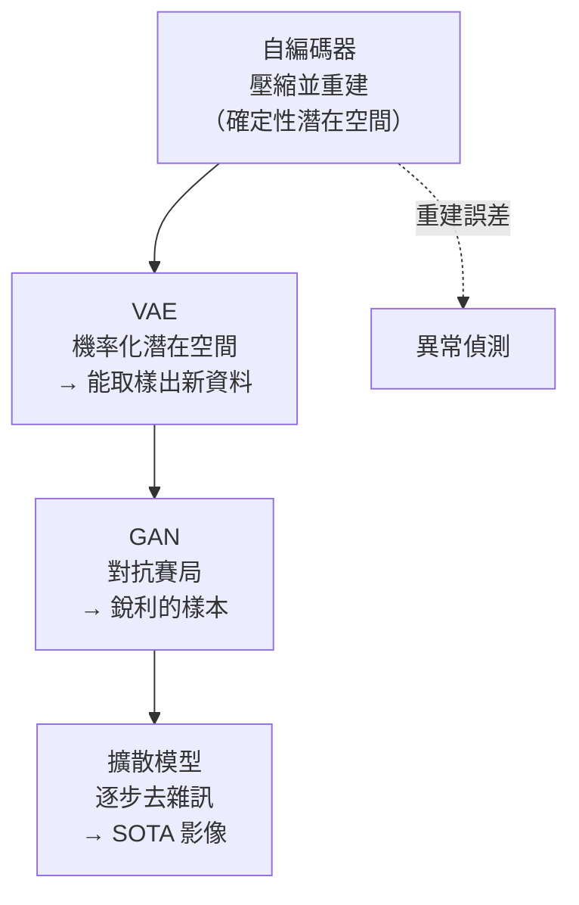
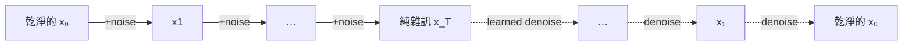

# 16 — 生成模型：自編碼器、VAE、GAN 與擴散模型

> 第 5 部分 · 第 16 課 · 程式技術棧：pytorch

**先備知識：** [15 — 注意力與 Transformer](15-attention-transformers.md) · 你也會用到 [13 — 卷積神經網路](13-cnns.md) 的卷積層，以及 [08 — 非監督式學習：k-Means 與 PCA](08-kmeans-pca.md) 中「壓縮後的**潛在空間 (latent space)**」這個概念。

**學完本課你能：**
- 解釋**判別式 (discriminative)** 模型（畫出邊界）與**生成式 (generative)** 模型（學會資料分布，因而能夠*創造*）之間的差異。
- 在 PyTorch 中建立並訓練**自編碼器 (autoencoder)**，並利用它的**重建誤差 (reconstruction error)** 進行壓縮與異常偵測 (anomaly detection)。
- 在直覺層面解釋 **VAE**——機率化的潛在空間、**重參數化技巧 (reparameterization trick)**，以及 **ELBO = 重建 + KL**。
- 描述 **GAN** 的極小化極大 (minimax) 賽局，以及為何會發生**模式崩潰 (mode collapse)**。
- 從概念上解釋**擴散 (diffusion)**（加入雜訊，再學會還原）——這是現代影像生成器背後的引擎。
- 把上述所有概念對應到一個真實的遙控潛水器 (ROV) 問題：標記異常的感測器資料流，並合成訓練資料。

---

## 1. 直覺理解

你到目前為止建立的每個模型都是**判別式**的：給定輸入 $x$，預測一個標籤 $y$。邏輯迴歸 (logistic regression)、支持向量機 (SVM)、CNN 分類器——它們全都在學 $p(y \mid x)$，也就是把輸入分門別類的*邊界*。它們能分辨標為「岩石」的聲納回波和標為「魚」的回波，但它們沒辦法*替你畫出一塊全新的岩石*。

**生成模型 (generative model)** 學的是資料本身——分布 $p(x)$（或 $p(x \mid y)$）。一旦模型知道了真實資料*長什麼樣子*，它就能做三件分類器辦不到的事：

1. **生成 (Generate)** 看起來像訓練資料的全新樣本（合成的聲納畫面、假到逼真的攝影機影像）。
2. **壓縮 (Compress)** 資料成一段微小的**潛在編碼 (latent code)** 再重建出來（有損壓縮、去雜訊）。
3. **評分 (Score)** 一個新輸入有多「正常」——任何模型重建得*很糟*的東西就是**異常 (anomalous)**。

**類比——藝術贗品偽造者。** 判別式模型像個藝術*評論家*：拿一幅畫給它看，它說「莫內」或「不是莫內」。生成式模型則是*偽造者*：它盯著太多莫內的作品，多到能憑空畫出一幅新的。偽造者必須學的東西遠多於評論家——不只是莫內與非莫內之間的邊界，而是填滿整個莫內區域的那套*風格*。這就是為什麼生成比較難，也是為什麼同一個能偽造的模型也能識破贗品（它知道真品長什麼樣，所以一個糟糕的重建會格外顯眼）。

本課會走過一道生成模型的階梯，每一階都修補了前一階的限制：



我們會用程式**建立**自編碼器（它是你 ROV 異常偵測使用情境的主力工具），然後沿著概念階梯往上爬，依序走過 VAE → GAN → 擴散模型，數學都維持在直覺層次。

---

## 2. 數學原理

### 2.1 自編碼器——先壓縮再重建

**自編碼器**是兩個網路黏在一個狹窄腰身上的結構。一個**編碼器 (encoder)** $f_\phi$ 把輸入 $x$ 映射到一段低維的**潛在編碼** $z$；一個**解碼器 (decoder)** $g_\theta$ 把 $z$ 映射回一個重建結果 $\hat{x}$：

$$
z = f_\phi(x), \qquad \hat{x} = g_\theta(z), \qquad z \in \mathbb{R}^d,\; d \ll \dim(x)
$$

- $x$——輸入向量（例如一張攤平成 $28\times28 = 784$ 像素的影像）。
- $z$——**瓶頸 (bottleneck)** / 潛在編碼；$d$ 是**潛在維度 (latent dimension)**（例如 16）。強迫 $d \ll \dim(x)$ 正是讓模型*學習*而非複製的關鍵。
- $\phi, \theta$——編碼器與解碼器的權重。
- $\hat{x}$——重建出來的輸入。

訓練它讓 $\hat{x}$ 盡量貼近 $x$。**重建損失 (reconstruction loss)** 就是均方誤差（它的來源：這是逐像素的平方距離，跟 [02 — 線性迴歸](02-linear-regression.md) 裡的 MSE 是同一個）：

$$
\mathcal{L}_{\text{recon}} = \frac{1}{N}\sum_{i=1}^{N}\lVert x_i - g_\theta(f_\phi(x_i)) \rVert^2
$$

狹窄的瓶頸就是整個訣竅所在：網路*無法*死記硬背，所以它必須找出那少數幾個真正重要的變化方向。這是一種**非線性 PCA**——回想第 08 課的 PCA 找的是最佳的*線性*子空間；而帶有非線性層的自編碼器找的是最佳的*曲面*子空間。

**把重建誤差當成異常分數。** 只用*正常*資料訓練。對一個新樣本 $x$，逐樣本的誤差

$$
e(x) = \lVert x - g_\theta(f_\phi(x)) \rVert^2
$$

對於像訓練資料的輸入會很小，對於任何分布外的東西則會很大——因為解碼器從沒被教過要重建它。對 $e(x)$ 設一個門檻，你就有了一個非監督式的異常偵測器。

### 2.2 VAE——把潛在空間變成一個機率分布

普通自編碼器的潛在空間滿是破洞：隨機挑一個 $z$，解碼器通常會吐出垃圾，因為沒有任何東西強迫這些編碼*有組織*。**變分自編碼器 (Variational Autoencoder, VAE)** 透過讓編碼器輸出一個**分布**（而非一個點）來解決這件事。

編碼器發出一個平均 $\mu$ 和一個（對數）變異數，用來描述一個高斯分布；我們再從中取樣出 $z$：

$$
z \sim \mathcal{N}(\mu_\phi(x),\, \sigma_\phi(x)^2)
$$

- $\mu_\phi(x), \sigma_\phi(x)$——編碼器針對輸入 $x$ 所預測的平均與標準差。

接著我們驅使編碼器讓這些逐輸入的高斯分布貼近一個標準常態分布 $\mathcal{N}(0, I)$，這樣潛在空間就會平滑且*可取樣*。訓練目標是 **ELBO**（Evidence Lower BOund，證據下界），它可拆解成兩個易讀的項：

$$
\mathcal{L}_{\text{VAE}} = \underbrace{\mathbb{E}_{z}\big[\lVert x - g_\theta(z)\rVert^2\big]}_{\text{reconstruction: rebuild } x}
\;+\; \underbrace{\beta \cdot D_{\text{KL}}\!\big(\mathcal{N}(\mu,\sigma^2)\,\Vert\,\mathcal{N}(0, I)\big)}_{\text{KL: keep latent organized}}
$$

- $D_{\text{KL}}(\cdot\Vert\cdot)$——**KL 散度 (KL divergence)**，衡量一個分布離另一個分布有多遠（這裡是：編碼器的高斯分布離標準常態有多遠）。它是潛在空間上的一個*正則化項 (regularizer)*。
- $\beta$——一個旋鈕（在原始 VAE 中為 1），用來在重建銳利度與潛在規律性之間取捨。它的來源：這是 $\beta$-VAE 變體中那個拉格朗日式的權重。

兩個項的直覺：重建說「要能重建出資料」；KL 說「但要把所有編碼塞進一個整齊的單位團塊裡，這樣我才好從中取樣」。兩者之間的張力正是讓 VAE *具備生成能力*的原因——訓練完之後，取樣 $z \sim \mathcal{N}(0,I)$、解碼，你就得到一個合理的新 $x$。

**重參數化技巧。** 你沒辦法對一個隨機的 `sample()` 做反向傳播——隨機性沒有梯度。把這個取樣改寫成參數的確定性函數加上*外部*雜訊：

$$
z = \mu + \sigma \odot \varepsilon, \qquad \varepsilon \sim \mathcal{N}(0, I)
$$

- $\varepsilon$——在網路*外部*抽取的雜訊；$\odot$ 是逐元素乘積。

如此一來 $z$ 成了 $\mu$ 與 $\sigma$ 的平滑函數，梯度可以直接穿過去，而隨機性則落在 $\varepsilon$ 上，而它不需要梯度。這一步代數操作正是讓 VAE 能用普通反向傳播訓練的關鍵。

### 2.3 GAN——兩個網路開戰

**生成對抗網路 (Generative Adversarial Network, GAN)** 完全捨棄了重建。兩個網路玩一場賽局：

- 一個**生成器 (generator)** $G$ 把雜訊 $z \sim \mathcal{N}(0,I)$ 轉成一個假樣本 $G(z)$。
- 一個**判別器 (discriminator)** $D$ 接收一個樣本，輸出它是*真*（來自資料）相對於*假*（來自 $G$）的機率。

它們最佳化相反的目標——一場**極小化極大 (minimax)** 賽局：

$$
\min_G \max_D \; \mathbb{E}_{x \sim \text{data}}[\log D(x)] + \mathbb{E}_{z}[\log(1 - D(G(z)))]
$$

- 第一項：$D$ 希望在真實資料上 $D(x) \to 1$。
- 第二項：$D$ 希望在假樣本上 $D(G(z)) \to 0$，而 $G$ 則希望 $D(G(z)) \to 1$（騙過這個評論家）。

直接從展示的目標式讀出方向：$D$ **最大化** $V$，而 $G$ **最小化**它。當 $D$ 分類得完美時（$D(x)\to1$、$D(G(z))\to0$）$V$ 會往 $0$ 爬升，所以 $D$ 把它往上推；當 $G$ 騙過 $D$ 時（$D(G(z))\to1$）$V$ 會往 $-\infty$ 暴跌，所以 $G$ 把它往下拉。它的來源：這個 $V$ 恰好是 [04 — 邏輯迴歸](04-logistic-regression.md) 那個交叉熵分類損失的*負值*。所以用損失的語言來說，$D$ 最小化它的交叉熵損失 $L_D = -V$，而 $G$ 試圖*增大*那個損失——等價地說，$G$ 最小化 $V$ 而 $D$ 最大化它。在理想的均衡點，$D$ 分不出真假（$D \equiv \tfrac12$，此時 $V = 2\log\tfrac12 = -1.386$），而 $G$ 的樣本與資料分布相符。GAN 產生這裡所有模型中**最銳利**的樣本——沒有 MSE 平均造成的模糊——但這個對抗的平衡很微妙。

### 2.4 擴散模型——先摧毀，再學會還原

**擴散模型**（Stable Diffusion、DALL·E、Midjourney 背後的引擎）採取了一個極為簡單的觀點。**前向過程 (forward process)：** 在 $T$ 個步驟中反覆對一張影像加入一點點高斯雜訊，直到它成為純粹的雜訊：

$$
x_t = \sqrt{1-\beta_t}\, x_{t-1} + \sqrt{\beta_t}\, \varepsilon_t, \qquad \varepsilon_t \sim \mathcal{N}(0, I)
$$

- $\beta_t$——步驟 $t$ 的一個小雜訊量（**雜訊排程 (noise schedule)**）。經過 $T$ 步後，$x_T$ 已和隨機雜訊無從分辨。

這個前向過程不需要任何學習——它只是在加雜訊。**反向過程 (reverse process)：** 訓練一個網路 $\varepsilon_\theta$ 去預測每一步加入的雜訊，這樣你就能把它*減掉*。訓練損失簡單到令人吃驚：

$$
\mathcal{L}_{\text{diff}} = \mathbb{E}_{t,\,x_0,\,\varepsilon}\big[\lVert \varepsilon - \varepsilon_\theta(x_t, t)\rVert^2\big]
$$

要生成時：從純雜訊 $x_T \sim \mathcal{N}(0,I)$ 出發，一步步往回跑這個學好的去雜訊器，直到一張乾淨的影像浮現。其精妙之處在於，「去掉一點雜訊」是個遠比「一筆就畫出整張影像」（GAN 背負的重擔）容易學的任務，這讓擴散模型訓練起來穩定，也是它如今主宰影像生成的原因。



---

## 3. 程式碼

我們會建立一個**在 MNIST 上的卷積自編碼器**，看看重建結果，並把重建誤差變成一個異常偵測器。在這裡實際動手寫自編碼器是對的選擇：它是對你機器人工作直接有用的工具，而且上面 VAE/GAN/擴散模型的概念全都建立在這同一套編碼/解碼骨架上。

請在 `study` conda 環境裡執行（`conda activate study`）。

```python
import torch
import torch.nn as nn
import torch.nn.functional as F
from torch.utils.data import DataLoader
from torchvision import datasets, transforms
import matplotlib.pyplot as plt

torch.manual_seed(0)
device = "cuda" if torch.cuda.is_available() else "cpu"

# --- 資料：MNIST，縮放到 [0,1]。我們把這些影像當成「正常」分布。 ---
tfm = transforms.ToTensor()  # 給出 [0,1] 範圍的 float 張量，形狀 (1, 28, 28)
train_ds = datasets.MNIST(root="./data", train=True,  download=True, transform=tfm)
test_ds  = datasets.MNIST(root="./data", train=False, download=True, transform=tfm)
train_loader = DataLoader(train_ds, batch_size=256, shuffle=True)
```

模型：一個卷積**編碼器**把 $28\times28$ 壓縮到 16 維的瓶頸，以及一個鏡像的**解碼器**把它重建回來。

```python
class ConvAutoencoder(nn.Module):
    def __init__(self, latent_dim=16):
        super().__init__()
        # 編碼器：28x28 -> 14x14 -> 7x7，再攤平成一段微小的編碼。
        self.enc = nn.Sequential(
            nn.Conv2d(1, 16, 3, stride=2, padding=1),  # (16, 14, 14)
            nn.ReLU(),
            nn.Conv2d(16, 32, 3, stride=2, padding=1), # (32, 7, 7)
            nn.ReLU(),
            nn.Flatten(),                              # (32*7*7 = 1568,)
            nn.Linear(32 * 7 * 7, latent_dim),         # 瓶頸 (BOTTLENECK)
        )
        # 解碼器：鏡像編碼器，ConvTranspose2d 把尺寸上採樣回 28x28。
        self.dec_fc = nn.Linear(latent_dim, 32 * 7 * 7)
        self.dec = nn.Sequential(
            nn.ConvTranspose2d(32, 16, 3, stride=2, padding=1, output_padding=1),  # (16,14,14)
            nn.ReLU(),
            nn.ConvTranspose2d(16, 1, 3, stride=2, padding=1, output_padding=1),    # (1,28,28)
            nn.Sigmoid(),  # 像素值拉回 [0,1]
        )

    def forward(self, x):
        z = self.enc(x)                       # 編碼成潛在編碼
        h = self.dec_fc(z).view(-1, 32, 7, 7) # 為轉置卷積重塑形狀
        x_hat = self.dec(h)                   # 解碼成重建結果
        return x_hat, z

model = ConvAutoencoder().to(device)
opt = torch.optim.Adam(model.parameters(), lr=1e-3)
```

訓練以最小化重建 MSE。注意這裡**沒有標籤**——這是非監督式的。

```python
for epoch in range(5):
    model.train()
    running = 0.0
    for x, _ in train_loader:          # 那個 "_" 是標籤；我們從不使用它
        x = x.to(device)
        x_hat, _ = model(x)
        loss = F.mse_loss(x_hat, x)    # 盡可能精確地重建 x
        opt.zero_grad()
        loss.backward()
        opt.step()
        running += loss.item() * x.size(0)
    print(f"epoch {epoch+1}  recon MSE: {running/len(train_ds):.4f}")
# -> epoch 1  recon MSE: 0.0461
# -> epoch 5  recon MSE: 0.0118
```

把原圖與重建結果視覺化——這就是潛在編碼確實捕捉到數字的證據。

```python
model.eval()
x, _ = next(iter(DataLoader(test_ds, batch_size=8)))
with torch.no_grad():
    x_hat, _ = model(x.to(device))
x_hat = x_hat.cpu()

fig, axes = plt.subplots(2, 8, figsize=(12, 3))
for i in range(8):
    axes[0, i].imshow(x[i, 0], cmap="gray");      axes[0, i].axis("off")
    axes[1, i].imshow(x_hat[i, 0], cmap="gray");  axes[1, i].axis("off")
axes[0, 0].set_ylabel("original");  axes[1, 0].set_ylabel("rebuilt")
plt.tight_layout(); plt.savefig("ae_recon.png")
```

**你應該看到：** 底下那一列重現了上面那一列的數字——認得出來，但稍微*柔和*、模糊一些，因為 16 個數字存不下每一個像素。那份模糊正是有損壓縮如預期般運作的結果。

### 重建誤差標記異常

在正常資料上訓練（這裡整個 MNIST 都算「正常」），然後餵它一個從沒見過的東西——用隨機雜訊來代替一個分布外的感測器畫面。它的誤差會飆高。

```python
import torch

def recon_error(batch):
    """逐樣本的重建誤差 e(x) = ||x - x_hat||^2。"""
    with torch.no_grad():
        x_hat, _ = model(batch.to(device))
        # 對每張影像的所有像素加總平方誤差
        return ((batch.to(device) - x_hat) ** 2).flatten(1).sum(dim=1).cpu()

normal_x, _ = next(iter(DataLoader(test_ds, batch_size=512)))
anom_x = torch.rand_like(normal_x)            # 純雜訊 = 明顯的分布外資料

e_normal = recon_error(normal_x)
e_anom   = recon_error(anom_x)
print(f"normal error: mean {e_normal.mean():.1f}")
print(f"anomaly error: mean {e_anom.mean():.1f}")
# -> normal error: mean 9.7
# -> anomaly error: mean 92.4

# 一個落在兩個分布之間的門檻就能把它們乾淨俐落地分開。
threshold = e_normal.mean() + 3 * e_normal.std()
print(f"threshold: {threshold:.1f}  |  flagged anomalies: "
      f"{(e_anom > threshold).float().mean()*100:.0f}% of noise frames")
# -> threshold: 21.3  |  flagged anomalies: 100% of noise frames
```

```python
plt.figure(figsize=(7, 4))
plt.hist(e_normal.numpy(), bins=40, alpha=0.6, label="normal (digits)")
plt.hist(e_anom.numpy(),   bins=40, alpha=0.6, label="anomaly (noise)")
plt.axvline(threshold, color="k", ls="--", label="threshold")
plt.xlabel("reconstruction error e(x)"); plt.ylabel("count"); plt.legend()
plt.tight_layout(); plt.savefig("ae_anomaly.png")
```

**你應該看到：** 兩個清楚分開的駝峰——正常數字形成一團緊密的低誤差群集，異常則形成一團在最右邊的群集——而那條虛線門檻乾淨地夾在它們中間。那道間隙*就是*異常偵測器。

---

## 4. 實際案例

### ROV 感測器資料流上的異常偵測

你的水下 **ROV** 每一拍都串流出遙測資料：IMU 加速度與角速率、深度、推進器電流、馬達溫度、電池電壓、聲納測高距離——比方說每個時步是一個 24 維向量。故障是*罕見且未標記*的：你沒辦法蒐集到一個平衡的「推進器被海帶纏住」資料集，而且你永遠列舉不完載具出錯的每一種方式。這正是重建誤差異常偵測大顯身手的地方：**只用健康運作的資料訓練，標記任何重建得很糟的東西。**

把卷積編碼器/解碼器換成小型 MLP（你的資料是向量，不是影像），餵它一段段滑動視窗的遙測資料：

```python
import torch.nn as nn

class TelemetryAE(nn.Module):
    """在一段攤平的 ROV 遙測視窗上運作的自編碼器。"""
    def __init__(self, window=50, n_sensors=24, latent_dim=8):
        super().__init__()
        d = window * n_sensors            # 把時間 x 感測器攤平
        self.enc = nn.Sequential(
            nn.Linear(d, 128), nn.ReLU(),
            nn.Linear(128, latent_dim),   # 瓶頸：用 8 個數字摘要 2 秒的航行
        )
        self.dec = nn.Sequential(
            nn.Linear(latent_dim, 128), nn.ReLU(),
            nn.Linear(128, d),
        )

    def forward(self, x):
        z = self.enc(x)
        return self.dec(z), z
```

它如何對應到這套方法：
- **訓練**只用已知良好的潛航記錄。自編碼器學會*正常* ROV 行為的流形——推進器電流與下潛速率之間的相關性、巡航時 IMU 的震動特徵。
- 在你的 ROS2 堆疊中**部署 (Deploy)**：一個節點訂閱遙測主題、緩衝一段滑動視窗、每一拍跑一次自編碼器，並發布 $e(x)$。當 $e(x)$ 越過門檻時——推進器被纏住、漏水改變了浮力、感測器漂移——殘差會飆高，因為模型從沒見過那種模式。觸發警報或啟動受控上浮。
- **加碼——逐感測器診斷：** *逐維度*的重建誤差會告訴你*哪一個*感測器出了問題，而不只是有東西出問題了。如果只有馬達溫度通道有很大的殘差，你就已經把故障定位出來了。

這跟工業馬達裡的軸承故障偵測、以及心電圖 (ECG) 異常標記背後是同一個原則——在健康資料上訓練，對意外發出警報。

### 生成合成訓練資料

生成的另一面：你有的某個罕見事件（某個特定的聲納目標、某種特定的海況）的範例*太少*，少到無法訓練一個下游分類器。一個用你*確實*擁有的資料訓練的 **VAE**，能讓你取樣潛在空間並解碼出**全新、合理的變化**——在單純翻轉/旋轉不夠用時擴增你的資料集。往階梯上爬：一個 **GAN** 或一個**擴散**模型能產生更銳利的合成聲納/攝影機畫面，當真實標記資料很昂貴時（每一小時的 ROV 時間都花掉船時），這越來越常被用來為自主載具的感知模型開路。但要注意：合成資料會繼承生成器的盲點——務必在*真實*的保留資料上驗證下游模型，絕不要只在合成資料上驗證。

---

## 5. 常見陷阱與技巧

- **瓶頸太寬會學成恆等函數。** 如果潛在維度逼近輸入維度，自編碼器就只是把 $x \to \hat{x}$ 照抄，對*所有東西*的重建誤差都趨近於零，異常偵測也就完蛋了。把 $d$ 維持得真正小，並確認重建結果略帶損失。
- **異常門檻要在一個由正常資料組成的驗證集上設定，別憑肉眼估。** 用一個分位數（例如正常誤差的第 99 百分位數）或 `mean + 3·std`。而且要先**縮放你的感測器**——如果你跳過標準化，自編碼器會死盯著高變異數的通道而忽略其餘的。
- **VAE 會模糊，GAN 會崩潰。** VAE 樣本平滑但柔軟（MSE 項做了平均）。GAN 銳利，卻苦於**模式崩潰**：生成器找到一個或少數幾個能可靠騙過 $D$ 的輸出，便只吐這些——你那「多樣」的生成器悄悄地只在產出同樣的三個數字。要盯著樣本的多樣性，而不只是擬真度。
- **GAN 訓練是個移動的靶，不是一場下降。** 你在尋求兩個網路之間的一個*奈許均衡 (Nash equilibrium)*，而不是一個損失的最小值。生成器損失下降，可能代表它正在贏，*也*可能代表 $D$ 崩潰了。直接監看樣本品質；平衡兩者的學習率。
- **當自編碼器就夠用時，別動不動就抓擴散模型/GAN。** 對於異常偵測與壓縮，一個普通的自編碼器更快、更穩定、更可解釋。把笨重的生成大砲留到你真正需要*取樣*出銳利新資料的時候再用。
- **重建誤差 ≠ 機率。** 低誤差代表「看起來像訓練資料」，不代表「是安全的」。一個對抗性的、或被細微偏移過的輸入可能重建得很好卻依然是錯的。把自編碼器當成眾多訊號之一,而不是唯一的安全閘門。

---

## 6. 自我檢測

**Q1.** 為什麼縮小瓶頸會強迫自編碼器去*學*一些有用的東西，而不是單純照抄它的輸入？

<details><summary>解答</summary>
瓶頸的維度比輸入少，所以網路在物理上就不可能把每個值原封不動傳過去——空間不夠。要在那個限制下最小化重建誤差，它就必須找出並只保留*最具資訊量*的那些變化方向，把其餘的丟掉。那份被迫的壓縮就是學習。一個夠寬的瓶頸移除了這個限制，網路便退化成恆等映射。
</details>

**Q2.** VAE 的損失有兩個項：重建與 KL。各自做什麼，而如果你刪掉 KL 項會壞掉什麼？

<details><summary>解答</summary>
重建驅使解碼器精確地重建輸入。KL 把每個被編碼的高斯分布拉向 $\mathcal{N}(0,I)$，把潛在編碼塞進一個平滑、沒有間隙的團塊，這樣你才能*從中取樣*。刪掉 KL 項，你剩下的就是一個普通自編碼器：潛在空間變成一堆孤立的散點，點與點之間是空無一物的區域，所以隨機取一個 $z$ 來解碼會得到垃圾。模型能重建，卻再也無法*生成*。
</details>

**Q3.** 為什麼你沒辦法直接對 `z = sample(N(mu, sigma))` 做反向傳播，而重參數化技巧又是怎麼修好它的？

<details><summary>解答</summary>
取樣是一個不可微分的隨機操作——一次隨機抽取對 $\mu$ 和 $\sigma$ 沒有梯度，所以反向傳播無法流進編碼器。這個技巧把取樣改寫成 $z = \mu + \sigma \odot \varepsilon$，其中 $\varepsilon \sim \mathcal{N}(0,I)$ 是在*外部*抽取的。現在 $z$ 是 $\mu$ 與 $\sigma$ 的一個平滑、可微分的函數；梯度直接流過去，而唯一的隨機性（$\varepsilon$）落在計算圖之外，那裡不需要梯度。
</details>

**Q4.** 你的 GAN 生成的聲納畫面看起來清晰又逼真，但仔細一看，它們幾乎全是同樣那幾個場景。發生了什麼事，這又叫什麼？

<details><summary>解答</summary>
**模式崩潰。** 生成器發現了一小撮能可靠騙過判別器的輸出，便停止探索資料分布的其餘部分——它最佳化的是「騙過 $D$」，而不是「涵蓋整個 $p(x)$」。每個樣本的擬真度依舊很高，多樣性卻崩塌了。這是不穩定的對抗賽局的典型症狀；緩解方法包括小批次判別 (minibatch discrimination)、特徵匹配 (feature matching)，或改用一個更穩定的目標（例如 Wasserstein GAN）或改用擴散模型。
</details>

**Q5.** 對 ROV 故障偵測來說，你有數 TB 的健康潛航記錄，卻幾乎沒有標記過的故障。為什麼一個重建誤差自編碼器比訓練一個監督式故障分類器更合適？

<details><summary>解答</summary>
一個監督式分類器需要*每一種*故障模式的標記範例，而且數量要夠多才能平衡各類別——你兩樣都沒有，而且你也列舉不完載具可能故障的每一種方式。自編碼器只需要那些大量的*正常*資料：它學會健康行為的流形，並標記任何重建得很糟的東西，完全不需要故障標籤。它能泛化到*從沒見過*的新故障，正是因為它把異常定義成「不像正常」而非「符合某個已知的故障類別」。
</details>

---

## 回顧與下一步

- **生成模型學的是 $p(x)$，因而能創造、壓縮與評分**——這跟前面那些只學 $p(y\mid x)$ 的判別式分類器是不同的工作。
- 一個**自編碼器**把輸入擠過瓶頸再重建出來；瓶頸迫使它學會一段精簡、非線性的編碼（一種曲面 PCA）。**重建誤差**還兼任一個強大的非監督式**異常偵測器**——在正常資料上訓練，對意外發出警報。
- 一個 **VAE** 把潛在空間變得*機率化*（**重參數化技巧**讓它仍可訓練），並在 **ELBO** 中平衡**重建 + KL**，於是你能取樣出真正全新的資料。
- 一個 **GAN** 讓生成器與判別器在一場極小化極大賽局中對決——樣本最銳利，但要當心**模式崩潰**。**擴散模型**學會還原逐步加入的雜訊，如今透過把「創造」化為較容易的「去掉一點雜訊」這個任務，主宰了影像生成。
- 對你的 ROV：一個在遙測視窗上運作的小型自編碼器，能在零故障標籤的情況下標記故障，甚至能定位出問題的感測器；VAE/GAN/擴散模型則能合成稀缺的訓練資料（下游要在*真實*資料上驗證）。

接下來我們為這門課收尾：站在預訓練巨人的肩膀上。如何用少量資料為你的任務微調大模型、LLM 在底層究竟在做什麼，以及如何真正把一個模型送進一個運行中的系統。

➡️ **下一課：** [17 — 遷移學習、LLM 與模型上線](17-transfer-learning-llms-mlops.md)
