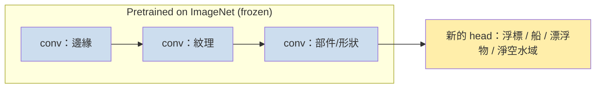

# 17 — 遷移學習、大型語言模型與將模型送上生產環境

> 第 5 部分 · 第 17 課 · 程式技術棧：pytorch (+ concepts)

**先備知識：** [16 — 生成模型](16-generative-models.md) · 同時你也會用到 [13 — 卷積神經網路](13-cnns.md)（本課要微調一個 CNN）與 [15 — 注意力與 Transformer](15-attention-transformers.md)（大型語言模型就是規模放大的 Transformer）。

**學完本課你能：**
- 解釋**遷移學習 (transfer learning)**，並說明為什麼在真實專案裡「微調一個預訓練模型」才是*預設*作法，而不是從零開始訓練。
- 把**嵌入 (embedding)** 當成可重複使用、現成的特徵表示來用。
- 對**大型語言模型 (LLM)** 給出有根據的說明：詞元、預訓練 vs. 微調 vs. 指令微調/RLHF，以及第 15 課的 Transformer 在其中的位置。
- 在 PyTorch 中，於一個自訂的小型資料集上微調一個預訓練的 **torchvision ResNet**，並決定要凍結哪些部分。
- 點出那些讓真實部署翻車的 **MLOps** 現實問題——洩漏、訓練/服務落差、漂移、可重現性——以及如何各別防範。

---

## 1. 直覺理解

到目前為止每一課都是**從零開始**訓練模型：隨機權重，然後在*你的*資料上做梯度下降。那是用來*學會機制*的方式，卻幾乎從來不是你上線部署的方式。

問題在這裡。一個 ResNet-50 有約 2500 萬個參數。要從零學到好的視覺特徵，它大約需要一百萬張帶標籤的影像 (ImageNet) 這個量級。而你手上只有 300 張來自無人水面載具 (USV) 船頭攝影機的照片。用 300 張影像從零訓練，你會災難性地過度擬合 (overfitting)——網路把你那 300 張圖背了起來，遇到第 301 張就崩潰。

**遷移學習**就是出路。已經有人花了一個 GPU-月，用一百萬張影像訓練好一個網路。那個網路*前段*的層學到了通用的視覺基本元素——邊緣、角點、紋理、漸層、斑塊——這些對*任何*影像任務都有用，無論你看的是浮標還是香蕉。只有*最後一層*是 ImageNet 專屬的（「這是一隻黃金獵犬」）。所以你**保留學好的特徵提取器，只替換掉那顆頭 (head)**，再用你的小資料集稍微推它一把。

**類比——雇用一個有經驗的水手 vs. 養一個新生兒。** 從零開始訓練就像把一個嬰兒從出生養到能上船當船員：要花幾十年、需要龐大的資料。遷移學習則是雇用一個已經航行了 20 年的人，再給他做一週關於*你這艘特定船隻*的簡報。他早就懂風、繩索與平衡（通用特徵）；你只需要教他*你的*絞盤在哪裡（新的那顆頭）。所需資料少得多、時間少得多、結果還好得多。



同一個想法驅動了所有現代技術。一個**大型語言模型 (LLM)** 就是一個 Transformer（第 15 課），在網際網路的一大片切片上預訓練來預測下一個詞元。那個預訓練教會了它文法、事實與推理模式。要讓它*變得有用*，你不會重新訓練——你會**微調 (fine-tuning)** 它，或乾脆**提示 (prompting)** 它。預訓練一次、永遠適配：這就是整套現代心法，在視覺與語言上皆然。

本課的另一面：一個在你的筆記本裡訓練得漂漂亮亮的模型，到了生產環境依然可能失敗。後半段講的就是那個現實——**MLOps**——因為在你的領域裡，一個錯誤的預測會去操控一艘真正的船。

---

## 2. 數學原理

### 遷移學習 = 重複使用特徵圖、重新學習那顆頭

把一個深度網路想成一個複合函數：一個**特徵提取器** $\phi_\theta$ 後面接著一個**頭** $h_\psi$。

$$
\hat{y} = h_\psi\big(\phi_\theta(\mathbf{x})\big)
$$

- $\mathbf{x}$ — 輸入（一張影像、一段詞元序列）。
- $\phi_\theta$ — 除最後一層以外的所有層，參數為 $\theta$，把原始輸入映射成一個**特徵向量**（也就是**嵌入**）。
- $h_\psi$ — 最後的分類器/迴歸器，參數為 $\psi$。

預訓練給了你一組好的 $\theta^\star$。遷移學習有兩種風味：

**1. 特徵提取（凍結主幹）。** 令 $\theta = \theta^\star$ 並*不*更新它。只訓練那顆新的頭：

$$
\min_{\psi}\ \frac{1}{N}\sum_{i=1}^N \mathcal{L}\big(h_\psi(\phi_{\theta^\star}(\mathbf{x}_i)),\, y_i\big)
$$

你其實是在固定的深度特徵上跑邏輯迴歸（第 04 課）。便宜、快速、需要的資料最少。凍結為什麼有幫助？把 $\theta$ 固定後，你把可訓練參數從約 2500 萬個砍到只剩幾千個，所以**有效容量 (effective capacity)** 變得極小，要在 300 張影像上過度擬合都很難。這是刻意運用偏差-變異數權衡（第 05 課）。

**2. 微調（解凍部分/全部 $\theta$）。** 兩者都訓練，但從 $\theta^\star$ 出發，並使用**很小的學習率**，這樣你是在輕推預訓練特徵而不是把它砸爛：

$$
\theta \leftarrow \theta - \eta\,\nabla_\theta \mathcal{L},\qquad \eta \approx 10^{-4}\text{–}10^{-5}\ \text{(small!)}
$$

「小 $\eta$」的直覺是：$\theta^\star$ 落在損失地景（第 12 課）裡一個好的盆地中。一個大步會把你踢出盆地，毀掉你正是為此而來的那些特徵——也就是**災難性遺忘 (catastrophic forgetting)**。一個小步則讓你滑到附近一個適配你資料集的極小值。

**經驗法則（把這張表背起來）：**

| 你的資料 | 與預訓練資料相似嗎？ | 這樣做 |
|---|---|---|
| 小 (10²–10³) | 相似 | 凍結主幹，訓練頭 |
| 小 | 不相似 | 凍結前段層，微調後段層 |
| 大 (10⁵+) | 相似 | 整個拿來微調 |
| 大 | 不相似 | 全部微調，也許從零訓練 |

為什麼？前段層（邊緣、紋理）是通用的——保留它們。後段層是任務專屬的——那些才是要去適配的。你的資料越少，就越得多凍結，因為每個*被凍結*的參數，就是一個你不必從稀少標籤裡估計出來的參數。

### 嵌入——承載意義的學習座標

一個**嵌入**就是 $\mathbf{z} = \phi_\theta(\mathbf{x})$：預訓練網路產生的那個特徵向量，是 $\mathbb{R}^d$ 裡的一個點，而在這個空間裡*幾何結構編碼了語意*。相似的輸入會落在彼此附近；網路為了完成它的工作，學會了這樣去安排它們。

具體來說，對於兩個輸入，你用它們嵌入的**餘弦相似度 (cosine similarity)** 來衡量語意相似度：

$$
\text{sim}(\mathbf{z}_a, \mathbf{z}_b) = \frac{\mathbf{z}_a \cdot \mathbf{z}_b}{\lVert \mathbf{z}_a\rVert\,\lVert \mathbf{z}_b\rVert} \in [-1, 1]
$$

這就是為什麼嵌入是可重複使用的通貨：把 $\mathbf{z}$ 預先算好一次，然後就能在它上面做檢索、分群（第 08 課）或一個便宜的線性分類器——不必每次都讓梯度下降穿過那個龐大的主幹。語言裡的字詞/詞元嵌入是同一個想法：一個詞元 ID 映射到一個學習得到的向量，而「king − man + woman ≈ queen」之所以成立，是因為訓練*把*那些向量*擺放*成了那樣的結構。

### Transformer 在哪裡——一條方程式講完 LLM 的訓練

一個 LLM 就是第 15 課的 Transformer，用單一目標訓練：**下一個詞元預測 (next-token prediction)**。文字被切成**詞元**（次詞單元；「sonar」可能是 `son` + `ar`），每個都是一個整數 ID。給定詞元 $t_1,\dots,t_{k-1}$，模型輸出下一個詞元的機率分布，並被訓練去最大化*實際*那個下一詞元的概似：

$$
\mathcal{L}_{\text{LM}} = -\sum_{k} \log p_\theta\big(t_k \mid t_1, \dots, t_{k-1}\big)
$$

就這樣——和第 04 課一樣的**交叉熵 (cross-entropy)**，只不過這次是在一個約 5 萬到 25 萬詞元的詞彙表上，由一疊自注意力區塊預測出來。現代的三階段配方：

1. **預訓練** — 在數兆個原始文字詞元上最小化 $\mathcal{L}_{\text{LM}}$。結果：一個會接續文字、且吸收了廣泛知識的模型，但它只會「自動補完」，並不會遵循指令。
2. **指令／監督式微調 (SFT)** — 繼續在精心整理的（提示 → 好答案）配對上訓練，讓它學會*回答*而不是漫無邊際地接話。
3. **RLHF／偏好微調** — 由人類對候選答案排名；用那些排名擬合出一個獎勵模型；再對 LLM 做最佳化（例如 PPO 或 DPO），讓它產生高獎勵、有幫助、無害的答案。這就是把一個原始的文字預測器變成助理的關鍵。

階段 1→2→3 正是語言規模下的遷移學習：把通用的 $\theta$ 預訓練一次，然後便宜地適配。**提示**是零訓練的版本——你把脈絡與範例*放進輸入裡*，凍結的模型就會即時調整它的行為（脈絡內學習，in-context learning），完全沒有任何權重更新。

---

## 3. 程式碼

我們會從 `torchvision` 取一個預訓練的 **ResNet-18**，在一個小型影像分類任務上微調它。不論你的類別是 {cat, dog} 還是 {buoy, boat, debris, clear-water}，這套模式都一模一樣。我們用一個極小的合成資料集，好讓它能在任何地方跑起來，然後精確指出你會在哪裡接上真實影像。

```python
import torch
import torch.nn as nn
import torch.optim as optim
from torch.utils.data import DataLoader, TensorDataset
import torchvision.models as models

# --- 可重現性：永遠要設種子。（為什麼，第 5 節再談。）---
torch.manual_seed(0)

device = "cuda" if torch.cuda.is_available() else "cpu"

# --- 1. 載入一個在 ImageNet 上預訓練的模型 -------------------------------
# weights=... 會下載學好的 theta*。這就是「遷移」的本體。
weights = models.ResNet18_Weights.IMAGENET1K_V1
model = models.resnet18(weights=weights)

# ImageNet 的頭預測 1000 個類別。我們有 4 個 (buoy/boat/debris/clear)。
NUM_CLASSES = 4

# --- 2. 凍結 (FREEZE) 主幹 -----------------------------------------------
# 對每個既有參數停止梯度 -> 它們不會被更新。
for param in model.parameters():
    param.requires_grad = False

# --- 3. 把頭替換 (REPLACE) 成一個全新、可訓練的層 --------------------
# resnet18 的最後一層是 `model.fc`，一個 Linear(in_features -> 1000)。
# 全新的 Linear 預設 requires_grad=True，所以只有它會被訓練。
in_features = model.fc.in_features          # resnet18 是 512
model.fc = nn.Linear(in_features, NUM_CLASSES)
model = model.to(device)

# 健全性檢查：我們實際上在訓練多少參數？
trainable = sum(p.numel() for p in model.parameters() if p.requires_grad)
total = sum(p.numel() for p in model.parameters())
print(f"Trainable: {trainable:,} / {total:,}")
# -> Trainable: 2,052 / 11,178,564   （我們只訓練了整個網路的 0.018%！）
```

那行 print 就是凍結的整個重點：1100 萬個裡頭只有 **2,052** 個可訓練參數。你*確實*能用幾百張影像擬合 2,052 個數字而不過度擬合。

接著是訓練迴圈——標準的 PyTorch（第 11/12 課），但最佳化器只看得到那顆頭的參數。

```python
# --- 4. 假「資料集」：200 張訓練 + 60 張驗證影像，形狀為 (3,224,224) ------
# 真實版本：用 torchvision.datasets.ImageFolder 搭配下方的 transforms。
def make_fake_split(n):
    X = torch.randn(n, 3, 224, 224)            # 假裝這些是照片
    y = torch.randint(0, NUM_CLASSES, (n,))    # 假裝這些是標籤
    return TensorDataset(X, y)

train_loader = DataLoader(make_fake_split(200), batch_size=32, shuffle=True)
val_loader   = DataLoader(make_fake_split(60),  batch_size=32)

# --- 5. 最佳化器只看 requires_grad=True 的參數 ------------
# 這個過濾器是新手會忘掉的那一行；少了它，你會去更新
# 被凍結的張量（沒有作用）並悄悄浪費算力。
params_to_train = [p for p in model.parameters() if p.requires_grad]
optimizer = optim.Adam(params_to_train, lr=1e-3)   # 頭可以用稍微大一點的 lr
criterion = nn.CrossEntropyLoss()                  # 多類別，來自第 04 課

def run_epoch(loader, train: bool):
    model.train() if train else model.eval()
    total_loss, correct, n = 0.0, 0, 0
    with torch.set_grad_enabled(train):
        for X, y in loader:
            X, y = X.to(device), y.to(device)
            logits = model(X)                  # 前向穿過凍結的本體 + 新的頭
            loss = criterion(logits, y)
            if train:
                optimizer.zero_grad()
                loss.backward()                # 梯度只會流進 model.fc
                optimizer.step()
            total_loss += loss.item() * X.size(0)
            correct += (logits.argmax(1) == y).sum().item()
            n += X.size(0)
    return total_loss / n, correct / n

for epoch in range(3):
    tr_loss, tr_acc = run_epoch(train_loader, train=True)
    va_loss, va_acc = run_epoch(val_loader,   train=False)
    print(f"epoch {epoch}: train_loss={tr_loss:.3f} val_acc={va_acc:.3f}")
# -> epoch 0: train_loss=1.51 val_acc=0.23   （隨機資料 -> 約等於隨機猜，符合預期）
# -> 在真實帶標籤的影像上，你會看到 val_acc 在幾個訓練週期內爬升到 0.85 以上
```

> 在隨機雜訊上，準確率會停留在接近隨機（1/4）——根本沒東西可學。上面的輸出只是用來顯示這個迴圈*跑得起來*。在具有真實結構的真實影像上，凍結 + 一顆新的頭，通常在個位數的訓練週期內就能達到很強的驗證準確率。

### 階段 2：解凍並用一個小學習率微調

頭訓練好之後，你常常能藉由解凍最後一個區塊、並以**小得多**的學習率繼續訓練，再榨出一些準確率：

```python
# 解凍最後一個殘差區塊 (layer4)，並同時保持頭可訓練。
for param in model.layer4.parameters():
    param.requires_grad = True

# 重建最佳化器：現在它包含 layer4 + fc，用一個極小 (TINY) 的 lr。
optimizer = optim.Adam(
    [p for p in model.parameters() if p.requires_grad],
    lr=1e-5,                       # 小 100 倍 -> 輕推，不要砸爛
)
# ...然後再跑幾個訓練週期的 run_epoch(train_loader, train=True)。
# 這裡的小 lr 正是防止災難性遺忘 ImageNet 特徵的關鍵。
```

### 真實資料的那一塊：ImageFolder + *正確的*前處理

遷移學習最常見的單一錯誤，就是餵進來的影像，其前處理方式和預訓練時不同。預訓練權重期待一個特定的縮放 + 正規化。請使用*隨權重一起出貨*的 transforms：

```python
import torchvision.datasets as datasets

# 這個 weights 物件精確知道它的影像當初是怎麼前處理的。
preprocess = weights.transforms()   # resize->centercrop->ToTensor->Normalize(ImageNet mean/std)

# 目錄結構：data/train/buoy/*.jpg, data/train/boat/*.jpg, ...
# ImageFolder 會自動把子資料夾名稱讀成類別標籤。
# train_ds = datasets.ImageFolder("data/train", transform=preprocess)
# val_ds   = datasets.ImageFolder("data/val",   transform=preprocess)
```

### 視覺化嵌入（那個可重複使用的表示）

為了*親眼看到*凍結的主幹確實產生了有意義的特徵，把一個批次嵌入後，用 PCA（第 08 課）投影到 2 維。按類別上色。

```python
import matplotlib.pyplot as plt
from sklearn.decomposition import PCA

# 提取嵌入 = 拿掉最後那顆頭的網路。
backbone = nn.Sequential(*list(model.children())[:-1]).eval().to(device)

X, y = next(iter(val_loader))
with torch.no_grad():
    z = backbone(X.to(device)).flatten(1).cpu().numpy()   # (batch, 512) 嵌入

proj = PCA(n_components=2).fit_transform(z)
plt.scatter(proj[:, 0], proj[:, 1], c=y, cmap="tab10")
plt.title("ResNet-18 embeddings (PCA to 2-D)")
plt.xlabel("PC1"); plt.ylabel("PC2"); plt.colorbar(label="class")
plt.show()
```

**你應該看到：** 在*真實*帶標籤的資料上，同一類別的點會聚成一團——這證明凍結的主幹已經把你的領域映射到一個可分離的空間，這正是為什麼一顆極小的線性頭就夠用。（在隨機假資料上，它們會是一團毫無資訊量的斑點——這又是一個提醒：示範資料沒有結構。）

---

## 4. 實際案例——為 USV 障礙物攝影機微調一個視覺模型

你正在為一艘無人水面載具打造前方障礙物感知。船頭攝影機串流出影格；你想把每個裁切框分類為 **{buoy, boat, debris, clear-water}**，餵給你的路徑規劃器。你出海了三個下午，手動標註了**約 400 張影像**。在 400 張影像上從零訓練一個 CNN 是沒指望的。遷移學習是*唯一*理智的選擇——而且它是你這個領域裡最實用的單一深度學習技術。

**對應關係：**

| 概念 | 你的 USV 專案 |
|---|---|
| 預訓練的 $\phi_{\theta^\star}$ | ResNet-18 的 ImageNet 權重——邊緣、紋理、「圓圓亮亮的東西」偵測器都已經存在 |
| 新的頭 $h_\psi$ | 對應你 4 個類別的 `Linear(512 → 4)` |
| 凍結主幹 | 只在你那 400 張影像上訓練頭（階段 1） |
| 微調 `layer4` | 一旦頭穩定後，再榨出準確率（階段 2） |
| 嵌入 $\mathbf{z}$ | 那個 512 維向量——也可重複用於*檢索*：「找出與這次驚險擦身相似的影格」 |
| 資料擴增 | `RandomHorizontalFlip`、亮度/對比抖動——模擬眩光、時段、尾流；實際上等於把 400 張影像加倍 |

**推演草圖。** 把 400 張切成 280 訓練 / 60 驗證 / 60 測試，並**依類別做分層**，讓每一份切分都含有全部四個類別。階段 1：凍結，訓練頭 10 個訓練週期 → 假設驗證準確率 0.82。階段 2：解凍 `layer4`，lr 設為 `1e-5`，跑 5 個訓練週期 → 驗證準確率 0.89。把測試集鎖起來直到最後一刻；測試準確率只報告一次。重度擴增在這裡很重要，因為水面場景被那種時時刻刻在變的光照與反射所主宰——少了它，你的模型會過度擬合到「你出海那三個下午的光照」。

**為什麼這對你是*那個*技術：** 機器人學的資料集永遠又小又貴（每一個標籤都是一個人盯著影片看出來的）。一支 USV/UAV/ROV 團隊幾乎永遠不會擁有*他們自己*環境的 ImageNet 規模資料。預訓練主幹 + 一顆小頭，就是你能在這週、而不是明年，就拿到一個能用的感知模型的方法。同一套配方也能遷移到一個 UAV 農作普查分類器，或一個 ROV 珊瑚-vs-岩石的頭——換掉 `ImageFolder` 和輸出類別數目就好。

如果你想先練習*一模一樣的*程式碼，有一個經典資料集的對照可用：把同一個 ResNet 在 **CIFAR-10** 或牛津的 **Flowers-102** 資料集（兩者都在 `torchvision.datasets` 裡）上微調，它們都夠小，能快速迭代、驗證你的管線，再把它指向得來不易的海洋影片。

---

## 5. 常見陷阱與技巧

- **資料洩漏是頭號隱形殺手。** 如果驗證/測試的資訊偷溜進訓練，你報告的準確率就是個謊言。經典的陷阱：在切分*之前*就用*整個*資料集去擬合縮放器/正規化器；**先擴增再切分**（同一張影像同時落到訓練與驗證）；來自同一段影片的近似重複影格散落在各個切分裡（要**依片段/場景切分**，不是依影格）。洩漏看起來就像驚人的驗證準確率，到了真實世界卻整個崩盤。
- **推論時前處理錯誤 = 訓練/服務落差 (train/serve skew)。** 模型是在經 ImageNet 正規化的 224×224 裁切框上訓練的。如果你機器人的推論程式碼以不同方式縮放、跳過正規化，或餵的是 BGR 而非 RGB，準確率會悄悄崩掉。在訓練**與**部署的管線中*都*要用 `weights.transforms()`。把它釘死；對它做測試。
- **可重現性：把一切都設種子並記錄下來。** 設定 `torch.manual_seed`、`numpy.random.seed`、Python 的 `random.seed`；要嚴格決定性，還要加上 `torch.use_deterministic_algorithms(True)`。用像 **MLflow** 或 **Weights & Biases** 這樣的工具追蹤每一次執行——程式碼 commit、設定、種子、指標。「上週二它還能跑」不是交付成果；一次有紀錄、可重現的執行才是。
- **部署後要監控漂移。** 你的訓練照片是夏天的日光；到了十一月，模型看到霧與低角度的陽光就退化了——那就是**資料/概念漂移 (data/concept drift)**。模型不會告訴你它錯了。在生產環境記錄輸入統計量與預測信心，在它們偏移時發出警報，並維持一個回饋迴路去蒐集新的、帶標籤的困難案例，再重新微調。
- **要刻意挑選部署路徑。** 選項有：一個機器人去呼叫的 Python 服務 (FastAPI/TorchServe)；透過 **TorchScript / ONNX** 匯出的**裝置端 (on-device)** 推論（用 ONNX Runtime 跑，或在 Jetson 上用 TensorRT），以求低延遲且不依賴網路——在連線時有時無的 USV/UAV 上，這通常正是你要的。推論時永遠要 `model.eval()`（停用 dropout/BatchNorm 的更新）並在 `torch.no_grad()` 之下執行。
- **倫理、偏誤與安全是工程的一部分，不是事後補的。** 一個只在平靜水域日光下訓練的感知模型，在它從未見過的條件下會自信地犯錯——當它在人群附近操控載具時，這很危險。量化不確定性、設定保守的閾值、在低信心判斷時保留一個人類/後備機制在迴路中，並針對你實際會運作的各種條件審查失效模式。「在測試集上高準確率」不等於「可以安全部署」。

---

## 6. 自我檢測

**Q1.** 你有 250 張帶標籤的聲納影像方塊，以及一個在自然照片上預訓練的模型。你應該凍結整個主幹、把全部都微調，還是介於兩者之間？請用經驗法則表來佐證。

<details><summary>解答</summary>
資料量小，而且這個領域（聲納）和自然照片*不相似*。依照那張表：凍結**前段**層（通用的邊緣/紋理仍有幫助），但**微調後段**層，好讓任務專屬的特徵去適配聲納的紋理統計特性。純凍結有低度擬合的風險，因為後段的 ImageNet 特徵是為照片調好的、不是為聲納；全部微調又有把 250 張影像過度擬合的風險。中間路線在偏差與變異數之間取得平衡。
</details>

**Q2.** 為什麼微調的學習率必須比你從零訓練時所用的學習率小得多（例如 `1e-5`）？

<details><summary>解答</summary>
預訓練權重 $\theta^\star$ 已經坐落在一個好的損失盆地裡，編碼著有用的特徵。一個大步會把你帶到離那個盆地很遠的地方，**毀掉**那些特徵（災難性遺忘），白白浪費掉遷移的整個重點。一個極小的步則會把權重輕推到附近一個適配你資料集的極小值，同時保留學到的結構。
</details>

**Q3.** 一位隊友用全域的平均值/標準差正規化了整個影像集，*然後*才切成訓練/驗證。哪裡錯了，它對報告出來的指標會造成什麼影響？

<details><summary>解答</summary>
那是**資料洩漏**：驗證集的統計量影響了套用到訓練的正規化，所以驗證的資訊滲進了管線。（更糟的是，這裡你本來就該用*預訓練權重的*正規化，而不是你自己的全域統計量。）影響：驗證指標被樂觀地偏高——它們看起來比模型在真正未見資料上的表現還要好。修正：先切分，再套用只在訓練資料上擬合的前處理（或者，做遷移學習時，直接用 `weights.transforms()`）。
</details>

**Q4.** 用一兩句話解釋訓練一個 LLM 為什麼是「遷移學習」，並把 LLM 的三個階段對應到本課的凍結/微調概念。

<details><summary>解答</summary>
**預訓練**透過在海量文字上做下一個詞元的交叉熵，把通用參數 $\theta$ 學一次——這是昂貴、可重複使用的特徵學習步驟（就像 $\phi_\theta$ 的 ImageNet 預訓練）。**指令/SFT** 與 **RLHF** 則是把那個預訓練模型便宜地適配到一個目標行為（有幫助地回答）——類比於在你的小任務上替換/微調那顆頭。**提示**是零更新的極端版：純粹透過輸入來調整行為，完全沒有任何權重變動。
</details>

**Q5.** 你的 USV 障礙物分類器達到 94% 測試準確率、上線了，三個月後開始在黃昏時漏掉浮標。程式碼一點都沒改。發生了什麼事，系統本來應該事先備好哪些東西？

<details><summary>解答</summary>
**概念/資料漂移**：運作的分布偏移了（黃昏光照、眩光、霧），離開了模型受訓所用的白天資料，所以準確率悄悄退化——高測試準確率從來就不保證涵蓋未見過的條件。系統本來應該備有**生產環境監控**（追蹤輸入統計量與預測信心，在分布偏移時發出警報）、一個**回饋迴路**來捕捉並重新標註困難案例、定期**重新微調**，以及保守的信心閾值並對低信心影格設有後備機制——因為在這裡，一個錯誤的預測會去操控一艘真正的船。
</details>

---

## 回顧與下一步

- **遷移學習是預設、不是例外：** 重複使用一個預訓練的特徵提取器 $\phi_{\theta^\star}$，只替換/重新訓練那顆頭。資料少時，**凍結**主幹；資料較多或領域較遠時，用一個*小*學習率**微調**後段層，以避免災難性遺忘。
- **嵌入是可重複使用的通貨**——$\mathbf{z} = \phi_\theta(\mathbf{x})$，是某個空間裡的點，在那裡幾何結構（餘弦相似度）編碼了意義。預先算一次，然後就能便宜地分類、分群或檢索。
- **LLM 是第 15 課的 Transformer**，以下一個詞元的交叉熵訓練，再透過 SFT 與 RLHF 適配；**提示**則以零權重更新來調整行為。和視覺一樣是「預訓練一次、永遠適配」的心法。
- **MLOps 是模型存活或陣亡之處：** 要防範**洩漏**（前處理前先切分、依場景而非依影格切分）、**訓練/服務落差**（每個地方都用一模一樣的前處理——用 `weights.transforms()`），以及**漂移**（在生產環境監控輸入與信心）。為了可重現性，把一切都設種子並記錄下來。
- **倫理與安全是工程上的要求。** 量化不確定性、設定保守閾值、在迴路中保留一個後備機制——一個自信的錯誤預測會去操控一輛真正的載具。

這就是監督式與自監督式學習的核心主軸：從單一神經元，到微調巨型模型並安全地把它們送上線。但本課程還會繼續——進入真實載具上的生產級 ML 實際所需的**決策、感知與實務技藝**。

➡️ **下一課：** [18 — 強化學習](18-reinforcement-learning.md)——讓代理人*透過試誤學習控制策略*，這是通往路徑跟隨與定點保持的自然橋樑。

接著繼續看第 7 與第 8 部分：[19 — 物件偵測與分割](19-detection-segmentation.md)（不只是「有沒有浮標」，而是*它確切在哪裡*，這是你的規劃器需要的）、[20 — 資料與特徵工程](20-data-feature-engineering.md)（真實 ML 裡那不光鮮卻佔 80% 的部分），以及 [21 — 超參數最佳化](21-hyperparameter-optimization.md)（有系統地調校而不自欺）。最終則是*在機器人上的部署*——TorchScript/ONNX → Jetson 上的 TensorRT、ROS2 推論節點、延遲預算。或者從**[課程索引](README.md)**跳到任何地方。
