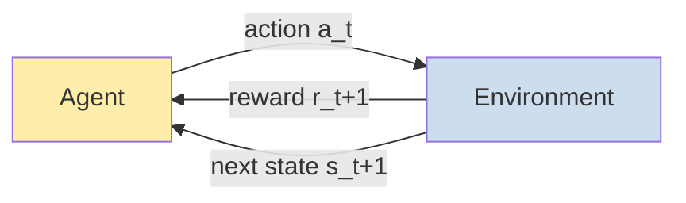

# 18 — 強化學習

> 第 6 部分 · 第 18 課 · 程式技術棧：numpy-from-scratch (tabular) + a brief PyTorch/Gym note

**先備知識：** [03 — 梯度下降](03-gradient-descent.md)（強化學習 (reinforcement learning) 的更新依然是「朝目標微調一點」）· 而深度強化學習的補充說明會用到 [12 — 讓深度網路真正收斂的訓練技巧](12-training-deep-nets.md)（DQN 不過是一個以移動標的訓練的網路）。

**學完本課你能：**
- 把一個控制問題框定為 **馬可夫決策過程 (Markov Decision Process)** —— 狀態 (state)、動作 (action)、獎勵 (reward)、轉移、折扣因子 (discount factor) $\gamma$ —— 並把目標陳述為「最大化期望折扣報酬」。
- 定義 **策略 (policy)**、**價值函數 (value function)** $V(s)$ 與 **動作價值函數 (action-value)** $Q(s,a)$，並把 **貝爾曼方程式 (Bellman equation)** 寫成一個遞迴的一致性條件。
- 解釋 **探索 (exploration)–利用 (exploitation)** 之間的權衡，並實作 **$\epsilon$-貪婪 (epsilon-greedy)**。
- 用 numpy 從頭實作 **表格式 Q 學習 (tabular Q-learning)**，在一個無人水面載具 (USV) 格子世界上訓練它，並讀出學到的貪婪策略。
- 對 **DQN**（回放緩衝區 (replay buffer) + 目標網路 (target network)）與 **REINFORCE**（策略梯度 (policy gradient)）以及 **模擬到現實落差 (sim-to-real gap)** 給出誠實、直覺層次的說明。

---

## 1. 直覺理解

到目前為止的每個模型，都是從一份裝滿正確答案的 **固定資料集** 學習：這裡是圖片，這裡是標籤 (label)，把誤差最小化。**強化學習 (reinforcement learning, RL)** 把這套整個丟掉。沒有標準答案本。有的是一個 **代理人 (agent)**，它在 **環境 (environment)** 中採取 **動作 (action)**，環境回傳一個 **獎勵 (reward)**（單一純量 —— 好或壞）以及一個新的處境，而代理人必須 *透過試誤* 摸索出哪些動作能在一段時間內帶來最多獎勵。

這正是載具控制的形狀。你的無人水面載具 (USV) 處於某個航向 (heading) 與位置；它可以動舵 (rudder)、加減推力 (thrust)；世界以一個新的姿態回應；「獎勵」就是 *維持在路徑上*。沒有人遞給你標好的動作「此刻的最佳舵角」—— 你得從後果中自己發現它。

有兩點讓強化學習真正比監督式學習 (supervised learning) 更難：

- **延遲獎勵 / 信用分配 (credit assignment)。** 現在一個糟糕的舵令，可能要等到五秒後才把你帶離路徑。最近 50 個動作中,哪一個該負責?強化學習必須把信用沿時間軸往回傳播。
- **你的資料取決於你的行為。** 分類器看到的是一份凍結的資料集。一個永遠左轉的代理人，永遠 *看不到* 右邊有什麼。你必須刻意去 **探索 (exploration)** 以發現好動作，同時也 **利用 (exploitation)** 你已經知道有效的做法。這股張力在監督式學習裡完全沒有對應物。

**類比 —— 沒有教練的情況下學習靠岸。** 沒人告訴你正確的油門。你試一個操作，結果要嘛輕吻碼頭（獎勵），要嘛刮到船殼（懲罰），經過許多次嘗試，你建立起一種內在的感覺：「從 *這個* 進場角度與速度，*那個* 油門通常會有好結局。」強化學習把這個迴圈形式化：行動、觀察獎勵與下一個狀態、更新你對事物好壞的估計、重複。



整個領域都建立在這一個迴圈上。底下所有內容，都是在講如何讓這個迴圈 *收斂* 到好的行為。

---

## 2. 數學原理

### 2.1 馬可夫決策過程 (MDP)

馬可夫決策過程是「代理人在世界中行動」的形式化容器。它是一個元組 $(\mathcal{S}, \mathcal{A}, P, R, \gamma)$：

- $\mathcal{S}$ —— **狀態 (state)** $s$ 的集合。代理人所處的處境（無人水面載具的姿態、各種誤差）。
- $\mathcal{A}$ —— **動作 (action)** $a$ 的集合。代理人能做的事（左舵/右舵、推力）。
- $P(s' \mid s, a)$ —— **轉移動態 (transition dynamics)**：在 $s$ 採取 $a$ 之後落到下一個狀態 $s'$ 的機率。這是 *世界* 的回應，通常對代理人而言是未知的。
- $R(s, a)$ —— **獎勵 (reward)**：那一步得到的純量回饋（我們把收到的獎勵寫成 $r$）。
- $\gamma \in [0,1)$ —— **折扣因子 (discount factor)**。

定義性的假設是 **馬可夫性質 (Markov property)**：下一個狀態 *只* 取決於目前的狀態與動作，而非整段歷史。$s$ 必須概括所有相關資訊 —— 這正是為什麼在機器人領域裡狀態設計如此重要。

### 2.2 報酬、折扣，以及目標

代理人最大化的不是 *下一步* 的獎勵；它最大化 **報酬 (return)** —— 從現在起的總獎勵。因為較晚到來的獎勵價值較低（有不確定性，而且「現在能靠岸勝過一小時後才靠岸」），我們以幾何方式對它 **折扣**：

$$
G_t = r_{t+1} + \gamma\, r_{t+2} + \gamma^2 r_{t+3} + \cdots = \sum_{k=0}^{\infty} \gamma^k\, r_{t+k+1}
$$

- $G_t$ —— 從時間 $t$ 起的 **折扣報酬 (discounted return)**。
- $\gamma$ 接近 $0$ → 短視（只有下一步獎勵重要）；$\gamma$ 接近 $1$ → 有遠見。$\gamma=0.99$ 是典型值。*幾何形式從何而來：* 它是唯一一種能在獎勵有界時讓無窮和保持有限、並讓問題變得 **遞迴** 的權重設定 —— $G_t = r_{t+1} + \gamma G_{t+1}$ —— 這也是 2.4 節一切的種子。

**目標**：找到能最大化 *期望* 報酬 $\mathbb{E}[G_t]$ 的行為（之所以取期望值，是因為策略與世界兩者都可能是隨機的）。

### 2.3 策略與價值函數

**策略 (policy)** $\pi$ 就是代理人的行為 —— 它挑選動作的方法。

- **確定性**：$a = \pi(s)$。每個狀態對應一個動作。（最終的控制律。）
- **隨機性**：$\pi(a \mid s)$ = 在狀態 $s$ 採取動作 $a$ 的機率。探索與策略梯度方法都需要它。

要比較策略，我們需要在某個策略下為狀態與動作評分。兩個 **價值函數 (value function)**：

$$
V^\pi(s) = \mathbb{E}_\pi\big[\, G_t \mid s_t = s \,\big]
\qquad\qquad
Q^\pi(s,a) = \mathbb{E}_\pi\big[\, G_t \mid s_t = s,\ a_t = a \,\big]
$$

- $V^\pi(s)$ —— **狀態價值 (state-value)**：若你從 $s$ 出發並永遠遵循 $\pi$，期望得到的報酬。「處於這裡有多好？」
- $Q^\pi(s,a)$ —— **動作價值 (action-value)**（即 **Q 函數 (Q-function)**）：若你從 $s$ 出發，*現在* 採取動作 $a$，之後再遵循 $\pi$，期望得到的報酬。「從這裡採取這個動作有多好？」

對控制而言 $Q$ 更有用：如果你知道 $Q$，你只要挑 $Q$ 最大的動作就能行動 —— 不需要任何世界模型。這就是 Q 學習 (Q-learning) 背後的全部想法。

### 2.4 貝爾曼方程式 —— 遞迴就是一切

把 $G_t = r_{t+1} + \gamma G_{t+1}$ 代入 $Q^\pi$ 的定義，你就得到 **貝爾曼方程式 (Bellman equation)**，一個把某個價值與一步之後的價值連起來的 *一致性條件*：

$$
Q^\pi(s,a) = \mathbb{E}\big[\, r + \gamma\, Q^\pi(s', a') \,\big]
\quad\text{with } a' \sim \pi(\cdot \mid s')
$$

「此時此地」的價值，等於「我得到的獎勵 + 我落腳之處的折扣價值」。它就是期望意義下的 $G_t = r_{t+1} + \gamma G_{t+1}$ —— 把報酬的遞迴變成一個關於 $Q$ 的不動點方程式。

強化學習的重點是 **最佳 (optimal)** 策略 $\pi^\star$ 及其 **最佳動作價值** $Q^\star(s,a) = \max_\pi Q^\pi(s,a)$。最佳的那個滿足 **貝爾曼最佳性方程式 (Bellman optimality equation)** —— 關鍵差異在於，一個最佳代理人會假設它在下一個狀態會 *貪婪地* 行動，所以對 $a'$ 取的期望就變成了 $\max$：

$$
Q^\star(s,a) = \mathbb{E}\Big[\, r + \gamma \max_{a'} Q^\star(s', a') \,\Big]
$$

一旦你有了 $Q^\star$，最佳策略就理所當然地是 **貪婪 (greedy)** 的：$\pi^\star(s) = \arg\max_a Q^\star(s,a)$。整場賽局就是 *估計* $Q^\star$。

### 2.5 探索 vs. 利用，以及 $\epsilon$-貪婪

如果代理人永遠採取它當下 *認為* 最好的動作（純 **利用 (exploitation)**），它可能會鎖死在一個平庸的習慣上，永遠發現不了更好的 —— 它永遠蒐集不到能修正自己的資料。如果它永遠隨機行動（純 **探索 (exploration)**），它了解了世界卻從不兌現所學。兩者你都需要。

最簡單的平衡是 **$\epsilon$-貪婪 (epsilon-greedy)**：以機率 $\epsilon$ 挑一個隨機動作，否則挑貪婪的那一個。

$$
a =
\begin{cases}
\text{random action from } \mathcal{A} & \text{with prob. } \epsilon \\[2pt]
\arg\max_{a'} Q(s, a') & \text{with prob. } 1-\epsilon
\end{cases}
$$

標準做法：在訓練過程中 **讓 $\epsilon$ 衰減** —— 早期大量探索（你什麼都不知道），後期多多利用（你的 $Q$ 已可信賴）。

### 2.6 Q 學習：時間差分更新

我們無法精確計算貝爾曼期望 —— 我們不知道 $P$。**Q 學習 (Q-learning)** 從原始的經驗元組 $(s, a, r, s_{\text{next}})$ 估計 $Q^\star$，把每次轉移當成貝爾曼方程式的一個帶雜訊的樣本。在狀態 $s$ 採取動作 $a$、觀察到獎勵 $r$ 與下一個狀態 $s_{\text{next}}$ 之後：

$$
Q(s,a) \;\leftarrow\; Q(s,a) \;+\; \alpha\,\Big[\, r + \gamma \max_{a_{\text{next}}} Q(s_{\text{next}}, a_{\text{next}}) \;-\; Q(s,a) \,\Big]
$$

- $\alpha \in (0,1]$ —— **學習率 (learning rate)**（步長；第 03 課）。
- 括號裡是 **時間差分 (temporal-difference, TD) 誤差**：它是我們目前的估計 $Q(s,a)$ 與一個更新鮮的 **標的 (target)** $r + \gamma \max_{a_{\text{next}}} Q(s_{\text{next}}, a_{\text{next}})$ 之間的落差，這個標的由實際獎勵加上我們對未來的最佳猜測構成。*它從何而來：* 這就是「把估計朝貝爾曼最佳性方程式的右手邊移動 $\alpha$ 的比例」—— 一種帶有梯度下降風味、朝著 2.4 節遞迴自助 (bootstrapping) 的做法。

你會聽到兩個形容詞：
- **時間差分 (temporal-difference)**：它從連續價值估計之間的 *差* 來學習，每一步都更新 —— 不必等到整個回合結束。
- **離策略 (off-policy)**：標的使用 $\max_{a_{\text{next}}}$（*最佳* 代理人會做的事），與代理人實際上接下來做了什麼無關（那可能是一個隨機的 $\epsilon$-貪婪動作）。因此即使它在行為上是探索性的，它學到的仍是最佳的 $Q^\star$。正是這種解耦，讓 DQN 裡的回放緩衝區得以合法成立。

---

## 3. 程式碼

我們會打造一個迷你 **格子世界 (gridworld)**：一個無人水面載具在格子上，必須抵達 **碼頭 (dock)**，同時避開 **危險 (hazard)** 格（礁石/淺灘）。然後我們用 numpy 從頭訓練表格式 Q 學習，看著每回合獎勵爬升，並把學到的貪婪策略以箭頭呈現。純 numpy —— 不用任何框架。

### 3.1 環境

```python
import numpy as np
import matplotlib.pyplot as plt

rng = np.random.default_rng(0)

# --- USV 格子世界 ----------------------------------------------------------
# 一個 5x5 的格子。USV 從左上角出發，必須抵達碼頭（右下角），
# 並避開危險格。狀態 = 攤平後的格子索引 0..24。共 4 種動作。
GRID = 5
N_STATES = GRID * GRID
ACTIONS = ['up', 'down', 'left', 'right']      # 0,1,2,3
N_ACTIONS = len(ACTIONS)

START = (0, 0)
DOCK = (4, 4)                                  # 目標
HAZARDS = {(1, 1), (2, 3), (3, 1)}             # 礁石/淺灘

def to_state(rc):                              # (row, col) -> 攤平索引
    return rc[0] * GRID + rc[1]

def step(rc, a):
    """在格子 rc 套用動作 a。回傳 (next_rc, reward, done)。"""
    r, c = rc
    if a == 0:   r -= 1     # 上
    elif a == 1: r += 1     # 下
    elif a == 2: c -= 1     # 左
    elif a == 3: c += 1     # 右
    # 牆壁：撞到邊界就留在原地（不會傳送到格子外）。
    r = min(max(r, 0), GRID - 1)
    c = min(max(c, 0), GRID - 1)
    nxt = (r, c)

    # 獎勵設計：這是整個檔案裡最重要的一行。
    if nxt == DOCK:
        return nxt, 10.0, True                 # 靠岸有大筆回報
    if nxt in HAZARDS:
        return nxt, -10.0, True                # 回合以糟糕結局收場
    return nxt, -0.1, False                    # 小小的每步成本 -> 偏好「短」路徑
```

每步的 `-0.1` 是 **獎勵塑形 (reward shaping)**：沒有它，代理人對路徑長度無所謂（每個非終止步都是 0），於是到處亂晃。這個小小的負值讓「步數更少」嚴格更好，因此最佳策略就是通往碼頭的 *最短安全路徑*。

### 3.2 從頭實作表格式 Q 學習

```python
# Q 表：列 = 狀態，欄 = 動作。初始略帶樂觀地全部設為零。
Q = np.zeros((N_STATES, N_ACTIONS))

alpha = 0.5        # 學習率
gamma = 0.95       # 折扣：在意未來，但讓報酬有限
epsilon = 1.0      # 一開始完全探索...
eps_min, eps_decay = 0.05, 0.995  # ...衰減到以貪婪為主
n_episodes = 600
max_steps = 100    # 安全上限，讓糟糕的策略不會永遠迴圈

def choose_action(s, eps):
    """epsilon-貪婪的動作選擇（2.5 節）。"""
    if rng.random() < eps:
        return rng.integers(N_ACTIONS)         # 探索：隨機動作
    return int(np.argmax(Q[s]))                # 利用：已知最佳動作

rewards_per_episode = []

for ep in range(n_episodes):
    rc = START
    s = to_state(rc)
    total_r = 0.0

    for t in range(max_steps):
        a = choose_action(s, epsilon)
        nxt_rc, r, done = step(rc, a)
        s_next = to_state(nxt_rc)

        # --- 這就是 Q 學習更新（2.6 節）---------------------------
        # target = r + gamma * 對下一步所有動作取 Q(s_next, .) 的最大值
        # 在終止轉移上沒有未來，所以捨棄自助項。
        best_next = 0.0 if done else np.max(Q[s_next])
        td_target = r + gamma * best_next
        td_error = td_target - Q[s, a]
        Q[s, a] += alpha * td_error            # 把估計朝標的微調
        # -------------------------------------------------------------------

        s, rc = s_next, nxt_rc
        total_r += r
        if done:
            break

    epsilon = max(eps_min, epsilon * eps_decay)  # 對探索退火
    rewards_per_episode.append(total_r)

print(f"last-50 mean reward: {np.mean(rewards_per_episode[-50:]):.2f}")
# -> last-50 mean reward: 7.68 （正值：大多在靠岸；殘餘的落差，是還在發作的
#    那 5% epsilon，偶爾打出隨機動作走進危險格）
```

早期的回合滿是隨機亂闖進危險格的行為（報酬約 $-10$）。隨著 $\epsilon$ 衰減、$Q$ 變得銳利，代理人可靠地靠岸，報酬爬升到一個明顯為正的平台 —— 接近 $+10$ 的靠岸獎勵，減去沿最短安全路線上的少數幾個 $-0.1$ 步成本，僅被殘餘的 $\epsilon=0.05$ 探索偶爾走進危險格而拉低。

### 3.3 看它學習，並讀出策略

```python
# --- 圖 1：每回合獎勵（平滑後）----------------------------------------------
fig, (ax1, ax2) = plt.subplots(1, 2, figsize=(12, 4.5))

rew = np.array(rewards_per_episode)
window = 20
smooth = np.convolve(rew, np.ones(window) / window, mode='valid')
ax1.plot(rew, alpha=0.25, label='raw')
ax1.plot(np.arange(window - 1, len(rew)), smooth, lw=2, label=f'{window}-ep avg')
ax1.set_xlabel('episode'); ax1.set_ylabel('total reward')
ax1.set_title('Learning curve'); ax1.legend()

# --- 圖 2：學到的貪婪策略，以箭頭格呈現 ---------------------
ARROW = {0: '↑', 1: '↓', 2: '←', 3: '→'}
ax2.set_xlim(-0.5, GRID - 0.5); ax2.set_ylim(-0.5, GRID - 0.5)
ax2.set_xticks(range(GRID)); ax2.set_yticks(range(GRID))
ax2.invert_yaxis(); ax2.grid(True)
ax2.set_title('Greedy policy  argmax_a Q(s,a)')

for r in range(GRID):
    for c in range(GRID):
        if (r, c) == DOCK:
            ax2.text(c, r, 'DOCK', ha='center', va='center', color='green', fontweight='bold')
        elif (r, c) in HAZARDS:
            ax2.text(c, r, 'XX', ha='center', va='center', color='red', fontweight='bold')
        else:
            best_a = int(np.argmax(Q[to_state((r, c))]))
            ax2.text(c, r, ARROW[best_a], ha='center', va='center', fontsize=20)

plt.tight_layout(); plt.show()
```

**你應該看到：** **左**圖從深深的負值（隨機撞進危險格）開始上升，並在策略穩固後在每回合回報附近飽和 —— 這就是教科書般的強化學習學習曲線。**右**圖顯示的箭頭從起點 *流向* `DOCK`，並 **繞開** `XX` 危險格。那片箭頭場 *就是* 學到的控制器：在任何一格，跟著箭頭走就對了。

### 3.4 選讀：用 Gymnasium + PyTorch DQN 擴大規模

表格式 Q 學習需要一個有限、不太大的狀態集 —— 每個狀態對應 Q 表的一列。一個真實無人水面載具的狀態（連續的航跡橫向誤差、航向、速度）有 *無窮多個* 狀態；沒有任何表格裝得下。解法（見下方第 4 節）：把表格換成一個能在鄰近狀態間 *泛化 (generalize)* 的 **神經網路 (neural network)** $Q_\theta(s,a)$。以下用 **Gymnasium**（標準的強化學習環境 API）與 PyTorch 勾勒一下 —— **選讀、僅作示意，並非完整的 DQN**：

```python
# 選讀 —— 需要 `pip install gymnasium`。展示形狀，而非一個完成品代理人。
import gymnasium as gym
import torch, torch.nn as nn

env = gym.make("CartPole-v1")          # 4 維連續狀態，2 種動作
obs, _ = env.reset(seed=0)

# Q 網路：狀態向量 -> 每個動作一個 Q 值（取代 Q 表）。
qnet = nn.Sequential(
    nn.Linear(env.observation_space.shape[0], 128), nn.ReLU(),
    nn.Linear(128, env.action_space.n),            # 輸出所有動作的 Q(s, .)
)

# 從網路取得貪婪動作（真實迴圈裡會用 epsilon-貪婪，如 3.2 節）：
state = torch.tensor(obs, dtype=torch.float32)
action = int(qnet(state).argmax())     # argmax_a Q_theta(s, a)
obs, reward, terminated, truncated, _ = env.step(action)
env.close()
# 完整的 DQN 還會加上：一個存放 (s,a,r,s_next) 元組、並以小批次取樣的回放緩衝區，
# 一個緩慢更新、用來計算 max 項的「目標網路」，以及對 TD 誤差的 MSE 損失，
# 並以梯度下降訓練（第 12 課）。就這樣 —— 跟 3.2 節同一個更新，只是改用學習的方式。
```

訓練迴圈 *跟 3.2 節的 Q 學習更新一模一樣*，只是表格的指派變成了一個 **梯度下降步**，最小化 TD 誤差的平方，再加上接下來會講到的兩個穩定器。

---

## 4. 實際案例

### 把無人水面載具的路徑跟隨當成 MDP

別管那個玩具格子了；這裡是你的規劃器會用到的真實框架。一個無人水面載具必須跟隨一條規劃好的航跡（航點 (waypoint) 之間的連線）。把它鑄成一個 MDP：

| MDP 元素 | 無人水面載具路徑跟隨 |
|---|---|
| **狀態** $s$ | $(e_{\text{cross}},\ e_{\psi},\ \dot{e}_{\text{cross}})$ —— **航跡橫向誤差 (cross-track error)**（偏離路徑的帶號側向距離）、**航向誤差**（船首航向與路徑切線之間的夾角），以及它們的變化率。連續 → 需要函數近似（DQN/策略梯度），而非表格。 |
| **動作** $a$ | 舵角與推力 —— 為 DQN 離散化成若干區間（例如舵 $\{-15^\circ, 0^\circ, +15^\circ\}$），或為策略梯度/actor-critic 方法保持連續。 |
| **獎勵** $r$ | $r = -\,(e_{\text{cross}}^2 + \lambda\, e_{\psi}^2) - \mu\,(\Delta\,\text{rudder})^2$ —— 懲罰偏離路徑與偏離航向，再加上對抽動式控制的小懲罰，讓船不會猛打舵來回振盪。 |
| **轉移** $P$ | 船的流體動力學 —— 解析上未知，這 *正是* 為什麼免模型 (model-free) 強化學習（Q 學習 / 策略梯度）很吸引人：它不靠手推的動力學模型也能學會控制。 |
| **折扣** $\gamma$ | $\approx 0.99$ —— 現在做一次航向修正，會在接下來幾秒內見效，所以我們要往前看。 |

如果「路徑」塌縮成單一設定點（頂著洋流/風保持位置），這就是 **定點保持 (station-keeping)**；如果它是一條航跡，那就是 **路徑跟隨 (path following)**。學到的策略就是你的控制器 —— 是手調 PID 或模型預測控制器的學習版替代品或補充。

**獎勵塑形是專案存亡的關鍵所在。** 上面的二次懲罰是主力（它呼應 LQR 成本）。要留意兩種失敗模式：一種是 **獎勵濫用 (reward hacking)** 策略，它找到某種退化的方式來刷分（例如，如果「偏離路徑」是唯一的懲罰、又沒有任何進度項，它就乾脆停在原地不動 —— 此時要加上一個前進進度獎勵）；另一種是 **稀疏獎勵 (sparse reward)**（只在抵達最後一個航點時給獎勵），它讓信用分配幾乎不可能 —— 要用密集的每步訊號（例如上面的負偏差）來塑形它。

### 模擬到現實落差

強化學習 **非常吃資料**：一個 DQN 可能需要數百萬次轉移。你不可能讓一艘真的無人水面載具（或無人飛行載具 (UAV)、遙控潛水器 (ROV)）撞上一萬次來蒐集它們。所以通用的配方是 **先在模擬中訓練** —— 一個載具的物理模擬（例如 Gazebo/ROS2，或自訂的流體動力學模型）—— 然後把策略遷移到硬體上。

陷阱在於 **模擬到現實落差 (sim-to-real gap)**：模擬永遠不會剛好等於真實載具（未建模的洋流、感測器雜訊、致動器延遲、酬載變化），所以一個在模擬中完美的策略，到了海上可能失靈。標準的緩解手段：
- **領域隨機化 (domain randomization)** —— 在訓練 *期間* 隨機化質量、阻力、洋流、感測器雜訊、延遲，讓策略學會對 *一整個範圍* 的動態穩健,而不是過度擬合單一模擬。
- **系統辨識 (system identification)** —— 量測真實載具的響應，在訓練前把模擬調到與之相符。
- **保守部署 (conservative deployment)** —— 保留一個安全包絡與一個後援控制器；一個在人群附近操舵真船的強化學習策略，需要我們在第 17 課強調過的那種、能感知不確定性的防護欄。

對 **遙控潛水器 (ROV)**，在模擬裡加上浮力/纜線阻力；對 **無人飛行載具 (UAV)**，加上陣風與電池電壓下垂。同樣的落差，不同的物理。一個適合 *先練演算法* 的經典定錨：Gymnasium 裡的 **CartPole-v1** 與 **LunarLander-v3** —— 小到幾分鐘就能訓練，而 LunarLander 根本就是一個推力控制任務，與載具控制押韻。

---

## 5. 常見陷阱與技巧

- **馬可夫性質由狀態設計承載。** Q 學習假設狀態概括了所有相關資訊。如果你餵進航跡橫向誤差卻略去它的變化率，代理人就分不清「正在快速漂離」與「正在緩慢漂離」—— 這實際上是非馬可夫的，學習會停滯。要把速度/導數納入，或堆疊最近幾幀。
- **獎勵塑形才是真正的設計面。** 稀疏獎勵（只在目標處給）讓信用分配變得殘酷;要用密集的每步訊號來塑形。但要當心 **獎勵濫用 (reward hacking)** —— 代理人會利用你 *確切寫下的* 那套，而非你心裡想的那套。如果「維持在路徑上」是唯一的項，最佳解可能是「永不移動」。永遠要加上一個進度/目標項，並反覆檢查這個獎勵實際誘導出的策略。
- **讓 $\epsilon$ 衰減；別把它釘死。** 早期探索太少 → 代理人在見到替代方案之前就鎖死在一個壞習慣上。後期探索太多 → 它不斷用隨機動作丟掉已知有效的行為。要由高到低退火。在帶雜訊的問題裡，$\alpha$ 也是同理。
- **深度強化學習預設就不穩定。** 一個天真的神經 Q 學習器常常發散，因為標的 $r + \gamma \max Q_\theta(s_{\text{next}}, \cdot)$ *會隨著你訓練而移動*（你在追自己的尾巴），而且連續的轉移高度相關。**DQN 的兩個修正：** 一個 **回放緩衝區 (replay buffer)**（存下轉移、隨機取樣小批次 → 打破相關性、重複利用資料），以及一個 **目標網路 (target network)**（一份週期性凍結的副本 $Q_{\theta^-}$，用來計算 max 項 → 一個穩定的標的）。記住這兩個名字。
- **強化學習很吃資料 —— 為它編列預算,並在模擬中訓練。** 數百萬步是常態。別指望在硬體上從零學出一個控制策略。先模擬、隨機化動態，再小心地遷移與微調。
- **基於價值 vs. 基於策略 —— 按問題挑選。** Q 學習/DQN 在 **離散** 動作上表現出色。至於 **連續** 控制（一個真實的舵角），就改用 **策略梯度 (policy gradient)**（REINFORCE → actor-critic → PPO/SAC），它們直接最佳化一個參數化的策略 $\pi_\theta(a\mid s)$。REINFORCE 的想法一句話講完：把策略往「*帶來高報酬* 的動作」推得更可能 —— $\nabla_\theta J = \mathbb{E}\big[\,G_t\,\nabla_\theta \log \pi_\theta(a_t\mid s_t)\,\big]$（即 **得分函數 (score function)** / 對數策略乘上報酬）。高報酬 → 把那個對數機率往上推；這是對期望報酬做梯度 *上升*。

---

## 6. 自我檢測

**Q1.** 為什麼 Q 學習的標的裡要用 $\max_{a_{\text{next}}} Q(s_{\text{next}}, a_{\text{next}})$，即使代理人 *接下來* 的動作其實是一個隨機的探索動作？這賦予了 Q 學習一個叫什麼的性質？

<details><summary>解答</summary>
標的是依據貝爾曼 *最佳性* 方程式構建的，該方程式假設從下一個狀態起都是最佳（貪婪）行為 —— 因此對下一步動作取 $\max$，*與代理人實際接下來做了什麼無關*。這讓 Q 學習成為 **離策略 (off-policy)** 的：它在以探索性（$\epsilon$-貪婪）策略行動的同時，學習最佳的動作價值 $Q^\star$。行為策略與所學標的策略之間的這種解耦，正是讓 DQN 之後得以回放舊轉移的關鍵。
</details>

**Q2.** 在格子世界裡，如果你把每步獎勵設成 $0$ 而非 $-0.1$（保持 $+10$ 靠岸、$-10$ 危險），會有什麼改變？如果你把 $\gamma = 0$ 呢？

<details><summary>解答</summary>
若每步成本為 $0$，代理人會變得 **對路徑長度無所謂** —— 任何最終能靠岸的安全路線都同等最佳，因此它可能學出冗長、亂晃的路徑（有折扣的話它仍偏好較短的路徑，但壓力很弱）。$-0.1$ 讓 *最短* 的安全路徑嚴格最佳。當 $\gamma = 0$ 時代理人完全 **短視**：它只看重立即獎勵,因此學不會朝一個離得很多步遠的碼頭導航 —— $+10$ 永遠傳播不回來,學習就崩潰了。
</details>

**Q3.** 你的無人水面載具的連續狀態是 `(cross_track_error, heading_error)` ∈ ℝ²。為什麼你不能直接用第 3 節的表格式 Q 學習？標準的解法是什麼？

<details><summary>解答</summary>
一個 Q *表* 需要每個離散狀態一列；連續狀態空間有無窮多個狀態，所以沒有有限的表格，而且（即使你細細離散化）你也永遠無法把每一格都拜訪到足夠多次來學會它 —— 在鄰近狀態間 **沒有泛化**。解法是 **函數近似 (function approximation)**：把表格換成一個參數化的 $Q_\theta(s,a)$ —— 一個神經網路（**DQN**）—— 它能泛化，所以在某個誤差值附近的一次更新，會改善相似誤差值處的估計。至於連續 *動作*，則改用 **策略梯度 (policy gradient)** 方法。
</details>

**Q4.** 說出 DQN 的兩個穩定化技巧，以及每一個分別修正的具體不穩定性。

<details><summary>解答</summary>
(1) **回放緩衝區 (replay buffer)**：存下過去的 $(s,a,r,s_{\text{next}})$ 轉移，並在隨機小批次上訓練。修正連續樣本之間的 **相關性**（並重複利用資料，提升樣本效率）。(2) **目標網路 (target network)**：一份週期性凍結的副本 $Q_{\theta^-}$，用來計算標的中的 $\max$ 項。修正 **移動標的 / 非平穩性** 問題 —— 沒有它，你就是在朝一個每做一次梯度步就移動的標的迴歸，這會導致發散。
</details>

**Q5.** 一位隊友在模擬中訓練了一個路徑跟隨策略；它在模擬裡完美貼線，但到了海上卻偏離。說出這個現象的名稱，以及兩個具體的緩解手段。

<details><summary>解答</summary>
這是 **模擬到現實落差 (sim-to-real gap)**：模擬器的動態（阻力、洋流、感測器雜訊、致動器延遲）與真實載具不符，所以一個過度擬合模擬的策略到了現實就失靈。緩解手段：**領域隨機化 (domain randomization)**（訓練期間隨機化質量/阻力/洋流/雜訊/延遲，讓策略對一整個範圍的動態穩健）、**系統辨識 (system identification)**（量測真船並在訓練前把模擬調到相符），以及搭配後援控制器與安全包絡的保守部署。
</details>

---

## 回顧與下一步

- **強化學習透過試誤學會行動。** 把控制框定為一個 **MDP** $(\mathcal{S},\mathcal{A},P,R,\gamma)$；目標是最大化期望的 **折扣報酬** $G_t = \sum_k \gamma^k r_{t+k+1}$ —— 沒有標好的答案本，只有獎勵。
- **價值函數為行為評分。** $V^\pi(s)$ 與 $Q^\pi(s,a)$ 服從 **貝爾曼方程式**（現在的價值 = 獎勵 + 下一步的折扣價值）。最佳的 $Q^\star$ 對下一步動作取 $\max$，而對 $Q^\star$ 貪婪地行動就是最佳的。
- **表格式 Q 學習** 更新 $Q(s,a) \leftarrow Q(s,a) + \alpha\,[\,r + \gamma \max_{a_{\text{next}}} Q(s_{\text{next}}, a_{\text{next}}) - Q(s,a)\,]$ —— 一個離策略的 TD 步。用衰減的 **$\epsilon$-貪婪** 來平衡 **探索 vs. 利用**。
- **用函數近似擴大規模：** **DQN** = 神經 $Q_\theta$ + **回放緩衝區** + **目標網路**；**REINFORCE/策略梯度** 透過得分函數 $G_t\,\nabla_\theta\log\pi_\theta(a\mid s)$ 直接最佳化 $\pi_\theta$ —— 這是連續控制的對的工具。
- **對載具而言：** 狀態 = 航跡橫向誤差 + 航向誤差,獎勵 = 負的路徑偏差,因為強化學習很吃資料所以 **先在模擬中** 訓練,並為 **模擬到現實落差** 編列預算（領域隨機化、系統辨識、保守部署）。

**下一步該去哪：** 在代理人能對世界 *採取行動* 之前,它通常得先精準地 *看見* 它 —— 不只是「那裡有沒有浮標」,而是「它確切在哪」。那就是你的規劃器、以及任何以視覺為基礎的強化學習策略所仰賴的感知層：**[19 — 物件偵測與分割](19-detection-segmentation.md)**。
