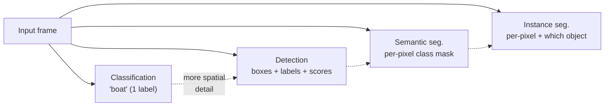
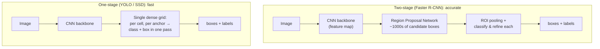

# 19 — 物件偵測與分割

> 第 7 部分 · 第 19 課 · 程式技術棧：pytorch (torchvision pretrained models)

**先備知識：** [13 — 卷積神經網路](13-cnns.md)（你必須熟悉卷積堆疊、特徵圖 (feature map)、以及形狀運算）。有幫助的背景：[12 — 訓練深度網路](12-training-deep-nets.md)（損失頭、訓練穩定性）以及 [17 — 遷移學習、LLM 與 MLOps](17-transfer-learning-llms-mlops.md)（使用預訓練骨幹網路）。

**學完本課你能：**
- 解釋從**分類**（「影像裡有什麼」）躍進到**偵測**（「是什麼*以及在哪裡*，以邊界框表示」）與**分割**（「哪些像素」）。
- 定義 **IoU**、**錨框 (anchor box)**、**NMS** 與 **mAP**，並說明*為什麼*路徑規劃器各需要它們。
- 對比**兩階段** (Faster R-CNN) 與**單階段** (YOLO/SSD) 偵測器，並推理速度／準確率的權衡。
- 在真實影像上執行一個**預訓練的 torchvision 偵測器**，依分數過濾、套用 **NMS**、並繪製邊界框。
- 追蹤**編碼器–解碼器 / U-Net** 的形狀，包含**轉置卷積 (transposed convolution)** 與**跳躍連接 (skip connection)**，走過一次小型前向傳播。

---

## 1. 直覺理解

你在第 13 課做的 CNN 分類器回答一個問題：*「這張影像是什麼？」* → `"boat"`。這對路徑規劃器幾乎毫無用處。規劃器不在乎畫面裡某處*存在*一艘船；它需要知道船**在哪裡**、**多大**、以及**離船首多遠**——這樣才能決定是要維持航向還是讓道。分類把整個場景壓縮成一個標籤，但供控制使用的感知必須保留**空間結構**。

這裡有三項層層遞進的任務，差別完全在於*答案的空間解析度*：

- **分類 (classification)** — 整張影像一個標籤。（第 13 課。）
- **物件偵測 (object detection)** — 一組**邊界框 (bounding box)**，每個都帶有類別標籤與信心分數。「船位於像素 (x=410, y=300, w=120, h=80)，分數 0.94。」這告訴規劃器離散障礙物及其佔據範圍。
- **分割 (segmentation)** — 為**每個像素**指派一個類別。**語意分割 (semantic segmentation)** 說「這個像素是水、那個是天空」；**實例分割 (instance segmentation)** 更進一步說「這個像素屬於*船 #2*」。



**類比——港務長的三份報告。** 分類像是一通無線電通報：*「外面有交通船舶。」* 對掌舵毫無幫助。偵測像是一張雷達圖：*帶有位置與大小的離散光點*——正是碰撞迴避演算法所消費的東西。分割則像是一張上了色的海圖，場景中的每一平方公尺都被標成「可航行水域／岸線／船隻／天空」——當危險是一個*區域*（沙洲、岸線）而非可以框起來的離散物件時，這就是你要的。

對自主載具而言，經驗法則是：**離散障礙物用偵測，連續區域用分割。** 一個浮標或另一艘船是一個框。水／岸的邊界，或是遙控潛水器 (ROV) 不可刮到的海床，則是一張遮罩 (mask)。

---

## 2. 數學原理

### 2.1 一個框，以及如何替它評分

一個邊界框就只是四個數字。兩種常見的表示法：角點形式 $(x_1, y_1, x_2, y_2)$（左上角與右下角）或中心形式 $(x_c, y_c, w, h)$。torchvision 使用**角點形式**。偵測器對每個框輸出一個類別標籤與一個**信心分數** $s \in [0,1]$。

要衡量一個預測框 $A$ 是否與一個真實標註框 $B$ 相符，我們需要一個重疊度量。這個度量就是**交集比聯集 (Intersection-over-Union, IoU)**：

$$
\text{IoU}(A, B) = \frac{\text{area}(A \cap B)}{\text{area}(A \cup B)}
$$

其中 $A \cap B$ 是重疊的矩形，而 $A \cup B = \text{area}(A) + \text{area}(B) - \text{area}(A \cap B)$ 是合併後的佔據範圍。**它從何而來：** 這是把 **Jaccard 指數**（第 05 課的集合相似度度量）套用到像素集合上。$\text{IoU}=1$ 代表完美重疊，$\text{IoU}=0$ 代表互不相交。交集矩形的計算方式是取內側的邊：

$$
x_1^\cap = \max(x_1^A, x_1^B),\quad y_1^\cap = \max(y_1^A, y_1^B),\quad
x_2^\cap = \min(x_2^A, x_2^B),\quad y_2^\cap = \min(y_2^A, y_2^B)
$$

若 $x_2^\cap > x_1^\cap$ 且 $y_2^\cap > y_1^\cap$，交集面積就是它們的乘積，否則為 $0$（兩框沒有接觸）。

IoU 是偵測的主力：它決定一個預測是否「算」正確（通常 $\text{IoU} \ge 0.5$），並且驅動底下的 NMS。

### 2.2 錨框——把偵測轉化為迴歸

你要怎麼讓一個 CNN *吐出*框來？你很難要求一個固定大小的網路輸出數量可變的任意矩形。解開現代偵測器的關鍵技巧就是：**錨框 (anchor box)**（也稱為先驗框或預設框）。

在影像上鋪一層網格。在每個網格單元上，預先定義數個固定大小與長寬比的參考矩形——例如一個高的、一個寬的、一個正方形的，每種三種尺度。這些就是**錨框**。網路的工作不再是「無中生有想出一個框」，而是「對每個錨框，預測 (a) 這裡有沒有物件？以及 (b) 一個小小的**偏移量 (offset)**，把錨框修正到真實框」。這把一個開放式的搜尋轉化成一個固定、可平行處理的**分類 + 迴歸**問題，而 CNN 早就知道怎麼做。

迴歸目標是相對於某個錨框 $(x_a, y_a, w_a, h_a)$ 的偏移量：

$$
t_x = \frac{x - x_a}{w_a},\quad t_y = \frac{y - y_a}{h_a},\quad
t_w = \log\frac{w}{w_a},\quad t_h = \log\frac{h}{h_a}
$$

其中 $(x,y,w,h)$ 是真實框的中心／大小。**它從何而來：** 除以錨框大小讓目標變得**尺度不變**（在一個小浮標上差 10 像素和在一艘大船上差 100 像素，正規化後是可相提並論的），而對寬高取 $\log$ 則讓放大／縮小保持對稱、並強制大小為正。網路預測 $\hat{t}$；你把這些方程式反解回去就能還原出實際的框。

### 2.3 兩大家族：兩階段 vs 單階段



- **兩階段 (R-CNN → Fast R-CNN → Faster R-CNN)。** 第一階段：一個**區域提議網路 (Region Proposal Network, RPN)** 掃描骨幹網路的特徵圖，吐出數千個與類別無關的「這裡可能有*某個東西*」的框。第二階段：對每個提議，**ROI 池化**把對應的特徵區塊裁切成固定大小，再由一個小型的頭去分類它並微調框。兩趟運算 = 更多計算量但高準確率，尤其在小物件上。

- **單階段 (YOLO, SSD)。** 完全跳過提議。單一次前向傳播掃過網格，對每個單元、每個錨框，*同時*預測類別分數*與*框的偏移量。一趟運算 = 即時速度（數十到數百 FPS），代價是一些準確率。

- **權衡，一句話總結：** 兩階段在決策前先花計算量放大檢視有希望的區域（準確、較慢）；單階段在所有位置同時決策（快、在小／雜亂物件上稍微不精準）。在一艘以 20 FPS 做碰撞迴避的無人水面載具 (USV) 上，你幾乎總是選**單階段**；至於離線測量重分析這類準確率為王的情境，兩階段就很合適。

### 2.4 非極大值抑制 (NMS)

錨框很密集，所以網路會在*同一個物件上發出許多重疊的框*——五個略微錯位的框全都在大喊「boat！」。你想要**每個物件一個框**。**NMS** 就是這個清理動作：

1. 把所有框（屬於某一類別的）依分數排序，最高的在前。
2. 取最上面的框，留下它，並**移除其餘所有與它 $\text{IoU} \ge \tau$ 的框**（它們是同一個物件的重複）。$\tau$ 是 NMS 閾值，例如 $0.5$。
3. 對下一個倖存且分數最高的框重複，直到沒有框為止。

這是一個貪婪的「最有信心的框贏得它的鄰域」過濾器。$\tau$ 太低，你會抑制掉真正不同的相鄰物件（並排的兩艘船被合併成一個）；太高則重複框會漏網。

### 2.5 mAP——偵測的計分卡

你不能用單純的準確率：偵測的物件數量可變，而「正確」同時取決於標籤*與* IoU。標準度量是**平均精確度均值 (mean Average Precision, mAP)**：

- 一個預測若標籤正確**且**與某個尚未配對的真實標註框 $\text{IoU} \ge$ 閾值（例如 0.5），就算**真陽性 (true positive)**；否則算**偽陽性 (false positive)**。漏掉的真實標註框則是**偽陰性 (false negative)**。
- 把分數閾值從高掃到低；在每個層級計算**精確率 (precision)** $= \frac{TP}{TP+FP}$ 與**召回率 (recall)** $= \frac{TP}{TP+FN}$（第 05 課）。這描繪出一條**精確率–召回率曲線**；它底下的面積就是該類別的**平均精確度 (Average Precision, AP)**。
- **mAP** 對所有類別（在 COCO 中，還對 IoU 閾值 0.50→0.95）的 AP 取平均。越高越好；它獎勵找到物件（召回率）*而不*亂噴偽框（精確率）。

---

## 3. 程式碼

我們會從 torchvision 載入一個**預訓練的 Faster R-CNN**，在一張影像上執行它、過濾掉弱偵測、套用 **NMS**、並繪製邊界框。這個模型是在 **COCO** 上訓練的（80 個日常類別——`person`、`car`、`boat`、`bird`、……），所以它開箱即知「boat」，這對海洋示範來說很方便。

> **注意：** 第一次執行會**下載預訓練權重（約 160 MB）一次**並快取起來。它在 CPU 上跑得很順（每張影像一兩秒）；GPU 是選用的。需要你的 `study` 環境裡有 `torchvision`（`pip install torchvision`）。

```python
import torch
import torchvision
from torchvision.models.detection import (
    fasterrcnn_resnet50_fpn, FasterRCNN_ResNet50_FPN_Weights
)
import torchvision.ops as ops

# --- 1. 以 EVAL 模式載入預訓練偵測器 ---------------------------
# .DEFAULT 會挑選目前可用的最佳預訓練權重組合。這個組合還
# 攜帶了 (a) COCO 類別名稱以及 (b) 精確的前處理轉換。
weights = FasterRCNN_ResNet50_FPN_Weights.DEFAULT
model = fasterrcnn_resnet50_fpn(weights=weights)
model.eval()                       # 停用 dropout/BN 更新——僅做推論

categories = weights.meta["categories"]   # 清單；索引 0 是 "__background__"
print(categories[:10])
# -> ['__background__', 'person', 'bicycle', 'car', 'motorcycle',
#     'airplane', 'bus', 'train', 'truck', 'boat']

# 模型自己的前處理：轉成浮點數、縮放、正規化。
preprocess = weights.transforms()
```

現在執行推論。偵測模型接收一個**影像張量的清單**（它在內部處理大小不一的情況），並回傳一個**字典的清單**，每張影像一個，鍵為 `boxes`、`labels`、`scores`。

```python
from torchvision.io import read_image   # 讀成 uint8 CHW 張量

# 用你手邊任何影像。海洋場景的話，港口／船隻照片最理想。
img_uint8 = read_image("harbor.jpg")     # 形狀：(3, H, W)，dtype 為 uint8
batch = [preprocess(img_uint8)]          # 包含一個已前處理張量的清單

with torch.no_grad():                    # 推論不需要梯度
    outputs = model(batch)

pred = outputs[0]                        # 我們這張影像的字典
print(pred["boxes"].shape, pred["scores"].shape)
# -> torch.Size([N, 4]) torch.Size([N])   # N 個原始偵測，框為 (x1,y1,x2,y2)
```

原始輸出有許多低信心與重複的框。我們分兩步清理——**分數過濾**，接著 **NMS**：

```python
# --- 2. 依信心分數過濾 -----------------------------------------
SCORE_THRESH = 0.7                       # 只保留有信心的偵測
keep = pred["scores"] >= SCORE_THRESH
boxes_filt  = pred["boxes"][keep]        # (M, 4)  已分數過濾，仍有重複
labels_filt = pred["labels"][keep]       # (M,)  整數類別 id
scores_filt = pred["scores"][keep]       # (M,)

# --- 3. 非極大值抑制：殺掉重複的框 ----------------------
# ops.nms 回傳要保留的索引，依分數排序，移除任何與更高分框
# IoU 超過閾值的框。
NMS_IOU = 0.5
keep_idx = ops.nms(boxes_filt, scores_filt, iou_threshold=NMS_IOU)
boxes  = boxes_filt[keep_idx]            # 經 NMS 去重後的子集
labels = labels_filt[keep_idx]
scores = scores_filt[keep_idx]

for b, l, s in zip(boxes, labels, scores):
    name = categories[l.item()]
    x1, y1, x2, y2 = b.tolist()
    print(f"{name:8s} score={s:.2f}  box=({x1:.0f},{y1:.0f},{x2:.0f},{y2:.0f})")
# -> boat     score=0.99  box=(412,301,640,455)
# -> boat     score=0.91  box=(110,330,250,420)
# -> person   score=0.85  box=(470,250,505,330)
```

值得把 NMS 當成一行程式看一看，好讓那「魔法」去神祕化。以下是手動計算的 IoU + 貪婪 NMS，與 `torchvision.ops.nms` 相符：

```python
def iou(box, boxes):
    """一個框 (4,) 對上多個框 (K,4) 的 IoU。角點格式。"""
    x1 = torch.maximum(box[0], boxes[:, 0])          # 內側左緣
    y1 = torch.maximum(box[1], boxes[:, 1])
    x2 = torch.minimum(box[2], boxes[:, 2])          # 內側右緣
    y2 = torch.minimum(box[3], boxes[:, 3])
    inter = (x2 - x1).clamp(min=0) * (y2 - y1).clamp(min=0)
    area  = lambda b: (b[..., 2] - b[..., 0]) * (b[..., 3] - b[..., 1])
    union = area(box) + area(boxes) - inter
    return inter / union

def my_nms(boxes, scores, thresh=0.5):
    order = scores.argsort(descending=True)          # 分數最高的在前
    keep = []
    while order.numel() > 0:
        i = order[0]                                 # 贏家
        keep.append(i.item())
        if order.numel() == 1:
            break
        rest = order[1:]
        ious = iou(boxes[i], boxes[rest])
        order = rest[ious < thresh]                  # 丟掉重疊的重複框
    return torch.tensor(keep)

# 與函式庫對照的健全性檢查：在 NMS 之前（已分數過濾）的框上
# 同時執行兩者，確認保留的索引集合一致。（在已經去重的
# `boxes` 上執行會理所當然地全部保留、什麼也證明不了。）
mine = set(my_nms(boxes_filt, scores_filt, NMS_IOU).tolist())
lib  = set(ops.nms(boxes_filt, scores_filt, NMS_IOU).tolist())
assert mine == lib
```

用 matplotlib **繪製邊界框**：

```python
import matplotlib.pyplot as plt
import matplotlib.patches as patches

fig, ax = plt.subplots(figsize=(8, 6))
ax.imshow(img_uint8.permute(1, 2, 0))                # CHW -> HWC 供 imshow 使用
for b, l, s in zip(boxes, labels, scores):
    x1, y1, x2, y2 = b.tolist()
    rect = patches.Rectangle((x1, y1), x2 - x1, y2 - y1,
                             linewidth=2, edgecolor="lime", facecolor="none")
    ax.add_patch(rect)
    ax.text(x1, y1 - 4, f"{categories[l.item()]} {s:.2f}",
            color="black", fontsize=9,
            bbox=dict(facecolor="lime", alpha=0.8, pad=1))
ax.axis("off"); plt.tight_layout(); plt.show()
```

**你應該看到：** 原始照片上有緊貼著每艘船／每個人的綠色矩形，每個都標註了它的類別名稱與信心分數——而且關鍵在於，每個物件*恰好*一個框（NMS 起了作用；沒有它，你會在每個船身上看到一叢叢近乎重複的框）。

### 形狀逐步走訪——一個小型 U-Net（分割）

偵測給的是框；**分割**給的是逐像素的遮罩，而其經典架構就是 **U-Net**：一個**編碼器 (encoder)** 向下取樣以學習語意、一個**解碼器 (decoder)** *向上取樣回到完整解析度*、以及跨越其間攜帶細節的**跳躍連接 (skip connection)**。解碼器的上取樣使用**轉置卷積 (transposed convolution)**（一種可學習的上取樣——卷積的反形狀：它把每個輸入像素*散布*成一個較大的區塊，增加 H 與 W）。看著空間維度先縮小再放大：

```python
import torch.nn as nn

class TinyUNet(nn.Module):
    def __init__(self, in_ch=3, n_classes=3):       # 例如 水／天空／岸
        super().__init__()
        self.enc1 = nn.Conv2d(in_ch, 16, 3, padding=1)   # 維持 H,W
        self.enc2 = nn.Conv2d(16, 32, 3, padding=1)
        self.pool = nn.MaxPool2d(2)                       # H,W 減半
        self.bottleneck = nn.Conv2d(32, 64, 3, padding=1)
        # 轉置卷積：stride 2 把 H,W 加倍（可學習的上取樣）
        self.up   = nn.ConvTranspose2d(64, 32, 2, stride=2)
        # 串接跳躍連接後（32 + 32 = 64 通道）：
        self.dec  = nn.Conv2d(64, 32, 3, padding=1)
        self.head = nn.Conv2d(32, n_classes, 1)           # 逐像素 logits

    def forward(self, x):
        s1 = torch.relu(self.enc1(x))     # 編碼器特徵，完整解析度——跳躍來源
        s2 = torch.relu(self.enc2(s1))
        p  = self.pool(s2)                # 向下取樣
        b  = torch.relu(self.bottleneck(p))
        u  = self.up(b)                   # 向上取樣回到接近完整解析度
        u  = torch.cat([u, s2], dim=1)    # 跳躍連接：融合精細細節
        d  = torch.relu(self.dec(u))
        return self.head(d)               # (N, n_classes, H, W) 逐像素 logits

x = torch.randn(1, 3, 64, 64)             # 一張 64x64 的 RGB 影像
net = TinyUNet()
print("input     ", tuple(x.shape))                       # (1, 3, 64, 64)
print("output    ", tuple(net(x).shape))                  # (1, 3, 64, 64)
# -> input      (1, 3, 64, 64)
# -> output     (1, 3, 64, 64)   # 逐像素類別分數，H,W 與輸入相同
```

輸出有著與輸入**相同的高度與寬度**，但有 `n_classes` 個通道：在通道維上取 `argmax` 你就得到一張完整解析度的標籤遮罩。**跳躍連接**（`torch.cat([u, s2])`）正是整個技巧的核心——編碼器在學習*什麼*的同時破壞了空間精度；跳躍連接把它原本會失去的*在哪裡*（銳利的邊緣）交還給解碼器。沒有它，U-Net 的遮罩會變得模糊。

---

## 4. 實際案例

### USV／UAV 相機感知用於碰撞迴避

在一艘無人水面載具 (USV) 上裝一台前向相機。以 15–30 FPS 執行一個單階段偵測器（YOLO 級，或 torchvision 的 `ssdlite320_mobilenet_v3_large` 作為輕量即時模型）。偵測器吐出框：`boat (0.96)`、`boat (0.88)`、`bird (0.71)`。現在框的幾何資訊直接餵給規劃器：

- **方位**來自框的水平中心：一個位於畫面中心左側的框，是一個位於左舷船首方向的接觸目標。配合相機內參，像素欄位 → 角度。
- **距離代理／逼近風險**來自框的大小及其在連續影格間的*成長率*：一個 `boat` 框在兩秒內高度加倍，代表它正快速接近——升級為迴避操縱。
- **佔據範圍**（框寬）決定要規劃多少橫向淨空。

光是一個類別標籤（「有一艘船」）做不了上述任何一件事。規劃器是一台幾何引擎；它消費的是*位置與範圍*，而這正是偵測所提供、分類所丟棄的東西。這也是 **NMS 在實務上至關重要**之處：沒有它，一艘逼近的船會以五個閃爍的框出現，而餵給你碰撞迴避邏輯的追蹤器就會看到五個幽靈接觸目標。

對於做降落區或線路巡檢的**無人飛行載具 (UAV)**，故事一樣：偵測要避開的人／車輛，並用框的位置把目標保持在中心以供雲台鎖定。

### ROV／USV 區域分割

有些危險不是離散物件——它們是*區域*。這時你想要**語意分割**（U-Net 或 DeepLab 級）：

- **USV 水平線／水域分割**——把每個像素標成 `water` / `sky` / `shore/obstacle`。水／非水的邊界定義了**可航行區域**；規劃器待在水域遮罩之內。這在偵測失效的地方很穩健：遠方的岸線、破碎的波浪、或不熟悉的漂浮殘骸都沒有「類別」，但它們顯然*不是*開闊水域。
- **ROV 海床／結構分割**——從向下相機或前向聲納影像中分割出 `seabed` / `water column` / `structure (pipe, hull, reef)`，讓 ROV 維持安全高度、不刮到底部、也不撞上它正在巡檢的管線。

**錨點（經典資料集）：** 這裡的 torchvision 偵測器是在 **COCO** 上訓練的（Common Objects in Context，80 類，約 33 萬張影像）——標準的偵測基準，也是 `boat`、`person`、`bird` 在我們的示範中能零樣本運作的原因。你會用來微調的分割對應資料集是 **Cityscapes** / **Pascal VOC**；對於海洋工作，像 **MaSTr1325**（USV 水／天空／障礙物分割）或 **MODD**（海洋障礙物偵測）這類領域資料集，才是正確的起點。

---

## 5. 常見陷阱與技巧

- **使用模型自己的前處理。** `weights.transforms()` 套用網路訓練時所用的精確正規化。餵入原始的 `[0,255]` 像素值，或你自己的 mean/std，會悄悄毀掉準確率——典型的**訓練／服務偏移 (train/serve skew)**（第 17 課）。偵測模型還預期收到一個 CHW 張量的*清單*，而不是一個堆疊好的批次張量。
- **分數閾值 ≠ NMS 閾值。** 它們是不同的旋鈕。**分數**閾值過濾弱偵測（調高它以減少偽陽性）；**NMS IoU** 閾值合併重複框（如果不同的相鄰物件被錯誤合併就調高它，如果你看到重複框就調低它）。要分別調校它們。
- **類別索引差一錯誤。** torchvision 偵測模型保留**索引 0 給 `__background__`**，所以 `categories[label]` 之所以正確，*正是*因為那個背景項把一切往後移了一格。不要減 1；直接索引進 `weights.meta["categories"]`。
- **不要為了安全盲目相信 mAP@0.5。** 高 mAP 可能掩蓋了模型漏掉*小*物件的事實——而 200 公尺外的浮標就是小。要在你*自己的*操作條件下（黃昏、眩光、霧）以及你真正在意的尺寸範圍上評估，而不是只看 COCO 的分布。
- **偵測 vs 分割：依危險類型選擇。** 離散障礙物 → 框（較便宜，給出一個乾淨的接觸目標）。連續區域（可航行水域、海床）→ 遮罩。硬要把「岸線」框起來是用錯了工具。
- **在好的管線中，NMS 預設是逐類別執行的。** 一個 `boat` 框和一個與之重疊的 `person` 框（人站在船上）應該*都*存活。`ops.nms` 與類別無關；多類別請用 `ops.batched_nms`，它會依類別把框位移開，使得跨類別的重疊不會被抑制。

---

## 6. 自我檢測

**Q1.** 同一個船身上有兩個預測的船框：$A=(100,100,200,200)$ 與 $B=(150,100,250,200)$（角點格式，像素）。計算它們的 IoU。如果 NMS 以 $\tau=0.4$ 執行，會發生什麼事？

<details><summary>解答</summary>
交集：$x_1^\cap=\max(100,150)=150$、$x_2^\cap=\min(200,250)=200$，所以寬 $=50$；$y$ 完全重疊，高 $=100$。交集 $=50\times100=5000$。每個框是 $100\times100=10000$，聯集 $=10000+10000-5000=15000$。$\text{IoU}=5000/15000 \approx \mathbf{0.33}$。由於 $0.33 < \tau=0.4$，NMS 會保留**兩個**框——在這個閾值下它*不會*把它們視為重複。（把 $\tau$ 調低到約 0.3，分數較低的那個就會被抑制。）
</details>

**Q2.** 為什麼單階段偵測器 (YOLO/SSD) 跑得比兩階段的 (Faster R-CNN) 快，而你通常會犧牲什麼？

<details><summary>解答</summary>
單階段在**單一次前向傳播**中對每個網格單元／錨框預測類別分數**與**框偏移量——沒有獨立的區域提議階段，也沒有逐提議的 ROI 裁切／分類。兩階段先做一趟 RPN 提議出約數千個區域，然後再重新處理每一個，計算量大得多。你通常會犧牲一些**準確率，尤其在小且密集聚集的物件上**，這類物件用「先提議後微調」的管線比較精準。對於即時的載具感知，你通常會為了影格率接受這個權衡。
</details>

**Q3.** 你的偵測器在單一艘逼近的船上輸出了十一個框，全都分數 > 0.8。缺了哪個階段？而它又為何特別會危及碰撞迴避邏輯？

<details><summary>解答</summary>
缺了 **NMS**（或其 IoU 閾值設得太高而無法合併它們）。錨框很密集，所以許多重疊的框會在一個物件上發出。危險在於：**下游的追蹤器／規劃器把一艘真實的船看成 11 個獨立的「接觸目標」**——這些幽靈障礙物可能觸發不穩定的迴避操縱、誇大表面上的交通密度、或使多物件追蹤器混亂而拆分／互換 ID。一個物件必須只產生一個框。
</details>

**Q4.** 在 U-Net 中，**跳躍連接**具體加入了什麼，而沒有它們會出什麼問題？是什麼運算把空間解析度長回去？

<details><summary>解答</summary>
跳躍連接在相符的解析度上把**編碼器特徵圖（高空間精度，即*在哪裡*）串接進解碼器**，並把它們與上取樣後的語意特徵（即*什麼*）融合。沒有它們，解碼器必須從嚴重向下取樣的特徵重建出銳利的邊界，所以遮罩會變得**模糊／空間上不精準**——當水／岸的邊界必須是像素級準確時，這就很糟。解析度是靠**轉置卷積**（可學習的上取樣）長回去的，它把每個輸入元素散布成一個較大的輸出區塊（stride 2 把 H 與 W 加倍）。
</details>

**Q5.** 一個規劃器需要知道可航行水域*在哪裡*，好讓 USV 待在裡面，另外又需要避開兩艘其他的船。哪項任務（偵測 vs 分割）適合各自的情況，為什麼？

<details><summary>解答</summary>
**可航行水域 → 語意分割。** 它是一個連續的*區域*，而不是可數的物件；一張逐像素的 `water` 遮罩直接定義了可行駛區域，而且即使對於沒有類別的不熟悉／未定義危險（殘骸、岸線）也照樣有效。**其他船隻 → 偵測。** 它們是離散物件，而規劃器想要把每一個都當成一個帶有位置與佔據範圍的乾淨接觸目標（一個框），以推理方位、逼近率與淨空——就此目的而言，這遠比一張遮罩更便宜也更可付諸行動。
</details>

---

## 回顧與下一步

- **偵測 = 什麼 + 在哪裡（框 + 標籤 + 分數）；分割 = 哪些像素**（語意 = 逐類別，實例 = 逐物件）。對於一個要推理幾何的規劃器來說，光是分類太粗糙了。
- **IoU** 為框的重疊評分（交集／聯集）；它把關「正確」的配對、驅動 **NMS**（貪婪的「最佳框贏得它的鄰域」以殺掉重複框），並支撐 **mAP**（精確率–召回率曲線下的面積，對所有類別取平均）。
- **錨框**把開放式的找框轉化為逐錨框的**分類 + 偏移量迴歸**。**兩階段** (Faster R-CNN：先提議再微調) 以速度換取準確率；**單階段** (YOLO/SSD：一趟網格掃描) 以一點準確率換取即時速度——在載具上通常是正確的選擇。
- 一個**預訓練的 torchvision 偵測器**在 COCO 類別 (`boat`、`person`、……) 上零樣本運作：前處理 → 推論 → **分數過濾** → **NMS** → 繪製。永遠使用 `weights.transforms()`，並記得索引 0 是 `__background__`。
- **U-Net** = 編碼器（向下取樣、學習語意）+ 解碼器（**轉置卷積**上取樣回完整解析度）+ **跳躍連接**（跨越其間攜帶精細細節），產生一張與原圖同大小的逐像素遮罩。

**下一課：** 模型的好壞取決於你餵給它什麼。**[20 — 資料與特徵工程](20-data-feature-engineering.md)** ——如何建構、清理、標註並擴增那些讓這一切運作的資料集（包含偵測框與分割遮罩）。
