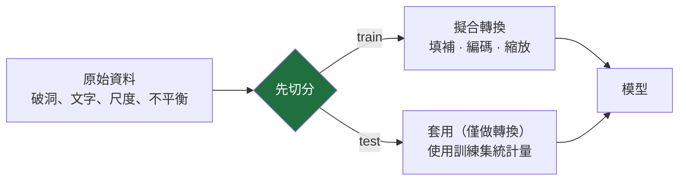

# 20 — 資料與特徵工程

> 第 8 部分 · 第 20 課 · 程式技術棧：scikit-learn (+ pandas)

**先備知識：** [05 — 過度擬合、正則化與評估](05-overfitting-evaluation.md)。有幫助的：[06 — k-NN、決策樹與集成](06-knn-trees-ensembles.md)。

**學完本課你能：**
- 用正確的**填補 (imputation)** 策略處理**缺失資料 (missing data)**，並說明為何「丟掉資料列」通常是錯誤的直覺反應。
- 正確地編碼**類別型 (categorical)** 特徵——獨熱 (one-hot) vs 序數 (ordinal) vs 目標編碼——並辨識每一種在什麼情況下會悄悄地讓你的模型出問題。
- 診斷**類別不平衡 (class imbalance)**，看清為何準確率會說謊，並在 `class_weight`、重新取樣與 **SMOTE** 之間做選擇。
- 揪出**資料洩漏 (data leakage)** ——最致命的錯誤——並用 scikit-learn 的 `Pipeline` + `ColumnTransformer` 殲滅它，讓每一個轉換都在每個 CV 折 (fold) 內重新擬合。
- 為一份雜亂的真實感測器資料集建立一條完整、無洩漏的前處理管線 (pipeline)，並在切分時間序列時不洩漏未來資訊。

---

## 1. 直覺理解

你在第 02–19 課學到的一切，都假設有一個乾淨的矩陣 $X$ 和一個乾淨的標籤向量 $y$ 直接送到你手上。真實資料從不會這樣抵達。它帶著破洞、文字標籤、天差地遠的尺度、200:1 的類別比例，還有一個在 14:32 默默停止回報的感測器。**真實 ML 中那 80%、沒人會為它拍照放上研討會投影片的部分，就是把那個矩陣整理好**——而且要在不作弊的前提下做到。

**類比——下鍋前的備料。** 一道好食譜（你的模型）如果蔬菜沒洗、一半的份量缺漏，鹽用噸量、番紅花卻用毫克量，那它就毫無用處。特徵工程就是 *mise en place*（備料）：洗淨（填補）、切成可用的形狀（編碼），並把所有東西帶到可比較的尺度。這一步做錯，沒有任何模型——不管是隨機森林還是 Transformer——救得了你。

但還有一個更微妙的陷阱，而它正是這一課存在的全部理由。當你「洗淨並切配」時，你會計算統計量：用來填補的某欄平均、用來縮放的最小/最大值、用來獨熱的類別集合。**如果你用測試資料來計算那些統計量，你就已經偷看了答案。** 你的離線分數會很漂亮，但你的模型在現場會臉朝下摔倒。這就是**資料洩漏**，而避免它是應用 ML 中槓桿最大的單一習慣。



那張圖裡的順序——**先切分，再只用訓練集擬合**——是鐵律。打破它，下游的一切都是謊言。

---

## 2. 數學原理

這裡沒有太多繁重的數學；紀律藏在 *你計算哪一個統計量、又是在哪些列上計算*。但有幾條公式釘住了這些選擇。

### 填補就是用一個估計值來填洞

一個缺失值就是一個未知的 $x_{ij}$。最簡單而有原則的填法，是用**該欄已觀測值的某個常數摘要**。令 $\mathcal{O}_j$ 為特徵 $j$ 有被觀測到的列的集合：

$$
\hat{x}_{ij} = \frac{1}{|\mathcal{O}_j|}\sum_{k \in \mathcal{O}_j} x_{kj} \quad(\text{mean}),
\qquad
\hat{x}_{ij} = \operatorname{median}_{k \in \mathcal{O}_j} x_{kj},
\qquad
\hat{x}_{ij} = \operatorname{mode}_{k \in \mathcal{O}_j} x_{kj}\ (\text{most frequent}).
$$

- **平均**是最小平方意義下最佳的常數（它最小化 $\sum (x_{kj}-c)^2$），但它會被離群值 (outlier) 拉著跑。
- **中位數**最小化 $\sum |x_{kj}-c|$ ——對一個卡住、不斷回報 9999 的聲納 (sonar) 具有穩健性。
- **眾數 / 最高頻**是你用在類別型上的（你沒辦法對「calm」和「rough」取平均）。

關鍵的但書：**$\mathcal{O}_j$ 必須只包含訓練集的列。** 你用來填補的那個平均，是一個從資料中學來的參數，就跟一個權重 (weight) 一模一樣。從測試集學它，你就洩漏了。

### 為什麼會有缺失值？（這會改變一切）

標準的分類法：

- **MCAR**（完全隨機缺失，Missing Completely At Random）：缺失與任何事都獨立——一個宇宙射線造成的位元翻轉。在這裡丟掉資料列是無偏的，只是浪費。
- **MAR**（隨機缺失，Missing At Random）：缺失與否取決於*已觀測*的特徵——深度感測器只在淺水時失靈，而你記錄了深度。可以從其他欄填補出來。
- **MNAR**（非隨機缺失，Missing Not At Random）：缺失與否取決於*未觀測值本身*——熱敏電阻*因為*太熱才故障，所以那些高溫讀數恰恰就是缺失的那些。這是最危險的情況；丟掉或天真地填補都會讓模型產生偏差。

這個分類法之所以重要，是因為**只有在 MCAR 下丟掉資料列才是安全的**，而這對感測器來說很少成立。通常你應該填補*並加上一個「曾經缺失」的旗標欄*，這樣模型才能學到「缺失本身就帶有資訊」（一顆故障的熱敏電阻就是一個故障訊號！）。

### 獨熱編碼及其維度成本

一個有 $K$ 個相異層級的類別型特徵，會變成 $K$ 個（或 $K-1$ 個）二元欄位：

$$
\text{level } c \;\mapsto\; \mathbf{e}_c \in \{0,1\}^{K}, \qquad (\mathbf{e}_c)_m = \mathbb{1}[m = c].
$$

代價是：一個有 $K=10{,}000$ 個唯一船舶 ID 的特徵，會爆炸成 10,000 個稀疏欄位。**獨熱編碼是正確的，但對高基數特徵很昂貴**，而且它*不施加任何順序*——這對無序的類別來說恰恰正確。

### 序數編碼——只給真正的順序使用

把每個層級對應到一個整數：

$$
\{\text{calm, moderate, rough, severe}\} \mapsto \{0,1,2,3\}.
$$

只有**當且僅當**順序是真實的、而且在意義上大致等距時，這才沒問題。把它套用到無序類別上（`{sonar, lidar, camera} → {0,1,2}`），你就等於告訴模型「camera $-$ sonar $=2$，而且 lidar 夾在它們*中間*」，這是一個線性模型或基於距離的模型會乖乖照辦的胡說八道。

### 目標 / 平均編碼——強大，且是洩漏陷阱

把每個類別替換成**該類別目標的平均值**：

$$
\text{enc}(c) = \frac{\sum_{i:\,x_i = c} y_i}{\#\{i : x_i = c\}} \quad\text{(often smoothed toward the global mean).}
$$

這把高基數類別壓縮成一個帶有資訊的數字——對樹模型和 GBM 很棒。但它用到了 $y$，所以如果你在所有列上計算它（包括你稍後要預測的那些列），**每一列的編碼都會洩漏自己的標籤。** 它必須只在訓練折上擬合，最好用折外 (out-of-fold) 計算。

### 縮放回顧與穩健縮放

來自[第 05 課](05-overfitting-evaluation.md)：標準化

$$
z_{ij} = \frac{x_{ij} - \mu_j}{\sigma_j}, \qquad \mu_j,\ \sigma_j \text{ from the TRAINING column}.
$$

縮放對**基於距離與基於梯度**的方法很重要（k-NN、SVM、k-平均、線性/邏輯迴歸、神經網路），對**軸對齊的樹分裂則完全沒影響**（一棵樹的分裂閾值具有尺度不變性）。當離群值主導時，$\mu$ 和 $\sigma$ 會被汙染；**穩健縮放 (robust scaling)** 改用順序統計量：

$$
z_{ij} = \frac{x_{ij} - \operatorname{median}_j}{\text{IQR}_j}, \qquad \text{IQR}_j = Q_{75,j} - Q_{25,j}.
$$

中位數與 IQR 會忽略極端尾端，所以一個卡在最大值的感測器讀數，不再會把整欄的其餘部分壓成靠近零的一條細縫。

### 類別不平衡：為何準確率會說謊（呼應第 05 課）

如果正類（故障）的比率是 $p$，那麼「永遠預測負類」的分類器分數為

$$
\text{Accuracy}_{\text{trivial}} = 1 - p.
$$

在 $p = 0.01$ 時那就是 **99% 準確率，卻抓到零個故障**——正是第 05 課裡漏水偵測器的陷阱。修正的方法有兩面：(1) 使用**精確率 / 召回率 / F1 / PR-AUC**，以及 (2) 重新平衡*學習訊號*，讓罕見事件算數。乾淨的槓桿是一個**成本加權損失**：把每個類別的權重設為與其頻率成反比，

$$
w_c = \frac{N}{K \cdot N_c},
$$

其中 $N$ 是總樣本數，$K$ 是類別數，$N_c$ 是類別 $c$ 的計數。這正是 `class_weight="balanced"` 所計算的。每一個罕見類別的錯誤，現在的代價就等同於 $N_{\text{neg}}/N_{\text{pos}}$ 個多數類別的錯誤。

---

## 3. 程式碼

### 3.1 洩漏的做法 vs 正確的做法（整堂課濃縮成一個實驗）

讓我們把洩漏變成*可測量的*。我們在切分前對全部資料擬合一個縮放器（錯誤），對照在管線內每折重新擬合（正確），然後比較交叉驗證分數。

```python
import numpy as np
import pandas as pd
from sklearn.datasets import make_classification
from sklearn.model_selection import cross_val_score, StratifiedKFold
from sklearn.preprocessing import StandardScaler
from sklearn.linear_model import LogisticRegression
from sklearn.pipeline import Pipeline

rng = np.random.default_rng(0)

# 一個規模適中的資料集；當 n 相對於特徵數很小時，洩漏最明顯。
X, y = make_classification(n_samples=200, n_features=40, n_informative=5,
                           n_redundant=0, random_state=0)

cv = StratifiedKFold(n_splits=5, shuffle=True, random_state=0)

# --- 錯誤：先在「完整」資料集上縮放，「然後才」交叉驗證 ---
# 縮放器已經「看過」每一折的平均/標準差，包括那一折被保留作驗證的部分。
X_leaked = StandardScaler().fit_transform(X)          # 擬合用到「所有」列 -> 洩漏
leaky = cross_val_score(LogisticRegression(max_iter=1000),
                        X_leaked, y, cv=cv, scoring="roc_auc")

# --- 正確：縮放住在管線「內部」，只在每個訓練折上重新擬合 ---
clean_pipe = Pipeline([
    ("scale", StandardScaler()),                      # 擬合在每折發生
    ("clf", LogisticRegression(max_iter=1000)),
])
clean = cross_val_score(clean_pipe, X, y, cv=cv, scoring="roc_auc")

print(f"Leaky  CV ROC-AUC: {leaky.mean():.3f}")
print(f"Clean  CV ROC-AUC: {clean.mean():.3f}")
# -> Leaky  CV ROC-AUC: 0.869
# -> Clean  CV ROC-AUC: 0.868
```

你應該看到：洩漏的那個數字**樂觀地偏高**（這裡只高了一點點）。用普通的 `StandardScaler` 時差距很小——全域的平均/標準差在不同折之間幾乎不動——但它是*真實存在的，而且永遠朝錯誤的方向*。把縮放器換成填補器、一個在所有類別上擬合的獨熱編碼器、一個特徵選擇器，或 SMOTE，這道髮絲般的裂縫就會炸開成 0.05–0.20 的範圍——一個離線看起來可部署、實際上卻不行的模型。規則是機械式的：**任何帶有 `.fit()` 的步驟都屬於 `Pipeline` 內部**，絕不放在 `cross_val_score`/`train_test_split` 之前。

### 3.2 ColumnTransformer：不同欄位型別、不同的食譜

真實的表格會混雜數值與類別欄位，它們需要不同的處理。`ColumnTransformer` 把每個子集導向它自己的子管線，而整個東西仍然只有一個 `.fit()`，所以它能乾淨地巢狀嵌入 CV。

```python
from sklearn.compose import ColumnTransformer
from sklearn.impute import SimpleImputer
from sklearn.preprocessing import OneHotEncoder

# 建立一個小小的混合型別資料框，帶有刻意製造的破洞和一個類別欄。
df = pd.DataFrame({
    "depth_m":      [12.0, np.nan, 31.5, 8.2, np.nan, 44.0, 19.1, 27.7],
    "thruster_amp": [3.1, 3.4, np.nan, 2.9, 5.8, 3.0, 3.2, np.nan],
    "sea_state":    ["calm", "calm", "rough", None, "moderate", "rough", "calm", "moderate"],
})
y_demo = np.array([0, 0, 1, 0, 1, 1, 0, 1])

numeric_cols     = ["depth_m", "thruster_amp"]
categorical_cols = ["sea_state"]

# 數值分支：中位數填補（對卡住的感測器具穩健性），然後標準化。
numeric_tf = Pipeline([
    ("impute", SimpleImputer(strategy="median")),
    ("scale",  StandardScaler()),
])

# 類別分支：用最高頻填補缺失，然後獨熱。
# handle_unknown="ignore" => 訓練時沒見過的類別會變成全零，
# 而不是在上線時崩潰。這是你針對訓練/上線偏移的保險。
categorical_tf = Pipeline([
    ("impute", SimpleImputer(strategy="most_frequent")),
    ("onehot", OneHotEncoder(handle_unknown="ignore")),
])

pre = ColumnTransformer([
    ("num", numeric_tf, numeric_cols),
    ("cat", categorical_tf, categorical_cols),
])

out = pre.fit_transform(df)
print("Transformed shape:", out.shape)              # 2 個數值 + 3 個 sea_state 獨熱欄
print("Output feature names:", list(pre.get_feature_names_out()))
# -> Transformed shape: (8, 5)
# -> Output feature names: ['num__depth_m', 'num__thruster_amp',
#       'cat__sea_state_calm', 'cat__sea_state_moderate', 'cat__sea_state_rough']
```

這裡的每一個統計量——中位數填補值、標準化的平均/標準差、*已知 sea-state 的集合*——都是從 `fit` 所看到的那些列學來的。把這個物件交給交叉驗證，每一折都會在它自己的訓練列上重新學習它們。這就是「靠結構設計來防洩漏」；你不可能忘記去做。

### 3.3 完整的無洩漏分類器

現在把前處理器黏到一個模型上，並誠實地評估它。

```python
from sklearn.ensemble import RandomForestClassifier

full = Pipeline([
    ("pre", pre),                                   # 填補 + 縮放 + 獨熱
    ("clf", RandomForestClassifier(
        n_estimators=200, class_weight="balanced",  # 為罕見類別做成本加權
        random_state=0)),
])

# cross_val_score 在每折複製一份 `full`，並只在訓練列上呼叫 .fit()，
# 所以每一個填補器平均 / 縮放器標準差 / 類別集合都會在每折重新擬合。乾淨。
scores = cross_val_score(full, df, y_demo,
                         cv=StratifiedKFold(n_splits=4, shuffle=True, random_state=0),
                         scoring="roc_auc")
print(f"Honest CV ROC-AUC: {scores.mean():.3f}")
# -> Honest CV ROC-AUC: ~1.0  （玩具般的 8 列資料；重點是接線方式，不是這個數字）
```

注意 `class_weight="balanced"` 正在做 §2 裡的不平衡修正——不需要重新取樣套件、沒有洩漏風險，而且它住在管線內部。

### 3.4 視覺化為何縮放重要（以及在有離群值時，穩健縮放勝過標準縮放）

```python
import matplotlib.pyplot as plt
from sklearn.preprocessing import RobustScaler

# 一個乾淨、近似高斯的感測器欄位，然後注入 3 個卡在最大值的讀數。
col = rng.normal(20.0, 2.0, 200)
col[:3] = 200.0                                      # 感測器故障：卡在高值

z_std    = StandardScaler().fit_transform(col.reshape(-1, 1)).ravel()
z_robust = RobustScaler().fit_transform(col.reshape(-1, 1)).ravel()

fig, ax = plt.subplots(1, 2, figsize=(11, 4))
ax[0].hist(z_std,    bins=40); ax[0].set_title("StandardScaler\n(outliers crush the bulk)")
ax[1].hist(z_robust, bins=40); ax[1].set_title("RobustScaler\n(median/IQR ignore the tail)")
for a in ax: a.set_xlabel("scaled value")
plt.tight_layout(); plt.show()
```

你應該看到：在 `StandardScaler` 之下，那三個離群值把 $\sigma$ 膨脹得如此嚴重，以致 197 個正常點全擠在靠近零的一個細尖峰裡——毫無有用的分散度。在 `RobustScaler` 之下，正常的主體保持了健康的分散度，而離群值就乾脆地坐在遠處它們該待的地方。每當你無法信任尾端時（也就是用原始感測器時幾乎總是如此），就使用穩健縮放。

---

## 4. 實際案例 — 為 ROV 故障偵測打造一條無洩漏管線

**情境設定。** 你正在記錄一台執行管線檢查的遙控潛水器 (ROV)。每一列是一個 1 Hz 的快照；你想在載具被困住之前**標記出推進器故障**。原始表格是教科書級的一團亂：

| 欄位 | 型別 | 問題 |
|---|---|---|
| `thruster_current_a` | 數值 | 匯流排電壓驟降時掉資料（缺失） |
| `motor_temp_c` | 數值 | 熱敏電阻*在高溫時*故障 → MNAR 缺失 |
| `depth_m`、`pitch_deg`、`roll_deg` | 數值 | 沒問題，但尺度各異 |
| `sea_state` | 類別 | `{calm, moderate, rough, severe}` ——**真正有序** |
| `sensor_pack` | 類別 | `{A, B, C}` 可替換硬體——**無序** |
| `fault` | 標籤 | 只有 **2%** 為正——嚴重不平衡 |

這正是本課範圍裡的三重組合：缺失的感測器通道、一個類別型的 sea-state，以及罕見的正類。以下是組裝過程。

```python
import numpy as np
import pandas as pd
from sklearn.compose import ColumnTransformer
from sklearn.pipeline import Pipeline
from sklearn.impute import SimpleImputer
from sklearn.preprocessing import RobustScaler, OneHotEncoder, OrdinalEncoder
from sklearn.ensemble import RandomForestClassifier
from sklearn.model_selection import cross_validate, StratifiedKFold

# --- 合成一份真實、雜亂、不平衡的 ROV 日誌 -------------------------
rng = np.random.default_rng(42)
n = 4000
fault = (rng.random(n) < 0.02).astype(int)           # 2% 為正類

df = pd.DataFrame({
    "thruster_current_a": rng.normal(8, 1.2, n) + 4.0 * fault,   # 故障會抽取更多電流
    "motor_temp_c":       rng.normal(35, 5, n) + 18.0 * fault,   # 故障會發熱
    "depth_m":            rng.uniform(0, 120, n),
    "pitch_deg":          rng.normal(0, 3, n),
    "roll_deg":           rng.normal(0, 3, n),
    "sea_state":          rng.choice(["calm", "moderate", "rough", "severe"],
                                     size=n, p=[0.5, 0.3, 0.15, 0.05]),
    "sensor_pack":        rng.choice(["A", "B", "C"], size=n),
})
# 注入缺失：隨機的匯流排掉資料 + MNAR 的高溫熱敏電阻故障。
df.loc[rng.random(n) < 0.10, "thruster_current_a"] = np.nan          # ~10% MCAR
hot = df["motor_temp_c"] > 55                                        # 最熱的那些…
df.loc[hot & (rng.random(n) < 0.6), "motor_temp_c"] = np.nan         # …傾向掉資料（MNAR）

X, y = df, fault

# --- 依欄位型別前處理 -----------------------------------------------
numeric_cols  = ["thruster_current_a", "motor_temp_c", "depth_m", "pitch_deg", "roll_deg"]
ordinal_cols  = ["sea_state"]      # 真正有序 -> 以明確的排序做序數編碼
nominal_cols  = ["sensor_pack"]    # 無序     -> 獨熱

# add_indicator=True 會附加一個「曾經缺失」旗標：一顆故障的熱敏電阻「就是」一個故障訊號。
numeric_tf = Pipeline([
    ("impute", SimpleImputer(strategy="median", add_indicator=True)),
    ("scale",  RobustScaler()),                       # 穩健：感測器有離群值
])

ordinal_tf = Pipeline([
    ("impute", SimpleImputer(strategy="most_frequent")),
    ("ord",    OrdinalEncoder(categories=[["calm", "moderate", "rough", "severe"]],
                              handle_unknown="use_encoded_value", unknown_value=-1)),
])

nominal_tf = Pipeline([
    ("impute", SimpleImputer(strategy="most_frequent")),
    ("onehot", OneHotEncoder(handle_unknown="ignore")),  # 沒見過的 pack -> 上線時全零
])

pre = ColumnTransformer([
    ("num", numeric_tf, numeric_cols),
    ("ord", ordinal_tf, ordinal_cols),
    ("nom", nominal_tf, nominal_cols),
])

clf = Pipeline([
    ("pre", pre),
    ("rf",  RandomForestClassifier(n_estimators=300,
                                   class_weight="balanced_subsample",  # 罕見類別成本加權
                                   random_state=0, n_jobs=-1)),
])

# --- 誠實的評估：分層折、無洩漏、不平衡感知的指標
cv = StratifiedKFold(n_splits=5, shuffle=True, random_state=0)
res = cross_validate(clf, X, y, cv=cv,
                     scoring=["roc_auc", "average_precision", "recall"])
print(f"ROC-AUC : {res['test_roc_auc'].mean():.3f}")
print(f"PR-AUC  : {res['test_average_precision'].mean():.3f}")  # 在這裡該信任的就是這個
print(f"Recall  : {res['test_recall'].mean():.3f}")
# -> ROC-AUC : ~0.998
# -> PR-AUC  : ~0.96   <-- 在 2% 為正的資料上，PR-AUC 才是誠實的分數
# -> Recall  : ~0.74   <-- 我們實際抓到的真實故障比例（調整門檻可以拉高它）
```

每個選擇的理由：用**中位數 + 缺失指示**，是因為在 MNAR 下丟掉資料列會扔掉最熱的那些馬達——而那恰恰就是故障；用**穩健縮放**，是因為原始感測器尾端很髒；對 `sea_state` 用**序數**，是因為它的順序在物理上真實存在，而且我們*明確地*告訴編碼器這個排序（絕不要相信字母順序的預設值）；對 `sensor_pack` 用**獨熱**，是因為這些硬體 pack 沒有順序；用 **`balanced_subsample`**，這樣那 2% 的故障才不會被淹沒；並以 **PR-AUC + 召回率**作為頭條指標，因為——如同第 05 課所反覆強調的——對一個從不預測故障的模型來說，準確率會顯示約 98%。

> **想用 SMOTE？** *（選用——需要 `pip install imbalanced-learn`。）* **SMOTE**（合成少數類別過取樣，Synthetic Minority Over-sampling）不是複製少數類別的資料列；它*發明*新的列，方法是在一個故障樣本與它的某個 $k$ 最近鄰故障樣本之間做內插：$x_{\text{new}} = x_i + \lambda (x_{\text{nbr}} - x_i)$，其中 $\lambda \sim U(0,1)$。它必須**只在訓練折上執行**，所以要用 `imblearn` 的管線，而不是 sklearn 的，因為它必須*在切分之後*重新取樣：`from imblearn.pipeline import Pipeline as ImbPipeline; ImbPipeline([("pre", pre), ("smote", SMOTE()), ("rf", clf_step)])`。在完整資料集上重新取樣，你就把測試點的合成鄰居洩漏進了訓練——一個經典、會灌水分數的錯誤。

### 時間序列的故障：依時間順序切分，永遠不要洗牌

ROV 日誌是一個*時間序列*。如果你設 `shuffle=True`，一個 14:35 的列會落進訓練集，而 14:34 卻坐在測試集裡——你等於是在用未來預測過去。請使用時間感知的切分，讓訓練永遠先於測試：

```python
from sklearn.model_selection import TimeSeriesSplit, cross_val_score
tscv = TimeSeriesSplit(n_splits=5)          # 第 k 折在 [0..t] 上訓練，在 (t..t+Δ] 上測試
ts_scores = cross_val_score(clf, X, y, cv=tscv, scoring="average_precision")
print(f"Time-series PR-AUC: {ts_scores.mean():.3f}")
# -> Time-series PR-AUC: ~0.95  （我們的合成特徵在時間上是穩態的，所以分數維持得很高）
```

在這份玩具資料上，分數幾乎不動，因為我們的特徵在時間上是 i.i.d. 的。**在真實日誌中它幾乎總是會掉**——而那個下降正是重點。連續的 1 Hz 樣本高度自相關，所以洗牌會把一列 14:34 的近乎雙胞胎丟進訓練集，而你卻在「預測」14:35：模型其實是在半背誦它本質上已經見過的列。依時間順序的切分禁止這件事，模擬了部署情境（用過去訓練、預測未來），所以它的數字才是預測現場表現的那一個。當 `TimeSeriesSplit` 的分數遠低於洗牌的 CV 時，是那個洗牌分數在說謊。

---

## 5. 常見陷阱與技巧

- **最致命的錯誤：在切分前就對完整資料集擬合任何轉換。** 縮放器、填補器、編碼器、PCA、特徵選擇器、SMOTE——只要它有 `.fit()`，它就會學參數，而從測試列學它們就是洩漏。把每一個都放進 `Pipeline`，讓 `cross_val_score`/`GridSearchCV` 在每折重新擬合。這個單一習慣就能預防大多數「離線很棒、上線很慘」的災難。
- **丟掉有缺失值的資料列通常是錯的。** 它只有在 MCAR 下才會優雅地失敗，而感測器很少滿足 MCAR；在 MNAR 下（`dropna()`）它會系統性地刪掉那些帶資訊的案例。改用填補並加上一個缺失指示。
- **對無序類別做序數編碼會注入一個假的順序。** `{sonar, lidar, camera} → {0,1,2}` 告訴模型 camera 是 lidar 的「兩倍」。對名目特徵用獨熱；序數保留給真正有排名的，而且要明確傳入排序——不要相信預設（往往是字母順序）的順序。
- **目標 / 平均編碼除非以折外方式進行，否則會洩漏。** 它用到了 $y$，所以在所有列上計算它，會讓每一列偷看自己的標籤。把它朝全域平均做平滑，並在 CV 折內計算它，或使用一個會做折外編碼的函式庫。
- **留意獨熱的維度。** 高基數的 ID（船舶、港口、MMSI）會讓欄位數與記憶體爆炸。對那些 ID，考慮把罕見層級歸成「other」、做雜湊，或對它們做目標編碼。
- **訓練/上線偏移在進到正式環境前都是無聲的。** 永遠設定 `OneHotEncoder(handle_unknown="ignore")`，這樣一個沒見過的類別才不會讓推論崩潰；保存*已擬合的管線*（例如 `joblib.dump`），並在上線時載入同一個物件——絕不要從即時資料重新推導縮放統計量。
- **對樹模型而言縮放是無作用的**（隨機森林、梯度提升），但對 k-NN、SVM、線性/邏輯、k-平均與神經網路則是必須的。它從不會傷害一棵樹，所以把它留在共用的管線裡是沒問題的。

---

## 6. 自我檢測

**Q1.** 一位隊友在整個資料集上跑 `StandardScaler().fit_transform(X)`，*然後才*做 `train_test_split`。他們回報 0.97 的 AUC。為什麼那個數字不可信？修正的方法是什麼？
<details><summary>解答</summary>
這個縮放器是從<b>所有</b>列計算每個特徵的平均與標準差，包括測試集，所以測試集的統計量洩漏進了訓練——模型已經間接「看過」測試分布。回報的 0.97 是樂觀地被灌水了。修正：先切分，或（更好）把縮放器放進 <code>Pipeline</code>，這樣 <code>cross_val_score</code>/<code>train_test_split</code> 才會只在訓練列上重新擬合它。每一個 <code>.fit()</code> 步驟都必須住在管線內部。
</details>

**Q2.** 你有一個 `sea_state ∈ {calm, moderate, rough, severe}` 欄位和一個 `sensor_pack ∈ {A, B, C}` 欄位。每一個該用哪種編碼，為什麼？
<details><summary>解答</summary>
<code>sea_state</code> 用<b>序數</b>——它有一個真實、單調的順序（calm &lt; moderate &lt; rough &lt; severe），所以整數 0–3 帶有真正的資訊；要明確傳入排序，這樣編碼器才不會按字母順序排。<code>sensor_pack</code> 用<b>獨熱</b>——A/B/C 是可互換、沒有順序的硬體，所以序數編碼會憑空發明一個假的「B 夾在 A 和 C 之間」的關係。
</details>

**Q3.** 你的故障偵測器在一份 2% 為故障的日誌上回報 98% 準確率。你該出貨嗎？你該改看什麼？
<details><summary>解答</summary>
不該。一個<i>永遠預測「無故障」</i>的模型會得到 98% 分數，卻抓到零個故障（呼應第 05 課）。在不平衡資料上準確率毫無意義。要看<b>召回率</b>（抓到的真實故障比例）、<b>精確率</b>，與 <b>PR-AUC</b>（平均精確度），並用 <code>class_weight="balanced"</code>、重新取樣或 SMOTE 來重新平衡學習訊號。
</details>

**Q4.** 為什麼 SMOTE 必須只套用在訓練折上，而絕不能在訓練/測試切分之前？
<details><summary>解答</summary>
SMOTE 透過在真實少數類別樣本與它們的最近鄰之間做內插，來建立合成的少數類別點。如果你在切分之前跑它，那些從<i>測試</i>樣本（或它們附近）衍生出來的合成點會跑進訓練集——模型實質上是在它被評估的那些點的內插上做訓練。那就是洩漏，而且它會灌水分數。請使用 <code>imblearn.pipeline.Pipeline</code>，這樣重新取樣才會在每折內、切分之後發生。
</details>

**Q5.** 你的感測器日誌是一個時間序列。用 `shuffle=True` 的交叉驗證給出 PR-AUC 0.90；`TimeSeriesSplit` 給出 0.62。你該回報哪一個，這道差距又是為什麼？
<details><summary>解答</summary>
回報 <code>TimeSeriesSplit</code> 的 <b>0.62</b>。洗牌讓模型用未來的列來預測過去的列——這在部署時不可能，所以 0.90 是來自時間自相關的洩漏。依時間順序的切分模擬了現實（用過去訓練、預測未來），所以它誠實地估計了現場表現。這道差距，就是洗牌對你說的那個謊有多大。
</details>

---

## 回顧與下一步

- **資料準備佔了真實 ML 的 80%，而洩漏是最致命的錯誤。** 先切分；把每一個轉換——縮放器、填補器、編碼器、SMOTE——只在訓練列上擬合。一條 `Pipeline` + `ColumnTransformer` 會在每個 CV 折內自動強制執行這件事。
- **要填補，不要丟掉。** 中位數很穩健，類別型用最高頻，並加上一個缺失指示，因為缺失本身就可能是訊號（尤其在 MNAR 的感測器故障下）。
- **依類別型別來編碼：** 無序的用獨熱（留意維度）、序數*只*給真正的順序、目標 / 平均編碼很強大但只能以折外方式計算。
- **不平衡會讓準確率說謊。** 用 `class_weight`、重新取樣或 SMOTE，並以召回率 / 精確率 / PR-AUC 來判斷——絕不要用原始準確率。
- **尊重時間。** 使用 `TimeSeriesSplit`、保存已擬合的管線，並餵給上線環境同一個物件，以避免訓練/上線偏移。

有了一條乾淨、無洩漏的管線在手，最後一個槓桿就是把模型的*設定*選好——而且不要讓你的調參過度擬合到驗證集：**[21 — 超參數最佳化](21-hyperparameter-optimization.md)**。
