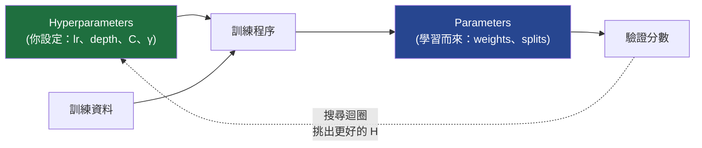
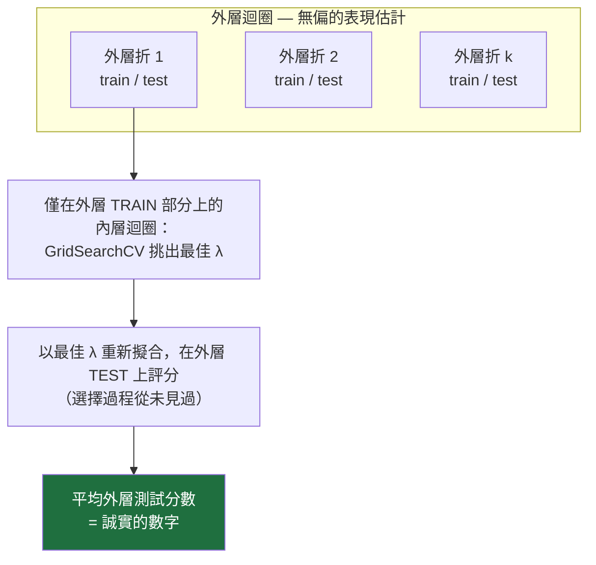

# 21 — 超參數最佳化與模型選擇

> 第 8 部分 · 第 21 課 · 程式技術棧：scikit-learn (+ an optional Optuna note)

**先備知識：** [05 — 過度擬合、正則化與評估](05-overfitting-evaluation.md)。有幫助的：[07 — 支持向量機與核](07-svm-kernels.md)、[20 — 資料與特徵工程](20-data-feature-engineering.md)。

**學完本課你能：**
- 說清楚 **參數 (parameters)**（學習而來）與 **超參數 (hyperparameters)**（你來選定）的差異，以及為何後者需要自己的搜尋程序。
- 在 scikit-learn 裡執行 **網格搜尋 (grid search)** 與 **隨機搜尋 (random search)**，並透過 Bergstra & Bengio 的洞見解釋為何隨機搜尋常以一小部分預算就勝出。
- 勾勒出 **貝氏最佳化 (Bayesian optimization) / TPE**（Optuna）與 **Hyperband** 如何更聰明地花用預算。
- 指出大家在模型表現上自我欺騙最常見的那一招，並用 **巢狀交叉驗證 (nested cross-validation)** 或 **只碰一次的測試集 (touch-once test set)** 來修正它。
- 在 **聲納地雷對岩石 (sonar mine-vs-rock)** 問題上調校 SVM / 隨機森林，並回報一個你真的敢信的數字。

---

## 1. 直覺理解

每個模型都有兩種旋鈕。第一種是 **參數 (parameters)**，由訓練程序 *從資料中學習* 而來：邏輯迴歸裡的權重、樹內部的切分閾值、支持向量的係數。你從來不會手動設定這些——是梯度下降或建樹器把它們找出來的。

第二種是 **超參數 (hyperparameters)**，是你在訓練 *開始之前* 就設定好、而訓練程序無法替你調校的旋鈕：學習率、網路深度、SVM 的 $C$ 與 $\gamma$、森林的 `n_estimators` 與 `max_depth`、正則化強度 $\lambda$。它們控制學習 *如何* 發生，所以學習器無法用同一個損失去最佳化它們，否則就會原地打轉。

**類比——調校一個控制迴路。** 當你在一艘無人水面載具 (USV) 上調試 PID 航向控制器時，增益 $K_p, K_i, K_d$ 並不是船自己學來的；是你挑定它們、跑一次試驗、觀察響應、再做調整。船在一次運行中實際的舵角才是「參數」——它們會自動反應。增益則是「超參數」——決定自動部分如何行為的那些元旋鈕。超參數最佳化（**HPO**）就是替 ML 模型做系統化的增益調校，只是多了一個危險：你太容易把增益「調」到專門對付你即將被評分的那個確切海況，然後在真實海洋不同時還一臉驚訝。



那張圖裡的外層迴圈——提出超參數、訓練、評分、重複——*就是* HPO。整堂課講的就是 (a) 如何高效地跑這個迴圈，以及 (b) 如何誠實地讀最終分數。

---

## 2. 數學原理

**HPO 問題。** 令 $\lambda$ 為一個超參數向量（例如 $\lambda = (C, \gamma)$）。在資料集 $\mathcal{D}_{\text{train}}$ 上訓練會產生參數

$$\hat{\theta}(\lambda) = \arg\min_{\theta}\; L\big(\theta; \mathcal{D}_{\text{train}}, \lambda\big),$$

其中 $L$ 是訓練損失、$\theta$ 是學到的參數。接著我們想找出能最小化 **泛化誤差 (generalization error)** 的 $\lambda$，這個誤差是在保留資料 $\mathcal{D}_{\text{val}}$ 上估計的：

$$\lambda^{\star} = \arg\min_{\lambda \in \Lambda}\; \mathcal{E}\big(\hat{\theta}(\lambda); \mathcal{D}_{\text{val}}\big).$$

這是一個 **雙層最佳化 (bilevel optimization)**：對 $\theta$ 的內層最小化（也就是普通訓練）巢狀於對 $\lambda$ 的外層最小化之中。讓 HPO 變難的是外層目標——$\mathcal{E}$ 對 $\lambda$ 沒有公式、沒有可直接讀取的梯度，而且每次評估都要花一整輪完整的訓練。它是一個 **黑箱、評估成本高昂** 的函數。下面每一種搜尋策略，都只是在這個限制下「下一個該試哪個 $\lambda$」的不同政策而已。

**網格搜尋。** 把 $d$ 個超參數各自離散成一個清單，然後評估完整的笛卡兒積。每軸取 $k$ 個值時，成本為

$$N_{\text{grid}} = k^{\,d},$$

**維度災難** 一目了然：4 個超參數各取 5 個值就已經是 $5^4 = 625$ 輪訓練，再加上 k 折交叉驗證又要乘上 $k_{\text{folds}}$。它徹底又可重現，但擴展性糟糕——而且關鍵是：不論你花多少次試驗，它每一軸都只測試了 $k$ 個 *不同的值*。

**隨機搜尋。** 固定 $n$ 次試驗的預算，每次都從一個分布（均勻、對數均勻等）為每個超參數抽樣。**Bergstra & Bengio (2012)** 的洞見是：在真實問題裡，真正重要的超參數只有少數幾個，而且你事先不知道是哪幾個。網格會浪費試驗——它在重要那一軸上反覆測試 *相同* 的值，卻只變動不相干的那一軸。隨機搜尋在任何一軸上都不會重複某個值，所以用 $n$ 次試驗就探測了 *每個維度* 的 $n$ 個不同值，包含有影響力的那些。從幾何上看，把試驗投影到重要的那一軸：網格塌縮成 $k$ 個點，隨機則散開成 $n \gg k$ 個點。

如果重要那一軸的好區域佔其範圍的比例 $f$，那麼單次隨機抽樣落入其中的機率為 $f$，於是

$$P(\text{at least one of }n\text{ trials hits the good region}) = 1 - (1-f)^n.$$

對 $f = 0.05$，只要 $n = 60$ 次隨機試驗就給出 $1 - 0.95^{60} \approx 0.95$——也就是有 95% 的機會找到那個好區段，完全不需要網格。

**貝氏最佳化 / TPE。** 與其盲目抽樣，不如對目前已見過的試驗擬合一個便宜的 **代理模型 (surrogate model)** $\hat{\mathcal{E}}(\lambda)$，然後透過最大化一個 **獲取函數 (acquisition function)** 來挑下一個 $\lambda$——通常是相對於目前找到的最佳分數 $\mathcal{E}^{\star}$ 的 **期望改善 (Expected Improvement)**：

$$\text{EI}(\lambda) = \mathbb{E}\big[\max(0,\; \mathcal{E}^{\star} - \mathcal{E}(\lambda))\big].$$

EI 在 **利用 (exploitation)**（在代理模型預測分數好的地方抽樣）與 **探索 (exploration)**（在它不確定的地方抽樣）之間取得平衡。高斯過程的貝氏最佳化直接對 $\mathcal{E}(\lambda)$ 建模；**TPE**（Tree-structured Parzen Estimator，Optuna 的預設值）則改為對「好」試驗的 *密度* $\ell(\lambda)$ 與「壞」試驗的密度 $g(\lambda)$ 建模，並在比值 $\ell(\lambda)/g(\lambda)$ 大的地方抽樣——而這正好等價於最大化 EI。不論哪一種：每次試驗都會 *為下一次提供資訊*，所以找到好設定所需的評估次數遠少於隨機搜尋。

**Hyperband / 連續減半 (successive halving)。** 這是一個正交的想法：別只決定 *要試哪個* $\lambda$，還要決定 *每個花多久*。用很小的預算（少數訓練週期 / 少數幾棵樹 / 一個資料子集）啟動許多設定，只保留排名前 $1/\eta$ 的那一小撮，給存活者 $\eta\times$ 的更多預算，再重複。壞設定會 **被提早剪枝 (pruned early)**，而非訓練到完成，所以同樣的牆鐘時間能買到多得多的候選評估。這就是 Optuna 的剪枝器與 Ray Tune 的 ASHA 背後的引擎。

---

## 3. 程式碼

我們會用經典的 **威斯康辛乳癌 (Wisconsin breast-cancer)** 資料集作為快速、無依賴的起點（聲納機器人案例在第 4 節）。它隨 scikit-learn 一起附帶，所以不會有任何下載。

### 3.1 同一個估計器上的網格搜尋對隨機搜尋

我們調校一個外覆縮放器 (scaler) 的 RBF SVM（回想第 07 課的 $C$ 與 $\gamma$）——SVM *需要* 標準化後的特徵。我們一律在 CV 管線 **內部** 做縮放，這樣驗證折就絕不會看到訓練折的平均值/變異數（第 20 課的洩漏陷阱）。

```python
import numpy as np
from scipy.stats import loguniform
from sklearn.datasets import load_breast_cancer
from sklearn.model_selection import (GridSearchCV, RandomizedSearchCV,
                                     StratifiedKFold)
from sklearn.pipeline import Pipeline
from sklearn.preprocessing import StandardScaler
from sklearn.svm import SVC

rng = 42
X, y = load_breast_cancer(return_X_y=True)        # 569 個樣本、30 個特徵

# 縮放 -> SVM，當作「單一」估計器，這樣縮放會在每個 CV 折重新擬合（無洩漏）。
pipe = Pipeline([("scaler", StandardScaler()),
                 ("svc", SVC(kernel="rbf"))])
cv = StratifiedKFold(n_splits=5, shuffle=True, random_state=rng)

# --- 網格搜尋：在 7x7 = 49 個點的網格上窮舉 ---------------------
grid = {"svc__C":     np.logspace(-2, 4, 7),      # 0.01 ... 10000
        "svc__gamma": np.logspace(-5, 1, 7)}      # 1e-5 ... 10
gs = GridSearchCV(pipe, grid, cv=cv, scoring="roc_auc", n_jobs=-1)
gs.fit(X, y)
print(f"Grid   : {49} trials | best AUC {gs.best_score_:.4f} | {gs.best_params_}")

# --- 隨機搜尋：只用 15 次試驗，在「相同」範圍上做對數均勻抽樣 --------
dist = {"svc__C":     loguniform(1e-2, 1e4),
        "svc__gamma": loguniform(1e-5, 1e1)}
rs = RandomizedSearchCV(pipe, dist, n_iter=15, cv=cv, scoring="roc_auc",
                        n_jobs=-1, random_state=rng)
rs.fit(X, y)
print(f"Random : {15} trials | best AUC {rs.best_score_:.4f} | {rs.best_params_}")
# -> Grid   : 49 trials | best AUC 0.9962 | {'svc__C': 1000.0, 'svc__gamma': 1e-04}
# -> Random : 15 trials | best AUC 0.9952 | {'svc__C': ~47, 'svc__gamma': ~7e-05}
```

隨機搜尋 **只用約 30% 的預算就達到統計上無法區分的 AUC**（這裡是 0.9952 對 0.9962——完全落在折與折之間的雜訊範圍內）——而且因為它連續抽樣，它能落在網格刻度之間的某個 $C$ 上，那是網格永遠搆不到的。

### 3.2 視覺化「為何」隨機搜尋會勝出

把試驗的位置畫在 $(\log\gamma, \log C)$ 平面上。網格落在僵硬的格點上；隨機則散開。重點在於當你投影到單一軸上時會發生什麼事。

```python
import matplotlib.pyplot as plt

gC = np.log10(gs.cv_results_["param_svc__C"].data.astype(float))
gG = np.log10(gs.cv_results_["param_svc__gamma"].data.astype(float))
rC = np.log10(rs.cv_results_["param_svc__C"].data.astype(float))
rG = np.log10(rs.cv_results_["param_svc__gamma"].data.astype(float))

fig, ax = plt.subplots(1, 2, figsize=(11, 4.6), sharex=True, sharey=True)
for a, (gx, gy, ttl, c) in zip(
        ax, [(gG, gC, "Grid (49)", "tab:blue"),
             (rG, rC, "Random (15)", "tab:red")]):
    a.scatter(gx, gy, c=c, s=60, alpha=.8, edgecolor="k")
    # 地毯刻度：把每次試驗向下投影到 gamma 軸上
    a.plot(gx, np.full_like(gx, gy.min() - .4), "|", c=c, ms=18)
    a.set(title=ttl, xlabel=r"$\log_{10}\gamma$", ylabel=r"$\log_{10}C$")
plt.tight_layout(); plt.show()
```

你應該 **看到** 網格投影出的 $\gamma$ 地毯塌縮成僅僅 7 個疊在一起的刻度，而隨機的地毯則散成 15 個不同的值。如果 $\gamma$ 是有影響力的那一軸，隨機搜尋對它的探索密度多了兩倍以上——而且只花了三分之一的試驗。

### 3.3 那個大陷阱，以及它的修正：巢狀 CV

這裡是幾乎每個人都會犯的錯。你跑 `GridSearchCV`（它內部會用 CV 來挑 $\lambda$），然後把 `gs.best_score_` 引述為你模型的表現。**那個數字是樂觀偏誤的。** 你搜尋了許多設定，並回報了在同一批驗證折上的 *最大值*，而這批折正是你用來做選擇的——所以你已經把超參數擬合到了那些折裡的雜訊。選擇過程偷看了它如今正用來替自己打分數的那批資料。

誠實的估計需要一個 **外層** 迴圈，且這個迴圈絕不碰內層的選擇：



```python
from sklearn.model_selection import cross_val_score

inner = StratifiedKFold(n_splits=5, shuffle=True, random_state=1)
outer = StratifiedKFold(n_splits=5, shuffle=True, random_state=2)

# 內層迴圈：這個物件負責「選擇」超參數。
selector = GridSearchCV(pipe, grid, cv=inner, scoring="roc_auc", n_jobs=-1)

# 非巢狀（樂觀的、不該拿來回報的數字）：
selector.fit(X, y)
non_nested = selector.best_score_

# 巢狀：把 selector 當成「單一」估計器；外層迴圈在從未用於
# 選擇其超參數的折上替它評分。
nested_scores = cross_val_score(selector, X, y, cv=outer, scoring="roc_auc",
                                n_jobs=-1)
nested = nested_scores.mean()

print(f"Non-nested AUC (report this and you're fooling yourself): {non_nested:.4f}")
print(f"Nested AUC     (honest generalization estimate)        : "
      f"{nested:.4f} +/- {nested_scores.std():.4f}")
# -> Non-nested AUC ...: 0.9960
# -> Nested AUC     ...: 0.9960 +/- 0.0051
```

在 *這個* 簡單又量大的資料集上，落差很小（兩個數字幾乎重合）——而這本身就是教訓：**選擇偏誤會隨著資料縮小、搜尋空間增大而成長。** 乳癌資料是 569 列乾淨的資料，所以偷看幾乎沒能幫最佳化器作弊。把同樣的做法套到第 4 節那個 208 列的聲納問題上，落差——尤其是 *變異數*——就大到無法忽視。非巢狀數字與巢狀數字之間的差距 *就是* 選擇偏誤；把它的大小當成警示燈，而不是一個常數。誠實回報有兩種有效的做法：

1. **巢狀 CV**（如上）——當資料稀少、而你想要一個低變異數的估計外加對所選模型穩定程度的感覺時最好用。
2. **只碰一次的測試集**——在最一開始就切出一個最終測試集，把 *所有* 調校（搭配 CV 的網格/隨機/Optuna）都在剩下的資料上做，然後在測試集上 **恰好評估一次**，之後再也不對著它調校。更簡單、更便宜，是生產環境 MLOps 的常規做法。

### 3.4 選讀：一個 Optuna study（貝氏/TPE）

> 選用安裝：`pip install optuna`（不在基本的 `study` 環境裡）。這段草圖展示了 API 的樣貌；若已安裝，它幾秒內就跑完。

```python
# import optuna
# from sklearn.model_selection import cross_val_score
#
# def objective(trial):
#     # Optuna 從某個範圍「建議」每個超參數；自然該用對數尺度的就用對數尺度。
#     C     = trial.suggest_float("C", 1e-2, 1e4, log=True)
#     gamma = trial.suggest_float("gamma", 1e-5, 1e1, log=True)
#     model = Pipeline([("scaler", StandardScaler()),
#                       ("svc", SVC(kernel="rbf", C=C, gamma=gamma))])
#     # 回傳要「最大化」的值；TPE 代理模型用它來挑下一次試驗。
#     return cross_val_score(model, X, y, cv=cv, scoring="roc_auc").mean()
#
# study = optuna.create_study(direction="maximize",
#                             sampler=optuna.samplers.TPESampler(seed=42),
#                             pruner=optuna.pruners.HyperbandPruner())  # 提早終止壞試驗
# study.optimize(objective, n_trials=30)
# print(study.best_value, study.best_params)   # -> ~0.996，約 30 次試驗就找到聰明的 C/gamma
```

心智模型是：每一次呼叫 `objective` 都是一次黑箱評估；TPE 建立一個「好分數住在哪裡」的密度模型，並把下一個 `suggest_*` 導向那裡。注意這仍然是 **內層** 選擇迴圈——若要誠實的數字，你得把 *整個 study* 包進一個外層測試切分裡，或在只碰一次的測試集上回報它。

---

## 4. 實際案例 — 調校聲納地雷對岩石分類器

**聲納 (Sonar)** 資料集（Gorman & Sejnowski，在 OpenML / UCI 上；208 個樣本、60 個特徵）是 60 個頻帶上的聲納回波能量，把每個接觸點標記為金屬圓柱（**Mine**，地雷）或岩石（**Rock**）——這正是一艘自主 USV 或遙控潛水器 (ROV) 從它的側掃回波所做的障礙物分類判斷。它 *小* 又 *高維*（208 × 60），而這恰恰是 (a) SVM 大放異彩（第 07 課）、以及 (b) 對著測試集調校的陷阱咬得最兇的場景，因為每一折都又小又吵雜。

```python
import socket; socket.setdefaulttimeout(60)
import numpy as np
from sklearn.datasets import fetch_openml          # 約 90 KB 下載，僅一次
from sklearn.model_selection import (RandomizedSearchCV, StratifiedKFold,
                                     cross_val_score, train_test_split)
from sklearn.pipeline import Pipeline
from sklearn.preprocessing import StandardScaler
from sklearn.svm import SVC
from scipy.stats import loguniform

X, y = fetch_openml("sonar", version=1, return_X_y=True, as_frame=False)
y = (y == "Mine").astype(int)                       # 1 = 地雷（代價高昂的漏判）

# 只碰一次的測試集：在「任何」調校之前就把它鎖起來。
X_dev, X_test, y_dev, y_test = train_test_split(
    X, y, test_size=0.25, stratify=y, random_state=0)

pipe = Pipeline([("scaler", StandardScaler()),
                 ("svc", SVC(kernel="rbf"))])
dist = {"svc__C": loguniform(1e-1, 1e3),
        "svc__gamma": loguniform(1e-4, 1e0)}
inner = StratifiedKFold(5, shuffle=True, random_state=1)
search = RandomizedSearchCV(pipe, dist, n_iter=40, cv=inner,
                            scoring="roc_auc", n_jobs=-1, random_state=1)

# 誠實估計 #1：在 dev 集上做巢狀 CV（選擇過程絕不會看到外層測試）。
outer = StratifiedKFold(5, shuffle=True, random_state=2)
nested = cross_val_score(search, X_dev, y_dev, cv=outer, scoring="roc_auc")
print(f"Nested CV AUC (dev): {nested.mean():.3f} +/- {nested.std():.3f}")

# 誠實估計 #2：在「全部」dev 資料上以最佳設定重新擬合，對保留的測試集只評分「一次」。
search.fit(X_dev, y_dev)
test_auc = search.score(X_test, y_test)
print(f"Chosen params : {search.best_params_}")
print(f"Inner-CV AUC  : {search.best_score_:.3f}  (optimistic)")
print(f"Held-out test : {test_auc:.3f}  (report THIS)")
# -> Nested CV AUC (dev): 0.941 +/- 0.047    （誠實，看看在 156 個 dev 樣本上那個 +/-！）
# -> Chosen params : {'svc__C': ~600, 'svc__gamma': ~0.022}
# -> Inner-CV AUC  : 0.943  (optimistic)
# -> Held-out test : 0.951  (report THIS)   [確切數字會隨切分大幅擺動]
```

這裡有兩點要讀。第一，inner-CV AUC 是粗心的同事會引述的那個數字——但它是 *搜尋過程中的最大值*，所以偏向樂觀；改去信任巢狀 CV 與只碰一次的測試。第二——而這才是一個 208 列資料集真正的教訓——那個巢狀的 $\pm 0.047$ *大得驚人*。誠實的「表現」是一條寬頻帶，而單一一個保留的測試切分（這裡是 0.951）純粹靠運氣就可能落在它的上方 *或* 下方。在這麼小的資料上，永遠別信任單一一個數字；回報那個分散程度，並偏好變異數較低的巢狀估計。當頻帶其實是 0.89–0.99 時卻假裝你有一個整整齊齊 0.95 的地雷偵測器，正是一個「已驗證」的模型害人受傷的方式。如果你寧可用隨機森林（第 06 課）——不需要縮放、能很好地處理高維頻帶——把管線換成 `RandomForestClassifier`，並搜尋 `n_estimators`、`max_depth`、`max_features`、`min_samples_leaf`；巢狀對內層的紀律完全相同。

---

## 5. 常見陷阱與技巧

- **對著測試集調校是頭號大罪。** 如果一個數字影響了 *任何* 決策（選哪個模型、哪個 $\lambda$、哪些特徵、何時停止），它就不再是一個無偏的測試數字。保留一個你只碰一次的集合，或使用巢狀 CV。
- **在 CV 管線「內部」做縮放與填補，絕不要在它之前做。** 在切分之前就對整個資料集擬合一個 `StandardScaler`，會把測試折的統計量洩漏進訓練——一種無聲的灌水（見第 20 課）。一律把前處理包進 `Pipeline`，這樣它會在每一折重新擬合。
- **在正確的尺度上搜尋超參數。** $C$、$\gamma$、學習率與 $\lambda$ 都活在 **對數尺度** 上——網格用 `np.logspace`，隨機/Optuna 用 `loguniform`/`suggest_float(..., log=True)`。線性範圍會把幾乎所有試驗浪費在模型根本不在乎的區域。
- **讓預算配合搜尋方法。** 網格對 1–2 個超參數沒問題；超過這個數量，隨機搜尋每次試驗划算得多，而當每次評估都昂貴時（深層網路）貝氏/TPE 勝出。別讓一個 4 維網格整夜跑，當 40 次隨機試驗在午餐前就能與它打平。
- **挑一個與錯誤代價相符的評分指標。** 漏掉一顆地雷的代價遠高於一次假警報——調校時用 `roc_auc`、`recall` 或代價加權分數，而不是光禿禿的 `accuracy`（第 05 課）。`GridSearchCV(scoring=...)` 控制你 *在最佳化什麼*。
- **回報分散程度，不只回報平均。** 在 208 個樣本上一個 $0.92 \pm 0.05$ 的巢狀 AUC，和 $0.92 \pm 0.01$ 是截然不同的故事。資料極小時，折與折之間的變異數是誠實答案的一部分。

---

## 6. 自我檢測

**Q1.** 對一個隨機森林，把下列各項分類為參數或超參數：(a) 在某個特定節點上選定的特徵與閾值，(b) `max_depth`，(c) `n_estimators`，(d) 一個葉節點裡的類別投票統計。

<details><summary>解答</summary>
(a) **參數**——由建樹器從資料學習而來。(b) **超參數**——你在訓練前設定它。(c) **超參數**——你設定它。(d) **參數**——由哪些訓練樣本落到那個葉節點所決定。經驗法則：如果是 *擬合程序* 從資料中產生它，那就是參數；如果是你必須選定它來 *配置* 程序，那就是超參數。
</details>

**Q2.** 你有 4 個超參數，想在每軸試 6 個不同的值。一個窮舉網格需要多少輪訓練（不計 CV 折）？大約多少次隨機試驗就能讓每軸都探測到 6 個以上的不同值？

<details><summary>解答</summary>
網格：$6^4 = 1296$ 輪。隨機：任何 $n \ge 6$ 都會給出 *每軸* 6 個以上的不同值（隨機絕不重複某個軸值），所以即使約 30–60 次隨機試驗，每軸的探測密度都遠高於網格——這就是 Bergstra & Bengio 的重點。網格花 1296 輪只為了測試那 *唯一* 重要的那一軸的 6 個值；隨機花 60 次就測試了它的 60 個值。
</details>

**Q3.** 你的同事跑了 `RandomizedSearchCV`，取 `best_score_ = 0.94`，然後在巡航報告裡寫了「94% AUC」。哪裡錯了，報告應該改成怎麼說？

<details><summary>解答</summary>
`best_score_` 是 **許多設定之中 inner-CV 分數的最大值**——它是樂觀偏誤的，因為挑出贏家的那同一批折正在替它打分數。它高估了實戰表現。請改回報 **巢狀 CV** 估計（外層迴圈從不用於選擇）或在 **只碰一次的保留測試集** 上的分數。預期那個誠實的數字會低個幾個百分點。
</details>

**Q4.** 為什麼貝氏最佳化 / TPE 通常能用比隨機搜尋更少的評估就找到好設定，而這項優勢在什麼時候最重要？

<details><summary>解答</summary>
它從過去的試驗建立一個分數曲面的 **代理模型**，並用一個獲取函數（期望改善）去在 *可能* 改善的地方抽樣，而非盲目抽樣——每次試驗都為下一次提供資訊。這項優勢在 **每次評估都昂貴** 時（訓練一個深層網路要好幾個小時）最重要，所以削減試驗次數能省下實打實的時間。對於便宜、你負擔得起數百次試驗的模型，單純的隨機搜尋往往就夠好了。
</details>

**Q5.** 在巢狀 CV 裡，內層迴圈與外層迴圈各自確切發生什麼事，而你回報的是哪一個的分數？

<details><summary>解答</summary>
**內層** 迴圈在每個外層訓練分區上執行並 **選擇超參數**（它就是 `GridSearchCV`/`RandomizedSearchCV`）。**外層** 迴圈保留一個內層選擇從未見過的折，在外層訓練資料上以所選設定重新擬合，並在那個未被碰過的外層測試折上替它評分。你回報的是 **外層各折分數的平均**——那才是無偏的泛化估計。內層的 `best_score_` 只供選擇用，絕不拿來回報。
</details>

---

## 回顧與下一步

- **參數** 由訓練學習而來；**超參數** 是你設定的元旋鈕，它們需要自己的外層搜尋迴圈——HPO 是雙層、黑箱的最佳化。
- **網格** 窮舉但會以 $k^d$ 爆炸，且每軸只測 $k$ 個值；**隨機** 搜尋用少得多的試驗就密集探測每一軸（Bergstra & Bengio）；當評估昂貴時，**貝氏/TPE**（Optuna）與 **Hyperband** 把預算花得更聰明。
- 頭號大罪是 **對著測試集調校**，或引述一個既用於選擇 *又* 用於回報的單一 CV 分數——它是樂觀偏誤的。
- 用 **巢狀 CV**（內層選擇、外層估計）或一個 **只碰一次的保留測試集** 來修正它——並且回報分散程度，不只回報平均。
- 我們在 **聲納地雷對岩石** 資料上調校了一個 SVM，並看到 inner-CV 數字坐在誠實數字上方幾個百分點——這正是讓「已驗證」模型在實戰中惹上麻煩的那個落差。

這就是不自我欺騙的實務技藝。回到 **[課程索引](README.md)** 去回顧完整的脈絡——或重訪 [05 — 過度擬合與評估](05-overfitting-evaluation.md) 與 [20 — 資料與特徵工程](20-data-feature-engineering.md)，這兩課是本課最仰賴的。
