# 機器學習與深度學習 — 從入門到精通

這是一門從零開始、以數學為先的課程，帶你從「模型 (model) 到底*是什麼*？」一路走到打造 Transformer、用強化學習 (reinforcement learning) 訓練控制策略 (policy)，並把感知模型部署 (deployment) 到生產環境。本課程是為喜歡數學、且從事自主載具 (autonomous vehicle) 與 ROS2 工作的學習者所寫 — 無人水面載具 (USV)、無人飛行載具 (UAV)、遙控潛水器 (ROV) — 所以實作範例都是碼頭偵測、故障感測、IMU/軌跡 (trajectory) 預測以及障礙物 (obstacle) 分類 (classification)，而不是又一個鳶尾花資料集。

每個概念都依循同樣的脈絡：**直覺理解 → 數學原理 → 程式碼 → 實際案例。** 你先建立直覺，再看到使其精確的方程式，接著動手實作（通常是用 NumPy 從零開始寫），最後把它落實在你實際會遇到的機器人問題上。

---

## 如何使用本課程

請**依序閱讀 22 課**（`00` → `21`）。每一課都建立在前一課之上 — 第 1 到 3 部分中那些從零開始的 NumPy 實作，正是 PyTorch 後來會自動化的內容，跳著讀就等於跳過了「為什麼」。

每一課都共用同樣的**六段式結構**：

1. **直覺理解** — 用白話描述的圖像，以及這個想法為何存在。
2. **數學原理** — 方程式，是推導出來的，而非硬塞給你。
3. **程式碼** — 可直接執行的實作，你可以貼進 `study` 環境裡跑。
4. **實際案例** — 這個想法在 USV/UAV/ROV 上的應用。
5. **常見陷阱與技巧** — 實務上會踩到的坑。
6. **回顧與下一步** — 串接到下一課的主軸（通常附帶一個自我檢測）。

幾個慣例：

- **數學以 GitHub LaTeX 渲染** — 行內 `$...$` 與區塊 `$$...$$` 數學式在 GitHub 上會原生顯示，所以請在 GitHub 上閱讀這些課程（或任何支援數學的 GitHub 風格 Markdown 檢視器）。
- **程式碼是刻意循序漸進的：** **NumPy 從零開始 → scikit-learn → PyTorch。** 早期課程要你親手寫出梯度 (gradient)；古典機器學習課程倚賴 scikit-learn；類神經網路 (neural network) 課程則在你打好基礎後升級到 PyTorch。
- 所有程式碼都應在名為 **`study`** 的 conda 環境中執行（見「環境設定」）。

---

## 環境設定

所有程式碼都在名為 **`study`** 的 conda 環境中執行：

```bash
conda activate study
```

接著安裝整個技術棧：

```bash
# core scientific + classical ML
pip install numpy matplotlib scikit-learn pandas

# deep learning
pip install torch torchvision

# notebooks
pip install jupyter
```

如果你偏好用 conda 安裝科學運算核心套件：

```bash
conda activate study
conda install numpy matplotlib scikit-learn pandas jupyter
pip install torch torchvision   # follow pytorch.org for your CUDA/MPS build
```

> PyTorch 課程會透過 `.to(device)` 自動選擇 GPU/MPS/CPU，所以這些程式碼可以在 Apple 晶片筆電、NVIDIA 機器或純 CPU 上執行 — 只是會比較慢。

---

## 學習路線圖

```mermaid
flowchart TD
    subgraph P0["第 0 部分 · 基礎"]
        L00["00 · 什麼是 ML？"]
        L01["01 · 數學工具箱"]
    end
    subgraph P1["第 1 部分 · 從零開始的監督式學習"]
        L02["02 · 線性迴歸"]
        L03["03 · 梯度下降 ★"]
        L04["04 · 邏輯迴歸"]
        L05["05 · 過度擬合與評估"]
    end
    subgraph P2["第 2 部分 · 古典機器學習"]
        L06["06 · k-NN、決策樹與集成"]
        L07["07 · SVM 與核"]
        L08["08 · k-平均與 PCA"]
    end
    subgraph P3["第 3 部分 · 類神經網路"]
        L09["09 · 神經網路與前向傳播"]
        L10["10 · 反向傳播 ★"]
        L11["11 · PyTorch 基礎"]
        L12["12 · 訓練深度網路"]
    end
    subgraph P4["第 4 部分 · 架構"]
        L13["13 · CNN"]
        L14["14 · RNN 與 LSTM"]
        L15["15 · 注意力與 Transformer"]
    end
    subgraph P5["第 5 部分 · 進階主題"]
        L16["16 · 生成模型"]
        L17["17 · 遷移學習、LLM 與 MLOps"]
    end
    subgraph P6["第 6 部分 · 決策與控制"]
        L18["18 · 強化學習 ◆"]
    end
    subgraph P7["第 7 部分 · 感知"]
        L19["19 · 偵測與分割"]
    end
    subgraph P8["第 8 部分 · 實務功夫"]
        L20["20 · 資料與特徵工程"]
        L21["21 · 超參數最佳化"]
    end

    L00 --> L01 --> L02 --> L03 --> L04 --> L05
    L05 --> L06 --> L07 --> L08
    L08 --> L09 --> L10 --> L11 --> L12
    L12 --> L13 --> L14 --> L15
    L15 --> L16 --> L17
    L17 --> L18 --> L19 --> L20 --> L21

    style L03 fill:#ffe08a,stroke:#d4a017,stroke-width:2px
    style L10 fill:#ffe08a,stroke:#d4a017,stroke-width:2px
    style L18 fill:#bfe3c0,stroke:#3a8a4f,stroke-width:2px
```



---

## 目錄

### 第 0 部分 · 基礎

- [00 · 什麼是機器學習？](00-what-is-ml.md) — AI 與 ML 與 DL 的差別、三種學習範式、端到端工作流程，以及機器學習什麼時候是（什麼時候不是）對的工具。
- [01 · 數學工具箱](01-math-foundations.md) — 整門課會用到的最少量線性代數、微積分與機率，全部以 NumPy 從零開始建構，搭配幾何直覺與機器人範例。

### 第 1 部分 · 從零開始的監督式學習

- [02 · 線性迴歸](02-linear-regression.md) — 最簡單的預測器：透過最小化 MSE 來擬合 `y = Xw + b`，用正規方程式 (normal equation) 求出閉式解，並從幾何上理解為把目標投影到行空間上。
- [03 · 梯度下降](03-gradient-descent.md) — 機器學習的最佳化引擎 — 透過 `θ := θ − α∇J` 在損失曲面上往下坡滾動，從零開始建構，附帶學習率 (learning rate) 診斷、GD 變體，以及為何在高維度中迭代式 GD 勝過矩陣求逆。
- [04 · 邏輯迴歸與分類](04-logistic-regression.md) — 用 sigmoid 函數把線性模型變成分類器，以二元交叉熵 (binary cross-entropy) 訓練它（其梯度同樣是乾淨的 `Xᵀ(ŷ−y)`），並讀出一條線性的決策邊界 (decision boundary)。
- [05 · 過度擬合、正則化與評估](05-overfitting-evaluation.md) — 為什麼在訓練資料上拿高分的模型一到野外就崩潰 — 偏差-變異數權衡 (bias-variance tradeoff)、訓練/驗證/測試切分、k 折交叉驗證 (cross-validation)、L1/L2 正則化 (regularization)，以及在類別不平衡 (class imbalance) 資料上挑選不會騙人的指標。

### 第 2 部分 · 古典機器學習

- [06 · k-NN、決策樹與集成](06-knn-trees-ensembles.md) — 非參數與樹狀模型：搭配距離度量與維度災難 (curse of dimensionality) 的 k-最近鄰 (k-NN)、透過吉尼/熵資訊增益 (information gain) 的決策樹 (decision tree)，以及在 scikit-learn 中比較各種集成 (ensemble) 方法（隨機森林、梯度提升）。
- [07 · 支持向量機與核](07-svm-kernels.md) — 最大間隔 (margin) 分類、支持向量 (support vector)、帶有 C 的軟間隔鉸鏈損失 (hinge loss)，以及核技巧 (kernel trick)（線性/多項式/RBF、gamma） — 在 two-moons 上視覺化，並應用於小樣本的聲學故障偵測。
- [08 · 非監督式學習：k-平均與 PCA](08-kmeans-pca.md) — 在沒有標籤的情況下學出結構：k-平均 (k-means) 分群 (clustering)（Lloyd 迴圈、WCSS、選 k）與主成分分析 (principal component analysis)（透過共變異數特徵向量找最大變異方向），應用於 ROV 行為模式與感測器壓縮。

### 第 3 部分 · 類神經網路

- [09 · 神經網路與前向傳播](09-neural-networks-mlp.md) — 一個神經元 (neuron) 如何推廣線性模型、為什麼把它們與非線性啟動函數 (activation function) 疊起來就能解鎖彎曲的邊界，以及如何在 NumPy 中從零實作前向傳播 (forward pass)。
- [10 · 從零開始的反向傳播](10-backpropagation.md) — 親手推導並實作反向傳播 (backpropagation) — 逐層套用連鎖律 (chain rule) — 然後在 two-moons 上訓練一個從零寫起的 NumPy 多層感知器 (MLP)，並以數值方式驗證梯度。
- [11 · PyTorch 基礎](11-pytorch-fundamentals.md) — 從親手寫 NumPy 升級到 PyTorch：張量 (tensor) 與 GPU、能重算出第 10 課那些完全一致梯度的自動微分 (autograd)、`nn.Module` 模型、最佳化器 (optimizer)，以及標準的訓練迴圈。
- [12 · 訓練真正會收斂的深度網路](12-training-deep-nets.md) — 實務功夫：最佳化器（動量/RMSProp/Adam）、初始化（Xavier/He）、梯度消失 (vanishing gradient)/梯度爆炸 (exploding gradient)、批次正規化 (batch normalization) 與層正規化、正則化、學習率排程 (learning rate schedule)，以及如何判讀損失/驗證曲線。

### 第 4 部分 · 架構

- [13 · 卷積神經網路](13-cnns.md) — 為什麼密集網路在影像上會失敗，以及卷積 (convolution)、池化 (pooling) 與 conv-relu-pool 堆疊如何建構出具平移不變性的特徵階層，在 PyTorch 中以 CIFAR-10 訓練。
- [14 · 序列模型：RNN 與 LSTM](14-rnns-lstms.md) — 網路如何為序列 (sequence) 取得記憶 — 循環的隱藏狀態 (hidden state)、時間反向傳播 (backpropagation through time) 與梯度消失、LSTM/GRU 閘門，以及一個能運作的 PyTorch 感測器訊號預測器。
- [15 · 注意力與 Transformer](15-attention-transformers.md) — 在 PyTorch 中從零打造注意力 (attention) 機制與完整的 Transformer 區塊 — 查詢/鍵/值、縮放點積注意力 (scaled dot-product attention)、多頭注意力 (multi-head attention)、位置編碼 (positional encoding)，以及驅動現代 LLM 的編碼器/解碼器拆分。

### 第 5 部分 · 進階主題

- [16 · 生成模型：自編碼器、VAE、GAN 與擴散模型](16-generative-models.md) — 攀爬生成的階梯 — 自編碼器 (autoencoder)、VAE、GAN 與擴散模型 (diffusion model) — 並打造一個能重建 MNIST 並透過重建誤差 (reconstruction error) 標示異常的 PyTorch 自編碼器。
- [17 · 遷移學習、LLM 與把模型送進生產環境](17-transfer-learning-llms-mlops.md) — 集大成之作：透過遷移學習 (transfer learning) 與微調 (fine-tuning) 重用預訓練模型 (pretrained model)、把 LLM 理解為放大版的 Transformer，並以 MLOps 紀律可靠地交付模型。

### 第 6 部分 · 決策與控制

- [18 · 強化學習](18-reinforcement-learning.md) — 透過試誤學習如何行動：馬可夫決策過程 (MDP)、價值/Q 函數、貝爾曼方程式 (Bellman equation)、ε-貪婪探索，以及在 USV 靠泊網格世界上從零實作的表格式 Q 學習 — 外加 DQN 與策略梯度 (policy gradient) 的直覺。**這是通往載具控制的橋梁。**

### 第 7 部分 · 感知

- [19 · 物件偵測與分割](19-detection-segmentation.md) — 從「是什麼」進階到「在哪裡」：邊界框偵測（IoU、錨框、NMS、mAP；一階段對兩階段）與用 U-Net 做的語意/實例分割，透過預訓練的 torchvision 偵測器執行 — 用於 USV/UAV 的障礙物感知。

### 第 8 部分 · 實務功夫

- [20 · 資料與特徵工程](20-data-feature-engineering.md) — 不光鮮亮麗卻佔 80% 的工作：缺失資料填補 (imputation)、類別型編碼、類別不平衡（SMOTE/類別權重）、資料洩漏 (data leakage)，以及用 ColumnTransformer 打造無洩漏的 scikit-learn 管線 (pipeline)。
- [21 · 超參數最佳化與模型選擇](21-hyperparameter-optimization.md) — 系統化地調參 — 網格搜尋對隨機搜尋對貝氏（Optuna）搜尋 — 並運用巢狀交叉驗證，讓你不會在泛化 (generalization) 表現上自欺欺人。

---

## ★ 兩堂承重的關鍵課程

如果其他什麼都記不住，至少要把這兩課內化 — 後面每一課都建立在它們之上：

- **[03 · 梯度下降](03-gradient-descent.md)** — *最佳化*支柱。這門課裡的每一個模型，從線性迴歸到 Transformer，都是用 `θ := θ − α∇J` 的某種後裔訓練出來的。理解這一點，訓練就不再是魔法。
- **[10 · 反向傳播](10-backpropagation.md)** — *梯度*支柱。它是深度網路中 `∇J` 實際被計算出來的方式，而且*正是* PyTorch 中 `loss.backward()` 所自動化的東西。親手打造一次，自動微分就再也不會像個黑盒子。

第 4 與第 5 部分裡的一切，就機制上而言，都是「疊上一個新架構，然後套用第 03 與第 10 課」。

---

## 附錄

- **[數學速查表](appendix-math-cheatsheet.md)** — 橫跨全部 22 課所用公式的快速參考 — 線性代數、微積分、機率、各種損失、最佳化器、強化學習，以及偵測指標。
- **[詞彙表 (Glossary)](glossary-zh-tw.md)** — 中英對照詞彙表。

---

從 **[00 · 什麼是機器學習？](00-what-is-ml.md)** 開始
