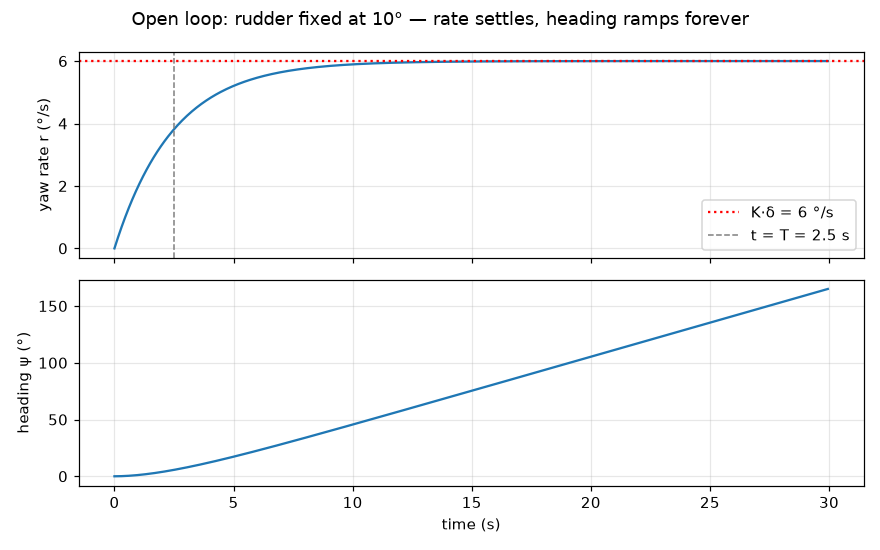
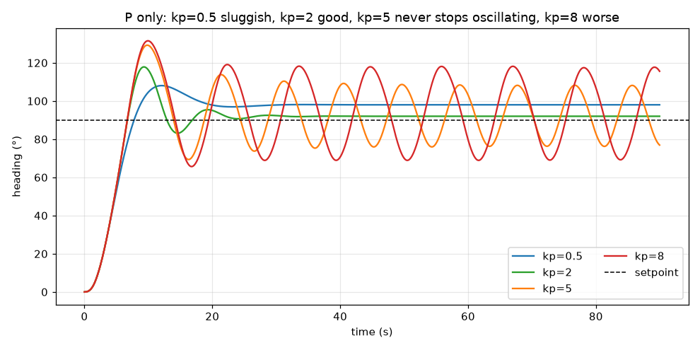
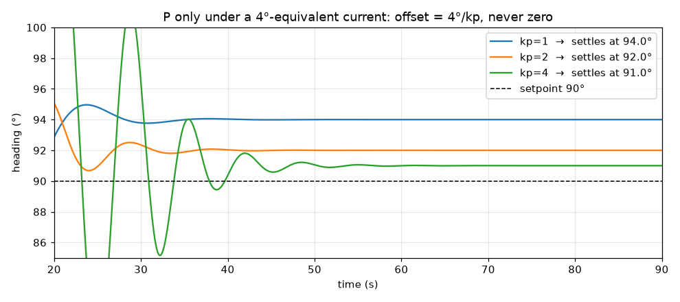
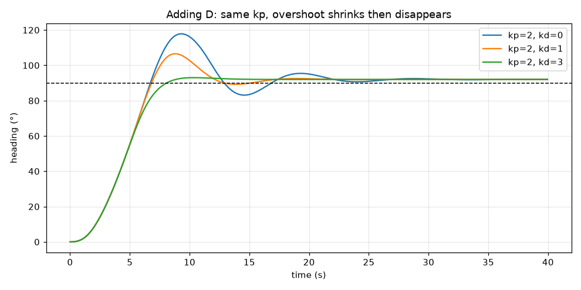
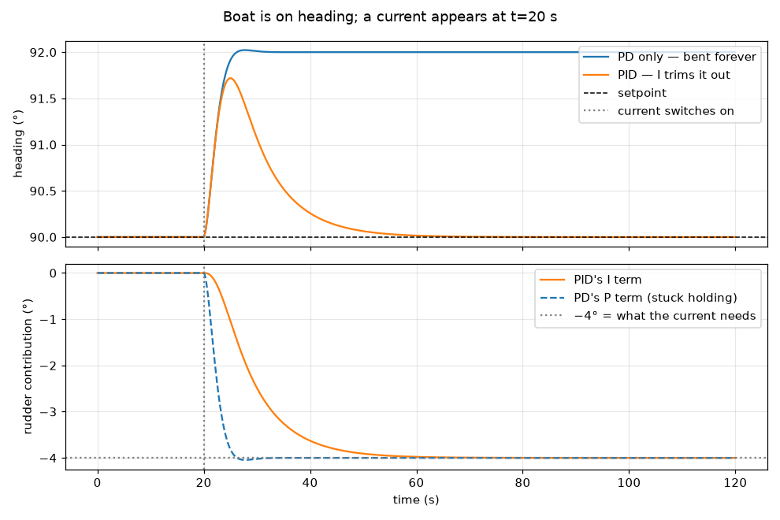
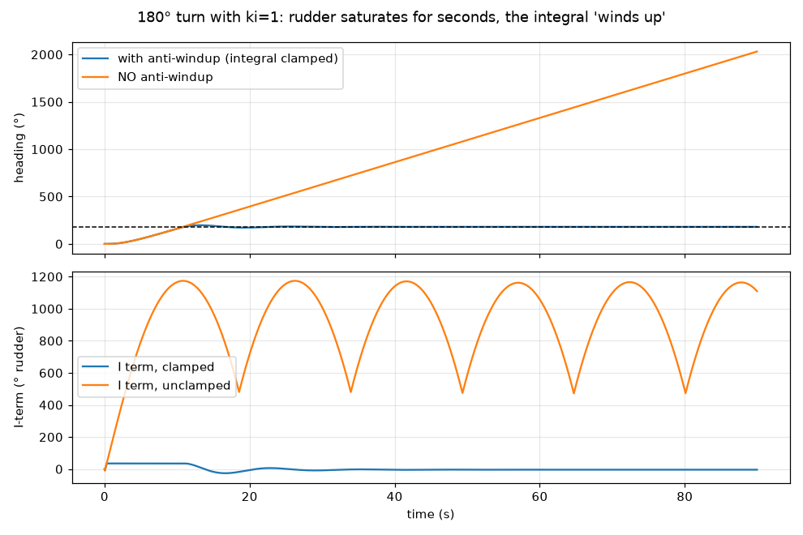
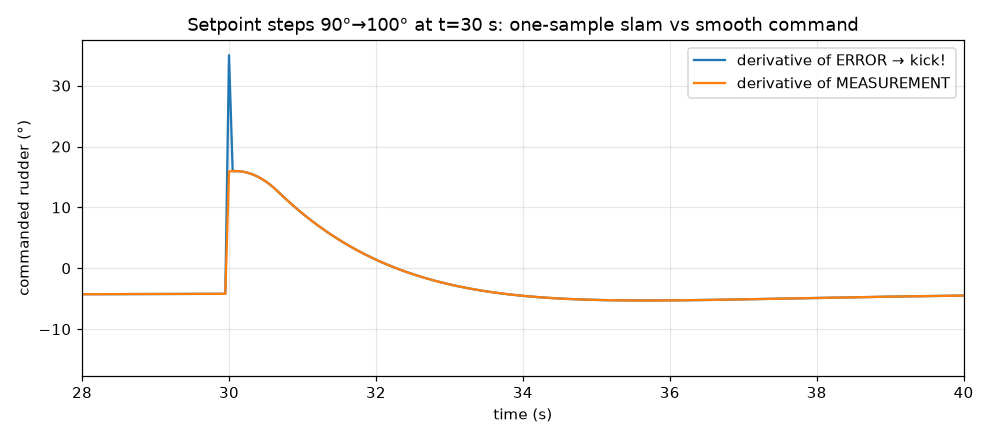
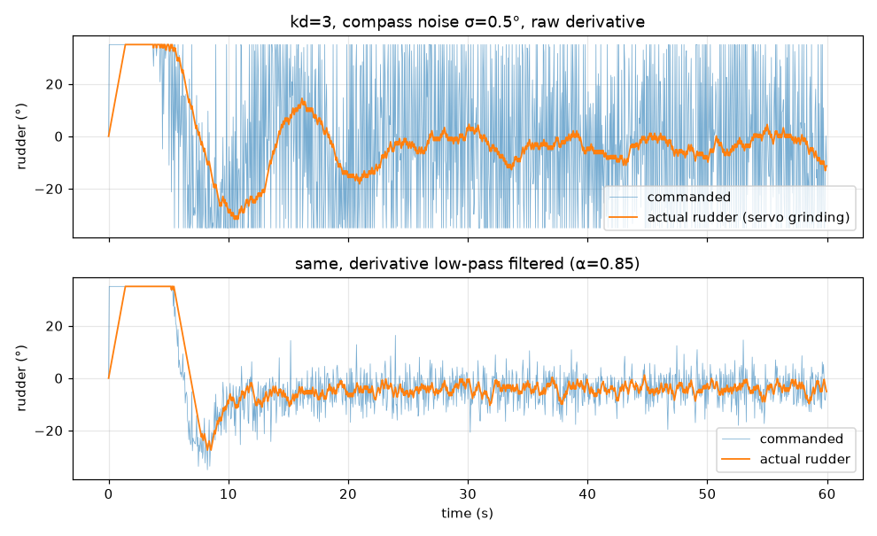
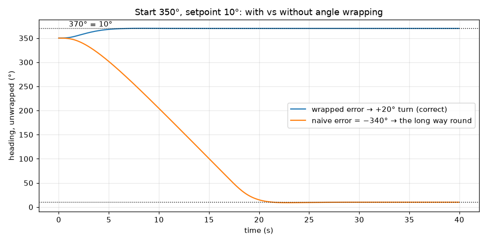
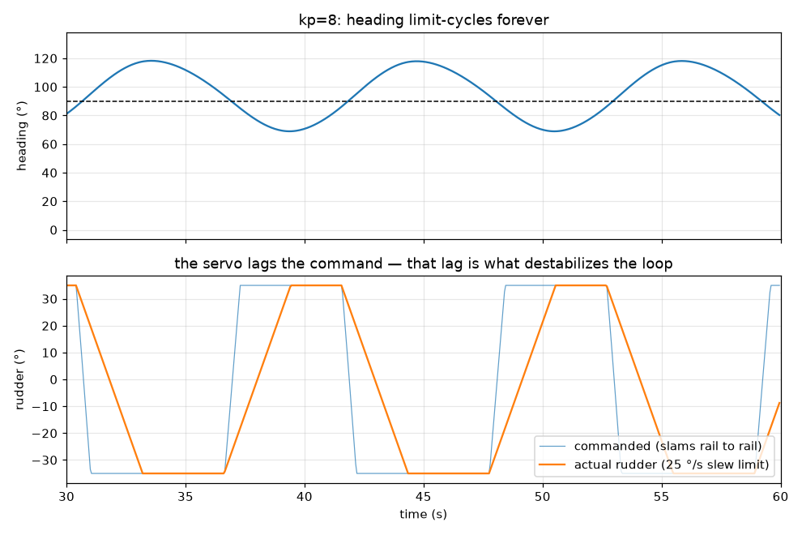

# PID for a USV — learning by cases

How to use these notes: each case is one experiment. Read the setup, predict
what happens, look at the plot, then reproduce it yourself in
`usv_heading_sim.py` by changing the gains. Every figure here was generated
from the exact model in that simulator (`_make_figures_SPOILERS.py` —
contains a finished PID, don't open it before writing your own).

---

## The cast: one boat, used in every case

| Thing | Value | Meaning |
|---|---|---|
| Plant model | Nomoto: `T·ṙ + r = K·δ`, `ψ̇ = r` | rudder δ → yaw rate r → heading ψ |
| K = 0.6 | (rad/s)/rad | steady yaw rate per rad of rudder: 10° rudder → 6 °/s turn |
| T = 2.5 s | time constant | how long the hull takes to "wind up" to that rate |
| Rudder stop | ±35° | actuator saturation |
| Servo slew | 25 °/s | the rudder physically can't jump — this matters (Case 9) |
| Current/wind | ≡ 4° stuck rudder | constant disturbance pushing the bow |
| Control loop | 20 Hz (dt = 0.05 s) | typical hobby-USV rate |

---

## Case 0 — No controller: what the boat does on its own

**Setup:** hold the rudder at a fixed 10°, hands off, watch.



**What to notice:**
- Yaw rate doesn't jump to 6 °/s — it *climbs* there, reaching ~63% at
  t = T = 2.5 s. The hull has rotational inertia and hydrodynamic lag.
- Heading never settles. It ramps forever, because heading is the
  **integral** of yaw rate.

**The two facts that cause everything below:**
1. *The rudder controls rate, not heading.* You can't command a heading
   directly; you command turning, and heading accumulates.
2. *The response lags.* Whatever the rudder does now, the boat keeps doing
   the old thing for a couple seconds.

Lag + accumulation = momentum into the target = overshoot. Keep this case in
your head; every later case is a fight against these two facts.

---

## The control law you'll implement

Per timestep (dt = 0.05 s):

```python
error      = wrap(setpoint - heading)        # rad, ALWAYS wrapped (Case 8)
integral  += error * dt                      # rad·s, persists across calls
derivative = (error - prev_error) / dt       # rad/s

u = kp*error + ki*integral + kd*derivative   # rad of rudder
u = clamp(u, -RUDDER_MAX, +RUDDER_MAX)
```

Units of the gains (worth internalizing — it makes tuning less mystical):

| Gain | Units | Reads as |
|---|---|---|
| kp | rad rudder / rad error | "how much rudder per degree I'm off" |
| ki | rad rudder / (rad·s) | "how fast I lean on a persistent error" |
| kd | rad rudder / (rad/s) | "how much rudder per degree-per-second of swing" |

### Worked example — one timestep by hand

Mid-maneuver snapshot, gains kp=2, ki=0.2, kd=3:
heading 60°, setpoint 90°, previous error 31°, integral so far 0.80 rad·s.

| Step | Computation | Result |
|---|---|---|
| error | wrap(90° − 60°) = 30° | 0.5236 rad |
| P | 2 × 0.5236 | **+1.047 rad** (= 60°) |
| integral | 0.80 + 0.5236 × 0.05 | 0.8262 rad·s |
| I | 0.2 × 0.8262 | **+0.165 rad** (= 9.5°) |
| derivative | (0.5236 − 0.5411) / 0.05 | −0.349 rad/s (bow closing at 20 °/s) |
| D | 3 × (−0.349) | **−1.047 rad** (= −60°) |
| sum | 1.047 + 0.165 − 1.047 | 0.165 rad = **9.5°**, inside ±35° → output 9.5° |

Read that result again: the boat is still 30° from the setpoint, yet P and D
*exactly cancel* and the controller is nearly coasting. The bow is already
swinging in at 20 °/s — pushing harder would just mean overshooting harder.
That cancellation **is** damping. (P alone would have commanded 60° → clamped
to 35° → full speed into the overshoot.)

---

## Case 1 — P only: the spring

**Setup:** `u = kp·e`, turn from 0° to 90°. Sweep kp.



**What to notice:**
- **kp=0.5** — sluggish, big sloppy overshoot, settles ~98° (offset! → Case 2).
- **kp=2** — brisk, rings once, settles ~92°. Usable.
- **kp=5** — never settles. ±16° oscillation, forever. This is the
  *ultimate gain* Ku of this boat (period Tu ≈ 9 s).
- **kp=8** — bigger, faster oscillation, ±25°.

**Why oscillation:** P is a spring — force proportional to stretch. A mass on
a spring with weak damping oscillates. The boat's only "friction" here is the
hull's yaw damping, and past kp≈5 it isn't enough (the rudder servo's lag
finishes the job — Case 9).

**The pattern to remember:** more kp = faster response, less leftover offset,
more ringing — until it never stops ringing.

---

## Case 2 — P can't beat a steady current

**Setup:** same P-only boat, but look closely at where it settles. The
current pushes the bow like 4° of stuck rudder.



**The math (do this once, it's 3 lines):** to hold a steady heading, net yaw
moment must be zero, so the rudder must hold −4° to cancel the current. A
P controller can only output `kp·e`, so:

```
kp·e_ss = −4°   →   e_ss = −4°/kp
```

| kp | offset | settles at |
|---|---|---|
| 1 | 4° | 94° |
| 2 | 2° | 92° |
| 4 | 1° | 91° |

**The trap:** "I'll just crank kp to shrink the offset" — but Case 1 says
kp ≥ 5 oscillates. With usable gains, the offset is **structural**: at zero
error, a P controller outputs zero rudder, and zero rudder loses to the
current. Something else must hold the rudder while error is zero → Case 4.

---

## Case 3 — Adding D: the damper

**Setup:** kp=2 fixed, add `kd·(de/dt)`. Sweep kd.



**What to notice:**
- kd=0: overshoots to ~118°, rings.
- kd=1: one small overshoot.
- kd=3: glides in like a parking valet. No overshoot.

**Why:** error shrinking fast ⇒ derivative is negative ⇒ D *opposes* P during
the approach (re-read the worked example — that's the mechanism). D only acts
on *change*: once on heading and steady, D = 0. It cannot fix offset, it
cannot do the turn; it only tames motion.

**Coasting rule of thumb:** with `kp·e = kd·ė` the controller goes neutral.
At kp=2, kd=3, the push stops once the closing rate (°/s) exceeds ⅔ of the
remaining error (°) — e.g. 30° out, closing faster than 20 °/s → easing off.

---

## Case 4 — I: the trim tab (what integral is FOR)

**Setup:** boat already settled on 90°. At t=20 s the current switches on.
Compare PD (kp=2, kd=3) against PID (same + ki=0.2).



**What to notice (bottom panel is the lesson):**
- The PD boat gets bent to 92° and stays there. Its P term ends up holding
  −4° of rudder — but P can only output −4° by *keeping the error at −2°*.
  **PD holds course by staying wrong.**
- The PID boat dips to ~91.7°, then recovers to 90.0 exactly. Its I term
  ramps to −4° and stays — the integral has *learned the current*. With I
  carrying the trim, error returns to zero and P relaxes to zero.
- It takes ~30 s. That slowness is a feature: the integral should respond to
  things that *persist*, not to every wave.

**Why ki must be small:** the integral is a memory. Big ki = jumpy
conclusions from short memory = overshoot and slow weaving (try ki=2 in the
sim). The integral should be the slowest thing in the loop.

---

## Case 5 — Integral windup: I's dark side

**Setup:** big maneuver — 0° to 180° — with a hot integral (ki=1, kp=2,
kd=3). During the turn the rudder is pinned at +35° for ~9 seconds while the
error is huge. The integral doesn't know the rudder is maxed; it keeps
accumulating: ~1.5 rad average error × 9 s × ki=1 ≈ 13 rad ≈ **750° of
commanded rudder** stored in the I term.



**What to notice:** with the integral clamped (blue), a clean 180° turn.
Unclamped (orange), the boat blows through 180°, and by the time the error
changes sign the integral is so bloated the rudder stays pinned — the boat
**does donuts forever** (top panel: heading climbs past 2000°; the integral
partially unwinds each lap and re-winds, never recovering).

This isn't an exotic failure. Command a USV waypoint behind you, rudder
saturates, integral winds up — every hobby autopilot author meets this bug.

**Fixes (pick one when you implement `update()`):**
1. **Clamp** the integral so `ki·integral` can never exceed the rudder limit
   (what the blue trace does — simplest, works).
2. **Conditional integration** — don't integrate on samples where the output
   is saturated.
3. **Back-calculation** — subtract `(u_unclamped − u_clamped)·k` from the
   integral each step; industry standard, smoothest.

---

## Case 6 — Derivative kick

**Setup:** cruising at 90°, new waypoint → setpoint steps to 100°. The
*error* jumps 10° in one 0.05 s sample, so:

```
derivative = 10° / 0.05 s = 200 °/s   →   D = kd·3.49 rad/s ≈ 600° of rudder (!)
```



**What to notice:** with derivative-of-error (blue), one sample slams the
command to the +35° stop — a spike that achieves nothing and beats up the
servo. The boat didn't suddenly start swinging; *your setpoint moved*.

**Fix:** differentiate the **measurement** instead. When the setpoint is
constant, `de/dt = −dψ/dt`, so it's the same signal — but it ignores setpoint
jumps. One sign flip in your code:

```python
derivative = -(measurement - prev_measurement) / dt    # instead of d(error)
```

---

## Case 7 — Noise: D's other dark side

**Setup:** real compass, σ = 0.5° of noise per reading. The derivative of
noise is huge: two adjacent readings differ by ~0.7° on average, so

```
derivative noise ≈ 0.5°·√2 / 0.05 s ≈ 14 °/s   →   ×kd=3  ≈ 42° of rudder garbage
```



**What to notice:** top — the command (thin) is white noise slamming the
stops; the servo (thick) grinds at its 25 °/s slew limit nonstop. The boat
holds course fine! But your servo dies in a week and your battery in an hour.

**Fix:** low-pass filter the derivative:

```python
d_filtered = alpha * d_filtered + (1 - alpha) * d_raw    # alpha ≈ 0.85
```

Bottom panel: same noise, filtered — chatter cut to a fraction. Trade-off:
the filter adds a little lag to D, weakening damping slightly. (Bigger
heading-noise problems get solved upstream by fusing gyro + compass — that's
what an EKF/complementary filter on your flight controller does.)

---

## Case 8 — Angle wrapping: THE classic vehicle bug

**Setup:** heading 350°, setpoint 10°. The boat is 20° away. Naive
subtraction says otherwise:

```
e = 10 − 350 = −340°        # "turn 340° clockwise" — catastrophically wrong
wrap(e) = +20°              # correct
```



**What to notice:** the naive controller turns 340° the long way around. On
open water that's comedy; near a dock it's a crash. And the bug is invisible
in testing unless your test happens to cross north.

**The fix, used on every error before it enters the PID:**

```python
def wrap(angle):                                  # → (-pi, pi]
    return (angle + math.pi) % (2 * math.pi) - math.pi

error = wrap(setpoint - heading)
```

---

## Case 9 — Why "raise kp until it oscillates" actually works

Honest confession about the model: a bare first-order Nomoto boat with an
ideal rudder **never** goes unstable from kp — in early tests, even kp=100
settled fine. So why does every real boat oscillate at high gain?

Because real actuators lag. Our servo slews at 25 °/s — it takes 2.8 s to go
stop-to-stop. At high kp the command flips rail-to-rail faster than the servo
can follow:



**What to notice:** the command (thin) is a square wave; the actual rudder
(thick) is a sawtooth lagging behind. The rudder is always doing what the boat
needed a second ago. That delay is *phase lag*, and phase lag at high gain is
the universal recipe for oscillation. Real boats have more of it: sensor
filter delay, comms latency, thruster spin-up, hull dynamics. More lag →
lower usable kp.

This is also why the sim has the slew limit built in — tuning against an
unrealistically ideal plant teaches you gains that fall apart on the water.

---

## Tuning walkthrough — this boat, by the book

Step-by-step recipe (do it live in the sim):

1. **ki=0, kd=0. Raise kp until sustained oscillation.** On this boat that's
   kp ≈ 5 (= Ku), oscillating with period Tu ≈ 9 s. Back off to half:
   **kp = 2 — 2.5**.
2. **Raise kd until overshoot is gone.** Here kd ≈ 3 kills it. Too much kd →
   twitchy, noise-sensitive (Case 7).
3. **Add the smallest ki that removes offset in reasonable time.**
   ki = 0.2 trims the current out in ~30 s. If you see slow weaving, halve it.

Result: **kp=2, ki=0.2, kd=3** — the gains used in Cases 3–7.

Ziegler–Nichols, for comparison, computes from the same Ku=5, Tu=9:

| | kp = 0.6·Ku | ki = 1.2·Ku/Tu | kd = 0.075·Ku·Tu |
|---|---|---|---|
| ZN classic | 3.0 | 0.67 | 3.4 |

kd agrees with ours; ZN's kp and especially ki are hotter (ZN targets fast
disturbance rejection and tolerates overshoot). Treat ZN as a starting point,
then de-tune toward smooth.

---

## From the sim to your actual USV

| In the sim | On the boat (ROS2) |
|---|---|
| `psi` | yaw from IMU / `/odometry/filtered` (already fused) |
| `wrap(sp − psi)` | same — do it in your node, every cycle |
| `DT = 0.05` | timer callback ~20–50 Hz, but use *measured* dt |
| rudder δ | rudder servo, or differential thrust: `left = base+u, right = base−u` |
| `RUDDER_MAX` | your actuator limits — clamp in software too |
| current disturbance | real current/wind — your I term's job |

Field-tuning order is the same: P → D → I, starting low. Two safety notes:
have a hardware kill switch before any autonomy test, and `reset()` the PID
whenever the controller is re-engaged (a stale integral from 5 minutes ago is
a windup bug you haven't met yet).

---

## Files here

- `pid_controller.py` — the PID class. **You implement `update()`** (Cases 5
  and 6 are design choices inside it).
- `usv_heading_sim.py` — this exact boat. Exercises at the bottom walk the
  cases in order.
- `_make_figures_SPOILERS.py` — regenerates every figure. Full PID inside;
  read it only after writing yours, then diff the two.
